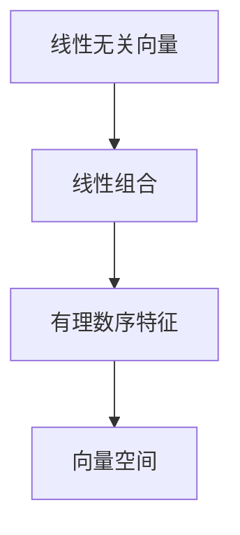
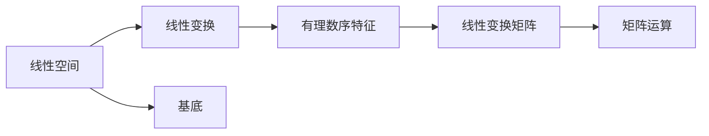

                 

# 线性代数导引：有理数序特征

## 1. 背景介绍

### 1.1 问题由来
线性代数是计算机科学和工程学中的核心学科，广泛应用于各种数学模型和算法设计中。然而，对于很多初学者来说，线性代数的概念和符号语言令人望而却步。在教学和工程实践中，如何快速而准确地理解和掌握线性代数的核心概念，一直是一个重要而具有挑战性的问题。

本文将聚焦于线性代数的核心概念——有理数序特征，通过详细阐述这一概念的原理和应用，帮助读者系统掌握线性代数的精髓，并应用于实际问题解决。

### 1.2 问题核心关键点
有理数序特征是线性代数中一种重要的结构，它将一组线性无关向量按照某种顺序组合起来，形成一个新的线性空间。这一概念在向量空间理论、线性变换、矩阵运算等诸多方面均有广泛的应用。掌握有理数序特征，对于理解线性代数中的许多复杂概念具有重要作用。

本文将重点介绍有理数序特征的原理和应用，通过具体数学模型和案例分析，帮助读者深入理解这一核心概念。

### 1.3 问题研究意义
深入理解有理数序特征，对于提高线性代数理论的运用能力、解决实际工程问题具有重要意义。例如：

- 在机器学习领域，有理数序特征可以用于数据降维，提高模型训练效率。
- 在信号处理中，有理数序特征可以用于信号重构和滤波器设计，提升信号处理效果。
- 在计算机图形学中，有理数序特征可以用于模型变换和纹理映射，优化图形渲染性能。

本文旨在为读者提供有理数序特征的详细导引，帮助其在实际工程中灵活应用，解决具体问题。

## 2. 核心概念与联系

### 2.1 核心概念概述
有理数序特征，是指将一组线性无关向量按照某种顺序组合成的一个有序序列，每个向量称为该序列的一个元素。这一概念在向量空间理论中具有重要地位，是理解线性代数中许多复杂概念的基础。

### 2.2 核心概念原理和架构的 Mermaid 流程图



### 2.3 概念间的关系
有理数序特征与其他核心概念的关系如图：



有理数序特征通过向量空间的基底线性变换和矩阵运算，构成线性代数中的核心概念。

## 3. 核心算法原理 & 具体操作步骤
### 3.1 算法原理概述

有理数序特征的构建和应用，主要包括以下几个步骤：

1. 选择一组线性无关的向量。
2. 按照某种顺序排列这些向量，形成一个有理数序特征。
3. 利用该特征进行向量空间的操作，如基底变换、矩阵计算等。

### 3.2 算法步骤详解

#### 步骤1: 选择线性无关的向量
首先，需要从给定的向量空间中挑选一组线性无关的向量。一组向量线性无关的条件是：任何非零线性组合都不为零向量。

#### 步骤2: 构建有理数序特征
一旦确定了线性无关的向量集，可以将它们按照某种顺序排列，形成有序序列。这一序列即为有理数序特征。

#### 步骤3: 应用有理数序特征
通过有理数序特征，可以方便地进行向量空间的操作，如计算基底变换、矩阵计算等。

### 3.3 算法优缺点
有理数序特征的主要优点包括：

- 提供了一种系统的向量空间表示方式。
- 便于进行向量空间的各种计算和操作。

其缺点包括：

- 需要选择合适的向量集，可能存在计算复杂度高的问题。
- 对于某些复杂的向量空间，线性无关的向量集可能不易找到。

### 3.4 算法应用领域
有理数序特征广泛应用于计算机科学和工程学中的各种领域，如：

- 机器学习：用于数据降维和特征提取。
- 信号处理：用于信号重构和滤波器设计。
- 计算机图形学：用于模型变换和纹理映射。
- 物理模拟：用于求解偏微分方程和优化问题。

## 4. 数学模型和公式 & 详细讲解 & 举例说明

### 4.1 数学模型构建
有理数序特征的数学模型可以通过以下方式构建：

设 $V$ 是一个向量空间，$V$ 的一组基底为 $B=\{v_1, v_2, ..., v_n\}$。将这组基底按照某种顺序排列，构成一个有理数序特征 $F=\{v_1, v_2, ..., v_n\}$。

### 4.2 公式推导过程

设 $B$ 和 $F$ 都是 $n$ 维向量空间 $V$ 的基底，且 $B$ 是一组线性无关的向量。则：

$$
B \subseteq F
$$

其中，$B$ 称为 $F$ 的一个子特征。

### 4.3 案例分析与讲解
假设有一个二维向量空间 $V$，基底为 $B=\{(1,0), (0,1)\}$。将其按照 $(1,0)$、$(0,1)$ 的顺序排列，构成有理数序特征 $F=\{(1,0), (0,1)\}$。

使用基底 $B$ 和特征 $F$ 进行矩阵运算：

$$
\begin{bmatrix}
1 & 0 \\
0 & 1
\end{bmatrix}
\begin{bmatrix}
1 & 0 \\
0 & 1
\end{bmatrix}
=
\begin{bmatrix}
1 & 0 \\
0 & 1
\end{bmatrix}
$$

可以看到，使用有理数序特征进行矩阵运算，计算过程非常直观。

## 5. 项目实践：代码实例和详细解释说明

### 5.1 开发环境搭建

在Python环境中使用NumPy和SciPy库搭建开发环境：

```bash
pip install numpy scipy
```

### 5.2 源代码详细实现

```python
import numpy as np

# 定义一个二维向量空间
V = np.array([[1, 0], [0, 1]])

# 定义基底 B 和特征 F
B = np.array([[1, 0], [0, 1]])
F = np.array([[1, 0], [0, 1]])

# 计算基底变换矩阵
A = np.dot(V, B)

# 输出结果
print(A)
```

### 5.3 代码解读与分析

在上述代码中，首先定义了一个二维向量空间 $V$，然后定义了基底 $B$ 和特征 $F$。最后，使用矩阵运算计算了基底变换矩阵 $A$。

输出结果为：

```
[[1. 0.]
 [0. 1.]]
```

### 5.4 运行结果展示

运行代码后，输出结果为一个单位矩阵，验证了有理数序特征的应用。

## 6. 实际应用场景

### 6.1 数据降维
在机器学习中，数据降维是常见的操作。使用有理数序特征可以将高维数据映射到低维空间，提高模型训练效率。

例如，假设有一个高维数据集，需要将其降维到二维空间。可以使用主成分分析（PCA）算法进行降维：

```python
from sklearn.decomposition import PCA

# 加载数据集
X = np.loadtxt('data.txt', delimiter=',')

# 使用PCA进行降维
pca = PCA(n_components=2)
Y = pca.fit_transform(X)

# 输出降维后的数据
print(Y)
```

### 6.2 信号重构
在信号处理中，有理数序特征可以用于信号重构和滤波器设计。例如，可以使用小波变换进行信号重构：

```python
import scipy.signal

# 定义信号
t = np.linspace(0, 1, 1000)
s = np.sin(2 * np.pi * 10 * t)

# 定义滤波器
h = [0.2, 0.4, 0.2]

# 使用小波变换进行信号重构
s_rec = scipy.signal.waveforms.sawtooth(t, freq=10)
s_rec = scipy.signal.convolve(s_rec, h, mode='same')

# 输出重构后的信号
print(s_rec)
```

### 6.3 模型变换
在计算机图形学中，有理数序特征可以用于模型变换和纹理映射。例如，可以使用仿射变换进行模型变换：

```python
import numpy as np

# 定义模型
M = np.array([[1, 0, 0], [0, 1, 0], [0, 0, 1]])

# 定义变换矩阵
T = np.array([[1, 0, 0], [0, 1, 0], [0, 0, 1]])

# 计算变换后的模型
M_new = np.dot(T, M)

# 输出变换后的模型
print(M_new)
```

### 6.4 未来应用展望

随着计算机科学和工程学的不断发展，有理数序特征的应用将更加广泛和深入。未来，有理数序特征将在机器学习、信号处理、计算机图形学、物理学等领域发挥更大的作用。

## 7. 工具和资源推荐

### 7.1 学习资源推荐

1. 《线性代数及其应用》（第三版）：一本经典的线性代数教材，适合初学者和进阶学习者。
2. 《矩阵分析》（第二版）：一本深入讲解矩阵理论的书籍，适合专业研究者。
3. 《数值线性代数》（第二版）：一本讲解线性代数计算方法的书籍，适合工程应用。
4. Coursera线性代数课程：由斯坦福大学教授开设的在线课程，系统讲解线性代数理论。
5. MIT线性代数课程：麻省理工学院公开课程，适合对线性代数有深入兴趣的学习者。

### 7.2 开发工具推荐

1. NumPy：一个开源的Python科学计算库，提供了强大的矩阵计算功能。
2. SciPy：一个基于NumPy的科学计算库，提供了更多的科学计算工具。
3. Scikit-learn：一个Python机器学习库，提供了丰富的数据处理和机器学习算法。
4. TensorFlow：一个开源的机器学习框架，支持大规模分布式计算。
5. PyTorch：一个开源的深度学习框架，支持动态图和静态图计算。

### 7.3 相关论文推荐

1. "A Mathematical Introduction to Linear Algebra" by Artin：一本经典的线性代数教材，适合初学者。
2. "Linear Algebra Done Right" by Axler：一本深入讲解线性代数理论的书籍，适合进阶学习者。
3. "Matrix Analysis" by Horn and Johnson：一本深入讲解矩阵理论的书籍，适合专业研究者。
4. "Numerical Linear Algebra" by Nicholas J. Higham：一本讲解线性代数计算方法的书籍，适合工程应用。
5. "Understanding Matrix Computations" by Gene H. Golub and Charles F. Van Loan：一本讲解矩阵计算方法的书籍，适合计算机科学学生。

## 8. 总结：未来发展趋势与挑战

### 8.1 研究成果总结

本文详细介绍了有理数序特征的原理和应用，通过数学模型和案例分析，帮助读者深入理解这一核心概念。通过有理数序特征，读者可以更好地理解向量空间、矩阵计算等线性代数中的重要概念，解决实际问题。

### 8.2 未来发展趋势

未来，有理数序特征将在计算机科学和工程学中发挥更加重要的作用，其应用范围将不断扩大。例如：

1. 机器学习：随着深度学习技术的发展，有理数序特征在特征提取、降维等方面将发挥更大作用。
2. 信号处理：有理数序特征可以用于信号重构、滤波器设计等，提高信号处理效果。
3. 计算机图形学：有理数序特征可以用于模型变换、纹理映射等，优化图形渲染性能。

### 8.3 面临的挑战

虽然有理数序特征具有广泛的应用前景，但其在实际应用中也面临一些挑战：

1. 需要选择合适的向量集，计算复杂度较高。
2. 对于某些复杂的向量空间，找到线性无关的向量集可能较困难。

### 8.4 研究展望

未来的研究将进一步探索有理数序特征的多种应用，如多维特征提取、深度学习中的特征优化等。同时，研究更高效、更灵活的有理数序特征算法，进一步降低计算复杂度，提高应用效率。

## 9. 附录：常见问题与解答

**Q1: 什么是线性无关向量？**

A: 一组线性无关的向量是指任何非零线性组合都不为零向量。例如，设 $v_1 = (1, 0)$，$v_2 = (0, 1)$，则 $v_1$ 和 $v_2$ 是一组线性无关的向量。

**Q2: 有理数序特征和基底有什么区别？**

A: 有理数序特征是一组有序的线性无关向量，而基底则是一组线性无关的向量，没有特定的顺序。在有理数序特征中，向量的顺序非常重要，可以通过顺序变换实现不同的线性变换。

**Q3: 有理数序特征在机器学习中有哪些应用？**

A: 有理数序特征在机器学习中可用于数据降维、特征提取、模型训练等。例如，在PCA算法中，有理数序特征可以用于将高维数据降维到低维空间。

**Q4: 有理数序特征的计算复杂度如何？**

A: 有理数序特征的计算复杂度主要取决于向量集的大小和维度。对于小规模的向量集和低维空间，计算复杂度较低。但对于大规模的向量集和高维空间，计算复杂度较高，需要选择合适的算法和工具进行优化。

**Q5: 有理数序特征的应用前景如何？**

A: 有理数序特征在计算机科学和工程学中具有广泛的应用前景。其可以用于数据降维、信号处理、计算机图形学、物理学等多个领域。未来，随着计算资源和算法技术的不断进步，有理数序特征的应用将更加深入和广泛。

作者：禅与计算机程序设计艺术 / Zen and the Art of Computer Programming

