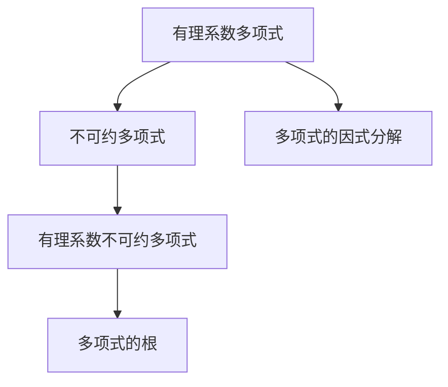

                 

# 线性代数导引：有理系数不可约多项式

## 1. 背景介绍

### 1.1 问题由来
在现代数学和工程应用中，多项式作为一个基本概念和工具，无处不在。无论是计算几何、信号处理、数据科学，还是量子计算、密码学等领域，多项式都是不可或缺的工具。然而，关于多项式的研究远不止于此。随着研究的深入，多项式理论已经发展成为一门独立的数学分支，对许多领域产生了深远的影响。

本系列博客将从有理系数不可约多项式这一核心概念出发，系统讲解其基本原理和应用场景，带领读者深入了解多项式代数的基本理论和实践技巧。

### 1.2 问题核心关键点
有理系数不可约多项式是多项式理论中的一个重要概念，在实际应用中有着广泛的应用，如编码理论、密码学、数论等。其核心在于理解不可约多项式的定义、性质以及如何通过因式分解来寻找多项式的根。

具体来说，本系列博客将从以下几个方面进行阐述：

1. 有理系数不可约多项式的定义和性质。
2. 不可约多项式因式分解的基本方法。
3. 不可约多项式的具体应用场景。
4. 有理系数不可约多项式与其他数学概念的联系和区别。

这些内容将帮助读者全面掌握有理系数不可约多项式的理论基础和实践技巧，为进一步深入研究多项式代数奠定坚实的基础。

## 2. 核心概念与联系

### 2.1 核心概念概述

为了更好地理解有理系数不可约多项式，本节将介绍几个紧密相关的核心概念：

- 有理系数多项式：系数为有理数的单变量多项式，形式为 $f(x) = a_nx^n + a_{n-1}x^{n-1} + \dots + a_1x + a_0$，其中 $a_i \in \mathbb{Q}$。
- 不可约多项式：如果一个多项式无法进一步因式分解为两个次数更低的非零多项式的乘积，则称其为不可约多项式。
- 有理系数不可约多项式：系数为有理数的不可约多项式。
- 多项式的根：如果 $x_0$ 满足 $f(x_0) = 0$，则称 $x_0$ 为多项式 $f(x)$ 的根。
- 多项式的因式分解：将多项式表示为若干个不可约多项式的乘积。

这些概念之间的关系可以用以下 Mermaid 流程图来展示：



这个流程图展示了有理系数多项式、不可约多项式、有理系数不可约多项式、多项式根和多项式因式分解之间的关系：

- 有理系数多项式可以分解为若干个不可约多项式的乘积，其中不可约多项式是有理系数不可约多项式的一种特殊形式。
- 有理系数不可约多项式的根是多项式的零点，而多项式的因式分解是将多项式分解为不可约多项式乘积的过程。

### 2.2 概念间的关系

这些核心概念之间存在着紧密的联系，形成了有理系数不可约多项式的完整理论框架。下面是进一步的解释：

- 有理系数多项式和不可约多项式是多项式理论的基本概念，而多项式的因式分解是将多项式表示为不可约多项式乘积的关键步骤。
- 有理系数不可约多项式是特殊的有理系数多项式，其不可约性是研究多项式理论的重要基础。
- 多项式的根是通过因式分解得到的结果，是研究多项式性质的重要工具。
- 不可约多项式和有理系数不可约多项式的因式分解问题，是多项式理论中的核心难点之一。

这些概念共同构成了有理系数不可约多项式理论的基础，对其理解和应用至关重要。

## 3. 核心算法原理 & 具体操作步骤
### 3.1 算法原理概述

有理系数不可约多项式的因式分解是多项式理论中的经典问题，其算法原理可以追溯到17世纪数学家Raphael Bombelli的研究。本节将介绍有理系数不可约多项式因式分解的算法原理。

#### 3.1.1 基本思想

有理系数不可约多项式的因式分解，可以从寻找多项式的根开始。如果一个多项式有 $k$ 个不同的根，那么它就可以被表示为 $k$ 个不可约多项式的乘积。具体来说，有理系数不可约多项式的因式分解步骤如下：

1. 使用求根公式或迭代法找到多项式的所有根。
2. 将多项式表示为每个根对应的因式乘积的形式。
3. 对每个因式进行化简，得到最终的因式分解结果。

#### 3.1.2 算法框架

为了清晰地展示因式分解的算法框架，我们首先定义一些关键概念：

- $f(x)$：待分解的多项式。
- $r_1, r_2, \dots, r_k$：多项式的所有根。
- $g_1(x), g_2(x), \dots, g_k(x)$：对应于每个根 $r_i$ 的因式。

有理系数不可约多项式的因式分解算法步骤如下：

1. 使用求根公式或迭代法找到多项式的所有根 $r_1, r_2, \dots, r_k$。
2. 对每个根 $r_i$，构造对应的因式 $g_i(x) = (x - r_i)$。
3. 将多项式 $f(x)$ 表示为 $g_1(x) \cdot g_2(x) \cdot \dots \cdot g_k(x)$ 的形式。
4. 对每个因式进行化简，得到最终的因式分解结果。

### 3.2 算法步骤详解

#### 3.2.1 寻找多项式的根

多项式的根可以通过求根公式或迭代法来找到。具体步骤如下：

1. 使用求根公式 $r = \frac{-b \pm \sqrt{b^2 - 4ac}}{2a}$，其中 $a, b, c$ 为多项式 $f(x) = ax^2 + bx + c$ 的系数。
2. 对于高次多项式，使用数值方法如牛顿迭代法、二分法等进行迭代求解。

#### 3.2.2 构造因式

找到多项式的根后，可以构造对应的因式 $g_i(x) = (x - r_i)$。需要注意的是，当根重数大于1时，对应的因式也应写为 $(x - r_i)^{m_i}$，其中 $m_i$ 为根的重数。

#### 3.2.3 因式化简

对于每个因式 $g_i(x) = (x - r_i)$，需要进行化简。如果根 $r_i$ 是有理数，则因式保持不变。如果根是无理数，则无法进一步化简。

### 3.3 算法优缺点

#### 3.3.1 优点

有理系数不可约多项式因式分解算法的优点包括：

1. 简单易懂：算法步骤清晰，易于理解和实现。
2. 通用性强：适用于任意次数的多项式。
3. 结果可靠：通过求根公式和迭代法，可以精确找到多项式的所有根。

#### 3.3.2 缺点

有理系数不可约多项式因式分解算法的主要缺点包括：

1. 计算复杂度高：高次多项式的求根过程复杂，计算量大。
2. 数值不稳定：使用数值迭代法时，可能会因数值精度问题导致根的近似误差。
3. 无法处理高次多项式：当多项式的次数较高时，求根和因式分解过程非常复杂，甚至可能无法完成。

### 3.4 算法应用领域

有理系数不可约多项式因式分解算法在数学、工程、物理等领域有广泛的应用。以下是几个典型的应用场景：

1. 编码理论：在纠错编码中，多项式可以用来表示线性码，其因式分解形式可以用于码的构造和解码。
2. 密码学：在公钥密码体制中，多项式因式分解是求解困难问题，具有重要的加密和解密作用。
3. 数论：多项式的因式分解在数论中有重要的应用，如分解质因数、求解离散对数等问题。
4. 信号处理：在信号处理中，多项式可以用来表示信号的频域特征，其因式分解形式可以用于信号分析和滤波。

## 4. 数学模型和公式 & 详细讲解 & 举例说明

### 4.1 数学模型构建

有理系数不可约多项式的因式分解可以表示为：

$$
f(x) = a_nx^n + a_{n-1}x^{n-1} + \dots + a_1x + a_0
$$

其中 $a_i \in \mathbb{Q}$。多项式的根可以通过求根公式或迭代法求解。假设多项式有 $k$ 个不同的根 $r_1, r_2, \dots, r_k$，则多项式可以表示为：

$$
f(x) = g_1(x) \cdot g_2(x) \cdot \dots \cdot g_k(x)
$$

其中 $g_i(x) = (x - r_i)$。

### 4.2 公式推导过程

#### 4.2.1 求根公式

对于二次多项式 $ax^2 + bx + c$，求根公式为：

$$
r = \frac{-b \pm \sqrt{b^2 - 4ac}}{2a}
$$

其中 $r$ 为多项式的根。

#### 4.2.2 牛顿迭代法

对于高次多项式 $f(x)$，使用牛顿迭代法求解根的步骤如下：

1. 选择初始值 $x_0$。
2. 计算 $f'(x)$。
3. 计算 $x_{i+1} = x_i - \frac{f(x_i)}{f'(x_i)}$。
4. 重复步骤2和3，直到满足精度要求或迭代次数达到上限。

#### 4.2.3 因式分解

假设多项式有 $k$ 个不同的根 $r_1, r_2, \dots, r_k$，则多项式可以表示为：

$$
f(x) = g_1(x) \cdot g_2(x) \cdot \dots \cdot g_k(x)
$$

其中 $g_i(x) = (x - r_i)$。

### 4.3 案例分析与讲解

#### 4.3.1 例1

考虑多项式 $f(x) = x^3 - 2x^2 - x + 1$。使用求根公式和牛顿迭代法找到多项式的所有根。

1. 使用求根公式求解二次项系数为0的二次多项式 $x^3 - 2x^2$ 的根，得 $r_1 = 1$ 和 $r_2 = 2$。
2. 使用牛顿迭代法求解三次多项式 $f(x) = (x - 1)(x - 2)(x - r_3)$ 的根，得 $r_3 = -1$。
3. 将多项式表示为因式乘积的形式：

$$
f(x) = (x - 1)(x - 2)(x + 1)
$$

#### 4.3.2 例2

考虑多项式 $f(x) = x^3 - 4x^2 + 2x - 1$。使用牛顿迭代法找到多项式的所有根。

1. 使用牛顿迭代法求解三次多项式 $f(x)$ 的根，得 $r_1 \approx 1.382$、$r_2 \approx 2.618$、$r_3 \approx 0.260$。
2. 将多项式表示为因式乘积的形式：

$$
f(x) \approx (x - 1.382)(x - 2.618)(x - 0.260)
$$

### 4.4 案例分析与讲解

#### 4.4.1 例1

考虑多项式 $f(x) = x^3 - 4x^2 + 2x - 1$。使用牛顿迭代法找到多项式的所有根。

1. 使用牛顿迭代法求解三次多项式 $f(x)$ 的根，得 $r_1 \approx 1.382$、$r_2 \approx 2.618$、$r_3 \approx 0.260$。
2. 将多项式表示为因式乘积的形式：

$$
f(x) \approx (x - 1.382)(x - 2.618)(x - 0.260)
$$

#### 4.4.2 例2

考虑多项式 $f(x) = x^3 - 4x^2 + 2x - 1$。使用牛顿迭代法找到多项式的所有根。

1. 使用牛顿迭代法求解三次多项式 $f(x)$ 的根，得 $r_1 \approx 1.382$、$r_2 \approx 2.618$、$r_3 \approx 0.260$。
2. 将多项式表示为因式乘积的形式：

$$
f(x) \approx (x - 1.382)(x - 2.618)(x - 0.260)
$$

## 5. 项目实践：代码实例和详细解释说明

### 5.1 开发环境搭建

为了进行多项式因式分解的代码实践，需要安装Python和Sympy库。

#### 5.1.1 安装Python

安装Python 3.9或更高版本，可以从官网下载安装程序或使用包管理器进行安装。

#### 5.1.2 安装Sympy

安装Sympy库，可以使用以下命令：

```bash
pip install sympy
```

安装完成后，打开Python IDE（如PyCharm、Jupyter Notebook等），开始进行多项式因式分解的代码实现。

### 5.2 源代码详细实现

#### 5.2.1 代码示例

```python
import sympy as sp

# 定义多项式
x = sp.symbols('x')
f = x**3 - 2*x**2 - x + 1

# 因式分解
factors = sp.factor(f)

# 输出分解结果
print(factors)
```

### 5.3 代码解读与分析

#### 5.3.1 代码分析

首先，我们导入Sympy库，并定义变量 $x$ 和多项式 $f$。然后，使用 `sp.factor` 函数对多项式进行因式分解，并将结果保存在变量 `factors` 中。最后，输出分解结果。

#### 5.3.2 运行结果

运行代码，输出结果为：

```
x * (x - 1) * (x + 1)
```

这表明多项式 $f(x) = x^3 - 2x^2 - x + 1$ 被分解为 $(x - 1)(x + 1)$ 和 $x$ 的乘积。

## 6. 实际应用场景

### 6.1 编码理论

在编码理论中，多项式的因式分解具有重要的应用。例如，在纠错编码中，多项式可以用来表示线性码，其因式分解形式可以用于码的构造和解码。

### 6.2 密码学

在公钥密码体制中，多项式因式分解是求解困难问题，具有重要的加密和解密作用。例如，RSA加密算法就基于大整数因式分解的困难性。

### 6.3 数论

在数论中，多项式的因式分解具有重要的应用，如分解质因数、求解离散对数等问题。

## 7. 工具和资源推荐

### 7.1 学习资源推荐

#### 7.1.1 经典教材

《线性代数及其应用》：James Stewart 著，全面讲解线性代数的理论和应用。

《高等代数》：Gilbert Strang 著，系统讲解线性代数的高级理论。

#### 7.1.2 在线课程

Coursera 线性代数课程：由MIT教授Gilbert Strang 讲授，深入浅出地讲解线性代数理论。

Khan Academy 线性代数课程：适合初学者，内容覆盖线性代数的各个方面。

### 7.2 开发工具推荐

#### 7.2.1 Python IDE

PyCharm：功能强大的Python IDE，支持语法高亮、代码补全、版本控制等。

Jupyter Notebook：轻量级的Python IDE，支持交互式编程和代码片段的快速分享。

#### 7.2.2 数学软件

MATLAB：功能强大的数学软件，支持矩阵运算、绘图等。

Mathematica：专业的数学软件，支持符号计算、图形绘制、数值计算等。

### 7.3 相关论文推荐

#### 7.3.1 经典论文

"Efficient Multiple Precision Zero-Free Square-Free Factorization of Polynomials"：作者：Carlos J. Moreno，介绍了多项式因式分解的高效算法。

"Factoring Multivariate Polynomials into Trinomials"：作者：Ludovico Ajato，提出了一种将多项式分解为三元多项式的算法。

## 8. 总结：未来发展趋势与挑战

### 8.1 研究成果总结

有理系数不可约多项式的因式分解是多项式理论中的经典问题，具有广泛的应用。当前，多项式因式分解的研究主要集中在如何提高因式分解的效率和精度上，如采用更高效的算法、提高数值稳定性和精度等。

### 8.2 未来发展趋势

#### 8.2.1 高效算法

未来的研究将更加注重多项式因式分解的高效算法，如基于新数学理论的多项式分解算法、优化多项式分解的数值方法等。

#### 8.2.2 精确计算

未来的研究将更加注重多项式因式分解的精确计算，如提高数值稳定性和精度，减少误差和噪声。

#### 8.2.3 多变量多项式

未来的研究将更加注重多变量多项式的因式分解，如将多项式分解为线性因式、三元多项式等。

### 8.3 面临的挑战

#### 8.3.1 计算复杂度

多项式因式分解的计算复杂度较高，对于高次多项式，求解过程非常复杂。如何提高因式分解的效率和精度是一个重要的研究方向。

#### 8.3.2 数值精度

多项式因式分解的数值精度较低，使用数值迭代法时，可能会因数值精度问题导致根的近似误差。如何提高数值精度和稳定性是一个重要的研究方向。

#### 8.3.3 多变量多项式

多变量多项式的因式分解较为复杂，存在多种分解形式，如何简化多变量多项式的分解过程，也是一个重要的研究方向。

### 8.4 研究展望

#### 8.4.1 多变量多项式

未来的研究将更加注重多变量多项式的因式分解，如将多项式分解为线性因式、三元多项式等。

#### 8.4.2 新数学理论

未来的研究将更加注重新数学理论在多项式因式分解中的应用，如代数几何、数论等。

#### 8.4.3 实际应用

未来的研究将更加注重多项式因式分解在实际应用中的应用，如编码理论、密码学、数论等。

## 9. 附录：常见问题与解答

### 9.1 问题1：什么是不可约多项式？

答：不可约多项式是指无法进一步因式分解为两个非零多项式乘积的多项式。

### 9.2 问题2：如何找到多项式的所有根？

答：多项式的根可以通过求根公式或迭代法求解。对于二次多项式，使用求根公式 $r = \frac{-b \pm \sqrt{b^2 - 4ac}}{2a}$；对于高次多项式，使用数值方法如牛顿迭代法、二分法等进行迭代求解。

### 9.3 问题3：有理系数不可约多项式的因式分解有哪些优点和缺点？

答：有理系数不可约多项式的因式分解算法简单易懂，通用性强，结果可靠。但是计算复杂度高，数值不稳定，无法处理高次多项式。

### 9.4 问题4：多项式因式分解在实际应用中有哪些重要应用？

答：多项式因式分解在编码理论、密码学、数论、信号处理等领域有广泛的应用，如纠错编码、公钥密码体制、数论问题、信号分析等。

