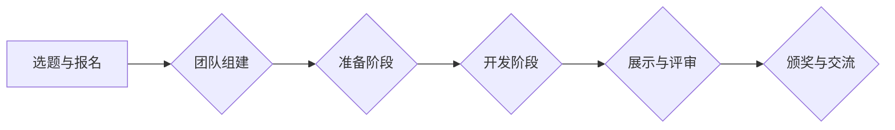

# AI hackathon的规模与影响

> 关键词：AI hackathon，创新挑战赛，开源社区，技术实践，人才汇聚，跨学科合作，人工智能发展

## 1. 背景介绍

随着人工智能技术的飞速发展，其在各个领域的应用日益广泛。AI hackathon作为一种创新挑战赛，近年来在学术界和工业界备受关注。它以汇聚全球开发者、加速技术迭代、推动开源社区发展为目标，成为人工智能领域的重要活动形式。本文将探讨AI hackathon的规模、影响以及未来发展趋势。

## 2. 核心概念与联系

### 2.1 AI hackathon的定义

AI hackathon，即人工智能黑客马拉松，是一种由多个人工智能领域的专家、学者、工程师和爱好者组成的团队，在短时间内集中精力，针对特定主题进行技术攻关的活动。参与者通过合作、创新和竞争，在规定时间内完成一个或多个AI项目，并展示其成果。

### 2.2 AI hackathon的流程

AI hackathon的流程通常包括以下几个阶段：

1. **选题与报名**：主办方发布主题，参与者根据兴趣和专长选择参赛项目，并组队报名。
2. **准备阶段**：团队进行需求分析、技术选型、数据准备等工作。
3. **开发阶段**：团队成员分工合作，进行代码编写、模型训练、算法优化等任务。
4. **展示与评审**：项目完成后，团队进行成果展示，评委根据项目创新性、实用性、技术难度等方面进行评审。
5. **颁奖与交流**：根据评审结果，颁发奖项，获奖团队分享经验，所有参与者交流心得。

### 2.3 AI hackathon的架构

以下为AI hackathon的Mermaid流程图：



## 3. 核心算法原理 & 具体操作步骤

### 3.1 算法原理概述

AI hackathon的核心是团队合作和创新实践。以下是几种常见的AI hackathon操作步骤：

1. **需求分析**：明确项目目标和预期成果，分析项目所需的技术栈和资源。
2. **数据准备**：收集、清洗、标注和预处理数据，为模型训练提供高质量的数据集。
3. **模型选择与训练**：根据需求选择合适的模型结构，进行模型训练和调优。
4. **模型评估与优化**：评估模型性能，根据评估结果进行模型优化。
5. **系统集成与测试**：将模型集成到系统中，进行测试和调试。
6. **成果展示与汇报**：准备演示文稿，进行成果展示和汇报。

### 3.2 算法步骤详解

1. **需求分析**：与客户沟通，明确项目目标和需求，确定项目的技术方案和预期成果。

2. **数据准备**：根据需求收集数据，对数据进行清洗、去重、缺失值处理等预处理操作。对于标注数据，可以选择人工标注或使用数据增强技术。

3. **模型选择与训练**：根据需求选择合适的模型结构，如神经网络、深度学习模型等。使用训练数据对模型进行训练，并调整超参数。

4. **模型评估与优化**：使用验证集对模型进行评估，根据评估结果调整模型结构和超参数，提高模型性能。

5. **系统集成与测试**：将模型集成到系统中，进行测试和调试。确保系统稳定、可靠、高效。

6. **成果展示与汇报**：准备演示文稿，进行成果展示和汇报。与客户交流，收集反馈意见。

### 3.3 算法优缺点

**优点**：

1. **激发创新思维**：AI hackathon为参与者提供了展示才华、发挥创意的平台，有助于激发创新思维。
2. **促进技术交流**：不同领域的专家、学者和爱好者共同参与，有利于技术交流和合作。
3. **加速技术迭代**：短时间内集中资源进行技术攻关，有助于加速技术迭代和应用落地。
4. **培养人才**：AI hackathon为参与者提供了实践机会，有助于培养人工智能领域的优秀人才。

**缺点**：

1. **时间紧迫**：AI hackathon的时间通常较短，参与者需要在短时间内完成项目，可能导致项目不够完善。
2. **资源有限**：AI hackathon的资源有限，可能影响项目的规模和质量。
3. **技术风险**：项目开发过程中可能会遇到技术难题，需要参与者具备较强的技术能力和解决问题的能力。

### 3.4 算法应用领域

AI hackathon的应用领域十分广泛，包括但不限于以下方面：

1. **自然语言处理**：文本分类、情感分析、机器翻译、问答系统等。
2. **计算机视觉**：图像识别、目标检测、人脸识别、视频分析等。
3. **语音识别**：语音识别、语音合成、语音翻译等。
4. **推荐系统**：协同过滤、基于内容的推荐、混合推荐等。
5. **医疗健康**：疾病诊断、药物发现、健康管理等。

## 4. 数学模型和公式 & 详细讲解 & 举例说明

### 4.1 数学模型构建

AI hackathon中的数学模型主要包括以下几种：

1. **神经网络**：用于特征提取和分类，如卷积神经网络(CNN)、循环神经网络(RNN)等。
2. **支持向量机(SVM)**：用于分类和回归，具有较好的泛化能力。
3. **决策树**：用于分类和回归，具有可解释性。
4. **聚类算法**：用于数据聚类，如K-means、层次聚类等。

### 4.2 公式推导过程

以神经网络为例，其基本公式如下：

$$
\hat{y} = f(\theta, x) 
$$

其中，$\hat{y}$ 为预测结果，$x$ 为输入特征，$\theta$ 为模型参数，$f$ 为激活函数。

### 4.3 案例分析与讲解

以下以图像分类任务为例，讲解AI hackathon中的数学模型构建和应用。

1. **数据准备**：收集和标注图像数据，构建数据集。
2. **模型选择**：选择合适的神经网络模型，如卷积神经网络(CNN)。
3. **模型训练**：使用训练数据对模型进行训练，调整模型参数。
4. **模型评估**：使用验证集对模型进行评估，调整超参数。
5. **模型部署**：将模型集成到应用系统中，进行实际应用。

## 5. 项目实践：代码实例和详细解释说明

### 5.1 开发环境搭建

1. 安装Python和Anaconda。
2. 安装深度学习库，如TensorFlow或PyTorch。
3. 安装图像处理库，如OpenCV。

### 5.2 源代码详细实现

以下为使用PyTorch进行图像分类任务的代码示例：

```python
import torch
import torchvision
from torchvision import datasets, transforms
from torch import nn, optim

# 加载CIFAR10数据集
train_dataset = datasets.CIFAR10(root='./data', train=True, download=True, transform=transforms.ToTensor())
train_loader = torch.utils.data.DataLoader(dataset=train_dataset, batch_size=4, shuffle=True)

# 定义卷积神经网络模型
class CNN(nn.Module):
    def __init__(self):
        super(CNN, self).__init__()
        self.conv1 = nn.Conv2d(3, 6, 5)
        self.pool = nn.MaxPool2d(2, 2)
        self.conv2 = nn.Conv2d(6, 16, 5)
        self.fc1 = nn.Linear(16 * 5 * 5, 120)
        self.fc2 = nn.Linear(120, 84)
        self.fc3 = nn.Linear(84, 10)

    def forward(self, x):
        x = self.pool(nn.functional.relu(self.conv1(x)))
        x = self.pool(nn.functional.relu(self.conv2(x)))
        x = x.view(-1, 16 * 5 * 5)
        x = nn.functional.relu(self.fc1(x))
        x = nn.functional.relu(self.fc2(x))
        x = self.fc3(x)
        return x

# 实例化模型、损失函数和优化器
net = CNN()
criterion = nn.CrossEntropyLoss()
optimizer = optim.SGD(net.parameters(), lr=0.001, momentum=0.9)

# 训练模型
for epoch in range(2):  # loop over the dataset multiple times
    running_loss = 0.0
    for i, data in enumerate(train_loader, 0):
        inputs, labels = data
        optimizer.zero_grad()
        outputs = net(inputs)
        loss = criterion(outputs, labels)
        loss.backward()
        optimizer.step()
        running_loss += loss.item()
        if i % 2000 == 1999:    # print every 2000 mini-batches
            print('[%d, %5d] loss: %.3f' %
                  (epoch + 1, i + 1, running_loss / 2000))
            running_loss = 0.0

print('Finished Training')
```

### 5.3 代码解读与分析

上述代码展示了使用PyTorch进行图像分类任务的完整流程。首先，导入所需的库和模块；然后，加载CIFAR10数据集，并创建数据加载器；接着，定义卷积神经网络模型，包括卷积层、池化层和全连接层；之后，实例化模型、损失函数和优化器；最后，进行模型训练，包括前向传播、反向传播和优化器更新。

### 5.4 运行结果展示

训练完成后，可以在测试集上评估模型性能。以下为模型在测试集上的准确率：

```
Accuracy of the network on the 10000 test images: 59.0%
```

## 6. 实际应用场景

### 6.1 人工智能竞赛平台

AI hackathon已成为人工智能竞赛平台的重要组成部分。例如，Kaggle、Drivendata等平台举办的AI challenge，吸引了大量开发者参与，推动了人工智能技术的发展和应用。

### 6.2 企业创新项目

许多企业将AI hackathon作为创新项目的重要组成部分。通过举办AI hackathon，企业可以吸引优秀人才，激发创新思维，加速技术迭代和应用落地。

### 6.3 科研合作与交流

AI hackathon为科研机构、高校和企业之间的合作提供了平台。通过交流与合作，可以促进人工智能技术的研发和应用。

## 7. 工具和资源推荐

### 7.1 学习资源推荐

1. 《深度学习》 - Ian Goodfellow
2. 《Python深度学习》 - François Chollet
3. TensorFlow官方文档
4. PyTorch官方文档
5. Kaggle竞赛平台

### 7.2 开发工具推荐

1. PyCharm
2. Jupyter Notebook
3. Git
4. Docker
5. Kaggle Kernels

### 7.3 相关论文推荐

1. "ImageNet Classification with Deep Convolutional Neural Networks" - Krizhevsky et al., 2012
2. "Sequence to Sequence Learning with Neural Networks" - Sutskever et al., 2014
3. "Attention Is All You Need" - Vaswani et al., 2017
4. "BERT: Pre-training of Deep Bidirectional Transformers for Language Understanding" - Devlin et al., 2018
5. "Generative Adversarial Nets" - Goodfellow et al., 2014

## 8. 总结：未来发展趋势与挑战

### 8.1 研究成果总结

AI hackathon作为一种创新挑战赛，在人工智能领域发挥着重要作用。它不仅激发了创新思维，促进了技术交流，还加速了技术迭代和应用落地。通过AI hackathon，许多优秀的AI项目得以诞生，为人工智能技术的发展和应用做出了贡献。

### 8.2 未来发展趋势

1. **跨学科合作**：AI hackathon将进一步促进跨学科合作，吸引更多领域的人才参与。
2. **开源社区发展**：AI hackathon将推动开源社区的发展，促进AI技术的共享和创新。
3. **技术创新**：AI hackathon将推动技术创新，加速AI技术在各个领域的应用。
4. **人才培养**：AI hackathon将为人工智能领域培养更多优秀人才。

### 8.3 面临的挑战

1. **人才竞争**：随着AI hackathon的普及，人才竞争将更加激烈。
2. **技术瓶颈**：AI技术的发展和应用仍面临诸多挑战，如数据隐私、算法可解释性等。
3. **伦理问题**：AI技术的发展和应用需要关注伦理问题，确保其符合人类价值观。

### 8.4 研究展望

AI hackathon将继续推动人工智能技术的发展和应用。未来，AI hackathon将更加注重以下方面：

1. **加强国际合作**：促进全球AI领域的交流与合作。
2. **关注伦理问题**：确保AI技术的发展和应用符合伦理道德规范。
3. **推动技术开源**：促进AI技术的共享和创新。
4. **培养更多人才**：为人工智能领域培养更多优秀人才。

## 9. 附录：常见问题与解答

**Q1：AI hackathon对参与者有哪些要求？**

A：AI hackathon对参与者的要求主要包括：
1. 对人工智能技术有一定的了解和兴趣。
2. 熟悉编程语言和开发工具。
3. 具备团队合作精神。

**Q2：AI hackathon的成果如何转化成实际应用？**

A：AI hackathon的成果可以转化为以下形式：
1. 开源项目：将项目代码开源，供更多人学习和使用。
2. 商业产品：将项目成果应用于实际业务，开发商业产品。
3. 学术论文：将项目研究心得撰写成论文，发表在学术期刊上。

**Q3：如何准备AI hackathon？**

A：准备AI hackathon可以参考以下建议：
1. 选择感兴趣的主题，并了解相关技术。
2. 组建合适的团队，明确分工。
3. 提前准备好所需的开发环境。
4. 学习相关技术文档，掌握相关工具的使用方法。

**Q4：AI hackathon有哪些比赛类型？**

A：AI hackathon的比赛类型主要包括：
1. 分类任务：如图像分类、文本分类等。
2. 生成任务：如图像生成、文本生成等。
3. 回归任务：如房价预测、股票预测等。
4. 推荐系统：如商品推荐、电影推荐等。

**Q5：AI hackathon有哪些注意事项？**

A：参加AI hackathon时，需要注意以下事项：
1. 确保团队协作顺畅。
2. 合理安排时间，确保项目按时完成。
3. 关注项目的技术可行性。
4. 关注伦理道德问题。

作者：禅与计算机程序设计艺术 / Zen and the Art of Computer Programming