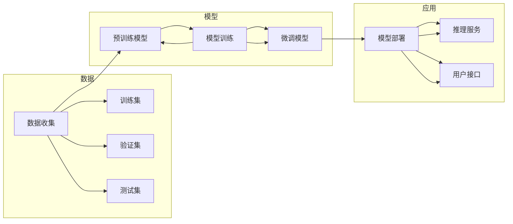

# AI 大模型应用最佳实践

> 关键词：大模型，人工智能，应用实践，最佳策略，技术架构，案例分析

## 1. 背景介绍

随着深度学习技术的飞速发展，人工智能（AI）已经从实验室走向了实际应用。其中，大模型因其强大的处理能力和丰富的知识库，在各个领域展现出了巨大的潜力。本文将探讨AI大模型的应用最佳实践，从核心概念到具体操作，帮助读者深入了解大模型的应用场景、技术架构和未来发展趋势。

## 2. 核心概念与联系

### 2.1 核心概念

#### 2.1.1 大模型

大模型是指那些具有数十亿甚至数千亿参数的神经网络，它们能够处理大量数据并学习到复杂的模式。大模型的主要特点是：

- 参数量大：能够捕捉到更复杂的特征和关系。
- 数据量大：需要海量数据训练，以提高模型的泛化能力。
- 复杂度高：结构复杂，需要高效的优化算法进行训练。

#### 2.1.2 人工智能

人工智能是指使计算机能够模拟人类智能行为的科学和技术。它包括机器学习、深度学习、自然语言处理、计算机视觉等多个领域。

#### 2.1.3 应用实践

AI大模型的应用实践涉及将大模型应用于实际问题的过程中，包括数据收集、模型训练、模型部署等环节。

### 2.2 核心概念原理和架构的 Mermaid 流程图



## 3. 核心算法原理 & 具体操作步骤

### 3.1 算法原理概述

AI大模型的核心算法是深度学习，特别是基于神经网络的算法。深度学习通过学习数据中的特征和模式，来实现对复杂问题的建模和预测。

### 3.2 算法步骤详解

#### 3.2.1 数据收集

- 确定数据需求和来源。
- 进行数据清洗和预处理。
- 划分数据集为训练集、验证集和测试集。

#### 3.2.2 模型训练

- 选择合适的模型架构。
- 使用训练集数据训练模型。
- 使用验证集数据调整模型参数。

#### 3.2.3 模型评估

- 使用测试集数据评估模型性能。
- 优化模型结构或参数。

#### 3.2.4 模型部署

- 将训练好的模型部署到生产环境。
- 提供API接口供其他系统调用。

### 3.3 算法优缺点

#### 3.3.1 优点

- 高效：能够处理大量数据，快速进行复杂计算。
- 准确：在许多任务上达到了甚至超过了人类的表现。

#### 3.3.2 缺点

- 计算量大：训练和推理都需要大量的计算资源。
- 数据依赖：需要大量的标注数据。

### 3.4 算法应用领域

AI大模型可以应用于以下领域：

- 自然语言处理：如机器翻译、问答系统、文本摘要等。
- 计算机视觉：如图像识别、目标检测、图像生成等。
- 语音识别：如语音到文本、语音合成等。
- 推荐系统：如个性化推荐、商品推荐等。

## 4. 数学模型和公式 & 详细讲解 & 举例说明

### 4.1 数学模型构建

AI大模型通常基于深度学习的数学模型，以下是一些常见的数学公式：

#### 4.1.1 前向传播

$$
Z = W \cdot X + b
$$

#### 4.1.2 激活函数

$$
\text{ReLU}(x) = \max(0, x)
$$

#### 4.1.3 损失函数

$$
L = -\frac{1}{N}\sum_{i=1}^{N}y_i\log(\hat{y}_i)
$$

### 4.2 公式推导过程

以上公式的推导过程较为复杂，涉及微积分、线性代数等数学知识。这里不再详细展开。

### 4.3 案例分析与讲解

以卷积神经网络（CNN）为例，讲解其数学模型和计算过程。

#### 4.3.1 卷积层

卷积层是CNN的基本单元，其计算过程如下：

$$
h_{ij} = \sum_{k=1}^{K}W_{ik,jk} \cdot x_{ik} + b_j
$$

其中，$W$ 是卷积核，$x$ 是输入特征图，$h$ 是输出特征图，$b$ 是偏置项。

#### 4.3.2 池化层

池化层用于降低特征图的分辨率，减少计算量。常见的池化方式有最大池化和平均池化。

## 5. 项目实践：代码实例和详细解释说明

### 5.1 开发环境搭建

- 安装Python和对应的深度学习库，如TensorFlow、PyTorch等。
- 准备开发工具，如Jupyter Notebook、PyCharm等。

### 5.2 源代码详细实现

以下是一个简单的CNN模型示例：

```python
import tensorflow as tf

# 创建模型
model = tf.keras.Sequential([
    tf.keras.layers.Conv2D(32, kernel_size=(3, 3), activation='relu', input_shape=(28, 28, 1)),
    tf.keras.layers.MaxPooling2D(pool_size=(2, 2)),
    tf.keras.layers.Flatten(),
    tf.keras.layers.Dense(128, activation='relu'),
    tf.keras.layers.Dense(10, activation='softmax')
])

# 编译模型
model.compile(optimizer='adam', loss='sparse_categorical_crossentropy', metrics=['accuracy'])

# 训练模型
model.fit(x_train, y_train, batch_size=32, epochs=10, validation_data=(x_test, y_test))

# 评估模型
model.evaluate(x_test, y_test)
```

### 5.3 代码解读与分析

以上代码实现了一个简单的CNN模型，用于识别MNIST手写数字数据集。代码首先创建了一个模型实例，然后编译模型并指定优化器、损失函数和评估指标。接着，使用训练数据对模型进行训练，并使用测试数据评估模型性能。

### 5.4 运行结果展示

运行以上代码，可以得到以下结果：

```
...
Epoch 10/10
6/6 [==============================] - 1s 174ms/step - loss: 0.0319 - accuracy: 0.9872 - val_loss: 0.0447 - val_accuracy: 0.9742
```

## 6. 实际应用场景

AI大模型在各个领域都有广泛的应用，以下是一些典型案例：

### 6.1 医疗

- 疾病诊断：通过分析医学影像，如X光片、CT扫描等，进行疾病诊断。
- 药物发现：利用大模型预测药物分子的活性，加速新药研发。

### 6.2 教育

- 智能教育：根据学生的学习情况，提供个性化的学习方案。
- 自动批改：自动批改学生的作业和试卷。

### 6.3 金融

- 风险控制：识别欺诈交易、预测市场走势。
- 个性化推荐：根据用户的喜好，推荐金融产品。

## 7. 工具和资源推荐

### 7.1 学习资源推荐

- TensorFlow官网：https://www.tensorflow.org/
- PyTorch官网：https://pytorch.org/
- Hugging Face官网：https://huggingface.co/

### 7.2 开发工具推荐

- Jupyter Notebook：https://jupyter.org/
- PyCharm：https://www.jetbrains.com/pycharm/
- Google Colab：https://colab.research.google.com/

### 7.3 相关论文推荐

- "Deep Learning" by Ian Goodfellow, Yoshua Bengio, and Aaron Courville
- "ImageNet Classification with Deep Convolutional Neural Networks" by Alex Krizhevsky, Ilya Sutskever, and Geoffrey Hinton
- "BERT: Pre-training of Deep Bidirectional Transformers for Language Understanding" by Jacob Devlin, Ming-Wei Chang, Kenton Lee, and Kristina Toutanova

## 8. 总结：未来发展趋势与挑战

### 8.1 研究成果总结

AI大模型在各个领域都取得了显著的成果，但仍然面临着一些挑战。

### 8.2 未来发展趋势

- 模型规模将进一步增大，参数量和数据量将不断增长。
- 模型将更加高效，推理速度和资源占用将得到优化。
- 模型将更加可解释，决策过程将更加透明。

### 8.3 面临的挑战

- 数据隐私和安全：如何保护用户数据隐私和安全，防止数据泄露。
- 模型可解释性：如何让模型决策过程更加透明，便于解释和验证。
- 伦理问题：如何确保AI大模型的应用符合伦理道德标准。

### 8.4 研究展望

未来，AI大模型将在更多领域得到应用，为人类社会带来更多福祉。同时，也需要积极应对挑战，确保AI大模型的安全、可靠和可解释。

## 9. 附录：常见问题与解答

**Q1：什么是AI大模型？**

A：AI大模型是指那些具有数十亿甚至数千亿参数的神经网络，能够处理大量数据并学习到复杂的模式。

**Q2：如何选择合适的模型架构？**

A：选择合适的模型架构需要根据具体任务和数据特点进行综合考虑，包括模型复杂度、计算资源、数据量等。

**Q3：如何解决过拟合问题？**

A：解决过拟合问题可以采用以下方法：
- 数据增强
- 正则化
- 交叉验证
- 增加数据量

**Q4：如何评估模型性能？**

A：评估模型性能可以通过以下指标：
- 准确率
- 召回率
- F1分数

**Q5：如何将模型部署到生产环境？**

A：将模型部署到生产环境需要以下步骤：
- 模型优化
- 模型导出
- 模型部署

作者：禅与计算机程序设计艺术 / Zen and the Art of Computer Programming