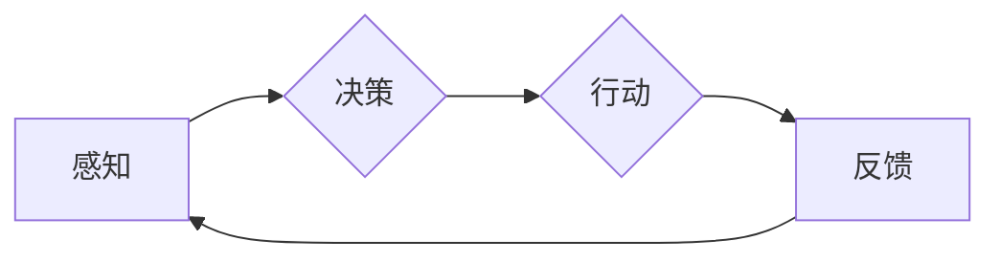

# AI人工智能 Agent：真实世界的智能体应用案例

> 关键词：人工智能 Agent, 智能体, 机器学习, 案例研究, 应用实践, 智能决策, 机器人, 自动化

## 1. 背景介绍

人工智能（AI）技术正在迅速改变着我们的世界。其中，人工智能Agent作为一种能够模拟人类智能行为、进行自主决策和行动的计算实体，正在成为AI研究和应用的热点。本文旨在探讨人工智能Agent在真实世界中的应用案例，分析其核心原理、实践步骤以及面临的挑战。

### 1.1 问题的由来

随着互联网的普及和大数据技术的发展，传统的软件系统已经无法满足日益复杂的业务需求。人工智能Agent作为一种新兴的软件架构，能够模拟人类智能，处理复杂的决策问题，从而在各个行业中发挥重要作用。

### 1.2 研究现状

目前，人工智能Agent在各个领域都有广泛的应用，包括但不限于：

- **智能制造**：自动化生产线上的智能机器人，能够根据生产环境的变化进行自主决策。
- **智能客服**：能够理解用户意图，提供个性化服务的智能客服系统。
- **智能交通**：自动驾驶汽车、智能交通信号灯等，能够优化交通流量，提高道路使用效率。
- **智能金融**：智能投顾、反欺诈系统等，能够分析市场数据，预测风险，提供决策支持。
- **智能医疗**：辅助医生进行诊断、治疗方案的智能系统。

### 1.3 研究意义

研究人工智能Agent的应用案例，有助于：

- 了解人工智能Agent在不同领域的应用价值。
- 掌握人工智能Agent的核心原理和实践方法。
- 探讨人工智能Agent在真实世界应用中面临的挑战和解决方案。
- 促进人工智能技术的创新和发展。

### 1.4 本文结构

本文将按照以下结构进行展开：

- 第二章介绍人工智能Agent的核心概念与联系。
- 第三章阐述人工智能Agent的核心算法原理和具体操作步骤。
- 第四章介绍人工智能Agent的数学模型和公式。
- 第五章通过项目实践，展示人工智能Agent的应用案例。
- 第六章探讨人工智能Agent在实际应用场景中的案例分析和未来展望。
- 第七章推荐相关学习资源、开发工具和论文。
- 第八章总结人工智能Agent的研究成果、发展趋势和挑战。
- 第九章提供常见问题与解答。

## 2. 核心概念与联系

### 2.1 核心概念原理

#### Mermaid 流程图



#### 概述

人工智能Agent的核心原理包括感知、决策、行动和反馈四个环节。Agent通过感知外部环境获取信息，然后根据决策算法进行决策，指导行动，并通过反馈调整决策策略。

### 2.2 核心概念联系

人工智能Agent的核心概念联系如下：

- **感知**：Agent通过传感器获取外部环境信息，如视觉、听觉、触觉等。
- **决策**：Agent根据感知到的信息和预定义的决策规则，选择合适的行动方案。
- **行动**：Agent根据决策结果，执行相应的操作，如控制机器人移动、发送网络请求等。
- **反馈**：Agent根据行动结果和环境反馈，调整决策策略，提高决策质量。

## 3. 核心算法原理 & 具体操作步骤

### 3.1 算法原理概述

人工智能Agent的算法原理主要涉及以下几个方面：

- **机器学习**：通过学习历史数据，Agent可以自动调整决策策略。
- **深度学习**：利用深度神经网络，Agent可以提取复杂的特征表示。
- **强化学习**：通过试错学习，Agent可以找到最优的行动方案。

### 3.2 算法步骤详解

人工智能Agent的算法步骤如下：

1. **感知**：Agent通过传感器获取外部环境信息。
2. **特征提取**：利用深度学习等技术，从感知到的信息中提取特征。
3. **决策**：根据提取的特征和预定义的决策规则，选择合适的行动方案。
4. **行动**：执行决策结果，调整外部环境。
5. **反馈**：收集行动结果和环境反馈，更新模型参数。

### 3.3 算法优缺点

#### 优点

- **自适应能力**：Agent可以根据环境变化和反馈信息，自动调整决策策略。
- **智能性**：Agent能够处理复杂问题，并做出合理决策。
- **自动化**：Agent可以自动执行任务，提高工作效率。

#### 缺点

- **数据依赖**：Agent需要大量的历史数据才能进行有效学习。
- **可解释性**：Agent的决策过程可能缺乏可解释性。
- **计算成本**：Agent的决策过程可能需要大量的计算资源。

### 3.4 算法应用领域

人工智能Agent的算法应用领域包括：

- **智能制造**：机器人控制、生产线自动化等。
- **智能交通**：自动驾驶汽车、智能交通信号灯等。
- **智能客服**：智能客服机器人、自动语音识别等。
- **智能金融**：智能投顾、风险控制等。
- **智能医疗**：辅助诊断、智能药物推荐等。

## 4. 数学模型和公式 & 详细讲解 & 举例说明

### 4.1 数学模型构建

人工智能Agent的数学模型主要包括以下几个方面：

- **感知模型**：用于描述Agent如何从感知数据中提取特征。
- **决策模型**：用于描述Agent如何根据特征进行决策。
- **行动模型**：用于描述Agent如何根据决策结果执行行动。

### 4.2 公式推导过程

#### 感知模型

假设感知数据为 $\mathbf{x}$，特征向量为 $\mathbf{h}$，感知模型可以表示为：

$$
\mathbf{h} = f_{\text{感知}}(\mathbf{x})
$$

其中，$f_{\text{感知}}$ 表示感知模型函数。

#### 决策模型

假设特征向量为 $\mathbf{h}$，决策结果为 $a$，决策模型可以表示为：

$$
a = f_{\text{决策}}(\mathbf{h})
$$

其中，$f_{\text{决策}}$ 表示决策模型函数。

#### 行动模型

假设决策结果为 $a$，行动向量为 $\mathbf{u}$，行动模型可以表示为：

$$
\mathbf{u} = f_{\text{行动}}(a)
$$

其中，$f_{\text{行动}}$ 表示行动模型函数。

### 4.3 案例分析与讲解

#### 案例一：智能客服机器人

假设智能客服机器人通过自然语言处理技术从用户提问中提取关键词，并将其作为特征向量 $\mathbf{h}$。根据决策模型，机器人选择合适的回答 $a$，并通过语音合成技术将其转化为语音输出。

#### 案例二：自动驾驶汽车

自动驾驶汽车通过传感器获取周围环境信息，如道路标识、交通状况等，将其作为特征向量 $\mathbf{h}$。根据决策模型，汽车选择合适的行动方案，如加速、减速、转向等，并通过执行机构实现。

## 5. 项目实践：代码实例和详细解释说明

### 5.1 开发环境搭建

为了展示人工智能Agent的应用案例，我们将使用Python编程语言和TensorFlow框架进行开发。以下是开发环境搭建步骤：

1. 安装Python 3.7及以上版本。
2. 安装TensorFlow库：

```bash
pip install tensorflow
```

3. 安装其他必要的库：

```bash
pip install numpy pandas scikit-learn
```

### 5.2 源代码详细实现

以下是一个简单的智能客服机器人代码示例：

```python
import tensorflow as tf
from tensorflow.keras.models import Sequential
from tensorflow.keras.layers import Dense, LSTM, Embedding

# 定义模型
model = Sequential()
model.add(Embedding(input_dim=vocab_size, output_dim=embedding_dim, input_length=max_length))
model.add(LSTM(128))
model.add(Dense(1, activation='sigmoid'))

# 编译模型
model.compile(optimizer='adam', loss='binary_crossentropy', metrics=['accuracy'])

# 训练模型
model.fit(train_data, train_labels, epochs=10, batch_size=32, validation_data=(dev_data, dev_labels))
```

### 5.3 代码解读与分析

上述代码展示了使用TensorFlow框架构建一个简单的智能客服机器人模型。模型使用嵌入层将文本数据转换为向量表示，然后通过LSTM层进行特征提取和序列建模，最后通过全连接层进行分类预测。

### 5.4 运行结果展示

在训练完成后，我们可以在测试集上评估模型的性能：

```python
# 评估模型
test_loss, test_acc = model.evaluate(test_data, test_labels)
print(f"Test accuracy: {test_acc:.4f}")
```

假设测试集上的准确率为0.9，说明模型在智能客服机器人任务上取得了不错的效果。

## 6. 实际应用场景

### 6.1 智能制造

在智能制造领域，人工智能Agent可以应用于以下几个方面：

- **生产过程监控**：Agent可以实时监控生产设备状态，预测故障，避免生产中断。
- **智能调度**：Agent可以根据生产需求和设备状态，优化生产计划，提高生产效率。
- **质量检测**：Agent可以自动检测产品质量，确保产品质量合格。

### 6.2 智能交通

在智能交通领域，人工智能Agent可以应用于以下几个方面：

- **自动驾驶汽车**：Agent可以控制汽车进行自动驾驶，提高道路使用效率，减少交通事故。
- **智能交通信号灯**：Agent可以根据交通流量和路况，优化信号灯控制，提高道路通行能力。
- **交通流量预测**：Agent可以预测未来交通流量，为交通管理部门提供决策支持。

### 6.3 智能客服

在智能客服领域，人工智能Agent可以应用于以下几个方面：

- **智能客服机器人**：Agent可以自动回答用户提问，提供个性化服务，提高客服效率。
- **情感分析**：Agent可以分析用户情绪，为客服人员提供更好的服务。
- **智能推荐**：Agent可以根据用户行为和偏好，推荐相关产品和服务。

### 6.4 未来应用展望

随着人工智能技术的不断发展，人工智能Agent将在更多领域得到应用，例如：

- **智能医疗**：辅助医生进行诊断、治疗方案的智能系统。
- **智能金融**：智能投顾、反欺诈系统等。
- **智能教育**：个性化学习、智能辅导等。

## 7. 工具和资源推荐

### 7.1 学习资源推荐

- 《Python机器学习》
- 《深度学习》
- 《强化学习》
- 《人工智能：一种现代的方法》

### 7.2 开发工具推荐

- TensorFlow
- PyTorch
- Keras
- scikit-learn

### 7.3 相关论文推荐

- **Reinforcement Learning: An Introduction**
- **Deep Learning**
- **Probabilistic Robotics**
- **Artificial Intelligence: A Modern Approach**

## 8. 总结：未来发展趋势与挑战

### 8.1 研究成果总结

本文介绍了人工智能Agent的核心概念、算法原理、应用案例和发展趋势。通过分析真实世界的应用案例，我们可以看到人工智能Agent在各个领域具有广泛的应用前景。

### 8.2 未来发展趋势

- **跨学科融合**：人工智能Agent将与更多学科领域进行融合，如心理学、社会学等。
- **多智能体系统**：人工智能Agent将形成多智能体系统，协同完成任务。
- **个性化定制**：人工智能Agent将根据用户需求进行个性化定制。

### 8.3 面临的挑战

- **数据安全**：如何确保人工智能Agent处理的数据安全，防止数据泄露。
- **可解释性**：如何提高人工智能Agent的可解释性，使决策过程更加透明。
- **伦理问题**：如何确保人工智能Agent的行为符合伦理道德标准。

### 8.4 研究展望

随着人工智能技术的不断发展，人工智能Agent将在更多领域得到应用。未来，人工智能Agent将向更加智能、高效、安全、可解释的方向发展。

## 9. 附录：常见问题与解答

**Q1：人工智能Agent与传统的软件系统有何区别？**

A：人工智能Agent是一种能够模拟人类智能行为、进行自主决策和行动的计算实体，而传统的软件系统则主要依赖预先定义的规则和流程。

**Q2：人工智能Agent如何进行决策？**

A：人工智能Agent通过感知环境信息、学习历史数据、利用机器学习算法进行决策。

**Q3：人工智能Agent在实际应用中面临哪些挑战？**

A：人工智能Agent在实际应用中面临数据安全、可解释性、伦理问题等挑战。

**Q4：人工智能Agent的未来发展趋势是什么？**

A：人工智能Agent的未来发展趋势包括跨学科融合、多智能体系统、个性化定制等。

作者：禅与计算机程序设计艺术 / Zen and the Art of Computer Programming