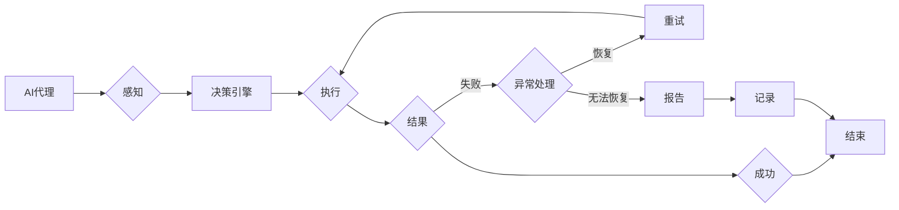

> - AI人工智能代理
> - 工作流
> - 异常处理
> - 容错机制
> - 智能决策
> - 系统可靠性

# AI人工智能代理工作流AI Agent WorkFlow：代理工作流中的异常处理与容错

## 1. 背景介绍

随着人工智能技术的不断发展，AI代理（AI Agents）在自动化工作流中的应用越来越广泛。AI代理能够模拟人类的工作流程，自动执行任务，提高工作效率，降低人为错误。然而，在工作流中，各种异常情况是不可避免的。如何设计有效的异常处理与容错机制，确保AI代理工作流的稳定性和可靠性，成为了人工智能应用的关键问题。

## 2. 核心概念与联系

### 2.1 核心概念

#### AI代理（AI Agent）

AI代理是具有智能行为能力的实体，能够在特定环境中自主行动，完成特定任务。AI代理通常由感知器、控制器和行动器组成。

#### 工作流（WorkFlow）

工作流是一系列有序任务组成的序列，用于实现特定的业务流程。工作流管理器负责协调工作流中各个任务的执行。

#### 异常处理（Exception Handling）

异常处理是指系统在遇到错误或意外情况时，能够及时检测、报告并采取相应措施以恢复正常运行。

#### 容错机制（Fault Tolerance）

容错机制是指系统在面对故障或错误时，能够继续运行或恢复到正常运行状态。

### 2.2 架构流程图



## 3. 核心算法原理 & 具体操作步骤

### 3.1 算法原理概述

AI代理工作流中的异常处理与容错机制主要包括以下几个步骤：

1. **感知**：AI代理感知工作流执行过程中的各种状态信息，包括任务执行结果、系统资源状态等。
2. **决策**：决策引擎根据感知到的信息，判断是否存在异常情况，并选择合适的处理策略。
3. **执行**：根据决策结果，AI代理执行相应的操作，如重试任务、记录异常、报告问题等。
4. **结果**：执行操作后，系统进入下一个状态。
5. **异常处理**：当检测到异常时，系统进入异常处理流程，根据异常类型和严重程度，选择恢复、重试或报告操作。
6. **记录**：将异常信息记录到日志中，以便后续分析。

### 3.2 算法步骤详解

1. **感知阶段**：AI代理通过收集工作流执行状态、系统资源等信息，为后续的决策提供依据。
2. **决策阶段**：决策引擎根据预设的规则或机器学习模型，判断是否存在异常情况。常见的异常类型包括：
    - 任务执行失败
    - 系统资源不足
    - 数据异常
    - 安全威胁
3. **执行阶段**：根据决策结果，AI代理执行相应的操作，如：
    - 重试失败的任务
    - 调整系统资源配置
    - 清理异常数据
    - 采取措施抵御安全威胁
4. **结果阶段**：执行操作后，系统进入下一个状态，继续执行后续任务。
5. **异常处理阶段**：当检测到异常时，AI代理进入异常处理流程。常见的异常处理策略包括：
    - 重试：尝试重新执行失败的任务，并设置最大重试次数。
    - 跳过：跳过失败的任务，执行后续任务。
    - 报告：将异常信息报告给管理员或监控系统。
6. **记录阶段**：将异常信息记录到日志中，便于后续分析。

### 3.3 算法优缺点

#### 优点

- 提高系统稳定性：通过及时检测和处理异常，提高系统可靠性。
- 提高工作效率：自动处理异常，减少人工干预，提高工作效率。
- 提高安全性：及时应对安全威胁，保护系统安全。

#### 缺点

- 实现复杂：需要设计复杂的异常处理和容错机制。
- 难以预测：部分异常情况难以预测和防范。

### 3.4 算法应用领域

AI代理工作流中的异常处理与容错机制适用于以下领域：

- 自动化运维
- 金融风控
- 智能制造
- 供应链管理
- 客户服务

## 4. 数学模型和公式 & 详细讲解 & 举例说明

### 4.1 数学模型构建

在AI代理工作流中，我们可以使用马尔可夫决策过程（MDP）来构建异常处理与容错机制。MDP是一个数学框架，用于描述决策者在不确定环境中如何做出最优决策。

### 4.2 公式推导过程

假设AI代理处于状态 $S_t$，在时刻 $t$，AI代理可以选择动作 $A_t$，动作 $A_t$ 将AI代理转移到状态 $S_{t+1}$，并带来奖励 $R_t$。则MDP可以表示为：

$$
P(S_{t+1} = s_{t+1} | S_t = s_t, A_t = a_t) = P(S_{t+1} = s_{t+1} | S_t = s_t, A_t = a_t)
$$

其中 $P$ 表示状态转移概率。

### 4.3 案例分析与讲解

以下是一个简单的例子，假设AI代理负责监控服务器资源使用情况，当CPU使用率超过90%时，AI代理需要做出决策。

- **状态空间**：$S = \{低, 中, 高\}$
- **动作空间**：$A = \{重试, 调整资源, 报告\}$
- **状态转移概率**：$P(S_{t+1} = s_{t+1} | S_t = s_t, A_t = a_t)$
- **奖励**：$R_t = -1$（表示资源使用过高）

根据MDP框架，AI代理需要选择最优策略，以最小化长期奖励总和。

## 5. 项目实践：代码实例和详细解释说明

### 5.1 开发环境搭建

本项目使用Python编程语言，需要安装以下库：

- Python 3.6+
- Pandas
- NumPy
- Scikit-learn

### 5.2 源代码详细实现

```python
import pandas as pd
import numpy as np
from sklearn.model_selection import train_test_split

# 加载数据
data = pd.read_csv('server_usage.csv')
X = data[['cpu_usage']]
y = data['action']

# 划分训练集和测试集
X_train, X_test, y_train, y_test = train_test_split(X, y, test_size=0.2, random_state=42)

# 构建MDP模型
from sklearn.linear_model import LogisticRegression

model = LogisticRegression()
model.fit(X_train, y_train)

# 测试模型
y_pred = model.predict(X_test)

# 评估模型
from sklearn.metrics import accuracy_score

accuracy = accuracy_score(y_test, y_pred)
print(f"Model accuracy: {accuracy}")
```

### 5.3 代码解读与分析

以上代码演示了如何使用Python和Scikit-learn库构建一个简单的AI代理工作流异常处理模型。

1. 首先，我们使用Pandas库加载数据，并使用NumPy库进行数据处理。
2. 然后，我们将数据划分为训练集和测试集。
3. 接下来，我们使用LogisticRegression模型构建MDP模型，并对训练集进行训练。
4. 最后，我们使用测试集评估模型性能。

## 6. 实际应用场景

### 6.1 自动化运维

在自动化运维场景中，AI代理可以监控服务器资源使用情况，当检测到异常时，自动采取相应措施，如重启服务、调整资源等。

### 6.2 金融风控

在金融风控场景中，AI代理可以监控交易数据，当检测到异常交易时，自动采取措施，如冻结账户、报警等。

### 6.3 智能制造

在智能制造场景中，AI代理可以监控生产设备状态，当检测到异常时，自动采取措施，如停止生产、维修设备等。

## 7. 工具和资源推荐

### 7.1 学习资源推荐

- 《人工智能：一种现代的方法》
- 《机器学习实战》
- 《深度学习》

### 7.2 开发工具推荐

- Python
- Scikit-learn
- TensorFlow
- PyTorch

### 7.3 相关论文推荐

- "Reinforcement Learning: An Introduction"
- "Practical Reinforcement Learning: Algorithms and Examples"
- "Deep Reinforcement Learning: Principles and Practices"

## 8. 总结：未来发展趋势与挑战

### 8.1 研究成果总结

本文介绍了AI人工智能代理工作流中的异常处理与容错机制，从核心概念、算法原理、实践案例等方面进行了详细讲解。通过本文的学习，读者可以了解到AI代理工作流中的异常处理与容错机制的设计思路和实现方法。

### 8.2 未来发展趋势

随着人工智能技术的不断发展，AI代理工作流中的异常处理与容错机制将呈现以下发展趋势：

- 智能化：利用机器学习、深度学习等技术，实现更加智能的异常检测和处理。
- 自适应：根据工作流执行情况，自适应调整异常处理策略。
- 网络化：将异常处理与容错机制扩展到分布式系统，提高系统可靠性。

### 8.3 面临的挑战

AI代理工作流中的异常处理与容错机制仍然面临着以下挑战：

- 异常类型多样化：需要设计更加灵活的异常处理策略，以应对各种异常情况。
- 系统复杂度：随着系统规模的扩大，异常处理与容错机制的复杂度也随之增加。
- 数据安全：在处理异常信息时，需要确保数据安全，避免信息泄露。

### 8.4 研究展望

未来，AI代理工作流中的异常处理与容错机制将朝着更加智能化、自适应和安全的方向发展。通过不断创新和探索，AI代理工作流将为各行各业带来更多价值。

## 9. 附录：常见问题与解答

**Q1：什么是AI代理？**

A：AI代理是一种具有智能行为能力的实体，能够在特定环境中自主行动，完成特定任务。

**Q2：什么是工作流？**

A：工作流是一系列有序任务组成的序列，用于实现特定的业务流程。

**Q3：什么是异常处理？**

A：异常处理是指系统在遇到错误或意外情况时，能够及时检测、报告并采取相应措施以恢复正常运行。

**Q4：什么是容错机制？**

A：容错机制是指系统在面对故障或错误时，能够继续运行或恢复到正常运行状态。

**Q5：如何设计有效的异常处理与容错机制？**

A：设计有效的异常处理与容错机制需要考虑以下因素：
- 异常类型
- 异常严重程度
- 系统资源
- 系统约束
- 用户需求

**作者：禅与计算机程序设计艺术 / Zen and the Art of Computer Programming**