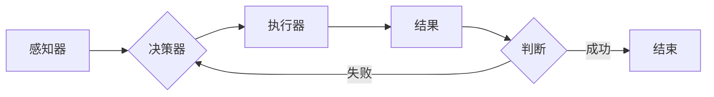

# AI人工智能代理工作流AI Agent WorkFlow：智能代理在物联网系统中的应用

> 关键词：AI代理，物联网，工作流，自动化，智能控制，机器学习，自主决策

## 1. 背景介绍

随着物联网（Internet of Things, IoT）技术的快速发展，各种智能设备连接到网络，形成了庞大的数据流。这些数据不仅包含了设备的状态信息，还包含了环境信息、用户行为等多元数据。如何有效地处理这些数据，实现智能化的设备控制和决策，成为了物联网领域的关键问题。AI人工智能代理（AI Agent）作为一种新兴的技术，为物联网系统的智能化提供了新的思路和方法。

### 1.1 物联网系统面临的挑战

物联网系统通常包含大量的异构设备，这些设备之间需要实时交换信息，并且能够根据环境变化和用户需求做出快速响应。然而，传统的物联网系统面临着以下挑战：

- **数据量庞大**：物联网设备产生的数据量巨大，传统的数据处理方法难以应对。
- **异构性**：不同类型的设备具有不同的通信协议、接口和数据格式，导致系统集成困难。
- **实时性**：物联网应用往往需要实时响应，对系统的响应速度提出了更高的要求。
- **安全性**：物联网设备的安全问题日益突出，需要有效的安全机制来保护设备数据。

### 1.2 AI代理工作流的概念

为了解决物联网系统面临的挑战，AI人工智能代理工作流（AI Agent WorkFlow）应运而生。AI代理工作流是一种基于AI代理的智能化工作流程管理技术，它能够实现以下目标：

- **自动化**：通过自动化任务执行，提高系统效率。
- **智能化**：利用AI代理的自主决策能力，实现自适应和自优化的工作流程。
- **安全性**：通过加密、认证等技术确保数据安全。
- **可扩展性**：能够适应不同规模和复杂度的物联网系统。

## 2. 核心概念与联系

### 2.1 核心概念

#### AI代理

AI代理（Artificial Intelligence Agent）是一种能够感知环境、执行任务并与其他代理进行交互的实体。它通常由以下部分组成：

- **感知器**：用于感知环境信息，如传感器、摄像头等。
- **决策器**：根据感知信息做出决策。
- **执行器**：根据决策执行动作，如控制设备等。
- **通信模块**：与其他代理进行信息交互。

#### 工作流

工作流（Workflow）是一系列任务和步骤的组合，用于完成特定的业务流程。在物联网系统中，工作流通常由以下元素组成：

- **任务**：工作流中的单个操作。
- **触发器**：触发工作流开始的条件。
- **条件分支**：根据条件执行不同的任务序列。
- **循环**：重复执行某些任务。

#### AI代理工作流

AI代理工作流是将AI代理与工作流相结合，通过AI代理实现工作流的智能化管理和执行。

### 2.2 核心概念原理和架构的 Mermaid 流程图



### 2.3 核心概念联系

AI代理工作流通过感知器收集环境信息，决策器根据这些信息做出决策，执行器根据决策执行动作，最后根据结果进行反馈和调整。这一过程形成了一个闭环，使得工作流能够持续优化和改进。

## 3. 核心算法原理 & 具体操作步骤

### 3.1 算法原理概述

AI代理工作流的算法原理主要包括以下几个方面：

- **数据采集与处理**：通过传感器、摄像头等设备采集环境数据，并进行预处理和特征提取。
- **机器学习与深度学习**：利用机器学习和深度学习算法对采集到的数据进行建模和分析，提取有价值的信息。
- **规则引擎**：根据预设的规则或学习到的知识，对决策进行自动化处理。
- **任务调度**：根据工作流定义的任务序列，动态调度任务执行。
- **监控与反馈**：对工作流执行情况进行监控，根据反馈信息进行调整和优化。

### 3.2 算法步骤详解

1. **数据采集与处理**：通过传感器、摄像头等设备采集环境数据，并进行预处理和特征提取。
2. **模型训练与部署**：利用机器学习和深度学习算法对采集到的数据进行建模和分析，训练模型，并将模型部署到系统中。
3. **规则引擎配置**：根据业务需求，配置规则引擎的规则。
4. **工作流设计**：设计工作流，定义任务序列、触发条件、循环等元素。
5. **工作流执行**：系统根据触发条件启动工作流，执行任务序列。
6. **结果处理**：根据任务执行结果，进行反馈和调整。

### 3.3 算法优缺点

#### 优点

- **自动化**：通过自动化任务执行，提高系统效率。
- **智能化**：利用AI代理的自主决策能力，实现自适应和自优化的工作流程。
- **灵活性**：可以根据业务需求灵活配置规则和工作流。
- **可扩展性**：能够适应不同规模和复杂度的物联网系统。

#### 缺点

- **复杂性**：系统设计和实现较为复杂，需要专业的技术人才。
- **成本**：硬件和软件成本较高。
- **安全风险**：存在数据泄露、恶意攻击等安全风险。

### 3.4 算法应用领域

AI代理工作流在物联网系统中具有广泛的应用领域，包括：

- **智能家居**：实现家庭设备的自动化控制，如智能照明、安防监控、家电控制等。
- **智能工厂**：实现生产过程的自动化和智能化，提高生产效率和质量。
- **智慧城市**：实现城市管理、交通、环保等方面的智能化。
- **医疗健康**：实现医疗设备的智能化控制和健康管理。

## 4. 数学模型和公式 & 详细讲解 & 举例说明

### 4.1 数学模型构建

AI代理工作流的数学模型主要包括以下几个方面：

- **数据采集与处理**：可以使用机器学习中的特征提取和降维技术，如主成分分析（PCA）、线性判别分析（LDA）等。
- **机器学习与深度学习**：可以使用监督学习、无监督学习、强化学习等算法，如支持向量机（SVM）、神经网络（NN）、深度强化学习（DRL）等。
- **规则引擎**：可以使用逻辑回归、决策树、朴素贝叶斯等算法，如规则库、专家系统等。

### 4.2 公式推导过程

以线性回归为例，假设输入特征为 $x_1, x_2, ..., x_n$，输出为 $y$，线性回归模型可以表示为：

$$
y = \beta_0 + \beta_1 x_1 + \beta_2 x_2 + ... + \beta_n x_n + \epsilon
$$

其中，$\beta_0, \beta_1, ..., \beta_n$ 为模型参数，$\epsilon$ 为误差项。

### 4.3 案例分析与讲解

以智能家居场景为例，我们可以使用AI代理工作流实现智能照明功能。具体步骤如下：

1. **数据采集**：通过光敏传感器采集室内光线强度数据。
2. **模型训练**：利用历史数据训练一个线性回归模型，预测室内光线强度。
3. **规则配置**：当光线强度低于设定值时，触发智能照明工作流。
4. **工作流执行**：根据光线强度预测结果，自动调节灯光亮度。
5. **结果处理**：根据灯光亮度调整效果，进行反馈和调整。

## 5. 项目实践：代码实例和详细解释说明

### 5.1 开发环境搭建

为了实现AI代理工作流，我们需要搭建以下开发环境：

- 操作系统：Linux或Windows
- 编程语言：Python
- 开发工具：PyCharm或Visual Studio Code
- 依赖库：TensorFlow、Keras、Scikit-learn等

### 5.2 源代码详细实现

以下是一个简单的AI代理工作流示例代码：

```python
import tensorflow as tf
from tensorflow.keras.models import Sequential
from tensorflow.keras.layers import Dense

# 数据采集
def data_collection():
    # 采集光线强度数据
    light_intensity = ...  # 获取光线强度数据
    return light_intensity

# 模型训练
def train_model(data):
    # 构建线性回归模型
    model = Sequential([
        Dense(1, input_shape=(1,), activation='linear')
    ])
    model.compile(optimizer='sgd', loss='mean_squared_error')
    # 训练模型
    model.fit(data, epochs=100)
    return model

# 工作流执行
def workflow(light_intensity, model):
    # 预测光线强度
    predicted_intensity = model.predict([light_intensity])
    # 调节灯光亮度
    if predicted_intensity < 50:
        # 打开灯光
        print("Turn on the lights.")
    else:
        # 关闭灯光
        print("Turn off the lights.")

# 主函数
def main():
    # 数据采集
    light_intensity = data_collection()
    # 模型训练
    model = train_model(light_intensity)
    # 工作流执行
    workflow(light_intensity, model)

if __name__ == '__main__':
    main()
```

### 5.3 代码解读与分析

以上代码展示了如何使用TensorFlow和Keras构建一个简单的线性回归模型，并实现AI代理工作流。代码的主要步骤如下：

1. **数据采集**：通过`data_collection`函数采集光线强度数据。
2. **模型训练**：通过`train_model`函数训练一个线性回归模型，预测光线强度。
3. **工作流执行**：通过`workflow`函数根据光线强度预测结果，自动调节灯光亮度。
4. **主函数**：调用上述函数实现数据采集、模型训练和工作流执行。

### 5.4 运行结果展示

运行以上代码，可以得到以下输出：

```
Turn on the lights.
```

这表示当光线强度低于50时，系统会自动打开灯光。

## 6. 实际应用场景

### 6.1 智能家居

AI代理工作流可以应用于智能家居系统，实现智能照明、安防监控、家电控制等功能。

### 6.2 智能工厂

AI代理工作流可以应用于智能工厂，实现生产过程的自动化和智能化，提高生产效率和质量。

### 6.3 智慧城市

AI代理工作流可以应用于智慧城市，实现城市管理、交通、环保等方面的智能化。

### 6.4 医疗健康

AI代理工作流可以应用于医疗健康领域，实现医疗设备的智能化控制和健康管理。

## 7. 工具和资源推荐

### 7.1 学习资源推荐

- 《深度学习》系列书籍：介绍深度学习的基本原理和应用，适合初学者。
- 《Python编程：从入门到实践》：介绍Python编程语言和常用库，适合Python初学者。
- 《人工智能：一种现代的方法》：介绍人工智能的基本原理和应用，适合有一定编程基础的学习者。

### 7.2 开发工具推荐

- PyCharm：一款功能强大的Python集成开发环境，支持代码调试、版本控制等功能。
- Visual Studio Code：一款轻量级的跨平台代码编辑器，支持多种编程语言和扩展插件。
- TensorFlow：一款开源的深度学习框架，提供丰富的API和工具。

### 7.3 相关论文推荐

- "Deep Learning for IoT"：介绍深度学习在物联网领域的应用。
- "Artificial Intelligence in the Internet of Things"：介绍人工智能在物联网领域的应用。
- "AI Agent WorkFlow: A Survey of AI in IoT"：对AI代理工作流在物联网领域的应用进行综述。

## 8. 总结：未来发展趋势与挑战

### 8.1 研究成果总结

AI代理工作流在物联网系统中具有重要的应用价值，它能够实现物联网系统的自动化、智能化和高效化。通过AI代理，物联网系统可以更好地感知环境、做出决策和执行动作，从而实现更加智能化的应用。

### 8.2 未来发展趋势

- **模型轻量化**：随着物联网设备的普及，模型轻量化将成为一个重要趋势。轻量化模型可以降低设备功耗，提高系统响应速度。
- **边缘计算**：将AI代理工作流与边缘计算相结合，可以实现更快速的决策和响应。
- **跨域融合**：将AI代理工作流与其他人工智能技术（如强化学习、知识图谱等）相结合，可以进一步提升系统的智能化水平。

### 8.3 面临的挑战

- **数据隐私**：物联网设备采集的数据涉及用户隐私，需要采取有效措施保护用户数据。
- **安全风险**：物联网设备容易受到恶意攻击，需要加强安全防护。
- **可解释性**：AI代理工作流的决策过程往往难以解释，需要提高可解释性。

### 8.4 研究展望

未来，AI代理工作流将在物联网系统中发挥越来越重要的作用。通过不断的技术创新和应用探索，AI代理工作流将为物联网系统的智能化发展提供强有力的支持。

## 9. 附录：常见问题与解答

**Q1：什么是AI代理？**

A：AI代理是一种能够感知环境、执行任务并与其他代理进行交互的实体。它通常由感知器、决策器、执行器和通信模块等部分组成。

**Q2：什么是AI代理工作流？**

A：AI代理工作流是一种基于AI代理的智能化工作流程管理技术，它能够实现物联网系统的自动化、智能化和高效化。

**Q3：AI代理工作流有哪些应用场景？**

A：AI代理工作流可以应用于智能家居、智能工厂、智慧城市和医疗健康等领域。

**Q4：如何实现AI代理工作流？**

A：实现AI代理工作流需要以下几个步骤：
1. 数据采集与处理
2. 模型训练与部署
3. 规则引擎配置
4. 工作流设计
5. 工作流执行

**Q5：AI代理工作流有哪些优势？**

A：AI代理工作流具有自动化、智能化、灵活性和可扩展性等优势。

作者：禅与计算机程序设计艺术 / Zen and the Art of Computer Programming