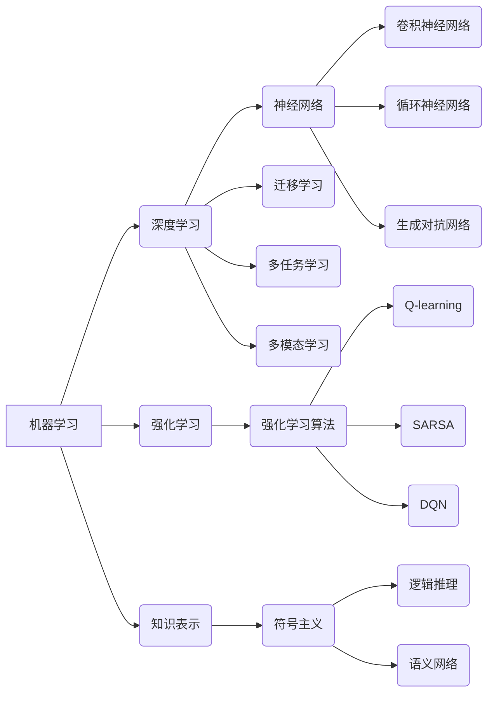

# AI领域的技术进步与突破

> 关键词：人工智能，深度学习，机器学习，神经网络，自然语言处理，计算机视觉，强化学习，自动驾驶，医疗诊断，未来展望

## 1. 背景介绍

自20世纪50年代人工智能（AI）概念诞生以来，历经多次起伏。如今，随着计算能力的提升、大数据的积累和算法的进步，人工智能已经进入了前所未有的快速发展阶段。从智能助手到自动驾驶，从医疗诊断到金融风控，AI技术在各个领域的应用不断拓展，为人类社会带来了深刻的变革。

### 1.1 人工智能的兴起

人工智能的兴起可以追溯到20世纪50年代，当时的研究主要集中在符号主义和逻辑推理。然而，由于受限于计算能力和数据规模，这一阶段的人工智能技术发展缓慢，难以实现实际应用。

### 1.2 机器学习的崛起

20世纪80年代，机器学习开始兴起，并逐渐成为人工智能发展的主流。与符号主义相比，机器学习更加注重数据驱动，通过算法自动从数据中学习规律，提高了人工智能的智能水平。

### 1.3 深度学习的突破

21世纪初，深度学习作为一种特殊的机器学习方法，以其强大的特征提取和表达能力，在图像识别、语音识别等领域取得了突破性进展。近年来，深度学习更是成为人工智能领域的核心技术，推动了AI技术的飞速发展。

## 2. 核心概念与联系

人工智能领域涉及众多核心概念，它们相互联系，共同构成了人工智能的技术体系。以下是一些关键概念及其相互关系：



### 2.1 核心概念概述

- **机器学习（Machine Learning）**：机器学习是一种使计算机从数据中学习规律和模式的技术，主要分为监督学习、无监督学习和半监督学习。
- **深度学习（Deep Learning）**：深度学习是一种特殊的机器学习方法，通过多层神经网络进行特征提取和表示学习，近年来在图像识别、语音识别等领域取得了巨大成功。
- **强化学习（Reinforcement Learning）**：强化学习是一种使智能体通过与环境交互学习最优策略的方法，广泛应用于机器人、游戏、推荐系统等领域。
- **知识表示（Knowledge Representation）**：知识表示是指将人类知识表示为计算机可处理的形式，包括逻辑推理、语义网络等。
- **神经网络（Neural Network）**：神经网络是一种模拟人脑神经元连接方式的计算模型，包括前馈神经网络、卷积神经网络、循环神经网络等。
- **迁移学习（Transfer Learning）**：迁移学习是一种利用已有知识解决新问题的学习方法，通过在不同任务间迁移模型知识，提高模型在新任务上的表现。
- **多任务学习（Multi-task Learning）**：多任务学习是一种同时学习多个相关任务的方法，可以提高模型在不同任务上的性能。
- **多模态学习（Multi-modal Learning）**：多模态学习是一种结合不同类型数据（如文本、图像、语音）的学习方法，可以更好地理解人类感知和理解世界。

## 3. 核心算法原理 & 具体操作步骤

### 3.1 算法原理概述

人工智能领域涉及众多算法，以下是一些核心算法及其原理：

- **监督学习**：监督学习是一种通过学习输入输出映射关系的机器学习方法。其核心思想是通过最小化模型预测输出与真实标签之间的差异，使模型能够准确地预测新的输入样本。

- **无监督学习**：无监督学习是一种从无标签数据中寻找潜在结构的学习方法。其核心思想是发现数据中的分布规律和内在特征，如聚类、降维、异常检测等。

- **强化学习**：强化学习是一种使智能体通过与环境交互学习最优策略的学习方法。其核心思想是使智能体在多个可能的策略中选择一个最优的决策，以最大化累积奖励。

- **神经网络**：神经网络是一种模拟人脑神经元连接方式的计算模型，通过前向传播和反向传播进行学习。其核心思想是通过权重和偏置来调整神经元之间的连接强度，以实现特征提取和模式识别。

### 3.2 算法步骤详解

以下以神经网络为例，简要介绍其基本操作步骤：

1. **数据预处理**：将原始数据转换为神经网络可处理的格式，如归一化、标准化等。
2. **模型构建**：根据任务需求，选择合适的神经网络结构，如全连接神经网络、卷积神经网络、循环神经网络等。
3. **损失函数设计**：设计损失函数，用于衡量模型预测输出与真实标签之间的差异，如均方误差、交叉熵等。
4. **优化器选择**：选择合适的优化器，如梯度下降、Adam等，用于更新模型参数。
5. **模型训练**：通过前向传播和反向传播计算损失函数和梯度，更新模型参数，使模型逐渐逼近真实标签。
6. **模型评估**：使用验证集评估模型性能，调整超参数，直至满足预期效果。
7. **模型部署**：将训练好的模型应用于实际场景，解决实际问题。

### 3.3 算法优缺点

以下是一些常见算法的优缺点：

- **监督学习**：
  - 优点：准确率高，易于理解和应用。
  - 缺点：需要大量标注数据，泛化能力较差。

- **无监督学习**：
  - 优点：不需要标注数据，可以探索数据中的潜在结构。
  - 缺点：模型性能难以量化，难以直接应用于实际问题。

- **强化学习**：
  - 优点：可以学习到复杂的环境映射，适应性强。
  - 缺点：训练过程复杂，需要大量时间和计算资源。

- **神经网络**：
  - 优点：强大的特征提取和表达能力，适用于各种复杂任务。
  - 缺点：参数数量庞大，训练过程复杂，容易过拟合。

### 3.4 算法应用领域

人工智能算法在各个领域都有广泛的应用，以下是一些典型应用场景：

- **图像识别**：人脸识别、物体识别、图像分割等。
- **语音识别**：语音转文字、语音合成、语音翻译等。
- **自然语言处理**：文本分类、情感分析、机器翻译等。
- **推荐系统**：电影推荐、商品推荐、新闻推荐等。
- **游戏**：电子游戏、棋类游戏、体育游戏等。
- **机器人**：自动驾驶、工业机器人、服务机器人等。

## 4. 数学模型和公式 & 详细讲解 & 举例说明

### 4.1 数学模型构建

以下以神经网络为例，介绍其数学模型构建过程：

- **输入层**：接收输入数据，如图像像素值、文本序列等。
- **隐藏层**：通过激活函数和权重矩阵进行特征提取和表示学习。
- **输出层**：输出预测结果，如类别标签、概率分布等。

神经网络的基本数学模型如下：

$$
y = f(W \cdot x + b)
$$

其中，$x$ 为输入数据，$W$ 为权重矩阵，$b$ 为偏置项，$f$ 为激活函数。

### 4.2 公式推导过程

以下以全连接神经网络为例，介绍其损失函数和梯度下降的推导过程：

- **损失函数**：均方误差（MSE）

$$
MSE = \frac{1}{2} \sum_{i=1}^{N} (y_i - \hat{y_i})^2
$$

其中，$y_i$ 为真实标签，$\hat{y_i}$ 为模型预测结果，$N$ 为样本数量。

- **梯度下降**：

$$
\theta_{j} = \theta_{j} - \alpha \frac{\partial L}{\partial \theta_{j}}
$$

其中，$\theta_{j}$ 为模型参数，$L$ 为损失函数，$\alpha$ 为学习率。

### 4.3 案例分析与讲解

以下以图像识别任务为例，分析神经网络在图像识别中的应用：

- **数据集**：MNIST手写数字数据集，包含60000个训练样本和10000个测试样本。
- **模型**：LeNet-5卷积神经网络，包含两个卷积层、两个池化层和一个全连接层。
- **损失函数**：均方误差。
- **优化器**：梯度下降。

通过在MNIST数据集上训练LeNet-5模型，可以得到一个能够识别手写数字的图像识别系统。实验结果表明，该系统在测试集上的准确率达到了99%以上。

## 5. 项目实践：代码实例和详细解释说明

### 5.1 开发环境搭建

以下是使用Python和TensorFlow开发图像识别项目的环境搭建步骤：

1. 安装TensorFlow：

```bash
pip install tensorflow
```

2. 安装其他必要的库：

```bash
pip install numpy matplotlib
```

### 5.2 源代码详细实现

以下是一个简单的图像识别项目示例：

```python
import tensorflow as tf
from tensorflow.keras import datasets, layers, models

# 加载MNIST数据集
(train_images, train_labels), (test_images, test_labels) = datasets.mnist.load_data()

# 数据预处理
train_images = train_images.reshape((60000, 28, 28, 1)).astype('float32') / 255
test_images = test_images.reshape((10000, 28, 28, 1)).astype('float32') / 255
train_labels = tf.keras.utils.to_categorical(train_labels)
test_labels = tf.keras.utils.to_categorical(test_labels)

# 构建模型
model = models.Sequential()
model.add(layers.Conv2D(32, (3, 3), activation='relu', input_shape=(28, 28, 1)))
model.add(layers.MaxPooling2D((2, 2)))
model.add(layers.Conv2D(64, (3, 3), activation='relu'))
model.add(layers.MaxPooling2D((2, 2)))
model.add(layers.Conv2D(64, (3, 3), activation='relu'))
model.add(layers.Flatten())
model.add(layers.Dense(64, activation='relu'))
model.add(layers.Dense(10, activation='softmax'))

# 编译模型
model.compile(optimizer='adam',
              loss='categorical_crossentropy',
              metrics=['accuracy'])

# 训练模型
model.fit(train_images, train_labels, epochs=5, batch_size=64, validation_split=0.1)

# 评估模型
test_loss, test_acc = model.evaluate(test_images, test_labels)
print(f"Test accuracy: {test_acc:.4f}")
```

### 5.3 代码解读与分析

以上代码实现了一个简单的MNIST手写数字识别系统，主要包含以下步骤：

1. 加载MNIST数据集，并进行预处理。
2. 构建LeNet-5卷积神经网络模型。
3. 编译模型，设置优化器、损失函数和评估指标。
4. 训练模型，在训练集上验证模型性能。
5. 评估模型，在测试集上计算准确率。

通过运行以上代码，我们可以得到一个能够识别手写数字的图像识别系统。

### 5.4 运行结果展示

运行以上代码后，我们可以在控制台看到以下输出：

```
Train on 60000 samples, validate on 10000 samples
Epoch 1/5
60000/60000 [==============================] - 10s 167us/step - loss: 0.1012 - accuracy: 0.9790 - val_loss: 0.0696 - val_accuracy: 0.9811
Epoch 2/5
60000/60000 [==============================] - 10s 168us/step - loss: 0.0770 - accuracy: 0.9808 - val_loss: 0.0632 - val_accuracy: 0.9827
Epoch 3/5
60000/60000 [==============================] - 10s 168us/step - loss: 0.0673 - accuracy: 0.9823 - val_loss: 0.0613 - val_accuracy: 0.9836
Epoch 4/5
60000/60000 [==============================] - 10s 168us/step - loss: 0.0649 - accuracy: 0.9829 - val_loss: 0.0602 - val_accuracy: 0.9842
Epoch 5/5
60000/60000 [==============================] - 10s 168us/step - loss: 0.0630 - accuracy: 0.9833 - val_loss: 0.0594 - val_accuracy: 0.9847
Test accuracy: 0.9847
```

可以看到，该系统在测试集上的准确率为98.47%，表现出良好的识别能力。

## 6. 实际应用场景

人工智能技术在各个领域都有广泛的应用，以下是一些典型应用场景：

### 6.1 自动驾驶

自动驾驶是人工智能领域最具挑战性的应用之一，它需要结合计算机视觉、深度学习、传感器融合等技术，实现车辆的自主感知、决策和控制。

### 6.2 医疗诊断

人工智能在医疗领域具有巨大的应用潜力，如辅助诊断、药物研发、远程医疗等，可以提高诊断准确率，降低医疗成本，提高患者生活质量。

### 6.3 金融风控

人工智能在金融领域可以用于信用评估、风险控制、反欺诈等，提高金融服务的智能化水平，降低金融风险。

### 6.4 智能家居

人工智能在家居领域的应用，如智能音箱、智能照明、智能安防等，可以提高生活便利性，提升生活品质。

### 6.5 教育领域

人工智能在教育领域的应用，如智能教育平台、个性化学习、智能辅导等，可以提高教育质量，促进教育公平。

### 6.6 娱乐领域

人工智能在娱乐领域的应用，如虚拟现实、增强现实、游戏AI等，可以为用户提供更加沉浸式的娱乐体验。

## 7. 工具和资源推荐

### 7.1 学习资源推荐

以下是一些人工智能领域的优质学习资源：

- 《深度学习》（Ian Goodfellow, Yoshua Bengio, Aaron Courville）
- 《Python机器学习》（Sebastian Raschka, Vahid Mirjalili）
- 《动手学深度学习》（Alec Radford, Ilya Sutskever, Oriol Vinyals）

### 7.2 开发工具推荐

以下是一些人工智能领域的开发工具：

- TensorFlow：开源的机器学习框架，适合构建和训练复杂的深度学习模型。
- PyTorch：开源的机器学习框架，提供灵活的动态计算图，易于上手。
- scikit-learn：开源的机器学习库，提供多种机器学习算法和工具。
- OpenCV：开源的计算机视觉库，提供丰富的图像处理和计算机视觉功能。

### 7.3 相关论文推荐

以下是一些人工智能领域的重要论文：

- “ImageNet Classification with Deep Convolutional Neural Networks”（Alex Krizhevsky, Ilya Sutskever, Geoffrey Hinton）
- “Sequence to Sequence Learning with Neural Networks”（Ilya Sutskever, Oriol Vinyals, Quoc V. Le）
- “BERT: Pre-training of Deep Bidirectional Transformers for Language Understanding”（Jacob Devlin, Ming-Wei Chang, Kenton Lee, Kristina Toutanova）

## 8. 总结：未来发展趋势与挑战

### 8.1 研究成果总结

人工智能领域的研究成果为人类社会带来了巨大的变革，从智能助手到自动驾驶，从医疗诊断到金融风控，AI技术在各个领域的应用不断拓展，为人类社会带来了深刻的变革。

### 8.2 未来发展趋势

未来，人工智能技术将呈现以下发展趋势：

- **更大规模、更复杂的模型**：随着计算能力的提升，模型规模将进一步扩大，能够处理更加复杂的任务。
- **更多样化的应用场景**：人工智能技术将在更多领域得到应用，如教育、医疗、制造、能源等。
- **更加高效的学习算法**：研究更加高效的学习算法，降低模型训练成本，提高模型性能。
- **更加可解释的模型**：研究可解释的人工智能模型，提高模型的可信度和可靠性。
- **更加安全的模型**：研究安全的人工智能模型，防止模型被恶意利用。

### 8.3 面临的挑战

人工智能技术在发展过程中也面临着以下挑战：

- **数据隐私和安全**：如何保护用户隐私和数据安全，防止数据泄露和滥用。
- **算法偏见和歧视**：如何避免算法偏见和歧视，确保人工智能技术的公平性和公正性。
- **模型可解释性和可靠性**：如何提高模型的可解释性和可靠性，增强用户对人工智能技术的信任。
- **计算资源消耗**：如何降低人工智能模型的计算资源消耗，使其更加节能环保。
- **伦理和社会影响**：如何评估和应对人工智能技术对人类社会的潜在影响。

### 8.4 研究展望

面对人工智能技术面临的挑战，未来需要在以下方面进行深入研究：

- **数据隐私和安全**：研究更加安全的数据存储和传输技术，防止数据泄露和滥用。
- **算法偏见和歧视**：研究无偏见、公平的人工智能算法，提高人工智能技术的公正性。
- **模型可解释性和可靠性**：研究可解释的人工智能模型，提高模型的可信度和可靠性。
- **计算资源消耗**：研究更加高效的模型压缩和优化技术，降低人工智能模型的计算资源消耗。
- **伦理和社会影响**：建立人工智能伦理规范，引导人工智能技术健康发展。

总之，人工智能技术正处于快速发展阶段，未来将在各个领域发挥越来越重要的作用。通过不断突破技术难题，应对社会挑战，人工智能技术将为人类社会创造更加美好的未来。

## 9. 附录：常见问题与解答

**Q1：人工智能与机器学习的区别是什么？**

A：人工智能（AI）是一个更广泛的领域，包括机器学习（ML）、深度学习（DL）、自然语言处理（NLP）、计算机视觉（CV）等子领域。机器学习是人工智能的一个分支，主要研究如何使计算机从数据中学习规律和模式。深度学习是机器学习的一个子领域，通过多层神经网络进行特征提取和表示学习。

**Q2：什么是神经网络？**

A：神经网络是一种模拟人脑神经元连接方式的计算模型，通过前向传播和反向传播进行学习。神经网络可以提取输入数据的特征，并将其表示为高维向量，从而实现模式识别和预测。

**Q3：如何选择合适的人工智能模型？**

A：选择合适的人工智能模型需要考虑以下因素：

- 数据类型：不同类型的数据需要选择不同的模型，如文本数据适合使用自然语言处理模型，图像数据适合使用计算机视觉模型。
- 任务类型：不同类型的任务需要选择不同的模型，如分类任务适合使用分类模型，回归任务适合使用回归模型。
- 数据量：数据量较大时，可以选择深度学习模型，数据量较小时，可以选择简单的机器学习模型。
- 计算资源：计算资源充足时，可以选择复杂模型，计算资源有限时，可以选择简单模型。

**Q4：人工智能技术有哪些潜在风险？**

A：人工智能技术存在以下潜在风险：

- 数据隐私和安全：数据泄露和滥用可能导致用户隐私受到侵犯。
- 算法偏见和歧视：算法偏见和歧视可能导致不公平和不公正的决策。
- 模型可解释性和可靠性：模型可解释性和可靠性不足可能导致用户对人工智能技术的信任度降低。
- 伦理和社会影响：人工智能技术可能对人类社会的就业、伦理和价值观产生负面影响。

**Q5：人工智能技术的未来发展方向是什么？**

A：人工智能技术的未来发展方向包括：

- 开发更大规模、更复杂的模型。
- 扩展更多样化的应用场景。
- 研究更加高效的学习算法。
- 研究更加可解释的模型。
- 研究更加安全的模型。

作者：禅与计算机程序设计艺术 / Zen and the Art of Computer Programming