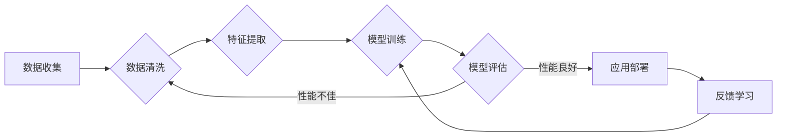

> 人工智能，深度学习，机器学习，神经科学，自然语言处理，计算机视觉，强化学习，未来趋势

# Andrej Karpathy：人工智能的未来发展方向

## 1. 背景介绍

Andrej Karpathy 是一位杰出的计算机科学家和人工智能专家，以其对神经网络和机器学习的深刻见解而闻名。他的工作在深度学习领域产生了深远的影响，特别是在自然语言处理（NLP）和计算机视觉（CV）领域。本文将探讨 Andrej Karpathy 的思想，并分析人工智能的未来发展方向。

### 1.1 人工智能的兴起

随着计算能力的提升和算法的进步，人工智能（AI）在过去几十年中取得了显著的进展。深度学习，作为机器学习的一个子领域，已经成为推动 AI 发展的关键技术。Andrej Karpathy 的贡献在于，他将深度学习的概念和实现带到了更广泛的受众面前。

### 1.2 Andrej Karpathy 的贡献

Karpathy 的工作涵盖了多个领域，包括：

- **NLP**：他在 NLP 领域的工作包括TensorFlow 的 inceptionism 和 convnetjs，这些项目帮助人们更好地理解深度学习模型的工作原理。
- **CV**：Karpathy 在 CV 领域的研究推动了图像识别和视觉理解的发展。
- **博客和公开演讲**：通过他的博客和公开演讲，Karpathy 向公众普及了深度学习的知识，并鼓励了更多人参与这一领域。

## 2. 核心概念与联系

### 2.1 Mermaid 流程图

以下是一个描述人工智能核心概念的 Mermaid 流程图：



### 2.2 核心概念

- **数据收集**：收集用于训练和测试的数据。
- **数据清洗**：清理和预处理数据，以提高数据质量。
- **特征提取**：从数据中提取有用的特征。
- **模型训练**：使用学习算法训练模型。
- **模型评估**：评估模型的性能。
- **应用部署**：将模型部署到实际应用中。
- **反馈学习**：根据实际应用中的反馈进一步训练模型。

## 3. 核心算法原理 & 具体操作步骤

### 3.1 算法原理概述

人工智能的核心算法包括：

- **机器学习**：通过数据学习模式，进行预测和决策。
- **深度学习**：一种特殊的机器学习方法，使用多层神经网络来学习复杂的数据表示。
- **神经网络**：由大量相互连接的神经元组成的计算模型。

### 3.2 算法步骤详解

1. **数据收集**：收集大量相关数据。
2. **数据预处理**：清洗、格式化和标注数据。
3. **特征提取**：从数据中提取有用信息。
4. **模型选择**：选择合适的模型架构和算法。
5. **模型训练**：使用训练数据训练模型。
6. **模型评估**：使用测试数据评估模型性能。
7. **模型优化**：根据评估结果调整模型参数。
8. **模型部署**：将模型部署到实际应用中。

### 3.3 算法优缺点

- **优点**：
  - 高效：能够处理大量数据。
  - 准确：能够从数据中学习复杂模式。
  - 自动化：能够自动从数据中学习，减少人工干预。

- **缺点**：
  - 计算成本高：需要大量的计算资源和时间。
  - 数据依赖性：需要大量高质量的数据。
  - 可解释性差：模型的决策过程通常难以解释。

### 3.4 算法应用领域

人工智能在以下领域有广泛应用：

- **自然语言处理**：语音识别、机器翻译、聊天机器人等。
- **计算机视觉**：图像识别、人脸识别、自动驾驶等。
- **医疗**：疾病诊断、药物研发等。
- **金融**：风险管理、欺诈检测等。

## 4. 数学模型和公式 & 详细讲解 & 举例说明

### 4.1 数学模型构建

深度学习中的数学模型通常基于神经网络。以下是一个简单的神经网络模型：

$$
y = f(W \cdot x + b)
$$

其中，$x$ 是输入数据，$W$ 是权重，$b$ 是偏置，$f$ 是激活函数。

### 4.2 公式推导过程

神经网络通过反向传播算法进行训练。以下是一个简单的反向传播算法的推导过程：

$$
\begin{aligned}
\delta W &= \frac{\partial J}{\partial W} \\
\delta b &= \frac{\partial J}{\partial b}
\end{aligned}
$$

其中，$J$ 是损失函数。

### 4.3 案例分析与讲解

以图像分类为例，可以使用卷积神经网络（CNN）进行图像分类。CNN 通过卷积层和池化层提取图像特征，并通过全连接层进行分类。

## 5. 项目实践：代码实例和详细解释说明

### 5.1 开发环境搭建

为了进行人工智能项目的实践，需要以下开发环境：

- Python
- PyTorch 或 TensorFlow
- NumPy
- Matplotlib

### 5.2 源代码详细实现

以下是一个简单的图像分类模型的代码实现：

```python
import torch
import torch.nn as nn

class SimpleCNN(nn.Module):
    def __init__(self):
        super(SimpleCNN, self).__init__()
        self.conv1 = nn.Conv2d(3, 16, kernel_size=3, padding=1)
        self.relu = nn.ReLU()
        self.pool = nn.MaxPool2d(kernel_size=2, stride=2)
        self.fc1 = nn.Linear(16 * 28 * 28, 10)

    def forward(self, x):
        x = self.pool(self.relu(self.conv1(x)))
        x = x.view(-1, 16 * 28 * 28)
        x = self.fc1(x)
        return x

model = SimpleCNN()
```

### 5.3 代码解读与分析

上述代码定义了一个简单的 CNN 模型，用于图像分类。模型由卷积层、ReLU 激活函数、池化层和全连接层组成。

### 5.4 运行结果展示

使用训练好的模型对新的图像进行分类，可以得到分类结果。

## 6. 实际应用场景

### 6.1 自然语言处理

在自然语言处理领域，AI 可以用于：

- 语音识别
- 机器翻译
- 情感分析
- 文本摘要

### 6.2 计算机视觉

在计算机视觉领域，AI 可以用于：

- 图像识别
- 人脸识别
- 目标检测
- 自动驾驶

## 7. 工具和资源推荐

### 7.1 学习资源推荐

- 《深度学习》（Ian Goodfellow、Yoshua Bengio、Aaron Courville 著）
- 《Python深度学习》（François Chollet 著）
- Coursera 上的深度学习课程

### 7.2 开发工具推荐

- PyTorch
- TensorFlow
- Jupyter Notebook

### 7.3 相关论文推荐

- "ImageNet Classification with Deep Convolutional Neural Networks"（Alex Krizhevsky、Ilya Sutskever、Geoffrey Hinton 著）
- "Sequence to Sequence Learning with Neural Networks"（Ilya Sutskever、 Oriol Vinyals、Quoc V. Le 著）
- "Attention Is All You Need"（Ashish Vaswani、Noam Shazeer、Niki Parmar 等著）

## 8. 总结：未来发展趋势与挑战

### 8.1 研究成果总结

人工智能在过去几十年中取得了巨大的进展，深度学习成为推动 AI 发展的关键技术。Andrej Karpathy 的工作在 AI 领域产生了深远的影响。

### 8.2 未来发展趋势

- **更强大的模型**：开发更强大的模型，以处理更复杂的数据和任务。
- **更高效的学习算法**：开发更高效的学习算法，以降低计算成本。
- **更可解释的模型**：提高模型的可解释性，以便更好地理解模型的决策过程。
- **跨领域应用**：将 AI 应用于更多领域，如医疗、教育、交通等。

### 8.3 面临的挑战

- **数据隐私**：如何保护用户数据隐私。
- **算法偏见**：如何避免算法偏见和歧视。
- **伦理问题**：如何处理 AI 伦理问题，如自动化武器和自动驾驶。

### 8.4 研究展望

AI 领域的未来充满挑战和机遇。通过不断的研究和创新，我们可以期待 AI 技术在更多领域发挥重要作用，并为人类社会带来更多福祉。

## 9. 附录：常见问题与解答

### 9.1 常见问题

- Q：什么是人工智能？
- A：人工智能是指使机器能够模拟人类智能行为的技术。

- Q：什么是深度学习？
- A：深度学习是一种特殊的机器学习方法，使用多层神经网络来学习复杂的数据表示。

- Q：AI 的未来发展趋势是什么？
- A：AI 的未来发展趋势包括更强大的模型、更高效的学习算法、更可解释的模型和跨领域应用。

### 9.2 解答

- 人工智能（AI）是指使机器能够模拟人类智能行为的技术。它包括机器学习、深度学习、自然语言处理、计算机视觉等多个子领域。

- 深度学习是一种特殊的机器学习方法，使用多层神经网络来学习复杂的数据表示。它通过自动从数据中学习特征，来实现智能行为。

- AI 的未来发展趋势包括更强大的模型、更高效的学习算法、更可解释的模型和跨领域应用。随着技术的不断发展，AI 将在更多领域发挥重要作用，并为人类社会带来更多福祉。

作者：禅与计算机程序设计艺术 / Zen and the Art of Computer Programming