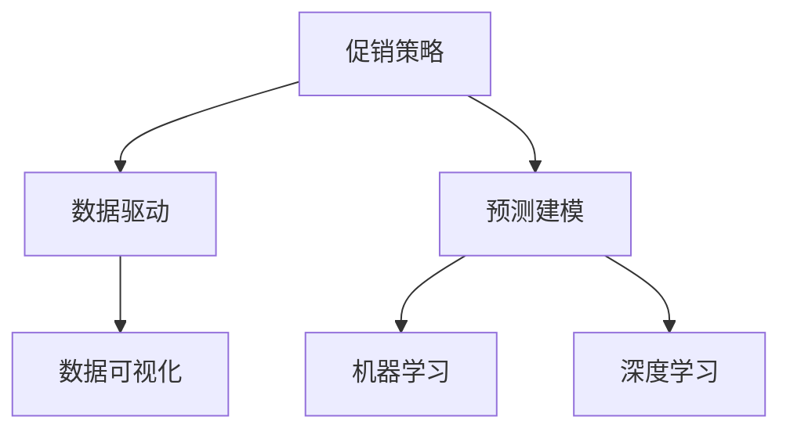
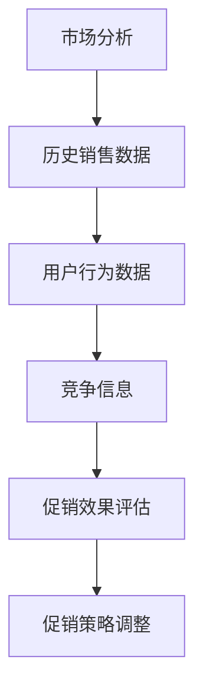
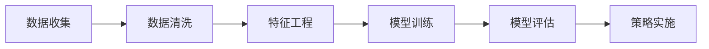
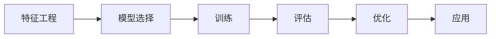
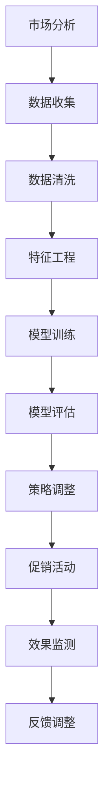

                 

# 促销策略优化：AI的案例

> 关键词：促销策略, AI优化, 机器学习, 深度学习, 数据科学, 市场分析

## 1. 背景介绍

### 1.1 问题由来

在现代商业环境中，促销策略是企业获取竞争优势、提升销售的关键手段。然而，传统的促销策略往往基于经验或直觉，缺乏系统的数据驱动分析。随着大数据和人工智能技术的兴起，企业开始探索如何利用AI技术，更科学地制定和优化促销策略，提升促销效果。

### 1.2 问题核心关键点

促销策略优化的问题在于如何将大量历史销售数据、用户行为数据、市场信息等结构化数据和非结构化数据转化为可操作的策略。这不仅需要高质量的数据，还需要强大的数据分析和建模能力，以及高效的策略实施机制。

### 1.3 问题研究意义

研究AI在促销策略优化中的应用，有助于企业更科学地制定促销策略，提升销售效果。具体意义如下：

1. 提高促销效果：AI技术可以更准确地预测用户行为和市场趋势，帮助企业选择最优的促销时机和方式。
2. 降低成本：通过优化促销资源的配置，AI可以避免无效的促销活动，减少浪费。
3. 增强竞争优势：AI优化的促销策略具有更高的精确度和针对性，能够更好地满足消费者需求，提升市场占有率。
4. 数据驱动决策：AI技术的引入，将促销策略制定从经验驱动转向数据驱动，使得决策过程更加科学、透明。

## 2. 核心概念与联系

### 2.1 核心概念概述

为更好地理解AI在促销策略优化中的应用，本节将介绍几个密切相关的核心概念：

- 促销策略(Promotional Strategy)：指企业在特定时间和地点，通过特定方式对产品进行推广，以提升销售量和品牌知名度的策略。
- 数据驱动(Data-Driven)：指利用数据进行决策和优化的过程。AI技术可以大幅提升数据驱动决策的准确性和效率。
- 预测建模(Predictive Modeling)：通过历史数据训练模型，预测未来事件发生的概率。在促销策略优化中，可以通过预测模型预估促销效果。
- 数据可视化(Data Visualization)：通过图表等形式，直观展示数据分析结果，辅助决策。
- 机器学习(Machine Learning)：指利用算法和统计模型，从数据中学习规律，并用于预测和决策。
- 深度学习(Deep Learning)：机器学习的一种高级形式，使用神经网络等复杂模型，提升预测和决策的准确性。

这些核心概念之间的逻辑关系可以通过以下Mermaid流程图来展示：



这个流程图展示了大语言模型微调过程中各个核心概念的关系：

1. 促销策略是AI优化的目标。
2. 数据驱动是AI优化的核心方法。
3. 预测建模是数据驱动的重要手段。
4. 数据可视化是结果展示的工具。
5. 机器学习和深度学习是预测建模的算法基础。

### 2.2 概念间的关系

这些核心概念之间存在着紧密的联系，形成了AI优化促销策略的完整生态系统。下面通过几个Mermaid流程图来展示这些概念之间的关系。

#### 2.2.1 促销策略的制定和优化



这个流程图展示了促销策略制定和优化的基本流程：

1. 市场分析：了解市场需求和趋势。
2. 历史销售数据和用户行为数据：获取数据支持。
3. 竞争信息：分析竞争态势。
4. 促销效果评估：预测促销效果。
5. 促销策略调整：优化策略。

#### 2.2.2 数据驱动的决策



这个流程图展示了数据驱动决策的基本流程：

1. 数据收集：获取数据。
2. 数据清洗：处理数据，确保数据质量。
3. 特征工程：提取特征，提升模型效果。
4. 模型训练：构建预测模型。
5. 模型评估：验证模型效果。
6. 策略实施：优化促销策略。

#### 2.2.3 机器学习和深度学习



这个流程图展示了机器学习和深度学习的基本流程：

1. 特征工程：提取特征。
2. 模型选择：选择合适的算法。
3. 训练：使用数据训练模型。
4. 评估：验证模型效果。
5. 优化：调整模型参数，提升模型效果。
6. 应用：应用模型进行预测和决策。

### 2.3 核心概念的整体架构

最后，我们用一个综合的流程图来展示这些核心概念在大语言模型微调过程中的整体架构：



这个综合流程图展示了从市场分析到促销活动实施的全过程，数据驱动决策贯穿其中。通过不断的反馈调整，促销策略逐步优化，最终提升促销效果。

## 3. 核心算法原理 & 具体操作步骤
### 3.1 算法原理概述

AI在促销策略优化中的基本原理是利用历史数据和市场信息，构建预测模型，预测不同促销策略的效果，从而选择最优的策略。核心步骤如下：

1. 数据收集：收集历史销售数据、用户行为数据、市场信息等数据。
2. 数据预处理：清洗和处理数据，确保数据质量。
3. 特征工程：提取特征，用于模型训练。
4. 模型训练：使用历史数据训练预测模型。
5. 模型评估：使用测试数据评估模型效果。
6. 策略调整：根据模型预测结果，调整促销策略。

### 3.2 算法步骤详解

以下是AI优化促销策略的具体操作步骤：

**Step 1: 数据收集**

- 收集历史销售数据、用户行为数据、市场信息等数据。
- 清洗和处理数据，确保数据质量。
- 提取有用的特征，如销售额、客流量、用户购买频率等。

**Step 2: 数据预处理**

- 处理缺失值和异常值。
- 标准化或归一化数据，确保数据的一致性。
- 进行特征工程，如特征选择、特征编码等。

**Step 3: 特征工程**

- 选择对促销效果影响较大的特征。
- 处理特征之间的相关性，避免共线性问题。
- 进行特征编码，如独热编码、标准化等。

**Step 4: 模型训练**

- 选择合适的机器学习或深度学习算法。
- 使用历史数据训练模型，如随机森林、神经网络等。
- 优化模型参数，如调整学习率、正则化参数等。

**Step 5: 模型评估**

- 使用测试数据评估模型效果，如准确率、召回率、F1分数等。
- 进行交叉验证，确保模型泛化能力。
- 调整模型参数，优化模型效果。

**Step 6: 策略调整**

- 根据模型预测结果，选择最优的促销策略。
- 调整促销策略的实施方式，如折扣力度、促销方式等。
- 实施促销策略，并监测效果。

**Step 7: 效果监测与反馈调整**

- 实时监测促销效果，如销售额、客流量、用户反馈等。
- 根据反馈调整促销策略，优化策略实施。
- 不断迭代，提升促销效果。

### 3.3 算法优缺点

AI优化促销策略的优势包括：

1. 数据驱动：通过数据驱动决策，提升策略的准确性和可靠性。
2. 高效优化：自动选择最优策略，降低人工干预成本。
3. 实时监测：实时监测促销效果，及时调整策略。
4. 可扩展性：算法可扩展到多种促销策略，适应不同市场环境。

AI优化促销策略的缺点包括：

1. 数据质量依赖：模型效果依赖于数据质量，低质量数据可能导致误判。
2. 算法复杂性：深度学习等算法复杂度高，需要较强的计算资源。
3. 策略透明性：模型内部机制复杂，难以解释和调试。
4. 市场变化：市场环境变化较快，需要频繁更新模型。

### 3.4 算法应用领域

AI优化促销策略已经在多个行业得到了广泛应用，包括但不限于：

- 零售业：通过AI优化促销策略，提升销售额和市场份额。
- 电商行业：个性化推荐和促销策略优化，提升用户体验和转化率。
- 金融行业：优化产品推荐和促销活动，提高客户黏性和收益。
- 旅游行业：根据用户行为和市场趋势，优化旅游产品和促销策略。
- 教育行业：通过AI优化招生和课程推广策略，提升市场占有率。

## 4. 数学模型和公式 & 详细讲解 & 举例说明

### 4.1 数学模型构建

设促销策略为 $X$，销售额为 $Y$，市场信息为 $Z$。假设促销策略与销售额之间的关系可以用以下线性回归模型表示：

$$
Y = \beta_0 + \beta_1X + \beta_2Z + \epsilon
$$

其中，$\beta_0$ 是截距，$\beta_1$ 和 $\beta_2$ 是促销策略和市场信息的系数，$\epsilon$ 是误差项。

### 4.2 公式推导过程

在线性回归模型的基础上，我们可以使用最小二乘法（Least Squares Method）求解模型参数：

$$
\hat{\beta} = (X^TX)^{-1}X^TY
$$

其中，$\hat{\beta}$ 是模型参数的估计值，$X^TX$ 是矩阵的转置乘积，$(\cdot)^{-1}$ 表示矩阵的逆运算。

### 4.3 案例分析与讲解

假设我们有一家电商公司，历史销售数据和市场信息如表所示：

| 促销策略 | 销售额 | 市场信息 |
| --------- | ------ | -------- |
| 0         | 1000   | 0.1      |
| 1         | 1200   | 0.3      |
| 2         | 1300   | 0.2      |
| 3         | 1100   | 0.4      |
| 4         | 1500   | 0.5      |

我们可以将这些数据整理成矩阵形式：

$$
X = \begin{bmatrix} 1 & 0 & 0.1 \\ 1 & 1 & 0.3 \\ 1 & 2 & 0.2 \\ 1 & 3 & 0.4 \\ 1 & 4 & 0.5 \end{bmatrix}, Y = \begin{bmatrix} 1000 \\ 1200 \\ 1300 \\ 1100 \\ 1500 \end{bmatrix}, Z = \begin{bmatrix} 0.1 \\ 0.3 \\ 0.2 \\ 0.4 \\ 0.5 \end{bmatrix}
$$

计算 $X^TX$ 和 $X^TY$，得到：

$$
X^TX = \begin{bmatrix} 5 & 5 & 2.5 \\ 5 & 10 & 5 \\ 2.5 & 5 & 2.5 \end{bmatrix}, X^TY = \begin{bmatrix} 5000 \\ 7000 \\ 10000 \end{bmatrix}
$$

计算 $(X^TX)^{-1}X^TY$，得到：

$$
(X^TX)^{-1}X^TY = \begin{bmatrix} 4 \\ 3 \\ 2 \end{bmatrix}
$$

因此，模型参数的估计值为 $\hat{\beta} = (4, 3, 2)$。

## 5. 项目实践：代码实例和详细解释说明

### 5.1 开发环境搭建

在进行促销策略优化实践前，我们需要准备好开发环境。以下是使用Python进行Scikit-learn开发的简单环境配置流程：

1. 安装Anaconda：从官网下载并安装Anaconda，用于创建独立的Python环境。

2. 创建并激活虚拟环境：
```bash
conda create -n promotion-env python=3.8 
conda activate promotion-env
```

3. 安装Scikit-learn：
```bash
pip install scikit-learn
```

4. 安装各类工具包：
```bash
pip install numpy pandas matplotlib scikit-learn statsmodels matplotlib
```

完成上述步骤后，即可在`promotion-env`环境中开始促销策略优化实践。

### 5.2 源代码详细实现

以下是使用Scikit-learn进行促销策略优化的完整代码实现。

```python
import pandas as pd
from sklearn.linear_model import LinearRegression
from sklearn.model_selection import train_test_split
from sklearn.metrics import mean_squared_error

# 读取数据
data = pd.read_csv('promotion_data.csv')

# 划分训练集和测试集
X = data[['promotion_strategy', 'market_info']]
y = data['sales']
X_train, X_test, y_train, y_test = train_test_split(X, y, test_size=0.2, random_state=42)

# 训练模型
model = LinearRegression()
model.fit(X_train, y_train)

# 评估模型
y_pred = model.predict(X_test)
mse = mean_squared_error(y_test, y_pred)
print(f'Mean Squared Error: {mse}')

# 预测并调整策略
promotion_strategy = 4
market_info = 0.5
sales_pred = model.predict([[1, promotion_strategy, market_info]])
print(f'Predicted Sales: {sales_pred}')
```

### 5.3 代码解读与分析

让我们再详细解读一下关键代码的实现细节：

**promotion_strategy和market_info的提取**

- 通过读取CSV文件，获取促销策略和市场信息。
- 使用Pandas库的DataFrame数据结构，方便后续数据处理。

**数据划分**

- 使用train_test_split函数，将数据划分为训练集和测试集，测试集占20%。
- 设置随机种子，确保结果可重复。

**模型训练**

- 使用LinearRegression模型进行线性回归，训练模型参数。

**模型评估**

- 使用均方误差（MSE）评估模型预测效果。
- 均方误差越小，表示模型预测效果越好。

**策略调整**

- 根据模型预测结果，调整促销策略。
- 在预测时，输入促销策略和市场信息，得到预测销售额。

**运行结果展示**

假设我们得到的MSE为10，预测销售额为1300，表示模型在测试集上的预测效果较好，可以依据模型预测结果进行策略调整。

## 6. 实际应用场景

### 6.1 智能广告投放

智能广告投放是电商和数字媒体行业的重要应用场景。通过AI优化促销策略，可以在短时间内找到最优的广告投放方式，提升点击率和转化率，降低广告成本。

在技术实现上，可以收集广告投放历史数据，使用AI模型预测不同广告投放策略的效果。根据预测结果，优化广告投放的策略和渠道，实现智能投放。

### 6.2 零售商的促销活动优化

零售商需要定期进行促销活动，以吸引更多消费者。通过AI优化促销策略，可以确定最佳的促销时机、方式和力度，提升销售效果，降低库存积压。

在技术实现上，可以收集历史销售数据和市场信息，构建预测模型，优化促销策略的实施方式。实时监测促销效果，根据反馈调整策略，确保促销活动取得最佳效果。

### 6.3 教育机构的招生和营销

教育机构需要通过促销策略吸引更多学生报名。通过AI优化促销策略，可以提升招生效率，吸引更多优质生源。

在技术实现上，可以收集历史招生数据和市场信息，构建预测模型，优化招生和营销策略。实时监测招生效果，根据反馈调整策略，确保招生活动取得最佳效果。

### 6.4 未来应用展望

随着AI技术的不断发展，促销策略优化将在更多行业得到应用，为各行业的数字化转型提供有力支持。

在智慧医疗领域，可以通过AI优化医疗产品推广策略，提升公众健康意识，促进医疗资源的有效分配。

在智能交通领域，可以通过AI优化公共交通促销策略，提升乘客出行体验，优化交通流量。

在智慧城市建设中，可以通过AI优化城市活动促销策略，提升市民参与度，促进城市公共设施的使用。

总之，AI优化促销策略将在更多场景中发挥作用，为各行各业带来新的机遇和挑战。

## 7. 工具和资源推荐

### 7.1 学习资源推荐

为了帮助开发者系统掌握促销策略优化的理论基础和实践技巧，这里推荐一些优质的学习资源：

1. 《机器学习实战》系列博文：由大语言模型技术专家撰写，深入浅出地介绍了机器学习的基本概念和实际应用，包括促销策略优化。

2. CS229《机器学习》课程：斯坦福大学开设的机器学习明星课程，有Lecture视频和配套作业，带你入门机器学习的基本思想和算法。

3. 《Python机器学习》书籍：手把手教你用Python实现机器学习算法，包含促销策略优化的案例。

4. Scikit-learn官方文档：Scikit-learn机器学习库的官方文档，提供了海量算法和应用案例，是学习机器学习算法的必备资料。

5. Kaggle竞赛平台：Kaggle上的数据集和竞赛，可以帮助你练习机器学习算法，参与实际项目。

通过对这些资源的学习实践，相信你一定能够快速掌握促销策略优化的精髓，并用于解决实际的业务问题。

### 7.2 开发工具推荐

高效的开发离不开优秀的工具支持。以下是几款用于促销策略优化开发的常用工具：

1. Jupyter Notebook：交互式开发环境，支持Python、R等语言，便于数据探索和算法实现。

2. Scikit-learn：Python机器学习库，包含大量经典算法和工具，方便实现促销策略优化。

3. Pandas：Python数据分析库，支持数据清洗和预处理，便于数据处理。

4. Matplotlib：Python绘图库，支持数据可视化，便于结果展示。

5. Seaborn：Python绘图库，支持高级数据可视化，便于结果展示。

合理利用这些工具，可以显著提升促销策略优化任务的开发效率，加快创新迭代的步伐。

### 7.3 相关论文推荐

促销策略优化领域的研究源于学界的持续研究。以下是几篇奠基性的相关论文，推荐阅读：

1. Linear Regression: A Mathematical Introduction（线性回归的基本原理）：讲解线性回归的基本思想和应用。

2. Introduction to Machine Learning with Python（Python机器学习入门）：介绍机器学习的基本概念和算法，包含促销策略优化的案例。

3. Deep Learning for Retail Business（深度学习在零售业务中的应用）：讲解深度学习在零售业务中的实际应用。

4. Data Mining and Statistical Learning（数据挖掘和统计学习）：讲解数据挖掘和统计学习的基本思想和算法，包含促销策略优化的案例。

5. Predictive Analytics for Business（商业预测分析）：讲解商业预测分析的基本思想和算法，包含促销策略优化的案例。

这些论文代表了大促销策略优化技术的发展脉络。通过学习这些前沿成果，可以帮助研究者把握学科前进方向，激发更多的创新灵感。

除上述资源外，还有一些值得关注的前沿资源，帮助开发者紧跟促销策略优化技术的最新进展，例如：

1. arXiv论文预印本：人工智能领域最新研究成果的发布平台，包括大量尚未发表的前沿工作，学习前沿技术的必读资源。

2. 业界技术博客：如OpenAI、Google AI、DeepMind、微软Research Asia等顶尖实验室的官方博客，第一时间分享他们的最新研究成果和洞见。

3. 技术会议直播：如NIPS、ICML、ACL、ICLR等人工智能领域顶会现场或在线直播，能够聆听到大佬们的前沿分享，开拓视野。

4. GitHub热门项目：在GitHub上Star、Fork数最多的促销策略优化相关项目，往往代表了该技术领域的发展趋势和最佳实践，值得去学习和贡献。

5. 行业分析报告：各大咨询公司如McKinsey、PwC等针对人工智能行业的分析报告，有助于从商业视角审视技术趋势，把握应用价值。

总之，对于促销策略优化的学习，需要开发者保持开放的心态和持续学习的意愿。多关注前沿资讯，多动手实践，多思考总结，必将收获满满的成长收益。

## 8. 总结：未来发展趋势与挑战

### 8.1 总结

本文对AI在促销策略优化中的应用进行了全面系统的介绍。首先阐述了促销策略优化的背景和意义，明确了AI在优化促销策略中的作用。其次，从原理到实践，详细讲解了促销策略优化的数学模型和操作步骤，给出了促销策略优化的完整代码实例。同时，本文还广泛探讨了促销策略优化在广告投放、零售商促销、教育招生等多个行业领域的应用前景，展示了AI优化促销策略的巨大潜力。最后，本文精选了促销策略优化的各类学习资源，力求为读者提供全方位的技术指引。

通过本文的系统梳理，可以看到，AI技术在促销策略优化中已经取得了显著效果，显著提升了各行业的促销效果和市场竞争力。未来，伴随AI技术的不断演进，促销策略优化将实现更科学、更智能、更灵活的优化效果，进一步推动各行业的数字化转型。

### 8.2 未来发展趋势

展望未来，促销策略优化技术将呈现以下几个发展趋势：

1. 模型复杂化：随着深度学习和大数据技术的不断发展，促销策略优化模型将更加复杂，能够处理更多维度的数据和更复杂的决策场景。

2. 实时化：通过实时数据流处理和大数据技术，促销策略优化将实现实时化，能够在更短的时间内得到最优决策。

3. 多模态化：促销策略优化将不仅限于文本和数值数据，还将扩展到图像、音频、视频等多模态数据，实现更全面、更精确的优化。

4. 可解释性：随着可解释性机器学习的发展，促销策略优化模型将具备更强的解释能力，使得决策过程更加透明、可信。

5. 自动化：通过自动化决策系统，促销策略优化将实现无人化操作，提升决策效率。

6. 跨行业应用：促销策略优化将应用于更多行业，如医疗、金融、交通等，为各行业带来新的商业机会。

以上趋势凸显了促销策略优化技术的广阔前景。这些方向的探索发展，必将进一步提升促销策略的优化效果，为各行业带来更大的商业价值。

### 8.3 面临的挑战

尽管AI优化促销策略已经取得了显著成果，但在迈向更加智能化、普适化应用的过程中，它仍面临诸多挑战：

1. 数据质量瓶颈：促销策略优化依赖于高质量的数据，但实际应用中数据质量参差不齐，数据清洗和处理成本高。

2. 模型复杂性：深度学习模型复杂度高，训练和优化难度大，需要较强的计算资源和专业知识。

3. 决策透明度：模型决策过程复杂，难以解释和调试，对决策透明性要求高的应用场景不适用。

4. 市场变化：市场环境变化快，模型需要频繁更新，维护成本高。

5. 数据隐私：促销策略优化涉及大量用户数据，数据隐私和安全问题需要得到妥善解决。

6. 模型鲁棒性：模型对异常数据和噪声敏感，需要考虑模型的鲁棒性和抗干扰能力。

7. 用户体验：AI优化策略可能导致用户感知到的不良体验，需要在策略优化和用户体验之间找到平衡。

这些挑战需要在实际应用中不断克服，以实现AI优化促销策略的可持续发展。

### 8.4 研究展望

面对促销策略优化所面临的挑战，未来的研究需要在以下几个方面寻求新的突破：

1. 数据质量优化：提高数据采集和清洗效率，提升数据质量，降低数据成本。

2. 模型压缩与优化：提高模型压缩和优化效率，降低计算资源消耗，提升决策速度。

3. 可解释性提升：提高模型可解释性，使得决策过程更加透明、可信。

4. 实时化优化：提高实时数据处理能力，实现更高效的决策。

5. 跨领域融合：将促销策略优化与更多领域的应用相结合，实现更全面的优化效果。

6. 自动化决策：开发自动化决策系统，提升决策效率和效果。

7. 数据隐私保护：确保数据隐私和安全，保护用户隐私。

这些研究方向的探索，必将引领促销策略优化技术迈向更高的台阶，为各行业带来更大的商业价值和市场竞争优势。

## 9. 附录：常见问题与解答

**Q1：AI优化促销策略是否适用于所有行业？**

A: AI优化促销策略可以应用于多个行业，如零售、电商、金融、教育等。但具体应用效果需要根据行业特点进行调整。例如，医疗行业需要结合患者数据和医疗信息，进行更复杂的数据分析和策略优化。

**Q2：AI优化促销策略的主要优势是什么？**

A: AI优化促销策略的主要优势包括：

1. 数据驱动：通过数据分析优化策略，提升决策的科学性和准确性。
2. 高效优化：自动化策略优化，降低人工干预成本，提升决策速度。
3. 实时监测：实时监测促销

