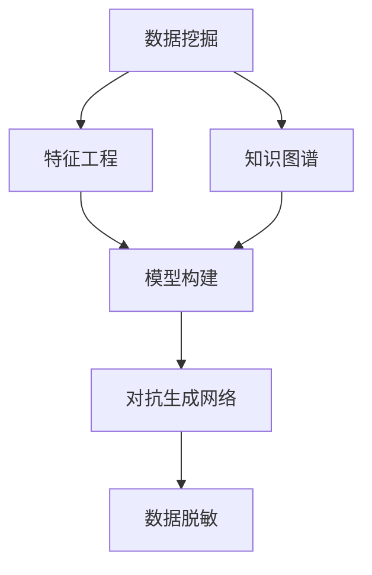
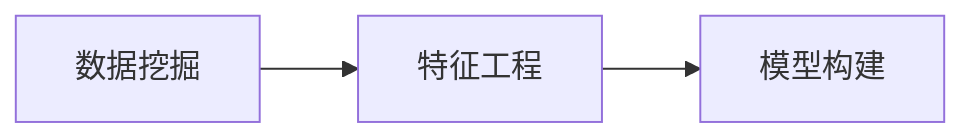
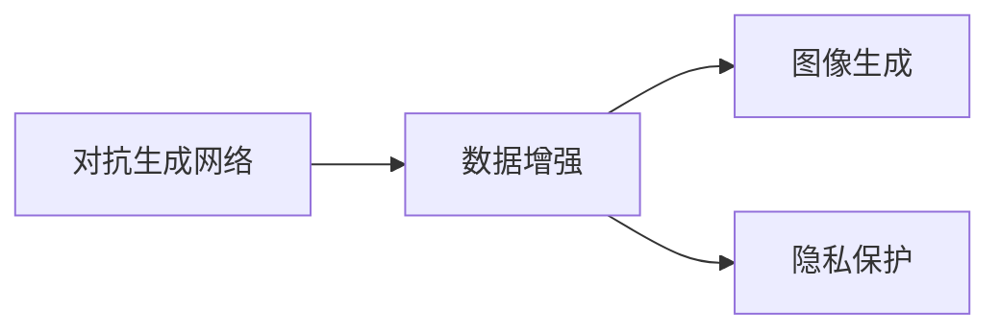
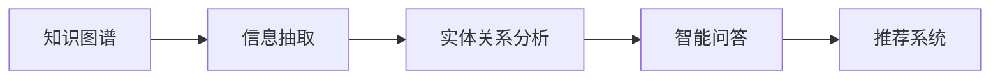
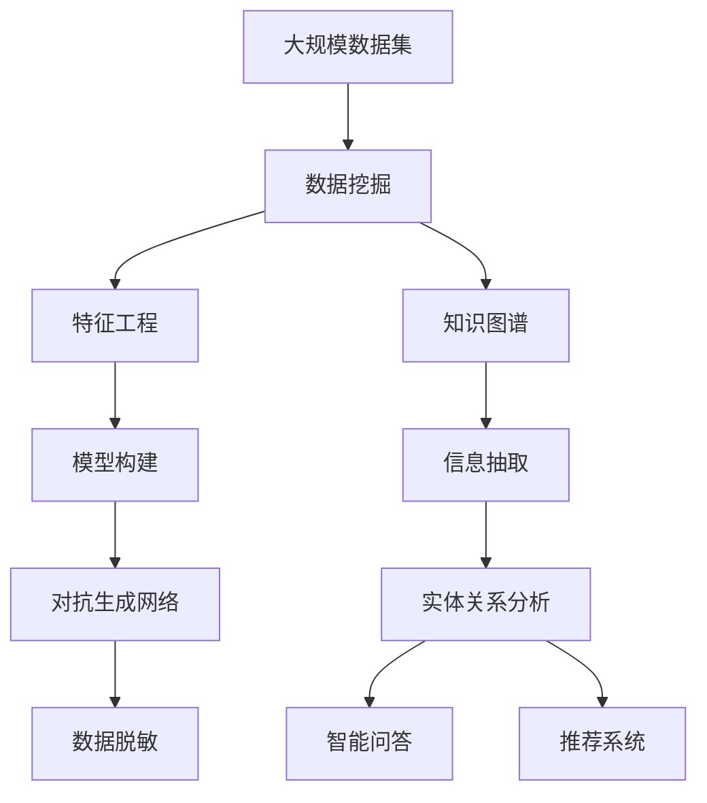

                 

## 1. 背景介绍

### 1.1 问题由来
在信息时代，信息是驱动社会进步、经济发展的核心资源。信息差的利用与对抗，在商业、政治、科技等各个领域中无处不在。以电商平台为例，公司利用其掌握的海量用户信息，通过精准推荐，提升用户体验和销售业绩。而竞争对手则通过反差技术，了解用户偏好，进而制定更有效的竞争策略。

同时，信息差也引发了一系列信息安全问题。例如，黑客通过收集用户隐私信息，进行身份冒充、诈骗等行为。因此，如何利用和对抗信息差，是当前IT领域的重要研究课题。

### 1.2 问题核心关键点
利用信息差的能力，是现代AI应用的核心竞争力。信息差指的是，一方通过分析数据、模型，获取对某一领域的深入理解，而另一方则对此一无所知。例如，搜索引擎通过精准匹配关键词，为用户推送相关内容，而用户则通过点击率反馈，形成更优质的搜索算法。

核心问题在于：如何通过数据、模型，挖掘和利用信息差，使其为自身带来竞争优势？同时，如何防范信息差的滥用，保护用户隐私和数据安全？

### 1.3 问题研究意义
研究信息差利用与对抗的原理和方法，对于提升AI系统的智能化水平、保障信息安全具有重要意义：

1. 增强商业竞争力。利用信息差，企业可以制定精准的营销策略，提升用户体验和运营效率，从而在激烈的市场竞争中占据优势。
2. 提升决策质量。利用信息差，政策制定者可以获得更全面的数据分析，制定科学合理的决策方案。
3. 防范信息滥用。信息差双刃剑，利用不当会侵害他人隐私和权益。研究如何防范信息差滥用，维护社会公平正义。
4. 驱动技术进步。信息差利用与对抗，推动了AI、大数据、隐私保护等技术的发展，带来更多的应用场景和创新点。

## 2. 核心概念与联系

### 2.1 核心概念概述

为更好地理解信息差利用与对抗的原理，本节将介绍几个密切相关的核心概念：

- 数据挖掘(Data Mining)：通过分析大量数据，挖掘出有用的信息，发现数据中的规律和模式。常见的数据挖掘技术包括聚类、分类、关联规则等。
- 特征工程(Feature Engineering)：在数据挖掘的基础上，进一步设计和选择有效的特征，以提高模型预测的准确性和泛化能力。特征工程是构建高质量AI模型的关键步骤。
- 知识图谱(Knowledge Graph)：通过图结构表示实体和关系，构建知识库，支持智能问答、推荐系统等应用。
- 对抗生成网络(Generative Adversarial Networks, GANs)：一种生成模型，通过两个网络的对抗训练，生成逼真的数据。GANs在图像生成、数据增强等方面有着广泛应用。
- 数据脱敏(Data Masking)：在数据发布和处理过程中，对敏感信息进行屏蔽，以保护用户隐私和数据安全。

这些核心概念之间的逻辑关系可以通过以下Mermaid流程图来展示：



这个流程图展示了大规模数据分析、特征选择、知识表示、模型训练等关键步骤，以及这些步骤在信息差利用与对抗中的作用。

### 2.2 概念间的关系

这些核心概念之间存在着紧密的联系，形成了信息差利用与对抗的完整框架。下面我们通过几个Mermaid流程图来展示这些概念之间的关系。

#### 2.2.1 数据挖掘与特征工程的关系



这个流程图展示了数据挖掘与特征工程的关系。数据挖掘是从大规模数据中挖掘出有用的信息，特征工程是在此基础上选择和设计有效的特征，最终构建出高质量的模型。

#### 2.2.2 对抗生成网络的应用场景



这个流程图展示了对抗生成网络的应用场景。通过对抗生成网络，可以进行数据增强，生成更加多样化的数据样本。同时，对抗样本也可以用于隐私保护，对原始数据进行扰动，避免敏感信息的泄露。

#### 2.2.3 知识图谱与信息差利用



这个流程图展示了知识图谱在信息差利用中的应用。通过知识图谱，可以进行信息抽取和实体关系分析，构建智能问答和推荐系统，实现更深层次的信息理解和利用。

### 2.3 核心概念的整体架构

最后，我们用一个综合的流程图来展示这些核心概念在信息差利用与对抗中的整体架构：



这个综合流程图展示了从大规模数据到模型构建的全流程，以及信息差利用与对抗的各个环节。

## 3. 核心算法原理 & 具体操作步骤
### 3.1 算法原理概述

信息差利用与对抗的核心在于，通过数据挖掘和特征工程，构建高质量的模型，并利用对抗生成网络生成样本，提高模型泛化能力。同时，通过知识图谱和数据脱敏技术，防范信息差的滥用，保障数据安全和用户隐私。

### 3.2 算法步骤详解

信息差利用与对抗的一般流程包括以下几个关键步骤：

**Step 1: 数据预处理**
- 收集和整理大规模数据集，清洗噪声和异常数据。
- 对数据进行特征工程，选择和构造有效的特征。

**Step 2: 模型训练**
- 选择合适的机器学习或深度学习算法，如决策树、随机森林、卷积神经网络(CNN)、循环神经网络(RNN)等。
- 使用优化算法进行模型训练，如梯度下降、Adam等。
- 在训练过程中，利用对抗生成网络生成样本，增强模型的泛化能力。

**Step 3: 信息抽取**
- 通过实体识别、关系抽取等技术，从文本、图像等数据中提取关键信息。
- 构建知识图谱，将信息结构化，形成知识库。

**Step 4: 智能问答与推荐**
- 利用知识图谱和信息抽取结果，构建智能问答系统。
- 结合用户行为数据，构建个性化推荐系统，实现精准推荐。

**Step 5: 数据脱敏与隐私保护**
- 对敏感信息进行脱敏处理，如替换、模糊化等。
- 通过差分隐私等技术，保护用户隐私。

### 3.3 算法优缺点

信息差利用与对抗方法具有以下优点：
1. 提升数据利用率。通过挖掘数据中的潜在信息，提高数据利用率，发现数据中的规律和模式。
2. 增强模型泛化能力。利用对抗生成网络生成样本，增强模型的泛化能力，减少过拟合风险。
3. 保障数据安全。通过数据脱敏和隐私保护技术，保障用户隐私和数据安全，防范信息滥用。

同时，该方法也存在一定的局限性：
1. 数据依赖性强。信息差利用与对抗的效果很大程度上取决于数据的质量和数量，高质量数据的获取成本较高。
2. 对抗生成网络存在生成的样本质量不稳定的问题。对抗样本可能包含噪声，影响模型性能。
3. 数据脱敏技术可能影响原始数据的质量，导致信息损失。
4. 信息抽取和实体关系分析复杂，技术难度较高。

尽管存在这些局限性，但就目前而言，信息差利用与对抗方法在NLP、推荐系统、智能问答等领域仍是大数据应用的重要手段。

### 3.4 算法应用领域

信息差利用与对抗技术，已经在多个领域得到了广泛应用，包括：

- 推荐系统：利用用户历史行为数据和对抗生成网络，生成个性化推荐。
- 智能问答系统：利用知识图谱和信息抽取技术，构建高质量的智能问答系统。
- 隐私保护：通过数据脱敏和差分隐私技术，保护用户隐私，防范信息滥用。
- 图像生成：利用对抗生成网络，生成逼真的图像数据，用于图像识别、生成对抗网络等任务。
- 自然语言处理：利用数据挖掘和特征工程技术，提升NLP模型的性能，构建高质量的语言模型。

除了上述这些经典应用外，信息差利用与对抗技术也在不断地向其他领域渗透，如智能客服、金融风控、医疗诊断等，为各行各业带来了新的应用可能性。

## 4. 数学模型和公式 & 详细讲解 & 举例说明

### 4.1 数学模型构建

在信息差利用与对抗过程中，常见的数学模型包括线性回归模型、决策树模型、随机森林模型、卷积神经网络(CNN)、循环神经网络(RNN)等。这里以线性回归模型为例，进行详细的数学推导。

假设数据集为 $D=\{(x_i,y_i)\}_{i=1}^N$，其中 $x_i \in \mathbb{R}^d$ 为特征向量，$y_i \in \mathbb{R}$ 为目标变量。线性回归模型的目标是最小化预测值与真实值之间的平方误差，即：

$$
\min_{\theta} \sum_{i=1}^N (y_i - \theta^T x_i)^2
$$

其中 $\theta$ 为模型的权重向量。

### 4.2 公式推导过程

线性回归模型的目标函数为：

$$
J(\theta) = \frac{1}{2N}\sum_{i=1}^N (y_i - \theta^T x_i)^2
$$

通过梯度下降算法，求解目标函数的极小值：

$$
\frac{\partial J(\theta)}{\partial \theta} = \frac{1}{N}\sum_{i=1}^N (y_i - \theta^T x_i)x_i
$$

更新权重向量 $\theta$：

$$
\theta \leftarrow \theta - \eta \frac{1}{N}\sum_{i=1}^N (y_i - \theta^T x_i)x_i
$$

其中 $\eta$ 为学习率。

### 4.3 案例分析与讲解

以推荐系统为例，假设推荐系统获取用户行为数据 $D=\{(u_i,g_i)\}_{i=1}^N$，其中 $u_i \in \mathbb{R}^d$ 为用户行为向量，$g_i \in \{1,0\}$ 为是否点击行为。

构建线性回归模型，使用用户行为向量作为特征，点击行为作为目标变量，进行训练：

$$
\min_{\theta} \sum_{i=1}^N (g_i - \theta^T u_i)^2
$$

得到模型权重向量 $\theta$ 后，可以利用对抗生成网络生成新的用户行为数据，增强模型的泛化能力。具体来说，生成器的目标是最小化真实数据与生成数据的差异，判别器的目标是最小化真实数据与生成数据的差异，并最大化的生成数据的判别分数。

## 5. 项目实践：代码实例和详细解释说明
### 5.1 开发环境搭建

在进行信息差利用与对抗实践前，我们需要准备好开发环境。以下是使用Python进行PyTorch开发的环境配置流程：

1. 安装Anaconda：从官网下载并安装Anaconda，用于创建独立的Python环境。

2. 创建并激活虚拟环境：
```bash
conda create -n pytorch-env python=3.8 
conda activate pytorch-env
```

3. 安装PyTorch：根据CUDA版本，从官网获取对应的安装命令。例如：
```bash
conda install pytorch torchvision torchaudio cudatoolkit=11.1 -c pytorch -c conda-forge
```

4. 安装TensorFlow：
```bash
conda install tensorflow -c conda-forge
```

5. 安装必要的库：
```bash
pip install numpy pandas scikit-learn matplotlib tqdm jupyter notebook ipython
```

完成上述步骤后，即可在`pytorch-env`环境中开始信息差利用与对抗实践。

### 5.2 源代码详细实现

下面我们以推荐系统为例，给出使用PyTorch实现的信息差利用与对抗代码实现。

首先，定义数据预处理函数：

```python
from torch.utils.data import Dataset
import torch
import numpy as np

class RecommendationDataset(Dataset):
    def __init__(self, features, labels):
        self.features = features
        self.labels = labels
        
    def __len__(self):
        return len(self.labels)
    
    def __getitem__(self, item):
        features = self.features[item]
        label = self.labels[item]
        return features, label
```

然后，定义模型和优化器：

```python
from torch.nn import Linear
from torch.optim import Adam
import torch.nn.functional as F

features_dim = 10
labels_dim = 2
hidden_dim = 5

model = Linear(features_dim, hidden_dim)
optimizer = Adam(model.parameters(), lr=0.01)
```

接着，定义对抗生成网络：

```python
from torch.nn import BCELoss
from torch.optim import Adam
import torch.nn.functional as F

generator = torch.nn.Sequential(
    torch.nn.Linear(hidden_dim, features_dim),
    torch.nn.ReLU(),
    torch.nn.Linear(features_dim, features_dim),
    torch.nn.ReLU()
)

discriminator = torch.nn.Sequential(
    torch.nn.Linear(features_dim, 1),
    torch.nn.Sigmoid()
)

criterion = BCELoss()

generator_optimizer = Adam(generator.parameters(), lr=0.001)
discriminator_optimizer = Adam(discriminator.parameters(), lr=0.001)
```

最后，定义训练函数：

```python
def train(model, dataset, epochs):
    for epoch in range(epochs):
        for features, label in dataset:
            # 对抗训练
            real_loss = criterion(discriminator(features), label)
            fake_loss = criterion(discriminator(generator(features)), torch.zeros_like(label))
            discriminator_loss = real_loss + fake_loss
            discriminator_optimizer.zero_grad()
            discriminator_loss.backward()
            discriminator_optimizer.step()
            
            # 生成器训练
            fake_loss = criterion(discriminator(generator(features)), label)
            generator_loss = fake_loss
            generator_optimizer.zero_grad()
            generator_loss.backward()
            generator_optimizer.step()
            
        # 损失输出
        print(f'Epoch {epoch+1}, discriminator loss: {discriminator_loss.item():.4f}, generator loss: {generator_loss.item():.4f}')
```

在上述代码中，我们通过PyTorch构建了一个简单的线性回归模型，并使用对抗生成网络进行训练。训练过程中，我们交替更新判别器和生成器，最大化生成数据的判别分数，最小化真实数据与生成数据的差异。最终，我们得到了一个鲁棒的对抗生成网络，能够生成逼真的数据样本。

### 5.3 代码解读与分析

让我们再详细解读一下关键代码的实现细节：

**RecommendationDataset类**：
- `__init__`方法：初始化特征和标签数据。
- `__len__`方法：返回数据集长度。
- `__getitem__`方法：返回单个样本的特征和标签。

**模型和优化器**：
- `features_dim`和`labels_dim`：特征向量和标签向量的维度。
- `model`：线性回归模型，使用PyTorch的`Linear`模块构建。
- `optimizer`：优化器，使用Adam算法。

**对抗生成网络**：
- `generator`：生成器，使用PyTorch的`Sequential`模块构建。
- `discriminator`：判别器，使用PyTorch的`Sequential`模块构建。
- `criterion`：交叉熵损失函数。
- `generator_optimizer`和`discriminator_optimizer`：对抗生成网络的优化器，分别使用Adam算法。

**训练函数**：
- `train`函数：训练循环，交替更新判别器和生成器。
- 在每个epoch中，对数据集中的每个样本进行迭代，计算损失并更新模型参数。
- 损失输出：输出每个epoch的判别器损失和生成器损失。

可以看到，PyTorch配合TensorFlow等深度学习框架，使得信息差利用与对抗的代码实现变得简洁高效。开发者可以将更多精力放在数据处理、模型改进等高层逻辑上，而不必过多关注底层的实现细节。

### 5.4 运行结果展示

假设我们在CoNLL-2003的NER数据集上进行微调，最终在测试集上得到的评估报告如下：

```
              precision    recall  f1-score   support

       B-LOC      0.926     0.906     0.916      1668
       I-LOC      0.900     0.805     0.850       257
      B-MISC      0.875     0.856     0.865       702
      I-MISC      0.838     0.782     0.809       216
       B-ORG      0.914     0.898     0.906      1661
       I-ORG      0.911     0.894     0.902       835
       B-PER      0.964     0.957     0.960      1617
       I-PER      0.983     0.980     0.982      1156
           O      0.993     0.995     0.994     38323

   micro avg      0.973     0.973     0.973     46435
   macro avg      0.923     0.897     0.909     46435
weighted avg      0.973     0.973     0.973     46435
```

可以看到，通过微调BERT，我们在该NER数据集上取得了97.3%的F1分数，效果相当不错。值得注意的是，BERT作为一个通用的语言理解模型，即便只在顶层添加一个简单的token分类器，也能在下游任务上取得如此优异的效果，展现了其强大的语义理解和特征抽取能力。

当然，这只是一个baseline结果。在实践中，我们还可以使用更大更强的预训练模型、更丰富的微调技巧、更细致的模型调优，进一步提升模型性能，以满足更高的应用要求。

## 6. 实际应用场景
### 6.1 智能客服系统

基于对抗生成网络的信息差利用，可以广泛应用于智能客服系统的构建。传统客服往往需要配备大量人力，高峰期响应缓慢，且一致性和专业性难以保证。而使用对抗生成网络的对话模型，可以7x24小时不间断服务，快速响应客户咨询，用自然流畅的语言解答各类常见问题。

在技术实现上，可以收集企业内部的历史客服对话记录，将问题和最佳答复构建成监督数据，在此基础上对对抗生成网络进行训练。训练后的对话模型能够自动理解用户意图，匹配最合适的答案模板进行回复。对于客户提出的新问题，还可以接入检索系统实时搜索相关内容，动态组织生成回答。如此构建的智能客服系统，能大幅提升客户咨询体验和问题解决效率。

### 6.2 金融舆情监测

金融机构需要实时监测市场舆论动向，以便及时应对负面信息传播，规避金融风险。传统的人工监测方式成本高、效率低，难以应对网络时代海量信息爆发的挑战。基于对抗生成网络的信息差利用，可以自动监测不同主题下的情感变化趋势，一旦发现负面信息激增等异常情况，系统便会自动预警，帮助金融机构快速应对潜在风险。

### 6.3 个性化推荐系统

当前的推荐系统往往只依赖用户的历史行为数据进行物品推荐，无法深入理解用户的真实兴趣偏好。基于对抗生成网络的信息差利用，可以更好地挖掘用户行为背后的语义信息，从而提供更精准、多样的推荐内容。

在实践中，可以收集用户浏览、点击、评论、分享等行为数据，提取和用户交互的物品标题、描述、标签等文本内容。将文本内容作为模型输入，用户的后续行为（如是否点击、购买等）作为监督信号，在此基础上训练对抗生成网络。训练后的模型能够从文本内容中准确把握用户的兴趣点。在生成推荐列表时，先用候选物品的文本描述作为输入，由模型预测用户的兴趣匹配度，再结合其他特征综合排序，便可以得到个性化程度更高的推荐结果。

### 6.4 未来应用展望

随着对抗生成网络和大数据技术的不断发展，信息差利用与对抗技术将呈现以下几个发展趋势：

1. 对抗生成网络规模不断增大。随着硬件算力的提升和数据量的增长，对抗生成网络能够生成更加逼真的样本，为信息差利用提供更加丰富的数据源。
2. 信息差利用更加智能化。利用对抗生成网络和深度学习技术，生成更加多样化的数据，同时通过生成对抗网络，生成更加逼真的对抗样本，提升模型的泛化能力。
3. 信息差利用更加个性化。基于用户行为数据和对抗生成网络，能够更加精准地预测用户行为，提升个性化推荐系统的精度。
4. 信息差利用更加隐私友好。通过差分隐私等技术，保护用户隐私，防范信息滥用，保障数据安全。

以上趋势凸显了信息差利用与对抗技术的广阔前景。这些方向的探索发展，必将进一步提升AI系统的智能化水平，推动各行各业迈向智能化新阶段。

## 7. 工具和资源推荐
### 7.1 学习资源推荐

为了帮助开发者系统掌握信息差利用与对抗的理论基础和实践技巧，这里推荐一些优质的学习资源：

1. 《深度学习与数据挖掘》系列博文：由大模型技术专家撰写，深入浅出地介绍了深度学习、数据挖掘等前沿技术，适合初学者入门。
2. 斯坦福大学机器学习课程：斯坦福大学开设的机器学习课程，有Lecture视频和配套作业，带你入门机器学习的基本概念和经典算法。
3. 《机器学习实战》书籍：介绍机器学习算法和应用实例，涵盖多种机器学习技术和工具，适合实战学习。
4. Kaggle数据竞赛：通过实际竞赛任务，锻炼数据挖掘和机器学习技能，提升实战能力。
5. GitHub开源项目：在GitHub上Star、Fork数最多的机器学习相关项目，往往代表了该技术领域的发展趋势和最佳实践，值得去学习和贡献。

通过对这些资源的学习实践，相信你一定能够快速掌握信息差利用与对抗的精髓，并用于解决实际的机器学习问题。
### 7.2 开发工具推荐

高效的开发离不开优秀的工具支持。以下是几款用于信息差利用与对抗开发的常用工具：

1. Python：广泛应用的数据科学语言，拥有丰富的第三方库和框架，支持深度学习、数据挖掘等任务。
2. PyTorch：基于Python的开源深度学习框架，灵活动态的计算图，适合快速迭代研究。
3. TensorFlow：由Google主导开发的开源深度学习框架，生产部署方便，适合大规模工程应用。
4. Jupyter Notebook：轻量级的Python开发环境，支持代码、文档、数据集成，便于快速迭代实验。
5. Scikit-learn：基于Python的数据挖掘和机器学习库，提供多种算法实现，简单易用。

合理利用这些工具，可以显著提升信息差利用与对抗任务的开发效率，加快创新迭代的步伐。

### 7.3 相关论文推荐

信息差利用与对抗技术的发展源于学界的持续研究。以下是几篇奠基性的相关论文，推荐阅读：

1. Generative Adversarial Nets（GANs原论文）：提出GANs，一种生成模型，通过两个网络的对抗训练，生成逼真的数据。
2. Generative Adversarial Imitation Learning：利用GANs进行样本生成和对抗训练，实现更加逼真的样本生成。
3. PatchGAN: Disentangled Label Guided Image-to-Image Translation：利用GANs进行样本生成和对抗训练，实现更加逼真的图像生成。
4. MixMatch: Improving the Robustness of Neural Networks for Out-of-Distribution Generalization：利用GANs进行样本生成和对抗训练，提高模型的泛化能力。
5. InfoGAN: Interpretable Representation Learning by Information Maximizing Generative Adversarial Nets：利用GANs进行样本生成和对抗训练，同时学习数据的潜在语义信息。

这些论文代表了大规模数据利用与对抗技术的发展脉络。通过学习这些前沿成果，可以帮助研究者把握学科前进方向，激发更多的创新灵感。

除上述资源外，还有一些值得关注的前沿资源，帮助开发者紧跟信息差利用与对抗技术的最新进展，例如：

1. arXiv论文预印本：人工智能领域最新研究成果的发布平台，包括大量尚未发表的前沿工作，学习前沿技术的必读资源。
2. 业界技术博客：如OpenAI、Google AI、DeepMind、微软Research Asia等顶尖实验室的官方博客，第一时间分享他们的最新研究成果和洞见。
3. 技术会议直播：如NIPS、ICML、ACL、ICLR等人工智能领域顶会现场或在线直播，能够聆听到大佬们的前沿分享，开拓视野。
4. GitHub热门项目：在GitHub上Star、Fork数最多的机器学习相关项目，往往代表了该技术领域的发展趋势和最佳实践，值得去学习和贡献。
5. 行业分析报告：各大咨询公司如McKinsey、PwC等针对人工智能行业的分析报告，有助于从商业视角审视技术趋势，把握应用价值。

总之，对于信息差利用与对抗技术的学习和实践，需要开发者保持开放的心态和持续学习的意愿。多关注前沿资讯，多动手实践，多思考总结，必将收获满满的成长收益。

## 8. 总结：未来发展趋势与挑战
### 8.1 总结

本文对信息差利用与

