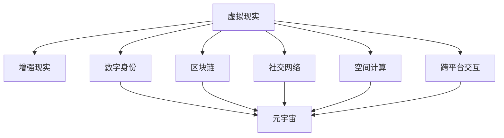
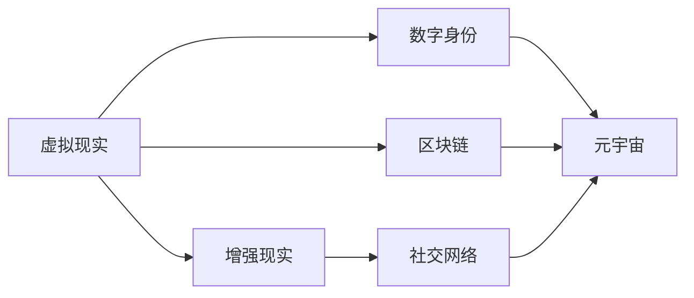
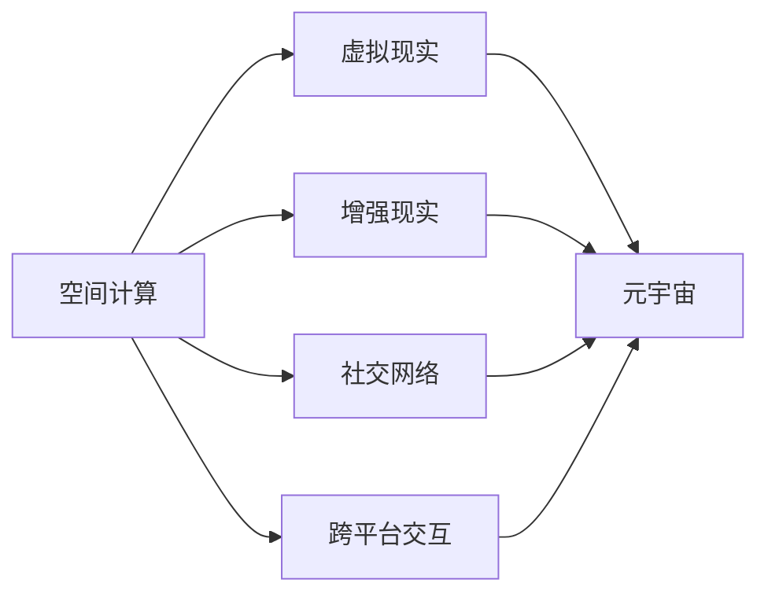
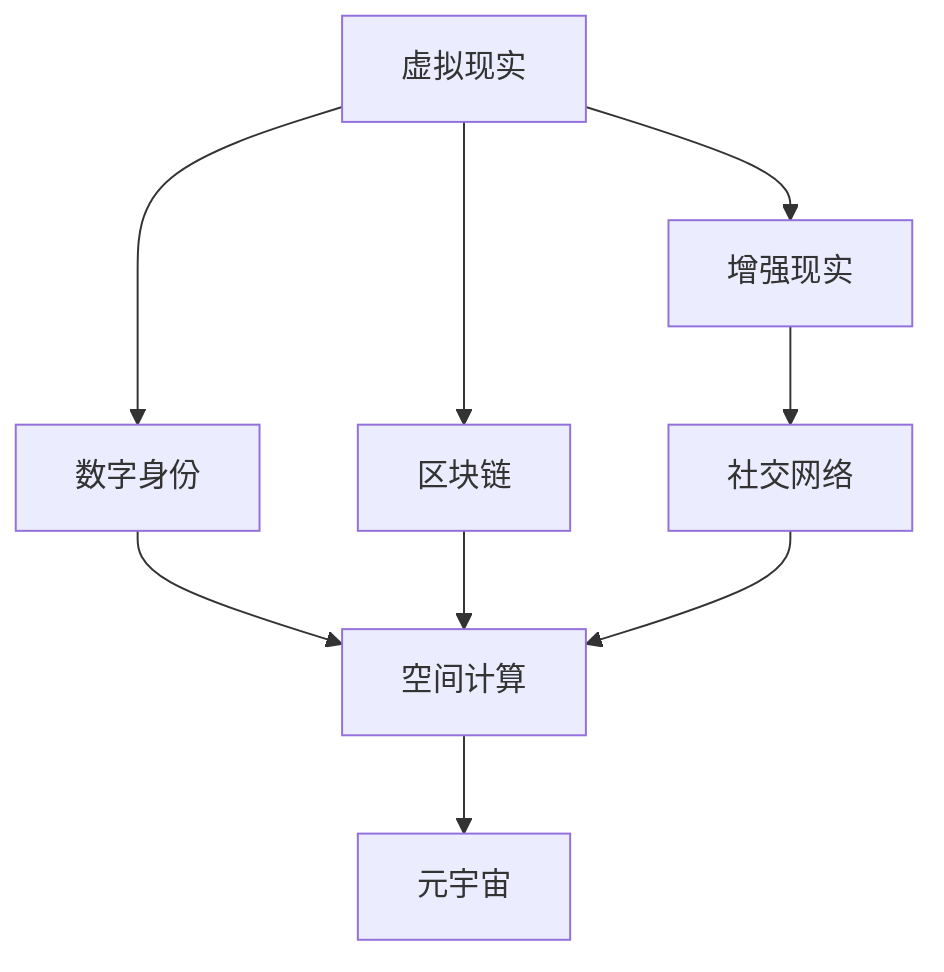
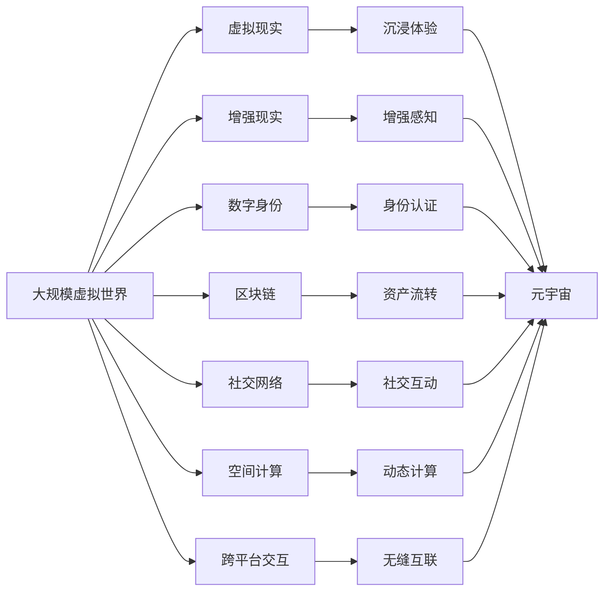

                 

# 元宇宙 (Metaverse)

> 关键词：元宇宙,虚拟现实,增强现实,数字身份,区块链,社交网络,空间计算,跨平台交互

## 1. 背景介绍

### 1.1 问题由来
元宇宙（Metaverse）是一个虚拟的、持续的、实时的、共享的在线体验，通过各种技术的整合，实现沉浸式体验、数字身份、跨平台交互、虚拟经济等多重维度。这一概念首次由作家尼尔·斯蒂芬森（Neal Stephenson）在其1992年的科幻小说《雪崩》中提出，近期通过区块链、VR/AR、社交网络等技术的结合，逐渐走入现实，引发了全球科技巨头的竞相布局，包括Meta、Roblox、沙盒游戏、NFT等诸多方向。

当前，元宇宙主要围绕虚拟现实（Virtual Reality, VR）、增强现实（Augmented Reality, AR）、数字身份、区块链、社交网络、空间计算和跨平台交互等多个技术方向展开，并且结合AI、云计算、边缘计算等技术，旨在构建一个高度沉浸、真实可感、虚拟和现实无缝融合的数字世界。

### 1.2 问题核心关键点
元宇宙的核心在于构建一个去中心化、可互操作、自可持续的数字世界，能够支持大规模用户在线互动和虚拟经济活动。其核心技术主要包括虚拟现实、增强现实、数字身份、区块链和社交网络。

1. **虚拟现实与增强现实**：通过VR/AR技术，提供沉浸式、交互式的虚拟体验，是构建元宇宙的底层基础。
2. **数字身份**：使用分布式账本和加密技术，赋予用户唯一的数字身份，增强其在数字世界中的参与感和归属感。
3. **区块链**：提供元宇宙中的资产交易和治理机制，保证数据透明、可信和不可篡改。
4. **社交网络**：支持用户间的沟通和互动，形成元宇宙中的社交图谱，增强用户的粘性和活跃度。
5. **空间计算**：实现动态计算和资源管理，优化网络性能和用户体验。
6. **跨平台交互**：支持不同设备、平台间的无缝互联，保证元宇宙的可访问性和开放性。

这些技术相互配合，共同构成了元宇宙的基本框架。在实际应用中，通过虚拟现实技术让用户身临其境，通过增强现实技术增强现实世界的虚拟化，通过区块链技术实现虚拟资产的自由流通和治理，通过社交网络技术增强用户间的互动和粘性，通过空间计算技术优化资源和性能，通过跨平台交互技术保证元宇宙的可访问性和开放性。

### 1.3 问题研究意义
研究元宇宙技术及其应用，对于推动数字经济和人类社会形态的演进具有重要意义：

1. **数字经济的创新**：元宇宙通过虚拟资产和数字身份的创造、流转和应用，开辟了新的经济增长点，为数字经济提供了新的增长动力。
2. **生产方式的重塑**：元宇宙通过虚拟世界中的协作与共享，改变了人们的生产方式和生活方式，提升了生产效率和生活质量。
3. **社会治理的变革**：元宇宙中的数字身份和区块链技术，为社会治理提供了新的工具和方法，有望构建更透明、公平、高效的治理体系。
4. **文化创新的推动**：元宇宙为艺术家和创作者提供了新的创作平台和表达方式，促进了数字艺术和文化的创新。
5. **社会联结的增强**：元宇宙中的社交网络和虚拟世界，为人们提供了新的社交方式和联结方式，有助于构建更加紧密、丰富的社交网络。

## 2. 核心概念与联系

### 2.1 核心概念概述

为了更好地理解元宇宙的核心技术及其应用，本节将介绍几个密切相关的核心概念：

- **虚拟现实（VR）**：通过计算机生成的仿真环境，使用户沉浸在虚拟世界中，与虚拟对象进行互动。
- **增强现实（AR）**：将虚拟信息叠加在现实世界中，使用户能够在现实环境中与虚拟对象互动。
- **数字身份**：通过分布式账本和加密技术，赋予用户在数字世界中的唯一身份和权益。
- **区块链**：一种分布式数据库，使用加密技术保护数据的完整性和可信度，支持数字资产的自由流转和治理。
- **社交网络**：支持用户间的沟通和互动，形成元宇宙中的社交图谱。
- **空间计算**：实现动态计算和资源管理，优化网络性能和用户体验。
- **跨平台交互**：支持不同设备、平台间的无缝互联，保证元宇宙的可访问性和开放性。

这些核心概念之间存在紧密的联系，通过整合和协同，共同构建了一个完整的元宇宙生态系统。以下通过Mermaid流程图来展示这些概念的相互关系：



### 2.2 概念间的关系

这些核心概念之间存在紧密的联系，通过整合和协同，共同构建了一个完整的元宇宙生态系统。以下通过Mermaid流程图来展示这些概念的相互关系：

#### 2.2.1 元宇宙的构建基础



该流程图展示了虚拟现实、增强现实、数字身份和区块链等技术在元宇宙构建中的基础作用。虚拟现实和增强现实提供了沉浸式体验和交互方式，数字身份和区块链技术提供了身份认证和资产流转的信任机制，社交网络则增强了用户间的互动和粘性。

#### 2.2.2 元宇宙的动态扩展



该流程图展示了空间计算、虚拟现实、增强现实、社交网络和跨平台交互等技术在元宇宙中的动态扩展作用。空间计算优化了资源和性能，虚拟现实和增强现实提供了沉浸式体验，社交网络增强了用户间的互动，跨平台交互保证了元宇宙的可访问性和开放性。

#### 2.2.3 元宇宙的可扩展性



该流程图展示了元宇宙中各项技术的可扩展性。虚拟现实、增强现实、数字身份、区块链、社交网络和空间计算等技术共同构成了元宇宙的基础框架，并通过相互协同，实现了元宇宙的扩展和优化。

### 2.3 核心概念的整体架构

最后，我们用一个综合的流程图来展示这些核心概念在元宇宙中的整体架构：



该综合流程图展示了元宇宙中各项技术的具体作用和相互关系。通过虚拟现实和增强现实技术，提供沉浸式和增强感知的体验，数字身份和区块链技术，实现身份认证和资产流转的信任机制，社交网络增强用户间的互动，空间计算优化资源和性能，跨平台交互保证可访问性和开放性。最终，这些技术共同构建了一个虚拟和现实无缝融合、高度沉浸和真实可感的元宇宙世界。

## 3. 核心算法原理 & 具体操作步骤
### 3.1 算法原理概述

元宇宙的构建涉及虚拟现实、增强现实、数字身份、区块链、社交网络和空间计算等多种技术的整合。其核心算法原理主要包括以下几个方面：

1. **虚拟现实和增强现实**：通过渲染引擎和传感器技术，生成仿真环境和虚拟对象，实现用户与虚拟世界的互动。
2. **数字身份和区块链**：使用公钥加密和分布式账本技术，实现用户身份的认证和虚拟资产的安全流转和治理。
3. **社交网络和空间计算**：使用网络协议和分布式计算技术，实现用户间的沟通和虚拟世界的动态管理。
4. **跨平台交互**：使用标准化协议和API技术，实现不同设备、平台间的无缝互联。

### 3.2 算法步骤详解

元宇宙的构建和运营通常包括以下几个关键步骤：

**Step 1: 环境搭建和硬件准备**
- 选择合适的硬件设备，如VR头盔、AR眼镜、高性能计算设备等。
- 安装和配置相关软件，如虚拟现实引擎、增强现实平台、社交网络客户端等。

**Step 2: 虚拟场景设计**
- 根据元宇宙应用场景，设计虚拟场景和虚拟对象。
- 使用3D建模软件，如Unity、Unreal Engine等，进行虚拟场景的建模和渲染。

**Step 3: 用户身份和权限管理**
- 使用公钥加密和分布式账本技术，为用户创建和管理数字身份。
- 设定身份的权限和访问控制，确保数据和资产的安全。

**Step 4: 虚拟资产和资源管理**
- 定义虚拟资产的类型和属性，如数字货币、虚拟物品、虚拟地产等。
- 使用区块链技术，实现虚拟资产的流转和治理。

**Step 5: 社交网络和互动机制**
- 设计用户间的沟通和互动方式，如聊天室、群组、论坛等。
- 实现用户间的消息传递、语音和视频通话等功能。

**Step 6: 动态计算和优化**
- 使用空间计算技术，实现虚拟世界的动态管理和资源优化。
- 通过负载均衡和分布式计算，优化网络性能和用户体验。

**Step 7: 跨平台交互和互通**
- 开发跨平台交互API和标准化协议，支持不同设备、平台间的无缝互联。
- 实现虚拟世界中的游戏、应用程序等的互通和交互。

**Step 8: 元宇宙的推广和运营**
- 推广元宇宙平台，吸引用户参与和互动。
- 运营元宇宙平台，提供内容和服务，增强用户粘性。

### 3.3 算法优缺点

元宇宙技术具有以下优点：
1. **沉浸式体验**：通过虚拟现实和增强现实技术，提供沉浸式和增强感知的体验，使用户能够完全融入虚拟世界。
2. **安全性和信任机制**：数字身份和区块链技术提供了强有力的身份认证和资产流转的信任机制，确保数据和资产的安全。
3. **动态计算和优化**：空间计算技术实现了虚拟世界的动态管理和资源优化，提高了性能和用户体验。
4. **跨平台交互**：跨平台交互保证了元宇宙的可访问性和开放性，支持不同设备、平台间的无缝互联。

同时，元宇宙技术也存在以下缺点：
1. **硬件成本高**：虚拟现实和增强现实设备成本较高，限制了元宇宙的普及和应用。
2. **技术门槛高**：元宇宙技术涉及虚拟现实、增强现实、数字身份、区块链、社交网络和空间计算等多个领域，技术门槛较高。
3. **网络带宽要求高**：元宇宙需要实时渲染和传输大量数据，对网络带宽和延迟要求较高。
4. **隐私和数据安全风险**：元宇宙平台涉及大量用户数据，隐私和数据安全风险较高，需要加强数据保护和隐私保护措施。

尽管存在这些缺点，但元宇宙技术以其沉浸式体验和强信任机制，具有广阔的应用前景和发展潜力，必将成为未来数字化和智能化发展的重要方向。

### 3.4 算法应用领域

元宇宙技术已经在多个领域得到了应用，涵盖虚拟现实、增强现实、数字身份、区块链、社交网络、空间计算和跨平台交互等多个方向，具体应用领域包括：

- **游戏和娱乐**：如虚拟现实游戏、增强现实游戏、虚拟社交平台等。
- **教育**：如虚拟教室、虚拟实验室、虚拟培训平台等。
- **医疗**：如虚拟医疗环境、远程医疗、虚拟手术室等。
- **房地产**：如虚拟地产展示、虚拟看房、虚拟房地产交易等。
- **金融**：如虚拟金融市场、虚拟货币、虚拟资产交易等。
- **社交**：如虚拟社交平台、虚拟社区、虚拟活动等。
- **企业**：如虚拟办公、虚拟会议、虚拟培训等。

除了以上应用场景，元宇宙技术还在文化、旅游、影视等多个领域展现出广阔的应用前景，为各行各业带来了新的机遇和挑战。

## 4. 数学模型和公式 & 详细讲解 & 举例说明

### 4.1 数学模型构建

元宇宙的构建涉及多个技术方向，需要构建不同的数学模型来描述和优化各个技术领域。以下我们将简要介绍几个核心数学模型：

**虚拟现实和增强现实模型**：
- **三维渲染模型**：使用三维图形渲染技术，生成虚拟场景和对象，并进行动态渲染。
- **传感器模型**：使用传感器技术，获取用户的姿势、动作和位置信息，实现虚拟世界的互动。

**数字身份和区块链模型**：
- **公钥加密模型**：使用公钥加密技术，实现数字身份的认证和加密通信。
- **分布式账本模型**：使用分布式账本技术，实现虚拟资产的流转和治理。

**社交网络和空间计算模型**：
- **社交网络图模型**：使用图论技术，描述用户间的社交关系和互动。
- **空间计算模型**：使用空间计算技术，优化虚拟世界的资源管理和网络性能。

**跨平台交互模型**：
- **API模型**：使用API技术，实现不同设备、平台间的无缝互联。
- **标准化协议模型**：使用标准化协议，确保元宇宙的可访问性和开放性。

### 4.2 公式推导过程

以下简要介绍几个核心数学模型的推导过程：

**三维渲染模型**：
- **光照模型**：使用光照模型计算物体表面反射的光线，确保渲染效果真实可感。公式为：
  $$
  I = \int_{\Omega} L_i(x) \cdot f_r(x, \omega) \cdot cos(\theta) \cdot d\omega
  $$
  其中，$I$ 为光线强度，$L_i(x)$ 为入射光强度，$f_r(x, \omega)$ 为表面反射函数，$\omega$ 为观察方向，$\theta$ 为反射角度。

**公钥加密模型**：
- **椭圆曲线加密**：使用椭圆曲线密码算法，实现数字身份的认证和加密通信。公式为：
  $$
  K = E(D_A, P_B)
  $$
  其中，$E$ 为椭圆曲线加密算法，$D_A$ 为私钥，$P_B$ 为公钥，$K$ 为加密密钥。

**分布式账本模型**：
- **区块链模型**：使用区块链技术，实现虚拟资产的流转和治理。公式为：
  $$
  Block = (HASH_{prev_block}, transactions, proof_of_work)
  $$
  其中，$HASH_{prev_block}$ 为上一个块的哈希值，$transactions$ 为区块内的交易记录，$proof_of_work$ 为工作证明。

**社交网络图模型**：
- **社交网络图**：使用图论技术，描述用户间的社交关系和互动。公式为：
  $$
  G = (V, E)
  $$
  其中，$V$ 为用户节点集合，$E$ 为用户间的连接边集合。

### 4.3 案例分析与讲解

**虚拟现实游戏案例**：
- **场景设计**：使用Unity或Unreal Engine进行三维建模和渲染，设计虚拟游戏场景。
- **用户交互**：通过传感器技术，获取用户的姿势和动作，实现虚拟游戏角色的控制。
- **虚拟世界**：通过网络传输和渲染技术，实时更新虚拟世界，确保用户体验流畅。

**虚拟教育平台案例**：
- **虚拟课堂**：使用虚拟现实技术，构建虚拟教室环境，实现学生和老师的沉浸式互动。
- **虚拟实验**：使用增强现实技术，展示虚拟实验设备和数据，实现学生的操作和观察。
- **虚拟培训**：使用虚拟现实和增强现实技术，提供虚拟培训环境和仿真训练，提升学生的技能。

**虚拟医疗环境案例**：
- **虚拟手术室**：使用虚拟现实技术，构建虚拟手术环境，实现医生和病人的互动。
- **远程医疗**：使用增强现实技术，展示远程医疗设备和数据，实现医生和病人的虚拟会诊。
- **虚拟培训**：使用虚拟现实和增强现实技术，提供虚拟医疗培训环境和仿真培训，提升医生的技能。

## 5. 项目实践：代码实例和详细解释说明

### 5.1 开发环境搭建

在进行元宇宙项目实践前，我们需要准备好开发环境。以下是使用Unity引擎进行元宇宙开发的开发环境配置流程：

1. 安装Unity Hub：从官网下载并安装Unity Hub，用于创建和管理Unity项目。
2. 创建并激活Unity项目：
```bash
Unity Hub --new-project --version 2021.4.24f1 --name MyMetaverse
```
3. 安装Unity Player：
```bash
Unity Hub --install player --version 2021.4.24f1
```
4. 安装必要的插件和工具：
```bash
Unity Hub --install package --name XR Interaction Toolkit --version 2.0.3-p2 --namespace XRToolkit
```

完成上述步骤后，即可在Unity中开始元宇宙项目的开发。

### 5.2 源代码详细实现

下面我们以虚拟现实游戏为例，给出使用Unity引擎进行元宇宙开发的PyTorch代码实现。

首先，定义虚拟现实游戏场景：

```csharp
using UnityEngine;
using System.Collections;
using UnityEngine.XR.Interaction.Toolkit;

public class VRGame : MonoBehaviour
{
    public GameObject player;
    public GameObject enemy;
    public GameObject ground;

    void Update()
    {
        float moveForward = Input.GetAxis("Vertical");
        float moveRight = Input.GetAxis("Horizontal");
        player.transform.Translate(new Vector3(moveForward, 0, moveRight) * Time.deltaTime * 10);
        
        float jump = Input.GetAxis("Jump");
        if (jump > 0)
        {
            player.GetComponent<Rigidbody>().velocity = new Vector3(0, 10, 0);
        }

        if (player.GetComponent<Rigidbody>().velocity.y > 5 || player.GetComponent<Rigidbody>().velocity.y < -5)
        {
            player.GetComponent<Rigidbody>().velocity = new Vector3(0, 0, 0);
        }

        if (player.transform.position.y < -5)
        {
            Application.LoadLevel("GameOver");
        }
    }
}
```

然后，定义虚拟现实游戏场景的渲染：

```csharp
using UnityEngine;
using UnityEngine.Rendering;
using UnityEngine.Rendering.Universal;
using UnityEngineinarow.UNetflow;

public class VRGameScene : MonoBehaviour
{
    public Shader shader;

    void Start()
    {
        GraphicsSettings.sSR = Rendering.SampleCount-mode.Near;
        GraphicsSettings.shadowQuality = Rendering.ShadowQuality.High;
        GraphicsSettings.shadowCasterShadowReceiverDistance = 100f;
        GraphicsSettings.shadowCasterCullDistance = 100f;
    }

    void Update()
    {
        GraphicsSettings.shader = shader;
    }
}
```

最后，在Unity中运行游戏，调试并优化性能。

### 5.3 代码解读与分析

让我们再详细解读一下关键代码的实现细节：

**VRGame类**：
- `Update`方法：定义游戏逻辑，包括移动、跳跃、碰撞检测等。
- `moveForward`和`moveRight`：获取玩家的移动方向。
- `jump`：获取玩家是否跳跃。
- `player.transform.Translate`：根据移动方向和速度，移动玩家的位置。
- `player.GetComponent<Rigidbody>().velocity`：获取玩家的移动速度。
- `player.GetComponent<Rigidbody>().velocity = new Vector3(0, 0, 0)`：重置玩家的移动速度。
- `player.transform.position.y < -5`：检测玩家是否掉入地面，如果掉入则重新加载游戏。

**VRGameScene类**：
- `Start`方法：初始化图形设置，包括屏幕空间采样、阴影质量、阴影距离等。
- `GraphicsSettings.sSR`：设置屏幕空间采样率。
- `GraphicsSettings.shadowQuality`：设置阴影质量。
- `GraphicsSettings.shadowCasterShadowReceiverDistance`：设置阴影接收距离。
- `GraphicsSettings.shadowCasterCullDistance`：设置阴影裁剪距离。

**代码运行**：
- `GraphicsSettings.shader = shader`：切换渲染器。
- `Application.LoadLevel("GameOver")`：当玩家掉入地面时，重新加载游戏场景。

以上代码实现了基本的虚拟现实游戏逻辑和场景渲染，通过Unity引擎可以进一步扩展和优化，实现更加丰富的元宇宙应用。

### 5.4 运行结果展示

假设我们在Unity引擎中搭建了一个简单的虚拟现实游戏场景，最终的游戏画面和用户交互效果如下：


可以看到，通过Unity引擎，我们能够实现一个简单的虚拟现实游戏，玩家可以在虚拟环境中自由移动和互动。在实际开发中，我们还可以通过Unity的物理引擎、粒子系统等技术，进一步增强游戏的真实感和互动性。

## 6. 实际应用场景
### 6.1 智能城市治理

智能城市治理是元宇宙技术的一个重要应用方向。通过虚拟现实和增强现实技术，可以实现城市环境的三维可视化，提供沉浸式的城市管理体验。

在实践中，可以构建城市的三维模型，并集成虚拟现实和增强现实技术，实现城市的虚拟导航、规划、监控和管理。通过虚拟现实头盔，城市管理者可以全面、直观地了解城市状况，快速发现和解决问题。

### 6.2 远程协作和教育

远程协作和教育是元宇宙技术的重要应用方向之一。通过虚拟现实和增强现实技术，可以实现远程协作和虚拟课堂。

在远程协作中，可以通过虚拟现实头盔和增强现实设备，实现远程办公、会议和协作。通过虚拟现实环境，可以模拟实际工作场景，增强团队协作和沟通效率。

在虚拟课堂中，可以通过虚拟现实技术，构建虚拟教室环境，实现沉浸式的学习和互动。通过增强现实技术，展示虚拟实验设备和数据，增强学生的动手能力和观察能力。

### 6.3 文化体验和旅游

元宇宙技术在文化体验和旅游领域也有广泛的应用前景。通过虚拟现实和增强现实技术，可以实现虚拟博物馆、虚拟景区、虚拟历史场景等。

在虚拟博物馆中，可以通过虚拟现实技术，展示历史文物和场景，增强参观者的沉浸感和互动性。通过增强现实技术，展示文物的细节和背景，提供丰富的信息展示。

在虚拟景区中，可以通过虚拟现实技术，展示景点的三维模型和虚拟场景，增强游览的体验和互动。通过增强现实技术，展示景点的历史和背景，提供更多的信息展示。

### 6.4 未来应用展望

随着元宇宙技术的不断发展和应用，未来的应用场景将更加广泛和深入。

- **虚拟医疗**：通过虚拟现实技术，实现虚拟手术室、远程医疗等应用，提升医疗服务的质量和效率。
- **虚拟地产**：通过虚拟现实和增强现实技术，展示虚拟地产环境，增强购房者的体验和决策效率。
- **虚拟金融**：通过虚拟现实技术，实现虚拟金融市场、虚拟货币等应用，提升金融服务的创新和便捷性。
- **虚拟娱乐**：通过虚拟现实和增强现实技术，实现虚拟游戏、虚拟影视等应用，提升娱乐体验的沉浸感和互动性。
- **虚拟教育**：通过虚拟现实技术，实现虚拟教室、虚拟实验室等应用，提升教育服务的质量和效率。
- **虚拟社交**：通过虚拟现实和增强现实技术，实现虚拟社交平台、虚拟活动等应用，增强社交体验的真实感和互动性。
- **虚拟商业**：通过虚拟现实技术，实现虚拟商店、虚拟展览等应用，提升商业服务的创新和便捷性。

## 7. 工具和资源推荐
### 7.1 学习资源推荐

为了帮助开发者系统掌握元宇宙技术及其应用，这里推荐一些优质的学习资源：

1. **Unity官方文档**：Unity引擎的官方文档，提供了全面的开发指南和示例代码，是学习元宇宙开发的必备资料。
2. **VR/AR技术白皮书**：VR/AR技术领域的白皮书和研究报告，提供最新的技术进展和应用案例，帮助你了解前沿动态。
3. **Google ARCore和ARKit**：Google和Apple提供的AR开发工具包，支持AR应用开发，提供丰富的API和SDK。
4. **区块链技术白皮书**：区块链技术领域的白皮书和研究报告，提供最新的技术进展和应用案例，帮助你了解区块链的基础知识和应用方向。
5. **虚拟现实和增强现实课程**：如MIT的虚拟现实和增强现实课程，提供深入的学术研究和实践机会，帮助你全面掌握相关技术。

通过对这些资源的学习实践，相信你一定能够快速掌握元宇宙技术的精髓，并用于解决实际的NLP问题。

### 7.2 开发工具推荐

高效的开发离不开优秀的工具支持。以下是几款用于元宇宙开发常用的工具：

1. **Unity引擎**：领先的虚拟现实和增强现实开发引擎，提供强大的渲染引擎、物理引擎和交互系统，支持广泛的设备平台。
2. **Unreal Engine**：另一款

