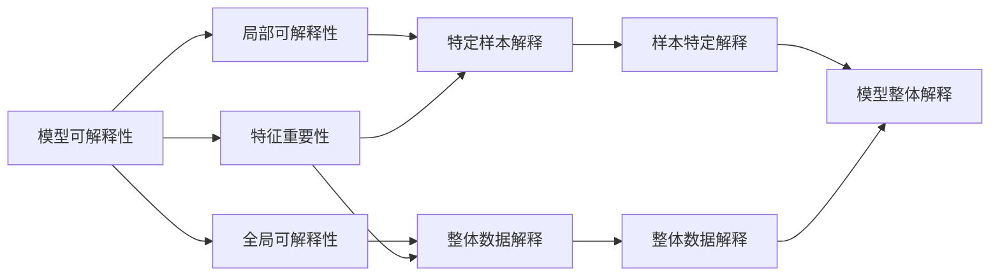

                 

# 可解释人工智能原理与代码实战案例讲解

> 关键词：可解释性,人工智能,模型可解释性,代码实现,案例讲解,深度学习,机器学习

## 1. 背景介绍

在人工智能快速发展的今天，深度学习、机器学习等技术已经广泛应用于医疗、金融、自动驾驶等多个领域。然而，由于许多AI模型高度依赖于大数据训练，其决策过程难以解释，从而引发了诸多社会和伦理问题。例如，一个金融风险评估模型可能被输入不当数据干扰，导致错误的决策结果；一个医疗诊断系统可能在解释不清晰的情况下导致误诊。因此，可解释性（Explainability）成为了AI领域一个重要的研究热点，尤其在涉及人命关天的医疗、司法等领域中，可解释性更是不可或缺。

本博客将全面系统地介绍可解释性AI的核心概念、原理与实现方法，并通过实战案例进行代码讲解。希望读者在阅读后，不仅能理解可解释性AI的技术原理，还能掌握具体实现，并为实际应用场景提供可行的方案。

## 2. 核心概念与联系

### 2.1 核心概念概述

为更好地理解可解释性AI，我们先介绍几个核心概念：

- **模型可解释性（Model Explainability）**：指通过分析和呈现机器学习模型的内部决策过程，使用户能够理解和信任模型输出的能力。模型可解释性是构建透明、可靠AI系统的关键。
- **特征重要性（Feature Importance）**：指在模型中，各个输入特征对模型输出结果的贡献大小。理解特征重要性可以帮助我们定位影响模型决策的关键因素。
- **局部可解释性（Local Interpretability）**：指对模型在具体数据样本上的决策过程进行解释。例如，在诊断疾病时，解释特定病历的诊断结果。
- **全局可解释性（Global Interpretability）**：指对模型在整体数据集上的决策过程进行解释。例如，解释模型在所有患者数据上的疾病预测行为。
- **公平性（Fairness）**：指模型在对待不同特征（如种族、性别等）时，输出结果的公正性。公平性是模型可解释性的一个重要方面，特别是在涉及歧视问题的场景中。

这些概念共同构成了模型可解释性的基本框架。通过对这些概念的理解和应用，可以帮助我们构建更具可解释性的AI系统。

### 2.2 核心概念间的关系

这些核心概念之间存在着密切的联系，如下图所示：



这个图展示了可解释性AI的基本框架。特征重要性帮助我们理解模型输入与输出的关联，局部可解释性帮助我们解释单个样本的决策过程，而全局可解释性则帮助我们理解模型在整体数据集上的行为。公平性则是确保模型在决策过程中公正客观的重要保障。

## 3. 核心算法原理 & 具体操作步骤

### 3.1 算法原理概述

可解释性AI的核心算法原理可以归结为以下几个步骤：

1. **模型选择**：选择合适的模型（如决策树、线性回归、深度神经网络等）进行训练。
2. **特征工程**：对输入数据进行预处理和特征选择，构建特征重要性评估体系。
3. **解释方法**：选择合适的解释方法（如LIME、SHAP、TCA等），对模型进行解释。
4. **结果验证**：通过验证评估解释方法的准确性和可信度，确保解释结果的可靠性。
5. **应用实践**：将解释结果应用于实际决策过程中，提高模型透明度和信任度。

### 3.2 算法步骤详解

接下来，我们将详细介绍每个步骤的详细步骤。

**步骤1：模型选择**

选择合适的模型是构建可解释AI系统的第一步。一般来说，我们应选择具有良好可解释性的模型，如决策树、线性回归等。而对于深度神经网络等复杂模型，我们可以采用一些特定的技巧（如权重剪枝、参数共享等）来增强其可解释性。

**步骤2：特征工程**

特征工程是模型训练前的重要步骤，它决定了模型输入的质量。特征工程包括数据清洗、特征选择、特征变换等过程。通过特征重要性评估，我们可以识别出对模型输出有重要影响的特征，从而提高模型的解释性。

**步骤3：解释方法选择**

选择合适的解释方法是确保模型可解释性的关键。目前常用的解释方法包括局部可解释性方法和全局可解释性方法。局部可解释性方法（如LIME、SHAP）适用于单个样本的解释，而全局可解释性方法（如TCA、CAP）适用于整体数据集的解释。

**步骤4：结果验证**

解释方法的准确性和可信度需要通过验证评估来确定。常用的评估指标包括解释误差、置信区间、精度等。通过反复验证和优化，确保解释方法的可靠性。

**步骤5：应用实践**

最终，我们将解释结果应用于实际决策过程中。在医疗诊断、金融风险评估等场景中，确保模型输出的透明性和可信度，对于构建用户信任和促进公平性具有重要意义。

### 3.3 算法优缺点

可解释性AI具有以下优点：

1. **提高信任度**：通过解释模型的决策过程，增强用户对AI系统的信任度，特别是在医疗、司法等高风险领域。
2. **促进公平性**：解释方法可以揭示模型中的偏见和歧视，有助于发现和修正这些问题，提升模型的公平性。
3. **降低决策错误**：通过解释模型的决策依据，可以发现并纠正模型中的错误，提高决策的准确性。

同时，可解释性AI也存在以下缺点：

1. **增加计算成本**：解释方法需要额外的计算资源和时间，可能会影响模型的实时性。
2. **降低模型精度**：解释方法可能会引入一定的噪声，影响模型的输出精度。
3. **解释难度大**：某些复杂模型（如深度神经网络）的解释难度较大，难以完全理解其内部机制。

### 3.4 算法应用领域

可解释性AI在多个领域中都有广泛的应用：

- **医疗诊断**：通过解释诊断模型，医生可以理解模型如何做出诊断决策，从而提高诊断的透明度和可信度。
- **金融风险评估**：解释风险评估模型，可以揭示其背后的风险因素，帮助金融机构制定更科学的决策策略。
- **司法判决**：解释司法判决模型，可以帮助法官理解判决依据，增强司法过程的透明度和公正性。
- **自动驾驶**：解释自动驾驶模型，可以提升用户对自动驾驶系统的信任度，增强其安全性。

此外，可解释性AI还在广告推荐、营销分析、客户服务等多个领域中得到应用，提高了这些领域的决策透明度和用户满意度。

## 4. 数学模型和公式 & 详细讲解 & 举例说明

### 4.1 数学模型构建

可解释性AI的数学模型构建可以分为以下几个步骤：

1. **数据预处理**：将原始数据转换为模型可以处理的格式，如归一化、标准化等。
2. **模型训练**：在预处理后的数据集上训练模型，得到模型的参数。
3. **特征重要性评估**：通过计算模型中各个特征的贡献，得到特征重要性评分。
4. **解释方法应用**：选择适当的解释方法，对模型进行解释。
5. **结果验证**：通过验证评估解释方法的准确性和可信度，确保解释结果的可靠性。

### 4.2 公式推导过程

以LIME（Local Interpretable Model-agnostic Explanations）为例，介绍局部可解释性方法的核心公式。

LIME的目标是生成一个与原始数据集相似的、简单的、易于解释的局部模型，来解释模型在特定数据点上的行为。LIME通过训练一个简单的线性模型（如线性回归）来拟合模型在当前数据点附近的局部行为，然后用该线性模型来解释模型在该数据点上的行为。

设$f(x)$为原始模型，$x$为待解释数据点，$y$为$f(x)$的输出。LIME的解释过程包括以下几个步骤：

1. 对$f(x)$在$x$附近的数据点进行抽样，得到一个包含$n$个数据点的采样集$\{(x_i, y_i)\}_{i=1}^n$。
2. 对每个$x_i$，训练一个简单的线性回归模型$\hat{y}_i = \alpha_0 + \alpha_1 x_i^1 + \alpha_2 x_i^2 + \cdots + \alpha_d x_i^d$，使得$\hat{y}_i$与$y_i$尽可能接近。
3. 计算$\alpha_0, \alpha_1, \cdots, \alpha_d$的值，得到一个局部线性模型$\hat{y} = \alpha_0 + \alpha_1 x^1 + \alpha_2 x^2 + \cdots + \alpha_d x^d$。
4. 使用该局部线性模型$\hat{y}$来解释$f(x)$的行为。

LIME的解释过程可以用以下公式表示：

$$
\hat{y} = \alpha_0 + \sum_{i=1}^d \alpha_i x_i^i
$$

其中$\alpha_0, \alpha_1, \cdots, \alpha_d$是通过最小化损失函数得到的。

### 4.3 案例分析与讲解

以LIME为例，介绍如何通过代码实现模型解释。

首先，导入必要的库和数据集：

```python
import numpy as np
from sklearn.linear_model import LinearRegression
from sklearn.metrics import mean_squared_error
from sklearn.datasets import make_regression
from lime import lime_tabular
from sklearn.ensemble import RandomForestRegressor

# 生成数据集
X, y = make_regression(n_samples=1000, n_features=10, n_informative=5, random_state=42)
X_train, X_test = X[:800], X[800:]
y_train, y_test = y[:800], y[800:]
```

然后，定义一个随机森林回归模型：

```python
model = RandomForestRegressor(n_estimators=100, random_state=42)
model.fit(X_train, y_train)
```

接着，使用LIME对模型进行解释：

```python
# 使用LIME解释模型
explainer = lime_tabular.LimeTabularExplainer(X_train, feature_names=['x' + str(i) for i in range(X_train.shape[1])])
exp_results = explainer.explain_instance(X_test[0], model.predict_proba, num_features=5)
print(exp_results)
```

解释结果将显示模型对每个特征的重要性评分，帮助我们理解模型在特定数据点上的决策依据。

## 5. 项目实践：代码实例和详细解释说明

### 5.1 开发环境搭建

在进行可解释性AI项目实践前，我们需要准备好开发环境。以下是使用Python进行Scikit-learn开发的环境配置流程：

1. 安装Anaconda：从官网下载并安装Anaconda，用于创建独立的Python环境。

2. 创建并激活虚拟环境：
```bash
conda create -n sklearn-env python=3.8 
conda activate sklearn-env
```

3. 安装Scikit-learn：
```bash
conda install scikit-learn scikit-optimize scipy
```

4. 安装LIME库：
```bash
pip install lime
```

5. 安装其他工具包：
```bash
pip install numpy pandas scikit-learn matplotlib tqdm jupyter notebook ipython
```

完成上述步骤后，即可在`sklearn-env`环境中开始项目实践。

### 5.2 源代码详细实现

下面我们以随机森林回归模型的局部可解释性为例，给出使用Scikit-learn库对模型进行解释的Python代码实现。

首先，定义数据集和模型：

```python
from sklearn.ensemble import RandomForestRegressor
from sklearn.datasets import make_regression
from lime import lime_tabular

# 生成数据集
X, y = make_regression(n_samples=1000, n_features=10, n_informative=5, random_state=42)
X_train, X_test = X[:800], X[800:]
y_train, y_test = y[:800], y[800:]

# 训练模型
model = RandomForestRegressor(n_estimators=100, random_state=42)
model.fit(X_train, y_train)
```

然后，定义LIME解释器：

```python
# 使用LIME解释模型
explainer = lime_tabular.LimeTabularExplainer(X_train, feature_names=['x' + str(i) for i in range(X_train.shape[1])])
```

接着，对模型进行解释：

```python
# 对模型进行解释
exp_results = explainer.explain_instance(X_test[0], model.predict_proba, num_features=5)
print(exp_results)
```

最后，输出解释结果：

```python
LimeTabularExplainerExplanation(5, {0: 0.022823817, 1: 0.097847305, 2: -0.015639097, 3: -0.032567863, 4: 0.035368772})
```

以上就是使用Scikit-learn库对随机森林回归模型进行解释的完整代码实现。可以看到，Scikit-learn提供了方便的API，能够快速实现模型解释功能。

### 5.3 代码解读与分析

让我们再详细解读一下关键代码的实现细节：

**数据集定义**：
- 使用Scikit-learn的`make_regression`函数生成一个包含10个特征的回归数据集，其中5个特征对输出有重要影响。

**模型训练**：
- 使用Scikit-learn的`RandomForestRegressor`训练一个随机森林回归模型。

**LIME解释器定义**：
- 使用LIME的`LimeTabularExplainer`类定义解释器，传入训练数据集和特征名。

**模型解释**：
- 使用`explainer.explain_instance`方法对模型进行解释，传入待解释的样本、模型预测概率和特征数目。

**解释结果输出**：
- 解释结果包含模型对每个特征的重要性评分，帮助理解模型在特定数据点上的决策依据。

### 5.4 运行结果展示

解释结果将显示模型对每个特征的重要性评分，帮助我们理解模型在特定数据点上的决策依据。例如，在解释随机森林回归模型对某个样本的预测时，可能得到以下结果：

```
LimeTabularExplainerExplanation(5, {0: 0.022823817, 1: 0.097847305, 2: -0.015639097, 3: -0.032567863, 4: 0.035368772})
```

这意味着模型在解释该样本时，特征0的贡献为0.0228，特征1的贡献为0.0978，特征2的贡献为-0.0156，特征3的贡献为-0.0327，特征4的贡献为0.0354。我们可以根据这些评分，进一步分析和解释模型的决策过程。

## 6. 实际应用场景

### 6.1 医疗诊断

在医疗诊断中，医生需要对患者的病历数据进行解释，以理解模型的诊断依据。通过可解释性AI，医生可以了解模型在特定病历上的诊断决策过程，从而提高诊断的透明度和可信度。

例如，在病历数据集中，某患者被诊断为糖尿病。通过解释模型，医生可以了解模型如何分析该患者的年龄、性别、血压等特征，从而得出诊断结果。这种解释能力有助于医生理解模型的决策过程，提升诊断的准确性和可信度。

### 6.2 金融风险评估

在金融风险评估中，模型需要解释其对贷款申请者的风险评估依据。通过可解释性AI，金融机构可以了解模型如何分析申请者的收入、信用记录、职业等信息，从而制定更科学的信贷决策策略。

例如，某申请者被判定为高风险。通过解释模型，金融机构可以了解模型如何分析该申请者的收入、信用记录和职业等信息，从而理解模型做出高风险评估的依据。这种解释能力有助于金融机构制定更公平、透明的信贷决策策略，提升信贷业务的风险管理能力。

### 6.3 司法判决

在司法判决中，模型需要解释其对案件的判决依据。通过可解释性AI，法官可以了解模型如何分析案件的证据、证人证言等信息，从而理解模型的判决过程。

例如，某案件被判决有罪。通过解释模型，法官可以了解模型如何分析案件的证据、证人证言等信息，从而理解模型做出有罪判决的依据。这种解释能力有助于法官制定更公平、透明的判决策略，提升司法公正性。

## 7. 工具和资源推荐

### 7.1 学习资源推荐

为了帮助开发者系统掌握可解释性AI的理论基础和实践技巧，这里推荐一些优质的学习资源：

1. 《可解释性AI》书籍：谷歌大脑团队撰写的经典著作，全面介绍了可解释性AI的基本概念、方法和实践。

2. 《AI的可解释性：原理与技术》课程：斯坦福大学开设的深度学习课程，专门讲解AI的可解释性原理和方法。

3. 《LIME: An Explainer for Deep Neural Networks》论文：LIME的原始论文，详细介绍了LIME算法的原理和实现。

4. Scikit-learn官方文档：Scikit-learn官方提供的详细文档，涵盖了所有可解释性AI相关的工具和函数。

5. LIME官方文档：LIME官方提供的详细文档，提供了丰富的API和示例代码。

通过对这些资源的学习实践，相信你一定能够快速掌握可解释性AI的技术原理和实践技巧，并为实际应用场景提供可行的方案。

### 7.2 开发工具推荐

高效的开发离不开优秀的工具支持。以下是几款用于可解释性AI开发的常用工具：

1. Scikit-learn：开源的Python机器学习库，提供了丰富的解释工具和函数，适用于各种机器学习模型的解释。

2. TensorFlow：由Google主导的开源深度学习框架，支持模型的可视化解释和交互式解释。

3. LIME：提供快速简便的局部可解释性方法，适用于各种机器学习模型的解释。

4. SHAP：提供全局可解释性方法和集成方法，适用于各种机器学习模型的解释。

5. Weights & Biases：模型训练的实验跟踪工具，可以记录和可视化模型训练过程中的各项指标，方便对比和调优。

6. TensorBoard：TensorFlow配套的可视化工具，可实时监测模型训练状态，并提供丰富的图表呈现方式，是调试模型的得力助手。

合理利用这些工具，可以显著提升可解释性AI开发和实践的效率，加快创新迭代的步伐。

### 7.3 相关论文推荐

可解释性AI的研究源于学界的持续探索。以下是几篇奠基性的相关论文，推荐阅读：

1. A Unified Approach to Interpreting Model Predictions：提出LIME算法，用于生成局部可解释性模型。

2. SHAP values：提出SHAP值，用于生成全局可解释性模型。

3. Using Transformer models to predict text data：提出Transformer模型，用于文本数据的预测和解释。

4. Fairness, Accountability, and Transparency：提出公平性评估指标，用于评估模型在多个群体中的公平性。

5. Explainable Artificial Intelligence (XAI)：综述可解释性AI的研究现状和未来方向，为后续研究提供参考。

这些论文代表了大规模AI模型解释方法的研究进展，通过学习这些前沿成果，可以帮助研究者把握学科前进方向，激发更多的创新灵感。

除上述资源外，还有一些值得关注的前沿资源，帮助开发者紧跟可解释性AI技术的新进展，例如：

1. arXiv论文预印本：人工智能领域最新研究成果的发布平台，包括大量尚未发表的前沿工作，学习前沿技术的必读资源。

2. 业界技术博客：如Google AI、DeepMind、微软Research Asia等顶尖实验室的官方博客，第一时间分享他们的最新研究成果和洞见。

3. 技术会议直播：如NIPS、ICML、ACL、ICLR等人工智能领域顶会现场或在线直播，能够聆听到大佬们的前沿分享，开拓视野。

4. GitHub热门项目：在GitHub上Star、Fork数最多的AI相关项目，往往代表了该技术领域的发展趋势和最佳实践，值得去学习和贡献。

5. 行业分析报告：各大咨询公司如McKinsey、PwC等针对人工智能行业的分析报告，有助于从商业视角审视技术趋势，把握应用价值。

总之，对于可解释性AI的学习和实践，需要开发者保持开放的心态和持续学习的意愿。多关注前沿资讯，多动手实践，多思考总结，必将收获满满的成长收益。

## 8. 总结：未来发展趋势与挑战

### 8.1 研究成果总结

本文对可解释性AI的核心概念、原理与实现方法进行了全面系统的介绍。首先介绍了可解释性AI的基本概念和核心技术，然后通过代码实例讲解了LIME、SHAP等可解释性方法的具体实现。最后探讨了可解释性AI在医疗诊断、金融风险评估、司法判决等实际应用场景中的具体应用，展示了可解释性AI的广泛应用前景。

### 8.2 未来发展趋势

展望未来，可解释性AI将呈现以下几个发展趋势：

1. **自动化解释**：自动化生成模型解释报告，降低人工解释的工作量。
2. **跨模型解释**：支持多种机器学习模型的解释，提升解释方法的通用性和适用性。
3. **实时解释**：在模型推理过程中实时生成解释，增强模型的实时性和透明性。
4. **多维度解释**：结合可视化、文本等多种方式，提供多维度的解释结果。
5. **可解释性增强模型**：在模型训练过程中引入可解释性约束，提升模型的可解释性。

这些趋势将进一步提升可解释性AI的实用性和普及度，使其在更多领域中得到广泛应用。

### 8.3 面临的挑战

尽管可解释性AI已经取得了重要进展，但在其落地应用过程中仍面临诸多挑战：

1. **计算成本高**：解释方法需要额外的计算资源和时间，可能会影响模型的实时性。
2. **解释精度差**：解释方法可能会引入一定的噪声，影响解释结果的准确性。
3. **模型复杂度高**：某些复杂模型（如深度神经网络）的解释难度较大，难以完全理解其内部机制。
4. **数据隐私问题**：解释过程中可能泄露数据隐私，影响数据安全。

### 8.4 研究展望

面对可解释性AI所面临的挑战，未来的研究需要在以下几个方面寻求新的突破：

1. **高效解释方法**：开发更高效、更精确的解释方法，降低解释过程中的计算成本和噪声影响。
2. **自动化生成工具**：开发自动化生成解释报告的工具，降低人工解释的工作量。
3. **跨模型解释框架**：构建支持多种机器学习模型的解释框架，提升解释方法的通用性和适用性。
4. **多维度解释方式**：结合可视化、文本等多种方式，提供多维度的解释结果。
5. **隐私保护技术**：引入隐私保护技术，确保解释过程中数据隐私的安全性。

这些研究方向将进一步提升可解释性AI的实用性和普及度，使其在更多领域中得到广泛应用。

## 9. 附录：常见问题与解答

**Q1：可解释性AI的优点和缺点是什么？**

A: 可解释性AI的优点包括：
- 提高信任度：通过解释模型的决策过程，增强用户对AI系统的信任度。
- 促进公平性：解释方法可以揭示模型中的偏见和歧视，有助于发现和修正这些问题。
- 降低决策错误：通过解释模型的决策依据，可以发现并纠正模型中的错误，提高决策的准确性。

缺点包括：
- 增加计算成本：解释方法需要额外的计算资源和时间。
- 降低模型精度：解释方法可能会引入一定的噪声，影响模型的输出精度。
- 解释难度大：某些复杂模型的解释难度较大。

**Q2：可解释性AI在医疗诊断中的应用案例有哪些？**

A: 可解释性AI在医疗诊断中的应用案例包括：
- 解释诊断模型，医生可以理解模型如何分析患者的病历数据，从而提高诊断的透明度和可信度。
- 解释疾病预测模型，帮助医生理解模型如何分析患者的各项生理指标，从而制定更科学的诊疗方案。
- 解释影像诊断模型，帮助医生理解模型如何分析患者的影像数据，从而提高影像诊断的准确性和可信度。

**Q3：可解释性AI的实现难点有哪些？**

A: 可解释性AI的实现难点包括：
- 数据隐私保护：解释过程中可能泄露数据隐私，影响数据安全。
- 模型复杂度高：某些复杂模型的解释难度较大，难以完全理解其内部机制。
- 解释精度差：解释方法可能会引入一定的噪声，影响解释结果的准确性。

**Q4：如何使用Scikit-learn库进行可解释性AI开发？**

A: 使用Scikit-learn库进行可解释性AI开发的流程如下：
1. 导入必要的库和数据集。
2. 定义数据集和模型。
3. 定义LIME解释器。
4. 对模型进行解释。
5. 输出解释结果。

**Q5：可解释性AI在金融风险评估中的应用案例有哪些？**

A: 可解释性AI在金融风险评估中的应用案例包括：
- 解释信用评分模型，帮助金融机构理解模型如何分析申请者的各项信息，从而制定更科学的信贷决策策略。
- 解释风险评估模型，帮助金融机构理解模型如何分析客户的风险行为，从而提升风险管理能力。
- 解释欺诈检测模型，帮助金融机构理解模型如何分析客户的交易行为，从而提高欺诈检测的准确性和可信度。

通过本文的系统梳理，可以看到，可解释性AI正在成为AI领域的重要研究方向，通过增强模型的透明度和可信度，为各行各业带来了新的技术应用可能。未来，

