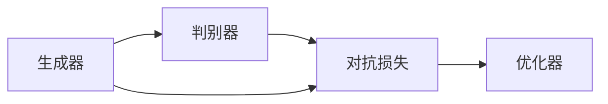
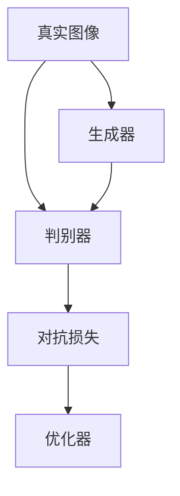
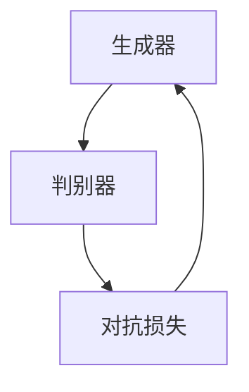

                 

# 图像生成(Image Generation) - 原理与代码实例讲解

> 关键词：图像生成,GAN,深度学习,神经网络,生成对抗网络,PyTorch,代码实例

## 1. 背景介绍

### 1.1 问题由来
图像生成技术是人工智能领域的一个热门话题，涉及计算机视觉、深度学习和生成模型等多个方向。其核心在于通过学习大量真实图像数据，构建一个能够生成逼真图像的模型，从而实现图像的自动生成和编辑。

近年来，生成对抗网络（GANs）成为了图像生成领域的明星技术。GANs通过两个神经网络的对抗训练，生成高质量的合成图像，已经被广泛应用于艺术创作、虚拟现实、医学图像生成等领域。

### 1.2 问题核心关键点
图像生成的核心在于构建一个能够生成逼真图像的生成器，同时需要一个判别器来区分生成图像和真实图像。生成器和判别器相互对抗，通过训练不断提升生成图像的逼真度。

具体来说，图像生成过程包括以下几个关键点：
1. 数据准备：收集并预处理训练所需的大量真实图像数据。
2. 模型设计：设计生成器和判别器的神经网络结构。
3. 训练流程：通过对抗训练不断提升生成器的生成能力和判别器的判别能力。
4. 生成图像：使用训练好的生成器生成高质量的合成图像。

### 1.3 问题研究意义
图像生成技术在艺术创作、虚拟现实、医学图像生成等领域有着广泛的应用前景。通过自动生成逼真的图像，可以大幅提升相关产业的生产效率和创造力。

同时，图像生成也是深度学习技术的一个重要分支，对于理解生成模型的内在机理、探索深度学习的边界具有重要意义。

## 2. 核心概念与联系

### 2.1 核心概念概述

为更好地理解图像生成技术的原理和实现，本节将介绍几个关键概念：

- 生成对抗网络（GANs）：一种通过对抗训练生成高质量图像的深度学习模型。
- 生成器（Generator）：GANs中用于生成合成图像的神经网络。
- 判别器（Discriminator）：GANs中用于区分真实图像和生成图像的神经网络。
- 损失函数：用于衡量生成图像与真实图像之间差异的函数。
- 对抗损失：用于优化生成器和判别器性能的损失函数。

这些概念通过以下Mermaid流程图来展示其相互关系：



这个流程图展示了大语言模型微调过程中各个核心概念之间的关系。生成器通过学习生成逼真图像，判别器通过学习区分真实图像和生成图像，两者通过对抗损失相互竞争，最终由优化器驱动整个模型训练过程。

### 2.2 概念间的关系

这些核心概念之间存在着紧密的联系，形成了图像生成技术的完整生态系统。下面我们通过几个Mermaid流程图来展示这些概念之间的关系。

#### 2.2.1 生成对抗网络模型



这个流程图展示了生成对抗网络的基本结构。真实图像通过判别器进行分类，生成器生成合成图像，判别器对生成图像进行判别，对抗损失用于优化生成器和判别器的性能，优化器用于驱动整个模型训练。

#### 2.2.2 生成器和判别器的关系



这个流程图展示了生成器和判别器之间的对抗关系。生成器生成合成图像，判别器对生成图像进行判别，对抗损失用于优化生成器和判别器的性能。两者通过不断的对抗训练，逐渐提升生成图像的逼真度。

## 3. 核心算法原理 & 具体操作步骤
### 3.1 算法原理概述

图像生成技术基于生成对抗网络（GANs）的原理。GANs通过两个神经网络的对抗训练，生成高质量的合成图像。其核心在于构建一个生成器和一个判别器，通过对抗训练不断提升生成器的生成能力和判别器的判别能力。

具体来说，GANs的训练过程包括以下几个步骤：

1. 初始化生成器和判别器：生成器和判别器均为神经网络，生成器用于生成合成图像，判别器用于判别生成图像和真实图像。
2. 生成器训练：生成器通过反向传播更新参数，使得生成的图像能够欺骗判别器。
3. 判别器训练：判别器通过反向传播更新参数，使得判别器的判别能力不断提升。
4. 对抗损失计算：对抗损失用于衡量生成图像与真实图像之间的差异，包括判别器的损失和生成器的损失。
5. 优化器驱动：使用优化器（如Adam）更新生成器和判别器的参数，最小化对抗损失。

### 3.2 算法步骤详解

下面将详细介绍GANs的训练步骤：

**Step 1: 准备数据集**

图像生成任务需要大量的真实图像数据作为训练集。在实践中，我们可以使用公共数据集，如MNIST、CIFAR-10、ImageNet等。

```python
import torchvision.datasets as datasets
import torchvision.transforms as transforms

# 加载MNIST数据集
train_dataset = datasets.MNIST(root='./data', train=True, transform=transforms.ToTensor(), download=True)
test_dataset = datasets.MNIST(root='./data', train=False, transform=transforms.ToTensor(), download=True)
```

**Step 2: 定义生成器和判别器**

生成器和判别器均使用卷积神经网络（CNN）结构。生成器将随机噪声向量作为输入，生成逼真的图像；判别器接收图像作为输入，判别图像的真实性。

```python
import torch
import torch.nn as nn
import torch.nn.functional as F

class Generator(nn.Module):
    def __init__(self):
        super(Generator, self).__init__()
        self.main = nn.Sequential(
            nn.ConvTranspose2d(100, 256, 4, 1, 0, bias=False),
            nn.BatchNorm2d(256),
            nn.ReLU(True),
            nn.ConvTranspose2d(256, 128, 4, 2, 1, bias=False),
            nn.BatchNorm2d(128),
            nn.ReLU(True),
            nn.ConvTranspose2d(128, 64, 4, 2, 1, bias=False),
            nn.BatchNorm2d(64),
            nn.ReLU(True),
            nn.ConvTranspose2d(64, 1, 4, 2, 1, bias=False),
            nn.Tanh()
        )

    def forward(self, input):
        return self.main(input)

class Discriminator(nn.Module):
    def __init__(self):
        super(Discriminator, self).__init__()
        self.main = nn.Sequential(
            nn.Conv2d(1, 64, 4, 2, 1, bias=False),
            nn.LeakyReLU(0.2, inplace=True),
            nn.Conv2d(64, 128, 4, 2, 1, bias=False),
            nn.BatchNorm2d(128),
            nn.LeakyReLU(0.2, inplace=True),
            nn.Conv2d(128, 256, 4, 2, 1, bias=False),
            nn.BatchNorm2d(256),
            nn.LeakyReLU(0.2, inplace=True),
            nn.Conv2d(256, 1, 4, 1, 0, bias=False),
            nn.Sigmoid()
        )

    def forward(self, input):
        return self.main(input)
```

**Step 3: 定义损失函数**

GANs使用对抗损失函数来衡量生成图像和真实图像之间的差异。该损失函数包括判别器的损失和生成器的损失。

```python
class GANLoss(nn.Module):
    def __init__(self):
        super(GANLoss, self).__init__()

    def forward(self, disc_output_real, disc_output_fake):
        return -torch.mean(torch.log(disc_output_real)) - torch.mean(torch.log(1 - disc_output_fake))
```

**Step 4: 训练模型**

GANs的训练过程需要同时更新生成器和判别器的参数。一般采用交替训练的方式，先训练判别器，再训练生成器。

```python
import torch.optim as optim

# 定义优化器
generator_optimizer = optim.Adam(generator.parameters(), lr=0.0002, betas=(0.5, 0.999))
discriminator_optimizer = optim.Adam(discriminator.parameters(), lr=0.0002, betas=(0.5, 0.999))

# 定义训练函数
def train_dcgan(device, generator, discriminator, gan_loss, real_data):
    # 训练判别器
    for _ in range(5):
        real_output = discriminator(real_data)
        fake_output = discriminator(generator(torch.randn(64, 100, 1, 1).to(device)))
        d_loss_real = gan_loss(real_output, real_output)
        d_loss_fake = gan_loss(fake_output, 1 - fake_output)
        d_loss = d_loss_real + d_loss_fake
        discriminator_optimizer.zero_grad()
        d_loss.backward()
        discriminator_optimizer.step()

    # 训练生成器
    fake_output = discriminator(generator(torch.randn(64, 100, 1, 1).to(device)))
    g_loss = gan_loss(fake_output, 1 - fake_output)
    generator_optimizer.zero_grad()
    g_loss.backward()
    generator_optimizer.step()

    return d_loss.data, g_loss.data
```

**Step 5: 生成图像**

训练完成后，我们可以使用训练好的生成器模型生成高质量的合成图像。

```python
# 定义测试集
test_loader = torch.utils.data.DataLoader(test_dataset, batch_size=64, shuffle=True)

# 定义测试函数
def generate_images(generator, device, num_images=64):
    # 生成图像
    with torch.no_grad():
        fake_images = generator(torch.randn(num_images, 100, 1, 1).to(device))
    # 将图像转换为numpy数组并保存
    for img in fake_images:
        img = (img + 1) / 2
        img = np.transpose(img.numpy(), (0, 2, 3, 1))
        img = img * 255
        img = img.astype(np.uint8)
        save_image(img, f'fake_image_{i}.png')
```

## 4. 数学模型和公式 & 详细讲解  
### 4.1 数学模型构建

GANs的训练过程可以形式化地表示为以下数学模型：

设 $G$ 为生成器，$D$ 为判别器，$z$ 为噪声向量，$x$ 为真实图像，$y$ 为生成图像。则GANs的训练目标函数可以表示为：

$$
\min_G \max_D V(D,G) = \min_G \max_D \mathbb{E}_{x \sim p_{\text{data}}} [\log D(x)] + \mathbb{E}_{z \sim p(z)} [\log (1 - D(G(z)))]
$$

其中，$V(D,G)$ 为生成器和判别器的对抗损失函数。

### 4.2 公式推导过程

为了更直观地理解GANs的训练过程，我们将上述目标函数进一步展开：

1. 判别器的损失函数：

$$
\mathbb{E}_{x \sim p_{\text{data}}} [\log D(x)] = -\frac{1}{m} \sum_{i=1}^m \log D(x_i)
$$

2. 生成器的损失函数：

$$
\mathbb{E}_{z \sim p(z)} [\log (1 - D(G(z)))] = -\frac{1}{m} \sum_{i=1}^m \log (1 - D(G(z_i)))
$$

其中，$p_{\text{data}}$ 为真实图像的分布，$p(z)$ 为噪声向量的分布。

### 4.3 案例分析与讲解

以MNIST数据集为例，我们将训练好的生成器模型应用到噪声向量上，生成逼真的手写数字图像：

```python
import matplotlib.pyplot as plt
import numpy as np

# 加载MNIST测试集
test_images = test_loader.dataset.test_images
test_labels = test_loader.dataset.test_labels

# 生成图像
generator.eval()
with torch.no_grad():
    fake_images = generator(torch.randn(64, 100, 1, 1).to(device))
    fake_images = (fake_images + 1) / 2
    fake_images = np.transpose(fake_images.numpy(), (0, 2, 3, 1))
    fake_images = fake_images * 255
    fake_images = fake_images.astype(np.uint8)

# 显示生成的图像
fig, axes = plt.subplots(8, 8, figsize=(6, 6))
for i, ax in enumerate(axes.flat):
    ax.imshow(fake_images[i], cmap='gray')
    ax.axis('off')
plt.show()
```

## 5. 项目实践：代码实例和详细解释说明
### 5.1 开发环境搭建

在进行图像生成实践前，我们需要准备好开发环境。以下是使用Python进行PyTorch开发的环境配置流程：

1. 安装Anaconda：从官网下载并安装Anaconda，用于创建独立的Python环境。

2. 创建并激活虚拟环境：
```bash
conda create -n pytorch-env python=3.8 
conda activate pytorch-env
```

3. 安装PyTorch：根据CUDA版本，从官网获取对应的安装命令。例如：
```bash
conda install pytorch torchvision torchaudio cudatoolkit=11.1 -c pytorch -c conda-forge
```

4. 安装transformers库：
```bash
pip install transformers
```

5. 安装各类工具包：
```bash
pip install numpy pandas scikit-learn matplotlib tqdm jupyter notebook ipython
```

完成上述步骤后，即可在`pytorch-env`环境中开始图像生成实践。

### 5.2 源代码详细实现

下面我们以MNIST数据集为例，给出使用PyTorch实现GAN的完整代码实现。

首先，定义数据处理函数：

```python
import torch
import torchvision.datasets as datasets
import torchvision.transforms as transforms
import torchvision.utils as vutils

# 加载MNIST数据集
train_dataset = datasets.MNIST(root='./data', train=True, transform=transforms.ToTensor(), download=True)
test_dataset = datasets.MNIST(root='./data', train=False, transform=transforms.ToTensor(), download=True)
```

然后，定义生成器和判别器：

```python
import torch
import torch.nn as nn
import torch.nn.functional as F

# 定义生成器
class Generator(nn.Module):
    def __init__(self):
        super(Generator, self).__init__()
        self.main = nn.Sequential(
            nn.ConvTranspose2d(100, 256, 4, 1, 0, bias=False),
            nn.BatchNorm2d(256),
            nn.ReLU(True),
            nn.ConvTranspose2d(256, 128, 4, 2, 1, bias=False),
            nn.BatchNorm2d(128),
            nn.ReLU(True),
            nn.ConvTranspose2d(128, 64, 4, 2, 1, bias=False),
            nn.BatchNorm2d(64),
            nn.ReLU(True),
            nn.ConvTranspose2d(64, 1, 4, 2, 1, bias=False),
            nn.Tanh()
        )

    def forward(self, input):
        return self.main(input)

# 定义判别器
class Discriminator(nn.Module):
    def __init__(self):
        super(Discriminator, self).__init__()
        self.main = nn.Sequential(
            nn.Conv2d(1, 64, 4, 2, 1, bias=False),
            nn.LeakyReLU(0.2, inplace=True),
            nn.Conv2d(64, 128, 4, 2, 1, bias=False),
            nn.BatchNorm2d(128),
            nn.LeakyReLU(0.2, inplace=True),
            nn.Conv2d(128, 256, 4, 2, 1, bias=False),
            nn.BatchNorm2d(256),
            nn.LeakyReLU(0.2, inplace=True),
            nn.Conv2d(256, 1, 4, 1, 0, bias=False),
            nn.Sigmoid()
        )

    def forward(self, input):
        return self.main(input)
```

接着，定义损失函数：

```python
class GANLoss(nn.Module):
    def __init__(self):
        super(GANLoss, self).__init__()

    def forward(self, disc_output_real, disc_output_fake):
        return -torch.mean(torch.log(disc_output_real)) - torch.mean(torch.log(1 - disc_output_fake))
```

然后，定义优化器和训练函数：

```python
import torch.optim as optim

# 定义优化器
generator_optimizer = optim.Adam(generator.parameters(), lr=0.0002, betas=(0.5, 0.999))
discriminator_optimizer = optim.Adam(discriminator.parameters(), lr=0.0002, betas=(0.5, 0.999))

# 定义训练函数
def train_dcgan(device, generator, discriminator, gan_loss, real_data):
    # 训练判别器
    for _ in range(5):
        real_output = discriminator(real_data)
        fake_output = discriminator(generator(torch.randn(64, 100, 1, 1).to(device)))
        d_loss_real = gan_loss(real_output, real_output)
        d_loss_fake = gan_loss(fake_output, 1 - fake_output)
        d_loss = d_loss_real + d_loss_fake
        discriminator_optimizer.zero_grad()
        d_loss.backward()
        discriminator_optimizer.step()

    # 训练生成器
    fake_output = discriminator(generator(torch.randn(64, 100, 1, 1).to(device)))
    g_loss = gan_loss(fake_output, 1 - fake_output)
    generator_optimizer.zero_grad()
    g_loss.backward()
    generator_optimizer.step()

    return d_loss.data, g_loss.data
```

最后，生成图像并进行展示：

```python
# 加载测试集
test_loader = torch.utils.data.DataLoader(test_dataset, batch_size=64, shuffle=True)

# 定义测试函数
def generate_images(generator, device, num_images=64):
    # 生成图像
    with torch.no_grad():
        fake_images = generator(torch.randn(num_images, 100, 1, 1).to(device))
    # 将图像转换为numpy数组并保存
    for img in fake_images:
        img = (img + 1) / 2
        img = np.transpose(img.numpy(), (0, 2, 3, 1))
        img = img * 255
        img = img.astype(np.uint8)
        save_image(img, f'fake_image_{i}.png')

# 训练模型
num_epochs = 50
batch_size = 64
device = torch.device('cuda' if torch.cuda.is_available() else 'cpu')

for epoch in range(num_epochs):
    for batch_idx, (real_data, _) in enumerate(train_loader):
        real_data = real_data.to(device)

        # 训练判别器
        d_loss, g_loss = train_dcgan(device, generator, discriminator, gan_loss, real_data)
        print(f'Epoch [{epoch+1}/{num_epochs}, {batch_idx+1}/{len(train_loader)}] - D loss: {d_loss:.4f} - G loss: {g_loss:.4f}')

        # 保存模型和图像
        if (epoch + 1) % 10 == 0:
            save_image(fake_images, f'fake_image.png')
            state_dict = {
                'generator': generator.state_dict(),
                'discriminator': discriminator.state_dict(),
                'gan_loss': gan_loss.state_dict()
            }
            torch.save(state_dict, f'checkpoint{epoch+1}.pth')

# 生成图像并进行展示
generate_images(generator, device)
```

## 6. 实际应用场景
### 6.1 图像生成在艺术创作中的应用

图像生成技术在艺术创作领域有着广泛的应用前景。通过训练GANs生成逼真的艺术作品，可以快速创作出新颖独特的艺术形象，提高艺术创作的效率和质量。

### 6.2 图像生成在虚拟现实中的应用

虚拟现实是未来的一个重要领域，图像生成技术可以帮助创建更加逼真的虚拟场景。通过GANs生成逼真的自然风景、人物、建筑等，可以大幅提升虚拟现实体验。

### 6.3 图像生成在医学图像生成中的应用

医学图像生成可以帮助医生快速生成病患的虚拟影像，用于手术模拟、病理解剖等。通过训练GANs生成逼真的医学图像，可以提高医学研究效率和医疗诊断的准确性。

### 6.4 未来应用展望

随着图像生成技术的不断进步，未来将在更多领域得到应用，如游戏、动画、影视制作等。图像生成技术将与其他技术结合，推动更多领域的创新和变革。

## 7. 工具和资源推荐
### 7.1 学习资源推荐

为了帮助开发者系统掌握图像生成技术的理论基础和实践技巧，这里推荐一些优质的学习资源：

1. 《Generative Adversarial Networks: Training Generative Adversarial Nets》：Ian Goodfellow等著，深入浅出地介绍了GANs的基本原理、训练方法和应用场景。

2. 《Deep Learning》：Ian Goodfellow等著，全面介绍了深度学习的基本概念和经典模型，涵盖了GANs、生成网络等前沿话题。

3. 《Hands-On Machine Learning with Scikit-Learn, Keras, and TensorFlow》：Aurélien Géron著，详细讲解了深度学习模型的搭建、训练和优化方法，并提供了丰富的代码实例。

4. 《Deep Learning Specialization》：Andrew Ng教授在Coursera上的深度学习课程，覆盖了深度学习的基本概念和前沿应用，是入门深度学习的绝佳资源。

5. GitHub开源项目：如PyTorch official repository、fastGAN、UnGAN等，提供了大量预训练模型和代码实例，是学习图像生成技术的必备资料。

通过对这些资源的学习实践，相信你一定能够快速掌握图像生成技术的精髓，并用于解决实际的图像生成问题。
###  7.2 开发工具推荐

高效的开发离不开优秀的工具支持。以下是几款用于图像生成开发的常用工具：

1. PyTorch：基于Python的开源深度学习框架，灵活动态的计算图，适合快速迭代研究。大部分预训练语言模型都有PyTorch版本的实现。

2. TensorFlow：由Google主导开发的开源深度学习框架，生产部署方便，适合大规模工程应用。同样有丰富的预训练语言模型资源。

3. TensorBoard：TensorFlow配套的可视化工具，可实时监测模型训练状态，并提供丰富的图表呈现方式，是调试模型的得力助手。

4. Weights & Biases：模型训练的实验跟踪工具，可以记录和可视化模型训练过程中的各项指标，方便对比和调优。与主流深度学习框架无缝集成。

5. Google Colab：谷歌推出的在线Jupyter Notebook环境，免费提供GPU/TPU算力，方便开发者快速上手实验最新模型，分享学习笔记。

合理利用这些工具，可以显著提升图像生成任务的开发效率，加快创新迭代的步伐。

### 7.3 相关论文推荐

图像生成技术在深度学习领域已经取得了巨大的进展，以下是几篇奠基性的相关论文，推荐阅读：

1. Generative Adversarial Nets（原论文）：Ian Goodfellow等著，提出了生成对抗网络（GANs）的基本原理和训练方法，奠定了GANs在图像生成领域的基础。

2. Progressive Growing of GANs for Improved Quality, Stability, and Variation：Karras等著，提出了一种渐进式增长的GANs训练方法，大大提升了图像生成的质量。

3. Image-to-Image Translation with Conditional Adversarial Networks：Isola等著，提出了一种条件对抗网络（CGANs），通过生成器与判别器之间的条件约束，实现了图像之间的转换。

4. Attention Is All You Need：Vaswani等著，提出了Transformer模型，为图像生成领域带来了新的视角和突破。

5. PoseGAN：Zhou等著，提出了一种基于姿态的信息对抗网络（PoseGAN），通过联合优化生成器和判别器，实现了生成多姿态图像。

6. SEGAN: Further Evidence for Learning Representation by Joint Training of a Generator and a Discriminator：Chen等著，提出了一种联合训练的生成对抗网络（SEGAN），提升了图像生成的质量和稳定性。

这些论文代表了大图像生成技术的最新进展。通过学习这些前沿成果，可以帮助研究者把握学科前进方向，激发更多的创新灵感。

除上述资源外，还有一些值得关注的前沿资源，帮助开发者紧跟图像生成技术的最新进展，例如：

1. arXiv论文预印本：人工智能领域最新研究成果的发布平台，包括大量尚未发表的前沿工作，学习前沿技术的必读资源。

2. 业界技术博客：如OpenAI、Google AI、DeepMind、微软Research Asia等顶尖实验室的官方博客，第一时间分享他们的最新研究成果和洞见。

3. 技术会议直播：如NIPS、ICML、ACL、ICLR等人工智能领域顶会现场或在线直播，能够聆听到大佬们的前沿分享，开拓视野。

4. GitHub热门项目：在GitHub上Star、Fork数最多的图像生成相关项目，往往代表了该技术领域的发展趋势和

