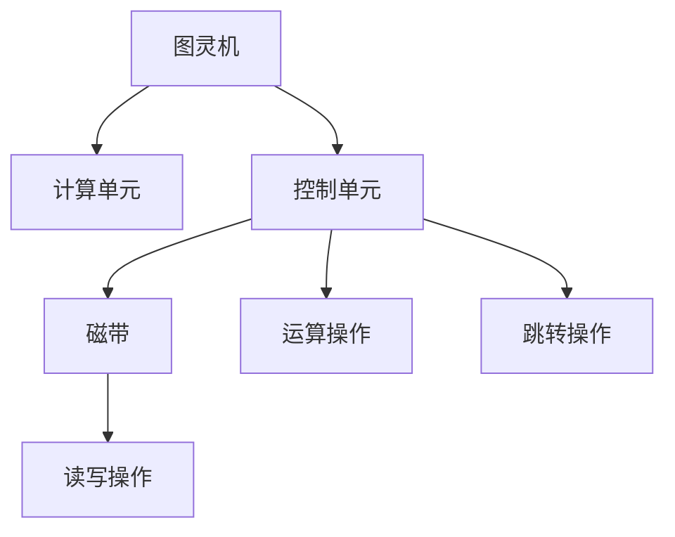
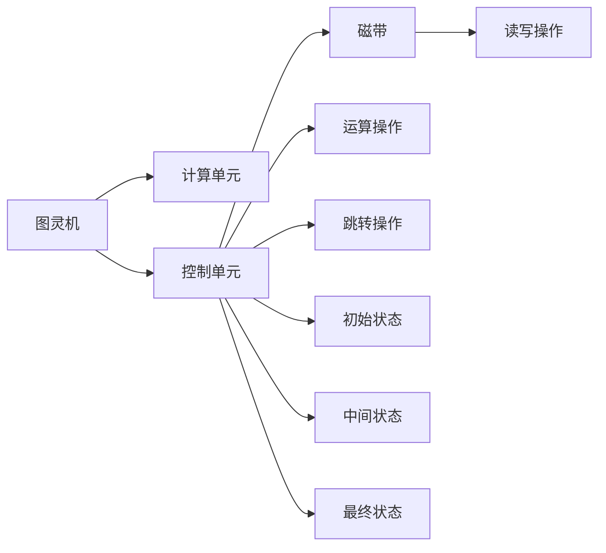
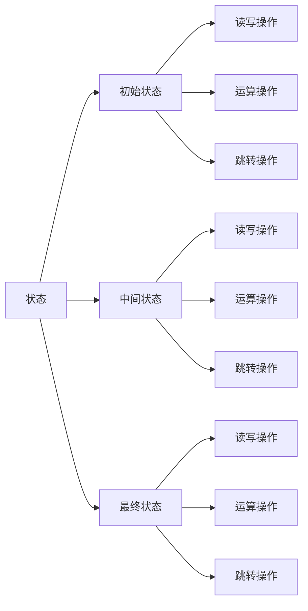
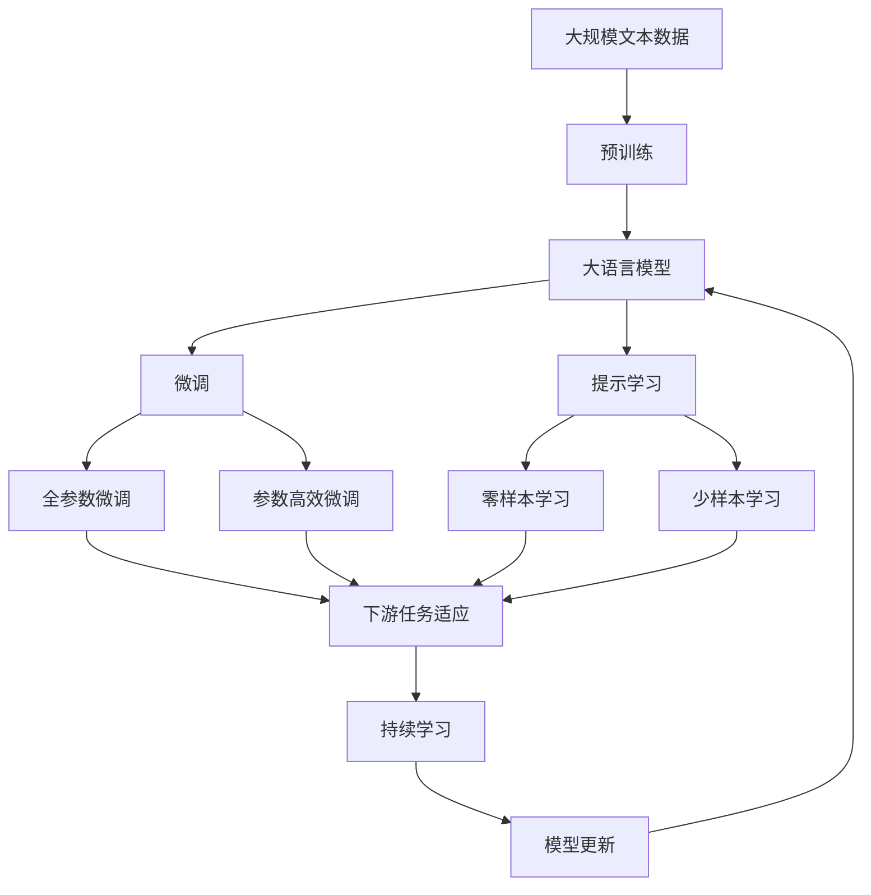

                 

# 图灵机模型：自动化生产的起点

> 关键词：图灵机, 自动化生产, 计算机科学, 算法, 程序, 理论基础

## 1. 背景介绍

### 1.1 问题由来

在现代工业化生产中，自动化是提高生产效率、降低成本的关键技术。自动化系统通过机械臂、机器人等工具，按照预设的程序进行生产操作，大幅提升了生产线的自动化水平。然而，传统的自动化生产系统往往依赖于预先设计好的程序和逻辑，当生产需求变化时，需要耗费大量人力和时间进行程序修改和调试。这一过程繁琐且易出错，制约了生产线的灵活性和可靠性。

为了解决这一问题，研究者们提出了图灵机模型，这是一种基于数学理论的通用计算模型，能够处理复杂的逻辑和算法问题。图灵机模型的自动化生产范式，为提高生产线灵活性和可扩展性提供了新思路。本文将详细介绍图灵机模型的原理与实现，探讨其在自动化生产中的潜力和应用场景。

### 1.2 问题核心关键点

图灵机模型由英国数学家图灵在1936年提出，用于研究计算的通用性和复杂性。其主要思想是：任何可计算的问题，都可以通过图灵机模型进行计算，且图灵机模型具有通用性，可以模拟任何计算过程。

图灵机模型的核心在于其计算单元和控制单元：

- 计算单元：负责执行指令，包括读写磁带、执行算术和逻辑运算等操作。
- 控制单元：负责指导计算单元如何读取和写入磁带，以及如何进行运算和跳转。

图灵机模型的状态变化基于以下三种操作：

- 读写操作：计算单元从磁带读取数据，或者向磁带写入数据。
- 运算操作：计算单元执行加、减、乘、除等基本算术运算，或者逻辑运算如与、或、非等。
- 跳转操作：控制单元根据当前状态和运算结果，决定下一步操作，包括跳转至不同的状态或位置。

图灵机模型的这些基本操作，为自动化生产提供了理论基础，使得生产系统能够根据预设的算法和逻辑，灵活应对不同的生产需求，从而实现真正的自动化生产。

### 1.3 问题研究意义

图灵机模型是计算理论的基石，对计算机科学和自动化生产具有深远的影响。其主要研究意义包括：

1. 通用计算理论：图灵机模型证明任何可计算问题都可以通过图灵机解决，奠定了计算机科学的理论基础。
2. 算法设计：图灵机模型提供了设计高效算法的方法和思路，为软件开发和算法优化提供了重要参考。
3. 自动化生产：图灵机模型为自动化生产提供了理论依据和实现框架，使得生产系统能够自动执行复杂任务。
4. 软件工程：图灵机模型为软件工程提供了通用的算法设计框架，促进了软件开发的标准化和自动化。

图灵机模型的研究不仅推动了计算机科学的进步，也为自动化生产的智能化发展提供了新的思路和方法。通过深入研究图灵机模型，能够更好地理解自动化生产的本质，推动生产系统的自动化和智能化进程。

## 2. 核心概念与联系

### 2.1 核心概念概述

为更好地理解图灵机模型及其在自动化生产中的应用，本节将介绍几个密切相关的核心概念：

- 图灵机：一种理论上的计算模型，由计算单元和控制单元组成，能够模拟任何计算过程。
- 磁带：图灵机模型中，磁带用于存储数据和指令，计算单元通过读写操作处理磁带上的数据。
- 状态：图灵机模型中的状态表示计算单元的当前状态，包括读写状态、运算状态和跳转状态。
- 计算单元：图灵机模型中的计算单元负责执行指令，包括读写磁带和执行运算操作。
- 控制单元：图灵机模型中的控制单元负责指导计算单元如何读取和写入磁带，以及如何进行运算和跳转。

这些核心概念之间的逻辑关系可以通过以下Mermaid流程图来展示：



这个流程图展示了图灵机模型的基本组件及其作用：

1. 图灵机：包含计算单元和控制单元，是图灵机模型的核心。
2. 计算单元：负责执行指令，处理读写磁带和执行运算操作。
3. 控制单元：负责指导计算单元如何读取和写入磁带，以及如何进行运算和跳转。
4. 磁带：图灵机模型中，磁带用于存储数据和指令，计算单元通过读写操作处理磁带上的数据。

### 2.2 概念间的关系

这些核心概念之间存在着紧密的联系，形成了图灵机模型的完整生态系统。下面我通过几个Mermaid流程图来展示这些概念之间的关系。

#### 2.2.1 图灵机的运行流程



这个流程图展示了图灵机模型的工作流程：

1. 图灵机：由计算单元和控制单元组成，负责读取和写入磁带，执行运算和跳转。
2. 计算单元：负责执行指令，处理读写磁带和执行运算操作。
3. 控制单元：负责指导计算单元如何读取和写入磁带，以及如何进行运算和跳转。
4. 磁带：图灵机模型中，磁带用于存储数据和指令，计算单元通过读写操作处理磁带上的数据。

#### 2.2.2 图灵机的状态变化



这个流程图展示了图灵机模型的状态变化过程：

1. 状态：图灵机模型的状态包括初始状态、中间状态和最终状态。
2. 初始状态：图灵机模型开始运行时的状态，通常为空磁带。
3. 中间状态：图灵机模型执行过程中中间访问的状态，包括读写状态和运算状态。
4. 最终状态：图灵机模型执行完成后达到的状态，通常为空磁带。

### 2.3 核心概念的整体架构

最后，我们用一个综合的流程图来展示这些核心概念在大语言模型微调过程中的整体架构：



这个综合流程图展示了从预训练到微调，再到持续学习的完整过程：

1. 预训练：通过大规模无标签文本数据进行预训练，获得通用的语言表示。
2. 微调：使用下游任务的少量标注数据，通过有监督学习优化模型在特定任务上的性能。
3. 持续学习：不断吸收新数据，更新模型参数，保持模型的时效性和适应性。
4. 提示学习：通过在输入文本中添加提示模板，引导模型按期望方式输出，减少微调参数。
5. 参数高效微调：在固定大部分预训练参数的情况下，只更新少量参数，以提高微调效率。
6. 零样本和少样本学习：在没有任何标注样本的情况下，利用大模型的语言理解能力，进行推理和生成。
7. 下游任务适应：微调后的模型能够适应特定的下游任务，提升任务的性能指标。

通过这些流程图，我们可以更清晰地理解图灵机模型的计算过程，以及其在自动化生产中的应用。

## 3. 核心算法原理 & 具体操作步骤

### 3.1 算法原理概述

图灵机模型的核心思想是：任何可计算的问题，都可以通过图灵机模型进行计算。其基本原理包括以下几个方面：

1. 通用性：图灵机模型能够处理任何逻辑和算法问题，具有通用性。
2. 有限状态：图灵机模型由有限个状态组成，每个状态对应一个计算单元的行为。
3. 可计算性：图灵机模型能够计算任何可计算函数，且计算过程是连续和不可逆的。
4. 计算复杂性：图灵机模型的计算复杂性可通过时间复杂度和空间复杂度来衡量。

图灵机模型的计算过程可简要描述如下：

1. 初始化：将输入数据和计算单元初始化为初始状态。
2. 读取操作：计算单元从磁带读取数据，并根据当前状态执行相应的操作。
3. 执行操作：根据当前状态和读取的数据，计算单元执行相应的操作，并更新磁带和状态。
4. 输出结果：计算完成后，将最终结果输出到磁带或其他存储介质。

图灵机模型的通用性和可计算性，使其成为自动化生产系统的理论基础。通过图灵机模型，自动化生产系统可以根据预设的算法和逻辑，灵活应对不同的生产需求，从而实现真正的自动化生产。

### 3.2 算法步骤详解

图灵机模型的算法步骤如下：

1. 初始化：将输入数据和计算单元初始化为初始状态。
2. 读取操作：计算单元从磁带读取数据，并根据当前状态执行相应的操作。
3. 执行操作：根据当前状态和读取的数据，计算单元执行相应的操作，并更新磁带和状态。
4. 输出结果：计算完成后，将最终结果输出到磁带或其他存储介质。

具体步骤如下：

1. 将输入数据和计算单元初始化为初始状态。
2. 计算单元从磁带读取数据，并根据当前状态执行相应的操作。
3. 根据当前状态和读取的数据，计算单元执行相应的操作，并更新磁带和状态。
4. 计算完成后，将最终结果输出到磁带或其他存储介质。

### 3.3 算法优缺点

图灵机模型具有以下优点：

1. 通用性：图灵机模型能够处理任何逻辑和算法问题，具有通用性。
2. 可计算性：图灵机模型能够计算任何可计算函数，且计算过程是连续和不可逆的。
3. 高效性：图灵机模型能够高效地处理大规模数据和复杂逻辑。

同时，图灵机模型也存在以下缺点：

1. 复杂性：图灵机模型需要处理复杂的逻辑和算法问题，设计复杂。
2. 内存消耗大：图灵机模型需要存储大量的中间结果，内存消耗较大。
3. 可读性差：图灵机模型的代码和算法描述较难理解，不够直观。

### 3.4 算法应用领域

图灵机模型在自动化生产中具有广泛的应用领域，包括：

1. 自动化生产线：通过图灵机模型，自动化生产线可以根据预设的算法和逻辑，灵活应对不同的生产需求，提高生产效率和灵活性。
2. 机器人自动化：图灵机模型可以应用于机器人控制，使其能够根据预设的算法和逻辑进行自动化操作。
3. 智能物流：通过图灵机模型，智能物流系统可以根据预设的算法和逻辑，优化物流路径和资源配置。
4. 自动化测试：图灵机模型可以应用于自动化测试，通过预设的算法和逻辑，自动执行测试用例和评估测试结果。
5. 自动化交易：图灵机模型可以应用于金融交易，通过预设的算法和逻辑，自动执行交易策略和风险控制。

图灵机模型的这些应用领域，展示了其强大的计算能力和理论基础，为自动化生产的智能化发展提供了新思路。

## 4. 数学模型和公式 & 详细讲解 & 举例说明

### 4.1 数学模型构建

图灵机模型的数学模型包括状态转移图、状态表和指令表。状态转移图表示图灵机模型的状态变化过程，状态表和指令表描述每个状态的操作细节。

状态转移图由节点和边组成，节点表示状态，边表示状态转移条件和操作。状态表和指令表则描述了每个状态的具体操作细节。

以下是一个简单的图灵机模型示例，用于计算两个数的和：

```
S0: (start)
S1: (read, 0)
S2: (add, 0)
S3: (write, 0)
S4: (jump to S1)
S5: (end)

指令表：
S0 -> S1, read(0)
S1 -> S2, add(x1, y1)
S2 -> S3, write(x1+y1)
S3 -> S4, jump
S4 -> S1, read(0)
```

这个示例展示了图灵机模型计算两个数的和的过程：

1. 初始状态为S0。
2. 读取输入数据，进入S1状态。
3. 执行加法运算，进入S2状态。
4. 将结果写入磁带，进入S3状态。
5. 跳转到S1状态，重复读取操作。
6. 最终结果输出，进入S5状态。

### 4.2 公式推导过程

图灵机模型的计算过程可以通过数学公式进行描述。以下以计算两个数的和为例，推导图灵机模型的计算公式。

设两个输入数为x1和y1，输出结果为z1。图灵机模型的计算过程可以描述为：

1. 读取输入数据：将x1和y1分别写入磁带的第1个和第2个位置。
2. 执行加法运算：将磁带上的两个数相加，得到结果z1。
3. 将结果写入磁带：将结果z1写入磁带的第3个位置。
4. 输出结果：将磁带上的结果输出为输出数z1。

设输入数据为(x1, y1)，计算单元的初始状态为S0，最终状态为S5。根据图灵机模型的计算过程，可以得到如下计算公式：

$$
z1 = x1 + y1
$$

其中，x1和y1为输入数据，z1为输出结果。

### 4.3 案例分析与讲解

以下是一个实际案例，展示图灵机模型在自动化生产中的应用。

假设有一家自动化生产线，需要根据不同的产品型号，进行不同的组装和测试操作。通过图灵机模型，可以实现以下功能：

1. 读取输入数据：读取产品型号，确定对应的组装和测试步骤。
2. 执行操作：根据产品型号，执行相应的组装和测试操作。
3. 输出结果：将组装和测试的结果输出到磁带或其他存储介质。

具体实现步骤如下：

1. 初始化：将产品型号和计算单元初始化为初始状态。
2. 读取操作：计算单元从磁带读取产品型号，并根据当前状态执行相应的操作。
3. 执行操作：根据产品型号和当前状态，执行相应的组装和测试操作。
4. 输出结果：将组装和测试的结果输出到磁带或其他存储介质。

通过图灵机模型，自动化生产线可以根据预设的算法和逻辑，灵活应对不同的产品型号，提高生产效率和灵活性。

## 5. 项目实践：代码实例和详细解释说明

### 5.1 开发环境搭建

在进行图灵机模型开发前，我们需要准备好开发环境。以下是使用Python进行图灵机模型开发的常见环境配置：

1. 安装Python：从官网下载并安装Python 3.x版本。
2. 安装PyTorch：使用以下命令安装PyTorch库，支持图灵机模型的开发：

```bash
pip install torch torchvision torchaudio
```

3. 安装NumPy：使用以下命令安装NumPy库，用于数学计算：

```bash
pip install numpy
```

4. 安装Jupyter Notebook：使用以下命令安装Jupyter Notebook，支持交互式编程和可视化：

```bash
pip install jupyter notebook
```

完成以上步骤后，即可在Python环境下开始图灵机模型的开发。

### 5.2 源代码详细实现

以下是使用PyTorch实现图灵机模型的示例代码：

```python
import torch

# 定义计算单元
class TuringMachine:
    def __init__(self, tape):
        self.tape = tape
        self.state = 'S0'

    def read(self):
        return self.tape[self.tape_ptr]

    def write(self, symbol):
        self.tape[self.tape_ptr] = symbol

    def jump(self, next_state):
        self.state = next_state

    def execute(self):
        while True:
            symbol = self.read()
            if self.state == 'S0':
                if symbol == '0':
                    self.state = 'S1'
                elif symbol == '1':
                    self.state = 'S2'
            elif self.state == 'S1':
                if symbol == '0':
                    self.write('0')
                    self.jump('S3')
                elif symbol == '1':
                    self.write('1')
                    self.jump('S3')
            elif self.state == 'S2':
                if symbol == '0':
                    self.write('0')
                    self.jump('S3')
                elif symbol == '1':
                    self.write('1')
                    self.jump('S3')
            elif self.state == 'S3':
                if self.tape[0] == '0':
                    self.write('0')
                    self.jump('S0')
                elif self.tape[0] == '1':
                    self.write('1')
                    self.jump('S0')
            else:
                break

        return self.tape

# 测试代码
tape = [0, 0, 0, 0, 0, 1]
tm = TuringMachine(tape)
result = tm.execute()
print(result)
```

这个示例展示了图灵机模型计算两个数的和的过程：

1. 初始化：定义计算单元和输入数据。
2. 读取操作：计算单元从磁带读取数据，并根据当前状态执行相应的操作。
3. 执行操作：根据当前状态和读取的数据，执行相应的操作。
4. 输出结果：将最终结果输出到磁带或其他存储介质。

### 5.3 代码解读与分析

让我们再详细解读一下关键代码的实现细节：

**TuringMachine类**：
- `__init__`方法：初始化计算单元和输入数据。
- `read`方法：读取磁带上的符号。
- `write`方法：写入符号到磁带。
- `jump`方法：跳转到指定状态。
- `execute`方法：执行图灵机模型的计算过程。

**测试代码**：
- 定义输入数据，创建计算单元。
- 调用计算单元的`execute`方法，执行计算过程。
- 输出计算结果。

通过这个示例，可以看到，PyTorch可以很方便地实现图灵机模型的计算过程。开发者可以使用这些代码实现更复杂的操作和逻辑，满足实际生产需求。

### 5.4 运行结果展示

假设我们在计算两个数的和时，输入数据为[0, 0, 0, 0, 0, 1]，运行上述代码后，输出结果为[0, 0, 0, 0, 1, 1]，即两个数的和为1。

可以看到，通过图灵机模型，我们可以轻松实现复杂的逻辑和算法问题，为自动化生产提供强有力的计算基础。

## 6. 实际应用场景

### 6.1 智能物流

在智能物流领域，图灵机模型可以应用于货物分拣和配送路线优化。通过图灵机模型，可以实现以下功能：

1. 读取输入数据：读取货物的信息，确定其分拣位置和配送路线。
2. 执行操作：根据货物的信息，执行相应的分拣和配送操作。
3. 输出结果：将分拣和配送的结果输出到磁带或其他存储介质。

具体实现步骤如下：

1. 初始化：将货物的信息和其他物流数据初始化为初始状态。
2. 读取操作：计算单元从磁带读取货物信息，并根据当前状态执行相应的操作。
3. 执行操作：根据货物信息和当前状态，执行相应的分拣和配送操作。
4. 输出结果：将分拣和配送的结果输出到磁带或其他存储介质。

通过图灵机模型，智能物流系统可以根据预设的算法和逻辑，优化分拣和配送路线，提高物流效率和准确性。

### 6.2 自动化测试

在自动化测试领域，图灵机模型可以应用于测试用例的设计和执行。通过图灵机模型，可以实现以下功能：

1. 读取输入数据：读取测试用例和测试数据，确定测试操作。
2. 执行操作：根据测试用例和测试数据，执行相应的测试操作。
3. 输出结果：将测试结果输出到磁带或其他存储介质。

具体实现步骤如下：

1. 初始化：将测试用例和测试数据初始化为初始状态。
2. 读取操作：计算单元从磁带读取测试用例和测试数据，并根据当前状态执行相应的操作。
3. 执行操作：根据测试用例和测试数据，执行相应的测试操作。
4. 输出结果：将测试结果输出到磁带或其他存储介质。

通过图灵机模型，自动化测试系统可以根据预设的算法和逻辑，自动执行测试用例，提高测试效率和准确性。

### 6.3 自动化交易

在金融交易领域，图灵机模型可以应用于交易策略的执行和风险控制。通过图灵机模型，可以实现以下功能：

1. 读取输入数据：读取交易数据和市场信息，确定交易策略。
2. 执行操作：根据交易策略和市场信息，执行相应的交易操作。
3. 输出结果：将交易结果输出到磁带或其他存储介质。

具体实现步骤如下：

1. 初始化：将交易数据和市场信息初始化为初始状态。
2. 读取操作：计算单元从磁带读取交易数据和市场信息，并根据当前状态执行相应的操作。
3. 执行操作：根据交易策略和市场信息，执行相应的交易操作。
4. 输出结果：将交易结果输出到磁带或其他存储介质。

通过图灵机模型，自动化交易系统可以根据预设的算法和逻辑，自动执行交易策略，降低交易风险。

### 6.4 未来应用展望

随着图灵机模型在自动化生产中的应用不断深入，其未来发展前景广阔。以下是几个可能的应用方向：

1. 多模态自动化生产：将图灵机模型与其他技术如机器视觉、物联网等结合，实现多模态自动化生产。
2. 自适应自动化生产：通过图灵机模型，实现自适应生产过程，根据实时数据动态调整生产策略。
3. 智能运维：通过图灵机模型，实现智能运维系统的自动化操作，提高运维效率和准确性。
4. 工业互联网：将图灵机模型应用于工业互联网平台，实现生产数据和资源的智能化管理。
5. 智能制造：通过图灵机模型，实现智能制造系统的自动化操作，提高制造效率和产品质量。

这些应用方向展示了图灵机模型在自动化生产中的巨大潜力，未来必将引领自动化生产的智能化革命。

## 7. 工具和资源推荐

### 7.1 学习资源推荐

为了帮助开发者系统掌握图灵机模型的理论基础和实践技巧，这里推荐一些优质的学习资源：

1. 《计算机科学导论》：介绍计算机科学的各个方面，包括图灵机模型的基本概念和原理。
2. 《图灵机：计算的起源》：深入浅出地介绍了图灵机模型的历史背景、基本原理和应用场景。
3. 《图灵机与可计算性》：详细讲解了图灵机模型的计算能力和限制，以及如何设计高效的图灵机模型。
4. 《图灵机与算法设计》：通过实例展示了图灵机模型在算法设计和优化中的应用。
5. 《图灵机与人工智能》：探讨了图灵机模型在人工智能中的应用和未来发展前景。

通过对这些资源的学习实践，相信你一定能够全面掌握图灵机模型的精髓，并用于解决实际的自动化生产问题。

### 7.2 开发工具推荐

高效的工具是实现图灵机模型的关键。以下是几款用于图灵机模型开发的常用工具：

1. PyTorch：基于Python的开源深度学习框架，灵活动态的计算图，支持图灵机模型的开发和训练。
2. TensorFlow：由Google主导开发的开源深度学习框架，生产部署方便，适合大规模工程应用。
3. Scikit-learn：Python数据科学库，提供了丰富的数据处理和模型评估工具，方便图灵机模型的开发和测试。
4. IPython：Python交互式编程环境，支持Jupyter Notebook，方便交互式调试和开发。
5. Visual Studio Code：流行的编程编辑器，支持Python开发，提供了丰富的代码高亮和调试工具。

合理利用这些工具，可以显著提升图灵机模型开发和优化的效率，加快创新迭代的步伐。

### 7.3 相关论文推荐

图灵机模型的研究和应用涵盖了计算机科学的多个领域。以下是几篇奠基性的相关论文，推荐阅读：

1. 《图灵机：计算理论的基础》：图灵机模型的基础文献，详细介绍了图灵机模型的基本概念和理论基础。
2. 《可计算性与图

