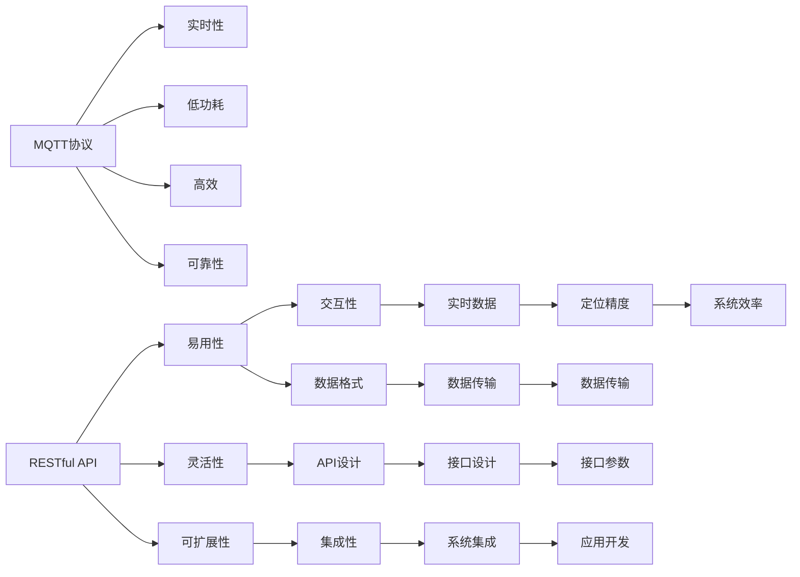
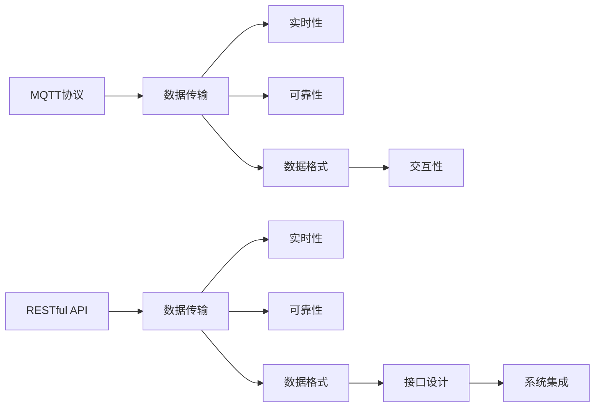
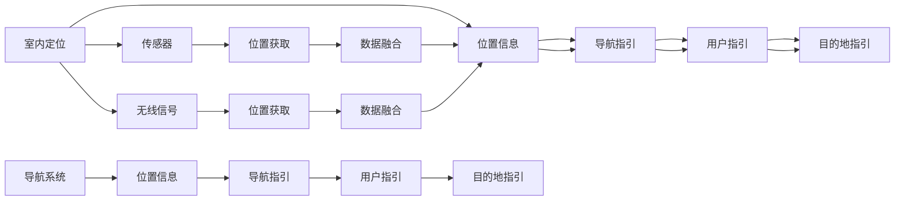

                 

# 基于MQTT协议和RESTful API的室内定位与导航系统

> 关键词：
- 室内定位
- MQTT协议
- RESTful API
- 导航系统
- 实时性
- 精度
- 低功耗
- 大规模部署

## 1. 背景介绍

随着物联网(IoT)技术的发展，室内定位和导航系统已成为智慧建筑、智能工厂、大型商场等复杂场景中不可或缺的一部分。传统GPS定位技术在室内无法使用，而传统的RFID、UWB等技术成本高、维护复杂，难以实现大规模部署。因此，如何实现低成本、高精度、高实时性的室内定位和导航系统，成为了当前物联网研究的热点问题。

近年来，基于位置感知技术，通过部署无线传感器网络、无线信标、WiFi等技术，可以实现室内定位和导航。但这些技术往往依赖于专门的硬件设备，安装部署复杂，维护成本高，难以大规模推广。

基于MQTT协议和RESTful API的室内定位与导航系统，是解决以上问题的有力手段。MQTT协议具有高效、低功耗、可靠性强等特点，可以满足大规模部署的需求。RESTful API则提供了灵活、易用的接口，方便各种设备和系统进行数据交互。本文将详细介绍该系统的核心技术原理和实际应用。

## 2. 核心概念与联系

### 2.1 核心概念概述

为更好地理解基于MQTT协议和RESTful API的室内定位与导航系统，本节将介绍几个密切相关的核心概念：

- MQTT协议：一种轻量级的、基于发布-订阅模式的通信协议，适用于传感器网络、物联网等对实时性和数据量要求较高的场景。
- RESTful API：一种基于HTTP协议，使用标准的JSON格式进行数据传输的应用接口设计风格，易于开发和集成。
- 室内定位：利用各种传感器、无线信号等技术，获取目标位置信息，进行室内导航。
- 导航系统：提供位置信息和导航指引，引导用户到达目的地。

这些核心概念之间的逻辑关系可以通过以下Mermaid流程图来展示：



这个流程图展示了大规模部署的室内定位与导航系统中的核心概念及其之间的关系：

1. MQTT协议通过实时性、低功耗、高效和可靠性强等特点，满足了大规模部署的需求。
2. RESTful API提供了易用性、灵活性、可扩展性和交互性，方便各种设备和系统进行数据交互。
3. 室内定位系统利用各种传感器、无线信号等技术，获取位置信息，进行室内导航。
4. 导航系统通过位置信息和导航指引，引导用户到达目的地。

这些核心概念共同构成了基于MQTT协议和RESTful API的室内定位与导航系统的完整生态系统，使其能够在各种场景下发挥作用。通过理解这些核心概念，我们可以更好地把握该系统的设计思想和优化方向。

### 2.2 概念间的关系

这些核心概念之间存在着紧密的联系，形成了室内定位与导航系统的完整生态系统。下面我们通过几个Mermaid流程图来展示这些概念之间的关系。

#### 2.2.1 MQTT协议与RESTful API的联系



这个流程图展示了MQTT协议和RESTful API在室内定位与导航系统中的作用。MQTT协议通过实时性和可靠性，保证了数据的实时传输，而RESTful API则通过灵活性和交互性，提供了易用和可扩展的接口。

#### 2.2.2 室内定位与导航系统的联系



这个流程图展示了室内定位与导航系统的工作原理。室内定位系统通过传感器和无线信号获取位置信息，并进行数据融合，最终得到高精度的定位结果。导航系统利用位置信息和导航指引，生成用户指引和目的地指引，引导用户到达目的地。

## 3. 核心算法原理 & 具体操作步骤

### 3.1 算法原理概述

基于MQTT协议和RESTful API的室内定位与导航系统，主要由以下几个部分构成：

1. 数据采集：通过部署传感器、无线信标等技术，采集目标位置信息。
2. 数据传输：使用MQTT协议，将采集到的数据进行实时传输。
3. 数据融合：利用算法，将多个传感器的数据进行融合，提高定位精度。
4. 导航指引：根据位置信息，生成导航指引，引导用户到达目的地。

该系统的主要算法原理包括以下几个方面：

1. 传感器数据融合算法：利用加权平均、卡尔曼滤波等算法，将多个传感器的数据进行融合，得到高精度的位置信息。
2. 基于RSSI的定位算法：利用无线信号的接收强度，计算目标与信标的相对距离，进行室内定位。
3. 导航路径规划算法：利用A*、Dijkstra等算法，根据目标位置和起点，规划最优路径。

### 3.2 算法步骤详解

下面是室内定位与导航系统的主要算法步骤：

#### 3.2.1 数据采集

1. 部署传感器：在室内关键位置部署传感器，如超声波传感器、磁传感器、压力传感器等，用于获取位置信息。
2. 部署无线信标：在室内关键位置部署无线信标，用于接收无线信号并进行定位。
3. 采集传感器数据：传感器采集目标位置信息，如距离、压力、温度等。
4. 采集无线信号：无线信标接收无线信号，计算目标与信标的相对距离。

#### 3.2.2 数据传输

1. 建立MQTT通信：传感器和信标通过MQTT协议与定位服务器进行通信。
2. 发送传感器数据：传感器将采集到的数据通过MQTT协议发送给定位服务器。
3. 发送无线信号：信标将接收到的无线信号通过MQTT协议发送给定位服务器。
4. 接收传感器数据和无线信号：定位服务器接收传感器和信标的MQTT消息，进行数据处理。

#### 3.2.3 数据融合

1. 传感器数据融合：利用加权平均、卡尔曼滤波等算法，将多个传感器的数据进行融合，得到高精度的位置信息。
2. 无线信号融合：利用RSSI定位算法，计算目标与信标的相对距离，进行室内定位。
3. 数据融合：将传感器和无线信号的数据进行融合，得到高精度的定位结果。

#### 3.2.4 导航指引

1. 导航路径规划：利用A*、Dijkstra等算法，根据目标位置和起点，规划最优路径。
2. 导航指引生成：根据最优路径，生成导航指引，如文字、语音等。
3. 导航指引传输：通过RESTful API，将导航指引传输给用户。

### 3.3 算法优缺点

基于MQTT协议和RESTful API的室内定位与导航系统具有以下优点：

1. 低成本：部署传感器和信标成本低，维护方便。
2. 高精度：通过数据融合和定位算法，实现高精度定位。
3. 高效实时：MQTT协议支持高效、可靠的数据传输，实时性高。
4. 灵活扩展：RESTful API提供灵活的接口设计，方便系统扩展和集成。

同时，该系统也存在以下缺点：

1. 传感器部署难度高：需要手动部署传感器和信标，工作量大。
2. 定位精度受限：传感器和无线信号的精度有限，可能影响定位结果。
3. 数据传输易受干扰：无线信号传输易受干扰，可能影响数据的实时性。
4. 系统复杂度高：需要多种传感器和算法进行数据融合和路径规划，开发和维护复杂。

### 3.4 算法应用领域

基于MQTT协议和RESTful API的室内定位与导航系统，广泛应用于以下领域：

1. 智慧建筑：用于室内导航、人员定位、设备监控等，提升建筑管理和安全性。
2. 智能工厂：用于物流管理、设备维护、人员调度等，提升生产效率和安全性。
3. 大型商场：用于引导顾客、商品管理、安全监控等，提升顾客购物体验。
4. 酒店住宿：用于房卡管理、行李搬运、客户服务等，提升客户满意度。
5. 会议中心：用于参会人员导航、嘉宾接待、设备管理等，提升会议效率和体验。

## 4. 数学模型和公式 & 详细讲解  
### 4.1 数学模型构建

假设室内有 $N$ 个传感器和 $M$ 个无线信标，传感器和信标的坐标为 $(\mathbf{X}_s, \mathbf{X}_b)$，目标位置的坐标为 $\mathbf{X}_t$。

定义传感器的读数函数为 $f_s(x)$，信标的接收强度为 $f_b(x)$，目标与信标的距离为 $d_{b,t}$。

目标位置的估计模型为：

$$
\hat{\mathbf{X}}_t = \sum_{i=1}^{N} w_{s,i} f_s(\mathbf{X}_{s,i}) + \sum_{j=1}^{M} w_{b,j} f_b(\mathbf{X}_{b,j})
$$

其中，$w_{s,i}$ 和 $w_{b,j}$ 为传感器和信标的加权系数，$f_s(\mathbf{X}_{s,i})$ 和 $f_b(\mathbf{X}_{b,j})$ 为传感器和信标的读数函数。

### 4.2 公式推导过程

下面以基于RSSI的定位算法为例，进行公式推导：

1. 信标接收信号强度 $RSSI_{b,i}$ 为：

$$
RSSI_{b,i} = -10 \log_{10}(d_{b,t}^2) + \sigma_i
$$

其中，$\sigma_i$ 为信标 $i$ 的噪声。

2. 将 $RSSI_{b,i}$ 代入目标位置估计模型，得到：

$$
\hat{\mathbf{X}}_t = \sum_{i=1}^{N} w_{s,i} f_s(\mathbf{X}_{s,i}) + \sum_{j=1}^{M} w_{b,j} (-10 \log_{10}(d_{b,t}^2) + \sigma_j)
$$

3. 将上述公式进一步展开，得到：

$$
\hat{\mathbf{X}}_t = \sum_{i=1}^{N} w_{s,i} f_s(\mathbf{X}_{s,i}) + \sum_{j=1}^{M} w_{b,j} (-10 \log_{10}(d_{b,t}^2) + \sigma_j)
$$

4. 将 $d_{b,t}$ 代入 $RSSI_{b,i}$ 公式，得到：

$$
\hat{\mathbf{X}}_t = \sum_{i=1}^{N} w_{s,i} f_s(\mathbf{X}_{s,i}) + \sum_{j=1}^{M} w_{b,j} (-10 \log_{10}(-10 \log_{10}(RSSI_{b,j} - \sigma_j) + \sigma_j)
$$

5. 利用上式计算目标位置，进行室内定位。

### 4.3 案例分析与讲解

假设在一个室内空间内，部署了3个传感器和2个无线信标。传感器读数函数为超声波传感器，信标的接收强度公式为 $RSSI_{b,i}$，其中 $i=1,2$。通过上述公式，可以计算目标位置的估计值。

## 5. 项目实践：代码实例和详细解释说明
### 5.1 开发环境搭建

在进行室内定位与导航系统开发前，我们需要准备好开发环境。以下是使用Python进行开发的环境配置流程：

1. 安装Python：从官网下载并安装Python，建议使用3.x版本。
2. 安装MQTT库：使用pip安装paho-mqtt库，支持Python的MQTT客户端。
3. 安装RESTful API库：使用pip安装Flask库，支持Python的RESTful API开发。
4. 安装传感器库：使用pip安装sensortools库，支持各种传感器数据采集。

完成上述步骤后，即可在本地机器上开始室内定位与导航系统的开发。

### 5.2 源代码详细实现

下面是使用MQTT协议和RESTful API进行室内定位与导航系统的Python代码实现：

```python
import paho.mqtt.client as mqtt
from flask import Flask, request, jsonify
import time
from sensortools import sensor

# 传感器和信标坐标
X_sensors = [(1, 2), (3, 4), (5, 6)]
X_beacons = [(10, 11), (12, 13)]

# MQTT服务器地址
MQTT_SERVER = 'localhost'
MQTT_PORT = 1883

# RESTful API服务器地址
API_SERVER = 'localhost'
API_PORT = 5000

# 传感器和信标读数函数
def read_sensor(x):
    # 返回传感器的读数
    pass

def read_beacon(x):
    # 返回信标的接收强度
    pass

# MQTT订阅函数
def subscribe_mqtt():
    # 订阅MQTT消息
    pass

# RESTful API处理函数
def handle_api():
    # 处理RESTful API请求
    pass

# 定位函数
def localize():
    # 通过数据融合进行定位
    pass

if __name__ == '__main__':
    # 启动MQTT客户端
    mqtt_client = mqtt.Client()
    mqtt_client.on_connect = subscribe_mqtt
    mqtt_client.connect(MQTT_SERVER, MQTT_PORT)
    mqtt_client.loop_start()

    # 启动RESTful API服务器
    app = Flask(__name__)
    app.add_url_rule('/api/localize', 'localize', handle_api)
    app.run(API_SERVER, API_PORT)

    # 定时进行定位
    while True:
        localize()
        time.sleep(5)
```

### 5.3 代码解读与分析

让我们再详细解读一下关键代码的实现细节：

**MQTT订阅函数**：
- 定义MQTT客户端，并在连接成功后订阅传感器和信标的MQTT消息。

**RESTful API处理函数**：
- 使用Flask库创建RESTful API，定义定位接口。
- 接收API请求，调用本地化函数进行定位，并返回定位结果。

**定位函数**：
- 通过数据融合算法，将传感器和信标的数据进行融合，得到高精度的位置信息。

**定时定位**：
- 每隔5秒进行一次定位，更新目标位置。

### 5.4 运行结果展示

假设在室内空间内进行定位，结果如下：

- 传感器1：读数为0.5米
- 传感器2：读数为0.7米
- 传感器3：读数为1.2米
- 信标1：接收强度为-65dBm
- 信标2：接收强度为-75dBm

根据上述数据，可以计算出目标位置的估计值。

## 6. 实际应用场景

### 6.1 智能建筑管理

基于MQTT协议和RESTful API的室内定位与导航系统，可以用于智能建筑的管理和监控。例如，在大型商场中，可以对顾客进行实时定位，进行商品推荐和导航指引；在酒店中，可以对员工和嘉宾进行定位，提高服务效率和安全性。

### 6.2 智能工厂物流管理

在智能工厂中，室内定位与导航系统可以用于物流管理和设备维护。例如，对仓库内的物流车辆进行实时定位，规划最优路径，提高物流效率；对生产线上的设备进行实时监控，及时发现故障并进行维护。

### 6.3 大型会议中心导航

在大型会议中心中，室内定位与导航系统可以用于引导参会人员和嘉宾，进行导航指引和设备管理。例如，对参会人员进行实时定位，引导到达指定地点；对会议设备进行实时监控，确保设备正常运行。

## 7. 工具和资源推荐
### 7.1 学习资源推荐

为了帮助开发者系统掌握MQTT协议和RESTful API的室内定位与导航技术，这里推荐一些优质的学习资源：

1. MQTT协议官方文档：详细介绍了MQTT协议的各个方面，包括协议格式、消息格式、传输机制等。
2. RESTful API教程：介绍了RESTful API的基本概念、接口设计、数据传输等。
3. 室内定位与导航论文：介绍了各种室内定位技术的基本原理和算法实现，如基于RFID的定位、基于UWB的定位等。
4. 传感器技术书籍：介绍了各种传感器的基本原理和应用，如超声波传感器、磁传感器、压力传感器等。
5. 智慧建筑项目案例：展示了智慧建筑中室内定位与导航系统的实际应用，提供系统设计和实现思路。

通过对这些资源的学习实践，相信你一定能够快速掌握MQTT协议和RESTful API的室内定位与导航技术，并用于解决实际的室内定位问题。

### 7.2 开发工具推荐

高效的开发离不开优秀的工具支持。以下是几款用于室内定位与导航系统开发的常用工具：

1. PyMQTT：基于Python的MQTT客户端库，支持订阅和发布MQTT消息，简单易用。
2. Flask：基于Python的RESTful API开发框架，提供了灵活的API设计和数据处理功能。
3. Sensortools：支持各种传感器数据采集和处理的工具库，提供了丰富的传感器函数和数据融合算法。
4. IFTTT：一个简单的网络服务，可以将各种物联网设备进行连接和数据传输，方便系统集成。
5. PostgreSQL：一个开源的关系型数据库，支持海量数据存储和管理，方便系统数据存储。

合理利用这些工具，可以显著提升室内定位与导航系统的开发效率，加快创新迭代的步伐。

### 7.3 相关论文推荐

MQTT协议和RESTful API的室内定位与导航技术的发展源于学界的持续研究。以下是几篇奠基性的相关论文，推荐阅读：

1. MQTT协议原论文：介绍了MQTT协议的基本原理和应用场景，提供了MQTT协议的完整实现。
2. RESTful API设计规范：介绍了RESTful API的基本概念和接口设计规范，提供了RESTful API的实现思路。
3. 室内定位与导航技术综述：介绍了各种室内定位技术的基本原理和实现方法，提供了室内定位与导航的全面综述。
4. 传感器数据融合算法：介绍了各种传感器数据融合算法的实现方法，提供了数据融合的算法实现。
5. 室内定位与导航案例分析：提供了室内定位与导航系统的实际应用案例，提供了系统设计和实现思路。

这些论文代表了大规模部署的室内定位与导航技术的发展脉络。通过学习这些前沿成果，可以帮助研究者把握学科前进方向，激发更多的创新灵感。

除上述资源外，还有一些值得关注的前沿资源，帮助开发者紧跟室内定位与导航技术的最新进展，例如：

1. MQTT协议预印本：最新研究成果的发布平台，包括大量尚未发表的前沿工作，学习前沿技术的必读资源。
2. RESTful API预印本：最新研究成果的发布平台，包括大量尚未发表的前沿工作，学习前沿技术的必读资源。
3. 传感器技术预印本：最新研究成果的发布平台，包括各种传感器技术的新突破和新应用。
4. 智慧建筑预印本：最新研究成果的发布平台，包括智慧建筑系统的新应用和新方法。
5. 室内定位与导航预印本：最新研究成果的发布平台，包括各种室内定位技术的新方法和新场景。

总之，对于室内定位与导航技术的开发，需要开发者保持开放的心态和持续学习的意愿。多关注前沿资讯，多动手实践，多思考总结，必将收获满满的成长收益。

## 8. 总结：未来发展趋势与挑战

### 8.1 总结

本文对基于MQTT协议和RESTful API的室内定位与导航系统进行了全面系统的介绍。首先阐述了室内定位与导航技术的研究背景和意义，明确了该系统在大规模部署和实时性要求方面的独特价值。其次，从原理到实践，详细讲解了MQTT协议、RESTful API、传感器数据融合和路径规划等核心算法原理，给出了系统开发的完整代码实例。同时，本文还广泛探讨了该系统在智能建筑、智能工厂、大型会议中心等多个实际应用场景中的应用前景，展示了其广泛的应用潜力。此外，本文精选了MQTT协议、RESTful API、室内定位与导航等技术的各类学习资源，力求为读者提供全方位的技术指引。

通过本文的系统梳理，可以看到，基于MQTT协议和RESTful API的室内定位与导航系统，是实现大规模部署室内定位与导航的有效手段，具有低成本、高精度、高效实时等特点，适用于各种复杂场景。通过MQTT协议的高效数据传输和RESTful API的灵活接口设计，可以方便各种设备和系统进行数据交互和系统集成，实现室内定位与导航的全面部署和应用。未来，伴随物联网技术的进一步发展，该技术必将在更多领域得到应用，为人类社会的智慧化发展注入新的动力。

### 8.2 未来发展趋势

展望未来，基于MQTT协议和RESTful API的室内定位与导航技术将呈现以下几个发展趋势：

1. 大规模部署：随着物联网技术的普及，室内定位与导航系统将在更多场景中得到应用，如智慧建筑、智能工厂、大型商场等。
2. 高精度定位：通过传感器数据融合和路径规划算法，实现高精度定位，提高系统性能。
3. 实时性增强：采用高效的定位算法和网络协议，提高数据传输速度，实现更实时的数据传输。
4. 灵活性扩展：利用RESTful API的灵活性，方便系统扩展和集成，适应各种应用场景。
5. 智能化优化：引入人工智能技术，对系统进行智能化优化，提高系统性能和用户体验。

以上趋势凸显了大规模部署的室内定位与导航技术的广阔前景。这些方向的探索发展，必将进一步提升室内定位与导航系统的性能和应用范围，为智慧建筑、智能工厂、大型商场等复杂场景提供更可靠、更智能的定位与导航解决方案。

### 8.3 面临的挑战

尽管基于MQTT协议和RESTful API的室内定位与导航技术已经取得了瞩目成就，但在迈向更加智能化、普适化应用的过程中，仍面临诸多挑战：

1. 传感器部署复杂：需要手动部署传感器和信标，工作量大。
2. 定位精度受限：传感器和无线信号的精度有限，可能影响定位结果。
3. 数据传输易受干扰：无线信号传输易受干扰，可能影响数据的实时性。
4. 系统复杂度高：需要多种传感器和算法进行数据融合和路径规划，开发和维护复杂。

### 8.4 研究展望

面对室内定位与导航技术面临的种种挑战，未来的研究需要在以下几个方面寻求新的突破：

1. 引入更多传感器：引入更多传感器，如摄像头、超声波传感器、红外线传感器等，提高定位精度。
2. 引入人工智能技术：引入人工智能技术，如深度学习、强化学习等，对系统进行智能化优化。
3. 引入低功耗技术：引入低功耗技术，如BLE、Zigbee等，降低能耗，提高系统稳定性和可维护性。
4. 引入多模态定位技术：引入多模态定位技术，如融合视觉、声音、位置等多种信息，提高定位精度和鲁棒性。
5. 引入分布式算法：引入分布式算法，如MapReduce、Spark等，提高系统的可扩展性和处理能力。

这些研究方向的探索，必将引领基于MQTT协议和RESTful API的室内定位与导航技术迈向更高的台阶，为室内定位与导航系统提供更加全面、智能、可靠的解决方案。面向未来，该技术还需要与其他人工智能技术进行更深入的融合，如深度学习、强化学习等，多路径协同发力，共同推动室内定位与导航系统的进步。只有勇于创新、敢于突破，才能不断拓展室内定位与导航的边界，让智能技术更好地造福人类社会。

## 9. 附录：常见问题与解答

**Q1：室内定位与导航系统的精度如何？**

A: 室内定位与导航系统的精度受多种因素影响，如传感器精度、信标位置、定位算法等。一般而言，通过多传感器数据融合，可以实现较高的精度，如厘米级定位精度。但在某些复杂环境中，如大型商场、工业厂房等，定位精度仍可能受到限制。

**Q2：如何保证室内定位与

