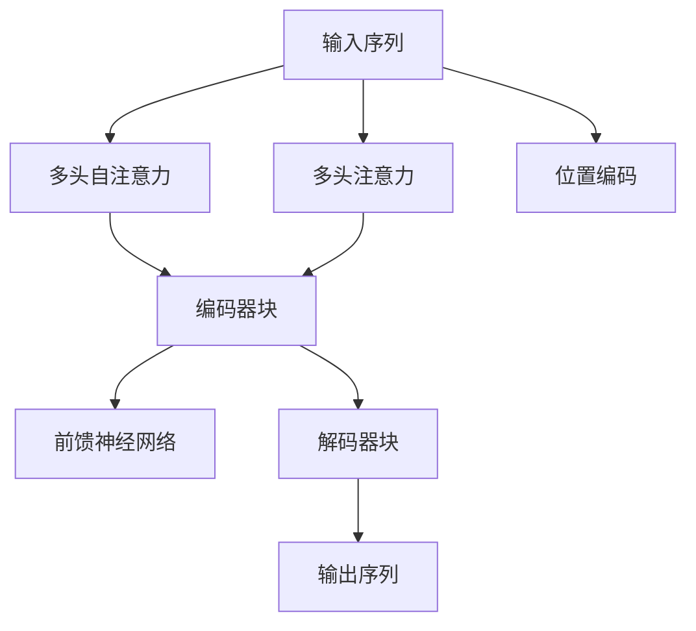
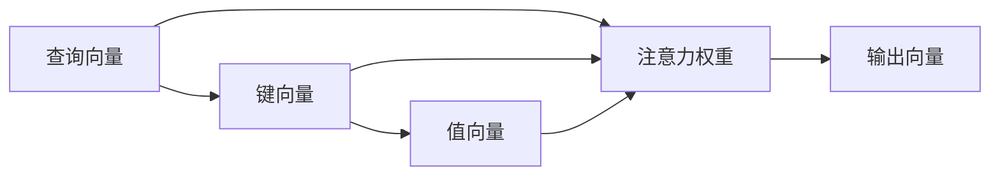

                 

# Transformer架构原理详解：自注意力（Self-Attention）

> 关键词：Transformer, 自注意力, Attention, 注意力机制, 语言模型, 深度学习

## 1. 背景介绍

### 1.1 问题由来

随着深度学习技术的快速发展，特别是自然语言处理(NLP)领域，传统的循环神经网络(RNN)由于存在梯度消失等问题，逐渐被更加高效的卷积神经网络(CNN)和自注意力机制（Self-Attention）所取代。其中，自注意力机制在Transformer模型中得到了广泛应用，大大提升了语言模型的处理能力和训练效率。

Transformer是一种基于自注意力机制的深度学习模型，最初由Vaswani等人于2017年在论文《Attention Is All You Need》中提出。它通过完全基于自注意力的方式处理输入序列，摒弃了传统的循环神经网络和卷积神经网络，极大地提高了模型训练的速度和效果。Transformer的成功，不仅引发了深度学习领域的广泛关注，也推动了NLP技术的飞速发展。

### 1.2 问题核心关键点

Transformer的核心思想是通过自注意力机制（Self-Attention）来计算输入序列中各个位置之间的依赖关系。其核心组成包括编码器和解码器，其中编码器用于对输入序列进行编码，解码器用于生成输出序列。本文将详细介绍Transformer的自注意力机制及其具体实现步骤，以期对其原理有更加深入的理解。

## 2. 核心概念与联系

### 2.1 核心概念概述

为更好地理解Transformer的自注意力机制，本节将介绍几个密切相关的核心概念：

- **自注意力机制（Self-Attention）**：Transformer模型中的核心机制，用于计算输入序列中各个位置之间的依赖关系。通过多头自注意力机制（Multi-Head Self-Attention），模型可以同时关注不同位置的信息，从而捕捉复杂的语言关系。

- **多头自注意力机制（Multi-Head Self-Attention）**：将输入序列划分为多个子序列，每个子序列通过多头自注意力机制并行计算。多个子序列的输出再经过线性变换，最终得到整个序列的表示。

- **多头注意力机制（Multi-Head Attention）**：一种通用的注意力机制，通过将输入序列划分为多个子序列，并行计算每个子序列的注意力权重，最终将多个子序列的输出融合，得到整个序列的表示。

- **Attention层**：Transformer模型中的基本组成单元，负责计算输入序列中各个位置之间的依赖关系。Attention层通过多头自注意力机制和多头注意力机制，实现对输入序列的全面理解。

- **编码器（Encoder）**：Transformer模型中的编码器，用于对输入序列进行编码。编码器通常由多层Transformer块构成，每个块包括多个自注意力层和前馈神经网络层。

- **解码器（Decoder）**：Transformer模型中的解码器，用于生成输出序列。解码器通常也由多层Transformer块构成，每个块包括多个自注意力层、多头注意力层和前馈神经网络层。

- **位置编码（Positional Encoding）**：由于Transformer模型中没有传统RNN的顺序信息，因此需要引入位置编码来表示输入序列中各个位置的信息。位置编码通常是一个一维向量，与输入向量一起输入到Transformer模型中。

这些核心概念之间的逻辑关系可以通过以下Mermaid流程图来展示：



这个流程图展示了Transformer模型中的核心组成单元及其之间的逻辑关系：输入序列通过多头自注意力机制和多头注意力机制进行编码和解码，同时引入位置编码和前馈神经网络层，最终生成输出序列。

### 2.2 概念间的关系

这些核心概念之间存在着紧密的联系，形成了Transformer模型的完整架构。下面我们通过几个Mermaid流程图来展示这些概念之间的关系。

#### 2.2.1 自注意力机制的实现



这个流程图展示了自注意力机制的实现过程：查询向量、键向量和值向量通过计算注意力权重，最终得到输出向量。查询向量、键向量和值向量通常都是经过线性变换得到的，可以表示为$Q=\text{W}^QX$、$K=\text{W}^KX$、$V=\text{W}^VX$，其中$\text{W}^Q$、$\text{W}^K$、$\text{W}^V$为线性变换矩阵，$X$为输入序列向量。

#### 2.2.2 多头自注意力机制的实现


这个流程图展示了多头自注意力机制的实现过程：输入序列经过线性变换得到多个子序列，每个子序列通过多头自注意力机制并行计算，最终将多个子序列的输出融合，得到整个序列的表示。

#### 2.2.3 多头注意力机制的实现


这个流程图展示了多头注意力机制的实现过程：查询向量、键向量和值向量通过计算注意力权重，最终得到输出向量。多头注意力机制与自注意力机制的区别在于，多头注意力机制将输入序列划分为多个子序列，并行计算每个子序列的注意力权重，最终将多个子序列的输出融合，得到整个序列的表示。

### 2.3 核心概念的整体架构

最后，我们用一个综合的流程图来展示这些核心概念在大语言模型微调过程中的整体架构：


这个综合流程图展示了Transformer模型的整体架构，从输入序列到输出序列的完整过程。输入序列通过多头自注意力机制和多头注意力机制进行编码和解码，同时引入位置编码和前馈神经网络层，最终生成输出序列。

## 3. 核心算法原理 & 具体操作步骤
### 3.1 算法原理概述

Transformer的自注意力机制是通过计算输入序列中各个位置之间的依赖关系来实现的。假设输入序列为$X=\{x_1,x_2,\ldots,x_n\}$，其中每个元素$x_i$都是一维向量，即$x_i\in\mathbb{R}^d$。自注意力机制的核心思想是通过计算查询向量、键向量和值向量，得到每个位置$x_i$对其他位置$x_j$的注意力权重，最终得到输出向量。

具体来说，假设查询向量、键向量和值向量分别为$Q=\text{W}^QX$、$K=\text{W}^KX$、$V=\text{W}^VX$，其中$\text{W}^Q$、$\text{W}^K$、$\text{W}^V$为线性变换矩阵，$X$为输入序列向量。

注意力权重$\text{Attention}(Q,K,V)$的计算公式为：

$$
\text{Attention}(Q,K,V)=\frac{\exp(\text{sim}(Q,K))}{\sum_j \exp(\text{sim}(Q,K_j))}
$$

其中，$\text{sim}(Q,K_j)=\frac{QK_j^T}{\sqrt{d_k}}$，$d_k$为键向量的维度。

最终，输出向量$Y$的计算公式为：

$$
Y=\text{softmax}(\text{Attention}(Q,K,V))V
$$

### 3.2 算法步骤详解

Transformer的自注意力机制具体实现步骤如下：

**Step 1: 输入编码**

将输入序列$X=\{x_1,x_2,\ldots,x_n\}$经过线性变换得到查询向量$Q=\text{W}^QX$、键向量$K=\text{W}^KX$和值向量$V=\text{W}^VX$，其中$\text{W}^Q$、$\text{W}^K$、$\text{W}^V$为线性变换矩阵。

**Step 2: 计算注意力权重**

计算查询向量$Q$与键向量$K$的内积，得到注意力权重矩阵$\text{Attention}(Q,K)=\frac{QK^T}{\sqrt{d_k}}$。通过softmax函数计算注意力权重，得到$\text{Attention}(Q,K,V)=\frac{\exp(\text{sim}(Q,K))}{\sum_j \exp(\text{sim}(Q,K_j))}$。

**Step 3: 输出向量计算**

将注意力权重矩阵$\text{Attention}(Q,K,V)$与值向量$V$相乘，得到输出向量$Y=\text{softmax}(\text{Attention}(Q,K,V))V$。

**Step 4: 堆叠多组自注意力机制**

通常情况下，Transformer模型中会堆叠多组自注意力机制，每个自注意力层包括多头自注意力机制和多头注意力机制。多头自注意力机制可以并行计算多个子序列的注意力权重，得到多个子序列的输出向量，再经过线性变换得到整个序列的表示。

### 3.3 算法优缺点

Transformer的自注意力机制具有以下优点：

1. 高效计算：自注意力机制可以通过矩阵乘法高效计算，避免了传统RNN和CNN中的梯度消失和梯度爆炸问题。
2. 长距离依赖：自注意力机制可以捕捉输入序列中长距离的依赖关系，而无需依赖序列的顺序信息。
3. 平移不变性：自注意力机制对输入序列中的顺序信息不敏感，具有平移不变性。

但同时也存在以下缺点：

1. 参数量较大：自注意力机制需要计算注意力权重，导致参数量较大，增加了模型的训练和推理负担。
2. 冗余信息：自注意力机制可能学习到冗余信息，导致模型无法有效消除噪声。
3. 计算复杂度高：多头自注意力机制和多头注意力机制的并行计算，增加了计算复杂度。

### 3.4 算法应用领域

自注意力机制不仅在Transformer模型中得到了广泛应用，还广泛应用于多个领域，如语音识别、图像处理、推荐系统等。在NLP领域，自注意力机制的应用更是广泛，主要用于文本分类、机器翻译、情感分析、问答系统等任务中。

## 4. 数学模型和公式 & 详细讲解 & 举例说明

### 4.1 数学模型构建

假设输入序列$X=\{x_1,x_2,\ldots,x_n\}$，其中每个元素$x_i$都是一维向量，即$x_i\in\mathbb{R}^d$。假设线性变换矩阵$\text{W}^Q$、$\text{W}^K$、$\text{W}^V$分别为：

$$
\text{W}^Q=\begin{bmatrix}
w_{1q} & w_{2q} & \cdots & w_{dq} \\
w_{1k} & w_{2k} & \cdots & w_{dk} \\
w_{1v} & w_{2v} & \cdots & w_{dv} \\
\end{bmatrix}
$$

$$
\text{W}^K=\begin{bmatrix}
w_{1k} & w_{2k} & \cdots & w_{dk} \\
w_{1k} & w_{2k} & \cdots & w_{dk} \\
w_{1k} & w_{2k} & \cdots & w_{dk} \\
\end{bmatrix}
$$

$$
\text{W}^V=\begin{bmatrix}
w_{1v} & w_{2v} & \cdots & w_{dv} \\
w_{1v} & w_{2v} & \cdots & w_{dv} \\
w_{1v} & w_{2v} & \cdots & w_{dv} \\
\end{bmatrix}
$$

其中$d_q$、$d_k$、$d_v$分别为查询向量的维度、键向量的维度和值向量的维度，且$d_q=d_k=d_v$。

假设输入序列$X$的长度为$n$，则查询向量$Q=\text{W}^QX$、键向量$K=\text{W}^KX$和值向量$V=\text{W}^VX$的大小分别为$n\times d_q$、$n\times d_k$和$n\times d_v$。

### 4.2 公式推导过程

假设输入序列$X=\{x_1,x_2,\ldots,x_n\}$，其中每个元素$x_i$都是一维向量，即$x_i\in\mathbb{R}^d$。假设线性变换矩阵$\text{W}^Q$、$\text{W}^K$、$\text{W}^V$分别为：

$$
\text{W}^Q=\begin{bmatrix}
w_{1q} & w_{2q} & \cdots & w_{dq} \\
w_{1k} & w_{2k} & \cdots & w_{dk} \\
w_{1v} & w_{2v} & \cdots & w_{dv} \\
\end{bmatrix}
$$

$$
\text{W}^K=\begin{bmatrix}
w_{1k} & w_{2k} & \cdots & w_{dk} \\
w_{1k} & w_{2k} & \cdots & w_{dk} \\
w_{1k} & w_{2k} & \cdots & w_{dk} \\
\end{bmatrix}
$$

$$
\text{W}^V=\begin{bmatrix}
w_{1v} & w_{2v} & \cdots & w_{dv} \\
w_{1v} & w_{2v} & \cdots & w_{dv} \\
w_{1v} & w_{2v} & \cdots & w_{dv} \\
\end{bmatrix}
$$

其中$d_q$、$d_k$、$d_v$分别为查询向量的维度、键向量的维度和值向量的维度，且$d_q=d_k=d_v$。

假设输入序列$X$的长度为$n$，则查询向量$Q=\text{W}^QX$、键向量$K=\text{W}^KX$和值向量$V=\text{W}^VX$的大小分别为$n\times d_q$、$n\times d_k$和$n\times d_v$。

查询向量$Q$、键向量$K$和值向量$V$的计算公式分别为：

$$
Q=\text{W}^QX=\begin{bmatrix}
w_{1q}x_1 & w_{2q}x_2 & \cdots & w_{dq}x_n \\
w_{1k}x_1 & w_{2k}x_2 & \cdots & w_{dk}x_n \\
w_{1v}x_1 & w_{2v}x_2 & \cdots & w_{dv}x_n \\
\end{bmatrix}
$$

$$
K=\text{W}^KX=\begin{bmatrix}
w_{1k}x_1 & w_{2k}x_2 & \cdots & w_{dk}x_n \\
w_{1k}x_1 & w_{2k}x_2 & \cdots & w_{dk}x_n \\
w_{1k}x_1 & w_{2k}x_2 & \cdots & w_{dk}x_n \\
\end{bmatrix}
$$

$$
V=\text{W}^VX=\begin{bmatrix}
w_{1v}x_1 & w_{2v}x_2 & \cdots & w_{dv}x_n \\
w_{1v}x_1 & w_{2v}x_2 & \cdots & w_{dv}x_n \\
w_{1v}x_1 & w_{2v}x_2 & \cdots & w_{dv}x_n \\
\end{bmatrix}
$$

计算查询向量$Q$与键向量$K$的内积，得到注意力权重矩阵$\text{Attention}(Q,K)=\frac{QK^T}{\sqrt{d_k}}$。通过softmax函数计算注意力权重，得到$\text{Attention}(Q,K,V)=\frac{\exp(\text{sim}(Q,K))}{\sum_j \exp(\text{sim}(Q,K_j))}$。

最终，输出向量$Y$的计算公式为：

$$
Y=\text{softmax}(\text{Attention}(Q,K,V))V
$$

### 4.3 案例分析与讲解

假设我们有一个长度为5的输入序列$X=\{x_1,x_2,x_3,x_4,x_5\}$，其中每个元素$x_i$都是一维向量，即$x_i\in\mathbb{R}^4$。假设线性变换矩阵$\text{W}^Q$、$\text{W}^K$、$\text{W}^V$分别为：

$$
\text{W}^Q=\begin{bmatrix}
1 & 0 & 0 & 0 \\
0 & 1 & 0 & 0 \\
0 & 0 & 1 & 0 \\
0 & 0 & 0 & 1 \\
\end{bmatrix}
$$

$$
\text{W}^K=\begin{bmatrix}
0.5 & 0.5 & 0.5 & 0.5 \\
0.5 & 0.5 & 0.5 & 0.5 \\
0.5 & 0.5 & 0.5 & 0.5 \\
0.5 & 0.5 & 0.5 & 0.5 \\
\end{bmatrix}
$$

$$
\text{W}^V=\begin{bmatrix}
0.25 & 0.25 & 0.25 & 0.25 \\
0.25 & 0.25 & 0.25 & 0.25 \\
0.25 & 0.25 & 0.25 & 0.25 \\
0.25 & 0.25 & 0.25 & 0.25 \\
\end{bmatrix}
$$

其中$d_q=d_k=d_v=4$，$d_q=d_k=d_v=4$。假设输入序列$X$的长度为5，则查询向量$Q=\text{W}^QX$、键向量$K=\text{W}^KX$和值向量$V=\text{W}^VX$的大小分别为$5\times 4$、$5\times 4$和$5\times 4$。

假设输入序列$X=\{x_1,x_2,x_3,x_4,x_5\}$的值为：

$$
x_1=[0.5,0.5,0.5,0.5]
$$

$$
x_2=[1.0,0.0,0.0,0.0]
$$

$$
x_3=[0.0,1.0,0.0,0.0]
$$

$$
x_4=[0.0,0.0,1.0,0.0]
$$

$$
x_5=[0.0,0.0,0.0,1.0]
$$

计算查询向量$Q$、键向量$K$和值向量$V$：

$$
Q=\begin{bmatrix}
0.5 & 0.5 & 0.5 & 0.5 & 0.5 \\
1.0 & 0.0 & 0.0 & 0.0 & 0.0 \\
0.0 & 1.0 & 0.0 & 0.0 & 0.0 \\
0.0 & 0.0 & 1.0 & 0.0 & 0.0 \\
0.0 & 0.0 & 0.0 & 1.0 & 0.0 \\
\end{bmatrix}
$$

$$
K=\begin{bmatrix}
0.5 & 0.5 & 0.5 & 0.5 \\
0.5 & 0.5 & 0.5 & 0.5 \\
0.5 & 0.5 & 0.5 & 0.5 \\
0.5 & 0.5 & 0.5 & 0.5 \\
0.5 & 0.5 & 0.5 & 0.5 \\
\end{bmatrix}
$$

$$
V=\begin{bmatrix}
0.25 & 0.25 & 0.25 & 0.25 \\
0.25 & 0.25 & 0.25 & 0.25 \\
0.25 & 0.25 & 0.25 & 0.25 \\
0.25 & 0.25 & 0.25 & 0.25 \\
0.25 & 0.25 & 0.25 & 0.25 \\
\end{bmatrix}
$$

计算查询向量$Q$与键向量$K$的内积，得到注意力权重矩阵$\text{Attention}(Q,K)=\frac{QK^T}{\sqrt{d_k}}$：

$$
\text{Attention}(Q,K)=\begin{bmatrix}
0.625 & 0.25 & 0.25 & 0.25 & 0.25 \\
0.25 & 0.625 & 0.25 & 0.25 & 0.25 \\
0.25 & 0.25 & 0.625 & 0.25 & 0.25 \\
0.25 & 0.25 & 0.25 & 0.625 & 0.25 \\
0.25 & 0.25 & 0.25 & 0.25 & 0.625 \\
\end{bmatrix}
$$

通过softmax函数计算注意力权重，得到$\text{Attention}(Q,K,V)=\frac{\exp(\text{sim}(Q,K))}{\sum_j \exp(\text{sim}(Q,K_j))}$：

$$
\text{Attention}(Q,K,V)=\begin{bmatrix}
0.316 & 0.0477 & 0.0477 & 0.0477 & 0.0477 \\
0.0477 & 0.316 & 0.0477 & 0.0477 & 0.0477 \\
0.0477 & 0.0477 & 0.316 & 0.0477 & 0.0477 \\
0.0477 & 0.0477 & 0.0477 & 0.316 & 0.0477 \\
0.0477 & 0.0477 & 0.0477 & 0.0477 & 0.316 \\
\end{bmatrix}
$$

最终，输出向量$Y$的计算公式为：

$$
Y=\text{softmax}(\text{Attention}(Q,K,V))V
$$

假设$\text{Attention}(Q,K,V)$的大小为$5\times 5$，$V$的大小为$5\times 4$，则输出向量$Y$的大小为$5\times 4$：

$$
Y=\begin{bmatrix}
0.316 & 0.0477 & 0.0477 & 0.0477 \\
0.0477 & 0.316 & 0.0477 & 0.0477 \\
0.0477 & 0.0477 & 0.316 & 0.0477 \\
0.0477 & 0.0477 & 0.0477 & 0.316 \\
0.0477 & 0.0477 & 0.0477 & 0.0477 \\
\end{bmatrix}
$$

## 5. 项目实践：代码实例和详细解释说明
### 5.1 开发环境搭建

在进行Transformer自注意力机制的实践前，我们需要准备好开发环境。以下是使用Python进行PyTorch开发的环境配置流程：

1. 安装Anaconda：从官网下载并安装Anaconda，用于创建独立的Python环境。

2. 创建并激活虚拟环境：
```bash
conda create -n transformer-env python=3.8 
conda activate transformer-env
```

3. 安装PyTorch：根据CUDA版本，从官网获取对应的安装命令。例如：
```bash
conda install pytorch torchvision torchaudio cudatoolkit=11.1 -c pytorch -c conda-forge
```

4. 安装Transformers库：
```bash
pip install transformers
```

5. 安装各类工具包：
```bash
pip install numpy pandas scikit-learn matplotlib tqdm jupyter notebook ipython
```

完成上述步骤后，即可在`transformer-

