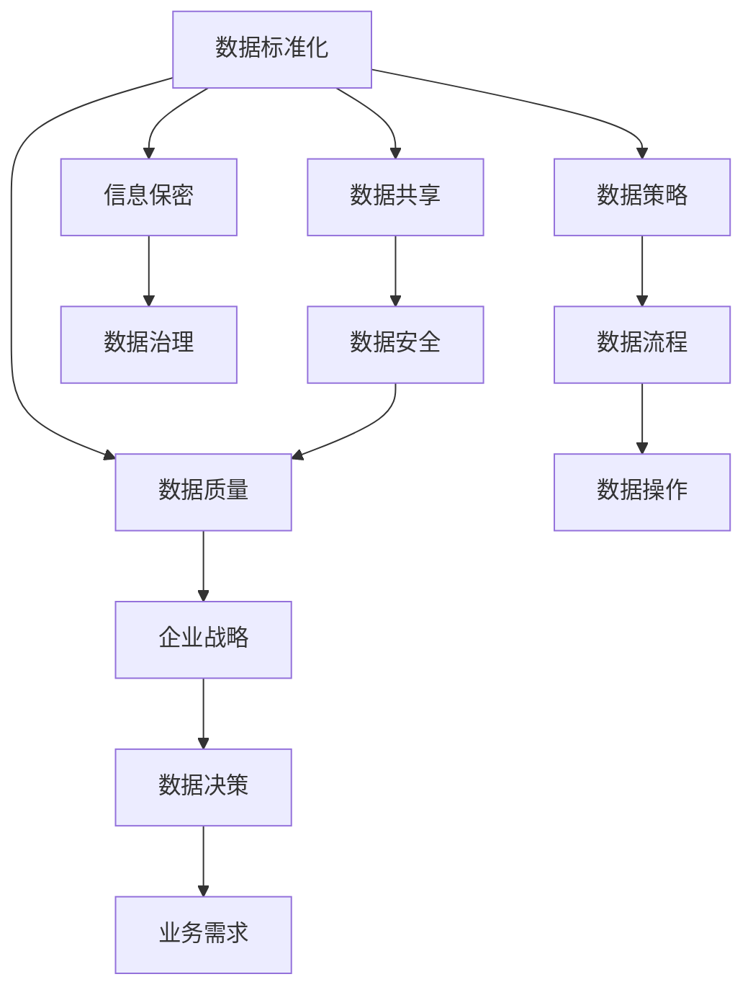
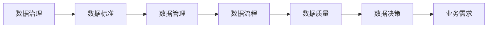
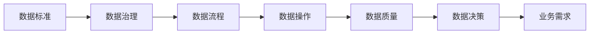

                 

# 公司数据标准及信息保密制度

> 关键词：数据标准、信息保密、数据治理、隐私保护、数据安全

## 1. 背景介绍

### 1.1 问题由来
在当前数字化转型的浪潮中，数据已成为企业竞争力的核心要素。然而，数据的分散、多样性和复杂性也给数据的有效管理和利用带来了巨大的挑战。公司内部数据孤岛现象严重，数据的标准化程度不高，数据共享难度大，信息泄露风险高，这些问题已经成为制约企业数字化转型的重要因素。

因此，构建一套科学合理的数据标准和信息保密制度，成为企业数据治理的关键任务。该制度不仅能够提高数据的规范化和一致性，还能有效保护公司机密信息，确保数据的安全性和完整性，为公司的数据治理提供坚实的基础。

### 1.2 问题核心关键点
构建公司数据标准及信息保密制度的核心关键点包括：
- 数据标准化：通过制定数据标准，规范数据采集、存储、处理和共享过程，提高数据的质量和一致性。
- 信息保密：确保公司机密信息在传输、存储和处理过程中得到有效保护，避免信息泄露。
- 数据安全：建立健全的数据安全措施，防范数据泄露、篡改和损毁等风险。
- 数据治理：建立数据管理和治理机制，确保数据治理的持续改进和优化。

## 2. 核心概念与联系

### 2.1 核心概念概述

为更好地理解公司数据标准及信息保密制度的构建，本节将介绍几个关键概念：

- **数据标准（Data Standard）**：指在数据管理过程中所遵循的一组规则、指南和规范，用于统一数据格式、元数据、数据质量和数据治理等方面的要求，保证数据的可访问性、可互操作性和可追溯性。
- **信息保密（Information Confidentiality）**：指在数据存储、传输和处理过程中，对敏感数据进行严格管理和保护，确保只有授权人员能够访问和处理。
- **数据安全（Data Security）**：指在数据全生命周期中，采取一系列技术和组织措施，确保数据的机密性、完整性和可用性，防止数据被未授权访问、修改或破坏。
- **数据治理（Data Governance）**：指对数据进行规划、监控和控制的一系列政策、流程、工具和度量，旨在保证数据的质量、安全性和合规性，支持企业的战略目标和业务需求。

这些概念之间的逻辑关系可以通过以下Mermaid流程图来展示：



这个流程图展示了这个系统的核心概念及其之间的关系：

1. 数据标准化是数据治理的基础，通过统一数据标准，确保数据的一致性和可访问性。
2. 信息保密是数据安全的重要组成部分，确保数据在传输、存储和处理过程中的机密性。
3. 数据安全通过技术和组织措施，保护数据免受未授权访问和修改。
4. 数据治理通过对数据进行规划和监控，保证数据的合规性和完整性。
5. 数据质量是数据标准化的直接结果，确保数据的高质量和一致性。
6. 数据决策和业务需求是基于数据管理和治理的结果，驱动数据流程和操作。

这些概念共同构成了企业数据治理和信息保密制度的完整生态系统，为其高效运行提供了坚实的基础。

### 2.2 概念间的关系

这些核心概念之间存在着紧密的联系，形成了公司数据标准及信息保密制度的完整生态系统。下面通过几个Mermaid流程图来展示这些概念之间的关系。

#### 2.2.1 数据治理与数据标准的关系



这个流程图展示了数据治理与数据标准的逻辑关系：

1. 数据治理是制定数据标准的依据，通过规划和监控，确定数据标准的具体要求。
2. 数据标准是数据治理的执行标准，指导数据管理和流程的规范化。
3. 数据管理依赖数据标准，通过统一的数据标准，保证数据的规范化和一致性。
4. 数据流程和数据质量直接受到数据标准的指导和约束，确保数据管理的有效性。
5. 数据决策和业务需求基于数据标准和数据质量，驱动数据流程和操作。

#### 2.2.2 数据安全和信息保密的关系


这个流程图展示了数据安全和信息保密之间的逻辑关系：

1. 数据安全是信息保密的基础，通过技术和组织措施，保护数据免受未授权访问和修改。
2. 信息保密是数据安全的重要目标，确保敏感数据在传输、存储和处理过程中的机密性。
3. 数据传输、存储和处理是数据安全和信息保密的关键环节，需要严格控制和保护。
4. 用户身份和权限管理是数据安全和信息保密的关键技术手段，通过严格的访问控制和权限管理，保障数据的机密性。
5. 审计和监控是数据安全和信息保密的重要手段，通过实时监控和事后审计，及时发现和处理数据泄露和安全事件。

#### 2.2.3 数据标准与数据治理的关系



这个流程图展示了数据标准与数据治理之间的逻辑关系：

1. 数据标准是数据治理的执行标准，通过统一的数据标准，确保数据的一致性和规范性。
2. 数据治理是数据标准的制定和执行机制，通过规划、监控和控制，保证数据标准的高效实施。
3. 数据流程和数据操作直接受到数据标准的指导和约束，确保数据的规范化和一致性。
4. 数据质量和数据决策基于数据标准，保证数据的高质量和一致性，支持数据决策和业务需求。

## 3. 核心算法原理 & 具体操作步骤
### 3.1 算法原理概述

公司数据标准及信息保密制度的核心算法原理主要包括以下几个方面：

- **数据标准化**：通过制定统一的数据标准，规范数据采集、存储、处理和共享过程，提高数据的质量和一致性。
- **信息保密**：通过加密、访问控制等技术手段，确保敏感数据在传输、存储和处理过程中的机密性。
- **数据安全**：通过技术手段（如数据加密、访问控制、审计日志等）和组织措施（如权限管理、审计和监控等），确保数据的安全性和完整性。
- **数据治理**：通过制定数据策略、流程和度量，确保数据的规范化和一致性，支持数据决策和业务需求。

这些算法原理通过科学合理的设计和实施，可以有效地解决企业数据治理和信息保密的问题。

### 3.2 算法步骤详解

构建公司数据标准及信息保密制度的步骤主要包括以下几个方面：

**Step 1: 制定数据标准**

1. **数据分类与分级**：根据数据的重要性和敏感性，将数据分为不同的类别和级别，制定相应的数据标准。
2. **数据元数据定义**：定义数据元素的标准化名称、类型、范围和格式，确保数据的可访问性和一致性。
3. **数据质量标准**：制定数据质量指标和评估方法，如完整性、准确性、一致性、及时性和唯一性等。
4. **数据安全标准**：制定数据加密、访问控制、审计日志等安全措施，确保数据的机密性、完整性和可用性。
5. **数据共享标准**：制定数据共享的流程、权限和责任，确保数据的合法共享和保护。

**Step 2: 实施信息保密**

1. **数据加密**：对敏感数据进行加密处理，防止数据在传输和存储过程中被未授权访问。
2. **访问控制**：通过身份验证、权限管理等手段，确保只有授权人员可以访问和处理敏感数据。
3. **审计日志**：记录数据访问和操作的日志，进行实时监控和事后审计，发现和处理异常情况。

**Step 3: 保障数据安全**

1. **数据备份与恢复**：定期备份数据，确保数据在意外情况下的恢复和可用性。
2. **安全监控与检测**：通过实时监控和安全检测技术，及时发现和处理数据泄露和安全事件。
3. **应急响应与处理**：建立应急响应机制，及时处理数据泄露和安全事件，减少损失。

**Step 4: 数据治理**

1. **数据策略制定**：制定数据管理策略，明确数据治理的目标和要求。
2. **数据流程设计**：设计数据流程和操作，确保数据管理的一致性和规范性。
3. **数据度量与评估**：制定数据质量评估指标和度量方法，确保数据管理的有效性和持续改进。
4. **数据决策支持**：通过数据治理和数据分析，支持企业的战略目标和业务需求，驱动数据管理和操作。

### 3.3 算法优缺点

公司数据标准及信息保密制度的优点包括：

- **规范化管理**：通过统一的数据标准，提高数据的一致性和规范性，避免数据孤岛和冗余。
- **高效数据治理**：通过科学合理的数据治理机制，提高数据管理的效率和效果，支持企业战略目标和业务需求。
- **数据安全保障**：通过严格的访问控制和数据安全措施，保障数据的机密性、完整性和可用性，防止数据泄露和滥用。
- **信息保密保护**：通过加密、访问控制等技术手段，确保敏感数据在传输、存储和处理过程中的机密性，保护公司机密信息。

然而，该制度的缺点包括：

- **实施复杂**：构建数据标准及信息保密制度需要大量的技术和组织投入，实施复杂。
- **成本较高**：设计和实施过程中需要大量的硬件、软件和人力资源，成本较高。
- **灵活性不足**：统一的规范化管理可能会限制数据的灵活性和适应性，需要不断优化和调整。
- **动态变化**：数据标准和信息保密制度需要根据业务需求和数据环境的变化进行动态调整，维护成本较高。

### 3.4 算法应用领域

公司数据标准及信息保密制度主要应用于以下领域：

- **金融行业**：金融企业涉及大量的机密数据，如客户信息、交易记录、财务报表等，需要严格的数据标准和信息保密制度，防止数据泄露和滥用。
- **医疗行业**：医疗机构处理大量的敏感数据，如患者病历、医疗记录等，需要严格的数据标准和信息保密制度，确保数据的隐私和安全。
- **政府机构**：政府部门涉及大量敏感信息，如政府决策、公共安全等，需要严格的数据标准和信息保密制度，确保数据的安全性和合法使用。
- **科技企业**：科技公司涉及大量的商业机密和技术专利，需要严格的数据标准和信息保密制度，防止数据泄露和滥用。
- **制造业**：制造业企业涉及大量的生产数据、供应链数据等，需要严格的数据标准和信息保密制度，确保数据的完整性和安全性。

## 4. 数学模型和公式 & 详细讲解 & 举例说明

### 4.1 数学模型构建

公司数据标准及信息保密制度的数学模型主要包括以下几个方面：

- **数据标准模型**：定义数据元数据和数据质量指标的数学模型，如数据元素的标准化名称、类型、范围和格式，数据质量的完整性、准确性、一致性、及时性和唯一性等。
- **信息保密模型**：定义数据加密、访问控制和审计日志的数学模型，如数据加密算法、访问控制策略和审计日志记录等。
- **数据安全模型**：定义数据备份、安全监控和应急响应的数学模型，如数据备份策略、安全监控技术和安全应急流程等。
- **数据治理模型**：定义数据策略、数据流程和数据度量的数学模型，如数据管理策略、数据流程设计和管理度量指标等。

### 4.2 公式推导过程

以下以数据加密模型为例，推导其数学公式：

假设需要加密的数据长度为$m$比特，加密后的数据长度为$n$比特。设加密算法为$E_k$，其中$k$为密钥，$x$为待加密的数据。则加密公式为：

$$
y = E_k(x)
$$

设解密算法为$D_k$，则解密公式为：

$$
x = D_k(y)
$$

其中，$x$为原始数据，$y$为加密后的数据，$k$为密钥。

### 4.3 案例分析与讲解

假设一个金融公司需要加密客户的银行账户信息。该信息包括账户号、密码、卡号和有效期等。数据加密的数学模型如下：

1. **数据分类与分级**：将客户银行账户信息分为高度敏感和中等敏感两类。
2. **数据元数据定义**：定义数据元素的标准化名称、类型、范围和格式，如账户号为字符串类型，密码为加密后的字符串类型，卡号为字符串类型，有效期为日期类型。
3. **数据加密算法**：采用AES-256加密算法对敏感数据进行加密处理。
4. **访问控制策略**：根据用户身份和权限，设置不同级别的访问控制策略，确保只有授权人员可以访问和处理敏感数据。
5. **审计日志记录**：记录数据访问和操作的日志，进行实时监控和事后审计，发现和处理异常情况。

## 5. 项目实践：代码实例和详细解释说明

### 5.1 开发环境搭建

为了构建公司数据标准及信息保密制度，我们需要准备开发环境。以下是使用Python进行开发的环境配置流程：

1. 安装Anaconda：从官网下载并安装Anaconda，用于创建独立的Python环境。

2. 创建并激活虚拟环境：
```bash
conda create -n data-security-env python=3.8 
conda activate data-security-env
```

3. 安装Python库：
```bash
conda install pandas numpy matplotlib
```

4. 安装相关工具：
```bash
pip install flask sqlalchemy pydantic
```

完成上述步骤后，即可在`data-security-env`环境中开始开发。

### 5.2 源代码详细实现

下面我们以一个简单的数据加密应用为例，给出使用Flask框架对客户银行账户信息进行加密的PyTorch代码实现。

首先，定义加密算法的实现类：

```python
from cryptography.hazmat.primitives.ciphers import Cipher, algorithms, modes
from cryptography.hazmat.primitives import padding

class AESCipher:
    def __init__(self, key):
        self.key = key

    def encrypt(self, data):
        iv = os.urandom(16)
        cipher = Cipher(algorithms.AES(self.key), modes.CBC(iv), self.key)
        encryptor = cipher.encryptor()
        padder = padding.PKCS7(128).padder()
        padded_data = padder.update(data) + padder.finalize()
        ciphertext = encryptor.update(padded_data) + encryptor.finalize()
        return iv + ciphertext

    def decrypt(self, ciphertext):
        iv = ciphertext[:16]
        ciphertext = ciphertext[16:]
        cipher = Cipher(algorithms.AES(self.key), modes.CBC(iv), self.key)
        decryptor = cipher.decryptor()
        plaintext = decryptor.update(ciphertext) + decryptor.finalize()
        unpadder = padding.PKCS7(128).unpadder()
        unpadded_data = unpadder.update(plaintext) + unpadder.finalize()
        return unpadded_data.decode('utf-8')
```

然后，定义Flask应用的路由函数：

```python
from flask import Flask, request

app = Flask(__name__)

@app.route('/encrypt', methods=['POST'])
def encrypt():
    data = request.json['data']
    key = os.environ['AES_KEY']
    cipher = AESCipher(key)
    encrypted_data = cipher.encrypt(data)
    return {'encrypted_data': encrypted_data}
```

最后，在应用启动时，设置加密密钥：

```python
if __name__ == '__main__':
    app.run(debug=True, port=5000)
    os.environ['AES_KEY'] = 'your-encryption-key'
```

启动应用后，可以通过API接口对数据进行加密：

```bash
curl -X POST -H 'Content-Type: application/json' -d '{"data": "1234567890123456"}' http://localhost:5000/encrypt
```

## 6. 实际应用场景

### 6.1 智能客服系统

基于公司数据标准及信息保密制度，智能客服系统可以实现对客户数据的规范化管理和安全保护。通过统一的数据标准，智能客服系统可以确保数据的准确性和一致性，提高客户服务质量。同时，通过信息保密措施，系统可以保护客户隐私信息，防止数据泄露。

在技术实现上，可以设计客户信息加密存储机制，确保客户数据的安全性。同时，通过访问控制和审计日志，系统可以实时监控客户数据的访问和使用，确保数据的安全性和合规性。

### 6.2 金融舆情监测

基于公司数据标准及信息保密制度，金融舆情监测系统可以实现对金融数据的规范化管理和安全保护。通过统一的数据标准，系统可以确保金融数据的准确性和一致性，提高舆情监测的效率和效果。同时，通过信息保密措施，系统可以保护金融机密信息，防止数据泄露。

在技术实现上，可以设计金融数据加密存储机制，确保金融数据的安全性。同时，通过访问控制和审计日志，系统可以实时监控金融数据的访问和使用，确保数据的安全性和合规性。

### 6.3 个性化推荐系统

基于公司数据标准及信息保密制度，个性化推荐系统可以实现对用户数据的规范化管理和安全保护。通过统一的数据标准，系统可以确保用户数据的准确性和一致性，提高个性化推荐的准确性和效果。同时，通过信息保密措施，系统可以保护用户隐私信息，防止数据泄露。

在技术实现上，可以设计用户数据加密存储机制，确保用户数据的安全性。同时，通过访问控制和审计日志，系统可以实时监控用户数据的访问和使用，确保数据的安全性和合规性。

### 6.4 未来应用展望

随着公司数据标准及信息保密制度的不断发展和完善，其在更多行业领域的应用前景将更加广阔。

在智慧医疗领域，该制度可以有效保护医疗数据的安全性和隐私性，确保医疗信息的规范化管理和安全共享。

在智能教育领域，该制度可以确保教育数据的规范化管理和安全保护，促进教育公平和高质量教学。

在智慧城市治理中，该制度可以有效保护城市数据的安全性和隐私性，确保城市数据的规范化管理和安全共享。

此外，在企业生产、社会治理、文娱传媒等众多领域，公司数据标准及信息保密制度也将不断涌现，为传统行业数字化转型升级提供新的技术路径。

## 7. 工具和资源推荐

### 7.1 学习资源推荐

为了帮助开发者系统掌握公司数据标准及信息保密制度的构建理论基础和实践技巧，这里推荐一些优质的学习资源：

1. 《数据治理：概念、实践和案例》书籍：全面介绍了数据治理的概念、实践和案例，适合数据治理领域的初学者和从业者。
2. 《信息安全基础》课程：详细讲解了信息安全的基本概念、技术和实践，适合信息安全领域的入门者和进阶者。
3. 《数据加密技术》书籍：介绍了数据加密的基本原理和算法，适合数据加密领域的从业者和研究者。
4. 《数据安全与隐私保护》课程：讲解了数据安全与隐私保护的基本概念、技术和实践，适合数据安全领域的从业者和研究者。
5. 《数据治理最佳实践》网站：提供了数据治理领域的最佳实践和案例，适合数据治理领域的从业者和研究者。

通过对这些资源的学习实践，相信你一定能够快速掌握公司数据标准及信息保密制度的构建方法，并用于解决实际的数据管理和信息保密问题。

### 7.2 开发工具推荐

高效的开发离不开优秀的工具支持。以下是几款用于数据治理和信息保密开发的常用工具：

1. Python：Python具有灵活的编程语言特性和丰富的第三方库，适合数据治理和信息保密的开发和实现。
2. Flask：轻量级的Web应用框架，适合开发简单的数据加密和信息保密API接口。
3. Pydantic：Python数据验证和序列化库，适合定义数据标准和数据模型。
4. SQLAlchemy：Python SQL工具包，适合数据库管理和数据操作。
5. Scikit-learn：Python机器学习库，适合数据预处理和数据分析。
6. Elasticsearch：分布式搜索引擎，适合数据存储和查询。

合理利用这些工具，可以显著提升数据治理和信息保密的开发效率，加快创新迭代的步伐。

### 7.3 相关论文推荐

公司数据标准及信息保密制度的研究源于学界的持续研究。以下是几篇奠基性的相关论文，推荐阅读：

1. "The Data Governance Framework" by Allen & Miller：系统地介绍了数据治理的概念、框架和实践，为数据治理提供了理论基础。
2. "Data Privacy and Security in the Age of Big Data" by Agrawal et al：全面介绍了大数据时代的数据隐私和安全问题，提出了相应的技术和组织解决方案。
3. "Data Encryption Techniques and Algorithms" by Parekh：详细讲解了数据加密的基本原理和算法，为数据加密提供了理论基础和实践方法。
4. "Data Security and Privacy Management" by Zhou & Xie：讲解了数据安全与隐私管理的概念、技术和实践，为数据安全提供了理论基础和实践方法。
5. "Data Governance Best Practices" by Davenport & Harris：提供了数据治理领域的最佳实践和案例，为数据治理提供了理论和实践指导。

这些论文代表了大数据治理和信息保密领域的研究进展，帮助开发者理解和掌握相关理论和技术。

除上述资源外，还有一些值得关注的前沿资源，帮助开发者紧跟公司数据标准及信息保密制度的最新进展，例如：

1. arXiv论文预印本：人工智能领域最新研究成果的发布平台，包括大量尚未发表的前沿工作，学习前沿技术的必读资源。
2. 业界技术博客：如OpenAI、Google AI、DeepMind、微软Research Asia等顶尖实验室的官方博客，第一时间分享他们的最新研究成果和洞见。
3. 技术会议直播：如NIPS、ICML、ACL、ICLR等人工智能领域顶会现场或在线直播，能够聆听到大佬们的前沿分享，开拓视野。
4. GitHub热门项目：在GitHub上Star、Fork数最多的数据治理和信息保密相关项目，往往代表了该技术领域的发展趋势和最佳实践，值得去学习和贡献。
5. 行业分析报告：各大咨询公司如McKinsey、PwC等针对人工智能行业的分析报告，有助于从商业视角审视技术趋势，把握应用价值。

总之，对于公司数据标准及信息保密制度的构建和学习，需要开发者保持开放的心态和持续学习的意愿。多关注前沿资讯，多动手实践，多思考总结，必将收获满满的成长收益。

## 8. 总结：未来发展趋势与挑战

### 8.1 总结

本文对公司数据标准及信息保密制度的构建进行了全面系统的介绍。首先阐述了数据标准和信息保密制度的构建背景和意义，明确了数据治理和信息保密制度的核心理念和目标。其次，从原理到实践，详细讲解了数据标准和信息保密制度的数学模型和操作步骤，给出了数据加密的Python代码实例。同时，本文还广泛探讨了数据标准和信息保密制度在多个行业领域的应用场景，展示了其广阔的应用前景。

通过本文的系统梳理，可以看到，公司数据标准及信息保密制度在企业数据治理和信息保密方面具有重要意义，能够有效提高数据的规范化和一致性，保障数据的安全性和隐私性。随着数据治理和信息保密技术的不断发展，该制度将在更多行业领域得到应用，为数字化转型升级提供坚实的技术支撑。

### 8.2 未来发展趋势

展望未来，公司数据标准及信息保密制度的发展趋势包括：

1. **数据标准化**：随着数据量的增加和数据类型的丰富，数据标准化的需求将更加迫切。未来的数据标准将更加精细化、全面化，涵盖更多数据元素和数据质量指标。
2. **信息保密**：随着技术的发展，数据加密和访问控制技术将更加成熟和高效，能够更好地保护敏感数据。同时，基于区块链等新技术的信息保密方案也将不断涌现。
3. **数据安全**：数据备份、安全监控和应急响应等技术将更加先进和完善，能够更好地保障数据的完整性和可用性，减少数据泄露和安全事件的发生。
4. **数据治理**：数据治理的策略、流程和度量将更加科学合理，能够更好地支持数据决策和业务需求。同时，基于人工智能的数据治理方案也将不断涌现。
5. **多模态数据治理**：未来的数据治理将更加注重多模态数据的整合和协同，支持图像、语音、视频等多模态数据的规范化管理和安全保护。

这些趋势表明，公司数据标准及信息保密制度将不断发展和完善，成为企业数字化转型升级的重要保障。

### 8.3 面临的挑战

尽管公司数据标准及信息保密制度已经取得了显著成效，但在其发展和应用过程中，仍面临诸多挑战：

1. **数据标准的一致性**：不同企业、不同部门的数据标准可能存在差异，如何统一数据标准，确保数据的一致性，仍是一个重要问题。
2. **信息保密的复杂性**：随着业务复杂度的增加，数据加密和访问控制技术需要不断优化，确保数据的安全性和隐私性。
3. **数据治理的复杂性**：数据治理涉及数据策略

