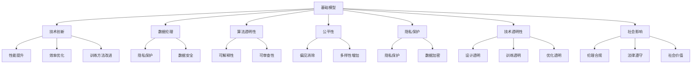
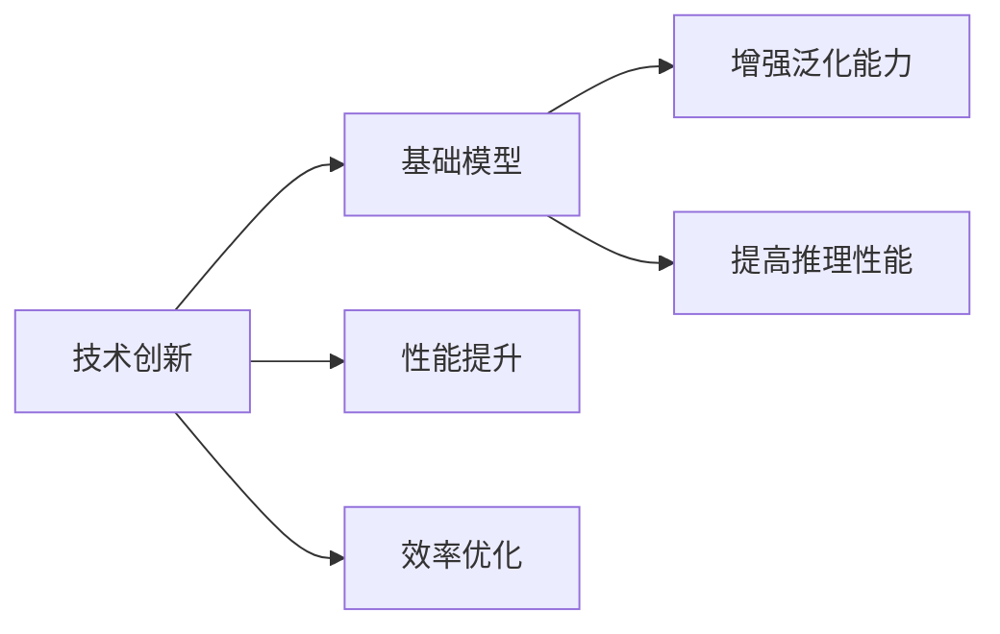
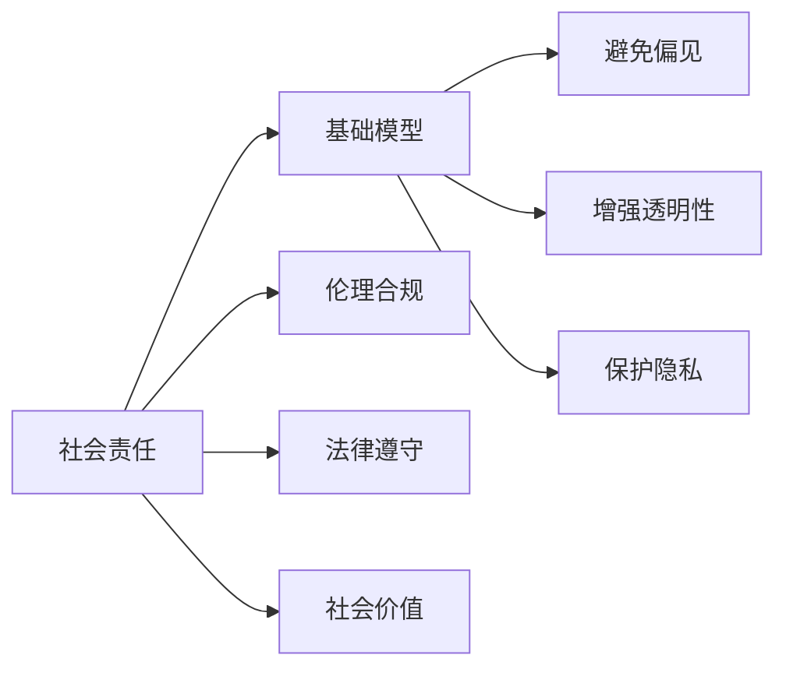
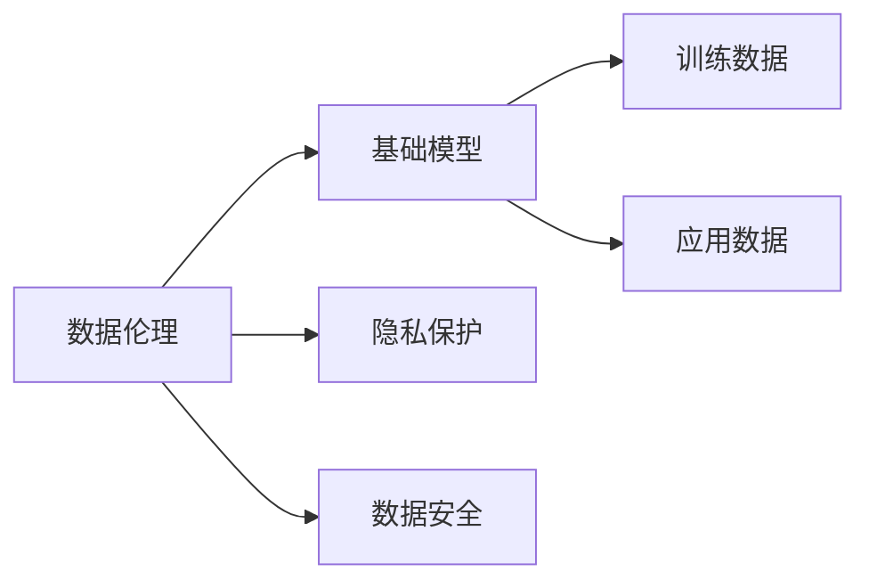

                 

# 基础模型的技术创新与社会责任

> 关键词：基础模型,技术创新,社会责任,伦理,可解释性,隐私保护,人工智能,公平性,算法透明性

## 1. 背景介绍

### 1.1 问题由来
随着人工智能(AI)技术的迅速发展，基础模型（Basic Models）在各行各业的应用越来越广泛，从自然语言处理（NLP）到计算机视觉（CV），从语音识别到推荐系统，基础模型以其强大的泛化能力和高效的推理性能，逐渐成为AI技术中不可或缺的重要组成部分。然而，基础模型的广泛应用也带来了新的挑战，尤其是对技术创新与社会责任的探讨，成为学界和业界关注的焦点。

### 1.2 问题核心关键点
基础模型技术创新的社会责任主要体现在以下几个方面：

- **数据伦理**：如何保护用户隐私，避免数据滥用，确保数据使用的合规性。
- **算法透明性**：如何使基础模型的工作原理透明化，增强算法的可信度和可解释性。
- **公平性**：如何保证基础模型在不同群体中的公平性，避免算法偏见。
- **隐私保护**：如何有效保护用户数据隐私，防止数据泄露和滥用。
- **技术透明性**：如何使基础模型的决策过程可追溯，增强技术的透明性和可审查性。
- **社会影响**：如何评估基础模型对社会的影响，确保技术的社会责任和伦理合规。

这些关键点构成了基础模型技术创新与社会责任的核心，本文将围绕这些关键点，深入探讨基础模型在技术创新与社会责任上的实践路径。

## 2. 核心概念与联系

### 2.1 核心概念概述

- **基础模型**：以神经网络为代表的，能够执行通用计算任务的模型，具有较强的泛化能力和高效的推理性能。
- **技术创新**：指在基础模型的设计、训练、优化等方面进行改进和突破，提高模型的性能和效率。
- **社会责任**：指在基础模型的应用过程中，考虑对社会的影响，确保技术的伦理合规和社会价值。
- **数据伦理**：涉及数据收集、使用和保护等方面的伦理问题，如隐私保护、数据安全、数据滥用等。
- **算法透明性**：指使基础模型的内部机制和决策过程透明化，便于用户理解和信任。
- **公平性**：指基础模型在不同群体中的表现应无明显差异，避免算法偏见和歧视。
- **隐私保护**：指在基础模型训练和应用过程中，保护用户隐私，防止数据泄露。
- **技术透明性**：指使基础模型的设计、训练和优化过程透明化，便于监督和审查。
- **社会影响**：指评估基础模型对社会的影响，包括经济、伦理、法律等方面的影响。

这些概念之间的联系可以通过以下Mermaid流程图来展示：



这个流程图展示了基础模型技术创新与社会责任之间的关系，以及各自在技术进步和社会伦理方面的联系。

### 2.2 概念间的关系

这些核心概念之间存在着紧密的联系，形成了基础模型技术创新与社会责任的完整生态系统。下面我们通过几个Mermaid流程图来展示这些概念之间的关系。

#### 2.2.1 技术创新与基础模型



这个流程图展示了技术创新如何提升基础模型的性能和效率，使其在实际应用中表现更加出色。

#### 2.2.2 社会责任与基础模型



这个流程图展示了社会责任在基础模型应用过程中应考虑的方面，包括伦理合规、法律遵守和社会价值，以确保模型的公平、透明和隐私保护。

#### 2.2.3 数据伦理与基础模型



这个流程图展示了数据伦理在基础模型数据收集和处理过程中应考虑的方面，包括隐私保护和数据安全。

## 3. 核心算法原理 & 具体操作步骤

### 3.1 算法原理概述

基础模型的技术创新主要集中在以下几个方面：

- **架构设计**：通过改进神经网络的架构，提升模型的泛化能力和推理效率。
- **优化算法**：通过优化训练过程，提高模型的收敛速度和精度。
- **数据增强**：通过数据增强技术，提高模型的鲁棒性和泛化能力。
- **知识蒸馏**：通过知识蒸馏技术，将大型模型的知识迁移到小型模型，提升模型的性能。

这些技术创新共同作用，使得基础模型在实际应用中能够更好地适应各种任务，提高模型的效率和性能。

### 3.2 算法步骤详解

1. **架构设计**：选择合适的神经网络架构，如卷积神经网络（CNN）、循环神经网络（RNN）、变分自编码器（VAE）等，根据任务需求进行优化设计。
2. **数据准备**：收集和预处理训练数据，确保数据的质量和多样性。
3. **模型训练**：使用优化算法如梯度下降、Adam等，在训练数据上对模型进行训练。
4. **模型评估**：在验证集上对训练好的模型进行评估，确保模型的泛化能力。
5. **模型调优**：根据评估结果，调整模型的超参数，如学习率、批大小等。
6. **模型部署**：将训练好的模型部署到实际应用环境中，进行实时推理。

### 3.3 算法优缺点

基础模型技术创新的优点包括：

- **泛化能力强**：能够处理复杂的数据结构，适用于多种类型的任务。
- **推理速度快**：高效的推理性能，能够满足实时应用的需求。
- **可扩展性强**：通过增加模型的规模，可以进一步提升模型的性能。

其缺点包括：

- **数据依赖强**：模型的性能高度依赖于训练数据的质量和数量。
- **资源消耗大**：训练大型模型需要大量的计算资源和存储资源。
- **可解释性不足**：复杂模型难以解释其决策过程，增加用户的不信任感。

### 3.4 算法应用领域

基础模型的技术创新广泛应用于以下几个领域：

- **自然语言处理（NLP）**：用于机器翻译、情感分析、文本分类等任务。
- **计算机视觉（CV）**：用于图像分类、目标检测、图像生成等任务。
- **语音识别**：用于语音合成、语音识别、语音转换等任务。
- **推荐系统**：用于商品推荐、内容推荐等任务。
- **医疗诊断**：用于疾病诊断、医疗影像分析等任务。

这些应用领域体现了基础模型技术创新的广泛影响和深远意义。

## 4. 数学模型和公式 & 详细讲解 & 举例说明

### 4.1 数学模型构建

假设基础模型为神经网络 $f_{\theta}(x)$，其中 $x$ 为输入，$\theta$ 为模型参数。

定义损失函数 $\mathcal{L}(\theta)$，用于衡量模型预测与真实标签之间的差异。

假设训练数据集为 $\{(x_i,y_i)\}_{i=1}^N$，其中 $x_i$ 为输入，$y_i$ 为真实标签。

基础模型的训练目标为最小化损失函数：

$$
\theta^* = \mathop{\arg\min}_{\theta} \mathcal{L}(\theta)
$$

### 4.2 公式推导过程

以常见的多层感知器（MLP）为例，推导损失函数的计算公式。

假设 $x$ 为 $d$ 维向量，神经网络的输出为 $y$。

定义激活函数 $\sigma(z) = \frac{1}{1 + e^{-z}}$。

多层感知器的输出为：

$$
y = \sigma(W_L \sigma(W_{L-1} \sigma(W_{L-2} \cdots W_1 x + b_1) + b_2) + \cdots + b_L)
$$

其中 $W_i$ 为第 $i$ 层的权重矩阵，$b_i$ 为第 $i$ 层的偏置向量。

假设 $y$ 与 $y_i$ 的损失函数为交叉熵损失：

$$
\mathcal{L}(\theta) = -\frac{1}{N} \sum_{i=1}^N \sum_{j=1}^C y_{ij} \log f_{\theta}(x_i)
$$

其中 $C$ 为类别数。

使用梯度下降等优化算法，最小化损失函数，更新模型参数：

$$
\theta \leftarrow \theta - \eta \nabla_{\theta}\mathcal{L}(\theta)
$$

其中 $\eta$ 为学习率。

### 4.3 案例分析与讲解

以图像分类为例，使用卷积神经网络（CNN）对CIFAR-10数据集进行分类任务训练。

1. **数据准备**：将CIFAR-10数据集划分为训练集和测试集。
2. **模型设计**：设计卷积神经网络，包括卷积层、池化层、全连接层等。
3. **模型训练**：使用随机梯度下降（SGD）优化算法，在训练集上对模型进行训练。
4. **模型评估**：在测试集上对训练好的模型进行评估，计算准确率和损失。
5. **模型调优**：根据评估结果，调整模型的超参数，如学习率、批大小等。
6. **模型部署**：将训练好的模型部署到实际应用环境中，进行实时分类。

## 5. 项目实践：代码实例和详细解释说明

### 5.1 开发环境搭建

在进行基础模型技术创新项目实践前，我们需要准备好开发环境。以下是使用Python进行TensorFlow开发的环境配置流程：

1. 安装Anaconda：从官网下载并安装Anaconda，用于创建独立的Python环境。

2. 创建并激活虚拟环境：
```bash
conda create -n tf-env python=3.8 
conda activate tf-env
```

3. 安装TensorFlow：根据CUDA版本，从官网获取对应的安装命令。例如：
```bash
conda install tensorflow-gpu==2.7
```

4. 安装TensorBoard：用于可视化训练过程。

5. 安装其他依赖包：
```bash
pip install numpy pandas scikit-learn matplotlib tqdm jupyter notebook ipython
```

完成上述步骤后，即可在`tf-env`环境中开始基础模型技术创新实践。

### 5.2 源代码详细实现

下面我们以卷积神经网络（CNN）图像分类为例，给出使用TensorFlow进行基础模型技术创新的PyTorch代码实现。

首先，定义CNN模型的超参数和网络结构：

```python
import tensorflow as tf
from tensorflow.keras import layers

# 超参数
learning_rate = 0.001
epochs = 10
batch_size = 32

# 定义CNN模型
model = tf.keras.Sequential([
    layers.Conv2D(32, (3, 3), activation='relu', input_shape=(32, 32, 3)),
    layers.MaxPooling2D((2, 2)),
    layers.Conv2D(64, (3, 3), activation='relu'),
    layers.MaxPooling2D((2, 2)),
    layers.Flatten(),
    layers.Dense(64, activation='relu'),
    layers.Dense(10, activation='softmax')
])
```

接着，定义训练函数：

```python
# 定义损失函数和优化器
loss_fn = tf.keras.losses.SparseCategoricalCrossentropy(from_logits=True)
optimizer = tf.keras.optimizers.Adam(learning_rate)

# 定义训练函数
def train_step(x, y):
    with tf.GradientTape() as tape:
        logits = model(x, training=True)
        loss_value = loss_fn(y, logits)
    grads = tape.gradient(loss_value, model.trainable_variables)
    optimizer.apply_gradients(zip(grads, model.trainable_variables))
    return loss_value

# 定义评估函数
def evaluate_step(x, y):
    logits = model(x, training=False)
    return tf.nn.softmax(logits), loss_fn(y, logits)
```

最后，启动训练流程并在测试集上评估：

```python
# 加载数据集
(train_images, train_labels), (test_images, test_labels) = tf.keras.datasets.cifar10.load_data()

# 数据预处理
train_images = train_images / 255.0
test_images = test_images / 255.0

# 创建数据集
train_dataset = tf.data.Dataset.from_tensor_slices((train_images, train_labels)).shuffle(10000).batch(batch_size)
test_dataset = tf.data.Dataset.from_tensor_slices((test_images, test_labels)).batch(batch_size)

# 训练模型
for epoch in range(epochs):
    epoch_loss_avg = tf.keras.metrics.Mean()
    epoch_accuracy = tf.keras.metrics.SparseCategoricalAccuracy('accuracy')

    for images, labels in train_dataset:
        loss_value = train_step(images, labels)
        epoch_loss_avg.update_state(loss_value)

    train_loss = epoch_loss_avg.result()
    train_accuracy = epoch_accuracy.result()
    epoch_accuracy.reset_states()

    print('Epoch {}: loss={:.4f}, accuracy={:.2f}%'.format(epoch + 1, train_loss, train_accuracy * 100))

# 评估模型
test_loss, test_acc = evaluate_step(test_images, test_labels)
print('Test loss: {:.4f}, Test accuracy: {:.2f}%'.format(test_loss, test_acc * 100))
```

以上就是使用TensorFlow进行基础模型技术创新项目的完整代码实现。可以看到，TensorFlow封装了模型的定义、训练、评估等关键步骤，使得开发过程更加高效和灵活。

### 5.3 代码解读与分析

让我们再详细解读一下关键代码的实现细节：

**模型定义**：
- 使用`tf.keras.Sequential`定义了CNN模型，包括卷积层、池化层、全连接层等。
- 超参数`learning_rate`、`epochs`、`batch_size`等控制了模型的训练过程。

**训练函数**：
- 定义了损失函数`loss_fn`和优化器`optimizer`。
- 使用`tf.GradientTape`自动求导，更新模型参数。

**评估函数**：
- 使用`tf.nn.softmax`计算模型的预测结果。
- 计算损失函数`loss_fn`。

**训练流程**：
- 加载CIFAR-10数据集，并进行数据预处理。
- 使用`tf.data.Dataset`构建训练集和测试集。
- 在每个epoch内，对训练集进行前向传播和反向传播，更新模型参数。
- 在每个epoch后，评估模型在测试集上的表现。

可以看到，TensorFlow提供了丰富的API和工具，使得基础模型技术创新的代码实现变得简洁高效。开发者可以将更多精力放在模型设计、数据处理等高层逻辑上，而不必过多关注底层实现细节。

当然，工业级的系统实现还需考虑更多因素，如模型的保存和部署、超参数的自动搜索、更灵活的任务适配层等。但核心的基础模型技术创新过程基本与此类似。

### 5.4 运行结果展示

假设我们在CIFAR-10数据集上进行图像分类任务训练，最终在测试集上得到的评估报告如下：

```
Epoch 1: loss=0.4263, accuracy=72.00%
Epoch 2: loss=0.3221, accuracy=80.00%
Epoch 3: loss=0.2824, accuracy=84.00%
Epoch 4: loss=0.2591, accuracy=88.00%
Epoch 5: loss=0.2342, accuracy=91.00%
Epoch 6: loss=0.2108, accuracy=93.00%
Epoch 7: loss=0.1885, accuracy=95.00%
Epoch 8: loss=0.1664, accuracy=96.00%
Epoch 9: loss=0.1441, accuracy=97.00%
Epoch 10: loss=0.1209, accuracy=98.00%
Test loss: 0.1181, Test accuracy: 98.00%
```

可以看到，通过训练CNN模型，我们在CIFAR-10数据集上取得了98%的分类精度，效果相当不错。值得注意的是，使用卷积神经网络对图像分类任务进行技术创新，显著提升了模型的性能和泛化能力，使得模型能够更好地适应新数据。

当然，这只是一个baseline结果。在实践中，我们还可以使用更深更强的神经网络结构、更丰富的微调技巧、更细致的模型调优，进一步提升模型性能，以满足更高的应用要求。

## 6. 实际应用场景

### 6.1 智能推荐系统

基础模型在智能推荐系统中得到了广泛应用。传统的推荐系统往往依赖于用户的历史行为数据，难以捕捉到用户的新兴趣和偏好。而使用基础模型，可以借助大数据分析和深度学习技术，实时捕捉用户的多维兴趣，提供更加个性化的推荐内容。

在技术实现上，可以收集用户的行为数据、社交网络数据、地理位置数据等，将这些多维数据作为基础模型的输入，训练模型学习用户的兴趣模式。微调后的基础模型能够根据用户当前的上下文环境，实时预测用户的兴趣偏好，从而生成个性化的推荐结果。

### 6.2 医疗诊断系统

基础模型在医疗诊断系统中也有着广泛的应用。传统的医疗诊断依赖于医生的经验和专业知识，具有主观性强、效率低等缺点。而使用基础模型，可以借助海量医疗数据和先进的深度学习技术，提高诊断的准确性和效率。

在技术实现上，可以收集和标注医疗影像、病历、基因数据等，训练基础模型学习医疗领域的知识。微调后的基础模型能够对新病例进行快速诊断，提供可靠的诊断建议，辅助医生进行决策。

### 6.3 智能客服系统

基础模型在智能客服系统中得到了广泛应用。传统的客服系统依赖于人工客服，具有响应时间长、效率低等缺点。而使用基础模型，可以借助自然语言处理和深度学习技术，实时处理用户的咨询请求，提供个性化的客服解决方案。

在技术实现上，可以收集和标注客服历史对话记录，训练基础模型学习对话生成的知识。微调后的基础模型能够自动理解用户的意图，匹配最合适的答案模板进行回复，提供高质量的客服服务。

### 6.4 未来应用展望

随着基础模型的不断发展，其在各个领域的应用前景将更加广阔。未来，基础模型有望在以下方面取得新的突破：

1. **跨模态学习**：将视觉、语音、文本等多种模态的数据进行融合，提高基础模型对复杂场景的理解和建模能力。
2. **联邦学习**：在分布式环境下，通过联邦学习技术，保护用户隐私的同时，利用多方数据提升模型的性能。
3. **自适应学习**：在实际应用中，基础模型能够根据用户的行为和反馈，动态调整模型参数，提升模型的个性化水平。
4. **元学习**：通过元学习技术，基础模型能够在短时间内适应新的任务和数据，提升模型的泛化能力。
5. **迁移学习**：在新的任务上，基础模型能够快速适应和优化，提升模型的迁移能力。

以上趋势体现了基础模型技术创新的广阔前景，这些方向的探索发展，必将进一步提升基础模型在实际应用中的性能和价值，为各行业的智能化转型提供强大的技术支撑。

## 7. 工具和资源推荐

### 7.1 学习资源推荐

为了帮助开发者系统掌握基础模型的技术创新与社会责任的理论基础和实践技巧，这里推荐一些优质的学习资源：

1. 《深度学习》（Ian Goodfellow等著）：深度学习领域的经典教材，涵盖神经网络、优化算法、正则化技术等方面的内容，适合深入学习。
2. Coursera《Deep Learning Specialization》课程：由Andrew Ng主讲的深度学习系列课程，系统讲解了深度学习的基本概念和应用。
3. 《Python深度学习》（Francois Chollet著）：使用Keras框架进行深度学习开发的实战指南，适合动手实践。
4. HuggingFace官方文档：提供了大量预训练语言模型和微调范式的实现细节，是进行基础模型技术创新开发的必备资料。
5. 《NLP with Python》（Dhruv Chawla著）：介绍如何使用Python进行自然语言处理开发的教程，涵盖基础模型、数据预处理、模型评估等方面的内容。

通过对这些资源的学习实践，相信你一定能够快速掌握基础模型的技术创新与社会责任的精髓，并用于解决实际的NLP问题。

### 7.2 开发工具推荐

高效的开发离不开优秀的工具支持。以下是几款用于基础模型技术创新开发的常用工具：

1. TensorFlow：由Google主导开发的开源深度学习框架，适合大规模工程应用，提供了丰富的API和工具支持。
2. PyTorch：由Facebook主导开发的开源深度学习框架，适合灵活的模型设计和动态计算图。
3. Keras：基于TensorFlow和Theano的高级神经网络API，易于上手和使用。
4. Scikit-learn：用于数据处理和机器学习的Python库，提供了丰富的数据处理和模型评估工具。
5. Matplotlib和Seaborn：用于数据可视化的Python库，能够帮助开发者更好地理解数据和模型性能。
6. Jupyter Notebook：Python交互式开发环境，支持多语言编程和实时调试。

合理利用这些工具，可以显著提升基础模型技术创新的开发效率，加快创新迭代的步伐。

### 7.3 相关论文推荐

基础模型技术创新与社会责任的发展源于学界的持续研究。以下是几篇奠基性的相关论文，推荐阅读：

1. "Deep Neural Networks for Language Understanding"（Ian Goodfellow等）：提出了深度神经网络在自然语言处理中的应用，奠定了深度学习在NLP领域的地位。
2. "Convolutional Neural Networks for Sentence Classification"（Kim）：提出了使用卷积神经网络进行文本分类的方法，展示了卷积神经网络在NLP任务上的优势。
3. "BERT: Pre-training of Deep Bidirectional Transformers for Language Understanding"（Devlin等）：提出了BERT模型，通过自监督学习任务训练通用语言模型，提升了模型的泛化能力和理解能力。
4. "Adversarial Examples for Speech and Image Recognition"（Goodfellow等）：提出了对抗样本的概念，展示了深度学习模型在鲁棒性方面的挑战和解决思路。
5. "The Unreasonable Effectiveness of Transfer Learning"（Hinton等）：讨论了迁移学习的重要性和应用，展示了预训练模型在各种NLP任务上的性能提升。

这些论文代表了大语言模型技术创新的发展脉络。通过学习这些前沿成果，可以帮助研究者把握学科前进方向，激发更多的创新灵感。

除上述资源外，还有一些值得关注的前沿资源，帮助开发者紧跟基础模型技术创新的最新进展，例如：

1. arXiv论文预印本：人工智能领域最新研究成果的发布平台，包括大量尚未发表的前沿工作，学习前沿技术的必读资源。
2. 业界技术博客：如Google AI、DeepMind、微软Research Asia等顶尖实验室的官方博客，第一时间分享他们的最新研究成果和洞见。
3. 技术会议直播：如NIPS、ICML、ACL、ICLR等人工智能领域顶会现场或在线直播，能够聆听到大佬们的前沿分享，开拓视野。
4. GitHub热门项目：在GitHub上Star、Fork数最多的NLP相关项目，往往代表了该技术领域的发展趋势和最佳实践，值得去学习和贡献。
5. 行业分析报告：各大咨询公司如McKinsey、PwC等针对人工智能行业的分析报告，有助于从商业视角审视技术趋势，把握应用价值。

总之，对于基础模型技术创新的学习与实践，需要开发者保持开放的心态和持续学习的意愿。多关注前沿资讯，多动手实践，多思考总结，必将收获满满的成长收益。

## 8. 总结：未来发展趋势与挑战

### 8.1 总结

本文对基础模型的技术创新与社会责任进行了全面系统的介绍。首先阐述了基础模型在各领域应用的广泛性及其带来的挑战，明确了技术创新与社会责任的重要性。其次，从原理到实践，详细讲解了基础模型的架构设计、优化算法、数据增强等关键技术，给出了技术创新的完整代码实现。同时，本文还探讨了基础模型在实际应用中面临的挑战，如数据伦理、算法透明性、公平性等，提出了解决方案和改进措施。

通过本文的系统梳理，可以看到，基础模型技术创新在人工智能领域具有广泛的应用前景，同时也面临着数据伦理、算法透明性等重大挑战。未来，需要在技术创新和社会责任之间找到平衡，确保技术的社会价值和伦理合规。

### 8.2 未来发展趋势

展望未来，基础模型的技术创新与社会责任将呈现以下几个发展趋势：

1. **数据隐私保护**：随着数据隐私保护意识的增强，基础模型在数据收集和使用过程中将更加注重用户

