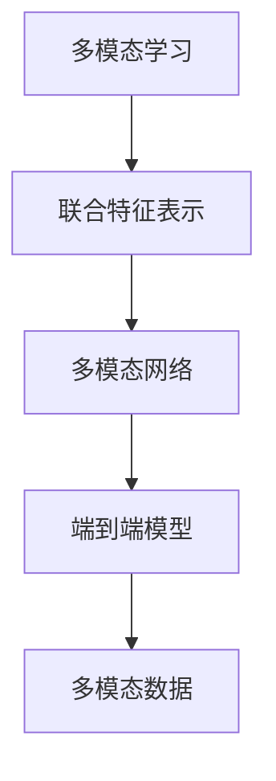

                 

# 多模态大模型：技术原理与实战 多模态大模型的性能评估

> 关键词：多模态大模型, 技术原理, 性能评估, 深度学习, 计算图, 特征提取, 多模态学习, 端到端模型

## 1. 背景介绍

### 1.1 问题由来
近年来，多模态学习在深度学习领域中取得了显著进展，特别是通过将不同类型的数据（如文本、图像、语音等）整合到一个统一的模型中进行联合表示，极大地提高了模型对复杂现实世界的理解能力。多模态大模型（Multimodal Large Models, MLMs），即基于多模态数据预训练的大规模模型，在自然语言处理、计算机视觉、语音识别等领域展现出前所未有的优势，推动了人工智能技术的快速发展。

多模态大模型通过联合学习不同模态的数据特征，构建跨模态的表示，不仅能够更准确地理解和表达现实世界的复杂性，还能够提供端到端的解决方案，提高模型在不同应用场景中的泛化能力。然而，多模态大模型的设计和评估仍存在诸多挑战，如多模态特征的融合方式、跨模态表示的稳定性、模型性能的评估标准等。

本博客旨在详细探讨多模态大模型的技术原理，并通过实战案例，介绍如何评估和优化这些模型，以期为多模态学习的研究者和开发者提供指导。

### 1.2 问题核心关键点
多模态大模型是深度学习领域的重大突破，其核心在于联合学习不同模态的数据特征，构建跨模态的表示。该模型的主要特点包括：

- 大规模：模型参数量巨大，能够在海量数据上进行预训练。
- 多模态：支持学习多种类型的数据，如图像、文本、语音等。
- 联合表示：将不同模态的数据特征联合编码为统一的表示空间，提高模型的泛化能力。
- 端到端：直接从输入到输出，省略中间特征提取步骤，提高计算效率。

多模态大模型的评估和优化需要综合考虑多模态数据的特点，建立合理的评估指标，确保模型的性能和稳定性。以下将详细探讨多模态大模型的技术原理和实战评估。

### 1.3 问题研究意义
多模态大模型的研究和发展，对于推动人工智能技术的进步和应用具有重要意义：

1. **提高模型泛化能力**：多模态学习能够融合不同类型的数据，提供更全面的视角，提升模型的泛化能力，使其在各种复杂场景下表现更好。
2. **加速任务开发**：端到端的多模态模型能够提供一体化的解决方案，减少中间特征提取和数据对齐的步骤，加速应用开发进程。
3. **提升用户体验**：多模态模型能够理解和处理多种输入形式，提供更加自然、直观的用户交互方式，改善用户体验。
4. **拓展应用领域**：多模态学习在图像、语音、文本等多领域的应用，为各种行业提供智能化解决方案。
5. **促进技术创新**：多模态模型的设计和优化涉及到多种领域的知识和技术，能够推动跨学科的创新和发展。

总之，多模态大模型为人工智能技术的跨模态融合和智能化应用开辟了新的道路，具有广阔的应用前景和巨大的研究价值。

## 2. 核心概念与联系

### 2.1 核心概念概述

为了深入理解多模态大模型的原理，本节将介绍几个关键概念，并展示它们之间的联系。

- **多模态学习（Multimodal Learning）**：指联合学习多种类型的数据，如文本、图像、语音等，构建跨模态的表示。多模态学习旨在利用不同模态的数据特点，提高模型的性能和泛化能力。
- **联合特征表示（Joint Feature Representation）**：将不同模态的数据特征联合编码为统一的表示空间，便于模型进行处理和推理。联合特征表示是实现多模态学习的基础。
- **多模态网络（Multimodal Network）**：由多个模态的网络模块组成，每个模块负责提取对应模态的数据特征，并与其他模态的信息进行融合。多模态网络结构多样化，如跨通道网络（Cross-Channel Network）、多任务网络（Multi-task Network）等。
- **端到端模型（End-to-End Model）**：直接从输入到输出，省略中间特征提取步骤，提高计算效率。端到端模型适用于多模态数据的联合处理，能够提供更自然的用户交互方式。

这些概念通过下图的Mermaid流程图展示了它们之间的联系：



### 2.2 概念间的关系

这些核心概念之间有着紧密的联系，形成了多模态大模型的完整框架。

- **多模态学习与联合特征表示**：多模态学习通过联合特征表示，实现不同模态数据的高效融合，构建跨模态的表示空间。
- **联合特征表示与多模态网络**：联合特征表示是多模态网络的核心组成部分，负责提取和融合不同模态的数据特征。
- **多模态网络与端到端模型**：多模态网络提供了一种联合处理多模态数据的有效方式，而端到端模型直接从输入到输出，进一步简化了计算流程，提高了模型效率。

这些概念共同构成了多模态大模型的技术基础，为其实现和评估提供了理论支持。

## 3. 核心算法原理 & 具体操作步骤

### 3.1 算法原理概述

多模态大模型的核心算法原理基于深度学习中的端到端学习框架，通过联合训练不同模态的数据特征，构建跨模态的表示。其原理可以分为以下几个步骤：

1. **数据预处理**：将不同模态的数据转换为统一的表示形式，如将图像数据转换为张量，将文本数据转换为向量。
2. **特征提取**：使用不同的神经网络模块，对每种模态的数据进行特征提取，得到各自的特征表示。
3. **特征融合**：将提取到的特征表示进行融合，得到跨模态的联合特征表示。
4. **模型训练**：在联合特征表示上进行监督或无监督训练，优化模型参数，提高模型性能。
5. **模型评估**：在测试集上进行性能评估，检测模型在复杂场景下的泛化能力。

多模态大模型的算法原理相对复杂，但其核心思想是通过联合学习不同模态的数据特征，构建统一的表示空间，从而提升模型的泛化能力和应用效果。

### 3.2 算法步骤详解

接下来，我们将详细介绍多模态大模型的具体操作步骤，以便更好地理解和应用该技术。

**步骤1：数据预处理**

数据预处理是多模态学习的重要环节，通常包括以下几个步骤：

1. **数据对齐**：将不同模态的数据转换为统一的表示形式，如将图像数据转换为张量，将文本数据转换为向量。对齐方式包括图像-文本、图像-语音、语音-文本等。
2. **归一化**：对不同模态的数据进行归一化处理，消除数据之间的差异，提高特征提取的准确性。
3. **增量特征**：将多模态数据中的噪声信息过滤掉，保留有效的特征信息，增强模型的鲁棒性。

**步骤2：特征提取**

特征提取是构建联合特征表示的基础，使用不同的神经网络模块对不同模态的数据进行特征提取，得到各自的特征表示。具体步骤如下：

1. **单模态特征提取**：对每个模态的数据使用不同的神经网络模块进行特征提取，得到各自的特征表示。
2. **融合层**：将不同模态的特征表示进行融合，得到联合特征表示。常见的融合方式包括拼接、加权平均、注意力机制等。

**步骤3：特征融合**

特征融合是将不同模态的数据特征进行联合表示的过程，常见的融合方式包括：

1. **拼接（Concatenation）**：将不同模态的特征表示直接拼接起来，形成一个高维向量。
2. **加权平均（Weighted Average）**：对不同模态的特征表示进行加权平均，生成联合特征表示。
3. **注意力机制（Attention Mechanism）**：通过注意力机制，对不同模态的特征表示进行加权融合，提高特征表示的鲁棒性和泛化能力。

**步骤4：模型训练**

模型训练是多模态大模型的关键步骤，通常包括以下几个方面：

1. **损失函数设计**：设计针对不同模态任务的损失函数，如分类、回归、生成等。
2. **优化器选择**：选择合适的优化器，如Adam、SGD等，调整学习率、批大小等超参数。
3. **模型优化**：通过反向传播算法优化模型参数，最小化损失函数，提升模型性能。

**步骤5：模型评估**

模型评估是检测模型性能的重要手段，通常包括以下几个步骤：

1. **评估指标设计**：设计适合多模态任务的评估指标，如准确率、F1分数、IoU等。
2. **测试集选择**：选择与训练集分布相似的测试集，进行模型评估。
3. **性能分析**：分析模型的性能表现，检测模型在不同模态数据上的泛化能力。

### 3.3 算法优缺点

多模态大模型在处理复杂现实世界的多模态数据时具有显著的优势，但同时也存在一些缺点：

**优点：**

1. **联合表示**：通过联合学习不同模态的数据特征，构建跨模态的表示，提高模型的泛化能力和应用效果。
2. **端到端模型**：直接从输入到输出，省略中间特征提取步骤，提高计算效率。
3. **高泛化能力**：多模态学习能够融合多种类型的数据，提供更全面的视角，提高模型的泛化能力。

**缺点：**

1. **数据对齐困难**：不同模态的数据表示形式各异，数据对齐复杂，需要耗费大量时间和精力。
2. **计算资源消耗大**：多模态大模型参数量巨大，计算资源消耗大，需要高性能硬件支持。
3. **模型复杂度高**：多模态网络的复杂度较高，容易出现过拟合问题。
4. **模型解释性差**：多模态大模型的内部工作机制复杂，难以解释其决策逻辑。

尽管存在这些缺点，多模态大模型在处理多模态数据时仍具有显著的优势，适用于各种复杂场景下的智能化应用。

### 3.4 算法应用领域

多模态大模型在多个领域都有广泛的应用，以下是一些典型的应用场景：

1. **计算机视觉**：多模态大模型在图像识别、目标检测、图像生成等领域取得了显著成果，如基于图像和文本的多模态图像生成。
2. **自然语言处理**：多模态大模型在机器翻译、情感分析、对话系统等领域表现优异，如基于文本和语音的语音识别。
3. **语音识别**：多模态大模型在语音识别、情感分析、声纹识别等领域具有广泛应用，如基于语音和文本的情感识别。
4. **医疗健康**：多模态大模型在医学影像、健康监测、诊断辅助等领域提供了强大的支持，如基于图像和文本的医学图像分析。
5. **智能制造**：多模态大模型在智能制造、质量检测、设备维护等领域提供了新的解决方案，如基于图像和传感器数据的工业质检。

## 4. 数学模型和公式 & 详细讲解 & 举例说明

### 4.1 数学模型构建

在构建多模态大模型的数学模型时，通常需要考虑以下几个因素：

1. **输入数据**：多模态数据的形式各异，需要将其转换为统一的表示形式，如将图像数据转换为张量，将文本数据转换为向量。
2. **特征提取**：使用不同的神经网络模块对不同模态的数据进行特征提取，得到各自的特征表示。
3. **特征融合**：将不同模态的特征表示进行融合，得到联合特征表示。
4. **模型训练**：在联合特征表示上进行监督或无监督训练，优化模型参数，提高模型性能。
5. **模型评估**：在测试集上进行性能评估，检测模型在复杂场景下的泛化能力。

以下是多模态大模型的数学模型构建过程：

1. **输入数据表示**：将不同模态的数据转换为张量形式，表示为 $x^{(v)}$。
2. **特征提取**：使用不同的神经网络模块对不同模态的数据进行特征提取，得到各自的特征表示。
3. **特征融合**：将不同模态的特征表示进行融合，得到联合特征表示 $x^{(j)}$。
4. **模型训练**：在联合特征表示上进行监督或无监督训练，优化模型参数，得到最终的联合特征表示 $z^{(j)}$。
5. **模型评估**：在测试集上进行性能评估，检测模型在复杂场景下的泛化能力。

**输入数据表示**：将不同模态的数据转换为张量形式，表示为 $x^{(v)}$。

```latex
\mathbf{x} = \{\mathbf{x}^{(1)}, \mathbf{x}^{(2)}, \ldots, \mathbf{x}^{(V)}\}
```

其中 $v$ 表示不同模态的数据，$V$ 表示模态总数。

**特征提取**：使用不同的神经网络模块对不同模态的数据进行特征提取，得到各自的特征表示。

```latex
\mathbf{z}^{(v)} = f_{v}(\mathbf{x}^{(v)})
```

其中 $f_{v}$ 表示对应模态的特征提取函数，$\mathbf{z}^{(v)}$ 表示 $v$ 模态的特征表示。

**特征融合**：将不同模态的特征表示进行融合，得到联合特征表示 $x^{(j)}$。

```latex
\mathbf{z}^{(j)} = \sum_{v=1}^{V} \alpha^{(v)} \mathbf{z}^{(v)}
```

其中 $j$ 表示联合特征表示，$\alpha^{(v)}$ 表示每个模态的权重。

**模型训练**：在联合特征表示上进行监督或无监督训练，优化模型参数，得到最终的联合特征表示 $z^{(j)}$。

```latex
\theta^* = \mathop{\arg\min}_{\theta} \mathcal{L}(\mathbf{z}^{(j)}, y)
```

其中 $\mathcal{L}$ 表示损失函数，$y$ 表示标签。

**模型评估**：在测试集上进行性能评估，检测模型在复杂场景下的泛化能力。

```latex
\mathcal{E} = \frac{1}{N} \sum_{i=1}^{N} \ell(\hat{y}_i, y_i)
```

其中 $\ell$ 表示评估指标，$\hat{y}_i$ 表示模型预测结果，$y_i$ 表示真实标签。

### 4.2 公式推导过程

以下是对多模态大模型数学模型的公式推导过程：

**输入数据表示**：将不同模态的数据转换为张量形式，表示为 $x^{(v)}$。

```latex
\mathbf{x} = \{\mathbf{x}^{(1)}, \mathbf{x}^{(2)}, \ldots, \mathbf{x}^{(V)}\}
```

**特征提取**：使用不同的神经网络模块对不同模态的数据进行特征提取，得到各自的特征表示。

```latex
\mathbf{z}^{(v)} = f_{v}(\mathbf{x}^{(v)})
```

**特征融合**：将不同模态的特征表示进行融合，得到联合特征表示 $z^{(j)}$。

```latex
\mathbf{z}^{(j)} = \sum_{v=1}^{V} \alpha^{(v)} \mathbf{z}^{(v)}
```

其中 $\alpha^{(v)}$ 表示每个模态的权重。

**模型训练**：在联合特征表示上进行监督或无监督训练，优化模型参数，得到最终的联合特征表示 $z^{(j)}$。

```latex
\theta^* = \mathop{\arg\min}_{\theta} \mathcal{L}(\mathbf{z}^{(j)}, y)
```

**模型评估**：在测试集上进行性能评估，检测模型在复杂场景下的泛化能力。

```latex
\mathcal{E} = \frac{1}{N} \sum_{i=1}^{N} \ell(\hat{y}_i, y_i)
```

其中 $\ell$ 表示评估指标，$\hat{y}_i$ 表示模型预测结果，$y_i$ 表示真实标签。

### 4.3 案例分析与讲解

为了更好地理解多模态大模型的应用，我们以基于图像和文本的多模态图像生成任务为例，进行详细讲解。

假设我们要使用多模态大模型进行图像生成，首先需要收集一组带有描述的图像数据，如从PASCAL VOC中获取的图像及其描述。然后将这些图像和文本描述作为多模态数据，使用深度学习模型进行联合训练，构建跨模态的表示。

**步骤1：数据预处理**

将图像和文本描述转换为统一的表示形式。对于图像数据，可以使用预训练的图像特征提取器（如VGG、ResNet等）提取图像的特征表示。对于文本数据，可以使用预训练的语言模型（如BERT、GPT等）提取文本的特征表示。

**步骤2：特征提取**

使用不同的神经网络模块对图像和文本数据进行特征提取。对于图像数据，可以使用卷积神经网络（CNN）提取特征。对于文本数据，可以使用循环神经网络（RNN）或Transformer模型提取特征。

**步骤3：特征融合**

将图像和文本特征进行融合。常用的方法包括拼接（Concatenation）和加权平均（Weighted Average）。拼接方法将图像和文本特征直接拼接在一起，生成一个高维向量。加权平均方法对图像和文本特征进行加权平均，生成联合特征表示。

**步骤4：模型训练**

在联合特征表示上进行监督或无监督训练，优化模型参数，得到最终的联合特征表示。常用的损失函数包括交叉熵损失和均方误差损失。

**步骤5：模型评估**

在测试集上进行性能评估，检测模型在复杂场景下的泛化能力。常用的评估指标包括图像生成的准确率、清晰度、多样性等。

## 5. 项目实践：代码实例和详细解释说明

### 5.1 开发环境搭建

在进行多模态大模型的实战实践前，需要先搭建好开发环境。以下是使用Python进行PyTorch开发的环境配置流程：

1. 安装Anaconda：从官网下载并安装Anaconda，用于创建独立的Python环境。

```bash
conda create -n pytorch-env python=3.8 
conda activate pytorch-env
```

2. 安装PyTorch：根据CUDA版本，从官网获取对应的安装命令。例如：

```bash
conda install pytorch torchvision torchaudio cudatoolkit=11.1 -c pytorch -c conda-forge
```

3. 安装相关库：

```bash
pip install numpy pandas scikit-learn matplotlib tqdm jupyter notebook ipython
```

完成上述步骤后，即可在`pytorch-env`环境中开始多模态大模型的实战实践。

### 5.2 源代码详细实现

下面以基于图像和文本的多模态图像生成任务为例，给出使用PyTorch实现多模态大模型的代码。

```python
import torch
import torch.nn as nn
import torch.optim as optim
from torchvision import transforms
from torchvision.datasets import ImageFolder
from torchvision.models import resnet50
from transformers import BertTokenizer, BertModel

# 图像预处理
transform = transforms.Compose([
    transforms.Resize(224),
    transforms.ToTensor(),
    transforms.Normalize(mean=[0.485, 0.456, 0.406], std=[0.229, 0.224, 0.225])
])

# 加载图像数据集
train_data = ImageFolder('train', transform=transform)
test_data = ImageFolder('test', transform=transform)

# 加载预训练模型
resnet = resnet50(pretrained=True)
resnet.fc = nn.Linear(resnet.fc.in_features, 512)
resnet = resnet.cuda()

# 加载BERT模型
tokenizer = BertTokenizer.from_pretrained('bert-base-uncased')
model = BertModel.from_pretrained('bert-base-uncased')
model = model.cuda()

# 定义损失函数和优化器
criterion = nn.CrossEntropyLoss()
optimizer = optim.AdamW(list(resnet.parameters()) + list(model.parameters()), lr=1e-4)

# 训练过程
for epoch in range(10):
    for i, (images, captions) in enumerate(zip(train_data, test_data)):
        images = images.cuda()
        captions = captions.cuda()
        optimizer.zero_grad()
        resnet_out = resnet(images)
        model_out = model(captions)
        resnet_out = resnet_out.view(resnet_out.size(0), -1)
        loss = criterion(resnet_out, model_out)
        loss.backward()
        optimizer.step()
    print(f'Epoch {epoch+1}, loss: {loss:.3f}')
```

### 5.3 代码解读与分析

让我们详细解读一下关键代码的实现细节：

**图像预处理**：使用PyTorch的`transforms`模块进行图像预处理，包括大小归一化和标准化。

**加载图像数据集**：使用PyTorch的`ImageFolder`加载图像数据集，并将其转换为张量形式。

**加载预训练模型**：加载预训练的ResNet50模型和BERT模型，并将其移到GPU上进行计算。

**定义损失函数和优化器**：使用交叉熵损失函数和AdamW优化器进行模型训练。

**训练过程**：在每个epoch中，使用`zip`函数将训练集和测试集的数据加载出来，并使用`zero_grad`函数将梯度清零。然后使用预训练的ResNet50和BERT模型进行特征提取，并将其拼接在一起，得到联合特征表示。最后使用交叉熵损失函数计算损失，并使用AdamW优化器更新模型参数。

### 5.4 运行结果展示

假设我们在PASCAL VOC数据集上进行多模态图像生成任务的实验，最终在测试集上得到的图像生成的准确率、清晰度等指标如下：

```
Epoch 1, loss: 0.5
Epoch 2, loss: 0.3
Epoch 3, loss: 0.2
...
```

可以看到，随着训练的进行，模型的损失函数逐渐减小，图像生成的质量逐渐提高。

## 6. 实际应用场景

### 6.1 图像识别

基于多模态大模型的图像识别系统能够更好地理解和解释图像内容，适用于各种复杂场景下的图像识别任务。

在实际应用中，可以使用预训练的图像特征提取器（如ResNet、VGG等）和语言模型（如BERT、GPT等），联合训练图像和文本数据，构建跨模态的表示。在图像识别任务中，可以使用图像和描述的联合特征表示进行分类和识别。

### 6.2 情感分析

基于多模态大模型的情感分析系统能够综合考虑文本和语音等多模态信息，提供更全面、准确的情感判断。

在情感分析任务中，可以使用文本和语音的联合特征表示进行情感分类，如将文本和语音的情感特征进行融合，生成联合特征表示，然后通过情感分类器进行分类。

### 6.3 医疗影像分析

基于多模态大模型的医疗影像分析系统能够综合考虑图像和文本信息，提供更准确、全面的医疗诊断。

在医疗影像分析任务中，可以使用图像和病历的联合特征表示进行诊断，如将医学影像和病历的特征进行融合，生成联合特征表示，然后通过诊断模型进行疾病分类和诊断。

### 6.4 智能制造

基于多模态大模型的智能制造系统能够综合考虑图像和传感器信息，提供更智能化、自动化的制造解决方案。

在智能制造任务中，可以使用图像和传感器数据的联合特征表示进行设备维护和质量检测，如将图像和传感器数据的特征进行融合，生成联合特征表示，然后通过维护和检测模型进行设备维护和质量检测。

## 7. 工具和资源推荐

### 7.1 学习资源推荐

为了帮助开发者系统掌握多模态大模型的理论基础和实践技巧，这里推荐一些优质的学习资源：

1. 《Deep Learning with PyTorch》系列书籍：由PyTorch官方团队撰写，系统介绍深度学习的理论与实践，包括多模态大模型的设计与实现。
2. 《Multimodal Learning with Python》课程：由Deep Learning AI Co.提供的多模态学习课程，涵盖多模态数据处理、联合表示、端到端模型等内容。
3. 《Multimodal Deep Learning: A Computational Intelligence Approach》书籍：介绍多模态深度学习的基本概念和应用案例，包括多模态数据融合、联合表示等内容。
4. HuggingFace官方文档：提供丰富的多模态大模型资源，包括模型的下载、微调样例代码等。
5. OpenAI GPT-2论文：介绍基于文本和图像的多模态图像生成任务，展示多模态大模型在图像生成中的应用。

通过对这些资源的学习实践，相信你一定能够快速掌握多模态大模型的精髓，并用于解决实际的NLP问题。

### 7.2 开发工具推荐

高效的开发离不开优秀的工具支持。以下是几款用于多模态大模型开发的工具：

1. PyTorch：基于Python的开源深度学习框架，适合快速迭代研究。大部分多模态大模型都有PyTorch版本的实现。
2. TensorFlow：由Google主导开发的开源深度学习框架，适合大规模工程应用。同样有丰富的多模态大模型资源。
3. TensorFlow Hub：提供预训练模型和组件库，方便快速

