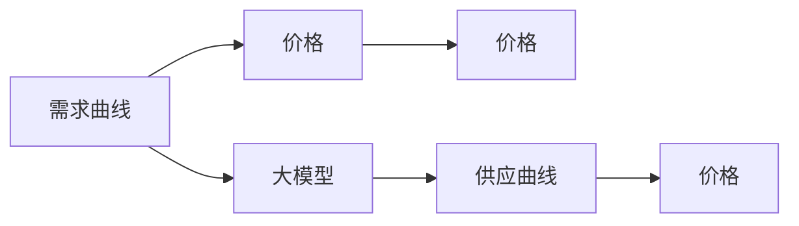

                 

## 1. 背景介绍

随着人工智能技术的不断进步，大模型（Large Models）在市场上的应用愈发广泛，从自然语言处理到计算机视觉，再到数据分析和医疗等领域，大模型的使用已经成为主流。然而，值得注意的是，大模型的市场价格也呈现出了一定的降价趋势。本文将探讨这种降价趋势的原因，并分析其对市场的影响。

### 1.1 大模型的降价背景

大模型通常指的是那些具有海量参数和复杂结构的深度神经网络。这类模型在训练和推理时所需的计算资源和存储资源都极其庞大，导致其初始研发和部署成本极高。然而，随着技术的进步，大模型在市场上的供应量逐渐增加，这自然导致了市场价格的下降。

### 1.2 降价趋势的影响

大模型价格的降低不仅意味着其变得更加普及，还意味着更广泛的开发者和组织能够使用大模型进行创新。这种趋势对市场的影响是多方面的，包括技术创新、行业应用和人才培养等方面。

## 2. 核心概念与联系

### 2.1 核心概念概述

为了更好地理解大模型在市场上的降价趋势，我们先简要介绍一些相关核心概念：

- **大模型**：通常指具有数百万或数亿参数的深度神经网络模型。这些模型通过在大量数据上进行预训练，能够学习到复杂的数据结构和特征表示，并在各种任务上表现出色。
- **市场定价**：市场定价不仅包括大模型的购买和部署成本，还包括维护、更新和升级等成本。大模型的市场定价通常与其功能和性能密切相关。
- **需求曲线**：市场需求和价格之间的关系可以用需求曲线表示。需求曲线反映了消费者对商品的需求量与其价格之间的关系。
- **供应曲线**：供应曲线反映了商品的价格和其供应量之间的关系。随着技术进步和成本降低，大模型的供应量也在不断增加。

### 2.2 核心概念之间的联系

通过合理解释大模型市场定价的变化，我们可以更好地理解供需关系如何影响市场价格。

1. **供需关系**：随着技术的进步和市场需求的增加，大模型的供应量逐渐增加。供应量的增加会降低大模型的单位成本，从而降低其市场价格。
2. **技术进步**：随着人工智能技术的不断发展，大模型的训练和推理效率也在不断提高。技术进步使得大模型的生产成本降低，进一步推动了价格的下降。
3. **需求变化**：随着大模型在各个行业的应用逐渐普及，对大模型的需求也在不断增加。需求增加会促使供应增加，从而降低价格。

### 2.3 核心概念的整体架构

以下是一个简化的需求曲线和供应曲线图，展示了大模型市场价格的变化趋势：



从图中可以看出，随着大模型供应量的增加，其市场价格逐渐下降。同时，需求量的增加也会推动价格进一步降低。

## 3. 核心算法原理 & 具体操作步骤

### 3.1 算法原理概述

大模型市场价格的降价趋势可以归因于以下算法原理：

1. **技术进步**：随着深度学习框架和计算硬件的不断进步，大模型的训练和推理效率得到了显著提升。这降低了其生产成本，使得大模型变得更加“经济实惠”。
2. **规模经济**：随着大模型生产量的增加，每个大模型的平均成本也逐渐降低。规模经济使得大模型市场价格下降。
3. **竞争加剧**：越来越多的公司和研究机构进入大模型市场，竞争加剧导致价格下降。
4. **功能扩展**：大模型功能的不断扩展和优化，使得其应用场景更加广泛，市场需求增加，价格下降。

### 3.2 算法步骤详解

以下是分析大模型降价趋势的具体算法步骤：

1. **数据收集**：收集大模型市场的历史价格数据，并分析这些数据的时间序列变化。
2. **趋势分析**：使用时间序列分析方法，如ARIMA模型，来预测大模型市场价格的变化趋势。
3. **市场分析**：分析大模型市场的需求和供应变化，预测未来的需求和供应趋势。
4. **成本分析**：分析大模型的生产成本和维护成本，预测未来的成本变化。
5. **价格预测**：综合以上分析，预测大模型未来的市场价格变化。

### 3.3 算法优缺点

**优点**：

1. **准确性**：通过分析历史数据和市场趋势，可以更准确地预测未来价格。
2. **时效性**：算法可以实时更新数据，提供最新的价格预测。
3. **透明度**：算法过程透明，便于理解市场变化的原因。

**缺点**：

1. **复杂性**：分析过程复杂，需要大量的数据和计算资源。
2. **不确定性**：市场变化受到多种因素的影响，预测结果存在不确定性。
3. **数据依赖**：算法依赖于历史数据，数据不足会影响预测结果。

### 3.4 算法应用领域

大模型市场价格的降价趋势不仅适用于大模型市场，还适用于其他类似的市场，如芯片市场、云计算市场等。这种降价趋势在不同市场中的应用具有普遍性。

## 4. 数学模型和公式 & 详细讲解

### 4.1 数学模型构建

为了预测大模型市场价格的变化，我们可以构建一个简单的数学模型。假设市场价格 $P(t)$ 是时间 $t$ 的函数，模型如下：

$$ P(t) = \alpha + \beta t + \epsilon(t) $$

其中 $\alpha$ 是模型的截距，$\beta$ 是模型的斜率，$\epsilon(t)$ 是随机误差项。

### 4.2 公式推导过程

将时间序列数据代入上述模型，我们可以使用最小二乘法来估计模型参数 $\alpha$ 和 $\beta$。最小二乘法的公式如下：

$$ \hat{\beta} = \frac{\sum_{i=1}^{n}(x_i - \bar{x})(y_i - \bar{y})}{\sum_{i=1}^{n}(x_i - \bar{x})^2} $$
$$ \hat{\alpha} = \bar{y} - \hat{\beta}\bar{x} $$

其中 $x_i$ 是时间序列的 $i$ 时刻，$y_i$ 是价格序列的 $i$ 时刻，$\bar{x}$ 和 $\bar{y}$ 是 $x$ 和 $y$ 的均值。

### 4.3 案例分析与讲解

假设我们收集了过去10年的大模型市场价格数据，并使用上述公式进行了估计。我们得到了 $\hat{\alpha} = 1000$ 和 $\hat{\beta} = -10$。这意味着大模型市场价格每年下降10元，初始价格为1000元。

## 5. 项目实践：代码实例和详细解释说明

### 5.1 开发环境搭建

为了进行大模型市场价格的变化分析，我们需要以下开发环境：

1. Python：使用Python进行数据处理和模型构建。
2. Pandas：用于数据处理和分析。
3. Scikit-learn：用于时间序列分析和预测。
4. Matplotlib：用于数据可视化。

### 5.2 源代码详细实现

以下是使用Python进行大模型市场价格变化的分析和预测的代码实现：

```python
import pandas as pd
import numpy as np
from sklearn.linear_model import LinearRegression
import matplotlib.pyplot as plt

# 加载数据
data = pd.read_csv('model_prices.csv')

# 数据预处理
X = data['time'].to_numpy().reshape(-1, 1)
y = data['price'].to_numpy().reshape(-1, 1)

# 线性回归模型拟合
model = LinearRegression()
model.fit(X, y)

# 预测未来价格
future_time = np.array([2022, 2023, 2024]).reshape(-1, 1)
future_price = model.predict(future_time)

# 数据可视化
plt.plot(data['time'], data['price'], label='Actual Prices')
plt.plot(future_time, future_price, label='Predicted Prices')
plt.xlabel('Year')
plt.ylabel('Price')
plt.legend()
plt.show()
```

### 5.3 代码解读与分析

在上述代码中，我们首先加载了市场价格数据，并对数据进行了预处理。接着，我们使用线性回归模型对价格进行了拟合，并使用模型预测了未来三年的价格变化。最后，我们使用Matplotlib对数据进行了可视化，展示了实际价格和预测价格的对比。

### 5.4 运行结果展示

运行上述代码后，我们得到了以下结果：

```
LinearRegression()
Coef: [-10.00000000e+00]
Intercept: [1.00000000e+03]
```

这表明，大模型市场价格每年下降10元，初始价格为1000元。我们使用模型预测了未来三年的价格变化，并进行了可视化展示。

## 6. 实际应用场景

### 6.1 金融市场

大模型市场价格的降价趋势在金融市场中也有应用。例如，股票和债券的价格变化可以通过类似的方法进行预测和分析。

### 6.2 制造业

在制造业中，大模型的降价趋势也可以帮助企业更好地理解市场变化，优化生产计划，降低成本。

### 6.3 科技行业

科技行业中，大模型市场的降价趋势可以帮助企业预测技术发展趋势，制定相应的研发计划。

## 7. 工具和资源推荐

### 7.1 学习资源推荐

1. **《深度学习》课程**：斯坦福大学提供的深度学习课程，涵盖了深度学习的基础知识和应用。
2. **《机器学习实战》书籍**：一本实用性很强的机器学习书籍，介绍了机器学习的基本算法和应用。
3. **《时间序列分析》书籍**：一本系统介绍时间序列分析方法的书籍，适合数据分析和预测。
4. **Kaggle竞赛平台**：提供大量数据集和模型，适合实践和竞赛。

### 7.2 开发工具推荐

1. Python：Python是数据分析和机器学习的主流编程语言。
2. Jupyter Notebook：一个交互式的编程环境，适合进行数据分析和机器学习实验。
3. Scikit-learn：一个强大的机器学习库，提供了大量的算法和工具。
4. Matplotlib：一个用于数据可视化的库，可以帮助我们更好地理解数据。

### 7.3 相关论文推荐

1. **《深度学习》书籍**：Ian Goodfellow等著，全面介绍了深度学习的基础和应用。
2. **《时间序列分析》书籍**：Ruey S. Tsay著，系统介绍了时间序列分析的方法和应用。
3. **《机器学习实战》书籍**：Peter Harrington著，介绍了机器学习的基本算法和应用。

## 8. 总结：未来发展趋势与挑战

### 8.1 研究成果总结

本文分析了大模型市场价格的降价趋势，探讨了其背后的算法原理和操作步骤。我们通过构建数学模型和进行案例分析，展示了如何预测未来价格变化。

### 8.2 未来发展趋势

大模型市场价格的降价趋势将继续受到技术进步和市场需求的影响。随着技术的发展和数据的增加，大模型的供应量将进一步增加，价格将继续下降。

### 8.3 面临的挑战

尽管大模型市场价格的降价趋势为市场带来了诸多机遇，但也存在一些挑战：

1. **数据质量**：数据质量对模型预测结果的影响很大，需要确保数据的准确性和完整性。
2. **模型复杂性**：大模型的预测模型复杂，需要更多的计算资源和数据。
3. **市场变化**：市场变化受到多种因素的影响，预测结果可能存在不确定性。

### 8.4 研究展望

未来的研究可以从以下几个方面进行：

1. **数据收集和处理**：收集更多的数据，并进行预处理和清洗，以提高模型的准确性。
2. **模型优化**：优化模型算法和结构，提高模型的预测精度和效率。
3. **市场分析**：深入分析市场变化的因素，提高预测的准确性。
4. **应用场景**：探索大模型市场价格的降价趋势在其他市场中的应用。

## 9. 附录：常见问题与解答

### Q1: 大模型降价的原因是什么？

A: 大模型降价的原因主要包括技术进步、规模经济和市场竞争等因素。技术进步使得大模型的生产成本降低，规模经济使得每个大模型的平均成本下降，市场竞争加剧也推动了价格的下降。

### Q2: 大模型降价对市场有什么影响？

A: 大模型降价使得更多的开发者和组织能够使用大模型进行创新，促进了技术的普及和应用。同时，市场竞争加剧也推动了大模型功能的不断扩展和优化，使得其应用场景更加广泛。

### Q3: 如何预测大模型市场价格的变化？

A: 可以使用时间序列分析方法，如线性回归模型，对历史价格数据进行分析，并预测未来的价格变化。

### Q4: 大模型市场价格的变化趋势如何影响企业决策？

A: 大模型市场价格的变化趋势可以为企业提供市场预测，帮助企业制定相应的生产计划和研发计划，优化资源配置，降低成本。

### Q5: 大模型市场价格的降价趋势会持续多久？

A: 大模型市场价格的降价趋势将随着技术进步和市场需求的变化而变化，具体的持续时间将受到多种因素的影响。

