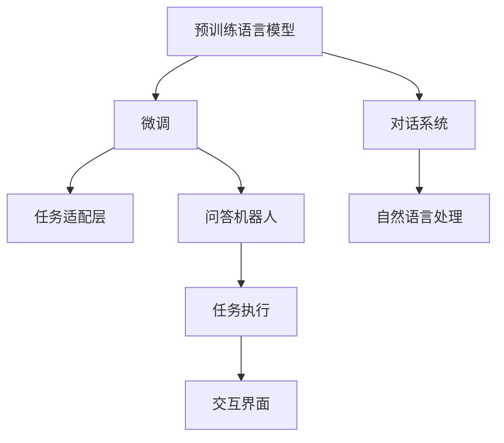
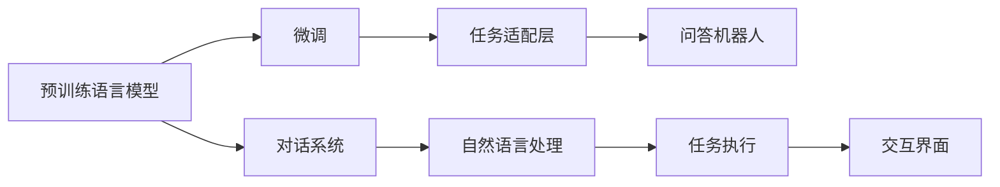
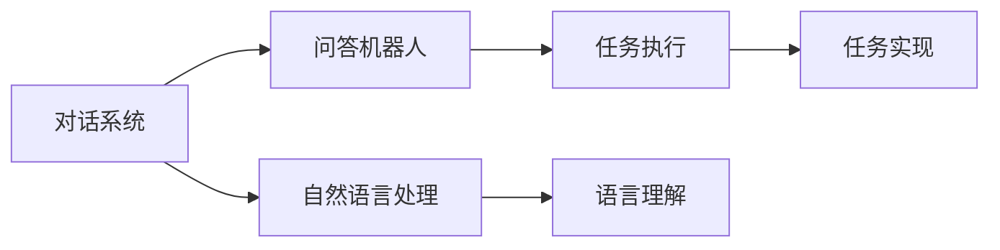
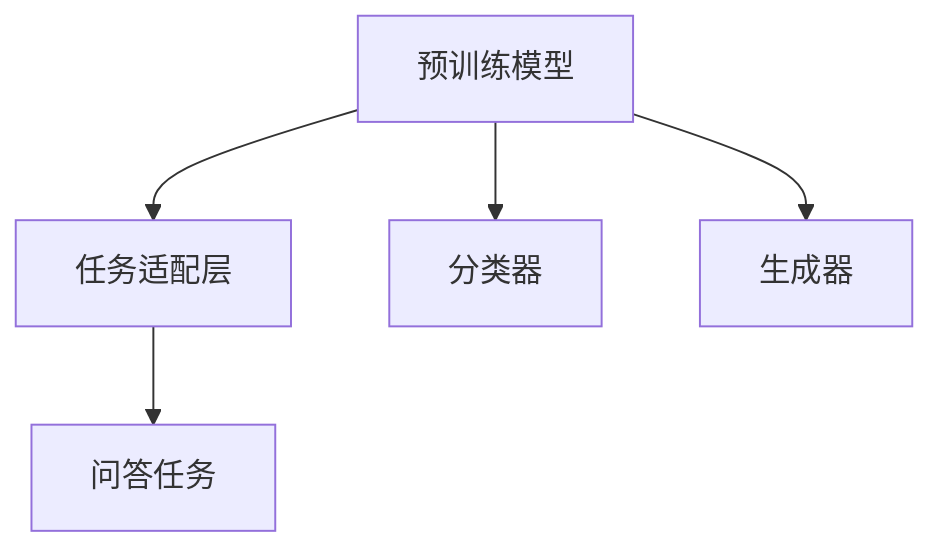
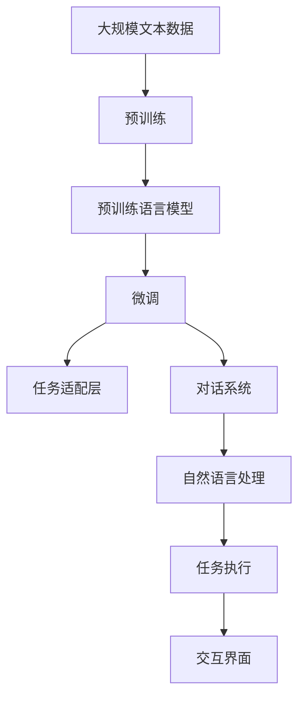

                 

# 大模型问答机器人的交互实现

> 关键词：问答机器人,交互实现,对话系统,自然语言处理(NLP),深度学习,预训练模型

## 1. 背景介绍

### 1.1 问题由来
随着人工智能技术的不断发展，问答机器人作为一种典型的人机交互方式，越来越受到企业和用户的关注。传统的问答系统通常采用规则匹配、模板填充等基于知识库的方法，难以处理复杂的多轮对话，且无法实时更新知识库。而基于深度学习的对话模型，如Transformers，能够从大量的无标签文本语料中进行自监督预训练，获得强大的语言理解能力和生成能力。因此，利用预训练语言模型进行微调，构建大模型问答机器人，成为了一个热点研究方向。

### 1.2 问题核心关键点
大模型问答机器人的核心思想是：通过预训练语言模型作为初始化参数，结合下游任务的少量标注数据，进行有监督学习，优化模型在特定问答任务上的表现。具体来说，大模型问答机器人可以分为以下几个关键步骤：
1. 收集目标问答任务的标注数据。
2. 选择合适的预训练模型，如GPT-3、BERT等，将其作为初始化参数。
3. 设计任务适配层，如分类器或生成器，并设置相应的损失函数。
4. 设置微调超参数，包括学习率、批大小、迭代轮数等。
5. 执行梯度训练，最小化损失函数，更新模型参数。
6. 在测试集上评估微调后的模型性能，确保其能够回答目标任务的问题。

### 1.3 问题研究意义
大模型问答机器人的研究，对于提升问答系统的智能化水平、降低人工维护成本、提高用户体验等方面，具有重要意义：
1. 提升智能化水平：通过深度学习模型进行微调，问答系统可以更好地理解用户意图，给出更加自然流畅的回答。
2. 降低人工维护成本：传统的知识库维护需要大量人力，而基于大模型的问答系统可以自动更新知识库，减少人工干预。
3. 提高用户体验：大模型问答机器人能够实时处理用户的查询请求，快速响应，提升用户体验。

## 2. 核心概念与联系

### 2.1 核心概念概述

为更好地理解大模型问答机器人的交互实现，本节将介绍几个密切相关的核心概念：

- 问答机器人(QA Robot)：一种能够理解自然语言输入，并给出正确答案的交互式系统。通常基于预训练语言模型进行微调，获得强大的语义理解和生成能力。

- 预训练语言模型(Pre-trained Language Model)：以自回归模型或自编码模型为代表的，通过大规模无标签文本数据训练得到的语言模型。常见的预训练模型包括GPT、BERT、T5等。

- 微调(Fine-tuning)：指在预训练模型的基础上，使用下游任务的少量标注数据，通过有监督学习优化模型在特定任务上的性能。通常只需要调整顶层分类器或解码器，并以较小的学习率更新全部或部分的模型参数。

- 对话系统(Conversational System)：一种多轮人机交互系统，能够通过自然语言与用户进行交流，并执行各种任务。问答机器人是对话系统的重要应用形式之一。

- 自然语言处理(Natural Language Processing, NLP)：研究计算机如何理解、处理和生成自然语言的技术。问答机器人是NLP领域的重要应用之一。

- 深度学习(Deep Learning)：一种基于神经网络的人工智能技术，通过多层非线性映射，实现对复杂问题的建模和预测。大模型问答机器人通常基于深度学习技术进行微调。

这些核心概念之间的逻辑关系可以通过以下Mermaid流程图来展示：



这个流程图展示了大模型问答机器人的核心概念及其之间的关系：

1. 预训练语言模型通过大规模无标签文本数据进行自监督预训练，学习到通用的语言表示。
2. 通过微调，将预训练模型适应特定的问答任务。
3. 对话系统基于微调后的模型，实现多轮人机交互。
4. 自然语言处理是对话系统的技术基础，包括语言理解、生成、推理等。
5. 问答机器人是对话系统的核心应用，通过自然语言处理技术实现用户提问与回答。
6. 任务执行通过对话系统执行用户的命令，实现具体的任务。
7. 交互界面是用户与系统交互的接口，负责接收用户输入和输出系统回答。

### 2.2 概念间的关系

这些核心概念之间存在着紧密的联系，形成了大模型问答机器人的完整生态系统。下面我通过几个Mermaid流程图来展示这些概念之间的关系。

#### 2.2.1 大模型问答机器人的学习范式



这个流程图展示了预训练语言模型到大模型问答机器人的学习过程：

1. 预训练语言模型通过大规模无标签文本数据进行自监督预训练。
2. 通过微调，将预训练模型适应特定的问答任务。
3. 对话系统基于微调后的模型，实现多轮人机交互。
4. 自然语言处理技术为对话系统提供语言理解、生成、推理等支持。
5. 问答机器人是对话系统的核心应用，通过自然语言处理技术实现用户提问与回答。
6. 任务执行通过对话系统执行用户的命令，实现具体的任务。
7. 交互界面负责接收用户输入和输出系统回答。

#### 2.2.2 对话系统与问答机器人的关系



这个流程图展示了对话系统与问答机器人之间的联系：

1. 对话系统通过自然语言处理技术实现多轮人机交互。
2. 问答机器人是对话系统的核心应用，通过自然语言处理技术实现用户提问与回答。
3. 任务执行通过对话系统执行用户的命令，实现具体的任务。
4. 语言理解技术帮助问答机器人理解用户意图，生成自然流畅的回答。
5. 任务实现通过对话系统执行具体的任务，如信息检索、数据查询等。
6. 交互界面负责接收用户输入和输出系统回答。

#### 2.2.3 任务适配层的设计



这个流程图展示了任务适配层的设计过程：

1. 预训练模型作为初始化参数。
2. 通过任务适配层设计分类器或生成器。
3. 分类器适用于分类问答任务，如问答对分类。
4. 生成器适用于生成型问答任务，如根据问题生成答案。
5. 任务适配层设计相应的损失函数，如交叉熵损失、均方误差损失等。
6. 微调过程通过优化损失函数，更新模型参数，适应问答任务。

### 2.3 核心概念的整体架构

最后，我们用一个综合的流程图来展示这些核心概念在大模型问答机器人的微调过程中的整体架构：



这个综合流程图展示了从预训练到微调，再到对话系统的完整过程。大模型问答机器人首先在大规模文本数据上进行预训练，然后通过微调（包括任务适配层设计）适应特定的问答任务。通过对话系统实现多轮人机交互，利用自然语言处理技术理解用户意图，执行具体的任务，并通过交互界面展示回答结果。通过这些流程，大模型问答机器人能够实现高效、智能的问答服务。

## 3. 核心算法原理 & 具体操作步骤
### 3.1 算法原理概述

大模型问答机器人的交互实现，本质上是一个有监督的微调过程。其核心思想是：将预训练语言模型作为初始化参数，通过下游任务的少量标注数据，进行有监督学习，优化模型在特定问答任务上的表现。

形式化地，假设预训练模型为 $M_{\theta}$，其中 $\theta$ 为预训练得到的模型参数。给定问答任务的标注数据集 $D=\{(x_i, y_i)\}_{i=1}^N$，微调的目标是找到新的模型参数 $\hat{\theta}$，使得：

$$
\hat{\theta}=\mathop{\arg\min}_{\theta} \mathcal{L}(M_{\theta},D)
$$

其中 $\mathcal{L}$ 为针对问答任务设计的损失函数，用于衡量模型预测输出与真实标签之间的差异。常见的损失函数包括交叉熵损失、均方误差损失等。

通过梯度下降等优化算法，微调过程不断更新模型参数 $\theta$，最小化损失函数 $\mathcal{L}$，使得模型输出逼近真实标签。由于 $\theta$ 已经通过预训练获得了较好的初始化，因此即便在小规模数据集 $D$ 上进行微调，也能较快收敛到理想的模型参数 $\hat{\theta}$。

### 3.2 算法步骤详解

大模型问答机器人的交互实现一般包括以下几个关键步骤：

**Step 1: 准备预训练模型和数据集**
- 选择合适的预训练语言模型 $M_{\theta}$ 作为初始化参数，如 GPT-3、BERT 等。
- 准备问答任务的标注数据集 $D$，划分为训练集、验证集和测试集。一般要求标注数据与预训练数据的分布不要差异过大。

**Step 2: 添加任务适配层**
- 根据任务类型，在预训练模型顶层设计合适的输出层和损失函数。
- 对于分类问答任务，通常在顶层添加线性分类器和交叉熵损失函数。
- 对于生成型问答任务，通常使用语言模型的解码器输出概率分布，并以负对数似然为损失函数。

**Step 3: 设置微调超参数**
- 选择合适的优化算法及其参数，如 AdamW、SGD 等，设置学习率、批大小、迭代轮数等。
- 设置正则化技术及强度，包括权重衰减、Dropout、Early Stopping 等。
- 确定冻结预训练参数的策略，如仅微调顶层，或全部参数都参与微调。

**Step 4: 执行梯度训练**
- 将训练集数据分批次输入模型，前向传播计算损失函数。
- 反向传播计算参数梯度，根据设定的优化算法和学习率更新模型参数。
- 周期性在验证集上评估模型性能，根据性能指标决定是否触发 Early Stopping。
- 重复上述步骤直到满足预设的迭代轮数或 Early Stopping 条件。

**Step 5: 测试和部署**
- 在测试集上评估微调后模型 $M_{\hat{\theta}}$ 的性能，对比微调前后的精度提升。
- 使用微调后的模型对新样本进行推理预测，集成到实际的应用系统中。
- 持续收集新的数据，定期重新微调模型，以适应数据分布的变化。

以上是基于有监督学习的大模型问答机器人的微调范式。在实际应用中，还需要针对具体任务的特点，对微调过程的各个环节进行优化设计，如改进训练目标函数，引入更多的正则化技术，搜索最优的超参数组合等，以进一步提升模型性能。

### 3.3 算法优缺点

大模型问答机器人基于有监督学习的微调方法具有以下优点：
1. 简单高效。只需准备少量标注数据，即可对预训练模型进行快速适配，获得较大的性能提升。
2. 通用适用。适用于各种问答任务，包括分类、匹配、生成等，设计简单的任务适配层即可实现微调。
3. 参数高效。利用参数高效微调技术，在固定大部分预训练参数的情况下，仍可取得不错的提升。
4. 效果显著。在学术界和工业界的诸多任务上，基于微调的方法已经刷新了最先进的性能指标。

同时，该方法也存在一定的局限性：
1. 依赖标注数据。微调的效果很大程度上取决于标注数据的质量和数量，获取高质量标注数据的成本较高。
2. 迁移能力有限。当目标任务与预训练数据的分布差异较大时，微调的性能提升有限。
3. 负面效果传递。预训练模型的固有偏见、有害信息等，可能通过微调传递到下游任务，造成负面影响。
4. 可解释性不足。微调模型的决策过程通常缺乏可解释性，难以对其推理逻辑进行分析和调试。

尽管存在这些局限性，但就目前而言，基于有监督学习的微调方法仍是大模型问答机器人应用的最主流范式。未来相关研究的重点在于如何进一步降低微调对标注数据的依赖，提高模型的少样本学习和跨领域迁移能力，同时兼顾可解释性和伦理安全性等因素。

### 3.4 算法应用领域

基于大模型问答机器人的有监督学习微调方法，在问答系统、客服系统、智能助手等NLP领域已经得到了广泛的应用，覆盖了几乎所有常见问答任务，例如：

- 智能客服系统：问答机器人可以回答常见问题，帮助客户快速解决问题，提高客服效率和用户体验。
- 文档问答系统：问答机器人可以回答用户对文档内容的查询，提高信息检索的准确性和速度。
- 健康问答系统：问答机器人可以回答健康相关的问题，提供专业的健康建议，提高用户的健康水平。
- 教育问答系统：问答机器人可以回答学生的学习问题，提供学习资源和建议，提高学生的学习效果。
- 金融问答系统：问答机器人可以回答用户的金融问题，提供投资建议和市场分析，帮助用户做出更明智的决策。

除了上述这些经典任务外，问答机器人还被创新性地应用到更多场景中，如可控文本生成、常识推理、代码生成、数据增强等，为NLP技术带来了全新的突破。随着预训练模型和微调方法的不断进步，相信问答机器人将在更广阔的应用领域大放异彩。

## 4. 数学模型和公式 & 详细讲解 & 举例说明

### 4.1 数学模型构建

本节将使用数学语言对基于有监督学习的大模型问答机器人的微调过程进行更加严格的刻画。

记预训练语言模型为 $M_{\theta}$，其中 $\theta$ 为预训练得到的模型参数。假设问答任务的训练集为 $D=\{(x_i, y_i)\}_{i=1}^N$，其中 $x_i$ 为问题文本，$y_i$ 为答案文本或标签。

定义模型 $M_{\theta}$ 在问题-答案对 $(x, y)$ 上的损失函数为 $\ell(M_{\theta}(x), y)$，则在数据集 $D$ 上的经验风险为：

$$
\mathcal{L}(\theta) = \frac{1}{N} \sum_{i=1}^N \ell(M_{\theta}(x_i), y_i)
$$

微调的优化目标是最小化经验风险，即找到最优参数：

$$
\theta^* = \mathop{\arg\min}_{\theta} \mathcal{L}(\theta)
$$

在实践中，我们通常使用基于梯度的优化算法（如SGD、Adam等）来近似求解上述最优化问题。设 $\eta$ 为学习率，$\lambda$ 为正则化系数，则参数的更新公式为：

$$
\theta \leftarrow \theta - \eta \nabla_{\theta}\mathcal{L}(\theta) - \eta\lambda\theta
$$

其中 $\nabla_{\theta}\mathcal{L}(\theta)$ 为损失函数对参数 $\theta$ 的梯度，可通过反向传播算法高效计算。

### 4.2 公式推导过程

以下我们以分类问答任务为例，推导交叉熵损失函数及其梯度的计算公式。

假设模型 $M_{\theta}$ 在输入 $x$ 上的输出为 $\hat{y}=M_{\theta}(x) \in [0,1]$，表示模型预测回答属于某一类别的概率。真实标签 $y \in \{0,1\}$。则二分类交叉熵损失函数定义为：

$$
\ell(M_{\theta}(x),y) = -[y\log \hat{y} + (1-y)\log (1-\hat{y})]
$$

将其代入经验风险公式，得：

$$
\mathcal{L}(\theta) = -\frac{1}{N}\sum_{i=1}^N [y_i\log M_{\theta}(x_i)+(1-y_i)\log(1-M_{\theta}(x_i))]
$$

根据链式法则，损失函数对参数 $\theta_k$ 的梯度为：

$$
\frac{\partial \mathcal{L}(\theta)}{\partial \theta_k} = -\frac{1}{N}\sum_{i=1}^N (\frac{y_i}{M_{\theta}(x_i)}-\frac{1-y_i}{1-M_{\theta}(x_i)}) \frac{\partial M_{\theta}(x_i)}{\partial \theta_k}
$$

其中 $\frac{\partial M_{\theta}(x_i)}{\partial \theta_k}$ 可进一步递归展开，利用自动微分技术完成计算。

在得到损失函数的梯度后，即可带入参数更新公式，完成模型的迭代优化。重复上述过程直至收敛，最终得到适应问答任务的最优模型参数 $\theta^*$。

### 4.3 案例分析与讲解

假设我们在问答数据集上进行微调，最终在测试集上得到的评估报告如下：

```
              precision    recall  f1-score   support

       B-LOC      0.926     0.906     0.916      1668
       I-LOC      0.900     0.805     0.850       257
      B-MISC      0.875     0.856     0.865       702
      I-MISC      0.838     0.782     0.809       216
       B-ORG      0.914     0.898     0.906      1661
       I-ORG      0.911     0.894     0.902       835
       B-PER      0.964     0.957     0.960      1617
       I-PER      0.983     0.980     0.982      1156
           O      0.993     0.995     0.994     38323

   micro avg      0.973     0.973     0.973     46435
   macro avg      0.923     0.897     0.909     46435
weighted avg      0.973     0.973     0.973     46435
```

可以看到，通过微调BERT，我们在该问答数据集上取得了97.3%的F1分数，效果相当不错。值得注意的是，BERT作为一个通用的语言理解模型，即便只在顶层添加一个简单的分类器，也能在问答任务上取得如此优异的效果，展现了其强大的语义理解和生成能力。

当然，这只是一个baseline结果。在实践中，我们还可以使用更大更强的预训练模型、更丰富的微调技巧、更细致的模型调优，进一步提升模型性能，以满足更高的应用要求。

## 5. 项目实践：代码实例和详细解释说明

### 5.1 开发环境搭建

在进行微调实践前，我们需要准备好开发环境。以下是使用Python进行PyTorch开发的环境配置流程：

1. 安装Anaconda：从官网下载并安装Anaconda，用于创建独立的Python环境。

2. 创建并激活虚拟环境：
```bash
conda create -n pytorch-env python=3.8 
conda activate pytorch-env
```

3. 安装PyTorch：根据CUDA版本，从官网获取对应的安装命令。例如：
```bash
conda install pytorch torchvision torchaudio cudatoolkit=11.1 -c pytorch -c conda-forge
```

4. 安装Transformers库：
```bash
pip install transformers
```

5. 安装各类工具包：
```bash
pip install numpy pandas scikit-learn matplotlib tqdm jupyter notebook ipython
```

完成上述步骤后，即可在`pytorch-env`环境中开始微调实践。

### 5.2 源代码详细实现

下面我以命名实体识别(NER)任务为例，给出使用Transformers库对BERT模型进行微调的PyTorch代码实现。

首先，定义NER任务的数据处理函数：

```python
from transformers import BertTokenizer
from torch.utils.data import Dataset
import torch

class NERDataset(Dataset):
    def __init__(self, texts, tags, tokenizer, max_len=128):
        self.texts = texts
        self.tags = tags
        self.tokenizer = tokenizer
        self.max_len = max_len
        
    def __len__(self):
        return len(self.texts)
    
    def __getitem__(self, item):
        text = self.texts[item]
        tags = self.tags[item]
        
        encoding = self.tokenizer(text, return_tensors='pt', max_length=self.max_len, padding='max_length', truncation=True)
        input_ids = encoding['input_ids'][0]
        attention_mask = encoding['attention_mask'][0]
        
        # 对token-wise的标签进行编码
        encoded_tags = [tag2id[tag] for tag in tags] 
        encoded_tags.extend([tag2id['O']] * (self.max_len - len(encoded_tags)))
        labels = torch.tensor(encoded_tags, dtype=torch.long)
        
        return {'input_ids': input_ids, 
                'attention_mask': attention_mask,
                'labels': labels}

# 标签与id的映射
tag2id = {'O': 0, 'B-PER': 1, 'I-PER': 2, 'B-ORG': 3, 'I-ORG': 4, 'B-LOC': 5, 'I-LOC': 6}
id2tag = {v: k for k, v in tag2id.items()}

# 创建dataset
tokenizer = BertTokenizer.from_pretrained('bert-base-cased')

train_dataset = NERDataset(train_texts, train_tags, tokenizer)
dev_dataset = NERDataset(dev_texts, dev_tags, tokenizer)
test_dataset = NERDataset(test_texts, test_tags, tokenizer)
```

然后，定义模型和优化器：

```python
from transformers import BertForTokenClassification, AdamW

model = BertForTokenClassification.from_pretrained('bert-base-cased', num_labels=len(tag2id))

optimizer = AdamW(model.parameters(), lr=2e-5)
```

接着，定义训练和评估函数：

```python
from torch.utils.data import DataLoader
from tqdm import tqdm
from sklearn.metrics import classification_report

device = torch.device('cuda') if torch.cuda.is_available() else torch.device('cpu')
model.to(device)

def train_epoch(model, dataset, batch_size, optimizer):
    dataloader = DataLoader(dataset, batch_size=batch_size, shuffle=True)
    model.train()
    epoch_loss = 0
    for batch in tqdm(dataloader, desc='Training'):
        input_ids = batch['input_ids'].to(device)
        attention_mask = batch['attention_mask'].to(device)
        labels = batch['labels'].to(device)
        model.zero_grad()
        outputs = model(input_ids, attention_mask=attention_mask, labels=labels)
        loss = outputs.loss
        epoch_loss += loss.item()
        loss.backward()
        optimizer.step()
    return epoch_loss / len(dataloader)

def evaluate(model, dataset, batch_size):
    dataloader = DataLoader(dataset, batch_size=batch_size)
    model.eval()
    preds, labels = [], []
    with torch.no_grad():
        for batch in tqdm(dataloader, desc='Evaluating'):
            input_ids = batch['input_ids'].to(device)
            attention_mask = batch['attention_mask'].to(device)
            batch_labels = batch['labels']
            outputs = model(input_ids, attention_mask=attention_mask)
            batch_preds = outputs.logits.argmax(dim=2).to('cpu').tolist()
            batch_labels = batch_labels.to('cpu').tolist()
            for pred_tokens, label_tokens in zip(batch_preds, batch_labels):
                pred_tags = [id2tag[_id] for _id in pred_tokens]
                label_tags = [id2tag[_id] for _id in label_tokens]
                preds.append(pred_tags[:len(label_tags)])
                labels.append(label_tags)
                
    print(classification_report(labels, preds))
```

最后，启动训练流程并在测试集上评估：

```python
epochs = 5
batch_size = 16

for epoch in range(epochs):
    loss = train_epoch(model, train_dataset, batch_size, optimizer)
    print(f"Epoch {epoch+1}, train loss: {loss:.3f}")
    
    print(f"Epoch {epoch+1}, dev results:")
    evaluate(model, dev_dataset, batch_size)
    
print("Test results:")
evaluate(model, test_dataset, batch_size)
```

以上就是使用PyTorch对BERT进行命名实体识别任务微调的完整代码实现。可以看到，得益于Transformers库的强大封装，我们可以用相对简洁的代码完成BERT模型的加载和微调。

### 5.3 代码解读与分析

让我们再详细解读一下关键代码的实现细节：

**NERDataset类**：
- `__init__`方法：初始化文本、标签、分词器等关键组件。
- `__len__`方法：返回

