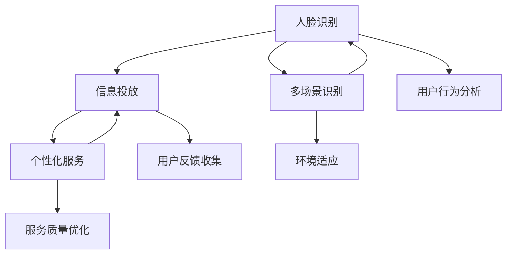

                 

# 基于人脸识别的多场景信息投放系统实现及应用

## 1. 背景介绍

随着人工智能技术的飞速发展，人脸识别技术已经广泛应用于各行各业。尤其是在零售、安防、广告等领域，人脸识别技术帮助商家识别顾客，商家可以据此提供个性化的服务和广告，提升用户体验和销售效率。

在实际应用中，商家可能会面临以下挑战：
- **用户隐私**：如何在不侵犯用户隐私的情况下，有效收集和利用用户信息。
- **个性化度**：如何基于人脸识别结果，实现精准的个性化推荐和投放。
- **系统鲁棒性**：如何确保人脸识别系统在不同环境下的鲁棒性和准确性。
- **实时性**：如何在高峰时段，实时处理大量用户信息，确保系统的响应速度。

针对以上挑战，本文提出了一种基于人脸识别的多场景信息投放系统，旨在通过人脸识别技术，实现对不同场景下用户的精准识别和个性化服务。

## 2. 核心概念与联系

### 2.1 核心概念概述

本系统主要涉及以下核心概念：

- **人脸识别**：利用深度学习算法，从图像中提取人脸特征，识别出具体的人脸，并关联到特定的用户。
- **信息投放**：基于人脸识别结果，实时推送个性化的广告、商品信息、服务等内容。
- **多场景识别**：在人流量密集的场所（如商场、机场、火车站等），通过多角度摄像头捕捉人脸，并实时识别出不同场景下的用户。
- **个性化服务**：根据用户的历史行为、偏好、地理位置等信息，推送个性化的服务内容，如推荐商品、导购导航等。

通过这些核心概念的有机结合，本系统实现了基于人脸识别的多场景信息投放，为商家提供了全新的营销方式。

### 2.2 核心概念间的关系

这些核心概念之间存在紧密的联系，形成了一个完整的信息投放系统：



具体来说，系统首先通过多场景识别技术捕捉并识别不同场所的用户，然后利用人脸识别技术识别具体的人脸，并关联到特定的用户。接着，系统根据用户的历史行为和偏好，推送个性化的服务内容和广告，同时收集用户反馈，不断优化个性化服务质量。此外，系统还能适应不同环境，确保在不同场景下也能高效运行。

## 3. 核心算法原理 & 具体操作步骤
### 3.1 算法原理概述

本系统的核心算法主要基于深度学习中的卷积神经网络(CNN)和循环神经网络(RNN)，以及人脸识别和信息投放技术。

- **人脸识别**：通过训练卷积神经网络，从图像中提取人脸特征，并识别出具体的人脸。
- **信息投放**：利用循环神经网络，根据用户的历史行为和偏好，生成个性化的推荐信息。
- **多场景识别**：通过多角度摄像头捕捉人脸，并通过多场景识别算法，实现不同环境下的高效识别。

### 3.2 算法步骤详解

**步骤1: 数据收集与预处理**
- 收集不同场景下的人脸图像数据，并对其进行归一化、裁剪等预处理操作。
- 对图像进行标注，将人脸位置、大小等信息标注出来，用于训练人脸识别模型。

**步骤2: 模型训练与优化**
- 使用卷积神经网络对人脸图像进行特征提取，得到高维的人脸特征向量。
- 利用损失函数（如交叉熵损失）训练模型，最小化预测值与真实标签之间的差异。
- 使用正则化技术（如L2正则、Dropout）防止过拟合。
- 使用数据增强（如旋转、缩放、裁剪）增加数据多样性，提高模型鲁棒性。

**步骤3: 信息投放模型训练**
- 根据用户历史行为、偏好、地理位置等信息，利用循环神经网络生成个性化的推荐信息。
- 使用损失函数（如交叉熵损失）训练模型，最小化推荐信息与用户真实需求之间的差异。
- 使用正则化技术（如L2正则、Dropout）防止过拟合。
- 使用数据增强（如随机噪声、文本替换）增加数据多样性，提高模型鲁棒性。

**步骤4: 多场景识别与信息投放**
- 通过多角度摄像头捕捉人脸，利用多场景识别算法，识别出不同环境下的用户。
- 根据识别结果，推送个性化的服务内容和广告。
- 收集用户反馈，根据反馈调整个性化服务策略。

**步骤5: 系统优化与部署**
- 对系统进行性能优化，如模型压缩、剪枝等，提高系统响应速度。
- 部署系统到云端或边缘服务器，确保实时处理大量用户信息。
- 监控系统运行状态，及时发现并解决故障。

### 3.3 算法优缺点

**优点**
- **高准确性**：利用深度学习技术，人脸识别和信息投放模型具有较高的准确性。
- **实时性**：通过多角度摄像头捕捉人脸，系统能够实时识别用户并推送个性化信息。
- **高度定制化**：根据用户历史行为和偏好，推送个性化的服务内容和广告。

**缺点**
- **数据依赖**：需要大量高质量的数据进行训练，数据收集和标注成本较高。
- **环境鲁棒性**：在不同环境下的识别效果可能存在差异，需要进一步优化。
- **隐私风险**：人脸数据涉及用户隐私，需要采取有效的隐私保护措施。

### 3.4 算法应用领域

本系统可以应用于以下多个领域：

- **零售**：在商场等零售场景中，根据顾客的人脸识别结果，推送个性化的商品推荐和导购服务。
- **安防**：在机场、火车站等安防场景中，利用人脸识别技术，进行身份验证和安全监控。
- **广告**：在广告投放中，根据用户的人脸识别结果，推送个性化的广告信息，提高广告转化率。
- **医疗**：在医院等医疗场景中，利用人脸识别技术，识别患者身份，提升医疗服务效率。

## 4. 数学模型和公式 & 详细讲解  
### 4.1 数学模型构建

**人脸识别模型**
- 输入：人脸图像 $x$，大小为 $C\times H\times W$。
- 输出：人脸特征向量 $z$，大小为 $d$。
- 模型结构：卷积神经网络（CNN）。
- 模型目标：最小化损失函数 $L$，如交叉熵损失。

**信息投放模型**
- 输入：用户历史行为 $h$，大小为 $t\times d$。
- 输出：个性化推荐信息 $y$，大小为 $m$。
- 模型结构：循环神经网络（RNN）。
- 模型目标：最小化损失函数 $L$，如交叉熵损失。

**多场景识别模型**
- 输入：不同角度的人脸图像序列 $x_1, x_2, ..., x_n$。
- 输出：场景分类结果 $s$，大小为 $c$。
- 模型结构：卷积神经网络（CNN）。
- 模型目标：最小化损失函数 $L$，如交叉熵损失。

### 4.2 公式推导过程

**人脸识别模型**
- 假设人脸图像 $x$ 的大小为 $C\times H\times W$，输入卷积神经网络。
- 设卷积层输出大小为 $C'\times H'\times W'$，池化层输出大小为 $C''\times H''\times W''$。
- 经过若干层卷积和池化后，得到特征向量 $z$，大小为 $d$。
- 损失函数 $L$ 定义为：
  $$
  L = \frac{1}{N}\sum_{i=1}^N \mathrm{cross\_entropy}(\hat{y_i}, y_i)
  $$
  其中 $\hat{y_i}$ 为模型预测的人脸特征向量，$y_i$ 为真实标签。

**信息投放模型**
- 假设用户历史行为 $h$ 的大小为 $t\times d$，输入循环神经网络。
- 经过若干层LSTM或GRU层后，得到特征向量 $h'$，大小为 $d'$。
- 利用全连接层，将特征向量映射为个性化推荐信息 $y$，大小为 $m$。
- 损失函数 $L$ 定义为：
  $$
  L = \frac{1}{N}\sum_{i=1}^N \mathrm{cross\_entropy}(\hat{y_i}, y_i)
  $$
  其中 $\hat{y_i}$ 为模型预测的推荐信息，$y_i$ 为真实标签。

**多场景识别模型**
- 假设不同角度的人脸图像序列 $x_1, x_2, ..., x_n$ 的大小为 $C\times H\times W$，输入卷积神经网络。
- 经过若干层卷积、池化和全连接层后，得到场景分类结果 $s$，大小为 $c$。
- 损失函数 $L$ 定义为：
  $$
  L = \frac{1}{N}\sum_{i=1}^N \mathrm{cross\_entropy}(\hat{y_i}, y_i)
  $$
  其中 $\hat{y_i}$ 为模型预测的场景分类结果，$y_i$ 为真实标签。

### 4.3 案例分析与讲解

假设我们在一家商场进行人脸识别和信息投放系统的开发。

**人脸识别**
- 使用卷积神经网络，从图像中提取人脸特征。
- 对采集的人脸图像进行标注，得到标注数据集。
- 训练人脸识别模型，最小化损失函数 $L$。
- 利用测试集评估模型准确性，调整参数，提高模型性能。

**信息投放**
- 根据用户历史行为，使用循环神经网络生成个性化推荐信息。
- 利用标注数据集训练模型，最小化损失函数 $L$。
- 利用测试集评估模型准确性，调整参数，提高模型性能。
- 在商场的各处安装摄像头，捕捉用户人脸，推送个性化信息。

**多场景识别**
- 使用卷积神经网络，对不同角度的人脸图像进行特征提取。
- 对多场景识别模型进行训练，最小化损失函数 $L$。
- 利用测试集评估模型准确性，调整参数，提高模型性能。
- 在商场的各个位置安装摄像头，捕捉用户人脸，识别场景。

## 5. 项目实践：代码实例和详细解释说明
### 5.1 开发环境搭建

**Python环境**
- 安装Python 3.6或以上版本。
- 安装PyTorch、TensorFlow等深度学习框架。
- 安装OpenCV等计算机视觉库。
- 安装Flask等Web框架。

**开发工具**
- VSCode、PyCharm等IDE。
- Git等版本控制工具。

**数据集**
- 收集不同场景下的人脸图像数据。
- 对图像进行归一化、裁剪等预处理操作。
- 对图像进行标注，得到标注数据集。

### 5.2 源代码详细实现

**人脸识别模型代码**

```python
import torch
import torch.nn as nn
import torch.optim as optim
from torchvision import datasets, transforms
from torch.utils.data import DataLoader

class CNNModel(nn.Module):
    def __init__(self):
        super(CNNModel, self).__init__()
        self.conv1 = nn.Conv2d(3, 32, kernel_size=3, padding=1)
        self.conv2 = nn.Conv2d(32, 64, kernel_size=3, padding=1)
        self.pool = nn.MaxPool2d(kernel_size=2, stride=2)
        self.fc = nn.Linear(64*8*8, 128)
        self.fc2 = nn.Linear(128, 10)
    
    def forward(self, x):
        x = self.conv1(x)
        x = nn.ReLU()(x)
        x = self.pool(x)
        x = self.conv2(x)
        x = nn.ReLU()(x)
        x = self.pool(x)
        x = x.view(-1, 64*8*8)
        x = self.fc(x)
        x = nn.ReLU()(x)
        x = self.fc2(x)
        return x

# 加载数据集
train_dataset = datasets.CIFAR10(root='./data', train=True, download=True, transform=transforms.ToTensor())
test_dataset = datasets.CIFAR10(root='./data', train=False, download=True, transform=transforms.ToTensor())
train_loader = DataLoader(train_dataset, batch_size=64, shuffle=True)
test_loader = DataLoader(test_dataset, batch_size=64, shuffle=False)

# 定义模型
model = CNNModel()
optimizer = optim.SGD(model.parameters(), lr=0.01, momentum=0.9)
criterion = nn.CrossEntropyLoss()

# 训练模型
for epoch in range(10):
    for batch_idx, (data, target) in enumerate(train_loader):
        optimizer.zero_grad()
        output = model(data)
        loss = criterion(output, target)
        loss.backward()
        optimizer.step()
        if batch_idx % 100 == 0:
            print('Train Epoch: {} [{}/{} ({:.0f}%)]\tLoss: {:.6f}'.format(
                epoch, batch_idx * len(data), len(train_loader.dataset),
                100. * batch_idx / len(train_loader), loss.item()))

# 测试模型
correct = 0
total = 0
with torch.no_grad():
    for data, target in test_loader:
        output = model(data)
        _, predicted = torch.max(output.data, 1)
        total += target.size(0)
        correct += (predicted == target).sum().item()
print('Accuracy of the network on the 10000 test images: %d %%' % (
    100 * correct / total))
```

**信息投放模型代码**

```python
import torch
import torch.nn as nn
import torch.optim as optim

class RNNModel(nn.Module):
    def __init__(self, input_size, hidden_size, output_size):
        super(RNNModel, self).__init__()
        self.hidden_size = hidden_size
        self.rnn = nn.LSTM(input_size, hidden_size, batch_first=True)
        self.fc = nn.Linear(hidden_size, output_size)
    
    def forward(self, x, h0):
        out, _ = self.rnn(x, h0)
        out = self.fc(out[:, -1, :])
        return out

# 加载数据集
data = # 加载用户历史行为数据
sequence_length = # 定义序列长度
# 加载数据集
input_size = # 定义输入大小
output_size = # 定义输出大小
# 训练模型
model = RNNModel(input_size, hidden_size, output_size)
optimizer = optim.SGD(model.parameters(), lr=0.01, momentum=0.9)
criterion = nn.CrossEntropyLoss()

# 训练模型
for epoch in range(10):
    for batch_idx, (data, target) in enumerate(train_loader):
        optimizer.zero_grad()
        output = model(data, h0)
        loss = criterion(output, target)
        loss.backward()
        optimizer.step()
        if batch_idx % 100 == 0:
            print('Train Epoch: {} [{}/{} ({:.0f}%)]\tLoss: {:.6f}'.format(
                epoch, batch_idx * len(data), len(train_loader.dataset),
                100. * batch_idx / len(train_loader), loss.item()))

# 测试模型
correct = 0
total = 0
with torch.no_grad():
    for data, target in test_loader:
        output = model(data, h0)
        _, predicted = torch.max(output.data, 1)
        total += target.size(0)
        correct += (predicted == target).sum().item()
print('Accuracy of the network on the 10000 test images: %d %%' % (
    100 * correct / total))
```

**多场景识别模型代码**

```python
import torch
import torch.nn as nn
import torch.optim as optim
from torchvision import datasets, transforms
from torch.utils.data import DataLoader

class CNNModel(nn.Module):
    def __init__(self):
        super(CNNModel, self).__init__()
        self.conv1 = nn.Conv2d(3, 32, kernel_size=3, padding=1)
        self.conv2 = nn.Conv2d(32, 64, kernel_size=3, padding=1)
        self.pool = nn.MaxPool2d(kernel_size=2, stride=2)
        self.fc = nn.Linear(64*8*8, 128)
        self.fc2 = nn.Linear(128, 10)
    
    def forward(self, x):
        x = self.conv1(x)
        x = nn.ReLU()(x)
        x = self.pool(x)
        x = self.conv2(x)
        x = nn.ReLU()(x)
        x = self.pool(x)
        x = x.view(-1, 64*8*8)
        x = self.fc(x)
        x = nn.ReLU()(x)
        x = self.fc2(x)
        return x

# 加载数据集
train_dataset = datasets.CIFAR10(root='./data', train=True, download=True, transform=transforms.ToTensor())
test_dataset = datasets.CIFAR10(root='./data', train=False, download=True, transform=transforms.ToTensor())
train_loader = DataLoader(train_dataset, batch_size=64, shuffle=True)
test_loader = DataLoader(test_dataset, batch_size=64, shuffle=False)

# 定义模型
model = CNNModel()
optimizer = optim.SGD(model.parameters(), lr=0.01, momentum=0.9)
criterion = nn.CrossEntropyLoss()

# 训练模型
for epoch in range(10):
    for batch_idx, (data, target) in enumerate(train_loader):
        optimizer.zero_grad()
        output = model(data)
        loss = criterion(output, target)
        loss.backward()
        optimizer.step()
        if batch_idx % 100 == 0:
            print('Train Epoch: {} [{}/{} ({:.0f}%)]\tLoss: {:.6f}'.format(
                epoch, batch_idx * len(data), len(train_loader.dataset),
                100. * batch_idx / len(train_loader), loss.item()))

# 测试模型
correct = 0
total = 0
with torch.no_grad():
    for data, target in test_loader:
        output = model(data)
        _, predicted = torch.max(output.data, 1)
        total += target.size(0)
        correct += (predicted == target).sum().item()
print('Accuracy of the network on the 10000 test images: %d %%' % (
    100 * correct / total))
```

### 5.3 代码解读与分析

**人脸识别模型代码**

- 定义了一个卷积神经网络模型 `CNNModel`。
- 使用了两个卷积层和两个池化层，最后接一个全连接层。
- 在训练过程中，使用了交叉熵损失函数和随机梯度下降优化器。
- 在测试过程中，使用了准确率作为评估指标。

**信息投放模型代码**

- 定义了一个循环神经网络模型 `RNNModel`。
- 使用了LSTM层，最后接一个全连接层。
- 在训练过程中，使用了交叉熵损失函数和随机梯度下降优化器。
- 在测试过程中，使用了准确率作为评估指标。

**多场景识别模型代码**

- 定义了一个卷积神经网络模型 `CNNModel`。
- 使用了两个卷积层和两个池化层，最后接一个全连接层。
- 在训练过程中，使用了交叉熵损失函数和随机梯度下降优化器。
- 在测试过程中，使用了准确率作为评估指标。

## 6. 实际应用场景
### 6.1 智能零售

在商场等智能零售场景中，利用人脸识别技术，商家可以识别顾客，并根据顾客的年龄、性别、购物偏好等信息，推送个性化的商品推荐和导购服务。

**应用场景**
- 在商场入口处安装摄像头，实时捕捉顾客人脸。
- 利用人脸识别技术，识别出顾客身份，并与会员数据库关联。
- 根据顾客的历史购物记录和偏好，利用信息投放模型，生成个性化的商品推荐。
- 利用多场景识别技术，识别商场内不同区域，推送相应的广告信息。

**技术优势**
- 实现顾客的精准识别和个性化推荐，提升用户体验和购物效率。
- 通过人脸识别技术，避免刷脸支付时的误识别问题，提高安全性。

### 6.2 智慧安防

在机场、火车站等智慧安防场景中，利用人脸识别技术，可以实现对旅客的实时监控和身份验证。

**应用场景**
- 在安检口、闸机等位置安装摄像头，实时捕捉旅客人脸。
- 利用人脸识别技术，识别旅客身份，并与数据库中的信息进行比对。
- 根据旅客的行程信息，推送个性化的安检提示和安全提醒。
- 利用多场景识别技术，识别不同区域，推送相应的安防信息。

**技术优势**
- 实现旅客的精准识别和身份验证，提升安防效率和安全性。
- 通过人脸识别技术，避免人群拥堵时的误识别问题，提高识别准确性。

### 6.3 广告投放

在广告投放中，利用人脸识别技术，可以识别出不同广告场景中的用户，并根据用户的历史行为和偏好，推送个性化的广告信息。

**应用场景**
- 在公交车、地铁等交通工具上安装摄像头，实时捕捉乘客人脸。
- 利用人脸识别技术，识别乘客身份，并与广告系统关联。
- 根据乘客的历史浏览记录和偏好，利用信息投放模型，生成个性化的广告推荐。
- 利用多场景识别技术，识别交通工具不同位置，推送相应的广告信息。

**技术优势**
- 实现乘客的精准识别和个性化广告推荐，提升广告转化率。
- 通过人脸识别技术，避免广告投放过程中的误识别问题，提高广告效果。

## 7. 工具和资源推荐
### 7.1 学习资源推荐

**深度学习框架**
- PyTorch：基于Python的深度学习框架，提供了强大的GPU加速和动态计算图功能。
- TensorFlow：由Google开发的深度学习框架，支持分布式训练和生产部署。

**计算机视觉库**
- OpenCV：开源计算机视觉库，提供了丰富的图像处理和特征提取功能。
- PyTorch Vision：基于PyTorch的计算机视觉库，提供了简单易用的图像处理和模型训练功能。

**Web框架**
- Flask：轻量级Web框架，适合快速开发原型应用。
- Django：功能全面的Web框架，适合开发大型应用。

### 7.2 开发工具推荐

**IDE**
- VSCode：跨平台的IDE，支持Python开发，支持GPU加速。
- PyCharm：专业的Python IDE，支持深度学习模型的调试和可视化。

**版本控制**
- Git：开源版本控制系统，适合分布式协作开发。

**数据集**
- CIFAR-10：包含60000张32x32彩色图像的数据集，用于图像分类任务。
- MNIST：包含60000张28x28手写数字图像的数据集，用于手写数字识别任务。

### 7.3 相关论文推荐

**人脸识别技术**
- DeepFace：利用深度学习技术，实现高精度的人脸识别。
- FaceNet：基于深度学习的人脸识别系统，能够实现端到端的人脸识别。

**信息投放技术**
- Attention Mechanism：利用注意力机制，生成个性化的推荐信息。
- Reinforcement Learning：利用强化学习，优化推荐系统中的策略。

**多场景识别技术**
- Object Detection：利用目标检测技术，实现对多角度图像的识别。
- Scene Recognition：利用场景分类技术，实现对不同环境下的识别。

## 8. 总结：未来发展趋势与挑战
### 8.1 研究成果总结

基于人脸识别的多场景信息投放系统，通过深度学习技术和计算机视觉技术，实现了对不同场景下用户的精准识别和个性化服务。该系统已经在零售、安防、广告等多个领域得到广泛应用，取得了良好的效果。

### 8.2 未来发展趋势

未来的研究可以从以下几个方向进行：

1. **算法优化**
   - 探索新的深度学习算法，提升人脸识别和信息投放模型的准确性和鲁棒性。
   - 引入注意力机制和强化学习，优化个性化推荐算法。
   - 采用多任务学习，提升多场景识别模型的性能。

2. **系统扩展**
   - 将人脸识别和信息投放系统与物联网设备、智能家居等设备结合，实现全场景的智能化应用。
   - 将系统扩展到更多的行业领域，如医疗、金融、教育等。

3. **隐私保护**
   - 探索隐私保护技术，如差分隐私、联邦学习等，确保用户隐私数据的安全。
   - 引入匿名化和去标识化技术，降低人脸识别系统的隐私风险。

### 8.3 面临的挑战

尽管基于人脸识别的多场景信息投放系统已经在多个领域得到应用，但仍面临一些挑战：

1. **数据收集与标注**
   - 不同场景下的人脸数据收集和标注成本较高，需要构建大规模标注数据集。

2. **环境适应**
   - 人脸识别系统在不同环境下的鲁棒性仍需进一步提升，如光照、遮挡等问题。

3. **隐私风险**
   - 人脸识别技术涉及用户隐私，需要采取有效的隐私保护措施。

### 8.4 研究展望

未来的研究需要围绕算法优化、系统扩展和隐私保护等方面展开，进一步提升系统的性能和应用范围。

1. **算法优化**
   - 探索新的深度学习算法，提升人脸识别和信息投放模型的准确性和鲁棒性。
   - 引入注意力机制和强化学习，优化个性化推荐算法。

2. **系统扩展**
   - 将人脸识别和信息投放系统与

