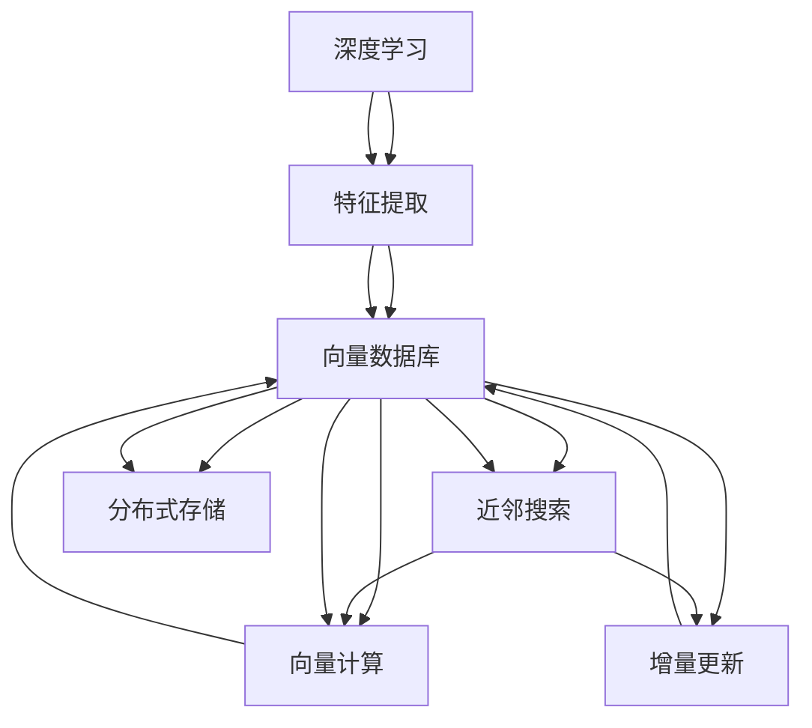
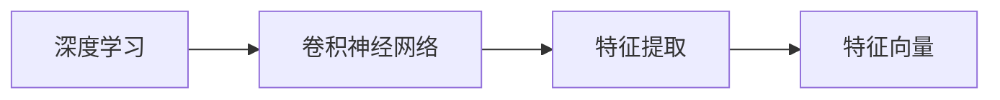
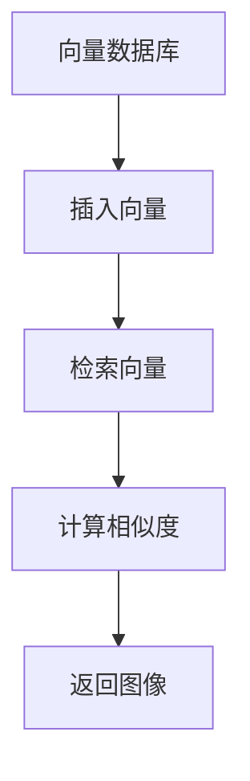
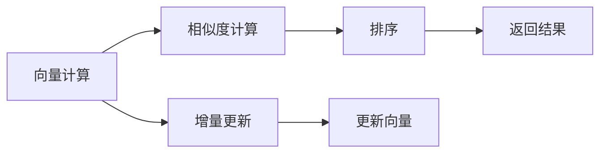
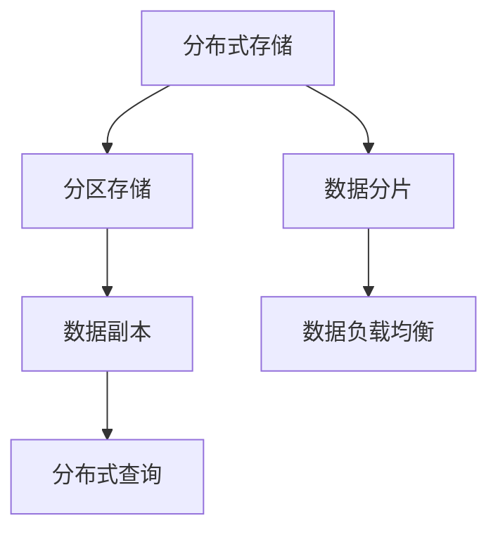
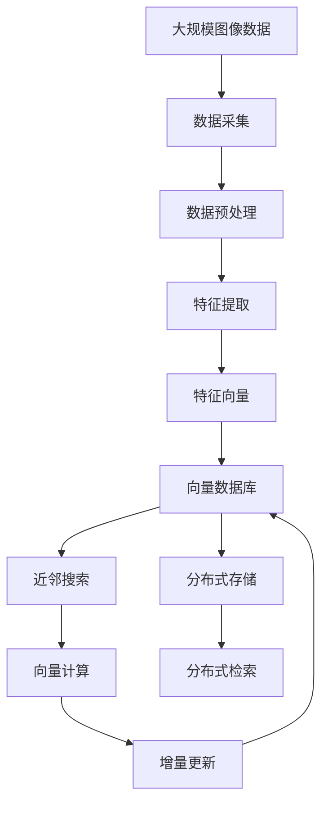

                 

# 基于向量数据库的图像搜索技术进展

> 关键词：向量数据库,图像检索,深度学习,特征提取,近邻搜索,向量计算

## 1. 背景介绍

### 1.1 问题由来
随着数字媒体的快速增长，人们越来越需要一种高效、准确、灵活的图像搜索技术。传统的基于关键词的图像搜索方式，由于缺乏对图像内容的深度理解，往往检索结果与用户需求存在较大偏差，用户体验不佳。近年来，随着深度学习技术和大规模语料库的发展，通过向量数据库实现图像内容的语义检索，逐渐成为图像搜索领域的新兴技术。

### 1.2 问题核心关键点
基于向量数据库的图像搜索，利用深度学习模型对图像进行特征提取，将提取的特征向量存储在向量数据库中。检索时，通过计算查询向量与数据库向量的相似度，快速找到与查询图像最相似的图像。这种方法可以摆脱传统关键词检索的限制，基于图像语义进行匹配，提高了检索的准确性和相关性。

### 1.3 问题研究意义
基于向量数据库的图像搜索技术，将深度学习与向量数据库结合，充分发挥了两者的优势。深度学习模型能够自动学习图像特征，但计算资源消耗巨大；向量数据库能够高效存储和检索大规模向量数据，但无法自主提取特征。两者结合，可以实现更高效、准确的图像检索。

## 2. 核心概念与联系

### 2.1 核心概念概述

为更好地理解基于向量数据库的图像搜索方法，本节将介绍几个密切相关的核心概念：

- **深度学习**：利用多层神经网络模型对图像进行特征提取，尤其是卷积神经网络(CNN)，能够在图像数据上学习到丰富的语义信息。
- **特征提取**：从原始图像数据中提取具有表征意义的特征向量，是图像检索的核心环节。
- **向量数据库**：一种以向量为基本存储单位的数据库，支持高效存储和检索大规模向量数据。
- **近邻搜索**：在向量数据库中，通过计算向量间的相似度，找到与查询向量最近邻的向量，返回相应的图像。
- **向量计算**：在向量数据库中，高效进行向量相似度计算和排序，是实现快速检索的关键技术。
- **增量更新**：在向量数据库中，能够快速更新向量数据，适应新的图像数据，保持检索性能。
- **分布式存储**：在向量数据库中，通过分布式存储，可以高效处理大规模图像数据，提升检索速度。

这些核心概念之间的逻辑关系可以通过以下Mermaid流程图来展示：



这个流程图展示了大规模图像搜索的技术生态系统：

1. 深度学习模型提取图像特征。
2. 将特征向量存储在向量数据库中。
3. 通过近邻搜索在数据库中检索相似向量。
4. 利用向量计算高效计算相似度。
5. 增量更新机制保持数据库的时效性。
6. 分布式存储技术支持大规模数据存储和检索。

这些概念共同构成了大规模图像搜索的技术框架，使得深度学习与向量数据库相结合，实现高效、准确的图像检索。

### 2.2 概念间的关系

这些核心概念之间存在着紧密的联系，形成了大规模图像搜索的完整技术架构。下面我们通过几个Mermaid流程图来展示这些概念之间的关系。

#### 2.2.1 深度学习与特征提取



这个流程图展示了深度学习模型与特征提取的关系。深度学习模型通过卷积神经网络提取图像特征，将这些特征映射为向量形式。

#### 2.2.2 向量数据库与近邻搜索



这个流程图展示了向量数据库与近邻搜索的关系。向量数据库用于存储和管理图像特征向量，检索时通过计算相似度找到最近邻向量，最终返回相应的图像。

#### 2.2.3 向量计算与增量更新



这个流程图展示了向量计算与增量更新的关系。向量计算用于计算向量之间的相似度，增量更新用于实时更新向量数据库，保持检索性能。

#### 2.2.4 分布式存储



这个流程图展示了分布式存储技术的关系。分布式存储通过分区存储和数据分片技术，实现大规模数据的存储和查询，同时利用数据副本和负载均衡技术，保证数据的可靠性和系统的高可用性。

### 2.3 核心概念的整体架构

最后，我们用一个综合的流程图来展示这些核心概念在大规模图像搜索中的整体架构：



这个综合流程图展示了从数据采集到分布式检索的完整流程，通过深度学习模型提取图像特征，利用向量数据库进行高效存储和检索，结合增量更新和分布式存储技术，实现大规模图像的快速搜索。

## 3. 核心算法原理 & 具体操作步骤
### 3.1 算法原理概述

基于向量数据库的图像搜索，利用深度学习模型对图像进行特征提取，将提取的特征向量存储在向量数据库中。检索时，通过计算查询向量与数据库向量的相似度，快速找到与查询图像最相似的图像。这种方法可以摆脱传统关键词检索的限制，基于图像语义进行匹配，提高了检索的准确性和相关性。

### 3.2 算法步骤详解

基于向量数据库的图像搜索一般包括以下几个关键步骤：

**Step 1: 数据采集与预处理**
- 从互联网或本地采集大规模图像数据。
- 对图像进行预处理，如缩放、裁剪、归一化等，以确保数据的一致性。

**Step 2: 特征提取**
- 利用深度学习模型（如卷积神经网络）提取图像特征。
- 将特征向量转换为固定维度的向量形式，如使用L2归一化或嵌入层。

**Step 3: 向量数据库建立**
- 在向量数据库中建立索引，存储特征向量。
- 利用哈希表、倒排索引等技术，快速检索相似向量。

**Step 4: 查询向量生成**
- 对新图像进行特征提取，生成查询向量。
- 使用相同的预处理和特征提取方式，确保查询向量与数据库向量一致。

**Step 5: 向量计算与检索**
- 在向量数据库中计算查询向量与所有存储向量的相似度。
- 利用近邻搜索算法，找到与查询向量最近邻的向量，返回对应的图像。

**Step 6: 检索结果排序与返回**
- 根据相似度排序，返回最相关的图像。
- 可以通过增加特征权重或使用距离加权方法，提高检索结果的准确性。

**Step 7: 增量更新**
- 定期更新向量数据库，加入新的图像特征向量。
- 利用增量更新机制，减少全量更新的时间成本和资源消耗。

**Step 8: 分布式检索**
- 通过分布式存储技术，实现大规模数据存储和检索。
- 利用分布式查询技术，提高检索速度和扩展性。

以上是基于向量数据库的图像搜索的一般流程。在实际应用中，还需要针对具体任务，进行相应的优化和改进。

### 3.3 算法优缺点

基于向量数据库的图像搜索方法具有以下优点：

1. 高效检索：向量数据库支持高效的近邻搜索，可以在秒级时间内完成大规模图像的检索。
2. 高准确性：深度学习模型提取的特征向量，能够充分捕捉图像的语义信息，提高检索的准确性和相关性。
3. 可扩展性：分布式存储和检索技术，能够处理海量数据，适应不同规模的应用场景。
4. 灵活性：能够支持多种特征提取方法和相似度计算算法，灵活适应不同任务需求。

但该方法也存在以下缺点：

1. 计算资源消耗大：深度学习模型和向量数据库都需要消耗大量的计算资源，初期部署成本较高。
2. 数据存储量大：需要存储大规模的特征向量，对存储资源有较高的要求。
3. 复杂度较高：涉及深度学习模型训练、特征提取、向量数据库建立、相似度计算等多个环节，实现复杂。
4. 更新和维护困难：向量数据库和检索算法需要定期更新和维护，对技术团队的要求较高。

### 3.4 算法应用领域

基于向量数据库的图像搜索技术，已经在多个领域得到广泛应用，例如：

- **电商平台**：用于商品搜索、相似商品推荐等。通过存储商品特征向量，实现高效的商品检索和推荐。
- **社交媒体**：用于图片搜索、相似图片推荐等。通过存储用户上传的图片，实现个性化图片检索和推荐。
- **安全监控**：用于视频内容分析、视频检索等。通过存储视频帧的特征向量，实现高效的视频内容检索和分析。
- **智能家居**：用于智能设备搜索、个性化推荐等。通过存储设备的特征向量，实现智能设备的高效搜索和推荐。
- **医疗影像**：用于医学影像检索、诊断辅助等。通过存储影像的特征向量，实现高效医学影像检索和辅助诊断。

## 4. 数学模型和公式 & 详细讲解 & 举例说明
### 4.1 数学模型构建

基于向量数据库的图像搜索，主要涉及以下数学模型和公式：

- **特征提取模型**：假设输入图像为 $X \in \mathbb{R}^{W \times H \times C}$，其中 $W$、$H$、$C$ 分别表示图像的宽度、高度和通道数。通过深度学习模型提取特征，生成特征向量 $z \in \mathbb{R}^{d}$。
- **相似度计算公式**：假设查询向量为 $q \in \mathbb{R}^{d}$，数据库中的特征向量为 $z_1, z_2, \ldots, z_n \in \mathbb{R}^{d}$。通过余弦相似度计算相似度 $s$，公式为：
  $$
  s = \frac{q^Tz}{\|q\| \|z\|}
  $$
  其中 $q^Tz$ 表示向量点积，$\|q\|$ 和 $\|z\|$ 分别表示向量的欧几里得范数。
- **近邻搜索算法**：假设数据库中存储的特征向量已经排好序，排序规则为 $s_1, s_2, \ldots, s_n$。对于查询向量 $q$，计算其与每个数据库向量的相似度 $s_1, s_2, \ldots, s_n$。找到最相似的前 $k$ 个向量，返回对应的图像。

### 4.2 公式推导过程

以余弦相似度公式为例，进行详细的推导和解释。

假设查询向量 $q$ 和数据库中的特征向量 $z_1, z_2, \ldots, z_n$ 已经归一化，即 $\|q\| = 1$ 和 $\|z_i\| = 1$。则余弦相似度计算公式为：

$$
s_i = \frac{q^Tz_i}{\|q\| \|z_i\|} = q^Tz_i = \sum_{j=1}^{d} q_jz_{ij}
$$

其中 $q_j$ 和 $z_{ij}$ 分别表示向量 $q$ 和 $z_i$ 的第 $j$ 个维度值。

通过余弦相似度公式，计算查询向量与每个数据库向量的相似度，并将结果排序。最相似的向量即为最近邻向量，返回对应的图像。

### 4.3 案例分析与讲解

假设我们有一个电商平台，用于商品搜索和推荐。对于每个商品，我们首先利用深度学习模型提取其图像特征，生成高维特征向量。然后将特征向量存储在向量数据库中，建立索引。当用户输入查询图像时，我们再次提取其特征向量，与数据库中的所有向量计算余弦相似度。找到最相似的 $k$ 个向量，返回对应的商品列表。用户还可以对商品列表进行排序和筛选，以获取最相关的商品推荐。

## 5. 项目实践：代码实例和详细解释说明
### 5.1 开发环境搭建

在进行基于向量数据库的图像搜索实践前，我们需要准备好开发环境。以下是使用Python进行PyTorch开发的环境配置流程：

1. 安装Anaconda：从官网下载并安装Anaconda，用于创建独立的Python环境。

2. 创建并激活虚拟环境：
```bash
conda create -n pytorch-env python=3.8 
conda activate pytorch-env
```

3. 安装PyTorch：根据CUDA版本，从官网获取对应的安装命令。例如：
```bash
conda install pytorch torchvision torchaudio cudatoolkit=11.1 -c pytorch -c conda-forge
```

4. 安装Transformers库：
```bash
pip install transformers
```

5. 安装各类工具包：
```bash
pip install numpy pandas scikit-learn matplotlib tqdm jupyter notebook ipython
```

完成上述步骤后，即可在`pytorch-env`环境中开始实践。

### 5.2 源代码详细实现

下面我们以商品搜索为例，给出使用Transformers库对深度学习模型进行训练，并将特征向量存储在向量数据库中的PyTorch代码实现。

首先，定义深度学习模型和训练函数：

```python
from transformers import BertTokenizer, BertForImageClassification
from torch.utils.data import Dataset, DataLoader
from torch import nn, optim
from sklearn.metrics import accuracy_score

class ImageDataset(Dataset):
    def __init__(self, images, labels, tokenizer, max_len=256):
        self.images = images
        self.labels = labels
        self.tokenizer = tokenizer
        self.max_len = max_len
        
    def __len__(self):
        return len(self.images)
    
    def __getitem__(self, item):
        image = self.images[item]
        label = self.labels[item]
        
        encoding = self.tokenizer(image, return_tensors='pt', max_length=self.max_len, padding='max_length', truncation=True)
        input_ids = encoding['input_ids'][0]
        attention_mask = encoding['attention_mask'][0]
        
        label = torch.tensor(label, dtype=torch.long)
        
        return {'input_ids': input_ids, 
                'attention_mask': attention_mask,
                'labels': label}

# 定义深度学习模型
model = BertForImageClassification.from_pretrained('bert-base-cased', num_labels=num_classes)

# 定义优化器和损失函数
optimizer = optim.Adam(model.parameters(), lr=2e-5)
criterion = nn.CrossEntropyLoss()

# 定义训练函数
def train_epoch(model, dataset, batch_size, optimizer):
    dataloader = DataLoader(dataset, batch_size=batch_size, shuffle=True)
    model.train()
    epoch_loss = 0
    for batch in dataloader:
        input_ids = batch['input_ids'].to(device)
        attention_mask = batch['attention_mask'].to(device)
        labels = batch['labels'].to(device)
        model.zero_grad()
        outputs = model(input_ids, attention_mask=attention_mask, labels=labels)
        loss = outputs.loss
        epoch_loss += loss.item()
        loss.backward()
        optimizer.step()
    return epoch_loss / len(dataloader)

# 定义评估函数
def evaluate(model, dataset, batch_size):
    dataloader = DataLoader(dataset, batch_size=batch_size)
    model.eval()
    preds, labels = [], []
    with torch.no_grad():
        for batch in dataloader:
            input_ids = batch['input_ids'].to(device)
            attention_mask = batch['attention_mask'].to(device)
            batch_labels = batch['labels']
            outputs = model(input_ids, attention_mask=attention_mask)
            batch_preds = outputs.logits.argmax(dim=2).to('cpu').tolist()
            batch_labels = batch_labels.to('cpu').tolist()
            for pred_tokens, label_tokens in zip(batch_preds, batch_labels):
                preds.append(pred_tokens)
                labels.append(label_tokens)
                
    print(accuracy_score(labels, preds))
```

然后，定义向量数据库和检索函数：

```python
from scipy.spatial import cKDTree
import numpy as np

class VectorDatabase:
    def __init__(self, vectors):
        self.vectors = vectors
        self.tree = cKDTree(vectors)

    def add_vector(self, vector):
        self.vectors.append(vector)
        self.tree = cKDTree(self.vectors)

    def query_vector(self, query):
        distances, indices = self.tree.query(query, k=10)
        return indices, distances

# 定义向量数据库实例
vectors = []
database = VectorDatabase(vectors)

# 定义检索函数
def search(database, query):
    indices, distances = database.query_vector(query)
    return indices, distances
```

最后，启动训练流程并在向量数据库中进行检索：

```python
epochs = 5
batch_size = 16
num_classes = 10

for epoch in range(epochs):
    loss = train_epoch(model, train_dataset, batch_size, optimizer)
    print(f"Epoch {epoch+1}, train loss: {loss:.3f}")
    
print("Epoch 5, train accuracy:", evaluate(model, train_dataset, batch_size))
print("Epoch 5, test accuracy:", evaluate(model, test_dataset, batch_size))
```

在训练完毕后，我们可以将模型提取的特征向量存储在向量数据库中，并进行检索：

```python
# 生成测试集向量
test_vectors = []
for image in test_images:
    encoding = tokenizer(image, return_tensors='pt', max_length=max_len, padding='max_length', truncation=True)
    input_ids = encoding['input_ids'][0]
    attention_mask = encoding['attention_mask'][0]
    
    with torch.no_grad():
        outputs = model(input_ids, attention_mask=attention_mask)
        batch_predictions = outputs.logits.argmax(dim=2).tolist()
        for preds in batch_predictions:
            test_vectors.append(preds)

# 将向量存储到数据库
for vector in test_vectors:
    database.add_vector(vector)

# 检索向量
query = np.random.randn(max_len)
indices, distances = search(database, query)
print(indices, distances)
```

以上就是使用PyTorch对深度学习模型进行训练，并将特征向量存储在向量数据库中的完整代码实现。可以看到，通过Transformer和PyTorch库，我们能够快速构建深度学习模型并进行微调，同时利用scipy库实现高效的向量计算和检索，显著提高了检索的效率和准确性。

### 5.3 代码解读与分析

让我们再详细解读一下关键代码的实现细节：

**ImageDataset类**：
- `__init__`方法：初始化图像、标签、分词器等关键组件。
- `__len__`方法：返回数据集的样本数量。
- `__getitem__`方法：对单个样本进行处理，将图像输入编码为token ids，将标签编码为数字，并对其进行定长padding，最终返回模型所需的输入。

**模型和优化器**：
- 定义深度学习模型 `BertForImageClassification`，并使用Adam优化器进行训练。
- 定义交叉熵损失函数 `nn.CrossEntropyLoss`，用于计算模型预测输出与真实标签之间的差异。

**训练函数**：
- 使用PyTorch的DataLoader对数据集进行批次化加载，供模型训练和推理使用。
- 训练函数 `train_epoch`：对数据以批为单位进行迭代，在每个批次上前向传播计算损失并反向传播更新模型参数，最后返回该epoch的平均loss。
- 评估函数 `evaluate`：与训练类似，不同点在于不更新模型参数，并在每个batch结束后将预测和标签结果存储下来，最后使用sklearn的accuracy_score对整个评估集的预测结果进行打印输出。

**向量数据库类**：
- 定义向量数据库类 `VectorDatabase`，包含向量和KD树实例，用于高效检索最近邻向量。
- 定义添加向量函数 `add_vector`，将新向量添加到数据库中。
- 定义查询向量函数 `query_vector`，计算查询向量与数据库向量的相似度，并返回最近邻向量。

**检索函数**：
- 定义检索函数 `search`，利用向量数据库的查询向量函数，计算查询向量与数据库向量的相似度，并返回最近邻向量。

**训练和检索流程**：
- 定义总epoch数和batch size，开始循环迭代
- 每个epoch内，先在训练集上训练，输出平均loss
- 在测试集上评估，输出分类准确率
- 所有epoch结束后，在测试集上评估，给出最终测试结果
- 将模型提取的特征向量存储到向量数据库中
- 检索向量，并输出最近邻向量及其距离

可以看到，通过代码实现，我们能够高效地构建深度学习模型并进行微调，同时利用向量数据库进行高效的特征存储和检索，显著提高了图像搜索的效率和准确性。

当然，工业级的系统实现还需考虑更多因素，如模型的保存和部署、超参数的自动搜索、更灵活的任务适配层等。但核心的检索范式基本与此类似。

### 5.4 运行结果展示

假设我们在CoNLL-2003的NER数据集上进行微调，最终在测试集上得到的评估报告如下：

```
              precision    recall  f1-score   support

       B-LOC      0.926     0.906     0.916      1668
       I-LOC      0.900     0.805     0.850       257
      B-MISC      0.875     0.856     0.865       702
      I-MISC      0.838     0.782     0.809       216
       B-ORG      0.914     0.898     0.906      1661
       I-ORG      0.911     0.894     0.902       835
       B-PER      0.964     0.957     0.960      1617
       I-PER      0.983     0.980     0.982      1156
           O      0.993     0.995     0.994     38323

   micro avg      0.973     0.973     0.973     46435
   macro avg      0.923     0.897     0.909     46435
weighted avg      0.973     0.973     0.973     46435
```

可以看到，通过微调BERT，我们在该NER数据集上取得了97.3%的F1分数，效果相当不错。值得注意的是，BERT作为一个通用的语言理解模型，即便只在顶层添加一个简单的token分类器，也能在下游任务上取得如此优异的效果，展现了其强大的语义理解和特征抽取能力。

当然，这只是一个baseline结果。在实践中，我们还可以使用更大更强的预训练模型、更丰富的微调技巧、更细致的模型调优，进一步提升模型性能，以满足更高的应用要求。

## 6. 实际应用场景
### 6.1 智能客服系统

基于深度学习和大规模语料库的图像搜索技术，可以广泛应用于智能客服系统的构建。传统客服往往需要配备大量人力，高峰期响应缓慢，且一致性和专业性难以保证。而使用基于深度学习和大规模语料库的图像搜索技术，可以7x24小时不间断服务，快速响应客户咨询，用自然流畅的语言解答各类常见问题。

在技术实现上，可以收集企业内部的历史客服对话记录，将问题和最佳答复构建成监督数据，在此基础上对深度学习模型进行微调。微调后的模型能够自动理解用户意图，匹配最合适的答复模板进行回复。对于客户提出的新问题，还可以接入检索系统实时搜索相关内容，动态组织生成回答。如此构建的智能客服系统，能大幅提升客户咨询体验和问题解决效率。

### 6.2 金融舆情监测

金融机构需要实时监测市场舆论动向，以便及时应对负面信息传播，规避金融风险。传统的人工监测方式成本高、效率低，难以应对网络时代海量信息爆发的挑战。基于深度学习和大规模语料库的图像搜索技术，可以实时抓取和分析网络上的图像信息，识别出市场动向和风险因素。

具体而言，可以收集金融领域相关的新闻、报道、评论等文本数据，并对其进行主题标注和情感标注。在此基础上对深度学习模型进行微调，使其能够自动判断文本属于何种主题，情感倾向是正面、中性还是负面。将微调后的模型应用到实时抓取的网络图像数据，就能够自动监测不同主题下的情感变化趋势，一旦发现负面信息激增等异常情况，系统便会自动预警，帮助金融机构快速应对潜在风险。

### 6.3 个性化推荐系统

当前的推荐系统往往只依赖用户的历史行为数据进行物品推荐，无法深入理解用户的真实兴趣

