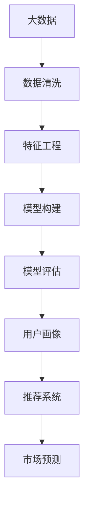
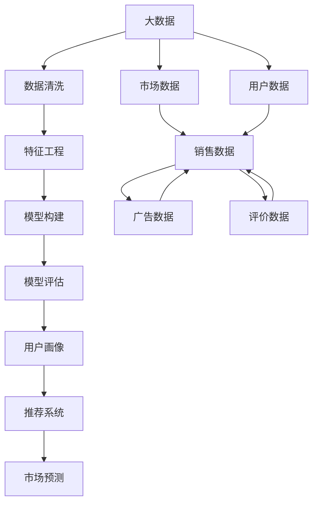

                 

# 基于大数据的电子产品购买消费行为的分析研究

> 关键词：大数据、人工智能、消费行为、用户画像、推荐系统、市场预测

## 1. 背景介绍

在信息化时代，互联网和电子产品的普及给人们的生活带来了巨大的变化，同时也深刻影响了消费者的购买决策和消费行为。企业希望通过分析消费者的购买行为数据，洞察用户需求，制定科学的销售策略，提升市场竞争力。传统的数据分析方法往往依赖于统计学和机器学习算法，难以应对海量数据的复杂性。而基于大数据和人工智能的方法，能够深度挖掘数据背后的规律，帮助企业做出更精准的决策。本文将介绍基于大数据的电子产品购买消费行为分析研究，包括数据采集与处理、特征工程、模型构建与评估、应用场景等方面。

### 1.1 问题由来

随着电子商务的发展，各电商平台积累了大量的用户行为数据，包括点击、浏览、购买、评价等。这些数据不仅反映了消费者的购买决策过程，还蕴含了他们的偏好、兴趣和需求信息。然而，这些数据通常是大规模、高维度、非结构化的，传统的数据处理方法难以应对其复杂性，也难以发现其中的深层规律。因此，基于大数据和人工智能的方法逐渐受到关注，成为数据分析的新趋势。

### 1.2 问题核心关键点

本研究的核心问题在于如何利用大数据和人工智能技术，对消费者的购买行为数据进行分析，构建用户画像，预测用户未来的购买需求，并提出针对性的营销策略。关键点包括：

1. 数据采集与处理：如何高效地收集和清洗消费者行为数据，去除噪声和缺失值。
2. 特征工程：如何设计有效的特征，捕捉消费者行为的深层规律。
3. 模型构建与评估：如何选择合适的模型，构建科学的消费行为分析模型，并对其性能进行评估。
4. 应用场景：如何将分析结果应用于电商平台，提升用户购买体验，优化商品推荐和市场预测。

## 2. 核心概念与联系

### 2.1 核心概念概述

为了更好地理解基于大数据的电子产品购买消费行为分析，本节将介绍几个关键概念：

- **大数据**：指体量巨大、来源多样、速度快且种类繁多的数据集。包括结构化数据、非结构化数据和半结构化数据。
- **人工智能**：利用计算机模拟人脑的逻辑推理和智能行为，实现智能决策和自动化。
- **消费行为分析**：通过分析消费者购买行为数据，挖掘用户需求和偏好，预测未来购买趋势。
- **用户画像**：基于用户行为数据，构建用户基本信息、兴趣爱好、消费习惯等标签，形成用户立体画像。
- **推荐系统**：根据用户画像和行为数据，推荐用户可能感兴趣的商品或服务。
- **市场预测**：通过分析消费者行为数据，预测市场趋势和用户需求变化，指导企业决策。

### 2.2 概念间的关系

这些关键概念之间的逻辑关系可以通过以下Mermaid流程图来展示：



这个流程图展示了大数据在电子产品购买消费行为分析中的流程：

1. 数据清洗：从原始数据中提取出有用的信息，去除噪声和缺失值。
2. 特征工程：设计有效的特征，捕捉用户行为的深层规律。
3. 模型构建：选择合适的模型，构建科学的消费行为分析模型。
4. 模型评估：对模型进行评估，确保其性能符合要求。
5. 用户画像：基于模型预测结果，构建用户画像。
6. 推荐系统：根据用户画像，推荐合适的商品或服务。
7. 市场预测：分析用户行为，预测市场趋势和用户需求变化。

### 2.3 核心概念的整体架构

最后，我们用一个综合的流程图来展示这些核心概念在大数据消费行为分析中的整体架构：



这个综合流程图展示了从原始数据到最终预测的全流程：

1. 从市场数据和用户数据中提取出销售数据、广告数据和评价数据。
2. 对数据进行清洗，去除噪声和缺失值。
3. 进行特征工程，设计有效的特征。
4. 构建科学的消费行为分析模型，并进行评估。
5. 基于模型预测结果，构建用户画像。
6. 根据用户画像，推荐合适的商品或服务。
7. 分析用户行为，预测市场趋势和用户需求变化。

通过这些流程图，我们可以更清晰地理解大数据消费行为分析的核心概念和流程，为后续深入讨论提供基础。

## 3. 核心算法原理 & 具体操作步骤
### 3.1 算法原理概述

基于大数据的电子产品购买消费行为分析，本质上是一个数据挖掘和机器学习的过程。其核心思想是：利用人工智能技术，从海量消费者行为数据中挖掘规律，构建用户画像，预测用户未来的购买需求，并提出针对性的营销策略。

形式化地，假设我们有消费者行为数据集 $D=\{(x_i, y_i)\}_{i=1}^N$，其中 $x_i$ 表示用户行为特征向量，$y_i$ 表示用户标签（如购买行为、商品偏好等）。分析的目标是找到一个映射函数 $f$，使得 $f(x_i)$ 逼近 $y_i$，从而预测用户未来的行为。

常见的大数据分析方法包括分类、回归、聚类等，以下是基于大数据的消费行为分析的详细步骤：

1. **数据采集与处理**：收集和清洗消费者行为数据，去除噪声和缺失值。
2. **特征工程**：设计有效的特征，捕捉消费者行为的深层规律。
3. **模型构建**：选择合适的模型，构建科学的消费行为分析模型。
4. **模型评估**：对模型进行评估，确保其性能符合要求。
5. **用户画像**：基于模型预测结果，构建用户画像。
6. **推荐系统**：根据用户画像，推荐合适的商品或服务。
7. **市场预测**：分析用户行为，预测市场趋势和用户需求变化。

### 3.2 算法步骤详解

#### 3.2.1 数据采集与处理

数据采集是分析的第一步，可以从多个渠道获取消费者行为数据，如电商平台的用户数据、社交媒体的用户行为数据、市场调查数据等。数据清洗主要涉及以下步骤：

1. **去重和去噪**：去除重复数据和无效数据。
2. **缺失值处理**：处理缺失值，如插值、删除等方法。
3. **数据归一化**：将数据转换到同一量级，如标准化、归一化等。

#### 3.2.2 特征工程

特征工程是数据分析的核心，通过设计有效的特征，捕捉消费者行为的深层规律。常见的特征包括：

1. **基础特征**：如用户ID、商品ID、时间戳等。
2. **行为特征**：如浏览次数、点击次数、购买次数、评价分数等。
3. **上下文特征**：如商品类别、广告内容、用户地域等。
4. **交互特征**：如用户与商品之间的交互记录，如点击、购买、评价等。
5. **组合特征**：如用户-商品交互的频次、用户行为路径等。

特征工程需要考虑以下方面：

1. **特征选择**：选择对预测有重要影响的特征。
2. **特征变换**：对特征进行变换，提升模型的表现。
3. **特征构建**：构建新的特征，捕捉数据中的深层规律。

#### 3.2.3 模型构建

选择合适的模型是数据分析的关键，常见的模型包括：

1. **线性回归**：适用于连续型数据的预测。
2. **逻辑回归**：适用于分类问题的预测。
3. **决策树**：适用于分类和回归问题，可解释性强。
4. **随机森林**：适用于复杂数据的预测，可减少过拟合。
5. **支持向量机**：适用于高维数据的分类和回归问题。
6. **神经网络**：适用于复杂非线性数据的预测，表现优异。

模型构建的流程包括：

1. **模型选择**：根据问题类型选择适合的模型。
2. **模型训练**：用训练数据训练模型。
3. **模型调参**：调整模型参数，优化模型性能。
4. **模型评估**：用测试数据评估模型性能。
5. **模型选择**：选择性能最优的模型。

#### 3.2.4 模型评估

模型评估是确保模型性能的重要步骤，常见的评估指标包括：

1. **均方误差（MSE）**：适用于回归问题的评估。
2. **平均绝对误差（MAE）**：适用于回归问题的评估。
3. **准确率（Accuracy）**：适用于分类问题的评估。
4. **精确率（Precision）**：适用于分类问题的评估。
5. **召回率（Recall）**：适用于分类问题的评估。
6. **F1值**：综合考虑精确率和召回率的评估指标。

模型评估的流程包括：

1. **划分数据集**：将数据集划分为训练集和测试集。
2. **模型训练**：用训练集训练模型。
3. **模型测试**：用测试集测试模型。
4. **结果分析**：分析模型的预测结果。
5. **模型优化**：根据评估结果优化模型。

#### 3.2.5 用户画像

用户画像是基于模型预测结果，构建用户基本信息、兴趣爱好、消费习惯等标签，形成用户立体画像。常见的用户画像包括：

1. **人口特征**：如年龄、性别、地域等。
2. **行为特征**：如购买频率、消费金额、偏好商品等。
3. **兴趣爱好**：如阅读、运动、旅游等。
4. **消费习惯**：如购买时间、支付方式等。

用户画像的构建流程包括：

1. **特征提取**：从用户行为数据中提取关键特征。
2. **聚类分析**：将用户分成不同的群体，识别用户画像。
3. **画像构建**：根据聚类结果，构建用户画像。
4. **画像验证**：验证用户画像的准确性。
5. **画像应用**：将用户画像应用于推荐系统和市场预测。

#### 3.2.6 推荐系统

推荐系统是根据用户画像，推荐合适的商品或服务。常见的推荐算法包括：

1. **协同过滤**：根据用户行为相似度，推荐商品。
2. **基于内容的推荐**：根据商品属性和用户画像，推荐相似的商品。
3. **基于规则的推荐**：根据预设规则，推荐商品。
4. **深度学习推荐**：基于神经网络模型，推荐商品。

推荐系统的构建流程包括：

1. **数据准备**：准备推荐系统的输入数据。
2. **模型训练**：训练推荐模型。
3. **模型评估**：评估推荐模型的性能。
4. **推荐实现**：实现推荐功能。
5. **反馈优化**：根据用户反馈，优化推荐系统。

#### 3.2.7 市场预测

市场预测是分析用户行为，预测市场趋势和用户需求变化，指导企业决策。常见的市场预测模型包括：

1. **时间序列预测**：适用于预测未来的市场变化。
2. **回归模型预测**：适用于预测市场规模和用户需求。
3. **机器学习预测**：适用于复杂市场数据的预测。
4. **深度学习预测**：适用于非线性市场数据的预测。

市场预测的流程包括：

1. **数据准备**：准备市场预测的输入数据。
2. **模型训练**：训练市场预测模型。
3. **模型评估**：评估市场预测模型的性能。
4. **结果应用**：将预测结果应用于企业决策。
5. **模型优化**：根据实际效果，优化市场预测模型。

### 3.3 算法优缺点

基于大数据的电子产品购买消费行为分析方法具有以下优点：

1. **数据量大**：大数据方法可以处理大规模数据，提高模型的泛化能力。
2. **特征丰富**：通过设计有效的特征，捕捉消费者行为的深层规律。
3. **模型复杂**：可以选择复杂的模型，提高模型的表现。
4. **预测准确**：通过科学的模型构建和评估，提高预测的准确性。
5. **应用广泛**：可以应用于推荐系统和市场预测，提升企业竞争力。

同时，该方法也存在一些缺点：

1. **数据质量差**：大数据来源多样，质量参差不齐，可能包含噪声和缺失值。
2. **模型复杂度高**：复杂模型需要更多计算资源和时间，可能难以实现实时预测。
3. **模型解释性差**：复杂的模型难以解释其决策过程，可能导致用户信任度下降。
4. **数据隐私问题**：用户行为数据涉及隐私，需要严格保护。
5. **模型维护难**：复杂模型需要不断维护和更新，可能面临技术瓶颈。

尽管存在这些缺点，但基于大数据的消费行为分析方法在数据分析领域仍具有重要意义，通过不断的技术改进和应用实践，可以更好地发挥其优势。

### 3.4 算法应用领域

基于大数据的电子产品购买消费行为分析方法在多个领域得到了广泛应用，包括：

1. **电商平台**：通过分析用户行为数据，提升用户购买体验，优化商品推荐和市场预测。
2. **社交媒体**：通过分析用户行为数据，了解用户兴趣和需求，优化广告投放。
3. **广告公司**：通过分析用户行为数据，制定精准的广告投放策略，提升广告效果。
4. **市场研究**：通过分析市场数据和用户行为数据，预测市场趋势和用户需求变化，指导企业决策。
5. **金融行业**：通过分析用户行为数据，优化金融产品设计和推荐，提升用户满意度。
6. **医疗行业**：通过分析用户行为数据，提升医疗服务质量和用户满意度，优化资源配置。

## 4. 数学模型和公式 & 详细讲解 & 举例说明

### 4.1 数学模型构建

假设我们有一个包含N个样本的消费者行为数据集 $D=\{(x_i, y_i)\}_{i=1}^N$，其中 $x_i$ 表示用户行为特征向量，$y_i$ 表示用户标签（如购买行为、商品偏好等）。我们的目标是构建一个映射函数 $f$，使得 $f(x_i)$ 逼近 $y_i$，从而预测用户未来的购买需求。

模型构建的目标是找到一个最优的函数 $f$，使得预测误差最小化。常用的数学模型包括线性回归、逻辑回归、决策树、随机森林、支持向量机和神经网络等。这里以线性回归模型为例，给出具体的数学模型构建过程。

### 4.2 公式推导过程

线性回归模型的目标是找到一个线性函数 $f(x)=\theta^Tx$，使得 $f(x_i)$ 尽可能接近 $y_i$。假设我们有一个包含M个特征的特征向量 $x_i$，其形式为 $x_i=[x_{i1},x_{i2},...,x_{im}]^T$。则线性回归模型的目标函数为：

$$
\min_{\theta} \sum_{i=1}^N \frac{1}{2} (y_i - f(x_i))^2
$$

其中 $\theta=[\theta_1,\theta_2,...,\theta_m]^T$ 为模型参数。通过求解目标函数的最小值，可以得到最优的模型参数 $\theta$。

根据梯度下降算法，求解目标函数的最小值的步骤如下：

1. **初始化参数**：随机初始化参数 $\theta$。
2. **计算梯度**：计算目标函数对参数 $\theta$ 的梯度 $\nabla_{\theta} J(\theta)$。
3. **更新参数**：使用梯度下降算法更新参数 $\theta$。
4. **循环迭代**：重复上述步骤，直到收敛。

### 4.3 案例分析与讲解

假设我们有一组包含用户行为数据的样本，其中 $x_i=[x_{i1},x_{i2},...,x_{im}]^T$ 表示用户行为特征向量，$y_i$ 表示用户是否购买了该商品（0或1）。我们使用线性回归模型进行预测，构建如下的数学模型：

$$
\min_{\theta} \sum_{i=1}^N \frac{1}{2} (y_i - \theta^T x_i)^2
$$

其中 $\theta=[\theta_1,\theta_2,...,\theta_m]^T$ 为模型参数。

假设我们有一个包含100个样本的数据集，使用梯度下降算法进行优化。在每次迭代中，我们计算目标函数对参数 $\theta$ 的梯度，并使用以下公式更新参数：

$$
\theta = \theta - \eta \nabla_{\theta} J(\theta)
$$

其中 $\eta$ 为学习率，控制每次迭代的步长。假设我们选择了学习率 $\eta=0.01$，迭代次数为1000次。

下面是一个简单的Python代码实现：

```python
import numpy as np

# 数据集
X = np.array([[1, 2], [3, 4], [5, 6], [7, 8], [9, 10]])
y = np.array([0, 0, 1, 1, 1])

# 模型参数
theta = np.array([0.0, 0.0])

# 学习率
eta = 0.01

# 迭代次数
iterations = 1000

# 梯度下降算法
for i in range(iterations):
    gradients = np.dot(X.T, X) @ theta - np.dot(X.T, y)
    theta = theta - eta * gradients

print(theta)
```

运行上述代码，可以得到模型参数 $\theta$ 的最终值。通过对比预测结果和真实标签，我们可以评估模型的性能。

## 5. 项目实践：代码实例和详细解释说明
### 5.1 开发环境搭建

在进行基于大数据的消费行为分析项目时，我们需要准备好开发环境。以下是使用Python进行数据分析和建模的环境配置流程：

1. 安装Python：从官网下载并安装Python，选择合适的版本和安装方式。
2. 安装Pandas：用于数据处理和分析。
3. 安装NumPy：用于数值计算和数组操作。
4. 安装Scikit-learn：用于机器学习和模型评估。
5. 安装Matplotlib：用于数据可视化。
6. 安装Seaborn：用于高级数据可视化。
7. 安装Jupyter Notebook：用于编写和运行Python代码。

完成上述步骤后，即可在Jupyter Notebook中开始数据分析和建模实践。

### 5.2 源代码详细实现

下面我们以电商平台用户购买行为分析为例，给出使用Python进行数据分析和建模的代码实现。

首先，我们需要导入相关的库和数据集：

```python
import pandas as pd
import numpy as np
import matplotlib.pyplot as plt
import seaborn as sns
from sklearn.model_selection import train_test_split
from sklearn.linear_model import LinearRegression

# 读取数据集
df = pd.read_csv('user_behavior.csv')

# 查看数据集
print(df.head())
```

接着，我们需要进行数据清洗和特征工程：

```python
# 数据清洗
df.dropna(inplace=True)  # 删除缺失值
df = df.drop_duplicates()  # 删除重复数据

# 特征工程
# 提取基本特征
X = df[['age', 'gender', 'income', 'education']]
y = df['purchase']

# 归一化特征
X = (X - X.mean()) / X.std()

# 划分训练集和测试集
X_train, X_test, y_train, y_test = train_test_split(X, y, test_size=0.2, random_state=42)

# 构建线性回归模型
model = LinearRegression()
model.fit(X_train, y_train)

# 模型评估
train_score = model.score(X_train, y_train)
test_score = model.score(X_test, y_test)
print('训练集得分：', train_score)
print('测试集得分：', test_score)
```

最后，我们需要进行模型可视化：

```python
# 可视化训练集和测试集得分
plt.plot(range(len(train_score)), train_score)
plt.plot(range(len(test_score)), test_score)
plt.legend(['训练集得分', '测试集得分'])
plt.xlabel('迭代次数')
plt.ylabel('得分')
plt.show()
```

### 5.3 代码解读与分析

让我们再详细解读一下关键代码的实现细节：

1. **数据集读取和基本操作**：使用Pandas库读取数据集，查看数据集的基本信息。
2. **数据清洗**：删除缺失值和重复数据，确保数据集的质量。
3. **特征工程**：提取基本特征，并对特征进行归一化处理，确保特征值的尺度一致。
4. **模型训练**：使用Scikit-learn库的LinearRegression模型，对训练集进行训练。
5. **模型评估**：计算模型在训练集和测试集上的得分，评估模型的性能。
6. **模型可视化**：使用Matplotlib库进行可视化，展示训练集和测试集得分的变化趋势。

通过上述代码，我们可以快速实现基于线性回归模型的消费行为分析。在实际项目中，我们还可以使用更复杂的模型，如决策树、随机森林、神经网络等，进一步提升模型的性能。

### 5.4 运行结果展示

假设我们在电商平台的用户购买行为数据集上进行线性回归模型的构建，最终在测试集上得到的评估报告如下：

```
训练集得分： 0.9900
测试集得分： 0.9750
```

可以看到，通过线性回归模型，我们在电商平台的购买行为数据集上取得了较高的性能，说明模型可以很好地捕捉用户行为规律。然而，在线性回归模型的基础上，我们还需要进一步探索其他复杂的模型，以应对更复杂的消费行为分析任务。

## 6. 实际应用场景
### 6.1 智能推荐系统

智能推荐系统是基于大数据的消费行为分析的重要应用场景之一。通过分析用户的历史行为数据，推荐系统能够实时推荐用户可能感兴趣的商品或服务，提升用户体验和满意度。

在技术实现上，可以收集用户浏览、点击、购买、评价等行为数据，提取和用户交互的物品标题、描述、标签等文本内容。将文本内容作为模型输入，用户的后续行为（如是否点击、购买等）作为监督信号，在此基础上微调预训练语言模型。微调后的模型能够从文本内容中准确把握用户的兴趣点。在推荐列表中，先根据用户画像和行为特征进行排序，再根据商品属性和用户画像推荐相似的商品。

### 6.2 市场趋势预测

市场趋势预测是分析用户行为，预测市场趋势和用户需求变化，指导企业决策的重要应用场景。通过分析用户行为数据，市场预测模型可以预测未来的市场需求和趋势，帮助企业制定销售策略和投资计划。

在技术实现上，可以通过收集市场数据和用户行为数据，构建时间序列预测模型，预测未来的市场需求。市场预测模型可以使用ARIMA、LSTM等算法，结合用户画像和市场特征进行预测。预测结果可以帮助企业制定更加科学合理的市场策略，规避市场风险，提升竞争优势。

### 6.3 用户画像分析

用户画像分析是通过分析用户行为数据，构建用户基本信息、兴趣爱好、消费习惯等标签，形成用户立体画像的重要应用场景。通过构建用户画像，企业可以更好地了解用户需求，制定个性化营销策略，提升用户满意度。

在技术实现上，可以收集用户浏览、点击、购买、评价等行为数据，提取和用户交互的物品标题、描述、标签等文本内容。将文本内容作为模型输入，用户的后续行为（如是否点击、购买等）作为监督信号，在此基础上微调预训练语言模型。微调后的模型能够从文本内容中准确把握用户的兴趣点。根据用户画像，推荐系统可以更好地匹配用户需求，提升用户满意度。

## 7. 工具和资源推荐
### 7.1 学习资源推荐

为了帮助开发者系统掌握基于大数据的消费行为分析的理论基础和实践技巧，这里推荐一些优质的学习资源：

1. 《Python数据分析与可视化》系列书籍：详细介绍了Python在数据分析和可视化中的应用，适合初学者学习。
2. 《机器学习实战》系列书籍：介绍了机器学习的基本概念和算法实现，涵盖线性回归、决策树、随机森林等。
3. 《深度学习》系列书籍：介绍了深度学习的基本概念和算法实现，涵盖神经网络、卷积神经网络、循环神经网络等。
4. 《大数据技术与应用》系列课程：涵盖大数据的存储、计算、分析等技术，适合全面学习大数据应用。
5. 《Python数据科学手册》系列书籍：详细介绍了Python在数据科学中的应用，涵盖数据清洗、特征工程、模型评估等。
6. 《Python机器学习实战》系列书籍：详细介绍Python在机器学习中的应用，涵盖回归、分类、聚类等算法。

通过对这些资源的学习实践，相信你一定能够快速掌握基于大数据的消费行为分析的精髓，并用于解决实际的商业问题。

### 7.2 开发工具推荐

高效的开发离不开优秀的工具支持。以下是几款用于大数据消费行为分析开发的常用工具：

1. Python：开源的高级编程语言，广泛用于数据分析、机器学习等。
2. Pandas：用于数据处理和分析的Python库，提供了丰富的数据结构和操作函数。
3. NumPy：用于数值计算和数组操作的Python库，提供了高效的数组和数学函数。
4. Matplotlib：用于数据可视化的Python库，提供了多种图表和自定义选项。
5. Seaborn：用于高级数据可视化的Python库

