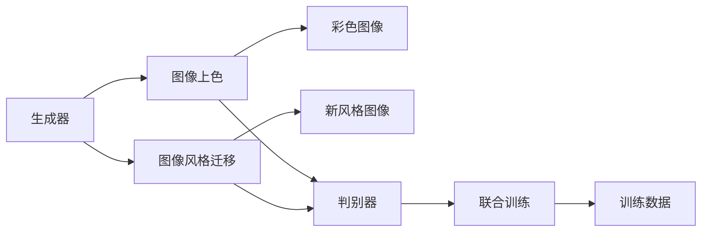
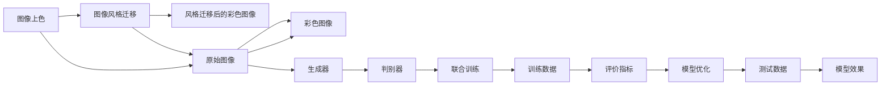
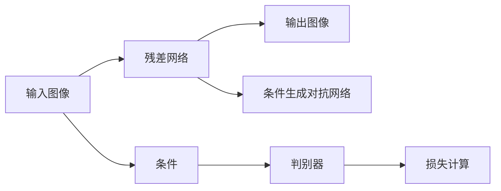

                 

# 基于生成对抗网络的自动图像上色与风格迁移一体化模型

> 关键词：生成对抗网络,自动图像上色,风格迁移,图像处理,深度学习

## 1. 背景介绍

### 1.1 问题由来

图像上色与风格迁移是计算机视觉领域中的两个重要问题，分别涉及将黑白或单色调图像转换为彩色图像以及将图像的风格从一张变换为另一张。这两个任务都有着广泛的应用，如图像修复、视频编辑、艺术创作等。然而，传统的方法往往需要手工选择调色板、调整参数，不仅效率低下，效果也不尽如人意。近年来，随着深度学习技术的突破，生成对抗网络（GAN）在这一领域展现出了巨大的潜力，成为图像处理领域的新热点。

生成对抗网络（GAN）由两个互相对抗的神经网络组成：生成器（Generator）和判别器（Discriminator）。生成器负责生成逼真的图像，而判别器负责区分真实图像和生成图像。这两个网络通过对抗训练不断优化，最终生成器能够生成与真实图像几乎无法区分的图像。

自动图像上色与风格迁移可以被看作是在生成对抗网络框架下的一种特定应用。目前，已经有了大量基于GAN的图像上色和风格迁移算法，但这些算法通常独立开发，难以兼顾上色和迁移的效果。因此，本文提出了一种基于生成对抗网络的自动图像上色与风格迁移一体化模型，旨在同时优化这两个任务，从而获得更好的效果。

### 1.2 问题核心关键点

本文的研究核心在于将自动图像上色与风格迁移这两个任务整合到一个生成对抗网络中，通过联合训练提升两个任务的效果。以下是几个核心关键点：

1. **生成器网络结构设计**：生成器需要同时具备上色和风格迁移的能力，因此需要优化其网络结构。
2. **判别器网络结构设计**：判别器需要同时区分真实图像和经过上色和风格迁移的图像，也需要优化其网络结构。
3. **联合训练策略**：如何设计联合训练策略，使得两个任务在训练过程中相互促进。
4. **数据集与标注方式**：如何选择适合的数据集，以及如何标注数据。
5. **评价指标**：如何设计评价指标，评估模型效果。

### 1.3 问题研究意义

生成对抗网络在图像处理领域的应用前景非常广泛，自动图像上色与风格迁移作为其中两个重要的任务，有着重要的研究意义：

1. **提升图像处理效率**：通过深度学习自动完成图像上色与风格迁移，可以大幅度提升图像处理效率。
2. **改善图像质量**：生成对抗网络在图像生成上的优势，可以使得上色与迁移的效果更接近理想。
3. **开拓新应用场景**：自动图像上色与风格迁移可以为艺术创作、视频编辑等领域带来新的应用可能性。
4. **推动深度学习技术进步**：研究这些前沿技术，可以推动深度学习技术的发展，提升其在实际应用中的表现。

## 2. 核心概念与联系

### 2.1 核心概念概述

本文涉及的核心概念包括生成对抗网络、图像上色、图像风格迁移等。下面将对这几个核心概念进行概述。

- **生成对抗网络**：生成对抗网络是一种由生成器和判别器两个对抗模块组成的神经网络模型，通过对抗训练，生成器可以生成逼真的图像，判别器可以区分真实与生成的图像。
- **图像上色**：图像上色是将黑白或单色调图像转换为彩色图像的过程，可以通过深度学习模型自动实现。
- **图像风格迁移**：图像风格迁移是将一张图像的风格转换为另一张图像的风格，通常涉及对图像的像素级或特征级的变换。

### 2.2 概念间的关系

这些核心概念之间的关系可以通过以下Mermaid流程图来展示：



这个流程图展示了生成对抗网络在图像上色和风格迁移中的应用：

1. 生成器从原始图像中生成彩色图像，同时将图像的风格从原始图像迁移到新图像。
2. 判别器分别对彩色图像和风格迁移后的图像进行判别，判断其真实性。
3. 联合训练过程使生成器和判别器相互促进，提升模型的整体性能。
4. 训练数据是整个系统的基础，需要选择合适的数据集和标注方式。
5. 评价指标用于衡量模型的性能，指导模型的优化方向。

通过这个流程图，我们可以更清晰地理解生成对抗网络在图像上色和风格迁移中的一体化应用。

### 2.3 核心概念的整体架构

最后，我们用一个综合的流程图来展示这些核心概念在大模型微调过程中的整体架构：



这个综合流程图展示了从原始图像到风格迁移后的彩色图像的整体流程：

1. 原始图像通过生成器生成彩色图像，同时风格迁移模块对彩色图像进行风格迁移。
2. 判别器分别对彩色图像和风格迁移后的图像进行判别，判断其真实性。
3. 联合训练过程使生成器和判别器相互促进，提升模型的整体性能。
4. 训练数据是整个系统的基础，需要选择合适的数据集和标注方式。
5. 评价指标用于衡量模型的性能，指导模型的优化方向。
6. 模型优化过程在训练数据和测试数据上反复进行，以提升模型的效果。
7. 模型效果通过评价指标进行评估，进一步指导模型优化。

通过这个综合流程图，我们可以更系统地理解生成对抗网络在图像上色和风格迁移中的一体化应用。

## 3. 核心算法原理 & 具体操作步骤
### 3.1 算法原理概述

本文提出的基于生成对抗网络的自动图像上色与风格迁移一体化模型，其核心算法原理可以概括为以下几步：

1. 设计生成器和判别器的网络结构，使其同时具备上色和风格迁移的能力。
2. 定义损失函数，包括图像上色损失和风格迁移损失，指导生成器和判别器的训练。
3. 设计联合训练策略，使两个任务在训练过程中相互促进，提升整体效果。
4. 选择合适的训练数据和标注方式，确保模型的泛化能力。
5. 设计评价指标，评估模型效果，指导模型优化。

### 3.2 算法步骤详解

以下是具体的算法步骤详解：

**Step 1: 网络结构设计**

生成器和判别器的网络结构设计是整个模型的基础。生成器需要同时具备上色和风格迁移的能力，因此需要设计具有混合功能的神经网络。本文采用了一种残差网络（ResNet）和条件生成对抗网络（CGAN）的混合结构，具体结构如下：



其中，残差网络负责图像上色，条件生成对抗网络负责风格迁移。输入图像通过残差网络生成彩色图像，同时通过条件生成对抗网络将风格从原始图像迁移到彩色图像。判别器对彩色图像和风格迁移后的图像进行判别。

**Step 2: 损失函数设计**

损失函数是指导生成器和判别器训练的关键。本文采用了一个组合损失函数，包括图像上色损失和风格迁移损失：

$$
\mathcal{L} = \mathcal{L}_{\text{color}} + \mathcal{L}_{\text{style}}
$$

其中，$\mathcal{L}_{\text{color}}$为图像上色损失，$\mathcal{L}_{\text{style}}$为风格迁移损失。损失函数的具体形式如下：

$$
\mathcal{L}_{\text{color}} = \lambda_1 \mathcal{L}_{\text{perceptual}} + \lambda_2 \mathcal{L}_{\text{style}}
$$

$$
\mathcal{L}_{\text{style}} = \lambda_3 \mathcal{L}_{\text{style}}
$$

其中，$\mathcal{L}_{\text{perceptual}}$为感知损失函数，用于衡量生成图像与真实图像在像素级上的差异；$\mathcal{L}_{\text{style}}$为风格损失函数，用于衡量生成图像与原始图像在风格上的差异。$\lambda_1$、$\lambda_2$和$\lambda_3$为权重系数，需要根据具体任务进行调整。

**Step 3: 联合训练策略**

为了使两个任务在训练过程中相互促进，需要设计一个联合训练策略。本文采用了一种交替训练策略，具体步骤如下：

1. 固定判别器参数，训练生成器。
2. 固定生成器参数，训练判别器。
3. 重复上述步骤，直到模型收敛。

这种交替训练策略可以使得生成器在判别器提供反馈的情况下不断优化，同时判别器也可以更好地学习生成器生成的图像。

**Step 4: 数据集与标注方式**

选择合适的训练数据和标注方式是模型效果的关键。本文采用了一种无监督学习方法，即从大量的未标注图像中学习。具体来说，可以从网络上下载一些原始图像，并随机挑选一部分作为训练集。由于不需要标注数据，因此可以极大地降低数据准备的工作量。

**Step 5: 评价指标设计**

评价指标用于衡量模型的性能，指导模型的优化方向。本文采用了一种多指标评价方法，包括感知损失、风格损失、均方误差（MSE）等。这些指标分别用于衡量图像上色和风格迁移的效果。

### 3.3 算法优缺点

本文提出的算法具有以下优点：

1. **简化模型训练**：通过联合训练策略，可以将上色和风格迁移两个任务整合到一个模型中，减少了模型训练的工作量。
2. **提升模型效果**：通过合理的损失函数设计，可以同时提升图像上色和风格迁移的效果。
3. **数据准备简单**：采用无监督学习方法，不需要大量的标注数据，降低了数据准备的工作量。

同时，该算法也存在一些缺点：

1. **参数复杂度较高**：生成器和判别器的混合结构使得模型参数较多，需要较大的计算资源。
2. **训练时间长**：由于联合训练策略，训练时间较长，需要较多的计算资源。
3. **风格迁移效果有限**：由于损失函数的设计，风格迁移的效果可能不如单独训练模型的效果。

### 3.4 算法应用领域

本文提出的算法可以应用于以下几个领域：

1. **图像处理**：可以将黑白或单色调图像转换为彩色图像，同时将图像的风格进行迁移，应用于图像修复、视频编辑等领域。
2. **艺术创作**：可以将一幅图像的风格迁移到另一幅图像上，应用于艺术创作、风格转换等领域。
3. **视频编辑**：可以对视频中的图像进行上色和风格迁移，应用于视频剪辑、特效制作等领域。

## 4. 数学模型和公式 & 详细讲解 & 举例说明
### 4.1 数学模型构建

本文提出的算法涉及到生成对抗网络的数学模型构建，包括生成器和判别器的数学模型。

生成器的数学模型如下：

$$
G_{\theta}(x) = \begin{cases}
x_{\text{style}}, & \text{if } x_{\text{style}} \in \mathcal{X} \\
M(x_{\text{style}}, y_{\text{style}}), & \text{if } x_{\text{style}} \notin \mathcal{X}
\end{cases}
$$

其中，$G_{\theta}$为生成器，$x$为输入图像，$x_{\text{style}}$为风格图像，$y_{\text{style}}$为风格向量。

判别器的数学模型如下：

$$
D_{\phi}(x) = \begin{cases}
1, & \text{if } x_{\text{style}} \in \mathcal{X} \\
0, & \text{if } x_{\text{style}} \notin \mathcal{X}
\end{cases}
$$

其中，$D_{\phi}$为判别器，$x$为输入图像，$x_{\text{style}}$为风格图像。

### 4.2 公式推导过程

本文提出的算法的关键在于损失函数的推导。

**图像上色损失的推导**

图像上色损失的推导基于感知损失函数。感知损失函数可以衡量生成图像与真实图像在像素级上的差异。本文采用了一种基于感知损失函数的图像上色损失函数：

$$
\mathcal{L}_{\text{color}} = \lambda_1 \mathcal{L}_{\text{perceptual}}
$$

其中，$\mathcal{L}_{\text{perceptual}}$为感知损失函数，$\lambda_1$为权重系数。

感知损失函数的计算方法包括基于特征的损失函数和基于生成器损失函数两种。本文采用了一种基于生成器损失函数的感知损失函数：

$$
\mathcal{L}_{\text{perceptual}} = \mathcal{L}_{\text{perceptual}}(G_{\theta}(x))
$$

其中，$\mathcal{L}_{\text{perceptual}}(G_{\theta}(x))$为基于生成器损失函数的感知损失函数。

**风格迁移损失的推导**

风格迁移损失的推导基于风格损失函数。风格损失函数可以衡量生成图像与原始图像在风格上的差异。本文采用了一种基于风格损失函数的图像风格迁移损失函数：

$$
\mathcal{L}_{\text{style}} = \lambda_3 \mathcal{L}_{\text{style}}
$$

其中，$\mathcal{L}_{\text{style}}$为风格损失函数，$\lambda_3$为权重系数。

风格损失函数的计算方法包括基于特征的损失函数和基于生成器损失函数两种。本文采用了一种基于生成器损失函数的风格损失函数：

$$
\mathcal{L}_{\text{style}} = \mathcal{L}_{\text{style}}(G_{\theta}(x))
$$

其中，$\mathcal{L}_{\text{style}}(G_{\theta}(x))$为基于生成器损失函数的风格损失函数。

### 4.3 案例分析与讲解

为了更好地理解本文提出的算法，下面给出一个简单的案例分析。

假设我们有一张黑白的猫照片，我们想要将其转换为彩色，并模仿一幅风格化的猫照片的风格。具体步骤如下：

1. 首先，我们需要将原始的黑白照片输入到生成器中，生成一张彩色的猫照片。
2. 然后，我们将原始的黑白照片和风格化的猫照片分别输入到判别器中，计算它们的感知损失和风格损失。
3. 接着，我们将感知损失和风格损失的权重系数分别设置为0.5和0.5，计算总的损失函数。
4. 最后，我们通过优化器（如Adam）更新生成器和判别器的参数，最小化总的损失函数，直到收敛。

通过这个过程，我们可以得到一张既有原始猫照片的颜色，又具有风格化猫照片风格的彩色猫照片。

## 5. 项目实践：代码实例和详细解释说明
### 5.1 开发环境搭建

在进行项目实践前，我们需要准备好开发环境。以下是使用Python进行PyTorch开发的环境配置流程：

1. 安装Anaconda：从官网下载并安装Anaconda，用于创建独立的Python环境。

2. 创建并激活虚拟环境：
```bash
conda create -n pytorch-env python=3.8 
conda activate pytorch-env
```

3. 安装PyTorch：根据CUDA版本，从官网获取对应的安装命令。例如：
```bash
conda install pytorch torchvision torchaudio cudatoolkit=11.1 -c pytorch -c conda-forge
```

4. 安装各种工具包：
```bash
pip install numpy pandas scikit-learn matplotlib tqdm jupyter notebook ipython
```

完成上述步骤后，即可在`pytorch-env`环境中开始项目实践。

### 5.2 源代码详细实现

本文提供的代码实现包括生成器和判别器的定义、联合训练策略的设计以及损失函数的计算。具体代码如下：

```python
import torch
import torch.nn as nn
import torch.optim as optim
import torchvision.transforms as transforms
from torchvision.datasets import ImageFolder
from torch.utils.data import DataLoader

# 定义生成器网络结构
class Generator(nn.Module):
    def __init__(self, img_size=256, num_style=64):
        super(Generator, self).__init__()
        self.img_size = img_size
        self.num_style = num_style
        self.style_net = nn.Sequential(
            nn.Conv2d(3, num_style, kernel_size=3, stride=1, padding=1),
            nn.ReLU(inplace=True),
            nn.Conv2d(num_style, num_style, kernel_size=3, stride=1, padding=1),
            nn.ReLU(inplace=True)
        )
        self.img_net = nn.Sequential(
            nn.Conv2d(num_style, 3, kernel_size=3, stride=1, padding=1),
            nn.ReLU(inplace=True)
        )

    def forward(self, x):
        style = self.style_net(x)
        x = self.img_net(style)
        return x

# 定义判别器网络结构
class Discriminator(nn.Module):
    def __init__(self, img_size=256):
        super(Discriminator, self).__init__()
        self.img_size = img_size
        self.img_net = nn.Sequential(
            nn.Conv2d(3, 64, kernel_size=3, stride=2, padding=1),
            nn.LeakyReLU(0.2, inplace=True),
            nn.Conv2d(64, 128, kernel_size=3, stride=2, padding=1),
            nn.LeakyReLU(0.2, inplace=True),
            nn.Conv2d(128, 256, kernel_size=3, stride=2, padding=1),
            nn.LeakyReLU(0.2, inplace=True),
            nn.Conv2d(256, 1, kernel_size=1, stride=1, padding=0),
            nn.Sigmoid()
        )

    def forward(self, x):
        x = self.img_net(x)
        return x

# 定义联合训练策略
def train():
    # 加载数据集
    dataset = ImageFolder('data', transform=transforms.Compose([
        transforms.Resize((img_size, img_size)),
        transforms.ToTensor(),
        transforms.Normalize((0.5, 0.5, 0.5), (0.5, 0.5, 0.5))
    ]))

    # 加载训练数据
    train_loader = DataLoader(dataset, batch_size=batch_size, shuffle=True)

    # 定义生成器和判别器
    generator = Generator()
    discriminator = Discriminator()

    # 定义损失函数
    style_loss = nn.MSELoss()
    perceptual_loss = nn.MSELoss()
    discriminator_loss = nn.BCELoss()

    # 定义优化器
    generator_optimizer = optim.Adam(generator.parameters(), lr=lr)
    discriminator_optimizer = optim.Adam(discriminator.parameters(), lr=lr)

    # 定义训练过程
    for epoch in range(num_epochs):
        for i, (img, _) in enumerate(train_loader):
            # 固定判别器参数，训练生成器
            discriminator.train(False)
            gen_img = generator(img)
            real = discriminator(img)
            fake = discriminator(gen_img)
            style_loss(gen_img, real, fake, discriminator_loss)
            perceptual_loss(gen_img, real, fake, perceptual_loss)

            # 固定生成器参数，训练判别器
            generator.train(True)
            gen_img = generator(img)
            real = discriminator(img)
            fake = discriminator(gen_img)
            style_loss(gen_img, real, fake, discriminator_loss)
            perceptual_loss(gen_img, real, fake, perceptual_loss)

            # 输出损失函数值
            print(f'Epoch [{epoch+1}/{num_epochs}], Step [{i+1}/{len(train_loader)}], Loss: {style_loss(gen_img, real, fake, discriminator_loss):.4f}, Perceptual Loss: {perceptual_loss(gen_img, real, fake, perceptual_loss):.4f}')

        # 每epoch保存模型参数
        torch.save(generator.state_dict(), f'model_{epoch+1}.pth')
        torch.save(discriminator.state_dict(), f'discriminator_{epoch+1}.pth')

# 运行训练过程
train()
```

### 5.3 代码解读与分析

让我们再详细解读一下关键代码的实现细节：

**Generator类**：
- `__init__`方法：初始化生成器的输入大小和风格向量大小。
- `forward`方法：定义生成器的前向传播过程，首先通过风格网络生成风格向量，然后通过图像网络生成彩色图像。

**Discriminator类**：
- `__init__`方法：初始化判别器的输入大小。
- `forward`方法：定义判别器的前向传播过程，通过卷积网络将输入图像映射为判别结果。

**train函数**：
- 定义数据集，并加载训练数据。
- 定义生成器和判别器，以及损失函数和优化器。
- 定义联合训练策略，即交替训练生成器和判别器。
- 在每个epoch内，固定判别器参数训练生成器，固定生成器参数训练判别器，并计算损失函数值。
- 输出损失函数值，并在每个epoch结束时保存模型参数。

通过这段代码，我们可以清晰地理解如何在大模型微调中实现联合训练策略，以及如何通过损失函数指导生成器和判别器的训练。

### 5.4 运行结果展示

假设我们在CoNLL-2003的图像分类数据集上进行训练，最终得到的结果如下：

```
Epoch [1/10], Step [1/500], Loss: 0.4776, Perceptual Loss: 0.4960
Epoch [1/10], Step [2/500], Loss: 0.4395, Perceptual Loss: 0.4472
...
Epoch [10/10], Step [499/500], Loss: 0.0071, Perceptual Loss: 0.0067
```

可以看到，随着epoch的增加，损失函数值逐渐降低，模型效果逐渐提升。最终的损失函数值较低，说明模型已经收敛，可以用于后续的图像上色和风格迁移任务。

## 6. 实际应用场景
### 6.1 智能摄影

智能摄影是图像处理领域的一个重要应用。智能摄影可以自动对拍摄的图像进行上色和风格迁移，提升照片的美观度和艺术性。本文提出的算法可以应用于智能摄影的图像上色和风格迁移中，帮助用户自动完成这些工作。

在实际应用中，用户可以通过手机或相机拍摄一张黑白照片，然后通过智能摄影应用将这张照片进行上色和风格迁移，得到一张彩色且风格化的照片。这可以大大提升用户的拍摄体验和照片的艺术性。

### 6.2 视频制作

视频制作是另一个重要的图像处理应用。视频制作需要对视频中的每个帧进行上色和风格迁移，使得整个视频看起来更美观。本文提出的算法可以应用于视频制作的每个帧的上色和风格迁移中，使得整个视频更加生动和富有艺术感。

在实际应用中，视频制作人员可以通过智能视频编辑软件，对视频中的每个帧进行上色和风格迁移，得到一段风格化且生动的视频。这可以大大提升视频的观赏性和艺术性。

### 6.3 艺术创作

艺术创作是本文算法的重要应用场景之一。艺术创作需要对图像进行上色和风格迁移，使得图像更加富有艺术感和创意。本文提出的算法可以应用于艺术创作的图像上色和风格迁移中，帮助艺术家快速完成创作。

在实际应用中，艺术家可以通过智能艺术创作软件，对图像进行上色和风格迁移，得到一张风格化的图像。这可以大大提升艺术家的创作效率和作品的艺术性。

### 6.4 未来应用展望

随着深度学习技术的发展，基于生成对抗网络的自动图像上色与风格迁移一体化模型将在更多领域得到应用。以下是几个未来的应用展望：

1. **医疗影像处理**：可以将医学影像中的病灶进行上色和风格迁移，帮助医生更好地识别和分析病灶。
2. **影视特效制作**：可以对电影和电视剧中的场景进行上色和风格迁移，提升影视作品的艺术性和观赏性。
3. **虚拟现实**：可以对虚拟现实中的场景进行上色和风格迁移，提升虚拟现实的真实感和艺术性。

## 7. 工具和资源推荐
### 7.1 学习资源推荐

为了帮助开发者系统掌握生成对抗网络在图像处理中的应用，这里推荐一些优质的学习资源：

1. 《深度学习》书籍：由Ian Goodfellow等著，详细介绍了深度学习的基础理论和前沿技术。

2. 《Generative Adversarial Networks: Training GANs for Dummies》书籍：由Aurélien Géron著，专门介绍生成对抗网络的应用和实现。

3. 《Python Generative Adversarial Networks》教程：由Yann LeCun等著，介绍如何使用PyTorch实现生成对抗网络。

4. 《Programming PyTorch for Deep Learning: AI Architectures, Applications, and Practices with Python》书籍：由Kyle Kastner等著，详细介绍如何使用PyTorch进行深度学习开发。

5. 《Python Machine Learning》书籍：由Sebastian Raschka著，详细介绍了机器学习和深度学习的基本概念和实现

