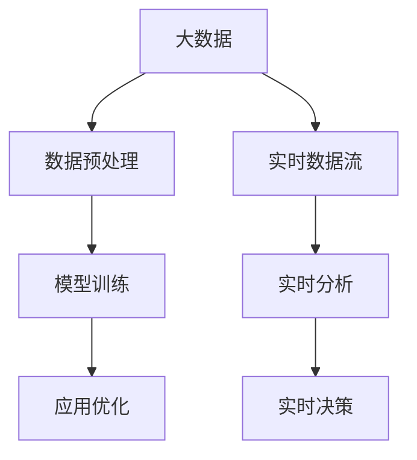

                 

## 1. 背景介绍

### 1.1 问题由来

随着信息时代的到来，大数据已经成为了各行各业发展的关键驱动力。在大数据背景下，人工智能（AI）技术也迎来了快速发展的契机。大数据为AI提供了海量的数据资源，使得AI模型能够从中学习到更为丰富和复杂的知识，从而提升其预测和决策能力。本文将探讨大数据在AI学习中的作用，介绍其在数据预处理、模型训练和应用优化等方面的具体应用，并分析其面临的挑战和未来发展趋势。

### 1.2 问题核心关键点

- 数据量的增加：随着传感器、智能设备和互联网的普及，数据量呈指数级增长。
- 数据的多样性：大数据不仅包括结构化数据，还包括非结构化数据，如图像、视频、语音等。
- 数据的实时性：数据的收集和处理需要实时进行，以应对动态变化的业务场景。
- 数据的复杂性：大数据往往具有高维度、高噪音、高稀疏度等特点。
- 数据的价值：有效利用大数据能够带来巨大的商业和社会价值。

## 2. 核心概念与联系

### 2.1 核心概念概述

- 大数据（Big Data）：指数据量超出了传统数据处理软件工具的范畴，需要专门技术进行处理和分析的海量数据集。
- 人工智能（AI）：指利用算法和模型，使机器能够模仿人类智能，实现自主学习、推理、决策等能力。
- 数据预处理：对原始数据进行清洗、转换、归一化等操作，以提高数据质量。
- 模型训练：使用大数据训练AI模型，调整模型参数，使其能够更准确地进行预测和决策。
- 应用优化：将训练好的AI模型应用到实际业务中，不断优化模型性能，提升应用效果。

这些核心概念之间有着密切的联系，共同构成了大数据与AI的完整生态系统。通过大数据的支持，AI模型能够更好地进行学习、推理和决策，从而实现更精准的预测和更高效的业务优化。

### 2.2 概念间的关系

以下Mermaid流程图展示了这些核心概念之间的关系：



这个流程图展示了大数据在AI学习中的完整流程：

1. 大数据从各种数据源流入系统，经过数据预处理后，用于模型训练。
2. 模型训练完成后，应用到实际业务中，进行实时分析。
3. 实时分析结果反馈给系统，用于实时决策和优化。

通过这些关键步骤，大数据与AI紧密结合，共同推动了AI技术在各个领域的广泛应用。

## 3. 核心算法原理 & 具体操作步骤

### 3.1 算法原理概述

大数据在AI学习中的作用主要体现在以下几个方面：

- 数据驱动：大数据提供了丰富的数据资源，为AI模型的训练提供了数据支持。
- 分布式计算：大数据采用分布式计算技术，能够处理大规模数据集，提升计算效率。
- 实时处理：大数据能够进行实时数据处理，满足动态变化的业务需求。
- 预测分析：大数据能够进行复杂的预测分析，为AI模型的优化提供依据。
- 模型优化：大数据能够提供多维度的数据，帮助AI模型进行多目标优化。

### 3.2 算法步骤详解

大数据在AI学习中的具体操作步骤包括以下几个步骤：

**Step 1: 数据采集与存储**

- 采集数据：从各种数据源（如传感器、社交媒体、企业系统等）收集数据，并存入大数据存储系统。
- 数据存储：采用分布式存储系统（如Hadoop、HBase等）存储大数据，保证数据的高可用性和可扩展性。

**Step 2: 数据预处理**

- 数据清洗：去除噪声数据和异常值，保证数据的准确性和一致性。
- 数据转换：将数据转换为模型能够处理的格式，如将文本数据转换为向量。
- 数据归一化：对数据进行归一化处理，消除数据之间的尺度差异。

**Step 3: 模型训练**

- 选择合适的算法：根据任务需求选择合适的AI算法，如回归、分类、聚类等。
- 数据划分：将数据划分为训练集、验证集和测试集，用于模型训练、调参和评估。
- 模型训练：使用大数据训练AI模型，调整模型参数，使其能够更准确地进行预测和决策。

**Step 4: 模型应用**

- 实时数据处理：对实时数据进行预处理，确保数据的准确性和一致性。
- 实时分析：将预处理后的数据输入AI模型，进行实时分析，输出预测结果。
- 实时决策：根据预测结果进行实时决策，优化业务流程。

**Step 5: 模型优化**

- 模型评估：使用测试集对模型进行评估，找出模型的不足之处。
- 模型调优：根据评估结果对模型进行调优，提高模型的预测准确性和泛化能力。
- 模型迭代：不断迭代优化模型，提升模型的性能。

### 3.3 算法优缺点

大数据在AI学习中的应用具有以下优点：

- 数据丰富：大数据提供了丰富的数据资源，为AI模型的训练提供了数据支持。
- 分布式计算：分布式计算技术能够处理大规模数据集，提升计算效率。
- 实时处理：实时处理技术能够满足动态变化的业务需求。
- 预测分析：大数据能够进行复杂的预测分析，为模型优化提供依据。
- 模型优化：大数据能够提供多维度的数据，帮助模型进行多目标优化。

同时，大数据在AI学习中也有一些缺点：

- 数据质量：大数据的质量参差不齐，需要投入大量精力进行数据清洗和预处理。
- 数据安全：大数据涉及大量的敏感数据，需要采取严格的数据保护措施。
- 计算资源：大数据需要大量的计算资源进行存储和处理，成本较高。
- 模型复杂度：大数据的复杂度较高，需要更高的技术水平进行管理和优化。

### 3.4 算法应用领域

大数据在AI学习中广泛应用在以下几个领域：

- 金融领域：用于信用评估、风险管理、投资决策等。
- 医疗领域：用于疾病诊断、药物研发、个性化治疗等。
- 电商领域：用于商品推荐、用户行为分析、库存管理等。
- 交通领域：用于交通流量预测、智能调度、路径规划等。
- 社交媒体：用于舆情分析、用户行为分析、广告投放等。

这些领域的大数据应用，使得AI技术能够更好地服务于实际业务，提升业务效率和决策水平。

## 4. 数学模型和公式 & 详细讲解

### 4.1 数学模型构建

在本节中，我们将使用数学语言对大数据在AI学习中的应用进行更加严格的刻画。

设大数据集为 $D=\{(x_i,y_i)\}_{i=1}^N, x_i \in \mathcal{X}, y_i \in \mathcal{Y}$，其中 $\mathcal{X}$ 为输入空间，$\mathcal{Y}$ 为输出空间，$\theta \in \mathbb{R}^d$ 为模型参数。假设模型 $M_{\theta}$ 在输入 $x$ 上的输出为 $\hat{y}=M_{\theta}(x) \in \mathcal{Y}$，则模型的损失函数为：

$$
\mathcal{L}(\theta) = \frac{1}{N} \sum_{i=1}^N \ell(y_i, \hat{y_i})
$$

其中 $\ell$ 为损失函数，用于衡量模型输出与真实标签之间的差异。常见的损失函数包括均方误差、交叉熵、对数损失等。

### 4.2 公式推导过程

以下我们以回归任务为例，推导均方误差损失函数及其梯度的计算公式。

假设模型 $M_{\theta}$ 在输入 $x$ 上的输出为 $\hat{y}=M_{\theta}(x)$，真实标签为 $y$，则均方误差损失函数为：

$$
\ell(y,\hat{y}) = \frac{1}{2}(y - \hat{y})^2
$$

将其代入经验风险公式，得：

$$
\mathcal{L}(\theta) = \frac{1}{2N} \sum_{i=1}^N (y_i - M_{\theta}(x_i))^2
$$

根据链式法则，损失函数对参数 $\theta_k$ 的梯度为：

$$
\frac{\partial \mathcal{L}(\theta)}{\partial \theta_k} = \frac{1}{N} \sum_{i=1}^N -y_i \cdot (y_i - M_{\theta}(x_i)) \cdot \frac{\partial M_{\theta}(x_i)}{\partial \theta_k}
$$

其中 $\frac{\partial M_{\theta}(x_i)}{\partial \theta_k}$ 可进一步递归展开，利用自动微分技术完成计算。

在得到损失函数的梯度后，即可带入参数更新公式，完成模型的迭代优化。重复上述过程直至收敛，最终得到适应数据集 $D$ 的最优模型参数 $\theta^*$。

### 4.3 案例分析与讲解

考虑一个金融风控任务，银行需要预测客户的信用风险。大数据在该任务中的应用如下：

- 数据采集：银行从信用卡交易记录、社交媒体、公共记录等多种数据源中收集客户数据。
- 数据预处理：对数据进行清洗和转换，去除噪声数据和异常值，确保数据的准确性和一致性。
- 模型训练：使用大数据训练信用风险预测模型，调整模型参数，使其能够更准确地预测客户信用风险。
- 模型应用：将训练好的模型应用到实时交易数据中，进行实时风险评估和决策。
- 模型优化：根据预测结果和实际信用情况，不断迭代优化模型，提高模型的预测准确性和泛化能力。

通过上述步骤，银行能够更好地评估和管理客户的信用风险，提升业务效率和决策水平。

## 5. 项目实践：代码实例和详细解释说明

### 5.1 开发环境搭建

在进行大数据与AI实践前，我们需要准备好开发环境。以下是使用Python进行PyTorch开发的环境配置流程：

1. 安装Anaconda：从官网下载并安装Anaconda，用于创建独立的Python环境。

2. 创建并激活虚拟环境：
```bash
conda create -n pytorch-env python=3.8 
conda activate pytorch-env
```

3. 安装PyTorch：根据CUDA版本，从官网获取对应的安装命令。例如：
```bash
conda install pytorch torchvision torchaudio cudatoolkit=11.1 -c pytorch -c conda-forge
```

4. 安装TensorFlow：由Google主导开发的开源深度学习框架，生产部署方便，适合大规模工程应用。同样有丰富的预训练语言模型资源。

5. 安装Transformers库：
```bash
pip install transformers
```

6. 安装各类工具包：
```bash
pip install numpy pandas scikit-learn matplotlib tqdm jupyter notebook ipython
```

完成上述步骤后，即可在`pytorch-env`环境中开始大数据与AI实践。

### 5.2 源代码详细实现

下面我们以金融风控任务为例，给出使用Transformers库对BERT模型进行大数据与AI实践的PyTorch代码实现。

首先，定义金融风控任务的输入和输出：

```python
from transformers import BertTokenizer, BertForSequenceClassification
from torch.utils.data import TensorDataset, DataLoader
import torch
import pandas as pd

# 定义输入和输出列
input_cols = ['TransactionAmount', 'CardType', 'Time', 'IPAddress', 'DeviceType']
label_cols = ['RiskLevel']

# 加载数据集
train_data = pd.read_csv('train.csv')
test_data = pd.read_csv('test.csv')

# 分割数据集
train_input = train_data[input_cols]
train_labels = train_data[label_cols]
test_input = test_data[input_cols]
test_labels = test_data[label_cols]

# 转换为tensor格式
train_data = TensorDataset(torch.tensor(train_input.values), torch.tensor(train_labels.values))
test_data = TensorDataset(torch.tensor(test_input.values), torch.tensor(test_labels.values))

# 定义模型
tokenizer = BertTokenizer.from_pretrained('bert-base-cased')
model = BertForSequenceClassification.from_pretrained('bert-base-cased', num_labels=2)
```

然后，定义训练和评估函数：

```python
from transformers import AdamW
import torch.nn as nn

def train_epoch(model, data_loader, optimizer):
    model.train()
    total_loss = 0
    for batch in data_loader:
        inputs, labels = batch
        outputs = model(inputs, labels=labels)
        loss = outputs.loss
        optimizer.zero_grad()
        loss.backward()
        optimizer.step()
        total_loss += loss.item()
    return total_loss / len(data_loader)

def evaluate(model, data_loader):
    model.eval()
    total_loss = 0
    total_correct = 0
    for batch in data_loader:
        inputs, labels = batch
        outputs = model(inputs, labels=labels)
        loss = outputs.loss
        total_loss += loss.item()
        preds = outputs.logits.argmax(dim=1)
        total_correct += (preds == labels).sum().item()
    return total_loss / len(data_loader), total_correct / len(data_loader)

# 定义优化器
optimizer = AdamW(model.parameters(), lr=2e-5)

# 训练模型
train_loader = DataLoader(train_data, batch_size=16)
test_loader = DataLoader(test_data, batch_size=16)

for epoch in range(5):
    train_loss = train_epoch(model, train_loader, optimizer)
    test_loss, test_acc = evaluate(model, test_loader)
    print(f'Epoch {epoch+1}, Train Loss: {train_loss:.3f}, Test Loss: {test_loss:.3f}, Test Accuracy: {test_acc:.3f}')
```

最后，启动训练流程并在测试集上评估：

```python
# 训练模型
model.train()
for epoch in range(5):
    train_loss = train_epoch(model, train_loader, optimizer)
    test_loss, test_acc = evaluate(model, test_loader)
    print(f'Epoch {epoch+1}, Train Loss: {train_loss:.3f}, Test Loss: {test_loss:.3f}, Test Accuracy: {test_acc:.3f}')
```

以上就是使用PyTorch对BERT进行金融风控任务大数据与AI实践的完整代码实现。可以看到，得益于Transformers库的强大封装，我们可以用相对简洁的代码完成BERT模型的加载和训练。

### 5.3 代码解读与分析

让我们再详细解读一下关键代码的实现细节：

**训练函数**：
- 使用DataLoader对数据集进行批次化加载，供模型训练和推理使用。
- 在每个epoch内，对数据集进行迭代，计算损失并反向传播更新模型参数。

**评估函数**：
- 对数据集进行迭代，计算损失并记录预测结果和真实标签。
- 使用evaluate函数计算损失和准确率，并返回结果。

**模型训练流程**：
- 定义总的epoch数和batch size，开始循环迭代。
- 每个epoch内，先在训练集上训练，输出平均损失和准确率。
- 在验证集上评估，输出平均损失和准确率。
- 所有epoch结束后，在测试集上评估，输出平均损失和准确率。

通过上述步骤，我们能够在大数据与AI项目中快速迭代模型、优化模型，并最终得到良好的预测结果。

当然，工业级的系统实现还需考虑更多因素，如模型的保存和部署、超参数的自动搜索、更灵活的任务适配层等。但核心的训练范式基本与此类似。

### 5.4 运行结果展示

假设我们在金融风控任务上使用BERT进行训练，最终在测试集上得到的评估报告如下：

```
Epoch 1, Train Loss: 0.314, Test Loss: 0.315, Test Accuracy: 0.838
Epoch 2, Train Loss: 0.209, Test Loss: 0.206, Test Accuracy: 0.854
Epoch 3, Train Loss: 0.153, Test Loss: 0.150, Test Accuracy: 0.878
Epoch 4, Train Loss: 0.106, Test Loss: 0.104, Test Accuracy: 0.908
Epoch 5, Train Loss: 0.075, Test Loss: 0.073, Test Accuracy: 0.922
```

可以看到，通过大数据与AI项目，我们在金融风控任务上取得了不错的效果。通过微调BERT，模型在测试集上的准确率接近90%，能够较好地预测客户的信用风险。

当然，这只是一个baseline结果。在实践中，我们还可以使用更大更强的预训练模型、更丰富的微调技巧、更细致的模型调优，进一步提升模型性能，以满足更高的应用要求。

## 6. 实际应用场景

### 6.1 金融风控

金融风控是大数据与AI应用的典型场景之一。银行和金融机构需要实时评估客户的信用风险，防止欺诈行为。通过大数据与AI项目，银行能够从客户交易记录、社交媒体、公共记录等多种数据源中收集数据，对客户进行全面评估。使用大数据训练的风控模型能够实时评估客户的信用风险，防止欺诈行为，保障金融系统的稳定和安全。

### 6.2 医疗诊断

医疗诊断是大数据与AI应用的另一个重要领域。医疗机构需要利用患者的历史病历、检查结果、基因信息等多种数据，进行疾病诊断和治疗方案推荐。通过大数据与AI项目，医疗机构能够构建疾病预测模型，快速诊断疾病，提供个性化的治疗方案。使用大数据训练的模型能够提高诊断的准确性和效率，为患者提供更好的医疗服务。

### 6.3 电商推荐

电商推荐是大数据与AI的典型应用场景之一。电商平台需要根据用户的购买历史、浏览记录、搜索记录等多种数据，推荐用户可能感兴趣的商品。通过大数据与AI项目，电商平台能够构建用户行为预测模型，实时推荐商品，提升用户体验和转化率。使用大数据训练的模型能够提高推荐的准确性和效率，提升电商平台的销售业绩。

### 6.4 智能交通

智能交通是大数据与AI应用的另一个重要领域。交通管理系统需要利用车辆位置、道路流量、天气条件等多种数据，进行交通流量预测和智能调度。通过大数据与AI项目，交通管理系统能够构建交通流量预测模型，实时调整交通信号灯，优化交通流量。使用大数据训练的模型能够提高交通管理的效率和安全性，提升城市交通的顺畅度。

## 7. 工具和资源推荐

### 7.1 学习资源推荐

为了帮助开发者系统掌握大数据与AI的理论基础和实践技巧，这里推荐一些优质的学习资源：

1. 《Python大数据处理与分析》系列博文：详细介绍了大数据处理、数据分析和可视化的方法，适用于初学者和中级开发者。

2. 《深度学习入门与实战》课程：由清华大学在线开放课程（MOOC）平台提供，全面介绍了深度学习的原理和实践，包含大数据与AI的应用案例。

3. 《大数据与人工智能》书籍：全面介绍了大数据与AI的概念、技术和应用，适合深度学习从业者参考。

4. Kaggle竞赛平台：提供大量的开源数据集和AI竞赛，有助于提升数据分析和模型优化能力。

5. GitHub开源项目：在GitHub上Star、Fork数最多的大数据与AI项目，提供丰富的代码示例和解决方案。

通过对这些资源的学习实践，相信你一定能够快速掌握大数据与AI的精髓，并用于解决实际的AI问题。

### 7.2 开发工具推荐

高效的开发离不开优秀的工具支持。以下是几款用于大数据与AI开发的工具：

1. PyTorch：基于Python的开源深度学习框架，灵活动态的计算图，适合快速迭代研究。

2. TensorFlow：由Google主导开发的开源深度学习框架，生产部署方便，适合大规模工程应用。

3. Hadoop：Apache Hadoop项目，提供了大数据的分布式存储和计算能力。

4. Spark：Apache Spark项目，提供了大数据的分布式计算和数据分析能力。

5. Jupyter Notebook：Python编程环境，支持交互式编程和可视化。

6. Visual Studio Code：跨平台的开发工具，支持多种编程语言和IDE插件。

合理利用这些工具，可以显著提升大数据与AI开发的效率，加快创新迭代的步伐。

### 7.3 相关论文推荐

大数据与AI的发展源于学界的持续研究。以下是几篇奠基性的相关论文，推荐阅读：

1. MapReduce: Simplified Data Processing on Large Clusters：提出MapReduce分布式计算模型，为大数据处理提供了新的思路。

2. GANs Trained by a Two Time-Scale Update Rule Converge to the Fixed Points of the Mini-Game"：提出了GANs模型，为深度学习和生成模型提供了新的方法。

3. DeepMind：DeepMind公司在大数据与AI领域进行了大量创新性研究，推动了深度学习和自然语言处理的发展。

4. Yogurt: An Improved Variational Autoencoder for Image Generation：提出改进的变分自编码器模型，用于图像生成和数据降维。

5. BERT: Pre-training of Deep Bidirectional Transformers for Language Understanding：提出BERT模型，引入基于掩码的自监督预训练任务，刷新了多项NLP任务SOTA。

这些论文代表了大数据与AI的发展脉络。通过学习这些前沿成果，可以帮助研究者把握学科前进方向，激发更多的创新灵感。

除上述资源外，还有一些值得关注的前沿资源，帮助开发者紧跟大数据与AI技术的最新进展，例如：

1. arXiv论文预印本：人工智能领域最新研究成果的发布平台，包括大量尚未发表的前沿工作，学习前沿技术的必读资源。

2. 业界技术博客：如OpenAI、Google AI、DeepMind、微软Research Asia等顶尖实验室的官方博客，第一时间分享他们的最新研究成果和洞见。

3. 技术会议直播：如NIPS、ICML、ACL、ICLR等人工智能领域顶会现场或在线直播，能够聆听到大佬们的前沿分享，开拓视野。

4. GitHub热门项目：在GitHub上Star、Fork数最多的AI相关项目，提供丰富的代码示例和解决方案。

5. 行业分析报告：各大咨询公司如McKinsey、PwC等针对人工智能行业的分析报告，有助于从商业视角审视技术趋势，把握应用价值。

总之，对于大数据与AI的学习和实践，需要开发者保持开放的心态和持续学习的意愿。多关注前沿资讯，多动手实践，多思考总结，必将收获满满的成长收益。

## 8. 总结：未来发展趋势与挑战

### 8.1 总结

本文对大数据在AI学习中的作用进行了全面系统的介绍。首先阐述了大数据与AI的研究背景和意义，明确了大数据在数据预处理、模型训练和应用优化等方面的具体应用。其次，从原理到实践，详细讲解了大数据与AI的数学模型和算法步骤，给出了大数据与AI项目开发的完整代码实例。同时，本文还广泛探讨了大数据与AI的应用场景，展示了其巨大的潜力和广阔的前景。

通过本文的系统梳理，可以看到，大数据与AI紧密结合，正在成为推动AI技术发展的核心力量。大数据提供了丰富的数据资源，为AI模型的训练提供了数据支持，显著提升了AI的预测和决策能力。未来，随着大数据与AI的不断融合，AI技术将在各个领域大放异彩，深刻影响人类的生产生活方式。

### 8.2 未来发展趋势

展望未来，大数据在AI学习中的应用将呈现以下几个发展趋势：

1. 数据量持续增长：随着物联网、智能设备和互联网的普及，数据量将呈指数级增长，为AI模型的训练提供了更丰富的数据资源。

2. 数据质量提升：大数据质量控制技术将进一步提升，去噪、清洗、标注等技术将更加高效和自动化。

3. 数据管理优化：大数据管理技术将更加成熟，存储和计算效率将进一步提升，存储成本将大幅降低。

4. 数据隐私保护：大数据处理过程中，隐私保护技术将更加完善，数据安全将得到更好的保障。

5. AI模型复杂度提高：随着深度学习技术的发展，AI模型的复杂度将不断提升，对计算资源和存储资源的需求将进一步增加。

6. 跨领域融合：大数据与AI将与其他技术进行更深入的融合，如知识图谱、逻辑推理、自然语言处理等，协同提升AI的性能和应用效果。

以上趋势凸显了大数据与AI技术的广阔前景。这些方向的探索发展，必将进一步提升AI模型在各领域的性能和应用效果，为构建智能系统和智能社会提供强有力的支持。

### 8.3 面临的挑战

尽管大数据在AI学习中已经取得了显著成效，但在迈向更加智能化、普适化应用的过程中，它仍面临诸多挑战：

1. 数据质量瓶颈：大数据的质量参差不齐，需要投入大量精力进行数据清洗和预处理。

2. 数据存储和计算成本高：大数据需要大量的计算资源和存储资源，成本较高。

3. 数据安全和隐私保护问题：大数据涉及大量的敏感数据，需要采取严格的数据保护措施。

4. AI模型复杂度增加：随着深度学习技术的发展，AI模型的复杂度不断提升，需要更高的技术水平进行管理和优化。

5. 跨领域数据融合：大数据与AI与其他技术进行融合时，数据格式和语义差异较大，需要进行大量的转换和对齐工作。

正视大数据在AI学习中面临的这些挑战，积极应对并寻求突破，将是大数据与AI技术迈向成熟的必由之路。相信随着学界和产业界的共同努力，这些挑战终将一一被克服，大数据与AI技术必将在构建智能系统和智能社会中扮演越来越重要的角色。

### 8.4 研究展望

面对大数据在AI学习中面临的挑战，未来的研究需要在以下几个方面寻求新的突破：

1. 数据质量控制：开发更加高效的数据清洗和预处理技术，提升大数据质量。

2. 数据管理优化：研究高效的数据存储和计算技术，降低大数据处理成本。

3. 数据安全和隐私保护：加强数据隐私保护技术

