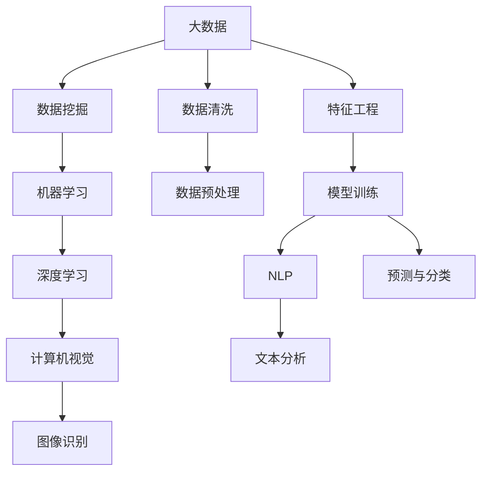

                 

# 大数据：AI学习的基石

> 关键词：大数据,AI学习,数据驱动,深度学习,机器学习,自然语言处理,NLP,计算机视觉,机器视觉

## 1. 背景介绍

### 1.1 问题由来
进入21世纪以来，随着互联网技术的迅猛发展和普及，海量数据如潮水般涌现。大数据时代的到来，极大地改变了各行各业的数据收集、存储、处理方式，并为人工智能技术的研发与应用提供了巨大的土壤。人工智能领域也因此呈现出蓬勃发展之势，无论是理论还是应用，都取得了突破性的进展。

在人工智能的发展历程中，数据始终占据着至关重要的地位。从早期的专家系统、符号计算到近年来深度学习、强化学习等算法的兴起，数据始终是推动AI技术前进的核心动力。而大数据，作为AI学习的基石，更是在诸多领域中展现出了无与伦比的力量。

## 2. 核心概念与联系

### 2.1 核心概念概述

大数据（Big Data），通常被定义为“数据量超大规模、多样化和高速增长的数据集合”。大数据的核心在于数据量巨大、类型多样和时效性高，这为人工智能提供了更为丰富、更真实的数据源，有助于模型更好地捕捉数据之间的内在关系，提升算法的表现。

人工智能（Artificial Intelligence, AI），指的是通过算法让计算机具备模拟人类智能的能力，包括但不限于语音识别、图像处理、自然语言处理、智能决策、推荐系统等应用。

AI学习，即机器学习（Machine Learning, ML），是指通过算法让计算机从数据中学习规律，并根据规律进行预测和决策。机器学习模型通过学习大量标注数据，能够自动发现数据中的模式和规律，从而实现对新数据的预测和分类。

深度学习（Deep Learning, DL），作为机器学习的一个分支，通过多层神经网络进行特征学习和数据建模。深度学习模型能够处理更加复杂的数据结构，提取更高层次的抽象特征，在图像识别、语音识别、自然语言处理等领域取得了显著成果。

自然语言处理（Natural Language Processing, NLP），是指让计算机能够理解、处理和生成人类自然语言的技术。NLP涉及文本分析、机器翻译、情感分析、问答系统等诸多应用，已成为人工智能技术中的重要组成部分。

计算机视觉（Computer Vision, CV），是指让计算机能够识别、理解和解释图像和视频中包含的信息的技术。计算机视觉涉及物体检测、人脸识别、场景理解等诸多应用，极大地提升了图像识别和处理能力。

### 2.2 核心概念间的关系

大数据、AI学习、AI学习、深度学习、NLP、计算机视觉等概念间存在紧密的联系，它们共同构成了一个庞大的AI生态系统。以下通过一个Mermaid流程图展示这些概念之间的联系和互动：



从这张图可以看出，大数据为数据挖掘和特征工程提供了丰富的数据源，而数据挖掘和特征工程又是机器学习和深度学习的前提。机器学习和深度学习模型在训练过程中需要大量标注数据，这些数据通过数据清洗和预处理得到，而模型训练结果又可以应用于NLP和计算机视觉领域，实现文本分析和图像识别等功能。

## 3. 核心算法原理 & 具体操作步骤
### 3.1 算法原理概述

AI学习算法主要包括监督学习、无监督学习和强化学习三大类。其中，监督学习是最常用的一类算法，它通过大量标注数据训练模型，使模型能够预测新的数据。

监督学习算法通过最小化损失函数，使模型在训练集上最大化准确度。常用的损失函数包括交叉熵损失、均方误差损失等。具体来说，损失函数定义为：

$$
\mathcal{L}(\theta) = \frac{1}{N} \sum_{i=1}^N \ell(M_{\theta}(x_i),y_i)
$$

其中，$N$ 为样本数量，$x_i$ 为输入样本，$y_i$ 为对应的标签，$\theta$ 为模型参数，$\ell$ 为损失函数。

监督学习模型的训练过程通常包括以下步骤：
1. 收集和标注数据集。
2. 定义损失函数和优化算法。
3. 训练模型，最小化损失函数。
4. 在测试集上评估模型性能。

### 3.2 算法步骤详解

以深度学习模型为例，深度学习模型的训练过程包括前向传播和反向传播两个阶段。

1. 前向传播：将输入数据通过神经网络的前向传播过程，计算出每个神经元的输出值。
2. 反向传播：通过计算损失函数的梯度，反向传播误差，更新模型参数。

在深度学习模型中，前向传播和反向传播的过程通常用张量表示，并使用梯度下降等优化算法进行参数更新。以下是基于PyTorch框架的深度学习模型训练代码示例：

```python
import torch
import torch.nn as nn
import torch.optim as optim

# 定义模型
class Model(nn.Module):
    def __init__(self):
        super(Model, self).__init__()
        self.fc1 = nn.Linear(784, 128)
        self.fc2 = nn.Linear(128, 10)
    
    def forward(self, x):
        x = torch.relu(self.fc1(x))
        x = self.fc2(x)
        return x

# 加载数据
train_data = ...
test_data = ...

# 定义模型、损失函数和优化器
model = Model()
criterion = nn.CrossEntropyLoss()
optimizer = optim.SGD(model.parameters(), lr=0.01)

# 训练模型
for epoch in range(10):
    for i, (inputs, labels) in enumerate(train_loader):
        # 前向传播
        outputs = model(inputs)
        loss = criterion(outputs, labels)
        optimizer.zero_grad()
        # 反向传播
        loss.backward()
        optimizer.step()
```

### 3.3 算法优缺点

监督学习算法的优点在于数据标注的成本低、模型表现稳定、泛化能力强。但缺点在于需要大量标注数据、算法复杂度高、模型难以解释。

无监督学习算法不需要标注数据，通过自组织的数据分布进行学习。优点在于算法简单、计算成本低、能够发现数据中隐藏的模式。但缺点在于结果可解释性差、泛化能力弱。

强化学习算法通过环境反馈进行学习，通过试错的方式逐步优化决策策略。优点在于能够适应复杂环境、能够处理多目标优化问题。但缺点在于算法不稳定、计算成本高、难以解释。

### 3.4 算法应用领域

监督学习算法在图像识别、语音识别、自然语言处理等领域应用广泛。如CNN模型在图像分类任务中表现出色，RNN模型在文本处理中取得了显著效果。

无监督学习算法在聚类、降维等领域中应用广泛。如K-means算法、PCA算法在数据预处理中应用广泛。

强化学习算法在游戏AI、机器人控制等领域中取得了显著成果。如AlphaGo通过强化学习击败了围棋世界冠军。

## 4. 数学模型和公式 & 详细讲解  
### 4.1 数学模型构建

以深度学习模型为例，其数学模型可以表示为：

$$
\begin{aligned}
\mathcal{L}(\theta) &= \frac{1}{N} \sum_{i=1}^N \ell(y_i, M_{\theta}(x_i)) \\
\theta &= \mathop{\arg\min}_{\theta} \mathcal{L}(\theta)
\end{aligned}
$$

其中，$\theta$ 为模型参数，$M_{\theta}$ 为模型函数，$y_i$ 为真实标签，$\ell$ 为损失函数。

### 4.2 公式推导过程

以二分类任务为例，常用的损失函数为交叉熵损失，推导过程如下：

$$
\begin{aligned}
\ell(y, \hat{y}) &= -(y\log \hat{y} + (1-y)\log (1-\hat{y})) \\
\mathcal{L}(\theta) &= \frac{1}{N} \sum_{i=1}^N \ell(y_i, M_{\theta}(x_i))
\end{aligned}
$$

其中，$y$ 为真实标签，$\hat{y}$ 为模型预测的标签。

### 4.3 案例分析与讲解

以图像分类任务为例，CNN模型通过卷积、池化等操作提取特征，并通过全连接层进行分类。训练过程通过反向传播算法优化模型参数，最小化损失函数。训练过程的代码实现如下：

```python
import torch
import torch.nn as nn
import torch.optim as optim

# 定义模型
class Model(nn.Module):
    def __init__(self):
        super(Model, self).__init__()
        self.conv1 = nn.Conv2d(3, 64, 3, 1)
        self.pool = nn.MaxPool2d(2, 2)
        self.conv2 = nn.Conv2d(64, 128, 3, 1)
        self.fc1 = nn.Linear(128*6*6, 512)
        self.fc2 = nn.Linear(512, 10)
    
    def forward(self, x):
        x = self.pool(F.relu(self.conv1(x)))
        x = self.pool(F.relu(self.conv2(x)))
        x = x.view(-1, 128*6*6)
        x = F.relu(self.fc1(x))
        x = self.fc2(x)
        return x

# 加载数据
train_data = ...
test_data = ...

# 定义模型、损失函数和优化器
model = Model()
criterion = nn.CrossEntropyLoss()
optimizer = optim.SGD(model.parameters(), lr=0.01)

# 训练模型
for epoch in range(10):
    for i, (inputs, labels) in enumerate(train_loader):
        # 前向传播
        outputs = model(inputs)
        loss = criterion(outputs, labels)
        optimizer.zero_grad()
        # 反向传播
        loss.backward()
        optimizer.step()
```

## 5. 项目实践：代码实例和详细解释说明
### 5.1 开发环境搭建

要实现大数据、AI学习、深度学习等算法的开发，需要先搭建好开发环境。以下是使用Python进行PyTorch开发的环境配置流程：

1. 安装Anaconda：从官网下载并安装Anaconda，用于创建独立的Python环境。

2. 创建并激活虚拟环境：
```bash
conda create -n pytorch-env python=3.8 
conda activate pytorch-env
```

3. 安装PyTorch：根据CUDA版本，从官网获取对应的安装命令。例如：
```bash
conda install pytorch torchvision torchaudio cudatoolkit=11.1 -c pytorch -c conda-forge
```

4. 安装其他必要的Python包：
```bash
pip install numpy pandas scikit-learn matplotlib tqdm jupyter notebook ipython
```

完成上述步骤后，即可在`pytorch-env`环境中开始AI学习的开发实践。

### 5.2 源代码详细实现

以下是使用PyTorch实现深度学习模型的代码示例：

```python
import torch
import torch.nn as nn
import torch.optim as optim

# 定义模型
class Model(nn.Module):
    def __init__(self):
        super(Model, self).__init__()
        self.fc1 = nn.Linear(784, 128)
        self.fc2 = nn.Linear(128, 10)
    
    def forward(self, x):
        x = torch.relu(self.fc1(x))
        x = self.fc2(x)
        return x

# 加载数据
train_data = ...
test_data = ...

# 定义模型、损失函数和优化器
model = Model()
criterion = nn.CrossEntropyLoss()
optimizer = optim.SGD(model.parameters(), lr=0.01)

# 训练模型
for epoch in range(10):
    for i, (inputs, labels) in enumerate(train_loader):
        # 前向传播
        outputs = model(inputs)
        loss = criterion(outputs, labels)
        optimizer.zero_grad()
        # 反向传播
        loss.backward()
        optimizer.step()
```

### 5.3 代码解读与分析

代码中定义了一个简单的全连接神经网络模型，包含一个输入层、一个隐藏层和一个输出层。在训练过程中，通过反向传播算法更新模型参数，最小化损失函数。

## 6. 实际应用场景

### 6.1 智慧医疗

大数据在智慧医疗领域的应用广泛，通过分析患者数据，可以早期发现疾病风险、制定个性化治疗方案、辅助医生诊断等。

以深度学习在医学影像分析中的应用为例，通过收集大量标注的医学影像数据，训练深度学习模型进行病灶识别、影像分类等任务。在训练过程中，通过多轮迭代优化模型参数，提升模型预测准确度。最终，医生可以根据模型预测结果，制定更加科学的诊疗方案，提升诊疗效率和效果。

### 6.2 智能制造

在智能制造领域，通过采集和分析生产设备的运行数据，可以实时监控设备状态、预测设备故障、优化生产流程等。

以工业物联网（IIoT）为例，通过在生产设备上安装传感器，实时采集设备运行数据，并上传到云端进行大数据分析。分析结果可以用来预测设备故障，提前进行维护，减少停机时间。同时，还可以通过数据分析优化生产流程，提高生产效率和产品质量。

### 6.3 智慧交通

大数据在智慧交通领域的应用也越来越多，通过分析交通流量数据，可以优化交通信号控制、预测交通流量、提升交通管理效率等。

以智能交通管理为例，通过在交通路口安装传感器，实时采集交通流量数据，并进行大数据分析。分析结果可以用来优化交通信号控制，减少交通拥堵。同时，还可以通过数据分析预测交通流量，提升交通管理效率。

### 6.4 未来应用展望

未来，大数据和AI学习技术将会在更多领域得到应用，以下是一些未来应用展望：

1. 物联网（IoT）：通过收集和分析物联网设备的数据，可以实现智能家居、智能办公、智能制造等应用。

2. 金融科技：通过分析金融数据，可以实现风险控制、智能投顾、欺诈检测等应用。

3. 自动驾驶：通过采集和分析车辆行驶数据，可以实现自动驾驶、路径规划等应用。

4. 智慧城市：通过分析城市数据，可以实现智能交通、智慧安防、智能能源等应用。

## 7. 工具和资源推荐
### 7.1 学习资源推荐

要学习大数据、AI学习、深度学习等技术，需要掌握大量的相关知识。以下是一些推荐的资源：

1. 《深度学习》（Ian Goodfellow）：这本书是深度学习的经典教材，涵盖了深度学习的各个方面，适合深入学习。

2. 《机器学习实战》（Peter Harrington）：这本书介绍了机器学习的基本概念和常用算法，并通过实际案例进行讲解，适合初学者入门。

3. 《大数据技术与应用》（范智斌）：这本书介绍了大数据的基本概念、技术和应用，适合学习大数据技术。

4. 《Python机器学习》（Sebastian Raschka）：这本书介绍了机器学习的基本概念和常用算法，并通过Python实现，适合学习Python和机器学习。

5. 《TensorFlow官方文档》：这是TensorFlow的官方文档，详细介绍了TensorFlow的基本概念、常用API和应用场景，适合学习TensorFlow。

### 7.2 开发工具推荐

要开发大数据、AI学习、深度学习等应用，需要使用一些优秀的工具。以下是一些推荐的开发工具：

1. PyTorch：基于Python的开源深度学习框架，灵活动态的计算图，适合快速迭代研究。

2. TensorFlow：由Google主导开发的开源深度学习框架，生产部署方便，适合大规模工程应用。

3. scikit-learn：Python数据科学库，包含许多常用机器学习算法，适合数据科学入门。

4. OpenCV：计算机视觉库，包含许多常用的图像处理和计算机视觉算法，适合计算机视觉开发。

5. Weights & Biases：模型训练的实验跟踪工具，可以记录和可视化模型训练过程中的各项指标，方便对比和调优。

### 7.3 相关论文推荐

以下是一些大数据和AI学习领域的前沿论文，推荐阅读：

1. Deep Learning（Ian Goodfellow）：深度学习领域的经典教材，介绍了深度学习的各个方面。

2. Machine Learning（Tom Mitchell）：机器学习领域的经典教材，介绍了机器学习的基本概念和常用算法。

3. Artificial Intelligence: A Modern Approach（Russell & Norvig）：人工智能领域的经典教材，介绍了人工智能的基本概念和常用算法。

4. TensorFlow: A System for Large-Scale Machine Learning（Bengio et al.）：介绍TensorFlow的基本概念和应用场景。

5. Big Data: Principles and Best Practices of Scalable Realtime Data Systems（Jeff Dean）：介绍大数据的基本概念和技术。

## 8. 总结：未来发展趋势与挑战

### 8.1 总结

本文对大数据和AI学习进行了系统介绍，包括其基本概念、算法原理、应用场景和未来发展方向。

大数据和AI学习是人工智能技术的重要基石，为算法提供了丰富的数据源，提升了算法的表现。通过深度学习、机器学习等算法，我们可以从大数据中学习模式和规律，实现对新数据的预测和分类。

### 8.2 未来发展趋势

未来，大数据和AI学习技术将会在更多领域得到应用，以下是一些未来发展趋势：

1. 算力提升：随着计算力的提升，深度学习等算法的应用场景将更加广泛。

2. 数据融合：不同数据源的融合将进一步提升AI学习的效果，实现更加全面、准确的数据分析。

3. 自动化学习：自动化学习算法将进一步提升AI学习的效果，实现更加智能、高效的数据分析。

4. 联邦学习：联邦学习将使得数据更加安全、高效，提升AI学习的鲁棒性和可解释性。

5. 智能决策：基于大数据和AI学习，可以实现更加智能、高效的决策系统，提升决策效率和效果。

### 8.3 面临的挑战

尽管大数据和AI学习技术发展迅速，但仍面临一些挑战：

1. 数据隐私：大数据的采集和使用涉及到用户的隐私问题，如何保护用户隐私是一个重要问题。

2. 数据质量：大数据的质量和完整性对算法效果有很大影响，如何确保数据质量是一个重要问题。

3. 算法复杂性：深度学习等算法复杂度较高，如何降低算法的复杂度是一个重要问题。

4. 计算资源：深度学习等算法需要大量的计算资源，如何降低计算成本是一个重要问题。

5. 模型解释：深度学习等算法结果难以解释，如何提高模型的可解释性是一个重要问题。

### 8.4 研究展望

未来，大数据和AI学习技术的研究方向将包括以下几个方面：

1. 数据隐私保护：研究如何保护用户隐私，确保数据安全。

2. 数据质量控制：研究如何提高数据质量和完整性，确保数据可信。

3. 算法优化：研究如何降低算法复杂度，提高算法效率。

4. 计算资源优化：研究如何降低计算成本，提高计算效率。

5. 模型解释：研究如何提高模型的可解释性，增强模型可靠性。

总之，大数据和AI学习技术将继续推动人工智能技术的发展，为各行业带来更多的应用价值。未来，我们需要在数据隐私、数据质量、算法优化、计算资源、模型解释等方面进行深入研究，推动人工智能技术的进一步发展。

## 9. 附录：常见问题与解答

**Q1：大数据和AI学习有哪些区别？**

A: 大数据是指数据量巨大、类型多样和时效性高的数据集合，而AI学习是指通过算法让计算机从数据中学习规律，并根据规律进行预测和决策。大数据为AI学习提供了丰富的数据源，是AI学习的重要基石。

**Q2：深度学习模型如何训练？**

A: 深度学习模型通过前向传播和反向传播两个阶段进行训练。前向传播通过神经网络计算输出，反向传播通过计算损失函数的梯度，更新模型参数。训练过程中，需要选择合适的优化算法和超参数，最小化损失函数，提升模型性能。

**Q3：大数据如何实现？**

A: 大数据的实现需要多方面的技术支持，包括数据采集、数据存储、数据处理等。常用的技术包括Hadoop、Spark、NoSQL数据库等。

**Q4：数据隐私保护有哪些方法？**

A: 数据隐私保护的方法包括数据匿名化、数据加密、差分隐私等。其中，差分隐私是一种常用的隐私保护方法，通过添加噪声数据，使得数据分析结果难以识别具体个体，保护用户隐私。

**Q5：未来大数据和AI学习技术有哪些应用前景？**

A: 未来，大数据和AI学习技术将会在更多领域得到应用，包括智慧医疗、智能制造、智慧交通、金融科技、自动驾驶等。这些技术将为各行各业带来更多的应用价值，提升工作效率和效果。

总之，大数据和AI学习技术将继续推动人工智能技术的发展，为各行业带来更多的应用价值。未来，我们需要在数据隐私、数据质量、算法优化、计算资源、模型解释等方面进行深入研究，推动人工智能技术的进一步发展。

