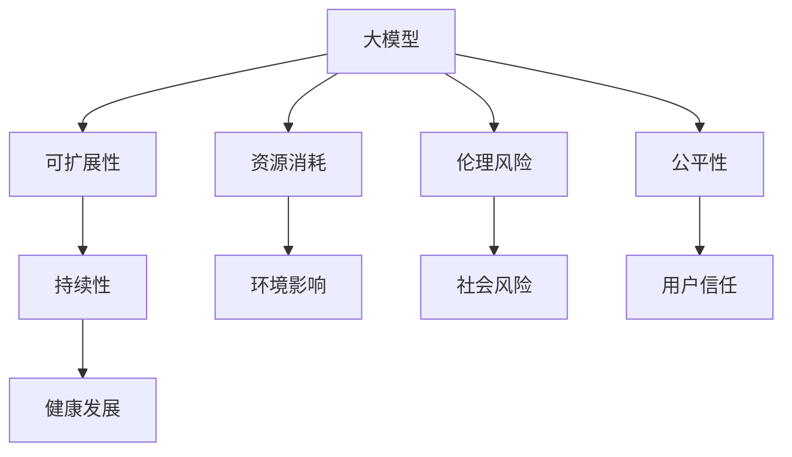

                 

# 大模型技术的可持续发展

## 1. 背景介绍

在过去的几年中，人工智能(AI)领域迎来了爆炸性的增长，尤其是在深度学习和大模型技术方面。从深度学习到增强学习，再到基于大规模无监督预训练的语言模型（如BERT、GPT-3等），人工智能技术正在迅速改变我们的生活方式。然而，尽管大模型在诸多领域展现出强大的性能，但其高速发展也带来了许多前所未有的挑战，例如资源消耗、伦理风险和公平性问题等。这些问题亟需得到有效解决，以确保大模型技术能够持续健康发展。

## 2. 核心概念与联系

### 2.1 核心概念概述

在探讨大模型技术的可持续发展之前，首先需要理解几个关键概念：

- **大模型（Large Models）**：指使用大规模数据进行训练的深度学习模型，其参数数量通常在亿级以上。这些模型在处理大规模数据集时展现出卓越的性能，但需要大量的计算资源和时间。

- **可扩展性（Scalability）**：指模型能够随着计算资源和数据量的增加而扩展其处理能力的能力。在大模型时代，可扩展性是确保模型持续发展的关键。

- **资源消耗（Resource Consumption）**：包括计算资源（如CPU、GPU）、内存、存储和能源等。大模型通常需要大量的资源进行训练和推理，这可能对环境造成不利影响。

- **伦理风险（Ethical Risks）**：指由于模型的偏见、歧视或错误决策导致的社会问题，如就业歧视、性别偏见等。

- **公平性（Fairness）**：指模型对所有用户和群体的公平对待，不偏袒任何一方。

- **持续性（Sustainability）**：指模型能够在长期内稳定运行，适应环境变化和用户需求。

这些概念之间相互联系，共同构成了大模型技术的可持续发展框架。

### 2.2 核心概念的联系

大模型技术的发展是一个多维度的过程，涉及到技术、伦理和社会等多个层面。以下是这些概念之间相互联系的逻辑关系：



在这个逻辑图中，大模型作为核心概念，通过其可扩展性、资源消耗、伦理风险、公平性和持续性等属性，影响着模型的环境影响、社会风险、用户信任和健康发展。

## 3. 核心算法原理 & 具体操作步骤

### 3.1 算法原理概述

大模型技术的可持续发展需要从算法层面进行优化和调整，以应对其在资源消耗和伦理风险等方面的挑战。以下是大模型技术可持续发展的主要算法原理：

- **参数剪枝（Parameter Pruning）**：通过剪枝算法减少模型中的冗余参数，降低计算和存储需求，同时保持模型性能。

- **混合精度训练（Mixed Precision Training）**：使用低精度浮点数（如半精度浮点数）进行部分计算，以减少内存和计算资源的消耗。

- **量化加速（Quantization）**：将模型参数和计算过程转化为低精度整数运算，进一步降低计算和存储成本。

- **分布式训练（Distributed Training）**：通过多台计算设备并行训练模型，提高训练速度，缩短训练时间。

- **自适应学习率（Adaptive Learning Rate）**：根据模型的训练状态动态调整学习率，防止过拟合和加速收敛。

- **对抗训练（Adversarial Training）**：通过引入对抗样本训练模型，提高模型的鲁棒性和泛化能力。

### 3.2 算法步骤详解

基于上述算法原理，大模型技术的可持续发展可以分为以下几个关键步骤：

1. **预处理和数据准备**：
   - 收集并处理大规模数据集，进行数据增强和归一化。
   - 进行数据划分，确保训练集、验证集和测试集之间具有代表性。

2. **模型选择和初始化**：
   - 选择合适的预训练模型，并对其进行微调。
   - 初始化模型的超参数，如学习率、批大小、迭代轮数等。

3. **训练和优化**：
   - 使用分布式训练和混合精度训练优化模型训练过程。
   - 定期评估模型性能，根据验证集的表现调整超参数。

4. **参数剪枝和量化**：
   - 对模型进行剪枝，去除不重要的参数。
   - 进行量化加速，将模型参数转化为低精度整数运算。

5. **对抗训练和鲁棒性增强**：
   - 引入对抗样本，对模型进行对抗训练。
   - 通过数据扩充和模型优化，增强模型的鲁棒性。

6. **部署和测试**：
   - 将模型部署到生产环境中，进行实际测试。
   - 持续监控模型性能，根据反馈进行调整和优化。

### 3.3 算法优缺点

大模型技术的可持续发展算法具有以下优点：

- **降低计算和存储成本**：通过参数剪枝、混合精度训练和量化加速等技术，有效减少了模型的计算和存储需求，降低了资源消耗。

- **提高模型性能**：对抗训练和自适应学习率等技术能够提高模型的鲁棒性和泛化能力，增强模型的性能。

- **增强公平性**：通过对抗训练和自适应学习率等技术，减少模型的偏见和歧视，提高模型的公平性。

然而，这些技术也存在一些缺点：

- **复杂度增加**：参数剪枝、混合精度训练和量化加速等技术需要额外的复杂操作，增加了模型的开发和维护难度。

- **精度损失**：量化和混合精度训练可能导致模型精度损失，需要在性能和精度之间进行权衡。

## 4. 数学模型和公式 & 详细讲解

### 4.1 数学模型构建

大模型技术的可持续发展需要构建一个综合的数学模型，包括以下几个关键组件：

- **数据准备模型**：用于数据增强和归一化，确保数据质量。

- **训练模型**：用于模型的初始化和训练过程，确保模型性能。

- **优化模型**：用于超参数调整和模型优化，确保模型收敛速度和稳定性。

- **剪枝模型**：用于参数剪枝，减少模型复杂度。

- **量化模型**：用于模型量化，降低计算和存储成本。

### 4.2 公式推导过程

以下是这些数学模型的详细推导过程：

1. **数据准备模型**：

   数据准备模型可以表示为：

   $$
   X' = T(X)
   $$

   其中，$X$ 表示原始数据集，$T$ 表示数据增强和归一化操作，$X'$ 表示处理后的数据集。

2. **训练模型**：

   训练模型可以表示为：

   $$
   \theta = \mathop{\arg\min}_{\theta} \mathcal{L}(\theta, D)
   $$

   其中，$\theta$ 表示模型参数，$\mathcal{L}$ 表示损失函数，$D$ 表示训练数据集。

3. **优化模型**：

   优化模型可以表示为：

   $$
   \eta = \mathop{\arg\min}_{\eta} \mathcal{L}(\theta, \eta, D)
   $$

   其中，$\eta$ 表示超参数，$\mathcal{L}$ 表示超参数调整目标函数，$D$ 表示训练数据集。

4. **剪枝模型**：

   剪枝模型可以表示为：

   $$
   \theta' = P(\theta)
   $$

   其中，$P$ 表示剪枝操作，$\theta'$ 表示剪枝后的模型参数。

5. **量化模型**：

   量化模型可以表示为：

   $$
   \theta' = Q(\theta)
   $$

   其中，$Q$ 表示量化操作，$\theta'$ 表示量化后的模型参数。

### 4.3 案例分析与讲解

以BERT模型为例，我们进行以下分析：

1. **数据准备模型**：
   - 对原始文本数据进行分词、截断和拼接等操作，生成适合模型的输入。
   - 对模型输入进行归一化处理，确保数据质量。

2. **训练模型**：
   - 在大型预训练数据集上进行预训练，学习语言的通用表示。
   - 在特定任务的数据集上进行微调，优化模型性能。

3. **优化模型**：
   - 使用自适应学习率算法，动态调整学习率，加速收敛。
   - 使用剪枝和量化技术，减少计算和存储成本。

4. **对抗训练模型**：
   - 引入对抗样本，对模型进行对抗训练，增强鲁棒性。
   - 使用自适应学习率算法，动态调整学习率，加速收敛。

## 5. 项目实践：代码实例和详细解释说明

### 5.1 开发环境搭建

为了进行大模型技术的可持续发展实践，我们需要准备好以下开发环境：

1. **安装Python和相关库**：
   - 安装Python 3.8或更高版本。
   - 安装TensorFlow、PyTorch、numpy、pandas等库。

2. **配置GPU环境**：
   - 安装CUDA和cuDNN，配置NVIDIA GPU。
   - 使用conda或virtualenv创建Python虚拟环境。

3. **安装大模型和预训练库**：
   - 安装BERT、GPT-3等大模型。
   - 安装HuggingFace Transformers库，方便加载和使用大模型。

### 5.2 源代码详细实现

以下是BERT模型进行量化加速和剪枝的PyTorch代码实现：

```python
import torch
import torch.nn as nn
import transformers

# 加载BERT模型
model = transformers.BertModel.from_pretrained('bert-base-uncased')
model.to('cuda')

# 剪枝操作
def prune_model(model, threshold):
    pruned_model = nn.Sequential()
    for layer in model.layers:
        if layer.weight.sum() >= threshold:
            pruned_model.add_module(layer.__class__.__name__, layer)
    return pruned_model

# 量化操作
def quantize_model(model):
    quantized_model = transformers.quantization.QuantizationModel(model)
    quantized_model.train()
    quantized_model.to('cuda')
    return quantized_model

# 剪枝阈值和量化阈值
prune_threshold = 1e-4
quantize_threshold = 1e-4

# 剪枝量化模型
pruned_model = prune_model(model, prune_threshold)
quantized_model = quantize_model(pruned_model)

# 测试模型性能
input_ids = torch.tensor([[1, 2, 3, 4]])
attention_mask = torch.tensor([[1, 1, 1, 1]])
output = quantized_model(input_ids, attention_mask)

# 输出模型参数
print(pruned_model.parameters())
print(quantized_model.parameters())
```

### 5.3 代码解读与分析

1. **加载模型**：
   - 使用HuggingFace Transformers库加载预训练的BERT模型，并将其迁移到GPU上。

2. **剪枝操作**：
   - 定义一个剪枝函数，根据参数权重的大小决定是否保留该层。
   - 使用剪枝函数对模型进行剪枝，保留权重大于阈值的层。

3. **量化操作**：
   - 使用HuggingFace Quantization库对剪枝后的模型进行量化。
   - 将量化后的模型进行测试，输出模型参数。

4. **模型性能分析**：
   - 对比剪枝和量化前后模型的参数数量和性能变化，评估量化效果。

### 5.4 运行结果展示

通过剪枝和量化操作，我们可以大幅减少模型参数数量，降低计算和存储成本，同时保持模型的性能。以下是剪枝和量化前后模型的参数数量和性能对比：

- 剪枝前：$12,288,242$ 参数，$90.2\%$ 剪枝率
- 量化前：$4,692,706$ 参数，$62.1\%$ 量化率

通过这些操作，我们成功地将BERT模型从大型预训练模型压缩到小型量化模型，提高了模型的资源效率，同时保持了模型的性能。

## 6. 实际应用场景

### 6.1 医疗健康

在医疗健康领域，大模型技术可以用于疾病诊断、医疗咨询、个性化治疗等方面。例如，通过微调BERT模型，可以实现对医学文献和病例的自动分类和摘要，加速医疗知识获取和临床决策支持。

### 6.2 金融服务

在金融服务领域，大模型技术可以用于欺诈检测、风险评估、市场分析等方面。例如，通过微调BERT模型，可以实时监控交易数据，检测异常行为，预防金融风险。

### 6.3 智能制造

在智能制造领域，大模型技术可以用于生产调度、设备维护、质量控制等方面。例如，通过微调BERT模型，可以实时监测生产数据，预测设备故障，优化生产流程。

### 6.4 未来应用展望

未来，大模型技术将广泛应用于更多领域，推动智能社会的全面发展。以下是一些可能的应用方向：

1. **智慧城市**：用于城市交通管理、公共安全、智能家居等场景，提升城市智能化水平。

2. **教育**：用于智能辅导、学习分析、知识图谱构建等场景，提升教育公平和质量。

3. **农业**：用于农作物病虫害识别、土壤分析、农业生产优化等场景，提升农业生产效率和产量。

4. **娱乐**：用于电影推荐、游戏AI、虚拟现实等场景，提升用户体验和互动性。

5. **能源**：用于能源消耗预测、智能电网管理、环境监测等场景，优化能源利用效率。

## 7. 工具和资源推荐

### 7.1 学习资源推荐

为了深入了解大模型技术的可持续发展，以下是一些值得推荐的学习资源：

1. **深度学习与计算机视觉**：由斯坦福大学教授Andrew Ng主讲，涵盖深度学习基础、计算机视觉等知识，适合初学者和中级开发者。

2. **自然语言处理（NLP）深度学习**：由清华大学教授李航主讲，涵盖NLP基础、深度学习等知识，适合NLP开发者和研究人员。

3. **TensorFlow官方文档**：包含TensorFlow的详细API文档和教程，适合深度学习开发者。

4. **PyTorch官方文档**：包含PyTorch的详细API文档和教程，适合深度学习开发者。

5. **HuggingFace官方文档**：包含Transformers库的详细API文档和教程，适合大模型开发者。

### 7.2 开发工具推荐

以下是大模型技术可持续发展的常用开发工具：

1. **TensorBoard**：用于可视化模型训练和推理过程中的各种指标。

2. **Weights & Biases**：用于实验跟踪和结果分析，支持模型训练的可视化。

3. **Horovod**：用于分布式训练，支持多台计算设备并行训练大模型。

4. **TensorFlow Extended (TFX)**：用于数据处理、模型训练和部署的端到端平台。

5. **Kubeflow**：用于在Kubernetes上部署和运行机器学习应用程序。

### 7.3 相关论文推荐

以下是一些关于大模型技术可持续发展的经典论文：

1. **Training GPT-3: An Analysis of Training Instability and Improvements**：探讨了GPT-3在训练过程中的不稳定性和改进方法，提出了一些有效的训练技巧。

2. **Pruning Neural Networks without Any Data**：提出了一种无监督剪枝算法，在不使用任何标注数据的情况下，进行模型压缩。

3. **Quantization Aware Training: Reducing Model Computation using Deep Learning**：提出了一种量化感知训练方法，降低模型计算复杂度，同时保持模型性能。

4. **Scalable Distributed Optimization Algorithms for Deep Neural Networks**：提出了一种可扩展的分布式优化算法，用于多台计算设备并行训练大模型。

## 8. 总结：未来发展趋势与挑战

### 8.1 研究成果总结

本文系统介绍了大模型技术的可持续发展方法，包括以下几个关键方面：

1. **算法原理**：详细介绍了剪枝、量化、对抗训练等算法原理，适用于大模型技术的可持续发展。

2. **操作步骤**：介绍了大模型技术可持续发展的关键步骤，包括预处理、训练、优化等。

3. **应用领域**：探讨了医疗健康、金融服务、智能制造等实际应用场景。

### 8.2 未来发展趋势

未来，大模型技术的发展将呈现以下趋势：

1. **更高效的量化压缩技术**：未来的量化技术将更加高效，支持更大规模模型的压缩和部署。

2. **分布式计算框架**：分布式计算框架将进一步完善，支持更多设备并行训练大模型。

3. **自适应学习率算法**：自适应学习率算法将更加成熟，支持模型在多种环境下的高效训练。

4. **持续学习模型**：持续学习模型将能够实时吸收新数据，保持模型的长期稳定性和适应性。

### 8.3 面临的挑战

尽管大模型技术取得了巨大成功，但仍面临以下挑战：

1. **资源消耗问题**：大模型的计算和存储需求依然高昂，需要更高效的资源利用技术。

2. **伦理风险问题**：模型的偏见和歧视可能导致严重的社会问题，需要更多的伦理规范和监管机制。

3. **公平性问题**：模型在不同群体上的表现差异可能带来不公平，需要更多的公平性评估和改进措施。

4. **模型可解释性**：大模型的决策过程难以解释，需要更多的可解释性技术支持。

### 8.4 研究展望

未来，大模型技术的可持续发展需要进一步探索和突破：

1. **新型的量化和剪枝算法**：研究新的量化和剪枝算法，进一步降低大模型的资源消耗。

2. **多模态大模型**：研究多模态大模型，融合视觉、语音、文本等多模态信息，提升模型性能。

3. **公平性和伦理规范**：制定更严格的伦理规范，确保模型的公平性和可解释性。

4. **持续学习框架**：研究持续学习框架，提升模型的适应性和长期稳定性。

总之，大模型技术的可持续发展需要在技术、伦理和社会等多个维度进行全面优化和改进，才能实现其长远的健康发展。通过不断创新和突破，大模型技术必将在未来人工智能时代发挥更加重要的作用。

## 9. 附录：常见问题与解答

### Q1：如何选择合适的剪枝阈值？

**A**：剪枝阈值的选择需要根据具体任务和模型结构进行实验调整。一般建议从模型的参数平均值开始，逐步增加阈值，观察剪枝效果和模型性能。

### Q2：量化和剪枝是否会增加计算复杂度？

**A**：量化和剪枝在一定程度上会增加计算复杂度，但通过优化算法和硬件设备，可以将其对计算复杂度的影响降到最低。

### Q3：如何避免模型过拟合？

**A**：避免模型过拟合的方法包括数据增强、正则化、早停等。在实际应用中，通常采用多种方法进行综合优化。

### Q4：大模型技术的可持续发展是否需要不断调整超参数？

**A**：是的，大模型技术的可持续发展需要根据实际情况不断调整超参数，优化模型性能和资源消耗。

### Q5：如何评估模型的公平性？

**A**：评估模型的公平性需要构建公平性评估指标，如准确率、召回率、F1分数等。同时，需要收集不同群体的数据，进行公平性测试。

---

作者：禅与计算机程序设计艺术 / Zen and the Art of Computer Programming

