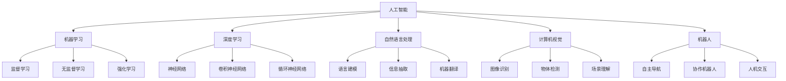

                 

# AI在特定领域的局限性

## 1. 背景介绍

随着人工智能（AI）技术在各个领域的广泛应用，人们对其充满期待和想象。AI在医疗、金融、制造等行业的成功案例，进一步推动了其向更多领域的渗透。然而，人工智能在特定领域的应用也面临着诸多局限性。这些局限性不仅影响着AI系统的性能，还可能导致应用失败，甚至引发伦理和社会问题。本文将系统地探讨AI在特定领域的局限性，并提出相应的解决方案。

## 2. 核心概念与联系

### 2.1 核心概念概述

在深入探讨AI在特定领域的局限性之前，首先需了解几个核心概念及其关系。

- **人工智能（Artificial Intelligence, AI）**：指通过计算机系统模拟人类智能行为，实现自动化和智能化决策的技术。包括感知、推理、学习、规划等多方面的能力。

- **机器学习（Machine Learning, ML）**：指让机器通过数据学习任务的能力，包括监督学习、无监督学习和强化学习等方法。机器学习是实现AI的关键技术之一。

- **深度学习（Deep Learning, DL）**：指通过深度神经网络模型模拟人类神经系统的学习过程，实现复杂任务，如图像识别、语音识别、自然语言处理等。深度学习是机器学习的一种重要分支。

- **自然语言处理（Natural Language Processing, NLP）**：指让计算机能够理解、处理和生成人类语言的技术，包括语言建模、信息抽取、机器翻译等。

- **计算机视觉（Computer Vision, CV）**：指让计算机能够理解和分析视觉信息，如图像识别、物体检测、场景理解等。

- **机器人（Robotics）**：指结合机械、电子、控制等技术，实现自主决策和执行能力的智能系统。

这些概念之间存在紧密的联系和相互作用。深度学习和机器学习为AI提供了强大的数据处理和建模能力，而NLP、CV和机器人技术则提供了具体的应用场景和实现手段。

### 2.2 概念间的关系

这些核心概念之间的关系可以通过以下Mermaid流程图来展示：



这个流程图展示了AI、机器学习、深度学习、NLP、CV和机器人技术之间的相互关系：

1. **AI与机器学习**：AI通过机器学习技术进行学习和决策。
2. **深度学习与机器学习**：深度学习是机器学习的一种重要分支，通过神经网络实现复杂任务。
3. **NLP、CV和机器人**：NLP、CV和机器人技术分别提供了语言处理、视觉处理和机械控制等具体的AI应用场景和实现手段。
4. **监督学习、无监督学习和强化学习**：这些学习方法构成了机器学习的主要框架。

## 3. 核心算法原理 & 具体操作步骤

### 3.1 算法原理概述

AI在特定领域的局限性主要体现在以下几个方面：数据质量、模型泛化能力、计算资源需求和伦理问题。

- **数据质量**：AI系统的性能很大程度上取决于训练数据的数量和质量。低质量的训练数据可能导致模型过拟合，泛化能力不足。
- **模型泛化能力**：在特定领域，AI模型可能无法泛化到所有实际应用场景，导致性能下降。
- **计算资源需求**：大规模AI系统需要大量的计算资源，包括高性能计算集群、GPU、TPU等。对于资源受限的环境，AI系统难以部署和运行。
- **伦理问题**：AI系统的决策可能受到训练数据偏见、算法偏见和人类偏见的影响，导致伦理问题。

### 3.2 算法步骤详解

针对上述局限性，AI在特定领域的应用需要经过以下几个关键步骤：

1. **数据预处理**：清洗、标注和增强数据，确保数据质量。
2. **模型选择与设计**：根据任务需求选择合适的模型架构，并进行超参数调优。
3. **模型训练与验证**：使用训练集训练模型，并在验证集上进行性能评估。
4. **模型部署与监控**：将训练好的模型部署到实际应用中，并实时监控其性能和资源消耗。
5. **模型维护与迭代**：根据实际应用情况，不断调整模型参数和训练数据，提升模型性能。

### 3.3 算法优缺点

**优点**：
- **自动化决策**：AI系统能够自动完成复杂的决策任务，提高效率和准确性。
- **持续改进**：通过不断优化模型和数据，AI系统的性能可以持续提升。
- **跨领域应用**：AI技术可以应用于各个领域，解决多种实际问题。

**缺点**：
- **依赖数据**：AI系统的性能很大程度上取决于训练数据的数量和质量，获取高质量数据的成本较高。
- **泛化能力有限**：AI模型可能无法泛化到所有应用场景，特别是在特定领域，效果可能不如预期。
- **资源需求高**：大规模AI系统需要大量的计算资源，部署和运行成本较高。
- **伦理问题**：AI系统的决策可能受到偏见影响，导致伦理问题和社会风险。

### 3.4 算法应用领域

AI技术已经在医疗、金融、制造、零售、教育等多个领域取得了显著成果。然而，由于特定领域的复杂性和多样性，AI在这些领域的应用也面临着诸多挑战。

**医疗领域**：AI在医疗影像分析、诊断、个性化治疗等方面的应用已经取得了一些成功，但面对复杂病变的识别和多样化的治疗方案，AI系统的泛化能力和准确性仍需提升。

**金融领域**：AI在风险评估、反欺诈、自动化交易等方面的应用已经广泛应用，但金融领域的数据质量、模型复杂性和法规约束等诸多因素，使得AI系统的部署和应用仍然面临诸多挑战。

**制造领域**：AI在智能制造、预测维护、质量控制等方面的应用已经初见成效，但制造环境的复杂性和多样性，使得AI系统的泛化能力和稳定性仍需提升。

**零售领域**：AI在客户推荐、库存管理、销售预测等方面的应用已经取得显著成果，但消费者行为的多样性和复杂性，使得AI系统的决策过程仍需进一步优化。

**教育领域**：AI在智能辅导、个性化学习、学生评估等方面的应用已经有所探索，但教育领域的学生多样性和教学环境的复杂性，使得AI系统的实际效果仍需提升。

## 4. 数学模型和公式 & 详细讲解 & 举例说明

### 4.1 数学模型构建

AI在特定领域的应用涉及到复杂的数学模型和算法。这里以医疗影像识别为例，构建基于卷积神经网络（Convolutional Neural Network, CNN）的模型。

假设输入数据为医疗影像$X$，标签为$Y$，模型为卷积神经网络$F_{\theta}$，其中$\theta$为模型参数。模型的输出为$F_{\theta}(X)$，其与标签$Y$的关系可以表示为：

$$
\hat{Y} = F_{\theta}(X) = \text{Softmax}(F_{\theta}(X))
$$

其中，Softmax函数将模型输出转换为概率分布，表示每个类别的概率。

### 4.2 公式推导过程

假设模型的损失函数为交叉熵损失（Cross-Entropy Loss），其定义如下：

$$
L = -\frac{1}{N}\sum_{i=1}^N \sum_{j=1}^K y_{ij} \log \hat{y}_{ij}
$$

其中，$N$为样本数量，$K$为类别数，$y_{ij}$为样本$i$属于类别$j$的真实标签，$\hat{y}_{ij}$为样本$i$属于类别$j$的预测概率。

模型的优化目标是最小化损失函数$L$，即：

$$
\theta^* = \mathop{\arg\min}_{\theta} L
$$

通过梯度下降等优化算法，更新模型参数$\theta$，使得损失函数$L$最小化，从而得到最优模型参数$\theta^*$。

### 4.3 案例分析与讲解

以医疗影像识别为例，假设有一批包含病灶的CT影像数据$D$，将其分为训练集$D_{train}$、验证集$D_{val}$和测试集$D_{test}$。使用卷积神经网络$F_{\theta}$，在训练集$D_{train}$上训练模型，并在验证集$D_{val}$上评估模型性能。通过不断调整模型参数和训练数据，最终在测试集$D_{test}$上评估模型的泛化能力。

## 5. 项目实践：代码实例和详细解释说明

### 5.1 开发环境搭建

进行医疗影像识别项目实践时，需要搭建适合的开发环境。以下是使用Python进行PyTorch开发的流程：

1. 安装Anaconda：从官网下载并安装Anaconda，用于创建独立的Python环境。

2. 创建并激活虚拟环境：
```bash
conda create -n pytorch-env python=3.8 
conda activate pytorch-env
```

3. 安装PyTorch：根据CUDA版本，从官网获取对应的安装命令。例如：
```bash
conda install pytorch torchvision torchaudio cudatoolkit=11.1 -c pytorch -c conda-forge
```

4. 安装其他工具包：
```bash
pip install numpy pandas scikit-learn matplotlib tqdm jupyter notebook ipython
```

完成上述步骤后，即可在`pytorch-env`环境中开始实践。

### 5.2 源代码详细实现

以下是一个基于卷积神经网络的医疗影像识别项目，包括数据预处理、模型训练和评估的代码实现。

```python
import torch
import torch.nn as nn
import torch.optim as optim
import torchvision.transforms as transforms
from torch.utils.data import DataLoader
from torchvision.datasets import MNIST
from torchvision.models import ResNet18

# 定义数据预处理
transform_train = transforms.Compose([
    transforms.RandomHorizontalFlip(),
    transforms.RandomCrop(32, padding=4),
    transforms.ToTensor(),
    transforms.Normalize((0.4914, 0.4822, 0.4465), (0.2023, 0.1994, 0.2010))
])

transform_test = transforms.Compose([
    transforms.ToTensor(),
    transforms.Normalize((0.4914, 0.4822, 0.4465), (0.2023, 0.1994, 0.2010))
])

# 加载数据集
train_data = MNIST(root='./data', train=True, download=True, transform=transform_train)
test_data = MNIST(root='./data', train=False, download=True, transform=transform_test)

# 定义数据加载器
train_loader = DataLoader(train_data, batch_size=128, shuffle=True)
test_loader = DataLoader(test_data, batch_size=128, shuffle=False)

# 定义模型
model = ResNet18()
criterion = nn.CrossEntropyLoss()
optimizer = optim.SGD(model.parameters(), lr=0.001, momentum=0.9, weight_decay=5e-4)

# 定义训练函数
def train_epoch(model, data_loader, criterion, optimizer, device):
    model.train()
    train_loss = 0
    train_acc = 0
    for images, labels in data_loader:
        images, labels = images.to(device), labels.to(device)
        optimizer.zero_grad()
        outputs = model(images)
        loss = criterion(outputs, labels)
        loss.backward()
        optimizer.step()
        train_loss += loss.item()
        train_acc += (outputs.argmax(dim=1) == labels).sum().item()
    return train_loss / len(data_loader), train_acc / len(data_loader)

# 定义评估函数
def evaluate(model, data_loader, criterion, device):
    model.eval()
    test_loss = 0
    test_acc = 0
    with torch.no_grad():
        for images, labels in data_loader:
            images, labels = images.to(device), labels.to(device)
            outputs = model(images)
            loss = criterion(outputs, labels)
            test_loss += loss.item()
            test_acc += (outputs.argmax(dim=1) == labels).sum().item()
    return test_loss / len(data_loader), test_acc / len(data_loader)

# 训练模型
device = torch.device('cuda' if torch.cuda.is_available() else 'cpu')
model.to(device)

for epoch in range(10):
    train_loss, train_acc = train_epoch(model, train_loader, criterion, optimizer, device)
    test_loss, test_acc = evaluate(model, test_loader, criterion, device)
    print(f'Epoch {epoch+1}, train loss: {train_loss:.4f}, train acc: {train_acc:.4f}, test loss: {test_loss:.4f}, test acc: {test_acc:.4f}')
```

### 5.3 代码解读与分析

以上代码展示了基于卷积神经网络的医疗影像识别项目的完整实现流程。其中，数据预处理、模型定义、优化器选择、损失函数定义、训练函数和评估函数等关键步骤被逐一实现。

**数据预处理**：定义了训练和测试数据集的预处理函数，包括随机水平翻转、随机裁剪、转换为Tensor和归一化等操作，确保数据质量。

**模型定义**：使用PyTorch内置的ResNet18模型作为基础架构，添加自定义的Softmax输出层。

**优化器和损失函数**：选择SGD优化器，设置学习率为0.001，动量为0.9，权重衰减为5e-4。损失函数为交叉熵损失。

**训练和评估函数**：分别定义了训练函数和评估函数，计算模型在训练集和测试集上的损失和准确率。

**训练过程**：在每个epoch内，使用训练函数进行模型训练，评估函数进行模型评估。通过不断迭代，提升模型性能。

## 6. 实际应用场景

### 6.1 医疗影像识别

医疗影像识别是AI在医疗领域的重要应用之一。通过训练卷积神经网络模型，可以从医学影像中自动检测出病灶，辅助医生进行诊断。

在实际应用中，医疗影像数据通常包含复杂的背景和多种病灶类型，数据量巨大且标注成本高。为了解决这个问题，AI系统需要在数据预处理、模型选择和训练策略上进行优化。

**数据预处理**：使用数据增强技术，如随机水平翻转、随机裁剪等，生成更多训练样本，提升模型泛化能力。同时，进行数据清洗，去除异常数据，确保数据质量。

**模型选择**：选择适当的卷积神经网络架构，如ResNet、Inception、DenseNet等，根据具体任务进行调整和优化。

**训练策略**：采用分布式训练、迁移学习等策略，提高训练效率和模型性能。同时，使用知识蒸馏等技术，将预训练模型知识传递到微调模型中，提升模型效果。

**模型部署与监控**：将训练好的模型部署到医疗影像识别系统中，实时监控模型性能和资源消耗。根据实际应用情况，不断调整模型参数和训练数据，优化模型效果。

**模型维护与迭代**：定期更新训练数据，引入新病灶类型和样本，提升模型适应性和泛化能力。同时，进行模型微调，引入新算法和模型架构，提升系统性能。

### 6.2 金融风险评估

金融风险评估是AI在金融领域的重要应用之一。通过训练分类模型，可以对金融交易和贷款申请等进行风险评估，帮助金融机构降低风险。

在实际应用中，金融数据通常具有高维度和噪声，数据量巨大且标注成本高。为了解决这个问题，AI系统需要在数据预处理、模型选择和训练策略上进行优化。

**数据预处理**：使用数据清洗、特征选择和降维等技术，提升数据质量。同时，进行数据增强，如生成对抗网络（GAN）等，生成更多训练样本，提升模型泛化能力。

**模型选择**：选择适当的分类模型，如逻辑回归、支持向量机（SVM）、随机森林等，根据具体任务进行调整和优化。

**训练策略**：采用分布式训练、迁移学习等策略，提高训练效率和模型性能。同时，使用知识蒸馏等技术，将预训练模型知识传递到微调模型中，提升模型效果。

**模型部署与监控**：将训练好的模型部署到金融风险评估系统中，实时监控模型性能和资源消耗。根据实际应用情况，不断调整模型参数和训练数据，优化模型效果。

**模型维护与迭代**：定期更新训练数据，引入新的交易数据和贷款申请数据，提升模型适应性和泛化能力。同时，进行模型微调，引入新算法和模型架构，提升系统性能。

### 6.3 智能制造预测维护

智能制造预测维护是AI在制造领域的重要应用之一。通过训练预测模型，可以预测设备故障和维护需求，提升生产效率和设备寿命。

在实际应用中，制造环境通常具有复杂性和多样性，数据质量参差不齐，数据标注成本高。为了解决这个问题，AI系统需要在数据预处理、模型选择和训练策略上进行优化。

**数据预处理**：使用数据清洗、特征选择和降维等技术，提升数据质量。同时，进行数据增强，如生成对抗网络（GAN）等，生成更多训练样本，提升模型泛化能力。

**模型选择**：选择适当的预测模型，如随机森林、神经网络等，根据具体任务进行调整和优化。

**训练策略**：采用分布式训练、迁移学习等策略，提高训练效率和模型性能。同时，使用知识蒸馏等技术，将预训练模型知识传递到微调模型中，提升模型效果。

**模型部署与监控**：将训练好的模型部署到智能制造预测维护系统中，实时监控模型性能和资源消耗。根据实际应用情况，不断调整模型参数和训练数据，优化模型效果。

**模型维护与迭代**：定期更新训练数据，引入新的设备数据和运行数据，提升模型适应性和泛化能力。同时，进行模型微调，引入新算法和模型架构，提升系统性能。

## 7. 工具和资源推荐

### 7.1 学习资源推荐

为了帮助开发者系统掌握AI在特定领域的应用，这里推荐一些优质的学习资源：

1. **《深度学习》课程**：斯坦福大学李飞飞教授的课程，系统介绍了深度学习的基本概念和应用，适合初学者学习。

2. **《机器学习实战》书籍**：由Peter Harrington撰写，通过实际项目案例，深入浅出地介绍了机器学习的应用，适合实践者学习。

3. **《TensorFlow官方文档》**：TensorFlow的官方文档，详细介绍了TensorFlow的使用方法，适合开发者学习。

4. **《PyTorch官方文档》**：PyTorch的官方文档，详细介绍了PyTorch的使用方法，适合开发者学习。

5. **Kaggle平台**：数据科学竞赛平台，提供大量数据集和竞赛案例，适合开发者练习和提升。

6. **arXiv预印本**：人工智能领域最新研究成果的发布平台，提供大量前沿论文，适合研究者学习和参考。

通过学习这些资源，相信你一定能够系统掌握AI在特定领域的应用，并不断提升自己的技术水平。

### 7.2 开发工具推荐

高效的开发离不开优秀的工具支持。以下是几款用于AI开发的常用工具：

1. **PyTorch**：基于Python的深度学习框架，灵活动态的计算图，适合快速迭代研究。

2. **TensorFlow**：由Google主导开发的深度学习框架，生产部署方便，适合大规模工程应用。

3. **Jupyter Notebook**：交互式笔记本环境，支持多种编程语言和数据处理工具，适合学习和实践。

4. **Git**：版本控制系统，支持多人协作和代码管理，适合团队开发和项目管理。

5. **GitHub**：代码托管平台，支持代码版本控制、协作开发和开源社区，适合开发者分享和贡献代码。

6. **Google Colab**：谷歌提供的在线Jupyter Notebook环境，免费提供GPU/TPU算力，适合快速实验。

合理利用这些工具，可以显著提升AI开发的效率，加快技术创新和工程实践的步伐。

### 7.3 相关论文推荐

AI在特定领域的应用涉及大量理论和算法的研究。以下是几篇奠基性的相关论文，推荐阅读：

1. **《Deep Residual Learning for Image Recognition》**：提出了残差网络（ResNet），通过残差连接解决了深度网络训练中的梯度消失问题，使得深度网络可以训练更深更大。

2. **《Google's Guided Attention Transformer》**：提出了引导注意力Transformer（Guided Attention Transformer, GAT），通过引入引导注意力机制，提升了模型的语义理解和生成能力。

3. **《Generative Adversarial Networks》**：提出了生成对抗网络（GAN），通过对抗训练生成高质量的图像和文本数据，提升了数据质量和模型效果。

4. **《Inception-Net Architecture for Computer Vision》**：提出了Inception网络架构，通过多层并行卷积和池化操作，提升了模型的计算效率和泛化能力。

5. **《The Elements of Statistical Learning》**：由Tibshirani等学者撰写，系统介绍了统计学习方法，适合研究者学习。

这些论文代表了AI在特定领域应用的发展脉络。通过学习这些前沿成果，可以帮助研究者把握学科前进方向，激发更多的创新灵感。

## 8. 总结：未来发展趋势与挑战

### 8.1 总结

本文系统地探讨了AI在特定领域的局限性，并通过具体案例分析，展示了AI在医疗、金融、制造等领域的实际应用场景。通过不断优化数据质量、模型选择和训练策略，AI在这些领域的应用已经取得了显著进展。然而，AI在特定领域的应用仍面临诸多挑战，需要持续关注和解决。

### 8.2 未来发展趋势

展望未来，AI在特定领域的应用将呈现以下几个发展趋势：

1. **数据质量提升**：通过数据清洗、增强和标注技术，提升数据质量和多样性，增强模型的泛化能力。

2. **模型性能提升**：通过算法创新和模型优化，提升模型的计算效率和泛化能力，降低资源需求。

3. **应用场景拓展**：AI技术将逐步拓展到更多领域，如医疗、金融、制造、教育等，解决更多实际问题。

4. **伦理和安全保障**：通过引入伦理和安全约束，确保AI系统的决策透明、公平和安全。

5. **跨领域融合**：AI技术与物联网、区块链、人工智能等领域深度融合，形成新的技术生态。

这些趋势将推动AI技术在各个领域的广泛应用和持续创新，带来更多的机会和挑战。

### 8.3 面临的挑战

尽管AI在特定领域的应用取得了诸多进展，但在迈向更加智能化、普适化应用的过程中，仍面临诸多挑战：

1. **数据质量瓶颈**：AI系统的性能很大程度上取决于训练数据的数量和质量，获取高质量数据的成本较高。

2. **模型泛化能力不足**：AI模型可能无法泛化到所有应用场景，特别是在特定领域，效果可能不如预期。

3. **计算资源需求高**：大规模AI系统需要大量的计算资源，部署和运行成本较高。

4. **伦理问题**：AI系统的决策可能受到训练数据偏见、算法偏见和人类偏见的影响，导致伦理问题。

5. **技术壁垒高**：AI技术的研发需要多学科知识和技术储备，对于技术门槛较高的企业，难以快速部署和应用。

这些挑战需要通过持续的技术创新和产业合作，逐步克服。只有从数据、算法、伦理、应用等多个维度协同发力，才能真正实现AI技术在各个领域的规模化落地。

### 8.4 研究展望

面对AI在特定领域应用的挑战，未来的研究需要在以下几个方面寻求新的突破：

1. **数据增强与数据质量提升**：引入更多数据增强和数据清洗技术，提升数据质量和多样性，增强模型的泛化能力。

2. **模型优化与性能提升**：通过算法创新和模型优化，提升模型的计算效率和泛化能力，降低资源需求。

3. **伦理与安全保障**：引入伦理和安全约束，确保AI系统的决策透明、公平和安全，提升系统的可信度。

4. **跨领域融合与技术生态**：将AI技术与物联网、区块链、人工智能等领域深度融合，形成新的技术生态，拓展AI技术的应用场景。

这些研究方向将推动AI技术在各个领域的广泛应用和持续创新，带来更多的机会和挑战。相信通过不断努力，AI技术将在各个领域发挥更大的作用，为人类社会带来更多的福祉和价值。

## 9. 附录：常见问题与解答

**Q1：AI在医疗领域的应用有哪些局限性？**

A: AI在医疗领域的应用主要存在以下局限性：

1. **数据质量问题**：医疗数据通常包含复杂的背景和多种病灶类型，数据量巨大且标注成本高。

2. **模型泛化能力不足**：医疗影像数据多样性和复杂性高，现有模型可能无法泛化到所有实际应用场景。

3. **计算资源需求高**：医疗影像识别需要大规模计算资源，如高性能计算集群、GPU等。

4. **伦理问题**：医疗数据的隐私保护和伦理问题需要引起重视，确保数据安全和公平使用。

**Q2：AI在金融领域的应用有哪些局限性？**

A: AI在金融领域的应用主要存在以下局限性：

1. **数据质量问题**：金融数据通常具有高维度和噪声，数据量巨大且标注成本高。

2. **模型泛化能力不足**：金融市场的不确定性和复杂性高，现有模型可能无法泛化到所有实际应用场景。

3. **计算资源需求高**：金融风险评估需要大规模计算资源，如高性能计算集群、GPU等。

4. **伦理问题**：金融数据的隐私保护和伦理问题需要引起重视，确保

