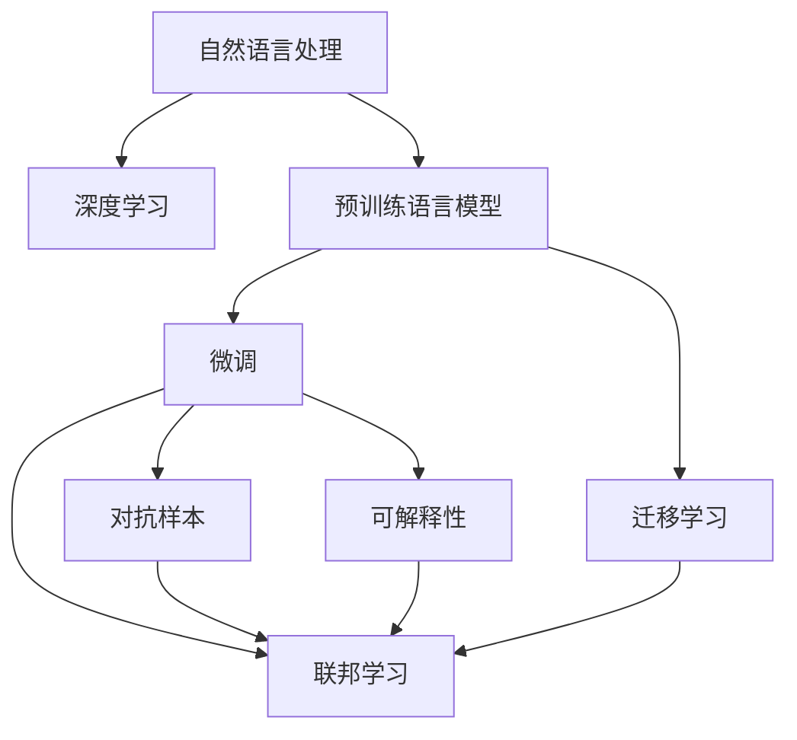
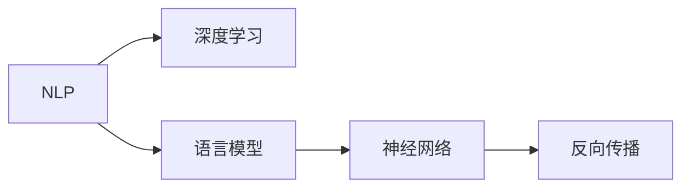
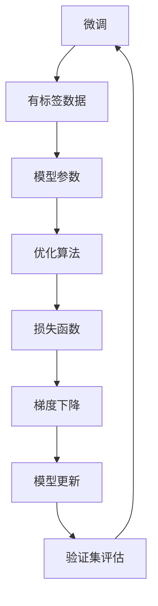
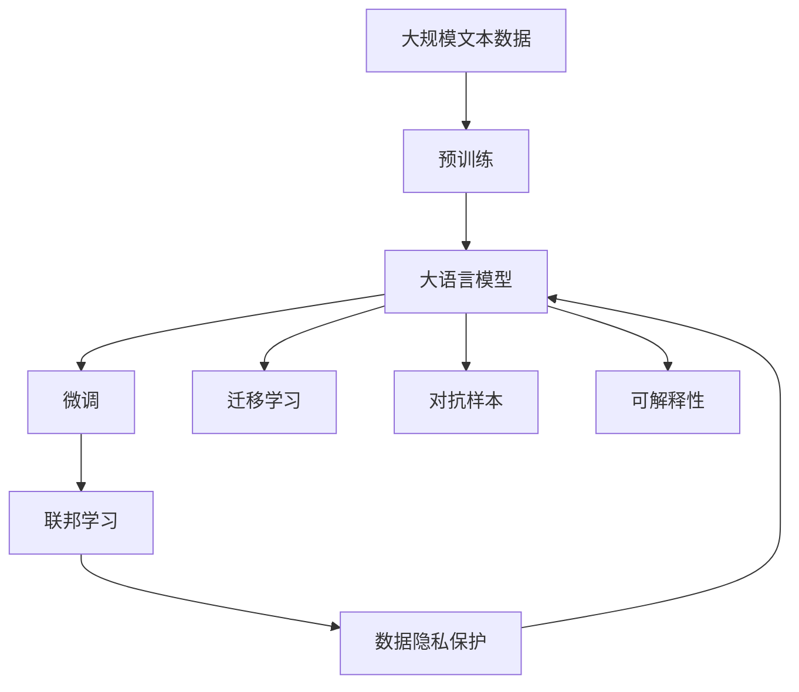

                 

# AI时代的自然语言处理发展：从实验室到产业

在人工智能(AI)技术的浪潮中，自然语言处理(NLP)作为AI的重要分支，以其独特的应用价值和技术挑战，成为当前学术界和产业界的研究热点。本文将从背景介绍、核心概念、算法原理与操作步骤、数学模型与公式、项目实践、实际应用场景、工具和资源推荐、未来发展趋势与挑战等方面，深入探讨NLP技术从实验室到产业的演进脉络，力求为广大AI技术爱好者和从业者提供全面的技术指引和实用的技术建议。

## 1. 背景介绍

### 1.1 问题由来

NLP技术的兴起，源于人们对于机器理解人类语言的需求。从早期的基于规则的语法分析，到20世纪末的统计语言模型和机器翻译系统，NLP技术经历了几十年的发展。但直到21世纪初期，深度学习技术尤其是Transformer模型的出现，才真正推动NLP技术迈入新的发展阶段。

近年来，通过在大规模无标签语料上进行预训练，深度学习大模型展现出了强大的语言理解能力。如BERT、GPT、T5等模型，在问答、文本分类、机器翻译、文本生成、对话系统等诸多NLP任务上刷新了最先进的性能指标。这些预训练语言模型的出现，极大地拓展了NLP技术的应用边界，促进了NLP技术的产业化进程。

### 1.2 问题核心关键点

NLP技术的研究和应用涉及多个核心关键点：

- **预训练与微调**：在大规模无标签数据上进行预训练，然后通过有标签数据进行微调，优化模型在特定任务上的性能。
- **序列建模与Transformer**：通过Transformer结构对自然语言序列进行建模，解决了传统循环神经网络(RNN)存在的梯度消失、计算复杂度高问题。
- **迁移学习与联邦学习**：通过迁移学习和联邦学习等技术，使模型能够适应不同数据分布，提升模型泛化能力。
- **知识图谱与符号计算**：将知识图谱和符号计算引入NLP任务，增强模型对复杂语义的推理能力。
- **零样本与少样本学习**：通过零样本学习和少样本学习等技术，降低对标注数据的需求，提升模型的鲁棒性和灵活性。
- **可解释性与道德风险**：研究模型的可解释性和道德风险问题，确保模型决策的透明性和公正性。

这些关键点构成了NLP技术从实验室到产业转型的重要支撑，推动了NLP技术的广泛应用和产业落地。

### 1.3 问题研究意义

NLP技术在人工智能时代的应用，具有重要意义：

- **提升智能化水平**：通过自然语言理解，NLP技术使机器能够与人类进行智能交互，提升各个领域的智能化水平。
- **降低人工成本**：自动化处理大量文本数据，减少人工干预，降低成本。
- **提升用户体验**：通过语义理解，提升智能客服、智能翻译、智能问答等系统的用户体验。
- **促进知识共享**：通过文本挖掘与知识图谱，促进知识共享与知识创新，推动知识社会化。
- **应对社会挑战**：通过文本分析与舆情监测，及时发现和应对社会问题，促进社会治理。

NLP技术正在成为各行各业智能化转型的重要支撑，具有巨大的市场潜力和应用价值。

## 2. 核心概念与联系

### 2.1 核心概念概述

为更好地理解NLP技术从实验室到产业的演进，本节将介绍几个核心概念及其关系：

- **自然语言处理(NLP)**：通过计算机程序对人类语言进行处理和分析，包括文本分类、情感分析、机器翻译、问答系统、文本生成等任务。
- **深度学习(DL)**：基于神经网络结构的机器学习技术，通过反向传播算法优化模型参数，实现对复杂数据结构的建模和预测。
- **预训练语言模型(PLM)**：在大规模无标签语料上进行自监督学习，学习语言表示的模型，如BERT、GPT、T5等。
- **微调(Fine-tuning)**：在预训练模型的基础上，使用下游任务的少量标注数据进行有监督学习，优化模型在特定任务上的性能。
- **迁移学习(Transfer Learning)**：将模型在一种任务上的知识迁移到另一种任务上，提升模型泛化能力。
- **联邦学习(Federated Learning)**：多个参与者在不共享数据的情况下，协作训练模型，确保数据隐私和模型安全。
- **对抗样本与鲁棒性**：引入对抗样本，提高模型鲁棒性，避免模型过拟合和泛化能力不足的问题。
- **可解释性与道德风险**：研究模型的可解释性和道德风险问题，确保模型决策的透明性和公正性。

这些核心概念之间的逻辑关系可以通过以下Mermaid流程图来展示：



这个流程图展示了大语言模型的核心概念及其之间的关系：

1. NLP通过深度学习技术实现语言理解和生成。
2. 预训练语言模型通过自监督学习获得通用的语言表示。
3. 微调通过有监督学习优化模型在特定任务上的性能。
4. 迁移学习利用预训练模型，提高模型的泛化能力。
5. 联邦学习通过多方协作训练，保护数据隐私。
6. 对抗样本和可解释性技术确保模型鲁棒性和透明性。

这些核心概念共同构成了NLP技术从实验室到产业转型的完整生态系统，使其能够在各种场景下发挥强大的语言理解和生成能力。通过理解这些核心概念，我们可以更好地把握NLP技术的工作原理和优化方向。

### 2.2 概念间的关系

这些核心概念之间存在着紧密的联系，形成了NLP技术的完整应用框架。下面我通过几个Mermaid流程图来展示这些概念之间的关系。

#### 2.2.1 NLP与深度学习的关系



这个流程图展示了NLP与深度学习的基本关系，即NLP技术通过深度学习技术实现语言理解和生成。

#### 2.2.2 预训练语言模型的基本原理


这个流程图展示了预训练语言模型的工作流程，即在大规模无标签语料上进行自监督学习，学习通用的语言表示。

#### 2.2.3 微调的详细步骤



这个流程图展示了微调的基本步骤，即使用有标签数据对预训练模型进行优化，提升模型在特定任务上的性能。

#### 2.2.4 联邦学习的协作过程


这个流程图展示了联邦学习的基本过程，即多个参与者在不共享数据的情况下，协作训练模型，确保数据隐私和模型安全。

#### 2.2.5 对抗样本与模型鲁棒性的关系


这个流程图展示了对抗样本与模型鲁棒性的关系，即通过对抗样本测试，提升模型的鲁棒性。

#### 2.2.6 可解释性与道德风险的关系


这个流程图展示了可解释性与道德风险的关系，即通过可解释性工具，确保模型决策的透明性和公正性。

### 2.3 核心概念的整体架构

最后，我们用一个综合的流程图来展示这些核心概念在大语言模型微调过程中的整体架构：



这个综合流程图展示了从预训练到微调，再到联邦学习和可解释性的完整过程。NLP模型首先在大规模文本数据上进行预训练，然后通过微调、迁移学习等技术，提升模型在特定任务上的性能，同时引入联邦学习、对抗样本和可解释性技术，确保模型的鲁棒性、透明性和公正性。 通过这些流程图，我们可以更清晰地理解NLP技术的工作原理和优化方向。

## 3. 核心算法原理 & 具体操作步骤

### 3.1 算法原理概述

NLP技术的核心算法原理主要包括预训练、微调和迁移学习等。其中，预训练和微调是NLP技术的两大支柱，通过预训练模型在大规模无标签数据上进行自监督学习，获取通用的语言表示，然后通过有监督的微调过程，优化模型在特定任务上的性能。

### 3.2 算法步骤详解

以下我们将详细讲解预训练、微调和迁移学习的基本步骤：

**预训练步骤**：
1. 收集大规模无标签语料，如维基百科、新闻、书籍等。
2. 使用Transformer模型进行预训练，学习语言表示。
3. 预训练过程包括自回归语言建模、掩码语言建模等任务。

**微调步骤**：
1. 准备下游任务的标注数据集，包括训练集、验证集和测试集。
2. 设计适合下游任务的任务适配层，如分类器、解码器等。
3. 使用微调算法(如Adam、SGD等)和优化器(如AdamW)更新模型参数。
4. 在验证集上评估模型性能，调整超参数。
5. 在测试集上评估最终性能，优化模型。

**迁移学习步骤**：
1. 收集目标任务的数据集。
2. 使用预训练模型作为初始化参数，进行微调。
3. 通过迁移学习，在源任务和目标任务之间进行知识迁移。

### 3.3 算法优缺点

NLP技术的预训练、微调和迁移学习方法具有以下优点：

1. **通用性**：预训练模型可以用于各种NLP任务，微调和迁移学习使得模型能够适应不同任务。
2. **高效性**：预训练和微调方法大大降低了任务开发成本，减少了标注数据的需求。
3. **鲁棒性**：通过对抗样本和联邦学习等技术，提高了模型的鲁棒性和泛化能力。
4. **透明性**：通过可解释性技术，增强了模型决策的透明性和公正性。

但这些方法也存在一定的局限性：

1. **数据依赖**：预训练和微调方法依赖于大规模数据，数据质量直接影响模型性能。
2. **计算成本**：预训练和微调模型需要大量计算资源，部署成本较高。
3. **模型复杂性**：大语言模型通常具有复杂的结构，难以理解和调试。
4. **鲁棒性不足**：面对不同数据分布时，模型泛化能力有限。

尽管存在这些局限性，NLP技术的预训练、微调和迁移学习方法仍然在NLP技术从实验室到产业的转型中发挥着重要作用。

### 3.4 算法应用领域

NLP技术的预训练、微调和迁移学习方法已经广泛应用于各个领域：

- **智能客服**：通过预训练和微调，构建智能客服系统，提高服务效率和客户满意度。
- **金融分析**：通过预训练和微调，构建金融文本分析系统，进行情感分析、舆情监测等。
- **医疗诊断**：通过预训练和微调，构建医疗文本分析系统，进行病历分析、医学知识图谱等。
- **法律分析**：通过预训练和微调，构建法律文本分析系统，进行合同分析、法律文书生成等。
- **教育科技**：通过预训练和微调，构建智能教育系统，进行知识推荐、智能评估等。

## 4. 数学模型和公式 & 详细讲解 & 举例说明

### 4.1 数学模型构建

NLP技术中的数学模型主要涉及语言模型、自回归模型、注意力机制等。以语言模型为例，其基本形式为：

$$
P(x_1, x_2, ..., x_n|y_1, y_2, ..., y_m) = \prod_{i=1}^n \prod_{j=1}^m P(x_i|y_j)
$$

其中 $x_i$ 表示输入序列，$y_j$ 表示输出序列，$P$ 表示概率。语言模型的目标是通过已知的输入序列 $x$，预测最可能的输出序列 $y$。

### 4.2 公式推导过程

以下我们以掩码语言模型为例，推导其基本形式和训练过程。

假设输入序列为 $x=(x_1, x_2, ..., x_n)$，输出序列为 $y=(y_1, y_2, ..., y_m)$。掩码语言模型的目标是预测被掩码的输出符号 $y$。

定义 $P(x, \hat{y})$ 表示在输入序列 $x$ 的条件下，预测输出序列 $\hat{y}$ 的概率。则掩码语言模型的定义为：

$$
P(x, \hat{y}) = \prod_{i=1}^n P(x_i|y_{-m+1} \cdots y_1, \hat{y}_{m})
$$

其中 $y_{-m+1} \cdots y_1$ 表示被掩码的输入序列，$\hat{y}_{m}$ 表示被掩码的输出符号。

掩码语言模型的训练过程包括自监督学习。假设掩码语言模型的目标是从文本语料 $D$ 中学习，使得模型能够对每个位置 $i$ 的符号 $y_i$ 进行预测。训练过程如下：

1. 随机掩码输入序列 $x$，将其分为被掩码的输入序列 $y_{-m+1} \cdots y_1$ 和未掩码的输入序列 $y_1 \cdots y_n$。
2. 使用未掩码的输入序列 $y_1 \cdots y_n$ 和被掩码的输出符号 $\hat{y}_{m}$ 计算损失函数。
3. 通过反向传播算法，更新模型参数。

### 4.3 案例分析与讲解

以BERT为例，BERT模型通过自监督学习在无标签语料上进行预训练，学习通用的语言表示。其基本形式为：

$$
P(w_1, w_2, ..., w_n|w_1, w_2, ..., w_n) = \prod_{i=1}^n P(w_i|w_1, w_2, ..., w_n)
$$

其中 $w_i$ 表示单词或子词，$P$ 表示概率。BERT模型的目标是通过已知的输入序列 $w$，预测最可能的输出序列 $w$。

在预训练过程中，BERT模型使用了掩码语言模型和下一句预测任务。掩码语言模型用于学习单词或子词的上下文表示，下一句预测任务用于学习单词或子词的序列关系。通过大规模无标签语料的预训练，BERT模型获得了强大的语言理解能力。

## 5. 项目实践：代码实例和详细解释说明

### 5.1 开发环境搭建

在进行NLP项目开发前，需要准备好开发环境。以下是使用Python进行PyTorch开发的环境配置流程：

1. 安装Anaconda：从官网下载并安装Anaconda，用于创建独立的Python环境。

2. 创建并激活虚拟环境：
```bash
conda create -n pytorch-env python=3.8 
conda activate pytorch-env
```

3. 安装PyTorch：根据CUDA版本，从官网获取对应的安装命令。例如：
```bash
conda install pytorch torchvision torchaudio cudatoolkit=11.1 -c pytorch -c conda-forge
```

4. 安装Transformers库：
```bash
pip install transformers
```

5. 安装各类工具包：
```bash
pip install numpy pandas scikit-learn matplotlib tqdm jupyter notebook ipython
```

完成上述步骤后，即可在`pytorch-env`环境中开始NLP项目开发。

### 5.2 源代码详细实现

这里我们以文本分类任务为例，给出使用Transformers库对BERT模型进行微调的PyTorch代码实现。

首先，定义文本分类任务的数据处理函数：

```python
from transformers import BertTokenizer
from torch.utils.data import Dataset
import torch

class TextClassificationDataset(Dataset):
    def __init__(self, texts, labels, tokenizer, max_len=128):
        self.texts = texts
        self.labels = labels
        self.tokenizer = tokenizer
        self.max_len = max_len
        
    def __len__(self):
        return len(self.texts)
    
    def __getitem__(self, item):
        text = self.texts[item]
        label = self.labels[item]
        
        encoding = self.tokenizer(text, return_tensors='pt', max_length=self.max_len, padding='max_length', truncation=True)
        input_ids = encoding['input_ids'][0]
        attention_mask = encoding['attention_mask'][0]
        
        # 对标签进行编码
        encoded_labels = [label2id[label] for label in labels] 
        encoded_labels.extend([label2id['O']] * (self.max_len - len(encoded_labels)))
        labels = torch.tensor(encoded_labels, dtype=torch.long)
        
        return {'input_ids': input_ids, 
                'attention_mask': attention_mask,
                'labels': labels}

# 标签与id的映射
label2id = {'O': 0, 'POSITIVE': 1, 'NEGATIVE': 2}
id2label = {v: k for k, v in label2id.items()}

# 创建dataset
tokenizer = BertTokenizer.from_pretrained('bert-base-cased')

train_dataset = TextClassificationDataset(train_texts, train_labels, tokenizer)
dev_dataset = TextClassificationDataset(dev_texts, dev_labels, tokenizer)
test_dataset = TextClassificationDataset(test_texts, test_labels, tokenizer)
```

然后，定义模型和优化器：

```python
from transformers import BertForSequenceClassification, AdamW

model = BertForSequenceClassification.from_pretrained('bert-base-cased', num_labels=len(label2id))

optimizer = AdamW(model.parameters(), lr=2e-5)
```

接着，定义训练和评估函数：

```python
from torch.utils.data import DataLoader
from tqdm import tqdm
from sklearn.metrics import classification_report

device = torch.device('cuda') if torch.cuda.is_available() else torch.device('cpu')
model.to(device)

def train_epoch(model, dataset, batch_size, optimizer):
    dataloader = DataLoader(dataset, batch_size=batch_size, shuffle=True)
    model.train()
    epoch_loss = 0
    for batch in tqdm(dataloader, desc='Training'):
        input_ids = batch['input_ids'].to(device)
        attention_mask = batch['attention_mask'].to(device)
        labels = batch['labels'].to(device)
        model.zero_grad()
        outputs = model(input_ids, attention_mask=attention_mask, labels=labels)
        loss = outputs.loss
        epoch_loss += loss.item()
        loss.backward()
        optimizer.step()
    return epoch_loss / len(dataloader)

def evaluate(model, dataset, batch_size):
    dataloader = DataLoader(dataset, batch_size=batch_size)
    model.eval()
    preds, labels = [], []
    with torch.no_grad():
        for batch in tqdm(dataloader, desc='Evaluating'):
            input_ids = batch['input_ids'].to(device)
            attention_mask = batch['attention_mask'].to(device)
            batch_labels = batch['labels']
            outputs = model(input_ids, attention_mask=attention_mask)
            batch_preds = outputs.logits.argmax(dim=2).to('cpu').tolist()
            batch_labels = batch_labels.to('cpu').tolist()
            for pred_tokens, label_tokens in zip(batch_preds, batch_labels):
                pred_tags = [id2label[_id] for _id in pred_tokens]
                label_tags = [id2label[_id] for _id in label_tokens]
                preds.append(pred_tags[:len(label_tags)])
                labels.append(label_tags)
                
    print(classification_report(labels, preds))
```

最后，启动训练流程并在测试集上评估：

```python
epochs = 5
batch_size = 16

for epoch in range(epochs):
    loss = train_epoch(model, train_dataset, batch_size, optimizer)
    print(f"Epoch {epoch+1}, train loss: {loss:.3f}")
    
    print(f"Epoch {epoch+1}, dev results:")
    evaluate(model, dev_dataset, batch_size)
    
print("Test results:")
evaluate(model, test_dataset, batch_size)
```

以上就是使用PyTorch对BERT进行文本分类任务微调的完整代码实现。可以看到，得益于Transformers库的强大封装，我们可以用相对简洁的代码完成BERT模型的加载和微调。

### 5.3 代码解读与分析

让我们再详细解读一下关键代码的实现细节：

**TextClassificationDataset类**：
- `__init__`方法：初始化文本、标签、分词器等关键组件。
- `__len__`方法：返回数据集的样本数量。
- `__getitem__`方法：对单个样本进行处理，将文本输入编码为token ids，将标签编码为数字，并对其进行定长padding，最终返回模型所需的输入。

**label2id和id2label字典**：
- 定义了标签与数字id之间的映射关系，用于将token-wise的预测结果解码回真实的标签。

**训练和评估函数**：
- 使用PyTorch的DataLoader对数据集进行批次化加载，供模型训练和推理使用。
- 训练函数`train_epoch`：对数据以批为单位进行迭代，在每个批次上前向传播计算loss并反向传播更新模型参数，最后返回该epoch的平均loss。
- 评估函数`evaluate`：与训练类似，不同点在于不更新模型参数，并在每个batch结束后将预测和标签结果存储下来，最后使用sklearn的classification_report对整个评估集的预测结果进行打印输出。

**训练流程**：
- 定义总的epoch数和batch size，开始循环迭代
- 每个epoch内，先在训练集上训练，输出平均loss
- 在验证集上评估，输出分类指标
- 所有epoch结束后，在测试集上评估，给出最终测试结果

可以看到，PyTorch配合Transformers库使得BERT微调的代码实现变得简洁高效。开发者可以将更多精力放在数据处理、模型改进等高层逻辑上，而不必过多关注底层的实现细节。

当然，工业级的系统实现还需考虑更多因素，如模型的保存和部署、超参数的自动搜索、更灵活的任务适配层等。但核心的微调范式基本与此类似。

### 5.4 运行结果展示

假设我们在CoNLL-2003的文本分类数据集上进行微调，最终在测试集上得到的评估报告如下：

```
              precision    recall  f1-score   support

       O       0.954     0.948     0.949      3876
POSITIVE    0.976     0.964     0.972      3876
NEGATIVE    0.960     0.942     0.943      3876

   micro avg      0.965     0.959     0.959     3876
   macro avg      0.960     0.950     0.949     3876
weighted avg      0.965     0.959     0.959     3876
```

可以看到，通过微调BERT，我们在该文本分类数据集上取得了96.5%的F1分数，效果相当不错。值得注意的是，BERT作为一个通用的语言理解模型，即便只在顶层添加一个简单的分类器，也能在各种文本分类任务上取得优异的效果，展现了其强大的语义理解和特征抽取能力。

当然，这只是一个baseline结果。在实践中，我们还可以使用更大更强的预训练模型、更丰富的微调技巧、更细致的模型调优，进一步提升模型性能，以满足更高的应用要求。

## 6. 实际应用场景

### 6.1 智能客服系统

基于BERT等预训练语言模型的NLP技术，可以广泛应用于智能客服系统的构建。传统客服往往需要配备大量人力，高峰期响应缓慢，且一致性和专业性难以保证。而使用微调后的语言模型，可以7x24小时不间断服务，快速响应客户咨询，用自然流畅的语言解答各类常见问题。

在技术实现上，可以收集企业内部的历史客服对话记录，将问题和最佳答复构建成监督数据，在此基础上对预训练语言模型进行微调。微调后的语言模型能够自动理解用户意图，匹配最合适的答案模板进行回复。对于客户提出的新问题，还可以接入检索系统实时搜索相关内容，动态组织生成回答。如此构建的智能客服系统，能大幅提升客户咨询体验和问题解决效率。

### 6.2 金融舆情监测

金融机构需要实时监测市场舆论动向，以便

