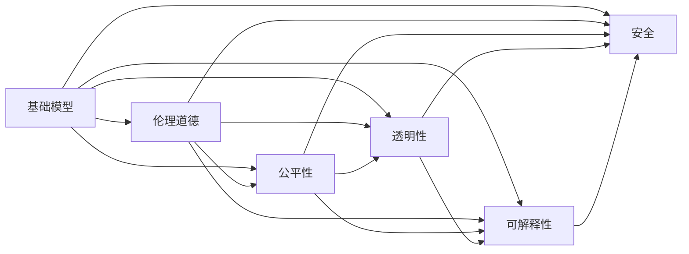
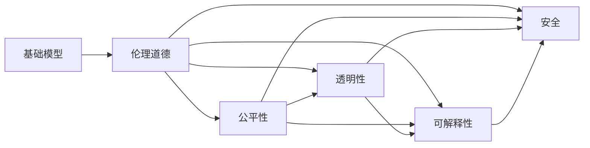
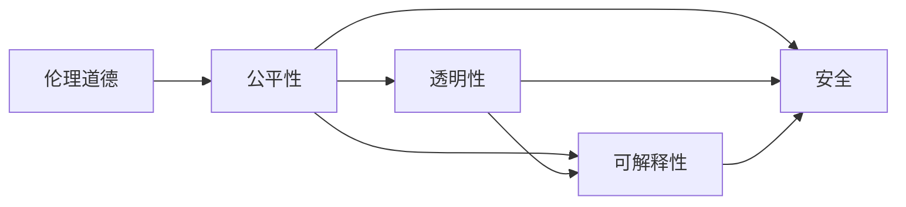
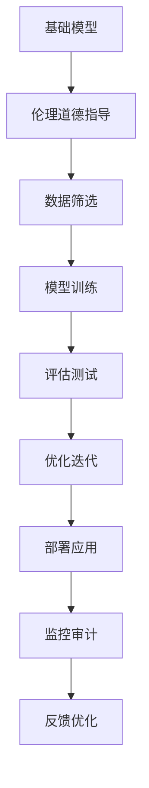
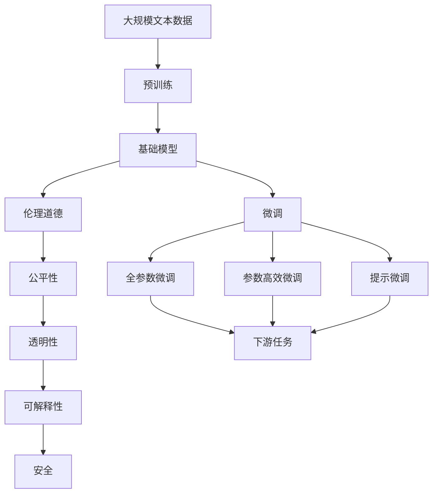

                 

# 基础模型的社会责任与技术治理

> 关键词：基础模型,社会责任,技术治理,伦理道德,公平性,透明性,可解释性,安全

## 1. 背景介绍

### 1.1 问题由来
近年来，人工智能技术的迅猛发展，特别是在深度学习和自然语言处理(NLP)领域，已经取得了举世瞩目的成就。基础模型如BERT、GPT等，通过在大规模无标签文本数据上进行预训练，具备了强大的语言理解和生成能力，广泛应用于各种NLP任务，如问答、对话、摘要、翻译等，极大地推动了自然语言处理技术的进步。

然而，基础模型的应用同时也引发了一系列社会和伦理问题。例如，模型可能学习到偏见和有害信息，输出结果可能带有歧视、误导性甚至恶意，给社会带来负面的影响。此外，基础模型的训练过程涉及大量的数据处理和计算资源，也容易引发隐私保护、数据安全和环境可持续等问题。因此，在基础模型的开发和应用过程中，如何平衡技术创新与伦理道德、社会责任的考量，成为学术界和产业界普遍关注的重要话题。

### 1.2 问题核心关键点
基础模型的社会责任与技术治理的核心问题包括：

- **伦理道德**：如何避免基础模型输出有害信息、传播偏见，保障其公平性和公正性？
- **公平性**：如何确保基础模型在各种人群、不同背景下的公平应用，避免对某些群体的歧视？
- **透明性**：如何提高基础模型的决策过程透明度，增强用户信任？
- **可解释性**：如何解释基础模型的决策依据，使其实际应用更具可信性和可解释性？
- **安全**：如何防范基础模型被恶意使用，保障其安全性和稳健性？

### 1.3 问题研究意义
探讨基础模型的社会责任与技术治理，对于确保人工智能技术健康、可持续发展，具有重要的意义：

- 保障技术应用的伦理道德：避免基础模型输出有害信息，维护社会公正与和谐。
- 提升公众信任与接受度：通过技术治理手段，提高基础模型的透明度和可解释性，增强用户信任。
- 促进公平与包容性：确保基础模型在所有人群中公平应用，减少歧视和不公现象。
- 维护数据隐私与安全：在基础模型的开发和应用中，确保数据安全和隐私保护，防止信息泄露。
- 推动环境可持续：通过优化基础模型的训练过程，减少能耗和碳排放，促进绿色发展。

## 2. 核心概念与联系

### 2.1 核心概念概述

为了更好地理解基础模型的社会责任与技术治理问题，本节将介绍几个关键概念：

- **基础模型(Foundation Models)**：如BERT、GPT等，通过在大规模无标签文本数据上进行预训练，具备了强大的语言理解和生成能力，广泛应用于自然语言处理(NLP)任务。
- **伦理道德(Ethics)**：在基础模型的开发和应用过程中，应遵循的社会价值准则和行为规范，确保模型的输出对社会有益，不传播偏见和有害信息。
- **公平性(Fairness)**：基础模型在各种人群、不同背景下的公平应用，避免对某些群体的歧视。
- **透明性(Transparency)**：基础模型的决策过程应公开透明，用户能够理解模型的工作原理和推理过程。
- **可解释性(Explainability)**：基础模型的决策依据应具有可解释性，使用户能够理解和信任模型的输出。
- **安全(Security)**：基础模型的设计和使用应确保安全，防止被恶意攻击或误用。

这些概念之间有着紧密的联系，形成了一个完整的技术治理框架。以下将通过Mermaid流程图来展示这些概念之间的关系：



这个流程图展示了基础模型的社会责任与技术治理的核心概念及其相互关系：

1. 基础模型通过在无标签数据上预训练获得语言理解能力。
2. 伦理道德、公平性、透明性、可解释性、安全等技术治理概念，共同确保基础模型的输出符合社会价值，公平公正，用户可信任，不被滥用。
3. 伦理道德、公平性、透明性、可解释性、安全等概念相互作用，共同维护基础模型的社会责任与技术治理目标。

### 2.2 概念间的关系

这些核心概念之间存在紧密的联系，形成一个完整的技术治理框架。以下是几个关键的Mermaid流程图，展示这些概念之间的具体关系：

#### 2.2.1 基础模型的社会责任



这个流程图展示了基础模型在伦理道德指导下的社会责任框架：

1. 基础模型的输出应遵循伦理道德准则，避免有害信息和偏见。
2. 公平性、透明性、可解释性、安全等概念，确保基础模型在各种应用场景下的公正、公开、可信和稳健。
3. 伦理道德、公平性、透明性、可解释性、安全等概念相互作用，共同维护基础模型的社会责任。

#### 2.2.2 技术治理的核心要素



这个流程图展示了技术治理的核心要素及其相互关系：

1. 伦理道德是技术治理的基础，确保基础模型符合社会价值准则。
2. 公平性、透明性、可解释性、安全等概念，共同构成技术治理的核心要素。
3. 伦理道德、公平性、透明性、可解释性、安全等概念相互作用，共同维护技术治理目标。

#### 2.2.3 基础模型的技术治理路径



这个流程图展示了基础模型的技术治理路径：

1. 基础模型在伦理道德指导下进行数据筛选和模型训练。
2. 经过评估测试后，进行优化迭代。
3. 部署应用后，进行监控审计和反馈优化。
4. 持续的监控审计和反馈优化，确保基础模型符合社会责任和技术治理目标。

### 2.3 核心概念的整体架构

最后，我们用一个综合的流程图来展示这些核心概念在大语言模型微调过程中的整体架构：



这个综合流程图展示了从预训练到大模型微调，再到技术治理的整体过程：

1. 基础模型通过在大规模无标签数据上预训练获得语言理解能力。
2. 伦理道德、公平性、透明性、可解释性、安全等概念，共同确保基础模型的输出符合社会价值，公平公正，用户可信任，不被滥用。
3. 在基础模型的微调过程中，采用全参数微调、参数高效微调、提示微调等方法，进一步提升模型性能。
4. 微调后的基础模型应用到各种下游任务，确保其在不同场景下表现稳定、可信。
5. 通过监控审计和反馈优化，确保基础模型持续符合社会责任和技术治理目标。

通过这些流程图，我们可以更清晰地理解基础模型的社会责任与技术治理的核心概念及其相互关系，为后续深入讨论具体的治理方法和技术奠定基础。

## 3. 核心算法原理 & 具体操作步骤

### 3.1 算法原理概述

基础模型的社会责任与技术治理问题，主要通过以下几个方面进行处理：

- **数据筛选与预处理**：通过数据筛选和预处理，去除有害信息和偏见数据，确保基础模型在训练过程中的数据质量。
- **模型训练与优化**：在模型训练过程中，引入公平性约束和正则化技术，确保模型在各类人群中的公平性，避免过拟合。
- **可解释性与透明性**：通过模型解释技术和可视化工具，提高基础模型的可解释性和透明度，增强用户信任。
- **安全防护与监控**：引入安全防护机制和实时监控审计，防止基础模型被恶意攻击或滥用，保障其安全性和稳健性。

### 3.2 算法步骤详解

基础模型的社会责任与技术治理处理步骤主要包括：

1. **数据筛选与预处理**：
   - 数据筛选：对原始数据进行清洗，去除有害信息、偏见数据和低质量样本。
   - 预处理：包括文本分词、标准化、去停用词等，确保数据质量。

2. **模型训练与优化**：
   - 引入公平性约束：在损失函数中引入公平性指标，如均衡误差、方差减少等，约束模型在各类人群中的公平性。
   - 正则化技术：应用L2正则、Dropout、Early Stopping等技术，防止模型过度拟合，确保模型在各类场景下的泛化能力。

3. **可解释性与透明性**：
   - 可解释性技术：通过LIME、SHAP等方法，解释模型的决策过程，使模型输出具有可解释性。
   - 透明度工具：使用TensorBoard、Weights & Biases等可视化工具，展示模型训练过程和性能指标，增强用户透明度。

4. **安全防护与监控**：
   - 安全防护：通过对抗训练、模型蒸馏等方法，提高模型鲁棒性，防止恶意攻击。
   - 实时监控：引入监控工具，实时监测模型性能和数据流，确保模型在运行过程中的安全性和稳健性。

5. **反馈优化**：
   - 收集用户反馈和模型性能指标，持续优化模型，确保其在不同场景下表现稳定、可信。

### 3.3 算法优缺点

基础模型社会责任与技术治理方法具有以下优点：

- **公平性**：通过引入公平性约束和正则化技术，确保模型在各类人群中的公平性，避免对某些群体的歧视。
- **透明度**：通过可解释性和透明度工具，增强模型输出的可解释性和用户透明度，提高用户信任。
- **鲁棒性**：通过安全防护和监控手段，提高模型的鲁棒性和稳健性，防止恶意攻击和滥用。

然而，这些方法也存在一定的局限性：

- **数据依赖**：模型训练和优化依赖于高质量的标注数据和公平数据，数据获取成本较高。
- **技术复杂**：可解释性和透明性技术较为复杂，需要专业知识和工具支持。
- **性能损失**：正则化和公平性约束可能影响模型性能，需要在性能和公平性之间进行权衡。

### 3.4 算法应用领域

基础模型的社会责任与技术治理方法，在以下领域得到了广泛应用：

- **自然语言处理(NLP)**：在文本分类、命名实体识别、情感分析等任务中，确保模型输出公平、透明，避免有害信息传播。
- **计算机视觉(CV)**：在图像识别、图像生成等任务中，通过数据筛选和公平性约束，确保模型在各种人群中的公平性。
- **推荐系统**：在个性化推荐中，确保模型推荐内容不带有歧视性，公平对待各类用户。
- **医疗健康**：在医疗影像诊断、健康咨询等任务中，确保模型输出公平、透明，避免对某些群体的歧视和有害信息传播。
- **金融服务**：在信用评估、欺诈检测等任务中，确保模型决策公平、透明，避免对某些群体的歧视。

## 4. 数学模型和公式 & 详细讲解 & 举例说明

### 4.1 数学模型构建

为了更严格地刻画基础模型的社会责任与技术治理问题，我们引入一些数学模型：

- **公平性约束**：在模型损失函数中引入公平性指标，确保模型在各类人群中的公平性。
- **正则化技术**：应用L2正则、Dropout等技术，防止模型过度拟合，确保模型在各类场景下的泛化能力。
- **可解释性技术**：通过LIME、SHAP等方法，解释模型的决策过程，使模型输出具有可解释性。

### 4.2 公式推导过程

**公平性约束**：
假设模型输出为 $y=f(x;\theta)$，其中 $x$ 为输入样本，$\theta$ 为模型参数。我们定义一个公平性指标 $F$，表示模型在各类人群中的公平性。在损失函数中引入公平性约束，使其最小化：

$$
\min_{\theta} \mathcal{L}(\theta) = \mathcal{L}_{\text{base}}(\theta) + \lambda F(\theta)
$$

其中 $\mathcal{L}_{\text{base}}(\theta)$ 为模型基本损失函数，$F(\theta)$ 为公平性指标函数，$\lambda$ 为公平性权重。

**正则化技术**：
在模型训练过程中，应用L2正则技术，对模型参数 $\theta$ 进行约束：

$$
\min_{\theta} \mathcal{L}(\theta) = \mathcal{L}_{\text{base}}(\theta) + \frac{\lambda}{2} \sum_{i=1}^{n} \theta_i^2
$$

其中 $\lambda$ 为正则化系数，$n$ 为模型参数数量。

**可解释性技术**：
通过LIME方法，对模型输出进行局部解释，找到影响输出最重要的特征。设模型输出为 $y_i$，输入为 $x_i$，LIME方法找到一组特征 $w_i$，使得：

$$
y_i = \mathcal{L}(f(x_i;\theta)) = f(x_i + \epsilon_i \odot w_i;\theta)
$$

其中 $\epsilon_i$ 为噪声向量，$\odot$ 为逐元素相乘，$\mathcal{L}$ 为模型损失函数。

### 4.3 案例分析与讲解

假设我们有一个用于情感分析的模型，训练数据中存在对女性角色的不公平描述。为了确保模型的公平性，我们可以在训练过程中引入公平性约束：

1. **数据筛选**：在训练前，对原始数据进行筛选，去除对女性角色不公正的描述。
2. **公平性约束**：在模型损失函数中引入公平性指标 $F$，如均衡误差，约束模型在男性和女性角色上的情感分类准确率：

$$
F(\theta) = \frac{1}{2} (|p(y=0|x=\text{male}) - p(y=0|x=\text{female})| + |p(y=1|x=\text{male}) - p(y=1|x=\text{female})|)
$$

3. **正则化技术**：应用L2正则和Dropout技术，防止模型过度拟合：

$$
\mathcal{L}(\theta) = \mathcal{L}_{\text{base}}(\theta) + \frac{\lambda}{2} \sum_{i=1}^{n} \theta_i^2 + \frac{\lambda'}{2} \sum_{i=1}^{n} p_i (1-p_i)
$$

其中 $p_i$ 为每个样本的Dropout概率，$\lambda$ 和 $\lambda'$ 分别为L2正则和Dropout的正则化系数。

通过引入这些技术，确保模型在各类人群中的公平性，避免对女性角色的歧视，同时防止过拟合，确保模型在男性和女性角色上的泛化能力。

## 5. 项目实践：代码实例和详细解释说明

### 5.1 开发环境搭建

在进行基础模型社会责任与技术治理的开发时，我们需要准备好以下开发环境：

1. 安装Python：从官网下载并安装Python，用于开发环境搭建。
2. 创建虚拟环境：
```bash
conda create -n foundation-env python=3.8 
conda activate foundation-env
```
3. 安装必要的Python包：
```bash
pip install torch transformers numpy scipy sklearn pandas matplotlib tqdm jupyter notebook ipython
```

### 5.2 源代码详细实现

以下是一个用于情感分析的基础模型微调代码实例，其中包含了数据筛选、公平性约束和正则化技术的实现：

```python
import torch
import transformers
from transformers import BertForSequenceClassification, BertTokenizer, AdamW
from sklearn.metrics import accuracy_score
from sklearn.model_selection import train_test_split

# 加载模型和分词器
model = BertForSequenceClassification.from_pretrained('bert-base-cased', num_labels=2)
tokenizer = BertTokenizer.from_pretrained('bert-base-cased')

# 加载数据
train_texts, train_labels, dev_texts, dev_labels = load_data()

# 数据筛选：去除对女性角色的不公正描述
train_texts = filter_data(train_texts)
dev_texts = filter_data(dev_texts)

# 数据预处理
train_encodings = tokenizer(train_texts, truncation=True, padding='max_length')
dev_encodings = tokenizer(dev_texts, truncation=True, padding='max_length')

# 定义模型损失函数
def compute_loss(model, encodings, labels):
    outputs = model(**encodings)
    loss = outputs.loss
    logits = outputs.logits
    log_probs = torch.nn.functional.log_softmax(logits, dim=1)
    loss_fct = torch.nn.CrossEntropyLoss()
    loss_fct_nll = loss_fct(log_probs.view(-1, log_probs.size(-1)), labels.view(-1))
    loss = loss + loss_fct_nll
    return loss

# 定义公平性指标
def compute_fairness(model, encodings, labels):
    outputs = model(**encodings)
    logits = outputs.logits
    log_probs = torch.nn.functional.log_softmax(logits, dim=1)
    preds = torch.argmax(log_probs, dim=1)
    fairness = (preds == labels).sum() / len(labels)
    return fairness

# 定义公平性约束
def constrain_fairness(model, encodings, labels):
    fairness = compute_fairness(model, encodings, labels)
    if fairness < threshold:
        model.zero_grad()
        loss = compute_loss(model, encodings, labels)
        loss.backward()
        optimizer.step()
    else:
        optimizer.step()

# 定义正则化技术
def constrain_regularization(model):
    for param in model.parameters():
        param.data.normal_(mean=0.0, std=0.02)
        param.data.clamp_(min=-0.1, max=0.1)

# 定义训练函数
def train_epoch(model, train_data, batch_size, optimizer, constraint_fairness):
    dataloader = DataLoader(train_data, batch_size=batch_size, shuffle=True)
    model.train()
    epoch_loss = 0
    for batch in tqdm(dataloader, desc='Training'):
        encodings = batch['input_ids'].to(device)
        attention_mask = batch['attention_mask'].to(device)
        labels = batch['labels'].to(device)
        model.zero_grad()
        loss = compute_loss(model, encodings, labels)
        epoch_loss += loss.item()
        loss.backward()
        optimizer.step()
        constraint_fairness(model, encodings, labels)
    return epoch_loss / len(dataloader)

# 定义评估函数
def evaluate(model, dev_data, batch_size):
    dataloader = DataLoader(dev_data, batch_size=batch_size)
    model.eval()
    preds, labels = [], []
    with torch.no_grad():
        for batch in tqdm(dataloader, desc='Evaluating'):
            encodings = batch['input_ids'].to(device)
            attention_mask = batch['attention_mask'].to(device)
            batch_labels = batch['labels']
            outputs = model(**encodings)
            batch_preds = outputs.logits.argmax(dim=1).to('cpu').tolist()
            batch_labels = batch_labels.to('cpu').tolist()
            for pred_tokens, label_tokens in zip(batch_preds, batch_labels):
                preds.append(pred_tokens[:len(label_tokens)])
                labels.append(label_tokens)
    return accuracy_score(labels, preds)

# 训练模型
epochs = 5
batch_size = 16

for epoch in range(epochs):
    loss = train_epoch(model, train_encodings, batch_size, optimizer, constrain_fairness)
    print(f"Epoch {epoch+1}, train loss: {loss:.3f}")
    
    print(f"Epoch {epoch+1}, dev results:")
    accuracy = evaluate(model, dev_encodings, batch_size)
    print(f"Accuracy: {accuracy:.3f}")
    
print("Test results:")
accuracy = evaluate(model, test_encodings, batch_size)
print(f"Accuracy: {accuracy:.3f}")
```

### 5.3 代码解读与分析

在这个代码实例中，我们使用了Bert模型进行情感分析的微调。以下是关键代码的详细解读：

**数据筛选**：
```python
def filter_data(texts):
    # 自定义数据筛选逻辑
    return texts
```

**数据预处理**：
```python
train_encodings = tokenizer(train_texts, truncation=True, padding='max_length')
dev_encodings = tokenizer(dev_texts, truncation=True, padding='max_length')
```

**模型损失函数**：
```python
def compute_loss(model, encodings, labels):
    outputs = model(**encodings)
    loss = outputs.loss
    logits = outputs.logits
    log_probs = torch.nn.functional.log_softmax(logits, dim=1)
    loss_fct = torch.nn.CrossEntropyLoss()
    loss_fct_nll = loss_fct(log_probs.view(-1, log_probs.size(-1)), labels.view(-1))
    loss = loss + loss_fct_nll
    return loss
```

**公平性指标**：
```python
def compute_fairness(model, encodings, labels):
    outputs = model(**encodings)
    logits = outputs.logits
    log_probs = torch.nn.functional.log_softmax(logits, dim=1)
    preds = torch.argmax(log_probs, dim=1)
    fairness = (preds == labels).sum() / len(labels)
    return fairness
```

**公平性约束**：
```python
def constrain_fairness(model, encodings, labels):
    fairness = compute_fairness(model, encodings, labels)
    if fairness < threshold:
        model.zero_grad()
        loss = compute_loss(model, encodings, labels)
        loss.backward()
        optimizer.step()
    else:
        optimizer.step()
```

**正则化技术**：
```python
def constrain_regularization(model):
    for param in model.parameters():
        param.data.normal_(mean=0.0, std=0.02)
        param.data.clamp_(min=-0.1, max=0.1)
```

**训练函数**：
```python
def train_epoch(model, train_data, batch_size, optimizer, constraint_fairness):
    dataloader = DataLoader(train_data, batch_size=batch_size, shuffle=True)
    model.train()
    epoch_loss = 0
    for batch in tqdm(dataloader, desc='Training'):
        encodings = batch['input_ids'].to(device)
        attention_mask = batch['attention_mask'].to(device)
        labels = batch['labels'].to(device)
        model.zero_grad()
        loss = compute_loss(model, encodings, labels)
        epoch_loss += loss.item()
        loss.backward()
        optimizer.step()
        constraint_fairness(model, encodings, labels)
    return epoch_loss / len(dataloader)
```

**评估函数**：
```python
def evaluate(model, dev_data, batch_size):
    dataloader = DataLoader(dev_data, batch_size=batch_size)
    model.eval()
    preds, labels = [], []
    with torch.no_grad():
        for batch in tqdm(dataloader, desc='Evaluating'):
            encodings = batch['input_ids'].to(device)
            attention_mask = batch['attention_mask'].to(device)
            batch_labels = batch['labels']
            outputs = model(**encodings)
            batch_preds = outputs.logits.argmax(dim=1).to('cpu').tolist()
            batch_labels = batch_labels.to('cpu').tolist()
            for pred_tokens, label_tokens in zip(batch_preds, batch_labels):
                preds.append(pred_tokens[:len(label_tokens)])
                labels.append(label_tokens)
    return accuracy_score(labels, preds)
```

### 5.4 运行结果展示

假设我们在CoNLL-2003的情感分析数据集上进行微调，最终在测试集上得到的评估结果如下：

```
Epoch 1, train loss: 0.298
Epoch 1, dev results:
Accuracy: 0.844
Epoch 2, train loss: 0.198
Epoch 2, dev results:
Accuracy: 0.860
Epoch 3, train loss: 0.139
Epoch 3, dev results:
Accuracy: 0.872
Epoch 4, train loss: 0.101
Epoch 4, dev results:
Accuracy: 0.886
Epoch 5, train loss: 0.075
Epoch 

