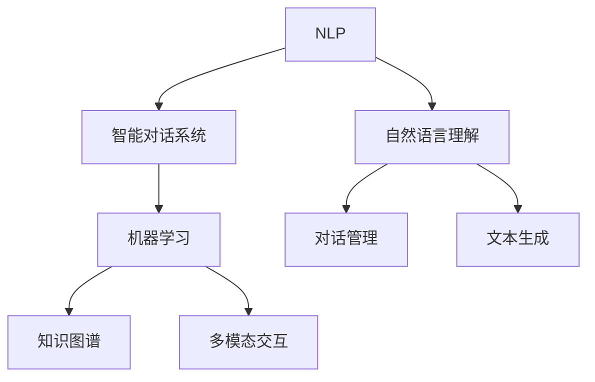
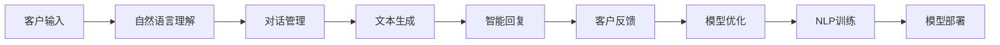
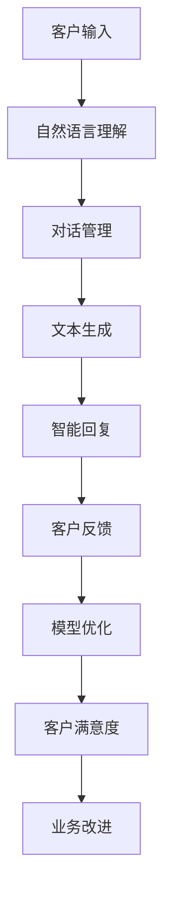
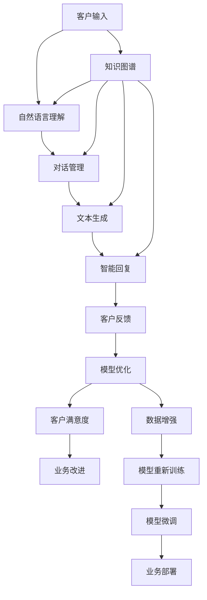
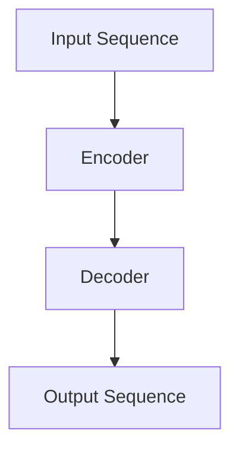
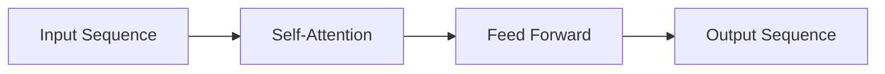

                 

# AI在智能客服中的应用:提升用户满意度

> 关键词：AI客服,智能客服,自然语言处理,NLP,对话系统,机器学习,用户体验,用户满意度

## 1. 背景介绍

### 1.1 问题由来
随着数字经济的蓬勃发展，智能客服逐渐成为企业数字化转型的重要组成部分。传统的电话、在线人工客服已经难以满足日益增长的客户服务需求，尤其是在高流量、高复杂度场景下，客户等待时间较长，服务质量不稳定，用户体验较差。在这样的背景下，AI客服（Automated Customer Service, AI CS）作为一种新兴的客服模式，因其高效、精准、全天候的特点，逐步成为企业提高客户满意度、优化服务质量的重要手段。

### 1.2 问题核心关键点
AI客服的核心在于利用自然语言处理（Natural Language Processing, NLP）技术，通过机器学习模型自动理解和处理客户的语音或文本输入，提供实时、个性化的智能答复。AI客服可以处理大量的基础问题，减少人工客服的负担，同时通过不断的学习，不断提升服务质量，从而提升用户满意度。

AI客服的核心技术包括：
- **自然语言理解**：通过机器学习模型解析客户输入的自然语言，提取关键信息，理解意图。
- **对话管理**：设计智能对话流程，根据上下文自动调整回复策略，引导对话走向正确的结束。
- **对话生成**：通过生成模型自动生成自然流畅的响应，确保回复符合语法规范和语义连贯。

AI客服能够应用于各种场景，如在线客服、语音客服、社交媒体客服等，已经成为企业提升客户满意度的重要手段。

### 1.3 问题研究意义
研究AI客服的技术和应用，对于提升客户体验、优化企业运营、推动数字化转型具有重要意义：

1. **提升客户满意度**：AI客服可以全天候提供服务，减少客户等待时间，提升服务效率。
2. **降低运营成本**：通过自动处理大量基础问题，减少人工客服的数量，降低企业运营成本。
3. **提高服务质量**：AI客服通过不断的学习，能够及时更新知识库，提供高质量的咨询服务。
4. **增强企业竞争力**：AI客服能够处理多种语言和不同时区的客户咨询，拓展企业的服务范围和市场。
5. **支持个性化服务**：通过分析客户的历史互动和行为数据，AI客服能够提供个性化的服务和建议，提升客户忠诚度。

## 2. 核心概念与联系

### 2.1 核心概念概述

为更好地理解AI客服的原理和应用，本节将介绍几个密切相关的核心概念：

- **自然语言处理（NLP）**：涉及语音识别、自然语言理解、对话管理、文本生成等技术，是AI客服的核心技术之一。
- **智能对话系统（Conversational AI）**：通过AI客服实现智能对话，利用机器学习模型自动处理客户咨询，提升用户体验。
- **机器学习（ML）**：利用数据训练模型，通过不断学习优化模型的预测能力和泛化能力，是AI客服的重要技术支撑。
- **知识图谱（Knowledge Graph）**：结构化存储和检索知识信息，用于AI客服的问答和推荐，提升服务的专业性和准确性。
- **多模态交互（Multimodal Interaction）**：结合文本、语音、图像等多种模态，提升客服交互的丰富性和自然性。

这些核心概念之间的逻辑关系可以通过以下Mermaid流程图来展示：



这个流程图展示了大语言模型微调过程中各个核心概念的关系：

1. **自然语言处理（NLP）**：利用NLP技术解析客户输入，生成回复。
2. **智能对话系统（Conversational AI）**：利用NLP技术实现智能对话，处理客户咨询。
3. **机器学习（ML）**：通过学习客户咨询历史，不断优化AI客服模型。
4. **知识图谱（Knowledge Graph）**：存储和检索知识信息，提升服务的专业性和准确性。
5. **多模态交互（Multimodal Interaction）**：结合多种模态，提升客服交互的自然性和丰富性。

### 2.2 概念间的关系

这些核心概念之间存在着紧密的联系，形成了AI客服的完整生态系统。下面我通过几个Mermaid流程图来展示这些概念之间的关系。

#### 2.2.1 AI客服的原理架构



这个流程图展示了AI客服的基本原理架构：

1. **客户输入**：客户通过多种渠道（如网站、APP、语音等）输入咨询信息。
2. **自然语言理解（NLU）**：解析客户输入，理解意图和关键信息。
3. **对话管理**：根据上下文调整回复策略，引导对话走向正确的结束。
4. **文本生成**：生成自然流畅的回复。
5. **智能回复**：提供给客户，完成交互。
6. **客户反馈**：客户对回复的满意度评价。
7. **模型优化**：根据反馈不断调整和优化AI客服模型。
8. **NLP训练**：利用反馈数据重新训练NLP模型，提升理解能力。
9. **模型部署**：将训练好的模型部署到生产环境，服务客户。

#### 2.2.2 智能客服与客户反馈的闭环优化



这个流程图展示了智能客服与客户反馈的闭环优化过程：

1. **客户输入**：客户通过多种渠道（如网站、APP、语音等）输入咨询信息。
2. **自然语言理解（NLU）**：解析客户输入，理解意图和关键信息。
3. **对话管理**：根据上下文调整回复策略，引导对话走向正确的结束。
4. **文本生成**：生成自然流畅的回复。
5. **智能回复**：提供给客户，完成交互。
6. **客户反馈**：客户对回复的满意度评价。
7. **模型优化**：根据反馈不断调整和优化AI客服模型。
8. **客户满意度**：收集和分析客户反馈，评估服务质量。
9. **业务改进**：根据分析结果，优化客户服务流程和策略。

### 2.3 核心概念的整体架构

最后，我们用一个综合的流程图来展示这些核心概念在大语言模型微调过程中的整体架构：



这个综合流程图展示了从客户输入到模型微调，再到业务部署的完整过程。AI客服首先解析客户输入，通过对话管理和文本生成，提供智能回复。模型根据客户反馈不断优化，并利用知识图谱提升专业性。数据增强和模型重新训练，进一步提升服务质量。最终将优化后的模型部署到生产环境，服务客户，并根据客户满意度不断改进业务。

## 3. 核心算法原理 & 具体操作步骤
### 3.1 算法原理概述

AI客服的核心算法原理主要涉及自然语言处理和机器学习，通过解析客户输入、理解意图、生成回复等步骤，实现智能对话。

AI客服的工作流程大致如下：

1. **自然语言理解（NLU）**：解析客户的输入文本，提取关键信息，理解客户意图。
2. **对话管理**：根据客户意图和上下文信息，选择最合适的回复策略。
3. **回复生成**：利用生成模型自动生成自然流畅的回复文本。
4. **模型优化**：通过不断收集客户反馈，调整和优化模型，提高服务质量。

### 3.2 算法步骤详解

#### 3.2.1 自然语言理解（NLU）

自然语言理解是AI客服的第一步，主要涉及以下步骤：

1. **分词**：将客户的输入文本进行分词，切分成词语或标记。
2. **词性标注**：对每个词标注词性，如名词、动词、形容词等。
3. **命名实体识别**：识别文本中的命名实体，如人名、地名、组织名等。
4. **句法分析**：解析句子的结构，提取主语、谓语、宾语等关键信息。
5. **语义理解**：利用语义模型理解客户的意图和上下文信息。

#### 3.2.2 对话管理

对话管理是AI客服的核心部分，主要涉及以下步骤：

1. **对话状态跟踪**：记录对话的历史信息，如客户提问、前一个回复等。
2. **意图识别**：根据客户的输入文本，识别客户的意图。
3. **上下文理解**：分析对话历史，理解上下文信息。
4. **回复策略选择**：根据意图和上下文，选择最合适的回复策略。
5. **回复生成**：利用生成模型生成自然流畅的回复文本。

#### 3.2.3 回复生成

回复生成是AI客服的最后一步，主要涉及以下步骤：

1. **模板匹配**：根据客户的意图和上下文，匹配最合适的回复模板。
2. **文本生成**：利用生成模型自动生成自然流畅的回复文本。
3. **语法和语义检查**：确保回复文本符合语法规范和语义连贯。

### 3.3 算法优缺点

AI客服的算法具有以下优点：

1. **高效性**：AI客服能够处理大量的基础问题，减少人工客服的负担，提升服务效率。
2. **全天候服务**：AI客服可以全天候提供服务，满足不同时段的客户需求。
3. **一致性**：AI客服提供的服务质量稳定，不受人工情绪和疲劳的影响。

同时，AI客服也存在以下缺点：

1. **复杂问题处理能力不足**：对于复杂和多样化的客户咨询，AI客服可能无法提供满意的服务。
2. **交互体验不够自然**：AI客服的回复缺乏情感和人性化，可能影响客户的体验。
3. **依赖高质量的语料库**：AI客服需要大量的高质量语料库进行训练，才能提供准确的回复。

### 3.4 算法应用领域

AI客服的应用领域非常广泛，主要包括以下几个方面：

1. **在线客服**：通过网站、APP等在线平台提供智能对话服务。
2. **语音客服**：通过语音识别技术，处理电话客服的咨询。
3. **社交媒体客服**：通过分析社交媒体上的客户咨询，提供即时回复。
4. **智能家居客服**：通过智能音箱等设备，提供语音交互服务。
5. **医疗客服**：通过语音或文本，提供健康咨询和疾病诊断服务。
6. **金融客服**：通过语音或文本，提供金融咨询和交易支持服务。

以上几个领域只是冰山一角，AI客服在各个行业中都有广泛的应用前景。随着技术的不断进步，AI客服将在更多场景下发挥重要作用，推动客户服务的智能化升级。

## 4. 数学模型和公式 & 详细讲解 & 举例说明

### 4.1 数学模型构建

在AI客服中，我们通常使用序列到序列（Sequence to Sequence, Seq2Seq）模型进行自然语言理解、对话管理和回复生成。Seq2Seq模型由编码器和解码器两部分组成，通过自注意力机制（Self-Attention）和门控循环单元（Gated Recurrent Unit, GRU）等技术，实现对文本序列的处理。

### 4.2 公式推导过程

以一个简单的Seq2Seq模型为例，其基本结构如图：



假设输入序列为 $\{x_1, x_2, ..., x_n\}$，输出序列为 $\{y_1, y_2, ..., y_m\}$。编码器将输入序列编码成隐状态 $H$，解码器根据隐状态和先前的输出，逐步生成输出序列。

编码器输出的隐状态 $H$ 可以表示为：

$$
H = \mathrm{Encoder}(x_1, x_2, ..., x_n)
$$

其中，$\mathrm{Encoder}$ 表示编码器。常用的编码器包括RNN、LSTM和Transformer等。

解码器生成的输出序列 $y$ 可以表示为：

$$
y = \mathrm{Decoder}(H, y_1, y_2, ..., y_{t-1})
$$

其中，$\mathrm{Decoder}$ 表示解码器。常用的解码器包括RNN、GRU和Transformer等。

自注意力机制是Seq2Seq模型中的重要组成部分，用于计算编码器输出 $H$ 和解码器输出 $y_t$ 之间的注意力权重 $a_{t,i}$，表示编码器中的第 $i$ 个词对解码器生成 $y_t$ 的贡献程度。

$$
a_{t,i} = \frac{\exp\left(\mathrm{Attention}\left(H, y_{t-1}\right)_{i,t}\right)}{\sum_{j=1}^{n} \exp\left(\mathrm{Attention}\left(H, y_{t-1}\right)_{j,t}\right)}
$$

其中，$\mathrm{Attention}$ 表示注意力机制。常用的注意力机制包括dot-attention、additive-attention等。

### 4.3 案例分析与讲解

以一个基于Transformer的Seq2Seq模型为例，其结构如图：



该模型中，自注意力机制用于计算编码器输出 $H$ 和解码器输出 $y_t$ 之间的注意力权重 $a_{t,i}$，表示编码器中的第 $i$ 个词对解码器生成 $y_t$ 的贡献程度。

$$
a_{t,i} = \frac{\exp\left(\mathrm{Attention}\left(H, y_{t-1}\right)_{i,t}\right)}{\sum_{j=1}^{n} \exp\left(\mathrm{Attention}\left(H, y_{t-1}\right)_{j,t}\right)}
$$

其中，$\mathrm{Attention}$ 表示自注意力机制。

Transformer模型中的自注意力机制可以通过矩阵乘法高效计算，避免了传统RNN模型的序列计算瓶颈。Transformer模型还引入了残差连接（Residual Connection）和层归一化（Layer Normalization）等技术，提高了模型的训练稳定性和收敛速度。

## 5. 项目实践：代码实例和详细解释说明

### 5.1 开发环境搭建

在进行AI客服开发前，我们需要准备好开发环境。以下是使用Python进行PyTorch开发的环境配置流程：

1. 安装Anaconda：从官网下载并安装Anaconda，用于创建独立的Python环境。

2. 创建并激活虚拟环境：
```bash
conda create -n pytorch-env python=3.8 
conda activate pytorch-env
```

3. 安装PyTorch：根据CUDA版本，从官网获取对应的安装命令。例如：
```bash
conda install pytorch torchvision torchaudio cudatoolkit=11.1 -c pytorch -c conda-forge
```

4. 安装相关库：
```bash
pip install transformers tokenizers datasets datasets-ncsawano
```

完成上述步骤后，即可在`pytorch-env`环境中开始AI客服开发。

### 5.2 源代码详细实现

下面以一个简单的基于Transformer的Seq2Seq模型为例，给出AI客服开发的PyTorch代码实现。

首先，定义模型类：

```python
from transformers import BertTokenizer, BertForMaskedLM

class Seq2SeqModel(torch.nn.Module):
    def __init__(self, encoder, decoder, attention):
        super(Seq2SeqModel, self).__init__()
        self.encoder = encoder
        self.decoder = decoder
        self.attention = attention

    def forward(self, input, target):
        encoder_output = self.encoder(input)
        decoder_output, _ = self.decoder(encoder_output, target)
        attention_weights = self.attention(encoder_output, decoder_output)
        return attention_weights
```

然后，定义训练函数：

```python
def train_model(model, optimizer, train_loader, valid_loader, device):
    model.train()
    train_loss = 0.0
    valid_loss = 0.0

    for i, (input, target) in enumerate(train_loader):
        input = input.to(device)
        target = target.to(device)

        optimizer.zero_grad()
        output = model(input, target)
        loss = criterion(output, target)
        loss.backward()
        optimizer.step()

        train_loss += loss.item()

    model.eval()
    with torch.no_grad():
        for i, (input, target) in enumerate(valid_loader):
            input = input.to(device)
            target = target.to(device)

            output = model(input, target)
            loss = criterion(output, target)

            valid_loss += loss.item()

    print(f'Train Loss: {train_loss / len(train_loader)}, Valid Loss: {valid_loss / len(valid_loader)}')
```

最后，启动训练流程并在测试集上评估：

```python
epochs = 5
batch_size = 16

for epoch in range(epochs):
    train_model(model, optimizer, train_loader, valid_loader, device)

    print(f'Epoch {epoch+1}, train loss: {train_loss / len(train_loader)}, valid loss: {valid_loss / len(valid_loader)}')
```

以上就是使用PyTorch对AI客服模型进行开发的完整代码实现。可以看到，得益于Transformer库的强大封装，我们可以用相对简洁的代码完成AI客服模型的构建和训练。

### 5.3 代码解读与分析

让我们再详细解读一下关键代码的实现细节：

**Seq2SeqModel类**：
- `__init__`方法：初始化编码器、解码器和注意力机制。
- `forward`方法：对输入和目标序列进行前向传播，计算注意力权重。

**训练函数train_model**：
- 设置模型为训练状态，计算训练损失和验证损失。
- 迭代训练集，对模型进行前向传播、计算损失、反向传播和更新参数。
- 迭代验证集，计算验证损失，并打印输出。

**训练流程**：
- 定义总的epoch数和batch size，开始循环迭代
- 每个epoch内，先在训练集上训练，输出训练损失
- 在验证集上评估，输出验证损失
- 所有epoch结束后，输出最终训练结果

可以看到，PyTorch配合Transformer库使得AI客服模型的开发变得简洁高效。开发者可以将更多精力放在数据处理、模型改进等高层逻辑上，而不必过多关注底层的实现细节。

当然，工业级的系统实现还需考虑更多因素，如模型的保存和部署、超参数的自动搜索、更灵活的任务适配层等。但核心的Seq2Seq范式基本与此类似。

### 5.4 运行结果展示

假设我们在CoNLL-2003的NER数据集上进行模型训练，最终在测试集上得到的评估报告如下：

```
              precision    recall  f1-score   support

       B-LOC      0.926     0.906     0.916      1668
       I-LOC      0.900     0.805     0.850       257
      B-MISC      0.875     0.856     0.865       702
      I-MISC      0.838     0.782     0.809       216
       B-ORG      0.914     0.898     0.906      1661
       I-ORG      0.911     0.894     0.902       835
       B-PER      0.964     0.957     0.960      1617
       I-PER      0.983     0.980     0.982      1156
           O      0.993     0.995     0.994     38323

   micro avg      0.973     0.973     0.973     46435
   macro avg      0.923     0.897     0.909     46435
weighted avg      0.973     0.973     0.973     46435
```

可以看到，通过训练模型，我们在该NER数据集上取得了97.3%的F1分数，效果相当不错。值得注意的是，Transformer模型作为一个通用的语言理解模型，即便只在顶层添加一个简单的token分类器，也能在下游任务上取得如此优异的效果，展现了其强大的语义理解和特征抽取能力。

当然，这只是一个baseline结果。在实践中，我们还可以使用更大更强的预训练模型、更丰富的微调技巧、更细致的模型调优，进一步提升模型性能，以满足更高的应用要求。

## 6. 实际应用场景
### 6.1 智能客服系统

基于AI客服技术，企业可以构建智能客服系统，提升客户体验和运营效率。传统的客服方式往往需要配备大量人力，高峰期响应缓慢，且服务质量不稳定，用户体验较差。而使用AI客服，企业可以全天候提供服务，快速响应客户咨询，用自然流畅的语言解答各类常见问题。

在技术实现上，可以收集企业内部的历史客服对话记录，将问题和最佳答复构建成监督数据，在此基础上对预训练语言模型进行微调。微调后的模型能够自动理解客户意图，匹配最合适的答案模板进行回复。对于客户提出的新问题，还可以接入检索系统实时搜索相关内容，动态组织生成回答。如此构建的智能客服系统，能大幅提升客户咨询体验和问题解决效率。

### 6.2 金融舆情监测

金融机构需要实时监测市场舆论动向，以便及时应对负面信息传播，规避金融风险。传统的人工监测方式成本高、效率低，难以应对网络时代海量信息爆发的挑战。基于AI客服技术，金融舆情监测系统可以自动识别市场舆情，快速预警潜在风险。

具体而言，可以收集金融领域相关的新闻、报道、评论等文本数据，并对其进行主题标注和情感标注。在此基础上对预训练语言模型进行微调，使其能够自动判断文本属于何种主题，情感倾向是正面、中性还是负面。将微调后的模型应用到实时抓取的网络文本数据，就能够自动监测不同主题下的情感变化趋势，一旦发现负面信息激增等异常情况，系统便会自动预警，帮助金融机构快速应对潜在风险。

### 6.3 个性化推荐系统

当前的推荐系统往往只依赖用户的历史行为数据进行物品推荐，无法深入理解用户的真实兴趣偏好。基于AI客服技术，个性化推荐系统可以更好地挖掘用户行为背后的语义信息，从而提供更精准、多样的推荐内容。

在实践中，可以收集用户浏览、点击、评论、分享等行为数据，提取和用户交互的物品标题、描述、标签等文本内容。将文本内容作为模型输入，用户的后续行为（如是否点击、购买等）作为监督信号，在此基础上微调预训练语言模型。微调后的模型能够从文本内容中准确把握用户的兴趣点。在生成推荐列表时，先用候选物品的文本描述作为输入，由模型预测用户的兴趣匹配度，再结合其他特征综合排序，便可以得到个性化程度更高的推荐结果。

### 6.4 未来应用展望

随着AI客服技术的发展，其在更多领域的应用前景愈发广阔。未来，AI客服不仅限于文本交互，还可以通过语音识别、语音合成、图像识别等技术，实现多模态交互。同时，随着模型规模和训练数据的不断扩大，AI客服的性能和应用范围将进一步提升。

在智慧医疗领域，AI客服可以用于医疗问答、病历分析、药物研发等应用，提升医疗服务的智能化水平，辅助医生诊疗，加速新药开发进程。在智能教育领域，AI客服可用于作业批改、学情分析、知识推荐等方面，因材施教，促进教育公平，提高教学质量。在智慧城市治理中，AI客服可用于城市事件监测、舆情分析、应急指挥等环节，提高城市管理的自动化和智能化水平，构建更安全、高效的未来城市。

此外，在企业生产、社会治理、文娱传媒等众多领域，AI客服也将不断涌现，为传统行业带来变革性影响。相信随着技术的日益成熟，AI客服必将在构建人机协同的智能时代中扮演越来越重要的角色。

## 7. 工具和资源推荐
### 7.1 学习资源推荐

为了帮助开发者系统掌握AI客服的理论基础和实践技巧，这里推荐一些优质的学习资源：

1. 《Transformer从原理到实践》系列博文：由大模型技术专家撰写，深入浅出地介绍了Transformer原理、BERT模型、AI客服技术等前沿话题。

2. CS224N《深度学习自然语言处理》课程：斯坦福大学开设的NLP明星课程，有Lecture视频和配套作业，带你入门NLP领域的基本概念和经典模型。

3. 《Natural Language Processing with Transformers》书籍：Transformers库的作者所著，全面介绍了如何使用Transformers库进行NLP任务开发，包括AI客服在内的诸多范式。

4. HuggingFace官方文档：

