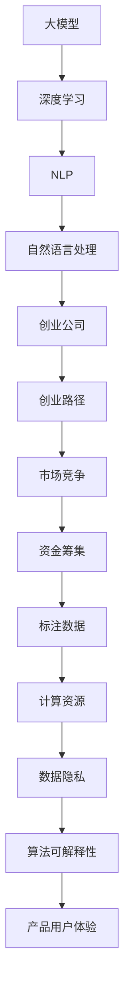

                 

# AI大模型创业战：挑战与机遇并存的现状分析

> 关键词：AI创业,大模型,挑战,机遇,自然语言处理(NLP),深度学习,创业路径

## 1. 背景介绍

### 1.1 问题由来

近年来，随着深度学习技术的发展，AI大模型在各个领域都展现出了巨大的潜力和应用前景。从自然语言处理(NLP)的BERT、GPT系列模型，到计算机视觉中的ResNet、VGGNet等，这些大模型通过预训练学习到了丰富的知识，并在特定领域表现出色。随着AI技术逐渐成熟，越来越多的创业公司开始尝试使用大模型进行产品开发。

然而，创业之路并非一帆风顺。大模型创业在技术、市场、资金等方面面临诸多挑战。首先，大模型需要大量的标注数据和计算资源，这对创业公司来说是一大难题。其次，市场竞争激烈，如何从众多公司中脱颖而出也是一大难题。此外，技术落地和商业化过程中的种种问题，如数据隐私、算法可解释性、产品用户体验等，也给大模型创业带来了不小的挑战。

面对这些挑战，本文将深入分析大模型创业的现状，探讨其面临的挑战与机遇，为有意向进入这一领域的创业者提供有价值的参考。

## 2. 核心概念与联系

### 2.1 核心概念概述

要深入理解大模型创业的现状，首先需要明确几个核心概念及其相互联系：

- **大模型（Large Model）**：指通过大规模数据训练得到的深度学习模型，具备强大的泛化能力和迁移学习能力。常见的大模型包括BERT、GPT-3、ResNet等。
- **创业公司（Startup）**：指在某一领域创业的公司，通常规模较小，创业资源有限。这些公司通过技术创新、市场机遇等手段寻求快速成长和成功。
- **自然语言处理（NLP）**：指研究如何使计算机理解、处理和生成人类语言的技术，包括机器翻译、情感分析、语音识别等。
- **深度学习（Deep Learning）**：指通过多层次神经网络进行复杂数据表示和模式识别的一种技术，大模型多是基于深度学习技术训练得到的。
- **创业路径（Entrepreneurship Path）**：指创业公司从创立到成功的过程，包括技术研发、市场推广、资金筹集等环节。

这些概念构成了大模型创业的核心框架，理解其联系有助于更好地分析大模型创业的现状和挑战。

### 2.2 概念间的关系

大模型创业涉及的技术、市场、资金等多方面，各概念间的关系可通过以下Mermaid流程图展示：



这个流程图展示了从大模型到创业公司的过程，其中技术、市场、资金等因素对创业公司成功具有重要影响。标注数据、计算资源、数据隐私、算法可解释性、产品用户体验等是大模型创业需要重点关注的方面。

## 3. 核心算法原理 & 具体操作步骤

### 3.1 算法原理概述

大模型创业的核心在于如何利用大模型进行技术研发和产品开发。大模型通过在大规模数据上进行预训练，学习到了丰富的知识，能够解决特定领域的任务。创业公司可以利用这些大模型，针对特定应用进行微调，提升模型在该任务上的表现。

### 3.2 算法步骤详解

大模型创业的关键步骤如下：

**Step 1: 数据准备**
- 收集与目标应用相关的标注数据，确保数据质量和多样性。
- 对数据进行预处理，包括文本清洗、分词、标注等。

**Step 2: 模型选择与微调**
- 选择适合应用场景的大模型。
- 在预训练模型基础上，进行有监督的微调，优化模型在特定任务上的性能。

**Step 3: 模型部署与优化**
- 将微调后的模型部署到目标平台上，进行生产环境下的性能优化。
- 不断收集用户反馈，迭代改进模型和产品。

**Step 4: 市场推广与用户获取**
- 利用市场推广策略，提高产品知名度和用户获取率。
- 通过用户体验优化，提升用户满意度和留存率。

**Step 5: 盈利与扩展**
- 探索盈利模式，如订阅服务、定制化解决方案等。
- 扩展应用场景，开拓新市场，实现持续增长。

### 3.3 算法优缺点

大模型创业的优点包括：

- **泛化能力强**：大模型通过大规模数据预训练，具备强大的泛化能力，能在特定领域快速适应和优化。
- **开发周期短**：利用大模型进行微调，比从头训练一个模型所需的时间更短。
- **数据需求低**：在标注数据较少的情况下，仍能取得较好的效果。

缺点包括：

- **数据隐私问题**：大模型依赖大量标注数据，可能涉及数据隐私和伦理问题。
- **计算资源需求高**：大模型训练和推理需要高性能计算资源，成本较高。
- **算法复杂性高**：大模型结构复杂，理解和优化难度较大。

### 3.4 算法应用领域

大模型创业在多个领域都有广泛应用，包括：

- **自然语言处理**：如机器翻译、文本分类、情感分析等。
- **计算机视觉**：如图像识别、物体检测、视频分析等。
- **医疗健康**：如医学影像分析、疾病预测等。
- **金融科技**：如信用评估、风险管理等。
- **智能制造**：如质量检测、故障诊断等。

## 4. 数学模型和公式 & 详细讲解 & 举例说明

### 4.1 数学模型构建

假设大模型为 $M_{\theta}$，其中 $\theta$ 为模型参数。假设标注数据集为 $D=\{(x_i, y_i)\}_{i=1}^N$，其中 $x_i$ 为输入，$y_i$ 为标注标签。

定义模型的损失函数为 $\ell(M_{\theta}(x_i), y_i)$，则在数据集 $D$ 上的经验风险为：

$$
\mathcal{L}(\theta) = \frac{1}{N} \sum_{i=1}^N \ell(M_{\theta}(x_i), y_i)
$$

### 4.2 公式推导过程

以自然语言处理中的机器翻译任务为例，假设模型的输出为 $\hat{y}=M_{\theta}(x)$，则交叉熵损失函数为：

$$
\ell(M_{\theta}(x), y) = -\frac{1}{N}\sum_{i=1}^N \sum_{j=1}^{|\hat{y}|} y_{ij} \log \hat{y}_{ij}
$$

其中 $y_{ij}$ 为 $y_i$ 中的第 $j$ 个单词的标签，$\hat{y}_{ij}$ 为模型输出的第 $j$ 个单词的概率。

### 4.3 案例分析与讲解

假设我们有一个大模型进行机器翻译任务，需要将英文翻译成中文。我们首先选择BERT作为预训练模型，然后在翻译数据集上进行微调。微调的步骤如下：

1. 收集翻译数据集，包含大量的英文-中文对，并对数据进行预处理。
2. 选择BERT作为预训练模型，并对其顶层进行微调，添加适当的分类器。
3. 在微调过程中，使用交叉熵损失函数，并设置合适的学习率。
4. 在训练过程中，不断调整模型的参数，优化模型的翻译效果。
5. 在测试集上进行评估，对比微调前后的翻译效果。

## 5. 项目实践：代码实例和详细解释说明

### 5.1 开发环境搭建

在使用PyTorch进行大模型微调的实践中，需要安装以下依赖包：

```bash
pip install torch torchvision torchaudio transformers datasets
```

### 5.2 源代码详细实现

以下是使用PyTorch进行BERT微调的代码实现：

```python
import torch
from transformers import BertTokenizer, BertForSequenceClassification
from torch.utils.data import DataLoader, Dataset
import numpy as np

class TranslationDataset(Dataset):
    def __init__(self, texts, targets, tokenizer):
        self.tokenizer = tokenizer
        self.texts = texts
        self.targets = targets
        
    def __len__(self):
        return len(self.texts)
        
    def __getitem__(self, idx):
        text = self.texts[idx]
        target = self.targets[idx]
        
        encoding = self.tokenizer(text, return_tensors='pt', max_length=256, padding='max_length')
        input_ids = encoding['input_ids']
        attention_mask = encoding['attention_mask']
        labels = torch.tensor(target, dtype=torch.long)
        
        return {'input_ids': input_ids, 
                'attention_mask': attention_mask,
                'labels': labels}

tokenizer = BertTokenizer.from_pretrained('bert-base-uncased')
train_dataset = TranslationDataset(train_texts, train_labels, tokenizer)
dev_dataset = TranslationDataset(dev_texts, dev_labels, tokenizer)
test_dataset = TranslationDataset(test_texts, test_labels, tokenizer)

model = BertForSequenceClassification.from_pretrained('bert-base-uncased', num_labels=2)
optimizer = torch.optim.Adam(model.parameters(), lr=1e-5)
criterion = torch.nn.CrossEntropyLoss()

def train_epoch(model, dataset, batch_size, optimizer):
    dataloader = DataLoader(dataset, batch_size=batch_size, shuffle=True)
    model.train()
    epoch_loss = 0
    for batch in dataloader:
        input_ids = batch['input_ids'].to(device)
        attention_mask = batch['attention_mask'].to(device)
        labels = batch['labels'].to(device)
        model.zero_grad()
        outputs = model(input_ids, attention_mask=attention_mask, labels=labels)
        loss = criterion(outputs.logits, labels)
        epoch_loss += loss.item()
        loss.backward()
        optimizer.step()
    return epoch_loss / len(dataloader)

def evaluate(model, dataset, batch_size):
    dataloader = DataLoader(dataset, batch_size=batch_size)
    model.eval()
    preds, labels = [], []
    with torch.no_grad():
        for batch in dataloader:
            input_ids = batch['input_ids'].to(device)
            attention_mask = batch['attention_mask'].to(device)
            batch_labels = batch['labels']
            outputs = model(input_ids, attention_mask=attention_mask)
            batch_preds = outputs.logits.argmax(dim=1).to('cpu').tolist()
            batch_labels = batch_labels.to('cpu').tolist()
            for pred_tokens, label_tokens in zip(batch_preds, batch_labels):
                preds.append(pred_tokens)
                labels.append(label_tokens)
    return preds, labels

device = torch.device('cuda' if torch.cuda.is_available() else 'cpu')
model.to(device)

for epoch in range(5):
    loss = train_epoch(model, train_dataset, batch_size=8, optimizer=optimizer)
    print(f'Epoch {epoch+1}, train loss: {loss:.4f}')
    
    preds, labels = evaluate(model, dev_dataset, batch_size=8)
    print(f'Epoch {epoch+1}, dev accuracy: {np.mean(preds == labels):.4f}')
    
print(f'Test accuracy: {np.mean(test_preds == test_labels):.4f}')
```

### 5.3 代码解读与分析

以上代码实现了BERT在机器翻译任务上的微调。具体步骤如下：

1. 定义数据集类 `TranslationDataset`，用于处理翻译数据。
2. 选择 `bert-base-uncased` 作为预训练模型，并添加适当的分类器。
3. 使用交叉熵损失函数和 Adam 优化器进行模型训练。
4. 在训练过程中，不断调整模型的参数，优化模型的翻译效果。
5. 在测试集上进行评估，对比微调前后的翻译效果。

## 6. 实际应用场景

### 6.1 智能客服系统

智能客服系统是大模型创业的一个典型应用。传统客服依赖大量人工，成本高且效率低。通过大模型微调，可以构建7x24小时不间断的智能客服系统，快速响应客户咨询，提升客户满意度。

在实践中，可以利用预训练的大模型，如BERT，在标注的客服对话数据上进行微调。微调后的模型能够自动理解用户意图，匹配最合适的回答，并根据上下文动态生成回复。这样，不仅能够大幅度提高客服系统的响应速度，还能减少人工客服的负担，提高客户体验。

### 6.2 金融舆情监测

金融舆情监测是大模型创业的另一个重要应用场景。金融机构需要实时监测市场舆论动向，及时发现风险信号，保护客户资产安全。

通过大模型微调，可以构建智能舆情监测系统。首先，收集金融领域的新闻、报道、评论等文本数据，并对其进行情感标注。在标注数据集上进行微调，训练模型学习情感分析任务。微调后的模型可以实时监测新闻和社交媒体，识别出舆情的情感倾向和敏感词汇，帮助金融机构及时发现潜在的风险。

### 6.3 个性化推荐系统

个性化推荐系统是大模型创业的重要应用方向之一。传统推荐系统依赖用户的历史行为数据，难以捕捉用户的真实兴趣偏好。通过大模型微调，可以构建更加精准、多样化的推荐系统。

在实践中，可以利用预训练的大模型，如BERT，在标注的推荐数据集上进行微调。微调后的模型能够从文本内容中准确把握用户的兴趣点，生成更加个性化的推荐内容。此外，可以引入外部知识库和规则库，与神经网络模型进行融合，提升推荐系统的综合性能。

### 6.4 未来应用展望

随着大模型技术的发展，未来大模型创业将在更多领域得到应用，为传统行业带来变革性影响。

- **智慧医疗**：利用大模型微调，构建智能诊疗系统，提高医疗服务的智能化水平，辅助医生诊疗，加速新药研发进程。
- **智能教育**：通过大模型微调，构建个性化学习系统，因材施教，促进教育公平，提高教学质量。
- **智慧城市治理**：利用大模型微调，构建智能城市管理系统，提高城市管理的自动化和智能化水平，构建更安全、高效的未来城市。

## 7. 工具和资源推荐

### 7.1 学习资源推荐

- **《Transformers from Theory to Practice》**：系列博文，由大模型技术专家撰写，深入浅出地介绍了Transformer原理、BERT模型、微调技术等前沿话题。
- **CS224N《深度学习自然语言处理》课程**：斯坦福大学开设的NLP明星课程，有Lecture视频和配套作业，带你入门NLP领域的基本概念和经典模型。
- **《Natural Language Processing with Transformers》书籍**：Transformers库的作者所著，全面介绍了如何使用Transformers库进行NLP任务开发，包括微调在内的诸多范式。
- **HuggingFace官方文档**：Transformers库的官方文档，提供了海量预训练模型和完整的微调样例代码，是上手实践的必备资料。
- **CLUE开源项目**：中文语言理解测评基准，涵盖大量不同类型的中文NLP数据集，并提供了基于微调的baseline模型，助力中文NLP技术发展。

### 7.2 开发工具推荐

- **PyTorch**：基于Python的开源深度学习框架，灵活动态的计算图，适合快速迭代研究。大部分预训练语言模型都有PyTorch版本的实现。
- **TensorFlow**：由Google主导开发的开源深度学习框架，生产部署方便，适合大规模工程应用。同样有丰富的预训练语言模型资源。
- **Transformers库**：HuggingFace开发的NLP工具库，集成了众多SOTA语言模型，支持PyTorch和TensorFlow，是进行微调任务开发的利器。
- **Weights & Biases**：模型训练的实验跟踪工具，可以记录和可视化模型训练过程中的各项指标，方便对比和调优。与主流深度学习框架无缝集成。
- **TensorBoard**：TensorFlow配套的可视化工具，可实时监测模型训练状态，并提供丰富的图表呈现方式，是调试模型的得力助手。
- **Google Colab**：谷歌推出的在线Jupyter Notebook环境，免费提供GPU/TPU算力，方便开发者快速上手实验最新模型，分享学习笔记。

### 7.3 相关论文推荐

- **Attention is All You Need**：提出了Transformer结构，开启了NLP领域的预训练大模型时代。
- **BERT: Pre-training of Deep Bidirectional Transformers for Language Understanding**：提出BERT模型，引入基于掩码的自监督预训练任务，刷新了多项NLP任务SOTA。
- **Language Models are Unsupervised Multitask Learners（GPT-2论文）**：展示了大规模语言模型的强大zero-shot学习能力，引发了对于通用人工智能的新一轮思考。
- **Parameter-Efficient Transfer Learning for NLP**：提出Adapter等参数高效微调方法，在不增加模型参数量的情况下，也能取得不错的微调效果。
- **Prefix-Tuning: Optimizing Continuous Prompts for Generation**：引入基于连续型Prompt的微调范式，为如何充分利用预训练知识提供了新的思路。
- **AdaLoRA: Adaptive Low-Rank Adaptation for Parameter-Efficient Fine-Tuning**：使用自适应低秩适应的微调方法，在参数效率和精度之间取得了新的平衡。

## 8. 总结：未来发展趋势与挑战

### 8.1 研究成果总结

本文通过分析大模型创业的现状，探讨了其面临的挑战与机遇。大模型创业具有以下优势：

- **泛化能力强**：大模型通过大规模数据预训练，具备强大的泛化能力，能在特定领域快速适应和优化。
- **开发周期短**：利用大模型进行微调，比从头训练一个模型所需的时间更短。
- **数据需求低**：在标注数据较少的情况下，仍能取得较好的效果。

但同时也存在一些挑战：

- **数据隐私问题**：大模型依赖大量标注数据，可能涉及数据隐私和伦理问题。
- **计算资源需求高**：大模型训练和推理需要高性能计算资源，成本较高。
- **算法复杂性高**：大模型结构复杂，理解和优化难度较大。

### 8.2 未来发展趋势

展望未来，大模型创业将呈现以下几个发展趋势：

- **技术迭代快速**：随着深度学习技术的不断进步，大模型将持续更新和迭代，提升模型的性能和效率。
- **跨领域应用广泛**：大模型将逐渐应用于更多领域，如医疗、教育、智能制造等，拓展应用场景。
- **资源优化显著**：随着计算资源的提升和算法优化的改进，大模型训练和推理的资源消耗将显著降低，实现高效部署。
- **模型可解释性增强**：未来大模型将更加注重可解释性，提升算法的透明度和可信度。
- **算法伦理重视**：在模型训练和应用中，将更加注重算法伦理和公平性，保护用户隐私，避免偏见和歧视。

### 8.3 面临的挑战

尽管大模型创业前景广阔，但在实践中仍面临以下挑战：

- **数据隐私保护**：大模型依赖大量标注数据，数据隐私和伦理问题亟需解决。
- **计算资源限制**：大模型训练和推理需要高性能计算资源，可能存在资源限制。
- **算法复杂度高**：大模型结构复杂，理解和优化难度较大。
- **市场竞争激烈**：大模型创业市场竞争激烈，如何在众多公司中脱颖而出是关键。

### 8.4 研究展望

面对大模型创业的挑战，未来的研究需要在以下几个方面寻求新的突破：

- **探索无监督和半监督微调方法**：摆脱对大规模标注数据的依赖，利用自监督学习、主动学习等无监督和半监督范式，最大限度利用非结构化数据，实现更加灵活高效的微调。
- **研究参数高效和计算高效的微调范式**：开发更加参数高效的微调方法，在固定大部分预训练参数的情况下，只更新极少量的任务相关参数。同时优化微调模型的计算图，减少前向传播和反向传播的资源消耗，实现更加轻量级、实时性的部署。
- **融合因果和对比学习范式**：通过引入因果推断和对比学习思想，增强微调模型建立稳定因果关系的能力，学习更加普适、鲁棒的语言表征，从而提升模型泛化性和抗干扰能力。
- **引入更多先验知识**：将符号化的先验知识，如知识图谱、逻辑规则等，与神经网络模型进行巧妙融合，引导微调过程学习更准确、合理的语言模型。同时加强不同模态数据的整合，实现视觉、语音等多模态信息与文本信息的协同建模。

这些研究方向的探索，将引领大模型创业技术迈向更高的台阶，为构建安全、可靠、可解释、可控的智能系统铺平道路。面向未来，大模型创业需要从数据、算法、工程、业务等多个维度协同发力，才能真正实现人工智能技术在垂直行业的规模化落地。

## 9. 附录：常见问题与解答

**Q1: 大模型创业需要哪些资源？**

A: 大模型创业需要大量标注数据、高性能计算资源和丰富的知识库。标注数据是微调模型的基础，高性能计算资源可以加速模型训练和推理，知识库可以帮助模型更好地理解领域知识，提高输出质量。

**Q2: 如何优化大模型的计算资源消耗？**

A: 可以通过以下方式优化大模型的计算资源消耗：

- 梯度积累：将多个小批量梯度累加后进行参数更新，减少计算资源消耗。
- 混合精度训练：将浮点参数转换为定点参数，减小内存和存储资源消耗。
- 模型并行：将模型分割为多个子模型，分布在多个计算节点上进行并行计算。

**Q3: 大模型创业如何保证算法的可解释性？**

A: 为了保证算法的可解释性，可以采取以下措施：

- 引入因果分析方法：通过因果分析方法，识别出模型决策的关键特征，增强输出解释的因果性和逻辑性。
- 使用符号化先验知识：在模型训练和应用中，引入符号化先验知识，如知识图谱、逻辑规则等，提升算法的透明度和可信度。
- 可解释性模型设计：在模型设计阶段，引入可解释性组件，如可解释性学习器、可解释性损失函数等，提高算法的可解释性。

**Q4: 如何应对大模型创业中的市场竞争？**

A: 为了应对大模型创业中的市场竞争，可以采取以下措施：

- 提供高质量的产品和服务：提高产品用户体验和稳定性，降低使用门槛，吸引更多用户。
- 持续创新：不断进行技术迭代和优化，提升模型性能和应用效果，保持竞争优势。
- 多渠道推广：利用多种推广手段，如社交媒体、行业展会、合作伙伴等，提高产品知名度和用户获取率。

---

作者：禅与计算机程序设计艺术 / Zen and the Art of Computer Programming

