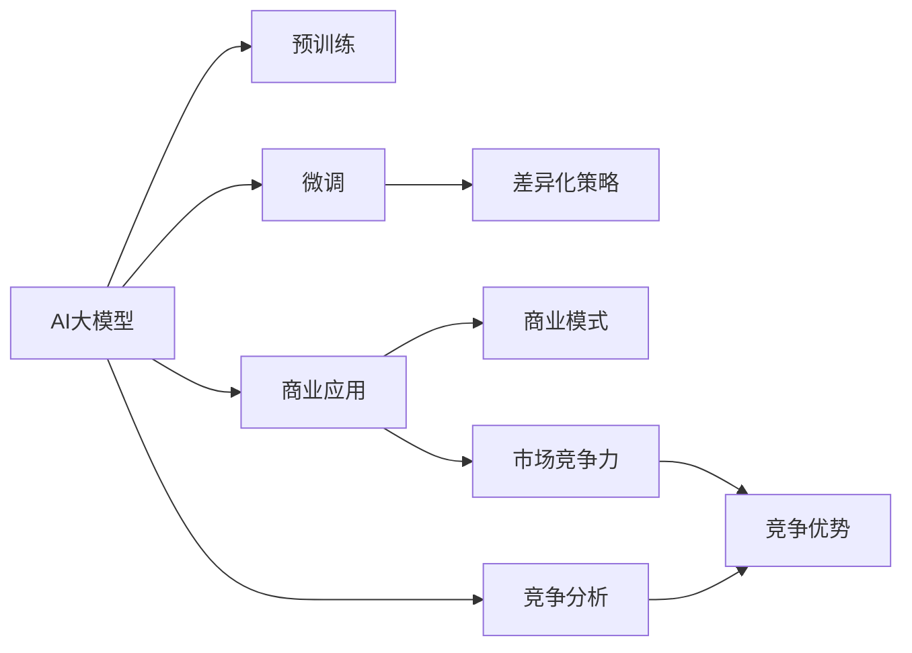
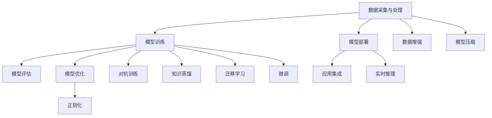
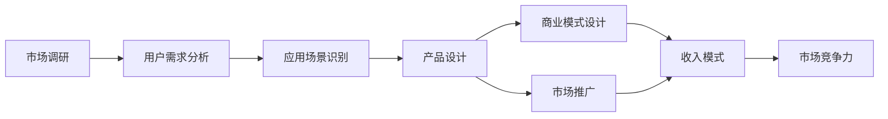
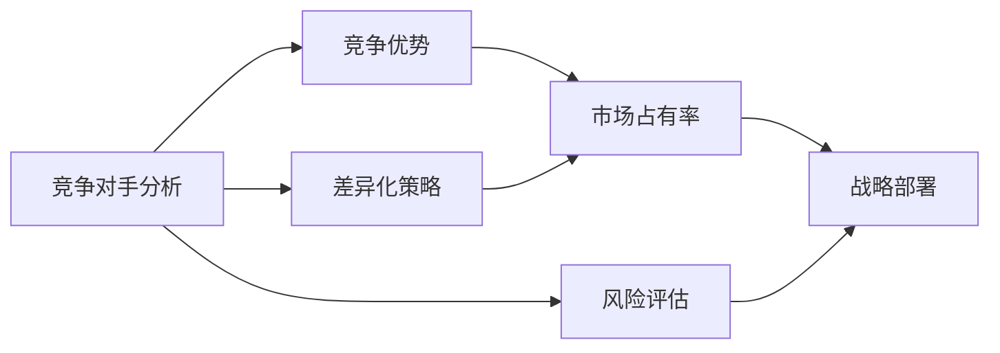

                 

# AI大模型创业：如何应对未来竞争对手？

> 关键词：AI大模型,创业,竞争力,竞争对手,商业策略

## 1. 背景介绍

### 1.1 问题由来
在AI大模型的热潮中，越来越多的企业开始涉足这一领域，希望通过大模型获取竞争优势，但市场竞争也变得日益激烈。大模型技术的快速迭代和不断进步，让传统软件公司和初创企业都在加速布局，试图在未来的商业竞争中占据有利位置。如何构建和运营大模型创业公司，应对来自各个层面的竞争对手，成为所有大模型创业者亟需面对的问题。

### 1.2 问题核心关键点
在大模型创业的竞争中，核心关键点在于如何构建强大的技术能力，实现商业落地，并有效对抗竞争对手。具体包括：

1. **技术能力建设**：构建高效的模型训练平台、丰富的模型资源、先进的算法框架等。
2. **商业落地策略**：明确业务方向、寻找优质应用场景、制定合理的商业化路径。
3. **对抗竞争优势**：了解竞争对手的布局，制定差异化策略，提升市场竞争力。

### 1.3 问题研究意义
本文将从技术、业务、竞争三个维度，详细剖析大模型创业的策略和方法，为创业者提供全面指导。

## 2. 核心概念与联系

### 2.1 核心概念概述

在大模型创业的竞争中，需要深入理解以下核心概念：

- **AI大模型**：指通过自监督或监督学习等方法，在大规模数据上预训练出的通用或特定任务模型。大模型包括语言模型、图像模型、生成模型等多种形式。
- **创业**：指利用创新的技术和商业模式，开展创业活动，实现商业价值的过程。
- **竞争力**：指在市场中，企业相对于竞争对手所具备的优劣程度。竞争力通常由技术实力、市场占有率、客户满意度、品牌影响力等指标综合衡量。
- **竞争对手**：指在相同或相似市场中，与创业企业直接或间接竞争的其他企业。

这些核心概念之间的关系可以用以下Mermaid流程图表示：



这个流程图展示了AI大模型从预训练到商业应用的全过程，以及如何通过差异化策略和商业模式提升市场竞争力，同时进行竞争对手分析以获得竞争优势。

### 2.2 概念间的关系

这些核心概念之间存在着紧密的联系，共同构成了大模型创业的完整生态系统。

#### 2.2.1 大模型技术的生态系统



这个流程图展示了大模型技术从数据采集到模型部署的全过程，以及模型训练、评估、优化等各个环节的技术细节。

#### 2.2.2 商业落地的生态系统



这个流程图展示了从市场调研到商业模式设计再到市场推广的全过程，以及如何通过用户需求分析、应用场景识别、产品设计等环节提升市场竞争力。

#### 2.2.3 竞争策略的生态系统



这个流程图展示了如何通过竞争对手分析制定差异化策略，并最终提升市场占有率和竞争力。

## 3. 核心算法原理 & 具体操作步骤

### 3.1 算法原理概述

大模型创业的核心在于构建和运营高效的AI大模型，并在市场中通过差异化策略提升竞争力。以下是基于监督学习的大模型微调方法的基本原理：

1. **预训练**：在大规模无标签数据上预训练通用大模型，学习到丰富的语言或图像知识。
2. **微调**：在特定任务上，使用小规模标注数据进行有监督的微调，优化模型在该任务上的性能。
3. **商业应用**：将微调后的模型部署到应用场景中，解决具体问题。

### 3.2 算法步骤详解

大模型创业的具体操作步骤包括以下几个关键步骤：

**Step 1: 数据采集与处理**
- 收集相关领域的数据，包括文本、图像、语音等。
- 对数据进行清洗、标注、划分训练集、验证集、测试集等。

**Step 2: 模型构建与训练**
- 选择合适的模型架构，如BERT、GPT、ViT等。
- 在预训练数据上进行预训练，构建通用的表示模型。
- 在特定任务上，使用微调数据进行微调，优化模型。

**Step 3: 模型评估与优化**
- 在验证集上评估模型性能，调整超参数。
- 引入正则化、对抗训练、知识蒸馏等技术，提升模型性能。
- 使用模型压缩、剪枝等技术，减少模型大小，提升推理速度。

**Step 4: 商业落地与应用**
- 将微调后的模型部署到应用场景中，如智能客服、金融分析、医疗诊断等。
- 与业务系统集成，实现自动化、智能化功能。
- 持续收集用户反馈，进行模型迭代和优化。

### 3.3 算法优缺点

基于监督学习的大模型微调方法具有以下优点：

- **快速迭代**：通过微调可以在较短时间内提升模型性能。
- **通用性**：通用预训练模型可以适配多种下游任务，减少重复开发。
- **性能提升**：在少量标注数据下，仍能获得较好的性能提升。

同时，该方法也存在以下局限：

- **依赖标注数据**：微调需要高质量标注数据，获取成本较高。
- **泛化能力有限**：当预训练数据与任务数据分布差异较大时，泛化性能可能受限。
- **过拟合风险**：在数据量小的情况下，存在过拟合风险。

### 3.4 算法应用领域

大模型微调方法在多个领域中得到了广泛应用，例如：

- **自然语言处理**：文本分类、情感分析、命名实体识别等。
- **计算机视觉**：图像识别、物体检测、图像生成等。
- **语音处理**：语音识别、语音合成、语音情感识别等。

## 4. 数学模型和公式 & 详细讲解

### 4.1 数学模型构建

大模型的微调过程通常使用基于监督学习的框架。以BERT为例，微调框架可以表示为：

$$
M_{\theta}(x) = softmax(\frac{exp(Q(x;\theta))}{\sum_{i}exp(Q(x_i;\theta))})
$$

其中，$M_{\theta}(x)$ 表示预训练模型的输出概率分布，$Q(x;\theta)$ 为模型的查询函数，$\theta$ 为模型参数。

### 4.2 公式推导过程

BERT的微调过程包含两个关键步骤：

1. 在特定任务上，构建新的输出层和损失函数。
2. 在微调数据上，进行梯度更新，优化模型参数。

以情感分析任务为例，假设模型输出为 $\hat{y}=M_{\theta}(x)$，真实标签为 $y \in \{1,0\}$。则微调框架可以表示为：

$$
\ell(M_{\theta}(x),y) = -y\log \hat{y} + (1-y)\log (1-\hat{y})
$$

在得到损失函数后，通过梯度下降等优化算法更新模型参数，最小化损失函数：

$$
\theta \leftarrow \theta - \eta \nabla_{\theta}\mathcal{L}(\theta)
$$

其中 $\eta$ 为学习率，$\nabla_{\theta}\mathcal{L}(\theta)$ 为损失函数对参数 $\theta$ 的梯度。

### 4.3 案例分析与讲解

假设我们有一个分类任务，模型输出为 $\hat{y}=M_{\theta}(x)$，真实标签为 $y \in \{1,0\}$。则微调框架可以表示为：

$$
\ell(M_{\theta}(x),y) = -y\log \hat{y} + (1-y)\log (1-\hat{y})
$$

通过梯度下降等优化算法更新模型参数，最小化损失函数：

$$
\theta \leftarrow \theta - \eta \nabla_{\theta}\mathcal{L}(\theta)
$$

其中 $\eta$ 为学习率，$\nabla_{\theta}\mathcal{L}(\theta)$ 为损失函数对参数 $\theta$ 的梯度。

## 5. 项目实践：代码实例和详细解释说明

### 5.1 开发环境搭建

在进行大模型创业的微调实践前，需要准备好开发环境。以下是使用Python进行PyTorch开发的环境配置流程：

1. 安装Anaconda：从官网下载并安装Anaconda，用于创建独立的Python环境。

2. 创建并激活虚拟环境：
```bash
conda create -n pytorch-env python=3.8 
conda activate pytorch-env
```

3. 安装PyTorch：根据CUDA版本，从官网获取对应的安装命令。例如：
```bash
conda install pytorch torchvision torchaudio cudatoolkit=11.1 -c pytorch -c conda-forge
```

4. 安装Transformers库：
```bash
pip install transformers
```

5. 安装各类工具包：
```bash
pip install numpy pandas scikit-learn matplotlib tqdm jupyter notebook ipython
```

完成上述步骤后，即可在`pytorch-env`环境中开始微调实践。

### 5.2 源代码详细实现

这里我们以BERT模型为例，给出使用Transformers库对BERT模型进行情感分析任务微调的PyTorch代码实现。

首先，定义数据处理函数：

```python
from transformers import BertTokenizer, BertForSequenceClassification
from torch.utils.data import TensorDataset, DataLoader
from transformers import AdamW

tokenizer = BertTokenizer.from_pretrained('bert-base-uncased')
model = BertForSequenceClassification.from_pretrained('bert-base-uncased', num_labels=2)

device = 'cuda' if torch.cuda.is_available() else 'cpu'
model.to(device)

def get_data_from_file(filename):
    with open(filename, 'r') as f:
        data = [line.strip().split('\t') for line in f.readlines()]
    return data

def preprocess_data(data):
    tokenized_texts = [tokenizer.tokenize(text) for text in data]
    attention_masks = [[1 if tokenized_text else 0 for tokenized_text in tokenized_text] for text in tokenized_texts]
    input_ids = tokenizer.convert_tokens_to_ids(tokenized_texts)
    labels = [1 if label == 'positive' else 0 for label in data]
    return TensorDataset(input_ids, attention_masks, torch.tensor(labels))

def evaluate(model, data_loader):
    model.eval()
    total_loss = 0
    total_correct = 0
    for batch in data_loader:
        input_ids, attention_mask, labels = batch.to(device)
        with torch.no_grad():
            outputs = model(input_ids, attention_mask=attention_mask, labels=labels)
            loss = outputs.loss
            logits = outputs.logits
            logits = logits.view(-1, 2)[:, 1]
            predictions = torch.round(torch.sigmoid(logits))
            total_loss += loss.item()
            total_correct += (predictions == labels).sum().item()
    acc = total_correct / len(data_loader.dataset)
    print(f'Accuracy: {acc:.3f}')
    return acc

train_data = get_data_from_file('train.txt')
dev_data = get_data_from_file('dev.txt')
test_data = get_data_from_file('test.txt')

train_dataset = preprocess_data(train_data)
dev_dataset = preprocess_data(dev_data)
test_dataset = preprocess_data(test_data)

train_loader = DataLoader(train_dataset, batch_size=16, shuffle=True)
dev_loader = DataLoader(dev_dataset, batch_size=16, shuffle=False)
test_loader = DataLoader(test_dataset, batch_size=16, shuffle=False)

optimizer = AdamW(model.parameters(), lr=2e-5)

for epoch in range(5):
    total_loss = 0
    for batch in train_loader:
        input_ids, attention_mask, labels = batch.to(device)
        optimizer.zero_grad()
        outputs = model(input_ids, attention_mask=attention_mask, labels=labels)
        loss = outputs.loss
        loss.backward()
        optimizer.step()
        total_loss += loss.item()

    print(f'Epoch {epoch+1}, training loss: {total_loss/len(train_loader):.3f}')
    print(f'Epoch {epoch+1}, development accuracy: {evaluate(model, dev_loader):.3f}')
```

以上代码实现了BERT模型对情感分析任务的微调，包括数据预处理、模型定义、优化器设置、模型训练和评估等。

### 5.3 代码解读与分析

让我们再详细解读一下关键代码的实现细节：

**preprocess_data函数**：
- 对数据进行分词、编码、padding等预处理，返回模型所需的输入。

**evaluate函数**：
- 在验证集上进行评估，计算准确率。

**训练流程**：
- 在训练集上进行多轮迭代训练，每次迭代更新模型参数。
- 在验证集上评估模型性能，调整模型参数。
- 在测试集上评估模型性能，输出最终结果。

## 6. 实际应用场景

### 6.1 智能客服系统

智能客服系统是大模型创业的重要应用场景之一。智能客服可以通过微调大模型，实时处理客户咨询，快速响应问题，提升客户满意度。

### 6.2 金融舆情监测

金融舆情监测需要实时获取市场舆情信息，进行情感分析、风险预警等。大模型创业可以微调情感分析模型，实时监测市场舆情，及时预警潜在风险。

### 6.3 个性化推荐系统

个性化推荐系统可以微调大模型，通过文本、行为等数据进行用户画像，生成个性化的推荐结果。

### 6.4 未来应用展望

未来，大模型创业将面临更多机遇和挑战。

## 7. 工具和资源推荐

### 7.1 学习资源推荐

为了帮助开发者系统掌握大模型微调的理论基础和实践技巧，这里推荐一些优质的学习资源：

1. 《Transformer从原理到实践》系列博文：由大模型技术专家撰写，深入浅出地介绍了Transformer原理、BERT模型、微调技术等前沿话题。

2. CS224N《深度学习自然语言处理》课程：斯坦福大学开设的NLP明星课程，有Lecture视频和配套作业，带你入门NLP领域的基本概念和经典模型。

3. 《Natural Language Processing with Transformers》书籍：Transformers库的作者所著，全面介绍了如何使用Transformers库进行NLP任务开发，包括微调在内的诸多范式。

4. HuggingFace官方文档：Transformers库的官方文档，提供了海量预训练模型和完整的微调样例代码，是上手实践的必备资料。

5. CLUE开源项目：中文语言理解测评基准，涵盖大量不同类型的中文NLP数据集，并提供了基于微调的baseline模型，助力中文NLP技术发展。

通过对这些资源的学习实践，相信你一定能够快速掌握大模型微调的精髓，并用于解决实际的NLP问题。

### 7.2 开发工具推荐

高效的开发离不开优秀的工具支持。以下是几款用于大模型微调开发的常用工具：

1. PyTorch：基于Python的开源深度学习框架，灵活动态的计算图，适合快速迭代研究。大部分预训练语言模型都有PyTorch版本的实现。

2. TensorFlow：由Google主导开发的开源深度学习框架，生产部署方便，适合大规模工程应用。同样有丰富的预训练语言模型资源。

3. Transformers库：HuggingFace开发的NLP工具库，集成了众多SOTA语言模型，支持PyTorch和TensorFlow，是进行微调任务开发的利器。

4. Weights & Biases：模型训练的实验跟踪工具，可以记录和可视化模型训练过程中的各项指标，方便对比和调优。与主流深度学习框架无缝集成。

5. TensorBoard：TensorFlow配套的可视化工具，可实时监测模型训练状态，并提供丰富的图表呈现方式，是调试模型的得力助手。

6. Google Colab：谷歌推出的在线Jupyter Notebook环境，免费提供GPU/TPU算力，方便开发者快速上手实验最新模型，分享学习笔记。

合理利用这些工具，可以显著提升大模型微调任务的开发效率，加快创新迭代的步伐。

### 7.3 相关论文推荐

大语言模型和微调技术的发展源于学界的持续研究。以下是几篇奠基性的相关论文，推荐阅读：

1. Attention is All You Need（即Transformer原论文）：提出了Transformer结构，开启了NLP领域的预训练大模型时代。

2. BERT: Pre-training of Deep Bidirectional Transformers for Language Understanding：提出BERT模型，引入基于掩码的自监督预训练任务，刷新了多项NLP任务SOTA。

3. Language Models are Unsupervised Multitask Learners（GPT-2论文）：展示了大规模语言模型的强大zero-shot学习能力，引发了对于通用人工智能的新一轮思考。

4. Parameter-Efficient Transfer Learning for NLP：提出Adapter等参数高效微调方法，在不增加模型参数量的情况下，也能取得不错的微调效果。

5. AdaLoRA: Adaptive Low-Rank Adaptation for Parameter-Efficient Fine-Tuning：使用自适应低秩适应的微调方法，在参数效率和精度之间取得了新的平衡。

这些论文代表了大语言模型微调技术的发展脉络。通过学习这些前沿成果，可以帮助研究者把握学科前进方向，激发更多的创新灵感。

除上述资源外，还有一些值得关注的前沿资源，帮助开发者紧跟大语言模型微调技术的最新进展，例如：

1. arXiv论文预印本：人工智能领域最新研究成果的发布平台，包括大量尚未发表的前沿工作，学习前沿技术的必读资源。

2. 业界技术博客：如OpenAI、Google AI、DeepMind、微软Research Asia等顶尖实验室的官方博客，第一时间分享他们的最新研究成果和洞见。

3. 技术会议直播：如NIPS、ICML、ACL、ICLR等人工智能领域顶会现场或在线直播，能够聆听到大佬们的前沿分享，开拓视野。

4. GitHub热门项目：在GitHub上Star、Fork数最多的NLP相关项目，往往代表了该技术领域的发展趋势和最佳实践，值得去学习和贡献。

5. 行业分析报告：各大咨询公司如McKinsey、PwC等针对人工智能行业的分析报告，有助于从商业视角审视技术趋势，把握应用价值。

总之，对于大语言模型微调技术的学习和实践，需要开发者保持开放的心态和持续学习的意愿。多关注前沿资讯，多动手实践，多思考总结，必将收获满满的成长收益。

## 8. 总结：未来发展趋势与挑战

### 8.1 总结

本文对大模型创业中如何应对未来竞争对手进行了全面系统的介绍。首先，详细分析了当前大模型创业的竞争形势和核心关键点，明确了如何在技术、业务、竞争三个维度上构建竞争力。其次，从原理到实践，详细讲解了大模型微调过程的数学模型和具体操作步骤，给出了微调任务开发的完整代码实例。同时，本文还广泛探讨了大模型微调方法在智能客服、金融舆情、个性化推荐等多个行业领域的应用前景，展示了微调范式的巨大潜力。此外，本文精选了微调技术的各类学习资源，力求为读者提供全方位的技术指引。

通过本文的系统梳理，可以看到，大模型创业不仅需要强大的技术能力，还需要有前瞻性的商业洞察和竞争策略。只有在技术实力、商业落地、市场竞争力三个方面同步提升，才能在激烈的市场竞争中占据有利位置。

### 8.2 未来发展趋势

展望未来，大模型创业将呈现以下几个发展趋势：

1. **技术能力提升**：大模型创业将继续在模型架构、算法框架、计算效率等方面不断优化，提升技术实力。

2. **商业落地加快**：随着技术的成熟，大模型创业将更加注重商业落地，探索更多的应用场景，实现更高的商业价值。

3. **市场竞争力增强**：通过差异化策略、市场分析、产品优化等手段，提升市场占有率和竞争力。

4. **竞争策略多元化**：采取包括技术合作、战略联盟、生态构建等多元化策略，拓展市场份额。

5. **全球化布局**：随着市场需求的全球化，大模型创业将加速国际化布局，提升全球竞争力。

### 8.3 面临的挑战

尽管大模型创业拥有广阔的前景，但在迈向更加智能化、普适化应用的过程中，仍面临诸多挑战：

1. **市场竞争激烈**：大模型创业面临来自大企业、初创公司等多方竞争，如何保持创新优势，吸引优质客户，是重要挑战。

2. **技术人才短缺**：大模型创业需要大量高水平的技术人才，但目前市场上专业人才较为稀缺，如何吸引和留住人才，是关键问题。

3. **商业模式复杂**：大模型创业的商业模式复杂多样，如何制定合理的收入模式，实现可持续发展，需要深入研究。

4. **伦理和合规问题**：大模型创业在数据使用、隐私保护、算法透明等方面面临伦理和合规问题，需要建立完善的治理体系。

5. **技术突破难度**：大模型创业需要在多个技术方向上进行突破，如何提高技术创新能力，实现持续创新，是长期任务。

### 8.4 研究展望

面对大模型创业面临的挑战，未来的研究需要在以下几个方面寻求新的突破：

1. **提升技术能力**：开发更加高效、通用的大模型架构，提升计算效率和性能。

2. **优化商业模式**：探索多种商业模式，实现收入多样化，增强企业可持续发展能力。

3. **强化市场竞争力**：通过差异化策略、市场分析、产品优化等手段，提升市场占有率和竞争力。

4. **完善伦理治理**：建立完善的伦理治理体系，确保数据使用、隐私保护、算法透明等方面的合规性。

5. **实现技术突破**：在模型架构、算法框架、计算效率等方面进行深入研究，实现技术创新和突破。

只有从技术、商业、伦理等多个维度进行全面创新和优化，才能真正构建具有竞争力的AI大模型创业公司，推动AI技术的广泛应用和发展。

## 9. 附录：常见问题与解答

**Q1：大模型创业的商业模式有哪些？**

A: 大模型创业的商业模式通常包括：

1. **订阅模式**：客户按月或按年订阅服务，支付固定费用。
2. **按需使用模式**：客户按使用量付费，如API调用次数、数据量等。
3. **混合模式**：结合订阅和按需使用，提供灵活的付费选择。
4. **免费增值模式**：提供基础服务免费，通过高级功能、定制化服务等收费。

**Q2：大模型创业需要哪些核心技术？**

A: 大模型创业需要以下核心技术：

1. **模型训练平台**：构建高效的模型训练平台，支持大规模模型训练。
2. **数据采集与处理**：高效的数据采集、清洗、标注等技术。
3. **模型优化与压缩**：模型压缩、剪枝、量化等技术，提升模型性能和推理速度。
4. **应用集成与部署**：与业务系统深度集成，实现高效部署。
5. **用户接口设计**：设计友好的用户接口，提升用户体验。

**Q3：大模型创业如何获取高质量标注数据？**

A: 大模型创业可以通过以下方式获取高质量标注数据：

1. **数据采集**：从公开数据集中获取标注数据，如CoNLL、GLUE、CLUE等。
2. **众包标注**：通过众包平台进行标注，如Amazon Mechanical Turk。
3. **自标注**：利用预训练模型进行自标注，提升标注效率。
4. **人工标注**：通过专业团队进行人工标注，确保标注质量。

**Q4：大模型创业如何提升模型性能？**

A: 大模型创业可以通过以下方式提升模型性能：

1. **数据增强**：通过回译、改写等方式扩充训练集。
2. **正则化**：引入L2正则、Dropout等技术，避免过拟合。
3. **对抗训练**：引入对抗样本，提高模型鲁棒性。
4. **知识蒸馏**：通过知识蒸馏技术，提升模型性能。
5. **多模型集成**：训练多个模型，取平均输出，提升模型性能。

**Q5：大模型创业如何构建差异化策略？**

A: 大模型创业可以通过以下方式构建差异化策略：

1. **技术优势**：通过技术创新，提升模型性能和效率。
2. **应用场景**：探索新的应用场景，满足特定需求。
3. **用户需求**：

