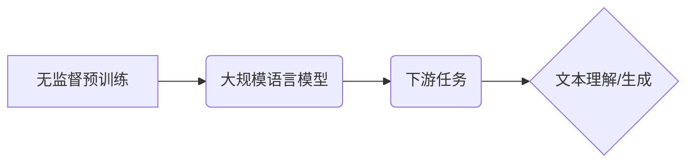

## 大规模语言模型从理论到实践 无监督预训练

> 关键词：大规模语言模型、无监督预训练、Transformer、BERT、GPT、语言理解、自然语言生成、深度学习

## 1. 背景介绍

近年来，深度学习在人工智能领域取得了突破性进展，特别是自然语言处理 (NLP) 领域。大规模语言模型 (LLM) 作为深度学习的代表，凭借其强大的文本理解和生成能力，在机器翻译、文本摘要、问答系统、对话系统等领域展现出巨大的潜力。

传统的 NLP 模型通常依赖于人工特征工程和少量标注数据，训练过程复杂且效率低下。而无监督预训练 (Unsupervised Pre-training) 则改变了这一现状。通过在海量未标记文本数据上进行预训练，LLM 可以学习到语言的丰富语义和语法结构，为下游任务提供强大的基础知识。

## 2. 核心概念与联系

**2.1 核心概念**

* **大规模语言模型 (LLM):** 指参数量达到数十亿甚至千亿级别的深度学习模型，能够处理和理解大量的文本数据。
* **无监督预训练 (Unsupervised Pre-training):** 指在未标记数据上进行模型训练，通过学习语言的统计规律和语义关系，预先训练模型的表示能力。
* **Transformer:** 一种新型的深度学习架构，能够有效捕捉长距离依赖关系，成为 LLMs 的主流选择。

**2.2 架构关系**



**2.3 工作原理**

无监督预训练的流程通常包括以下步骤：

1. **数据收集:** 收集海量未标记文本数据，例如书籍、文章、网站内容等。
2. **数据预处理:** 对文本数据进行清洗、分词、词嵌入等预处理操作。
3. **模型选择:** 选择合适的 Transformer 架构，例如 BERT、GPT 等。
4. **预训练:** 在预处理后的文本数据上进行模型训练，学习语言的统计规律和语义关系。
5. **下游任务适配:** 将预训练好的模型微调到特定下游任务，例如文本分类、情感分析、机器翻译等。

## 3. 核心算法原理 & 具体操作步骤

**3.1 算法原理概述**

Transformer 架构的核心是 **注意力机制 (Attention Mechanism)**，它能够有效捕捉文本序列中不同词之间的依赖关系，即使这些词之间相隔很远。

Transformer 模型由以下主要部分组成：

* **编码器 (Encoder):** 用于将输入文本序列编码成语义表示。
* **解码器 (Decoder):** 用于根据编码后的语义表示生成输出文本序列。
* **注意力层 (Attention Layer):** 用于捕捉文本序列中不同词之间的依赖关系。
* **前馈神经网络 (Feed-Forward Network):** 用于对编码后的语义表示进行进一步处理。

**3.2 算法步骤详解**

1. **输入嵌入:** 将输入文本序列中的每个词转换为词向量，作为模型的输入。
2. **编码器层:** 将输入词向量通过多层编码器层进行处理，每个编码器层包含注意力层和前馈神经网络。
3. **解码器层:** 将编码器输出的语义表示作为输入，通过多层解码器层进行处理，每个解码器层也包含注意力层和前馈神经网络。
4. **输出生成:** 解码器输出层将语义表示转换为输出文本序列，并使用softmax函数进行概率分布计算，选择最可能的词作为输出。

**3.3 算法优缺点**

**优点:**

* 能够有效捕捉长距离依赖关系。
* 训练效率高，能够处理海量文本数据。
* 在多种下游任务中表现出色。

**缺点:**

* 参数量大，需要大量的计算资源进行训练。
* 训练过程复杂，需要专业的技术人员进行操作。

**3.4 算法应用领域**

* 文本分类
* 情感分析
* 机器翻译
* 问答系统
* 对话系统
* 文本摘要
* 代码生成

## 4. 数学模型和公式 & 详细讲解 & 举例说明

**4.1 数学模型构建**

Transformer 模型的数学模型主要基于以下几个核心概念：

* **词嵌入 (Word Embedding):** 将每个词映射到一个低维向量空间，表示词的语义信息。
* **注意力机制 (Attention Mechanism):** 计算每个词与其他词之间的相关性，并根据相关性权重进行加权求和，捕捉长距离依赖关系。
* **多头注意力 (Multi-Head Attention):** 使用多个注意力头并行计算，能够捕捉不同类型的语义信息。
* **位置编码 (Positional Encoding):** 为每个词添加位置信息，因为 Transformer 模型没有循环结构，无法直接捕捉词序信息。

**4.2 公式推导过程**

注意力机制的核心公式如下：

$$
Attention(Q, K, V) = softmax(\frac{QK^T}{\sqrt{d_k}})V
$$

其中：

* $Q$：查询矩阵
* $K$：键矩阵
* $V$：值矩阵
* $d_k$：键向量的维度
* $softmax$：softmax 函数

**4.3 案例分析与讲解**

假设我们有一个句子 "The cat sat on the mat"，将其转换为词向量表示，并进行注意力计算。

注意力机制会计算每个词与其他词之间的相关性，例如 "cat" 与 "sat" 之间存在强相关性，因为它们描述了同一个动作。

通过加权求和，注意力机制会将相关词的语义信息聚合起来，形成一个更丰富的语义表示，帮助模型理解句子的整体含义。

## 5. 项目实践：代码实例和详细解释说明

**5.1 开发环境搭建**

* Python 3.6+
* PyTorch 或 TensorFlow
* CUDA 和 cuDNN (可选，用于 GPU 加速)

**5.2 源代码详细实现**

```python
import torch
import torch.nn as nn

class Transformer(nn.Module):
    def __init__(self, vocab_size, embedding_dim, num_heads, num_layers):
        super(Transformer, self).__init__()
        self.embedding = nn.Embedding(vocab_size, embedding_dim)
        self.encoder = nn.TransformerEncoder(nn.TransformerEncoderLayer(embedding_dim, num_heads), num_layers)
        self.decoder = nn.TransformerDecoder(nn.TransformerDecoderLayer(embedding_dim, num_heads), num_layers)
        self.fc = nn.Linear(embedding_dim, vocab_size)

    def forward(self, src, tgt, src_mask, tgt_mask):
        src = self.embedding(src)
        tgt = self.embedding(tgt)
        encoder_output = self.encoder(src, src_mask)
        decoder_output = self.decoder(tgt, encoder_output, tgt_mask)
        output = self.fc(decoder_output)
        return output
```

**5.3 代码解读与分析**

* `__init__` 方法初始化模型参数，包括词嵌入层、编码器、解码器和输出层。
* `forward` 方法定义模型的正向传播过程，输入包括源序列、目标序列、源序列掩码和目标序列掩码。
* 编码器和解码器分别处理源序列和目标序列，并使用注意力机制捕捉序列之间的依赖关系。
* 输出层将解码器的输出映射到目标词汇表，生成预测的输出序列。

**5.4 运行结果展示**

通过训练和测试，可以评估模型在不同下游任务上的性能，例如准确率、BLEU 分数等。

## 6. 实际应用场景

**6.1 文本分类**

LLMs 可以用于情感分析、主题分类、垃圾邮件过滤等文本分类任务。

**6.2 情感分析**

LLMs 可以分析文本中的情感倾向，判断文本是正面、负面还是中性。

**6.3 机器翻译**

LLMs 可以用于将文本从一种语言翻译成另一种语言。

**6.4 问答系统**

LLMs 可以理解用户的问题，并从知识库中找到相应的答案。

**6.5 对话系统**

LLMs 可以用于构建聊天机器人，进行自然语言对话。

**6.6 未来应用展望**

LLMs 在未来将有更广泛的应用场景，例如：

* 自动写作
* 代码生成
* 药物研发
* 科学研究

## 7. 工具和资源推荐

**7.1 学习资源推荐**

* **论文:** "Attention Is All You Need"
* **书籍:** "Deep Learning"
* **在线课程:** Coursera, edX

**7.2 开发工具推荐**

* **PyTorch:** https://pytorch.org/
* **TensorFlow:** https://www.tensorflow.org/

**7.3 相关论文推荐**

* BERT: https://arxiv.org/abs/1810.04805
* GPT: https://openai.com/blog/language-unsupervised/
* T5: https://arxiv.org/abs/1910.10683

## 8. 总结：未来发展趋势与挑战

**8.1 研究成果总结**

无监督预训练技术取得了显著进展，LLMs 在各种 NLP 任务中取得了优异的性能。

**8.2 未来发展趋势**

* 模型规模进一步扩大
* 训练数据质量提升
* 算法架构创新
* 跨模态预训练

**8.3 面临的挑战**

* 计算资源需求高
* 训练数据获取困难
* 模型解释性差
* 伦理和安全问题

**8.4 研究展望**

未来研究将重点关注解决上述挑战，开发更强大、更安全、更可解释的 LLMs，推动人工智能技术的发展。

## 9. 附录：常见问题与解答

* **Q: LLMs 的训练需要多长时间？**

A: 训练大型 LLMs 需要数周甚至数月的训练时间，取决于模型规模、数据量和计算资源。

* **Q: 如何评估 LLMs 的性能？**

A: 常见的评估指标包括准确率、BLEU 分数、ROUGE 分数等，具体指标选择取决于下游任务。

* **Q: LLMs 是否存在偏见问题？**

A: LLMs 的训练数据可能存在偏见，导致模型输出也存在偏见。如何解决模型偏见是一个重要的研究方向。


作者：禅与计算机程序设计艺术 / Zen and the Art of Computer Programming 
