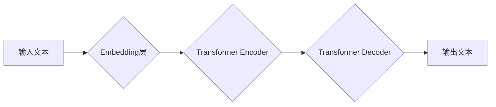

## 大语言模型(Large Language Models) - 原理与代码实例讲解

> 关键词：大语言模型、Transformer、BERT、GPT、LLM、自然语言处理、深度学习

## 1. 背景介绍

近年来，深度学习技术取得了飞速发展，尤其是在自然语言处理 (NLP) 领域取得了突破性进展。大语言模型 (Large Language Models，简称LLM) 作为深度学习在NLP领域的代表性成果，展现出强大的文本生成、理解、翻译和问答能力。

LLM 的出现，标志着人工智能迈向更智能、更人性化的方向。它们能够理解和生成人类语言，为我们提供更便捷、更智能的交互体验。从智能聊天机器人到自动写作工具，LLM 的应用场景日益广泛，正在深刻地改变着我们的生活和工作方式。

## 2. 核心概念与联系

### 2.1  什么是大语言模型？

大语言模型是指参数量巨大、训练数据海量的人工智能模型，能够理解和生成人类语言。它们通过学习大量的文本数据，掌握了语言的语法、语义和上下文关系，从而具备强大的文本处理能力。

### 2.2  LLM 的关键特征

* **规模庞大:** LLM 通常拥有数十亿甚至数千亿个参数，这使得它们能够学习更复杂的语言模式。
* **训练数据丰富:** LLM 的训练数据通常包含大量的文本数据，涵盖各种领域和风格，这有助于它们掌握更广泛的语言知识。
* **多任务学习:** LLM 通常能够执行多种自然语言处理任务，例如文本分类、问答、机器翻译、文本摘要等。
* **泛化能力强:** 经过充分训练的LLM 能够在未见过的文本数据上表现出良好的性能，具有较强的泛化能力。

### 2.3  LLM 的架构

LLM 的架构主要基于 Transformer 模型，Transformer 模型是一种新型的神经网络架构，能够有效地处理序列数据，例如文本。

**Mermaid 流程图:**



## 3. 核心算法原理 & 具体操作步骤

### 3.1  算法原理概述

Transformer 模型的核心是注意力机制 (Attention Mechanism)，注意力机制能够帮助模型关注输入文本中与当前任务相关的关键信息，从而提高模型的理解和生成能力。

Transformer 模型由编码器 (Encoder) 和解码器 (Decoder) 两部分组成。编码器负责将输入文本转换为隐藏表示，解码器则根据隐藏表示生成输出文本。

### 3.2  算法步骤详解

1. **词嵌入:** 将输入文本中的每个词转换为向量表示，称为词嵌入。
2. **编码器:** 将词嵌入输入到编码器中，编码器通过多层 Transformer 块进行处理，最终生成隐藏表示。
3. **解码器:** 将隐藏表示输入到解码器中，解码器通过多层 Transformer 块进行处理，并生成输出文本。
4. **输出层:** 将解码器的输出转换为可读的文本格式。

### 3.3  算法优缺点

**优点:**

* **强大的文本理解能力:** 注意力机制能够帮助模型关注关键信息，提高文本理解能力。
* **并行计算能力强:** Transformer 模型的架构能够有效地利用并行计算，训练速度更快。
* **长距离依赖关系处理能力强:** Transformer 模型能够处理长距离依赖关系，例如理解长篇文本中的上下文信息。

**缺点:**

* **参数量巨大:** LLM 的参数量非常大，需要大量的计算资源进行训练和部署。
* **训练数据需求高:** LLM 需要大量的文本数据进行训练，数据获取和预处理成本较高。
* **可解释性差:** Transformer 模型的内部机制比较复杂，难以解释模型的决策过程。

### 3.4  算法应用领域

* **自然语言理解:** 文本分类、情感分析、问答系统、文本摘要等。
* **自然语言生成:** 机器翻译、文本生成、对话系统等。
* **代码生成:** 代码补全、代码翻译、代码生成等。
* **其他领域:** 医疗诊断、法律分析、金融预测等。

## 4. 数学模型和公式 & 详细讲解 & 举例说明

### 4.1  数学模型构建

LLM 的数学模型主要基于神经网络，其中 Transformer 模型的核心是注意力机制。

**注意力机制公式:**

$$
Attention(Q, K, V) = \frac{exp(Q \cdot K^T / \sqrt{d_k})}{exp(Q \cdot K^T / \sqrt{d_k})} \cdot V
$$

其中:

* $Q$：查询矩阵
* $K$：键矩阵
* $V$：值矩阵
* $d_k$：键向量的维度

### 4.2  公式推导过程

注意力机制的公式通过计算查询向量 $Q$ 与键向量 $K$ 的点积，并使用 softmax 函数归一化，得到每个键向量的重要性权重。然后，将这些权重与值向量 $V$ 进行加权求和，得到最终的注意力输出。

### 4.3  案例分析与讲解

例如，在机器翻译任务中，查询向量 $Q$ 表示源语言中的词，键向量 $K$ 表示目标语言中的词，值向量 $V$ 表示目标语言中的词嵌入。注意力机制能够帮助模型关注源语言中与目标语言词语相关的关键信息，从而提高翻译质量。

## 5. 项目实践：代码实例和详细解释说明

### 5.1  开发环境搭建

* Python 3.6+
* TensorFlow 或 PyTorch
* CUDA 和 cuDNN (可选，用于 GPU 加速)

### 5.2  源代码详细实现

以下是一个使用 TensorFlow 实现简单 Transformer 模型的代码示例：

```python
import tensorflow as tf

# 定义词嵌入层
embedding_layer = tf.keras.layers.Embedding(input_dim=vocab_size, output_dim=embedding_dim)

# 定义 Transformer 块
def transformer_block(inputs, num_heads, dff):
  #... (实现多头注意力机制、前馈网络等)
  return outputs

# 定义编码器
encoder = tf.keras.Sequential([
  embedding_layer,
  transformer_block(num_heads=8, dff=512),
  transformer_block(num_heads=8, dff=512),
  #... (添加更多 Transformer 块)
])

# 定义解码器
decoder = tf.keras.Sequential([
  embedding_layer,
  transformer_block(num_heads=8, dff=512),
  transformer_block(num_heads=8, dff=512),
  #... (添加更多 Transformer 块)
])

# 定义模型
model = tf.keras.Model(inputs=encoder.input, outputs=decoder.output)
```

### 5.3  代码解读与分析

* 词嵌入层将每个词转换为向量表示。
* Transformer 块包含多头注意力机制和前馈网络，用于处理序列数据。
* 编码器和解码器分别负责处理输入文本和生成输出文本。
* 模型将输入文本输入到编码器中，编码器生成隐藏表示，然后将隐藏表示输入到解码器中，解码器生成输出文本。

### 5.4  运行结果展示

训练完成后，可以使用模型对新的文本进行处理，例如机器翻译、文本生成等。

## 6. 实际应用场景

### 6.1  智能聊天机器人

LLM 可以用于构建智能聊天机器人，能够理解用户自然语言输入，并生成自然流畅的回复。例如，ChatGPT 便是基于 GPT 模型构建的聊天机器人，能够进行对话、回答问题、创作故事等。

### 6.2  自动写作工具

LLM 可以用于自动生成各种文本内容，例如文章、故事、诗歌等。例如，Jasper.ai 便是基于 LLM 的自动写作工具，能够帮助用户快速生成高质量的文本内容。

### 6.3  机器翻译

LLM 可以用于机器翻译，能够将一种语言的文本翻译成另一种语言。例如，Google Translate 便是利用 LLM 技术进行机器翻译。

### 6.4  未来应用展望

LLM 的应用场景还在不断扩展，未来可能会应用于更多领域，例如：

* **个性化教育:** 根据学生的学习情况，提供个性化的学习内容和辅导。
* **医疗诊断:** 辅助医生进行疾病诊断，提高诊断准确率。
* **法律分析:** 分析法律文件，提供法律建议。
* **金融预测:** 分析金融数据，预测市场趋势。

## 7. 工具和资源推荐

### 7.1  学习资源推荐

* **书籍:**
    * 《深度学习》
    * 《自然语言处理》
    * 《Transformer 详解》
* **在线课程:**
    * Coursera: 深度学习
    * Udacity: 自然语言处理
    * fast.ai: 深度学习

### 7.2  开发工具推荐

* **TensorFlow:** 开源深度学习框架
* **PyTorch:** 开源深度学习框架
* **Hugging Face Transformers:** 提供预训练的 Transformer 模型和工具

### 7.3  相关论文推荐

* **Attention Is All You Need:** https://arxiv.org/abs/1706.03762
* **BERT: Pre-training of Deep Bidirectional Transformers for Language Understanding:** https://arxiv.org/abs/1810.04805
* **GPT-3: Language Models are Few-Shot Learners:** https://arxiv.org/abs/2005.14165

## 8. 总结：未来发展趋势与挑战

### 8.1  研究成果总结

LLM 的研究取得了显著进展，模型规模不断扩大，性能不断提升。LLM 已经能够在许多自然语言处理任务中取得与人类水平相媲美的性能。

### 8.2  未来发展趋势

* **模型规模进一步扩大:** 随着计算资源的不断发展，LLM 的模型规模将会进一步扩大，性能将会得到进一步提升。
* **多模态学习:** LLM 将会融合多模态数据，例如文本、图像、音频等，实现更全面的理解和生成能力。
* **可解释性增强:** 研究人员将致力于提高 LLM 的可解释性，使模型的决策过程更加透明。
* **安全性和伦理问题:** 随着 LLM 的应用范围不断扩大，安全性和伦理问题将成为研究的重点。

### 8.3  面临的挑战

* **训练成本高:** 训练大型 LLM 需要大量的计算资源和时间，成本很高。
* **数据获取困难:** 高质量的文本数据是训练 LLM 的基础，但获取高质量数据仍然是一个挑战。
* **可解释性差:** LLM 的内部机制复杂，难以解释模型的决策过程，这可能会导致模型的应用受到限制。
* **安全性和伦理问题:** LLM 可能被用于生成虚假信息、进行恶意攻击等，需要加强安全性和伦理方面的研究。

### 8.4  研究展望

LLM 作为人工智能领域的重要研究方向，未来将会继续取得突破性进展，为我们带来更多便利和改变。


## 9. 附录：常见问题与解答

**Q1: 如何选择合适的 LLM 模型？**

**A1:** 选择合适的 LLM 模型需要根据具体的应用场景和需求进行考虑。例如，对于机器翻译任务，可以选择预训练的机器翻译模型；对于文本生成任务，可以选择预训练的文本生成模型。

**Q2: 如何训练自己的 LLM 模型？**

**A2:** 训练自己的 LLM 模型需要准备大量的文本数据、强大的计算资源和专业的机器学习知识。可以使用 TensorFlow 或 PyTorch 等深度学习框架进行训练。

**Q3: LLM 的安全性如何保证？**

**A3:** LLM 的安全性需要从多个方面进行考虑，例如数据安全、模型安全、应用安全等。需要采取相应的措施，例如数据