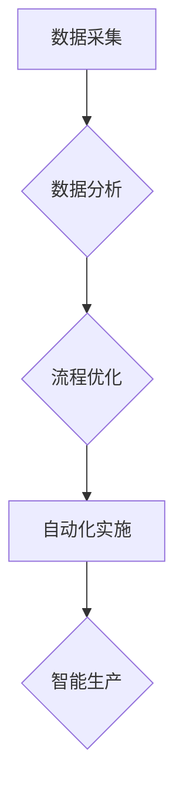

## 工业革命的规模化生产模式

> 关键词：工业革命、规模化生产、自动化、数据驱动、机器学习、人工智能、流程优化、效率提升

### 1. 背景介绍

工业革命是人类历史上的一次重大变革，它彻底改变了生产方式，推动了社会经济的快速发展。传统的手工制作方式被机器生产所取代，大量商品以更低的价格生产出来，满足了人们日益增长的需求。工业革命的核心在于规模化生产，即通过标准化、流水线和机器自动化，实现大规模、高效的生产。

如今，我们正处于一个新的技术变革时代，人工智能、机器学习和自动化技术正在迅速发展，它们为我们提供了重新定义规模化生产的机遇。与工业革命不同的是，这次变革不仅限于生产过程本身，它还将深刻地影响整个产业链，从设计、研发、生产到物流、销售和服务。

### 2. 核心概念与联系

**2.1 规模化生产的本质**

规模化生产的核心在于通过标准化、流水线和自动化，实现大规模、高效的生产。它强调重复性、可预测性和可控性，通过降低单位成本，提高生产效率和产品质量。

**2.2  工业革命与现代技术变革的联系**

工业革命的规模化生产模式为现代技术变革提供了基础。现代技术，特别是人工智能和机器学习，可以进一步提升规模化生产的效率和智能化水平。

**2.3  数据驱动与自动化**

数据驱动是现代规模化生产的关键。通过收集和分析生产过程中的数据，我们可以识别瓶颈、优化流程、提高效率和降低成本。自动化技术可以将数据驱动的决策转化为实际操作，实现无人化生产。

**2.4  流程图**



### 3. 核心算法原理 & 具体操作步骤

**3.1 算法原理概述**

规模化生产的核心算法原理包括：

* **机器学习算法**: 用于预测生产需求、优化生产流程、识别设备故障等。
* **优化算法**: 用于优化生产计划、资源分配、物流配送等。
* **控制算法**: 用于控制机器设备的运行状态、实现自动化生产。

**3.2 算法步骤详解**

1. **数据收集**: 收集生产过程中的各种数据，例如设备运行状态、生产效率、产品质量等。
2. **数据预处理**: 对收集到的数据进行清洗、转换和格式化，使其适合算法训练和应用。
3. **模型训练**: 使用机器学习算法对预处理后的数据进行训练，建立预测模型或优化模型。
4. **模型评估**: 对训练好的模型进行评估，验证其准确性和有效性。
5. **模型部署**: 将训练好的模型部署到生产环境中，用于实际生产决策和控制。

**3.3 算法优缺点**

* **优点**: 提高生产效率、降低生产成本、提高产品质量、实现智能化生产。
* **缺点**: 需要大量数据进行训练，算法模型的准确性依赖于数据质量，算法的解释性和可解释性较差。

**3.4 算法应用领域**

* **制造业**: 自动化生产、智能制造、预测性维护、质量控制等。
* **物流业**: 物流优化、配送路径规划、仓储管理等。
* **零售业**: 库存管理、商品推荐、个性化营销等。

### 4. 数学模型和公式 & 详细讲解 & 举例说明

**4.1 数学模型构建**

规模化生产的数学模型可以描述生产过程中的各种关系，例如生产成本、生产效率、产品质量等。

**4.2 公式推导过程**

例如，我们可以用以下公式来描述生产成本：

$$
C = F + VC
$$

其中：

* $C$ 表示生产成本
* $F$ 表示固定成本
* $VC$ 表示变动成本

**4.3 案例分析与讲解**

假设一家工厂生产某种产品，其固定成本为 10000 元，每生产一件产品的变动成本为 10 元。如果工厂生产 1000 件产品，则其总生产成本为：

$$
C = 10000 + 10 * 1000 = 20000 元
$$

**5. 项目实践：代码实例和详细解释说明**

**5.1 开发环境搭建**

* 操作系统：Linux 或 Windows
* 编程语言：Python
* 库依赖：pandas, numpy, scikit-learn

**5.2 源代码详细实现**

```python
import pandas as pd
from sklearn.linear_model import LinearRegression

# 数据加载
data = pd.read_csv('production_data.csv')

# 数据预处理
X = data[['设备运行时间', '原材料消耗']]
y = data['产品产量']

# 模型训练
model = LinearRegression()
model.fit(X, y)

# 模型预测
new_data = pd.DataFrame({'设备运行时间': [8], '原材料消耗': [15]})
predicted_output = model.predict(new_data)

# 结果展示
print(f'预测产量: {predicted_output[0]}')
```

**5.3 代码解读与分析**

这段代码演示了如何使用机器学习算法预测产品产量。

1. 首先，我们加载生产数据，并选择设备运行时间和原材料消耗作为预测变量，产品产量作为目标变量。
2. 然后，我们使用线性回归模型训练模型，并使用训练好的模型预测新的数据。
3. 最后，我们打印预测的产量。

**5.4 运行结果展示**

运行结果将显示预测的产量值。

### 6. 实际应用场景

**6.1 制造业**

* **智能工厂**: 通过自动化和数据驱动，实现生产过程的智能化控制和优化。
* **预测性维护**: 利用机器学习算法预测设备故障，提前进行维护，降低设备停机时间和维修成本。
* **质量控制**: 使用机器视觉和数据分析技术，对产品质量进行实时监控和检测，提高产品质量和一致性。

**6.2 物流业**

* **物流优化**: 利用算法优化配送路径，提高配送效率和降低运输成本。
* **仓储管理**: 使用自动化技术和数据分析，优化仓储布局和库存管理，提高仓储效率和降低库存成本。

**6.3 零售业**

* **库存管理**: 利用数据分析预测商品需求，优化库存水平，降低库存成本和缺货率。
* **个性化营销**: 使用机器学习算法分析客户数据，提供个性化商品推荐和营销服务。

**6.4 未来应用展望**

随着人工智能和机器学习技术的不断发展，规模化生产模式将更加智能化、自动化和个性化。未来，我们可以期待看到：

* **更加智能的生产系统**: 能够自主学习和适应变化的生产环境，实现更高效的生产控制。
* **更加个性化的产品**: 能够根据客户需求定制化的产品，满足个性化需求。
* **更加可持续的生产模式**: 能够减少资源消耗和环境污染，实现更加可持续的生产发展。

### 7. 工具和资源推荐

**7.1 学习资源推荐**

* **书籍**:
    * 《深度学习》
    * 《机器学习实战》
    * 《Python机器学习》
* **在线课程**:
    * Coursera
    * edX
    * Udacity

**7.2 开发工具推荐**

* **编程语言**: Python
* **机器学习库**: scikit-learn, TensorFlow, PyTorch
* **数据分析工具**: pandas, NumPy

**7.3 相关论文推荐**

* **工业革命 4.0**: https://www.researchgate.net/publication/329971034_Industry_40_A_Literature_Review
* **人工智能在制造业中的应用**: https://www.researchgate.net/publication/331911014_Artificial_Intelligence_in_Manufacturing_A_Review

### 8. 总结：未来发展趋势与挑战

**8.1 研究成果总结**

工业革命的规模化生产模式为现代技术变革提供了基础，人工智能和机器学习技术正在推动规模化生产的进一步发展。

**8.2 未来发展趋势**

未来，规模化生产模式将更加智能化、自动化和个性化，实现更加高效、可持续的生产发展。

**8.3 面临的挑战**

* **数据安全和隐私**: 大规模数据收集和使用需要解决数据安全和隐私问题。
* **算法解释性和可解释性**: 复杂算法的决策过程难以解释，需要提高算法的可解释性。
* **人才培养**: 需要培养更多具备人工智能和机器学习技能的人才。

**8.4 研究展望**

未来研究方向包括：

* **开发更加智能、高效的算法**: 提高算法的预测精度、优化能力和适应性。
* **解决数据安全和隐私问题**: 建立安全可靠的数据管理和使用机制。
* **提高算法的可解释性和透明度**: 使算法决策更加可理解和可信任。


### 9. 附录：常见问题与解答

**9.1 如何选择合适的算法？**

选择合适的算法取决于具体的应用场景和数据特点。例如，对于预测连续变量，可以使用线性回归或神经网络；对于分类问题，可以使用决策树或支持向量机。

**9.2 如何评估算法的性能？**

可以使用各种指标来评估算法的性能，例如准确率、召回率、F1-score等。

**9.3 如何解决数据过拟合问题？**

数据过拟合是指模型对训练数据过拟合，导致在测试数据上的性能下降。可以使用正则化、交叉验证等方法来解决数据过拟合问题。


作者：禅与计算机程序设计艺术 / Zen and the Art of Computer Programming 
