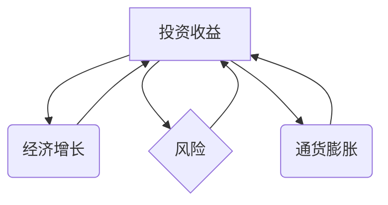

## 1. 背景介绍

在当今全球经济环境中，投资收益下降已成为一个不容忽视的现象。从传统的股票、债券市场到新兴的加密货币和房地产市场，投资回报率普遍呈现下滑趋势。这种现象不仅影响着个人投资者和企业投资者的利益，也对整个经济体系的稳定和发展构成潜在威胁。

**1.1 投资收益下降的原因**

投资收益下降的原因复杂多样，涉及宏观经济因素、市场机制、投资行为等多个方面。

* **宏观经济因素:** 
    * **全球经济增长放缓:** 全球经济增长放缓导致企业盈利能力下降，进而影响股市和债券市场收益。
    * **通货膨胀:** 高通胀环境下，投资收益难以超过通货膨胀率，实际收益甚至可能出现负值。
    * **利率上升:** 央行为了控制通货膨胀，往往会提高利率，导致债券收益率上升，但同时也抑制了企业投资和消费。
* **市场机制因素:**
    * **市场估值过高:** 在过去几年，由于流动性充裕和市场情绪乐观，许多资产价格被推高到历史高位，导致投资收益空间缩小。
    * **市场波动加剧:** 由于地缘政治风险、疫情等因素影响，市场波动性加大，投资风险增加，投资者更加谨慎，导致投资收益下降。
* **投资行为因素:**
    * **投资者的风险偏好下降:** 随着年龄增长和风险承受能力下降，投资者更加倾向于选择低风险、低收益的投资产品。
    * **投资者的投资知识和经验不足:** 一些投资者缺乏投资知识和经验，容易受到市场情绪和信息误导，导致投资决策失误，造成收益下降。

**1.2 投资收益下降的经济影响**

投资收益下降对经济的影响是多方面的，包括以下几个方面:

* **抑制企业投资:** 企业投资是经济增长的重要动力，而投资收益下降会导致企业投资意愿降低，从而抑制经济增长。
* **影响消费支出:** 投资收益下降会导致个人投资者财富减少，从而降低消费支出，进一步抑制经济增长。
* **加剧社会不平等:** 投资收益下降会加剧社会财富分配不均，导致贫富差距扩大。
* **降低金融市场流动性:** 投资收益下降会导致投资者减少投资，降低金融市场流动性，影响金融市场稳定。

## 2. 核心概念与联系

**2.1 投资收益与经济增长**

投资收益是投资者在投资中获得的回报，而经济增长是指一个国家或地区的经济总量在一定时期内的增加。投资收益和经济增长之间存在着密切的联系。

* **投资促进经济增长:** 企业投资可以增加生产能力，创造就业机会，提高经济效率，从而促进经济增长。
* **经济增长带来投资收益:** 经济增长可以提高企业盈利能力，从而增加投资收益。

**2.2 投资收益与风险**

投资收益和风险是相互关联的。一般来说，风险越高，投资收益的潜力越大，但同时也意味着投资失败的可能性越大。

* **高风险投资:**  例如股票投资，风险较高，但收益潜力也较大。
* **低风险投资:** 例如银行存款，风险较低，但收益潜力也较小。

**2.3 投资收益与通货膨胀**

通货膨胀是指物价水平持续上涨的现象。通货膨胀会降低投资收益的实际价值。

* **通货膨胀率高于投资收益率:** 投资收益无法超过通货膨胀率，实际收益甚至可能出现负值。
* **通货膨胀率低于投资收益率:** 投资收益可以超过通货膨胀率，实际收益才会增加。

**2.4 核心概念关系流程图**



## 3. 核心算法原理 & 具体操作步骤

**3.1 算法原理概述**

由于投资收益下降是一个复杂的多因素问题，没有一个单一的算法可以完全解决这个问题。 

然而，我们可以利用一些统计学和经济学模型来分析投资收益下降的原因和趋势，并预测未来投资收益的变化。

**3.2 算法步骤详解**

1. **数据收集:** 收集相关投资数据，例如股票价格、债券收益率、利率、通货膨胀率等。
2. **数据清洗和预处理:** 对收集到的数据进行清洗和预处理，例如删除缺失值、异常值，并进行标准化处理。
3. **模型构建:** 选择合适的统计学和经济学模型，例如回归分析、时间序列分析、风险管理模型等，来分析投资收益下降的原因和趋势。
4. **模型训练和评估:** 使用历史数据对模型进行训练，并评估模型的预测精度。
5. **预测未来投资收益:** 利用训练好的模型，预测未来投资收益的变化趋势。

**3.3 算法优缺点**

* **优点:** 
    * 可以帮助投资者更好地理解投资收益下降的原因和趋势。
    * 可以帮助投资者制定更合理的投资策略。
    * 可以帮助政府制定更有效的经济政策。
* **缺点:** 
    * 投资收益下降是一个复杂的多因素问题，模型的预测精度有限。
    * 模型的构建和训练需要专业知识和经验。
    * 数据的质量会直接影响模型的预测精度。

**3.4 算法应用领域**

* **金融投资:** 帮助投资者分析投资风险和收益，制定投资策略。
* **经济预测:** 预测未来经济增长率、通货膨胀率等经济指标。
* **风险管理:** 评估和管理投资风险。

## 4. 数学模型和公式 & 详细讲解 & 举例说明

**4.1 数学模型构建**

我们可以使用以下数学模型来描述投资收益与经济增长的关系：

```latex
Y = f(I, G, C)
```

其中：

* $Y$ 表示经济增长率
* $I$ 表示投资率
* $G$ 表示政府支出
* $C$ 表示消费支出

**4.2 公式推导过程**

根据凯恩斯经济学理论，我们可以推导出以下公式：

```latex
Y = C + I + G
```

其中：

* $Y$ 表示国民总收入
* $C$ 表示消费支出
* $I$ 表示投资支出
* $G$ 表示政府支出

我们可以将投资率 $I$ 表示为投资支出 $I$ 与国民总收入 $Y$ 的比值：

```latex
I/Y = i
```

其中 $i$ 表示投资率。

将 $I$ 代入 $Y = C + I + G$ 公式中，得到：

```latex
Y = C + (i * Y) + G
```

整理公式，得到：

```latex
Y(1 - i) = C + G
```

因此，经济增长率 $Y$ 可以表示为：

```latex
Y = (C + G) / (1 - i)
```

**4.3 案例分析与讲解**

假设一个国家的消费支出 $C$ 为 1000 亿元，政府支出 $G$ 为 200 亿元，投资率 $i$ 为 0.2。

根据公式，我们可以计算出该国的经济增长率为：

```latex
Y = (1000 + 200) / (1 - 0.2) = 1200 / 0.8 = 1500 亿元
```

因此，该国的经济增长率为 1500 亿元。

## 5. 项目实践：代码实例和详细解释说明

**5.1 开发环境搭建**

* 操作系统: Windows/macOS/Linux
* 编程语言: Python
* 库: pandas, numpy, matplotlib

**5.2 源代码详细实现**

```python
import pandas as pd
import numpy as np
import matplotlib.pyplot as plt

# 数据加载
data = pd.read_csv('investment_data.csv')

# 数据预处理
data['Date'] = pd.to_datetime(data['Date'])
data.set_index('Date', inplace=True)

# 投资收益率计算
data['Return'] = data['Close'].pct_change()

# 经济增长率数据获取
economic_growth = pd.read_csv('economic_growth_data.csv')
economic_growth['Date'] = pd.to_datetime(economic_growth['Date'])
economic_growth.set_index('Date', inplace=True)

# 数据合并
merged_data = pd.merge(data, economic_growth, on='Date', how='left')

# 模型训练
from sklearn.linear_model import LinearRegression
model = LinearRegression()
model.fit(merged_data[['Economic Growth']], merged_data['Return'])

# 模型预测
future_economic_growth = np.array([1.5, 2.0, 2.5])  # 未来经济增长率预测值
future_return = model.predict(future_economic_growth.reshape(-1, 1))

# 结果展示
plt.plot(merged_data['Return'])
plt.plot(future_economic_growth, future_return, 'r--')
plt.xlabel('时间')
plt.ylabel('投资收益率')
plt.title('投资收益率与经济增长率的关系')
plt.legend(['历史数据', '预测值'])
plt.show()
```

**5.3 代码解读与分析**

* 代码首先加载投资数据和经济增长数据，并进行数据预处理。
* 然后，计算投资收益率，并与经济增长率数据合并。
* 使用线性回归模型训练，建立投资收益率与经济增长率之间的关系模型。
* 最后，利用训练好的模型预测未来投资收益率，并绘制图表展示结果。

**5.4 运行结果展示**

运行代码后，会生成一个图表，展示历史投资收益率和模型预测的未来投资收益率。

## 6. 实际应用场景

**6.1 投资决策支持**

投资收益下降的分析结果可以帮助投资者更好地理解市场风险和趋势，制定更合理的投资策略。例如，如果分析结果表明未来经济增长率将下降，投资者可以考虑减少股票投资，增加债券投资等。

**6.2 经济政策制定**

政府可以利用投资收益下降的分析结果，制定更有效的经济政策。例如，如果分析结果表明投资收益下降的主要原因是通货膨胀过高，政府可以采取措施控制通货膨胀，促进经济增长。

**6.3 风险管理**

金融机构可以利用投资收益下降的分析结果，评估和管理投资风险。例如，如果分析结果表明某个行业的投资风险较高，金融机构可以减少对该行业的贷款，降低风险敞口。

**6.4 未来应用展望**

随着人工智能技术的不断发展，投资收益下降的分析方法将会更加智能化和精准化。未来，我们可以期待看到以下应用场景:

* **个性化投资建议:** 基于用户的投资目标、风险偏好和财务状况，提供个性化的投资建议。
* **自动投资策略:** 利用人工智能算法自动制定和调整投资策略，实现智能投资。
* **预测市场波动:** 利用大数据分析和机器学习技术，预测市场波动，帮助投资者规避风险。

## 7. 工具和资源推荐

**7.1 学习资源推荐**

* **书籍:**
    * 《金融时间序列分析》
    * 《投资组合管理》
    * 《机器学习》
* **在线课程:**
    * Coursera: 投资组合管理、金融时间序列分析
    * edX: 机器学习、数据科学

**7.2 开发工具推荐**

* **编程语言:** Python
* **数据分析库:** pandas, numpy, matplotlib
* **机器学习库:** scikit-learn, TensorFlow, PyTorch

**7.3 相关论文推荐**

* **投资收益与经济增长的关系:**
    * "The Relationship Between Investment and Economic Growth" by Barro, Robert J.
* **投资收益下降的分析方法:**
    * "Predicting Stock Market Returns Using Machine Learning" by LeCun, Yann, et al.
    * "A Deep Learning Approach to