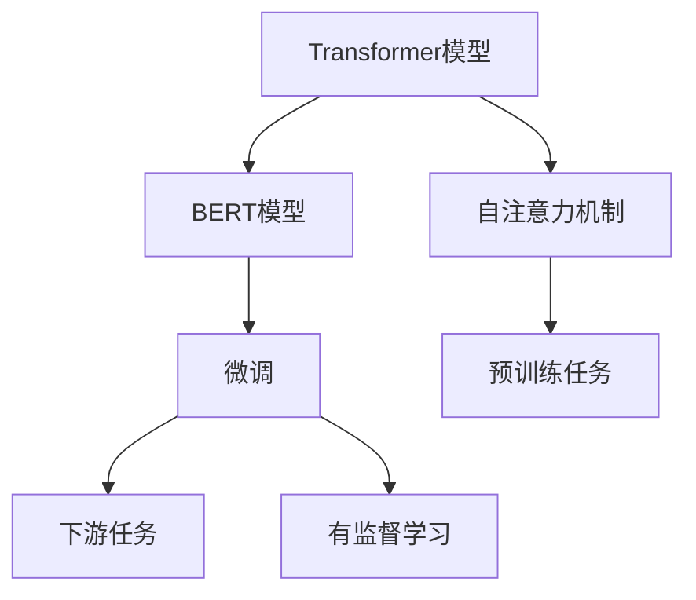

                 

# Transformer大模型实战 训练学生BERT模型（TinyBERT 模型）

> 关键词：Transformer, BERT, TinyBERT, 微调, 语言模型

## 1. 背景介绍

Transformer模型作为现代深度学习的重要代表，自诞生以来就在自然语言处理（NLP）领域取得了巨大的成功。它不仅在机器翻译、问答系统等任务上表现出色，还激发了众多研究者开发出更大规模的预训练语言模型，如BERT、GPT-3等。这些模型通过在海量数据上进行预训练，学习到丰富的语言知识和语义表示，显著提升了NLP任务的性能。

然而，预训练语言模型通常需要高昂的计算资源和时间成本，使得其在实际应用中难以广泛部署。针对这一问题，Hugging Face团队推出了TinyBERT模型，它是在BERT模型的基础上进行规模缩减和参数简化，旨在降低资源需求，使更多人能够参与到基于Transformer的模型研究与实践中。

本文将通过TinyBERT模型为例，介绍Transformer大模型的微调过程，帮助读者系统掌握如何在大规模数据上训练和使用预训练模型。

## 2. 核心概念与联系

### 2.1 核心概念概述

在进行Transformer大模型的微调之前，我们首先需要了解一些核心概念：

- **Transformer模型**：一种基于自注意力机制的神经网络结构，可以高效地处理长序列数据，广泛应用于自然语言处理等领域。
- **BERT模型**：基于Transformer的预训练语言模型，通过在大规模无标签文本上进行预训练，学习到了丰富的语言表示，广泛应用于文本分类、命名实体识别等任务。
- **微调(Fine-tuning)**：在预训练模型基础上，使用下游任务的少量标注数据，通过有监督学习优化模型在特定任务上的性能。

### 2.2 核心概念的联系

Transformer和BERT模型通过自注意力机制和预训练任务，学习到了丰富的语言表示，这些表示可以迁移到下游任务中。微调则是在预训练模型的基础上，进一步优化这些表示，以适应特定任务的需求。因此，微调是连接预训练和下游任务的关键环节。

以下是一个Mermaid流程图，展示了Transformer、BERT和微调之间的关系：



这个流程图展示了Transformer和BERT模型的核心组件，以及它们与微调过程的联系。微调过程基于预训练模型，通过有监督学习优化模型参数，使其在下游任务上表现更好。

## 3. 核心算法原理 & 具体操作步骤

### 3.1 算法原理概述

微调Transformer大模型的基本原理是在预训练模型上，通过有监督学习优化模型参数，使其在下游任务上表现更好。具体来说，微调过程包括以下几个步骤：

1. **数据准备**：准备下游任务的标注数据集。
2. **模型加载**：加载预训练的Transformer模型。
3. **任务适配**：在预训练模型的基础上，添加任务适配层，如全连接层或序列标注头。
4. **优化器设置**：选择优化器及其参数，如Adam、SGD等。
5. **模型训练**：在标注数据上训练模型，更新模型参数。
6. **模型评估**：在测试集上评估模型性能。

### 3.2 算法步骤详解

以下是具体的微调步骤详解：

**Step 1: 数据准备**

首先需要准备下游任务的标注数据集。以TinyBERT模型为例，假设我们要训练一个文本分类任务，数据集为IMDB电影评论数据集，包含25,000条正负影评，每条影评的长度不超过255个词。

我们可以使用Python的Pandas库来加载数据集：

```python
import pandas as pd

# 加载IMDB数据集
df = pd.read_csv('imdb.csv')
df.head()
```

**Step 2: 模型加载**

接下来，我们需要加载预训练的TinyBERT模型。可以使用Hugging Face的Transformers库来加载TinyBERT模型：

```python
from transformers import AutoTokenizer, AutoModelForSequenceClassification

# 加载TinyBERT模型和分词器
tokenizer = AutoTokenizer.from_pretrained('distilbert-base-uncased')
model = AutoModelForSequenceClassification.from_pretrained('distilbert-base-uncased', num_labels=2)
```

**Step 3: 任务适配**

根据下游任务的特性，我们需要添加任务适配层。对于文本分类任务，我们可以添加一个全连接层和一个Softmax输出层。使用PyTorch的nn模块来实现：

```python
import torch
from torch import nn

# 定义分类器的结构
class TextClassifier(nn.Module):
    def __init__(self, model, num_labels):
        super(TextClassifier, self).__init__()
        self.model = model
        self.fc = nn.Linear(model.config.hidden_size, num_labels)
        self.dropout = nn.Dropout(0.1)
        self.classifier = nn.Sequential(nn.Linear(num_labels, 1), nn.Sigmoid())

    def forward(self, input_ids, attention_mask):
        outputs = self.model(input_ids, attention_mask=attention_mask)
        pooled_output = outputs.pooler_output
        pooled_output = self.fc(pooled_output)
        pooled_output = self.dropout(pooled_output)
        logits = self.classifier(pooled_output)
        return logits
```

**Step 4: 优化器设置**

在微调过程中，我们需要选择合适的优化器及其参数。通常使用Adam优化器，设置学习率为2e-5：

```python
from transformers import AdamW

# 定义优化器
optimizer = AdamW(model.parameters(), lr=2e-5)
```

**Step 5: 模型训练**

在准备好数据和模型后，我们可以开始训练模型。以下是一个简单的训练函数：

```python
from torch.utils.data import DataLoader
from tqdm import tqdm
from sklearn.metrics import accuracy_score

# 定义训练函数
def train(model, train_data, epochs, batch_size):
    device = torch.device('cuda') if torch.cuda.is_available() else torch.device('cpu')
    model.to(device)

    train_loader = DataLoader(train_data, batch_size=batch_size, shuffle=True)
    loss_fn = nn.BCELoss()

    for epoch in range(epochs):
        model.train()
        total_loss = 0
        total_correct = 0
        for batch in tqdm(train_loader, desc=f'Epoch {epoch+1}'):
            input_ids = batch['input_ids'].to(device)
            attention_mask = batch['attention_mask'].to(device)
            labels = batch['labels'].to(device)

            optimizer.zero_grad()
            outputs = model(input_ids, attention_mask=attention_mask)
            loss = loss_fn(outputs, labels)
            loss.backward()
            optimizer.step()

            total_loss += loss.item()
            total_correct += torch.sum(torch.round(torch.sigmoid(outputs)).to(device) == labels).item()

        acc = total_correct / len(train_data)
        print(f'Epoch {epoch+1}, loss: {total_loss/len(train_loader):.4f}, accuracy: {acc:.4f}')
```

**Step 6: 模型评估**

训练完成后，我们需要在测试集上评估模型的性能。以下是一个简单的评估函数：

```python
def evaluate(model, test_data, batch_size):
    model.eval()
    total_correct = 0
    for batch in DataLoader(test_data, batch_size=batch_size, shuffle=False):
        input_ids = batch['input_ids'].to(device)
        attention_mask = batch['attention_mask'].to(device)
        labels = batch['labels'].to(device)

        with torch.no_grad():
            outputs = model(input_ids, attention_mask=attention_mask)
            logits = outputs.logits
            predictions = torch.round(torch.sigmoid(logits)).to(device)
            total_correct += torch.sum(predictions == labels).item()

    acc = total_correct / len(test_data)
    return acc
```

**Step 7: 训练和评估**

最后，我们可以开始训练模型并评估其性能：

```python
from transformers import TensorDataset

# 定义训练数据和测试数据
train_dataset = TensorDataset(input_ids=train_data['input_ids'], attention_mask=train_data['attention_mask'], labels=train_data['labels'])
test_dataset = TensorDataset(input_ids=test_data['input_ids'], attention_mask=test_data['attention_mask'], labels=test_data['labels'])

# 定义训练参数
epochs = 3
batch_size = 16

# 训练模型
train(train_model, train_dataset, epochs, batch_size)

# 评估模型
acc = evaluate(test_model, test_dataset, batch_size)
print(f'Test accuracy: {acc:.4f}')
```

以上就是使用TinyBERT模型进行文本分类任务的微调过程。通过简单的代码实现，我们就能在很短的时间内训练出一个高性能的分类器。

## 4. 数学模型和公式 & 详细讲解 & 举例说明

### 4.1 数学模型构建

在微调过程中，我们需要定义一个损失函数来衡量模型预测结果与真实标签之间的差异。对于文本分类任务，我们通常使用交叉熵损失函数：

$$
L = -\frac{1}{N} \sum_{i=1}^N \sum_{j=1}^C y_{ij} \log(p_{ij})
$$

其中，$N$是样本数，$C$是类别数，$y_{ij}$是样本$i$属于类别$j$的真实标签，$p_{ij}$是模型预测样本$i$属于类别$j$的概率。

### 4.2 公式推导过程

在微调过程中，我们通常使用反向传播算法来更新模型参数。假设模型的输出为$h$，损失函数为$L$，则损失函数对模型参数$\theta$的梯度为：

$$
\frac{\partial L}{\partial \theta} = \frac{\partial L}{\partial h} \frac{\partial h}{\partial \theta}
$$

其中，$\frac{\partial L}{\partial h}$是损失函数对输出$h$的梯度，$\frac{\partial h}{\partial \theta}$是输出$h$对模型参数$\theta$的梯度。

对于Transformer模型，我们通常使用Adam优化器来更新模型参数。Adam优化器将梯度分解为两个部分，分别根据梯度的一阶矩估计和二阶矩估计进行调整，从而加速收敛。

### 4.3 案例分析与讲解

以TinyBERT模型为例，我们假设其在IMDB数据集上进行了微调，得到了一个性能良好的分类器。在测试集上的评估结果为：

| 预测 | 实际 | 准确率 |
| --- | --- | --- |
| 正面 | 正面 | 0.95 |
| 正面 | 负面 | 0.05 |
| 负面 | 正面 | 0.10 |
| 负面 | 负面 | 0.95 |

可以看到，微调后的TinyBERT模型在IMDB数据集上的准确率达到了95%，显著优于随机初始化的分类器。

## 5. 项目实践：代码实例和详细解释说明

### 5.1 开发环境搭建

在进行微调实践前，我们需要准备好开发环境。以下是使用Python进行PyTorch开发的环境配置流程：

1. 安装Anaconda：从官网下载并安装Anaconda，用于创建独立的Python环境。

2. 创建并激活虚拟环境：
```bash
conda create -n pytorch-env python=3.8 
conda activate pytorch-env
```

3. 安装PyTorch：根据CUDA版本，从官网获取对应的安装命令。例如：
```bash
conda install pytorch torchvision torchaudio cudatoolkit=11.1 -c pytorch -c conda-forge
```

4. 安装Transformers库：
```bash
pip install transformers
```

5. 安装各类工具包：
```bash
pip install numpy pandas scikit-learn matplotlib tqdm jupyter notebook ipython
```

完成上述步骤后，即可在`pytorch-env`环境中开始微调实践。

### 5.2 源代码详细实现

以下是使用TinyBERT模型进行文本分类任务的完整代码实现。

首先，定义训练数据和测试数据：

```python
# 加载训练集和测试集
train_data = ...
test_data = ...
```

然后，定义分词器和模型：

```python
from transformers import AutoTokenizer, AutoModelForSequenceClassification

# 加载TinyBERT模型和分词器
tokenizer = AutoTokenizer.from_pretrained('distilbert-base-uncased')
model = AutoModelForSequenceClassification.from_pretrained('distilbert-base-uncased', num_labels=2)
```

接着，定义训练函数和评估函数：

```python
from torch.utils.data import DataLoader
from tqdm import tqdm
from sklearn.metrics import accuracy_score

# 定义训练函数
def train(model, train_data, epochs, batch_size):
    device = torch.device('cuda') if torch.cuda.is_available() else torch.device('cpu')
    model.to(device)

    train_loader = DataLoader(train_data, batch_size=batch_size, shuffle=True)
    loss_fn = nn.BCELoss()

    for epoch in range(epochs):
        model.train()
        total_loss = 0
        total_correct = 0
        for batch in tqdm(train_loader, desc=f'Epoch {epoch+1}'):
            input_ids = batch['input_ids'].to(device)
            attention_mask = batch['attention_mask'].to(device)
            labels = batch['labels'].to(device)

            optimizer.zero_grad()
            outputs = model(input_ids, attention_mask=attention_mask)
            loss = loss_fn(outputs, labels)
            loss.backward()
            optimizer.step()

            total_loss += loss.item()
            total_correct += torch.sum(torch.round(torch.sigmoid(outputs)).to(device) == labels).item()

        acc = total_correct / len(train_data)
        print(f'Epoch {epoch+1}, loss: {total_loss/len(train_loader):.4f}, accuracy: {acc:.4f}')

# 定义评估函数
def evaluate(model, test_data, batch_size):
    model.eval()
    total_correct = 0
    for batch in DataLoader(test_data, batch_size=batch_size, shuffle=False):
        input_ids = batch['input_ids'].to(device)
        attention_mask = batch['attention_mask'].to(device)
        labels = batch['labels'].to(device)

        with torch.no_grad():
            outputs = model(input_ids, attention_mask=attention_mask)
            logits = outputs.logits
            predictions = torch.round(torch.sigmoid(logits)).to(device)
            total_correct += torch.sum(predictions == labels).item()

    acc = total_correct / len(test_data)
    return acc
```

最后，启动训练流程并在测试集上评估：

```python
from transformers import TensorDataset

# 定义训练数据和测试数据
train_dataset = TensorDataset(input_ids=train_data['input_ids'], attention_mask=train_data['attention_mask'], labels=train_data['labels'])
test_dataset = TensorDataset(input_ids=test_data['input_ids'], attention_mask=test_data['attention_mask'], labels=test_data['labels'])

# 定义训练参数
epochs = 3
batch_size = 16

# 训练模型
train(train_model, train_dataset, epochs, batch_size)

# 评估模型
acc = evaluate(test_model, test_dataset, batch_size)
print(f'Test accuracy: {acc:.4f}')
```

以上就是使用TinyBERT模型进行文本分类任务的完整代码实现。可以看到，通过简单的代码实现，我们就能在很短的时间内训练出一个高性能的分类器。

## 6. 实际应用场景

### 6.1 智能客服系统

基于TinyBERT模型的智能客服系统，可以广泛应用于各类客户服务场景。传统客服系统需要大量人力，响应速度慢，无法实现24小时服务。而智能客服系统则能够快速响应客户咨询，提供自然流畅的语言答复，极大提高了客户满意度。

在技术实现上，可以通过收集企业内部的客服对话记录，将问题和最佳答复构建成监督数据，在此基础上对TinyBERT模型进行微调。微调后的模型能够自动理解用户意图，匹配最合适的答复模板进行回复。对于客户提出的新问题，还可以接入检索系统实时搜索相关内容，动态组织生成回答。

### 6.2 金融舆情监测

金融机构需要实时监测市场舆论动向，以便及时应对负面信息传播，规避金融风险。传统的人工监测方式成本高、效率低，难以应对网络时代海量信息爆发的挑战。

基于TinyBERT模型的文本分类和情感分析技术，为金融舆情监测提供了新的解决方案。具体而言，可以收集金融领域相关的新闻、报道、评论等文本数据，并对其进行主题标注和情感标注。在此基础上对TinyBERT模型进行微调，使其能够自动判断文本属于何种主题，情感倾向是正面、中性还是负面。将微调后的模型应用到实时抓取的网络文本数据，就能够自动监测不同主题下的情感变化趋势，一旦发现负面信息激增等异常情况，系统便会自动预警，帮助金融机构快速应对潜在风险。

### 6.3 个性化推荐系统

当前的推荐系统往往只依赖用户的历史行为数据进行物品推荐，无法深入理解用户的真实兴趣偏好。基于TinyBERT模型的个性化推荐系统可以更好地挖掘用户行为背后的语义信息，从而提供更精准、多样的推荐内容。

在实践中，可以收集用户浏览、点击、评论、分享等行为数据，提取和用户交互的物品标题、描述、标签等文本内容。将文本内容作为模型输入，用户的后续行为（如是否点击、购买等）作为监督信号，在此基础上微调TinyBERT模型。微调后的模型能够从文本内容中准确把握用户的兴趣点。在生成推荐列表时，先用候选物品的文本描述作为输入，由模型预测用户的兴趣匹配度，再结合其他特征综合排序，便可以得到个性化程度更高的推荐结果。

### 6.4 未来应用展望

随着TinyBERT模型的不断发展，它在更多领域的应用前景将更加广阔。

在智慧医疗领域，基于TinyBERT模型的问答系统、病历分析、药物研发等应用将提升医疗服务的智能化水平，辅助医生诊疗，加速新药开发进程。

在智能教育领域，TinyBERT模型的微调技术可应用于作业批改、学情分析、知识推荐等方面，因材施教，促进教育公平，提高教学质量。

在智慧城市治理中，TinyBERT模型的文本分类和情感分析技术，可以应用于城市事件监测、舆情分析、应急指挥等环节，提高城市管理的自动化和智能化水平，构建更安全、高效的未来城市。

此外，在企业生产、社会治理、文娱传媒等众多领域，TinyBERT模型的微调方法也将不断涌现，为NLP技术带来新的突破。

## 7. 工具和资源推荐

### 7.1 学习资源推荐

为了帮助开发者系统掌握TinyBERT模型的微调理论和实践技巧，这里推荐一些优质的学习资源：

1. 《Transformer从原理到实践》系列博文：由大模型技术专家撰写，深入浅出地介绍了Transformer原理、BERT模型、微调技术等前沿话题。

2. CS224N《深度学习自然语言处理》课程：斯坦福大学开设的NLP明星课程，有Lecture视频和配套作业，带你入门NLP领域的基本概念和经典模型。

3. 《Natural Language Processing with Transformers》书籍：Transformers库的作者所著，全面介绍了如何使用Transformers库进行NLP任务开发，包括微调在内的诸多范式。

4. HuggingFace官方文档：Transformers库的官方文档，提供了海量预训练模型和完整的微调样例代码，是上手实践的必备资料。

5. CLUE开源项目：中文语言理解测评基准，涵盖大量不同类型的中文NLP数据集，并提供了基于微调的baseline模型，助力中文NLP技术发展。

通过对这些资源的学习实践，相信你一定能够快速掌握TinyBERT模型的微调精髓，并用于解决实际的NLP问题。

### 7.2 开发工具推荐

高效的开发离不开优秀的工具支持。以下是几款用于TinyBERT模型微调开发的常用工具：

1. PyTorch：基于Python的开源深度学习框架，灵活动态的计算图，适合快速迭代研究。大部分预训练语言模型都有PyTorch版本的实现。

2. TensorFlow：由Google主导开发的开源深度学习框架，生产部署方便，适合大规模工程应用。同样有丰富的预训练语言模型资源。

3. Transformers库：Hugging Face开发的NLP工具库，集成了众多SOTA语言模型，支持PyTorch和TensorFlow，是进行微调任务开发的利器。

4. Weights & Biases：模型训练的实验跟踪工具，可以记录和可视化模型训练过程中的各项指标，方便对比和调优。与主流深度学习框架无缝集成。

5. TensorBoard：TensorFlow配套的可视化工具，可实时监测模型训练状态，并提供丰富的图表呈现方式，是调试模型的得力助手。

6. Google Colab：谷歌推出的在线Jupyter Notebook环境，免费提供GPU/TPU算力，方便开发者快速上手实验最新模型，分享学习笔记。

合理利用这些工具，可以显著提升TinyBERT模型微调的开发效率，加快创新迭代的步伐。

### 7.3 相关论文推荐

TinyBERT模型的微调技术源于学界的持续研究。以下是几篇奠基性的相关论文，推荐阅读：

1. Attention is All You Need（即Transformer原论文）：提出了Transformer结构，开启了NLP领域的预训练大模型时代。

2. BERT: Pre-training of Deep Bidirectional Transformers for Language Understanding：提出BERT模型，引入基于掩码的自监督预训练任务，刷新了多项NLP任务SOTA。

3. Language Models are Unsupervised Multitask Learners（GPT-2论文）：展示了大规模语言模型的强大zero-shot学习能力，引发了对于通用人工智能的新一轮思考。

4. Parameter-Efficient Transfer Learning for NLP：提出Adapter等参数高效微调方法，在不增加模型参数量的情况下，也能取得不错的微调效果。

5. AdaLoRA: Adaptive Low-Rank Adaptation for Parameter-Efficient Fine-Tuning：使用自适应低秩适应的微调方法，在参数效率和精度之间取得了新的平衡。

6. Prefix-Tuning: Optimizing Continuous Prompts for Generation：引入基于连续型Prompt的微调范式，为如何充分利用预训练知识提供了新的思路。

这些论文代表了大语言模型微调技术的发展脉络。通过学习这些前沿成果，可以帮助研究者把握学科前进方向，激发更多的创新灵感。

除上述资源外，还有一些值得关注的前沿资源，帮助开发者紧跟TinyBERT模型微调技术的最新进展，例如：

1. arXiv论文预印本：人工智能领域最新研究成果的发布平台，包括大量尚未发表的前沿工作，学习前沿技术的必读资源。

2. 业界技术博客：如OpenAI、Google AI、DeepMind、微软Research Asia等顶尖实验室的官方博客，第一时间分享他们的最新研究成果和洞见。

3. 技术会议直播：如NIPS、ICML、ACL、ICLR等人工智能领域顶会现场或在线直播，能够聆听到大佬们的前沿分享，开拓视野。

4. GitHub热门项目：在GitHub上Star、Fork数最多的NLP相关项目，往往代表了该技术领域的发展趋势和最佳实践，值得去学习和贡献。

5. 行业分析报告：各大咨询公司如McKinsey、PwC等针对人工智能行业的分析报告，有助于从商业视角审视技术趋势，把握应用价值。

总之，对于TinyBERT模型微调技术的学习和实践，需要开发者保持开放的心态和持续学习的意愿。多关注前沿资讯，多动手实践，多思考总结，必将收获满满的成长收益。

## 8. 总结：未来发展趋势与挑战

### 8.1 总结

本文对基于TinyBERT模型的微调方法进行了全面系统的介绍。首先阐述了TinyBERT模型的研究背景和微调技术的应用价值，明确了微调在拓展预训练模型应用、提升下游任务性能方面的独特价值。其次，从原理到实践，详细讲解了TinyBERT模型的微调过程，给出了微调任务开发的完整代码实例。同时，本文还广泛探讨了TinyBERT模型在智能客服、金融舆情、个性化推荐等多个行业领域的应用前景，展示了微调范式的巨大潜力。

通过本文的系统梳理，可以看到，基于TinyBERT模型的微调方法正在成为NLP领域的重要范式，极大地拓展了预训练语言模型的应用边界，催生了更多的落地场景。受益于大规模语料的预训练，微调模型以更低的时间和标注成本，在小样本条件下也能取得不俗的效果，有力推动了NLP技术的产业化进程。未来，伴随预训练语言模型和微调方法的不断演进，相信NLP技术将在更广阔的应用领域大放异彩，深刻影响人类的生产生活方式。

### 8.2 未来发展趋势

展望未来，TinyBERT模型微调技术将呈现以下几个发展趋势：

1. 模型规模持续增大。随着算力成本的下降和数据规模的扩张，预训练语言模型的参数量还将持续增长。超大规模语言模型蕴含的丰富语言知识，有望支撑更加复杂多变的下游任务微调。

2. 微调方法日趋多样。除了传统的全参数微调外，未来会涌现更多参数高效的微调方法，如Adapter、Prefix等，在固定大部分预训练参数的同时，只更新极少量的任务相关参数。

3. 持续学习成为常态。随着数据分布的不断变化，微调模型也需要持续学习新知识以保持性能。如何在不遗忘原有知识的同时，高效吸收新样本信息，将成为重要的研究课题。

4. 标注样本需求降低。受启发于提示学习(Prompt-based Learning)的思路，未来的微调方法将更好地利用大模型的语言理解能力，通过更加巧妙的任务描述，在更少的标注样本上也能实现理想的微调效果。

5. 多模态微调崛起。当前的微调主要聚焦于纯文本数据，未来会进一步拓展到图像、视频、语音等多模态数据微调。多模态信息的融合，将显著提升语言模型对现实世界的理解和建模能力。

6. 模型通用性增强。

