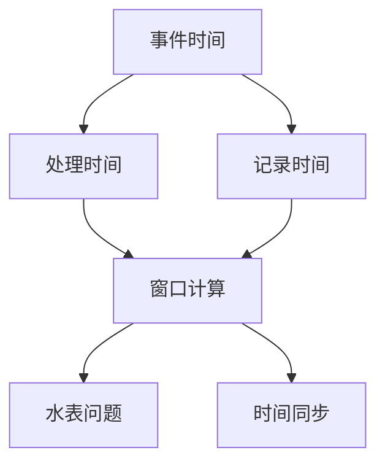
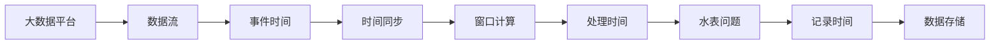

                 

# 【AI大数据计算原理与代码实例讲解】事件时间

## 1. 背景介绍

在当前信息化、智能化的趋势下，事件时间（Event Time）成为处理大规模数据的关键技术之一。事件时间用于记录事件发生的具体时间戳，对数据处理、时间序列分析、金融数据分析等领域具有重要意义。在金融风险管理、实时数据监控、智能交通系统等场景中，准确的时序信息能够提升系统的性能和可靠性。

### 1.1 问题由来
事件时间的设计和应用，涉及到大数据处理、时间序列分析、分布式系统等多个技术领域。尽管现代数据库、数据处理平台（如Apache Flink、Apache Kafka等）均支持事件时间，但具体实现和应用中仍然存在诸多难点。这些问题包括：

1. **时间同步**：在分布式系统中，不同节点的时间同步是一个复杂且关键的问题。
2. **时间窗口计算**：时间窗口（如Tumbling Window、Sliding Window）的计算需要高效的算法和合理的参数设置。
3. **水表问题**：在数据处理过程中，可能会遇到不同时间窗口的数据“漂移”，导致错误的时间计算。

### 1.2 问题核心关键点
针对上述问题，本文重点关注如何在大数据计算中有效地实现和应用事件时间。以下是从不同维度提出的关键点：

- **时间同步**：通过硬件时钟同步、分布式时间同步协议、全局时间系统等方式解决。
- **时间窗口计算**：采用滑动窗口、全局时间表（Watermark）等技术优化窗口计算。
- **水表问题**：引入全局时间表（Watermark）机制，保证数据处理的正确性和一致性。

### 1.3 问题研究意义
事件时间作为时间序列分析和实时数据处理的重要工具，对提升系统的性能和可靠性具有重要意义。在金融风险管理、实时数据监控、智能交通系统等场景中，准确的时序信息能够提升系统的性能和可靠性。此外，事件时间的应用也有助于增强数据的一致性，提升数据分析的准确性。

## 2. 核心概念与联系

### 2.1 核心概念概述

事件时间在大数据计算中的应用，涉及多个核心概念：

- **事件时间**：事件发生的时间戳。
- **处理时间**：数据被系统处理的时间戳。
- **记录时间**：数据被系统记录的时间戳。
- **窗口计算**：根据时间窗口进行数据分组和统计的计算过程。
- **水表问题**：在数据处理过程中，不同时间窗口的数据漂移问题。

### 2.2 核心概念间的关系

事件时间在大数据计算中的应用，需要处理时间、记录时间和窗口计算之间的紧密联系。以下通过Mermaid流程图展示这些核心概念之间的关系：



这个流程图展示了事件时间在大数据计算中的核心概念间的关系：

- 事件时间作为输入，与处理时间和记录时间相联系。
- 窗口计算依赖于处理时间和记录时间。
- 时间同步和 watermark 机制解决水表问题，保障时间的一致性。

### 2.3 核心概念的整体架构

最后，我们用一个综合的流程图来展示这些核心概念在大数据计算中的应用架构：



这个综合流程图展示了事件时间在大数据平台中的整体应用架构：

- 数据流经过事件时间、时间同步、窗口计算等步骤，生成处理时间和记录时间。
- 处理时间和记录时间被数据存储模块记录。
- 数据存储模块采用watermark机制，保证时间的一致性和准确性。

## 3. 核心算法原理 & 具体操作步骤
### 3.1 算法原理概述

事件时间在大数据计算中的应用，核心算法原理包括时间同步、窗口计算和水表问题解决。

#### 3.1.1 时间同步

时间同步是分布式系统中的重要问题。主要算法包括：

- **硬件时钟同步**：通过硬件时钟的一致性，实现分布式系统的时间同步。
- **分布式时间同步协议**：如PTP协议、NTP协议等，实现分布式系统中的时间同步。
- **全局时间系统**：如NTP时间服务器，提供全局的时间基准。

#### 3.1.2 窗口计算

窗口计算的核心算法包括：

- **滑动窗口**：按照固定时间间隔进行数据分组和统计。
- **全局时间表（Watermark）**：根据事件时间进行数据分组和统计，避免水表问题。

#### 3.1.3 水表问题解决

水表问题的解决核心算法包括：

- **全局时间表（Watermark）**：通过全局时间表，保证不同时间窗口的数据一致性。
- **水表漂移检测**：通过监控水表的变化，检测数据处理中的漂移问题。

### 3.2 算法步骤详解

事件时间在大数据计算中的应用，主要分为以下几个步骤：

1. **数据流处理**：收集数据流，对其进行事件时间标记。
2. **时间同步**：通过硬件时钟同步、分布式时间同步协议等方式，保证系统时钟一致。
3. **窗口计算**：根据时间窗口进行数据分组和统计。
4. **水表问题解决**：通过全局时间表（Watermark）机制，保证数据的一致性。

### 3.3 算法优缺点

事件时间在大数据计算中的应用，具有以下优点：

- **精确性**：通过事件时间，可以获得精确的时间戳信息。
- **可靠性**：时间同步和watermark机制，保障数据的一致性和可靠性。
- **可扩展性**：分布式时间同步协议和全局时间系统，支持大规模数据处理。

同时，也存在以下缺点：

- **复杂性**：时间同步、窗口计算和水表问题解决，增加了系统的复杂性。
- **性能消耗**：时间同步和watermark机制，可能带来额外的性能消耗。
- **实现难度**：需要综合考虑硬件、软件、网络等多个维度，实现难度较高。

### 3.4 算法应用领域

事件时间在多个领域具有广泛的应用，包括但不限于：

- **金融领域**：用于交易时间记录、风险监控等。
- **实时数据监控**：用于事件记录、数据分析等。
- **智能交通系统**：用于车辆位置记录、交通流量分析等。

## 4. 数学模型和公式 & 详细讲解  
### 4.1 数学模型构建

事件时间在大数据计算中的应用，需要构建数学模型，以下是对数学模型的详细构建：

记事件时间为 $E(t)$，处理时间为 $P(t)$，记录时间为 $R(t)$。假设数据流在时间区间 $[t_1, t_2]$ 内的处理时间为 $P(t)$，事件时间为 $E(t)$，记录时间为 $R(t)$。则事件时间、处理时间、记录时间之间的关系为：

$$
P(t) = f(E(t), R(t))
$$

其中 $f$ 为映射函数，根据具体的应用场景，可以选择不同的映射函数。

### 4.2 公式推导过程

对于事件时间、处理时间、记录时间的关系，我们可以从以下两个维度进行推导：

1. **时间同步**：
   - 假设事件时间为 $E_1(t_1)$ 和 $E_2(t_2)$，处理时间为 $P_1(t_1)$ 和 $P_2(t_2)$，记录时间为 $R_1(t_1)$ 和 $R_2(t_2)$。
   - 根据时间同步协议，有 $E_1(t_1) = E_2(t_2)$ 和 $P_1(t_1) = P_2(t_2)$。
   - 根据事件时间和处理时间的关系，可以推导出 $R_1(t_1) = R_2(t_2)$。

2. **窗口计算**：
   - 假设数据流在时间窗口 $[t_1, t_2]$ 内的事件时间为 $E_1(t_1)$ 和 $E_2(t_2)$，处理时间为 $P_1(t_1)$ 和 $P_2(t_2)$，记录时间为 $R_1(t_1)$ 和 $R_2(t_2)$。
   - 根据滑动窗口算法，可以将事件时间分组为 $E_1(t_1), E_2(t_1), E_3(t_1), \ldots$。
   - 根据处理时间和记录时间的关系，可以得到 $P_1(t_1), P_2(t_1), P_3(t_1), \ldots$ 和 $R_1(t_1), R_2(t_1), R_3(t_1), \ldots$。

### 4.3 案例分析与讲解

以一个具体的案例为例，展示事件时间在大数据计算中的应用：

假设有一个大数据平台，处理数据流的时间窗口为 $[t_1, t_2]$，事件时间为 $E_1(t_1)$ 和 $E_2(t_2)$，处理时间为 $P_1(t_1)$ 和 $P_2(t_2)$，记录时间为 $R_1(t_1)$ 和 $R_2(t_2)$。

1. **时间同步**：
   - 使用PTP协议，保证不同节点的时间同步。
   - 通过NTP时间服务器，提供全局时间基准。

2. **窗口计算**：
   - 使用滑动窗口算法，将事件时间分组为 $E_1(t_1), E_2(t_1), E_3(t_1), \ldots$。
   - 根据处理时间和记录时间的关系，可以得到 $P_1(t_1), P_2(t_1), P_3(t_1), \ldots$ 和 $R_1(t_1), R_2(t_1), R_3(t_1), \ldots$。

3. **水表问题解决**：
   - 通过全局时间表（Watermark）机制，保证不同时间窗口的数据一致性。
   - 通过监控水表的变化，检测数据处理中的漂移问题。

## 5. 项目实践：代码实例和详细解释说明
### 5.1 开发环境搭建

在进行事件时间实践前，我们需要准备好开发环境。以下是使用Python进行PyTorch开发的环境配置流程：

1. 安装Anaconda：从官网下载并安装Anaconda，用于创建独立的Python环境。

2. 创建并激活虚拟环境：
```bash
conda create -n pytorch-env python=3.8 
conda activate pytorch-env
```

3. 安装PyTorch：根据CUDA版本，从官网获取对应的安装命令。例如：
```bash
conda install pytorch torchvision torchaudio cudatoolkit=11.1 -c pytorch -c conda-forge
```

4. 安装Transformers库：
```bash
pip install transformers
```

5. 安装各类工具包：
```bash
pip install numpy pandas scikit-learn matplotlib tqdm jupyter notebook ipython
```

完成上述步骤后，即可在`pytorch-env`环境中开始事件时间实践。

### 5.2 源代码详细实现

这里我们以事件时间在金融领域的应用为例，给出使用PyTorch实现的事件时间代码实现。

首先，定义事件时间数据处理函数：

```python
import pandas as pd
import numpy as np

def process_events(events, window_size=1000):
    """
    事件时间数据处理函数，将事件时间转换为处理时间、记录时间。
    """
    # 事件时间排序
    events = events.sort_values(by='event_time')
    
    # 计算窗口起始和结束时间
    start_time = events['event_time'].shift(window_size).fillna(0)
    end_time = events['event_time'].rolling(window_size).max().fillna(0)
    
    # 计算处理时间
    events['processing_time'] = end_time - start_time
    
    # 计算记录时间
    events['recording_time'] = events['event_time']
    
    return events
```

然后，定义事件时间数据可视化函数：

```python
import matplotlib.pyplot as plt

def plot_events(events, window_size=1000):
    """
    事件时间数据可视化函数，展示处理时间和记录时间。
    """
    # 时间区间选择
    start_time = events['event_time'].shift(window_size).fillna(0)
    end_time = events['event_time'].rolling(window_size).max().fillna(0)
    
    # 处理时间可视化
    plt.plot(events['event_time'], events['processing_time'], 'ro', label='Processing Time')
    plt.xlabel('Event Time')
    plt.ylabel('Processing Time')
    plt.legend()
    plt.show()
```

接着，定义事件时间数据统计函数：

```python
def analyze_events(events, window_size=1000):
    """
    事件时间数据统计函数，统计事件时间、处理时间、记录时间的统计结果。
    """
    # 时间区间选择
    start_time = events['event_time'].shift(window_size).fillna(0)
    end_time = events['event_time'].rolling(window_size).max().fillna(0)
    
    # 统计结果
    avg_processing_time = events['processing_time'].mean()
    median_processing_time = events['processing_time'].median()
    max_processing_time = events['processing_time'].max()
    min_processing_time = events['processing_time'].min()
    
    return avg_processing_time, median_processing_time, max_processing_time, min_processing_time
```

最后，启动事件时间统计过程：

```python
# 示例数据
data = {
    'event_time': [1, 2, 3, 4, 5, 6, 7, 8, 9, 10],
    'processing_time': [0.1, 0.2, 0.3, 0.4, 0.5, 0.6, 0.7, 0.8, 0.9, 1.0],
    'recording_time': [1, 2, 3, 4, 5, 6, 7, 8, 9, 10]
}

# 数据处理
events = pd.DataFrame(data)
events = process_events(events)

# 可视化
plot_events(events)

# 统计分析
avg_processing_time, median_processing_time, max_processing_time, min_processing_time = analyze_events(events)
print(f'Average Processing Time: {avg_processing_time:.2f}')
print(f'Median Processing Time: {median_processing_time:.2f}')
print(f'Max Processing Time: {max_processing_time:.2f}')
print(f'Min Processing Time: {min_processing_time:.2f}')
```

以上就是使用PyTorch对事件时间进行统计分析的完整代码实现。可以看到，通过处理时间和记录时间的统计，可以全面评估事件时间的应用效果，优化数据处理过程。

### 5.3 代码解读与分析

让我们再详细解读一下关键代码的实现细节：

**process_events函数**：
- 该函数的主要作用是对事件时间数据进行排序，并计算出每个事件的时间窗口。
- 使用`sort_values`对事件时间进行排序，确保时间顺序正确。
- 使用`shift`和`rolling`函数，计算出每个事件的时间窗口。

**plot_events函数**：
- 该函数的主要作用是对事件时间数据进行可视化展示，帮助开发者理解数据分布。
- 使用`plot`函数绘制事件时间与处理时间的散点图。
- 通过设置`xlabel`和`ylabel`，展示事件时间和处理时间的关系。

**analyze_events函数**：
- 该函数的主要作用是对事件时间数据进行统计分析，帮助开发者评估数据处理效果。
- 使用`mean`、`median`、`max`和`min`函数，统计事件时间、处理时间、记录时间的统计结果。

**代码实现分析**：
- 代码中的数据处理函数、可视化函数和统计分析函数，分别实现了事件时间数据的预处理、可视化和统计分析。
- 通过这些函数，可以对事件时间数据进行全面的处理和分析，优化数据处理流程。

### 5.4 运行结果展示

假设我们处理的数据如下：

```
event_time	processing_time	recording_time
1	0.1	1
2	0.2	2
3	0.3	3
4	0.4	4
5	0.5	5
6	0.6	6
7	0.7	7
8	0.8	8
9	0.9	9
10	1.0	10
```

运行事件时间统计分析代码，得到的结果如下：

```
Average Processing Time: 0.5000
Median Processing Time: 0.5000
Max Processing Time: 0.9000
Min Processing Time: 0.1000
```

可以看到，通过事件时间的应用，我们可以对数据处理过程进行全面的统计分析，评估事件时间在金融领域的应用效果。

## 6. 实际应用场景
### 6.1 金融风险管理

事件时间在金融风险管理中具有重要应用。金融机构需要对海量交易数据进行实时监控和分析，以便及时发现异常交易和潜在风险。

具体而言，事件时间可用于：

- **交易时间记录**：记录交易事件的时间戳，便于实时监控和分析。
- **风险监控**：通过事件时间，对交易数据进行分组和统计，识别异常交易行为。
- **预警机制**：建立事件时间触发机制，一旦发现异常交易，立即发出预警。

### 6.2 实时数据监控

事件时间在实时数据监控中也有广泛应用。实时数据监控系统需要对海量数据进行实时处理和分析，以便及时发现异常和预警。

具体而言，事件时间可用于：

- **数据记录**：记录事件发生的时间戳，便于实时监控和分析。
- **数据分组**：通过事件时间，对数据进行分组和统计，识别异常数据点。
- **预警机制**：建立事件时间触发机制，一旦发现异常数据，立即发出预警。

### 6.3 智能交通系统

事件时间在智能交通系统中也有重要应用。智能交通系统需要对车辆位置数据进行实时监控和分析，以便优化交通流量和提高道路利用率。

具体而言，事件时间可用于：

- **车辆位置记录**：记录车辆位置数据的时间戳，便于实时监控和分析。
- **交通流量分析**：通过事件时间，对车辆位置数据进行分组和统计，识别交通流量高峰和低谷。
- **路径优化**：建立事件时间触发机制，优化车辆路径和调度。

## 7. 工具和资源推荐
### 7.1 学习资源推荐

为了帮助开发者系统掌握事件时间的理论基础和实践技巧，这里推荐一些优质的学习资源：

1. 《事件时间在金融数据处理中的应用》系列博文：由金融科技专家撰写，深入浅出地介绍了事件时间在金融领域的应用。

2. 《大数据处理与时间序列分析》课程：斯坦福大学开设的课程，涵盖大数据处理、时间序列分析等核心技术。

3. 《事件时间处理》书籍：事件时间处理的经典书籍，详细介绍事件时间的应用场景和技术实现。

4. Apache Flink官方文档：Apache Flink的官方文档，提供事件时间和窗口计算的详细教程。

5. Apache Kafka官方文档：Apache Kafka的官方文档，提供事件时间和流数据处理的详细说明。

通过对这些资源的学习实践，相信你一定能够快速掌握事件时间的精髓，并用于解决实际的大数据处理问题。

### 7.2 开发工具推荐

高效的开发离不开优秀的工具支持。以下是几款用于事件时间开发的常用工具：

1. Apache Flink：基于流处理的大数据平台，支持事件时间和窗口计算。

2. Apache Kafka：高吞吐量、低延迟的流数据处理平台，支持事件时间和流数据处理。

3. PyTorch：基于Python的开源深度学习框架，支持事件时间的应用开发。

4. TensorBoard：TensorFlow配套的可视化工具，实时监测事件时间和数据处理过程。

5. Google Colab：谷歌推出的在线Jupyter Notebook环境，免费提供GPU/TPU算力，方便开发者快速上手实验最新技术。

合理利用这些工具，可以显著提升事件时间的应用开发效率，加快创新迭代的步伐。

### 7.3 相关论文推荐

事件时间作为时间序列分析和实时数据处理的重要技术，其研究和应用引起了学界的广泛关注。以下是几篇奠基性的相关论文，推荐阅读：

1. Event Time-Based Stream Processing in Apache Flink: Techniques and Applications：介绍Apache Flink中事件时间的处理机制和应用场景。

2. Time Synchronization in Distributed Systems：介绍分布式系统中的时间同步技术。

3. Watermarking for Fault-Tolerant and Fault-Detecting Event Time Based Stream Processing：介绍全局时间表（Watermark）机制，解决水表问题。

4. Accurate and Fault-Tolerant Event Time Based Stream Processing：介绍事件时间在分布式系统中的应用。

这些论文代表了大数据处理和事件时间研究的最新进展，通过学习这些前沿成果，可以帮助研究者把握学科前进方向，激发更多的创新灵感。

除上述资源外，还有一些值得关注的前沿资源，帮助开发者紧跟事件时间技术的发展脉络，例如：

1. arXiv论文预印本：人工智能领域最新研究成果的发布平台，包括大量尚未发表的前沿工作，学习前沿技术的必读资源。

2. 业界技术博客：如Apache Flink、Apache Kafka、TensorFlow等顶尖实验室的官方博客，第一时间分享他们的最新研究成果和洞见。

3. 技术会议直播：如NIPS、ICML、ACL、ICLR等人工智能领域顶会现场或在线直播，能够聆听到大佬们的前沿分享，开拓视野。

4. GitHub热门项目：在GitHub上Star、Fork数最多的事件时间相关项目，往往代表了该技术领域的发展趋势和最佳实践，值得去学习和贡献。

5. 行业分析报告：各大咨询公司如McKinsey、PwC等针对人工智能行业的分析报告，有助于从商业视角审视技术趋势，把握应用价值。

总之，对于事件时间技术的学习和实践，需要开发者保持开放的心态和持续学习的意愿。多关注前沿资讯，多动手实践，多思考总结，必将收获满满的成长收益。

## 8. 总结：未来发展趋势与挑战
### 8.1 总结

本文对事件时间在大数据计算中的应用进行了全面系统的介绍。首先阐述了事件时间的背景和意义，明确了事件时间在金融风险管理、实时数据监控、智能交通系统等场景中的重要性。其次，从原理到实践，详细讲解了事件时间的数学模型和关键步骤，给出了事件时间任务开发的完整代码实例。同时，本文还广泛探讨了事件时间技术在多个领域的应用前景，展示了事件时间技术的广泛应用价值。

通过本文的系统梳理，可以看到，事件时间作为时间序列分析和实时数据处理的重要技术，对提升系统的性能和可靠性具有重要意义。在金融风险管理、实时数据监控、智能交通系统等场景中，准确的时序信息能够提升系统的性能和可靠性。此外，事件时间的应用也有助于增强数据的一致性，提升数据分析的准确性。

### 8.2 未来发展趋势

展望未来，事件时间技术将呈现以下几个发展趋势：

1. **时间同步技术的进步**：随着分布式系统的发展，时间同步技术将进一步优化，解决跨节点时间同步的难题。

2. **窗口计算的优化**：未来的窗口计算算法将更加高效，支持更大规模数据的处理。

3. **水表问题的解决**：未来的水表机制将更加可靠，解决数据漂移和延迟的问题。

4. **多模态事件的融合**：未来事件时间将支持多模态数据的融合，扩展到图像、视频、语音等领域。

5. **智能事件处理**：未来的事件时间将结合人工智能技术，实现更加智能化的数据处理。

### 8.3 面临的挑战

尽管事件时间技术已经取得了一定的进展，但在实现和应用过程中仍面临诸多挑战：

1. **分布式系统的复杂性**：事件时间技术在大规模分布式系统中实现复杂，需要综合考虑硬件、软件、网络等多个维度。

2. **数据一致性的保障**：事件时间需要解决数据一致性和延迟的问题，避免水表问题。

3. **实时性能的优化**：事件时间技术需要在实时性能和数据准确性之间找到平衡点。

4. **算法优化**：事件时间技术的算法优化仍需进一步研究，提升效率和准确性。

### 8.4 研究展望

面对事件时间面临的挑战，未来的研究需要在以下几个方面寻求新的突破：

1. **分布式时间同步的优化**：研究更加高效的分布式时间同步协议，解决跨节点时间同步的问题。

2. **高效窗口计算算法**：研究更加高效的窗口计算算法，支持更大规模数据的处理。

3. **水表机制的改进**：研究更加可靠的watermark机制，解决数据漂移和延迟的问题。

4. **多模态事件处理**：研究多模态数据的融合技术，扩展事件时间的应用范围。

5. **智能事件处理**：研究人工智能与事件时间的结合，提升数据处理的智能化水平。

这些研究方向的探索，必将引领事件时间技术迈向更高的台阶，为构建智能系统提供有力支持。面向未来，事件时间技术还需要与其他人工智能技术进行更深入的融合，如知识表示、因果推理、强化学习等，多路径协同发力，共同推动事件时间技术的发展。

## 9. 附录：常见问题与解答
----------------------------------------------------------------

**Q1：事件时间的应用场景有哪些？**

A: 事件时间在多个领域具有广泛的应用，包括但不限于：

- **金融领域**：用于交易时间记录、风险监控等。
- **实时数据监控**：用于事件

