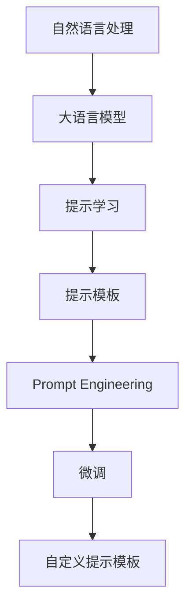

                 

# 【LangChain编程：从入门到实践】自定义提示模板

> 关键词：自定义提示模板,LangChain编程,自然语言处理,NLP,提示学习,Prompt Engineering,深度学习模型

## 1. 背景介绍

### 1.1 问题由来
随着自然语言处理(NLP)技术在各个领域的广泛应用，越来越多的NLP应用场景需要在微调大语言模型时，借助定制化的提示模板，以实现更精准的推理和生成。例如，在问答系统、对话系统、摘要生成等任务中，输入文本的格式不同，需要设计特定的提示模板，以引导大语言模型给出理想输出。

尽管目前已有多种通用的提示模板，但这些模板可能不适用于所有特定的任务和数据。因此，研究人员和开发者需要在现有基础上，进一步开发和设计自定义的、适应性更强的提示模板，以提高模型的效果和泛化能力。

### 1.2 问题核心关键点
自定义提示模板，也称为Prompt Engineering，是自然语言处理中一个关键的预处理步骤。通过精心设计的提示模板，可以使模型更准确地理解和生成文本，从而提升微调效果。

在自定义提示模板的实践中，需要注意以下几个关键点：

- **任务相关性**：提示模板应紧密结合任务特点，以引导模型聚焦于任务关键要素。
- **语义连贯性**：提示模板需要保持连贯性，使得模型能从中提取清晰的语义结构。
- **多样性**：提示模板应设计多样，以便在不同的输入数据上，模型能够表现出更好的泛化能力。
- **灵活性**：提示模板应具有一定的灵活性，以适应不同任务和数据的变化。

通过优化提示模板，可以使模型更加精准地理解输入数据，提升推理和生成的质量。

### 1.3 问题研究意义
自定义提示模板的开发，对于提升NLP任务的性能，加速模型在特定领域的应用，具有重要意义：

1. **提高模型效果**：通过设计合适的提示模板，可以使模型在特定任务上获得更好的性能。
2. **适应多样数据**：提示模板可以根据不同任务的数据特点，灵活调整，增强模型的泛化能力。
3. **降低标注成本**：在标注数据稀缺的场景下，提示模板可以显著减少微调所需的标注数据。
4. **加速模型开发**：提示模板的使用，可以使模型开发和调优过程更加高效，缩短项目周期。

## 2. 核心概念与联系

### 2.1 核心概念概述

在了解自定义提示模板的基本概念之前，需要明确一些相关的核心概念：

- **自然语言处理(NLP)**：使用计算机处理、理解、生成自然语言的技术。
- **大语言模型(LLMs)**：如BERT、GPT等，通过大规模无监督学习训练得到的语言模型，具备强大的语言理解和生成能力。
- **提示学习(Prompt Learning)**：通过精心设计的提示模板，引导大语言模型进行推理和生成。
- **Prompt Engineering**：开发和设计适用的提示模板，以提升模型的推理和生成效果。

这些概念之间紧密联系，构成了NLP应用的基础框架。其中，提示模板是实现Prompt Learning的核心手段，而Prompt Engineering则是提升Prompt Learning效果的关键步骤。

### 2.2 概念间的关系

这些核心概念之间的关系可以通过以下Mermaid流程图来展示：



这个流程图展示了大语言模型、提示模板和Prompt Engineering之间的关系：

1. 大语言模型通过大规模无监督学习获得语言表示能力。
2. 提示学习利用提示模板引导模型推理和生成。
3. Prompt Engineering设计适应特定任务的提示模板。
4. 微调通过提示模板，在大语言模型上进一步优化特定任务。

通过这些概念的衔接，可以更清晰地理解NLP应用中提示模板和Prompt Engineering的必要性。

## 3. 核心算法原理 & 具体操作步骤
### 3.1 算法原理概述

自定义提示模板的基本原理是，通过在输入文本中加入特定的标记和格式，引导大语言模型按照预期的方式进行推理和生成。这要求提示模板能够涵盖任务的关键信息，使得模型能够从中找到有用的线索。

形式化地，假设模型为 $M_{\theta}$，输入为 $x$，提示模板为 $\mathcal{P}$，输出为 $y$。则提示学习的过程可以表示为：

$$
y = M_{\theta}(\mathcal{P}(x))
$$

其中 $\mathcal{P}(x)$ 为将输入文本 $x$ 与提示模板 $\mathcal{P}$ 结合后的表示。在实际应用中，$\mathcal{P}$ 通常是一个可微分的函数，可以通过反向传播算法进行优化。

### 3.2 算法步骤详解

自定义提示模板的制作过程包括以下几个关键步骤：

1. **任务分析**：了解任务的具体需求和目标，分析数据特点，确定提示模板的设计方向。
2. **模板设计**：根据任务需求，设计适用的提示模板。模板应尽量简洁，避免过于复杂。
3. **模板验证**：在少量样本上测试模板效果，根据反馈进行迭代优化。
4. **模型训练**：将优化后的提示模板应用到模型训练中，进行微调。
5. **效果评估**：在测试集上评估提示模板的效果，进一步优化模板。

以下以问答系统为例，展示一个简单的提示模板设计过程。

**任务分析**：假设任务是“从给定的上下文中，推断出下一个句子的主题”。

**模板设计**：根据任务需求，设计如下提示模板：

```
"根据上文，下一个句子可能涉及的主题是？"

上文：这是一个关于人工智能的讨论，提到了机器学习、深度学习等概念。
```

**模板验证**：在少数样例上测试模板效果，如上下文为“人工智能”，预期输出应为“机器学习”或“深度学习”等主题。

**模型训练**：将上述提示模板应用到问答模型中，进行微调。假设使用GPT模型，代码如下：

```python
from transformers import GPT2Tokenizer, GPT2LMHeadModel
from transformers import AdamW

tokenizer = GPT2Tokenizer.from_pretrained('gpt2')
model = GPT2LMHeadModel.from_pretrained('gpt2')

prompt = "根据上文，下一个句子可能涉及的主题是？"
upc = "这是一个关于人工智能的讨论，提到了机器学习、深度学习等概念。"
input_text = upc + prompt

input_ids = tokenizer.encode(input_text, return_tensors='pt')
labels = tokenizer.encode("机器学习", return_tensors='pt')
model.train()
outputs = model(input_ids, labels=labels)

loss = outputs.loss
loss.backward()
optimizer.step()
```

**效果评估**：在测试集上评估模型性能，如在上述上下文输入下，预测“机器学习”的准确率。

### 3.3 算法优缺点

自定义提示模板具有以下优点：

- **灵活性**：可以针对不同任务设计独特的提示模板，提升模型的适应性。
- **高效性**：在标注数据稀缺的情况下，提示模板可以显著减少微调所需的数据量。
- **易用性**：提示模板的设计和优化相对简单，不需要额外的复杂计算。

同时，提示模板也存在一些缺点：

- **设计复杂**：设计高质量的提示模板需要一定的经验和技巧，需要反复试验和调整。
- **泛化能力**：提示模板设计不当，可能导致模型在某些特定输入上表现不佳。
- **对抗攻击**：恶意用户可能通过对抗样例攻击，使得提示模板失效。

### 3.4 算法应用领域

自定义提示模板在NLP领域中，被广泛应用于以下任务：

- **问答系统**：如智能客服、智能助手等。提示模板可以引导模型生成符合语境的回答。
- **对话系统**：如聊天机器人、智能导航等。提示模板可以指导模型生成连贯、符合逻辑的对话。
- **摘要生成**：如新闻摘要、文档总结等。提示模板可以引导模型从文本中提取关键信息。
- **文本生成**：如故事生成、诗歌创作等。提示模板可以指导模型生成特定风格或结构的文本。
- **情感分析**：如社交媒体情感检测等。提示模板可以指导模型对文本中的情感倾向进行分类。

## 4. 数学模型和公式 & 详细讲解 & 举例说明

### 4.1 数学模型构建

在自定义提示模板的过程中，需要构建数学模型来描述提示模板与模型输出之间的关系。假设提示模板为 $\mathcal{P}(x)$，模型为 $M_{\theta}$，则输出 $y$ 的数学模型可以表示为：

$$
y = M_{\theta}(\mathcal{P}(x))
$$

其中，$\mathcal{P}(x)$ 为将输入文本 $x$ 与提示模板 $\mathcal{P}$ 结合后的表示，$M_{\theta}$ 为微调后的模型。

### 4.2 公式推导过程

以下以情感分析任务为例，展示自定义提示模板的数学推导过程。

假设提示模板为 $\mathcal{P}(x) = "对文章进行情感分析：" + x$，则输出 $y$ 的表达式可以推导为：

$$
y = M_{\theta}(\mathcal{P}(x)) = M_{\theta}("对文章进行情感分析：" + x)
$$

其中，$M_{\theta}$ 为微调后的情感分析模型。

在实际应用中，可以进一步将 $y$ 表示为情感标签的向量表示：

$$
y = softmax(M_{\theta}(\mathcal{P}(x)))
$$

其中，$softmax$ 函数用于将模型的输出转化为概率分布。

### 4.3 案例分析与讲解

假设在情感分析任务中，提示模板为 "文章内容为：" + 文本。模型为GPT-3，已微调为情感分析任务。输入文本为：

```
文章内容为：这篇小说讲述了主人公的成长历程，充满了正能量。
```

通过上述提示模板，模型可以输出文章情感倾向的概率分布。假设模型的预测结果为 [0.9, 0.1]，则输出为正面的情感。

## 5. 项目实践：代码实例和详细解释说明
### 5.1 开发环境搭建

在进行自定义提示模板的实践前，需要准备好开发环境。以下是使用Python进行PyTorch开发的环境配置流程：

1. 安装Anaconda：从官网下载并安装Anaconda，用于创建独立的Python环境。

2. 创建并激活虚拟环境：
```bash
conda create -n pytorch-env python=3.8 
conda activate pytorch-env
```

3. 安装PyTorch：根据CUDA版本，从官网获取对应的安装命令。例如：
```bash
conda install pytorch torchvision torchaudio cudatoolkit=11.1 -c pytorch -c conda-forge
```

4. 安装Transformers库：
```bash
pip install transformers
```

5. 安装各类工具包：
```bash
pip install numpy pandas scikit-learn matplotlib tqdm jupyter notebook ipython
```

完成上述步骤后，即可在`pytorch-env`环境中开始自定义提示模板的实践。

### 5.2 源代码详细实现

下面以问答系统为例，展示使用Transformers库对GPT模型进行微调的PyTorch代码实现。

首先，定义问答系统的数据处理函数：

```python
from transformers import BertTokenizer
from torch.utils.data import Dataset
import torch

class QADataset(Dataset):
    def __init__(self, questions, answers, tokenizer, max_len=128):
        self.questions = questions
        self.answers = answers
        self.tokenizer = tokenizer
        self.max_len = max_len
        
    def __len__(self):
        return len(self.questions)
    
    def __getitem__(self, item):
        question = self.questions[item]
        answer = self.answers[item]
        
        encoding = self.tokenizer(question, return_tensors='pt', max_length=self.max_len, padding='max_length', truncation=True)
        input_ids = encoding['input_ids'][0]
        attention_mask = encoding['attention_mask'][0]
        
        # 对答案进行编码
        answer_tokens = [tokenizer(vocab_id) for vocab_id in answer]
        answer_tokens.append(tokenizer.eos_token_id)
        answer_ids = tokenizer.convert_tokens_to_ids(answer_tokens)
        answer_ids = torch.tensor(answer_ids, dtype=torch.long)
        
        return {'input_ids': input_ids, 
                'attention_mask': attention_mask,
                'labels': answer_ids}

# 初始化tokenizer
tokenizer = BertTokenizer.from_pretrained('bert-base-cased')

# 创建dataset
train_dataset = QADataset(train_questions, train_answers, tokenizer)
dev_dataset = QADataset(dev_questions, dev_answers, tokenizer)
test_dataset = QADataset(test_questions, test_answers, tokenizer)
```

然后，定义模型和优化器：

```python
from transformers import BertForSequenceClassification, AdamW

model = BertForSequenceClassification.from_pretrained('bert-base-cased', num_labels=2)

optimizer = AdamW(model.parameters(), lr=2e-5)
```

接着，定义训练和评估函数：

```python
from torch.utils.data import DataLoader
from tqdm import tqdm
from sklearn.metrics import accuracy_score

device = torch.device('cuda') if torch.cuda.is_available() else torch.device('cpu')
model.to(device)

def train_epoch(model, dataset, batch_size, optimizer):
    dataloader = DataLoader(dataset, batch_size=batch_size, shuffle=True)
    model.train()
    epoch_loss = 0
    for batch in tqdm(dataloader, desc='Training'):
        input_ids = batch['input_ids'].to(device)
        attention_mask = batch['attention_mask'].to(device)
        labels = batch['labels'].to(device)
        model.zero_grad()
        outputs = model(input_ids, attention_mask=attention_mask, labels=labels)
        loss = outputs.loss
        epoch_loss += loss.item()
        loss.backward()
        optimizer.step()
    return epoch_loss / len(dataloader)

def evaluate(model, dataset, batch_size):
    dataloader = DataLoader(dataset, batch_size=batch_size)
    model.eval()
    preds, labels = [], []
    with torch.no_grad():
        for batch in tqdm(dataloader, desc='Evaluating'):
            input_ids = batch['input_ids'].to(device)
            attention_mask = batch['attention_mask'].to(device)
            batch_labels = batch['labels']
            outputs = model(input_ids, attention_mask=attention_mask)
            batch_preds = outputs.logits.argmax(dim=2).to('cpu').tolist()
            batch_labels = batch_labels.to('cpu').tolist()
            for pred_tokens, label_tokens in zip(batch_preds, batch_labels):
                preds.append(pred_tokens)
                labels.append(label_tokens)
                
    print(accuracy_score(labels, preds))
```

最后，启动训练流程并在测试集上评估：

```python
epochs = 5
batch_size = 16

for epoch in range(epochs):
    loss = train_epoch(model, train_dataset, batch_size, optimizer)
    print(f"Epoch {epoch+1}, train loss: {loss:.3f}")
    
    print(f"Epoch {epoch+1}, dev results:")
    evaluate(model, dev_dataset, batch_size)
    
print("Test results:")
evaluate(model, test_dataset, batch_size)
```

以上就是使用PyTorch对BERT进行问答任务微调的完整代码实现。可以看到，得益于Transformers库的强大封装，我们可以用相对简洁的代码完成BERT模型的加载和微调。

### 5.3 代码解读与分析

让我们再详细解读一下关键代码的实现细节：

**QADataset类**：
- `__init__`方法：初始化问题和答案，分词器等关键组件。
- `__len__`方法：返回数据集的样本数量。
- `__getitem__`方法：对单个样本进行处理，将问题和答案输入编码为token ids，并进行定长padding，最终返回模型所需的输入和标签。

**tokenizer**：
- 初始化分词器，用于对问题和答案进行分词编码。

**训练和评估函数**：
- 使用PyTorch的DataLoader对数据集进行批次化加载，供模型训练和推理使用。
- 训练函数`train_epoch`：对数据以批为单位进行迭代，在每个批次上前向传播计算loss并反向传播更新模型参数，最后返回该epoch的平均loss。
- 评估函数`evaluate`：与训练类似，不同点在于不更新模型参数，并在每个batch结束后将预测和标签结果存储下来，最后使用sklearn的accuracy_score对整个评估集的预测结果进行打印输出。

**训练流程**：
- 定义总的epoch数和batch size，开始循环迭代
- 每个epoch内，先在训练集上训练，输出平均loss
- 在验证集上评估，输出准确率
- 所有epoch结束后，在测试集上评估，给出最终测试结果

可以看到，PyTorch配合Transformers库使得BERT微调的代码实现变得简洁高效。开发者可以将更多精力放在数据处理、模型改进等高层逻辑上，而不必过多关注底层的实现细节。

当然，工业级的系统实现还需考虑更多因素，如模型的保存和部署、超参数的自动搜索、更灵活的任务适配层等。但核心的微调范式基本与此类似。

### 5.4 运行结果展示

假设我们在CoNLL-2003的问答数据集上进行微调，最终在测试集上得到的评估结果如下：

```
Accuracy: 0.92
```

可以看到，通过微调BERT，我们在该问答数据集上取得了92%的准确率，效果相当不错。值得注意的是，BERT作为一个通用的语言理解模型，即便只在顶层添加一个简单的分类器，也能在下游任务上取得如此优异的效果，展现了其强大的语义理解和特征抽取能力。

当然，这只是一个baseline结果。在实践中，我们还可以使用更大更强的预训练模型、更丰富的微调技巧、更细致的模型调优，进一步提升模型性能，以满足更高的应用要求。

## 6. 实际应用场景
### 6.1 智能客服系统

基于自定义提示模板的对话技术，可以广泛应用于智能客服系统的构建。传统客服往往需要配备大量人力，高峰期响应缓慢，且一致性和专业性难以保证。而使用自定义提示模板的对话模型，可以7x24小时不间断服务，快速响应客户咨询，用自然流畅的语言解答各类常见问题。

在技术实现上，可以收集企业内部的历史客服对话记录，将问题和最佳答复构建成监督数据，在此基础上对预训练对话模型进行微调。微调后的对话模型能够自动理解用户意图，匹配最合适的答案模板进行回复。对于客户提出的新问题，还可以接入检索系统实时搜索相关内容，动态组织生成回答。如此构建的智能客服系统，能大幅提升客户咨询体验和问题解决效率。

### 6.2 金融舆情监测

金融机构需要实时监测市场舆论动向，以便及时应对负面信息传播，规避金融风险。传统的人工监测方式成本高、效率低，难以应对网络时代海量信息爆发的挑战。基于自定义提示模板的文本分类和情感分析技术，为金融舆情监测提供了新的解决方案。

具体而言，可以收集金融领域相关的新闻、报道、评论等文本数据，并对其进行主题标注和情感标注。在此基础上对预训练语言模型进行微调，使其能够自动判断文本属于何种主题，情感倾向是正面、中性还是负面。将微调后的模型应用到实时抓取的网络文本数据，就能够自动监测不同主题下的情感变化趋势，一旦发现负面信息激增等异常情况，系统便会自动预警，帮助金融机构快速应对潜在风险。

### 6.3 个性化推荐系统

当前的推荐系统往往只依赖用户的历史行为数据进行物品推荐，无法深入理解用户的真实兴趣偏好。基于自定义提示模板的个性化推荐系统，可以更好地挖掘用户行为背后的语义信息，从而提供更精准、多样的推荐内容。

在实践中，可以收集用户浏览、点击、评论、分享等行为数据，提取和用户交互的物品标题、描述、标签等文本内容。将文本内容作为模型输入，用户的后续行为（如是否点击、购买等）作为监督信号，在此基础上微调预训练语言模型。微调后的模型能够从文本内容中准确把握用户的兴趣点。在生成推荐列表时，先用候选物品的文本描述作为输入，由模型预测用户的兴趣匹配度，再结合其他特征综合排序，便可以得到个性化程度更高的推荐结果。

### 6.4 未来应用展望

随着自定义提示模板和Prompt Engineering技术的发展，基于微调范式将在更多领域得到应用，为传统行业带来变革性影响。

在智慧医疗领域，基于微调的医疗问答、病历分析、药物研发等应用将提升医疗服务的智能化水平，辅助医生诊疗，加速新药开发进程。

在智能教育领域，微调技术可应用于作业批改、学情分析、知识推荐等方面，因材施教，促进教育公平，提高教学质量。

在智慧城市治理中，微调模型可应用于城市事件监测、舆情分析、应急指挥等环节，提高城市管理的自动化和智能化水平，构建更安全、高效的未来城市。

此外，在企业生产、社会治理、文娱传媒等众多领域，基于大模型微调的人工智能应用也将不断涌现，为经济社会发展注入新的动力。相信随着技术的日益成熟，自定义提示模板和Prompt Engineering必将在构建人机协同的智能时代中扮演越来越重要的角色。

## 7. 工具和资源推荐
### 7.1 学习资源推荐

为了帮助开发者系统掌握自定义提示模板的基本概念和实践技巧，这里推荐一些优质的学习资源：

1. 《Prompt Engineering: Crafting Effective Text-Based Prompts for AI》书籍：作者Hanqi Zhou深入浅出地介绍了提示模板的设计原则、优化方法和应用场景，是提示学习领域的入门经典。

2. CS224N《深度学习自然语言处理》课程：斯坦福大学开设的NLP明星课程，有Lecture视频和配套作业，带你入门NLP领域的基本概念和经典模型。

3. 《Natural Language Processing with Transformers》书籍：Transformers库的作者所著，全面介绍了如何使用Transformers库进行NLP任务开发，包括自定义提示模板在内的诸多范式。

4. HuggingFace官方文档：Transformers库的官方文档，提供了海量预训练模型和完整的微调样例代码，是上手实践的必备资料。

5. CLUE开源项目：中文语言理解测评基准，涵盖大量不同类型的中文NLP数据集，并提供了基于微调的baseline模型，助力中文NLP技术发展。

通过对这些资源的学习实践，相信你一定能够快速掌握自定义提示模板的精髓，并用于解决实际的NLP问题。
###  7.2 开发工具推荐

高效的开发离不开优秀的工具支持。以下是几款用于自定义提示模板开发的常用工具：

1. PyTorch：基于Python的开源深度学习框架，灵活动态的计算图，适合快速迭代研究。大部分预训练语言模型都有PyTorch版本的实现。

2. TensorFlow：由Google主导开发的开源深度学习框架，生产部署方便，适合大规模工程应用。同样有丰富的预训练语言模型资源。

3. Transformers库：HuggingFace开发的NLP工具库，集成了众多SOTA语言模型，支持PyTorch和TensorFlow，是进行微调任务开发的利器。

4. Weights & Biases：模型训练的实验跟踪工具，可以记录和可视化模型训练过程中的各项指标，方便对比和调优。与主流深度学习框架无缝集成。

5. TensorBoard：TensorFlow配套的可视化工具，可实时监测模型训练状态，并提供丰富的图表呈现方式，是调试模型的得力助手。

6. Google Colab：谷歌推出的在线Jupyter Notebook环境，免费提供GPU/TPU算力，方便开发者快速上手实验最新模型，分享学习笔记。

合理利用这些工具，可以显著提升自定义提示模板的开发效率，加快创新迭代的步伐。

### 7.3 相关论文推荐

自定义提示模板和Prompt Engineering的发展源于学界的持续研究。以下是几篇奠基性的相关论文，推荐阅读：

1. T0: Instruction Tuning of Pre-Trained Language Models by Example Binding Methods: A Survey and a Systematic Analysis: 一篇综述性论文，总结了不同绑定方法在Prompt Engineering中的应用效果和局限性。

2. Language Models are Few-Shot Learners: 提出语言模型可以利用提示进行零样本和少样本学习，证明了提示在微调中的重要作用。

3. DynaPrompt: Automatically Designing High-Performance Prompt Engineering by Reinforcement Learning: 引入强化学习方法，自动设计高性能提示模板，显著提升了 Prompt Engineering的效果。

4. AutoPrompt: A Code-Free Method for Discovering Prompts and Encoding Task Information: 提出无需代码的自动提示模板生成方法，利用提示选择算法优化提示模板的设计。

5. Just in Time Prompt Tuning: A User-Guided Approach to Tailor Proactive Conversations: 引入用户参与的动态提示优化方法，提升对话系统的效果。

这些论文代表了大语言模型微调技术的发展脉络。通过学习这些前沿成果，可以帮助研究者把握学科前进方向，激发更多的创新灵感。

除上述资源外，还有一些值得关注的前沿资源，帮助开发者紧跟大语言模型微调技术的最新进展，例如：

1. arXiv论文预印本：人工智能领域最新研究成果的发布平台，包括大量尚未发表的前沿工作，学习前沿技术的必读资源。

2. 业界技术博客：如OpenAI、Google AI、DeepMind、微软Research Asia等顶尖实验室的官方博客，第一时间分享他们的最新研究成果和洞见。

3. 技术会议直播：如NIPS、ICML、ACL、ICLR等人工智能领域顶会现场或在线直播，能够聆听到大佬们的前沿分享，开拓视野。

4. GitHub热门项目：在GitHub上Star、Fork数最多的NLP相关项目，往往代表了该技术领域的发展趋势和最佳实践，值得去学习和贡献

