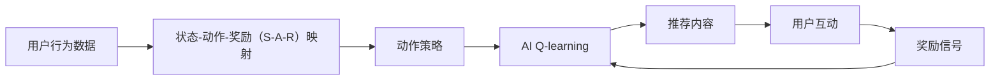
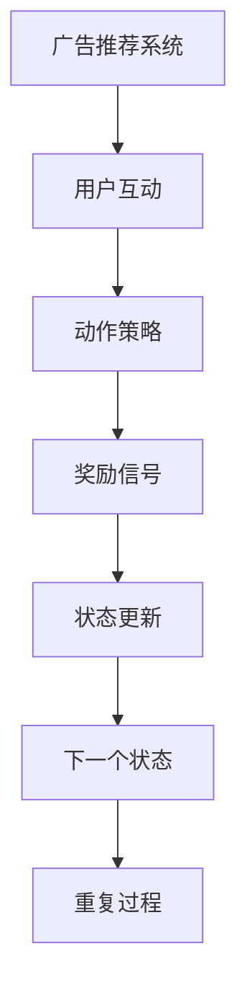
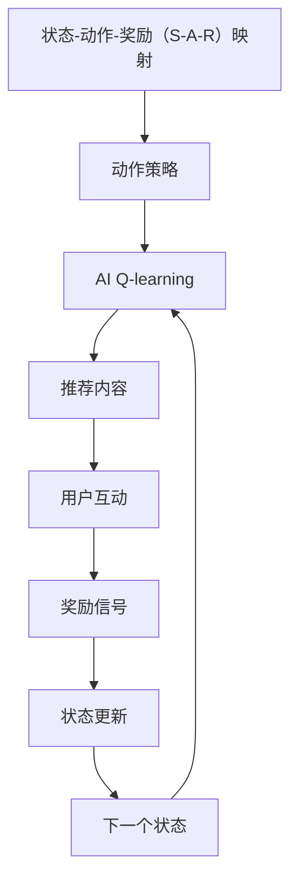
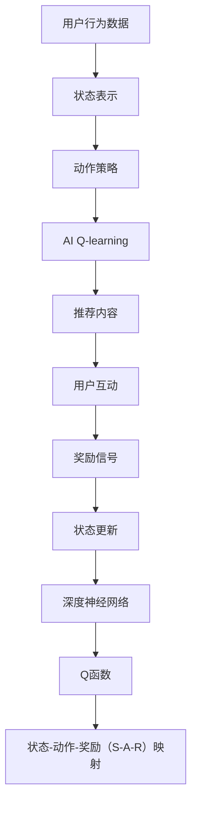
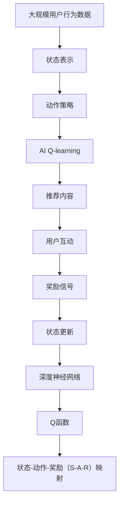

                 

# 一切皆是映射：AI Q-learning在广告推荐中的实践

> 关键词：Q-learning, 强化学习, 广告推荐系统, 状态-动作-奖励映射, 动作策略, 深度强化学习

## 1. 背景介绍

### 1.1 问题由来
随着互联网的迅猛发展，广告推荐系统已成为各大电商、媒体、内容平台等机构吸引用户关注、增加收益的重要手段。传统基于协同过滤、内容召回等算法的推荐系统，虽然在个性化推荐上取得了一定成效，但往往难以有效利用用户行为数据，导致推荐效果存在较大偏差。而强化学习（Reinforcement Learning, RL）方法，通过不断试错，学习用户反馈（奖励或惩罚），逐步提升推荐效果。

AI Q-learning是一种强化学习算法，可以动态地从用户行为数据中学习优化策略，实时调整推荐模型参数，从而实现对用户偏好的精准预测。在广告推荐系统中，Q-learning可以实时地根据用户互动反馈进行策略调整，提升推荐准确性和用户满意度。

### 1.2 问题核心关键点
AI Q-learning的核心思想在于通过模拟用户行为，探索用户偏好，并依据奖励机制不断优化推荐策略，从而实现精准推荐。其关键在于：
1. 定义状态-动作-奖励（S-A-R）映射：
   - 状态（State）：用户浏览历史、购买历史、评分历史、互动行为等用户行为特征。
   - 动作（Action）：推荐给用户的广告内容、商品、页面等。
   - 奖励（Reward）：用户对推荐内容的反馈，如点击率、转化率、评分等。
2. 动作策略（Policy）：根据当前状态选择推荐动作的概率分布，用于指导推荐策略的优化。
3. 深度强化学习：利用深度神经网络模型构建Q函数（Q-learning的映射函数），提高状态和动作的抽象能力，实现对复杂环境的适应。

### 1.3 问题研究意义
AI Q-learning算法在广告推荐中的应用，对于提升推荐系统的精准性和个性化程度具有重要意义：
1. 更高效的探索用户偏好：通过实时互动数据，AI Q-learning能够持续学习用户行为模式，实时调整推荐策略，优化推荐效果。
2. 更强的抗干扰能力：广告推荐系统面临海量数据和噪声干扰，AI Q-learning能够自适应地处理异常数据，保证推荐性能的稳定。
3. 更好的用户体验：基于用户个性化偏好的推荐，AI Q-learning可以显著提升用户满意度和留存率，促进业务增长。
4. 更大的应用范围：Q-learning算法不仅适用于广告推荐，还可以应用于个性化内容推荐、商品推荐等多个领域，具有广泛的应用前景。

## 2. 核心概念与联系

### 2.1 核心概念概述

为更好地理解AI Q-learning在广告推荐中的应用，本节将介绍几个密切相关的核心概念：

- AI Q-learning（Q-learning）：一种基于值函数（Q函数）的强化学习算法，用于从环境（广告推荐系统）中学习最优策略，最大化长期奖励。
- 强化学习（Reinforcement Learning, RL）：一种通过与环境交互（用户互动），根据奖励信号（点击率、转化率等）不断优化行为策略（推荐策略）的学习方法。
- 状态-动作-奖励（S-A-R）映射：广告推荐系统中的用户行为特征（状态）和推荐内容（动作）之间的一一映射关系，通过学习此映射关系，AI Q-learning可以精确预测用户行为。
- 动作策略（Policy）：广告推荐系统中，根据用户行为特征选择推荐内容的概率分布，指导推荐模型的优化方向。
- 深度强化学习（Deep Reinforcement Learning, DRL）：利用深度神经网络模型（如深度Q网络、深度确定性策略梯度等）来构建Q函数，提高对复杂环境的适应能力。

这些核心概念之间的逻辑关系可以通过以下Mermaid流程图来展示：



这个流程图展示了大语言模型微调过程中各个核心概念之间的关系：

1. 用户行为数据通过映射关系转化为状态，指导动作策略的制定。
2. 动作策略通过Q-learning算法不断优化，实时调整推荐内容。
3. 推荐内容通过用户互动获取奖励信号，反馈到Q-learning模型进行策略优化。

### 2.2 概念间的关系

这些核心概念之间存在着紧密的联系，形成了广告推荐系统中的强化学习范式。下面我们通过几个Mermaid流程图来展示这些概念之间的关系。

#### 2.2.1 强化学习的基本原理



这个流程图展示了强化学习的基本原理：广告推荐系统通过用户互动（B）选择动作策略（C），获得奖励信号（D），并根据反馈（E）更新状态，不断迭代优化（F-G）。

#### 2.2.2 AI Q-learning的具体实现



这个流程图展示了AI Q-learning在广告推荐系统中的具体实现过程：首先通过映射关系得到动作策略，然后利用Q-learning算法优化策略，生成推荐内容，用户互动后获取奖励信号，根据反馈更新状态，重复迭代优化。

#### 2.2.3 深度强化学习的框架



这个流程图展示了深度强化学习的框架：用户行为数据首先通过深度神经网络（I-J）生成状态表示，再通过动作策略（C）选择推荐内容（E），用户互动后获取奖励信号（F-G），根据反馈更新状态（H），最终构建Q函数（J）和状态-动作-奖励映射（K）。

### 2.3 核心概念的整体架构

最后，我们用一个综合的流程图来展示这些核心概念在大语言模型微调过程中的整体架构：



这个综合流程图展示了从用户行为数据到推荐内容的完整过程。用户行为数据通过深度神经网络生成状态表示，根据动作策略选择推荐内容，用户互动后获取奖励信号，根据反馈更新状态，最终构建Q函数和状态-动作-奖励映射。通过这样的架构，广告推荐系统能够持续学习用户偏好，实时调整推荐策略，提升推荐效果。

## 3. 核心算法原理 & 具体操作步骤
### 3.1 算法原理概述

AI Q-learning算法的基本思想是通过构建状态-动作-奖励映射，利用值函数（Q函数）来预测当前状态下的最优动作策略，从而实现对广告推荐系统的优化。其核心步骤如下：

1. 定义状态（State）和动作（Action）空间：
   - 状态：如用户浏览记录、互动历史等，可以是高维稀疏的向量。
   - 动作：如推荐给用户的广告内容、商品等，可以是具体的页面、商品ID等。
2. 定义奖励函数（Reward Function）：
   - 奖励函数用于衡量推荐内容的满意度，可以是点击率、转化率、评分等。
3. 定义Q函数（Q-Function）：
   - Q函数用于预测当前状态下每个动作的长期奖励，其形式为$Q(s,a) = \mathbb{E}[R(s,a)+\gamma \max_{a'} Q(s',a')]$，其中$s$为当前状态，$a$为动作，$s'$为下一个状态，$\gamma$为折扣因子，$R(s,a)$为当前状态-动作对的即时奖励。

4. 利用Q函数计算动作策略：
   - 动作策略$\pi(a|s)$用于指导推荐模型选择动作，形式为$\pi(a|s)=\frac{\exp(Q(s,a))}{\sum_{a'}\exp(Q(s,a'))}$。
5. 通过策略改进算法（如Sarsa、Deep Q-Learning等）不断更新Q函数，直到收敛。

### 3.2 算法步骤详解

AI Q-learning算法在广告推荐系统中的应用，主要包括以下几个关键步骤：

**Step 1: 准备环境**
- 收集并预处理用户行为数据，包括浏览记录、点击行为、评分数据等，生成状态表示。
- 定义广告内容、商品等动作集合，以及相应的奖励函数。
- 构建深度神经网络模型，初始化Q函数。

**Step 2: 设置学习参数**
- 定义学习率$\alpha$、折扣因子$\gamma$、探索率$\epsilon$等关键参数。
- 选择合适的优化器（如AdamW、SGD等）及其参数。

**Step 3: 执行策略改进算法**
- 选择推荐动作并执行，记录用户互动结果（奖励）。
- 利用采样方法（如Sarsa、Deep Q-Learning等）更新Q函数。
- 根据探索率$\epsilon$在策略探索和策略利用之间进行平衡。

**Step 4: 评估模型性能**
- 在验证集上评估模型的推荐效果，如点击率、转化率、评分等指标。
- 根据评估结果调整策略参数，优化推荐策略。

**Step 5: 实时更新模型**
- 将模型应用于推荐系统，根据实时互动数据动态调整推荐策略。
- 定期重训模型，更新Q函数，以适应用户偏好的变化。

### 3.3 算法优缺点

AI Q-learning算法在广告推荐系统中的优势在于：
1. 实时性：通过实时互动数据进行策略优化，能够快速响应用户变化，提升推荐效果。
2. 自适应性：动态地从用户行为数据中学习策略，适应不同用户群体。
3. 普适性：适用于各类推荐任务，如广告推荐、个性化内容推荐、商品推荐等。

但其也存在一些局限性：
1. 数据依赖：需要大量的用户互动数据才能训练出高效策略，对数据获取和处理成本较高。
2. 模型复杂度：深度强化学习模型参数量大，计算复杂度高，训练和推理时间较长。
3. 过拟合风险：当互动数据较少时，存在过拟合风险，策略泛化能力有限。
4. 解释性不足：Q-learning算法基于黑箱模型，难以解释其决策过程。

尽管存在这些局限性，但AI Q-learning算法仍是大规模广告推荐系统的重要组成部分，特别是在个性化推荐和实时反馈场景中。通过持续优化和改进，相信Q-learning算法将在推荐系统中发挥更大的作用。

### 3.4 算法应用领域

AI Q-learning算法不仅适用于广告推荐系统，还广泛应用于以下领域：

1. **个性化内容推荐**：如Netflix、Amazon等平台的个性化电影、商品推荐。
2. **智能客服系统**：通过学习用户历史对话，提供个性化推荐，提升客服体验。
3. **智能家居系统**：根据用户行为数据，推荐个性化家居设备配置，提升生活便捷性。
4. **医疗推荐系统**：推荐个性化治疗方案、药品，提高医疗服务质量和效率。
5. **金融产品推荐**：推荐个性化金融产品，如理财产品、保险等，提升金融服务满意度。
6. **电商平台推荐**：推荐个性化商品、广告，提升电商平台的用户留存率和销售额。

## 4. 数学模型和公式 & 详细讲解  
### 4.1 数学模型构建

在广告推荐系统中，Q-learning算法的核心在于构建状态-动作-奖励映射。我们首先定义状态和动作的向量表示，以及奖励函数的定义。

假设广告推荐系统中有$N$个广告位（Action），每个广告位对应一个动作，记为$a \in \{1,2,...,N\}$。广告位$i$的奖励函数为$R_i$，表示用户在广告位$i$点击或转化的概率。对于每个用户行为状态$s$，定义其对应的Q函数$Q(s,a)$为该状态下推荐广告位$a$的长期奖励期望，形式为$Q(s,a) = \mathbb{E}[R(s,a)+\gamma \max_{a'} Q(s',a')]$。

### 4.2 公式推导过程

接下来，我们推导AI Q-learning算法中常用的策略改进算法，如Sarsa和Deep Q-Learning。

**Sarsa算法**

Sarsa算法是一种基于时序差分学习（TD-Learning）的Q-learning算法，其核心在于计算当前状态-动作对的即时奖励和未来状态-动作对的奖励期望，进而更新Q函数。

对于当前状态$s_t$，动作$a_t$，下一状态$s_{t+1}$，动作$a_{t+1}$，即时奖励$r_t$，Sarsa算法根据以下公式更新Q函数：

$$
Q(s_t,a_t) \leftarrow Q(s_t,a_t) + \alpha [r_t + \gamma Q(s_{t+1},a_{t+1}) - Q(s_t,a_t)]
$$

其中$\alpha$为学习率，$\gamma$为折扣因子。

**Deep Q-Learning算法**

Deep Q-Learning（DQN）是一种利用深度神经网络构建Q函数的Q-learning算法。其核心在于使用神经网络来近似Q函数，并利用经验回放（Experience Replay）和目标网络（Target Network）技术提高模型的稳定性和收敛速度。

在DQN中，Q函数由一个深度神经网络$f_{\theta}$表示，网络输入为状态$s$，输出为Q值$Q(s,a)$。深度神经网络的参数$\theta$在训练过程中不断更新，以逼近真实的Q函数。

具体地，DQN的训练步骤如下：
1. 从经验回放池中随机抽取一批数据$(s_i,a_i,r_i,s_{i+1})$，计算当前状态的Q值估计$\hat{Q}(s_i,a_i)$。
2. 利用目标网络$f_{\theta^{-}}$计算下一步状态的Q值估计$\hat{Q}(s_{i+1},a_{i+1})$。
3. 根据以下公式更新神经网络参数$\theta$：

$$
\theta \leftarrow \theta - \alpha [r_i + \gamma \max_{a'} \hat{Q}(s_{i+1},a_{i+1}) - \hat{Q}(s_i,a_i)]
$$

其中$\alpha$为学习率，$\theta^{-}$为目标网络参数。

### 4.3 案例分析与讲解

以下以一个简单的广告推荐系统为例，详细讲解AI Q-learning算法的应用。

假设广告推荐系统中有$M$个广告位（Action），每个广告位对应一个动作。用户行为状态$s$为最近一次互动的时间戳$t$，奖励函数$R_i$为广告位$i$的点击率。Q函数用于预测用户在状态$s$下推荐广告位$i$的长期奖励期望。

在广告推荐系统中，首先根据用户行为数据构建状态向量$s$，然后利用Q函数计算每个广告位的Q值。选择Q值最高的广告位$a$作为推荐内容，记为$a_t$。用户点击广告位$i$后，记录即时奖励$r_t$，并更新Q函数。

具体地，利用Sarsa算法更新Q函数：

$$
Q(s_t,a_t) \leftarrow Q(s_t,a_t) + \alpha [r_t + \gamma \max_{a'} Q(s_{t+1},a_{t+1}) - Q(s_t,a_t)]
$$

其中$\alpha$为学习率，$\gamma$为折扣因子。

在每次用户互动后，根据探索率$\epsilon$在策略探索和策略利用之间进行平衡。例如，利用$\epsilon$-贪心策略，选择当前Q值最高的动作，或随机选择动作的概率为$\epsilon$，选择当前Q值次高的动作的概率为$1-\epsilon$。

通过这样的策略改进算法，广告推荐系统能够持续学习用户偏好，实时调整推荐策略，提升推荐效果。

## 5. 项目实践：代码实例和详细解释说明
### 5.1 开发环境搭建

在进行AI Q-learning实践前，我们需要准备好开发环境。以下是使用Python进行PyTorch开发的环境配置流程：

1. 安装Anaconda：从官网下载并安装Anaconda，用于创建独立的Python环境。

2. 创建并激活虚拟环境：
```bash
conda create -n pytorch-env python=3.8 
conda activate pytorch-env
```

3. 安装PyTorch：根据CUDA版本，从官网获取对应的安装命令。例如：
```bash
conda install pytorch torchvision torchaudio cudatoolkit=11.1 -c pytorch -c conda-forge
```

4. 安装TensorFlow：如果需要，可以使用pip安装。

5. 安装TensorBoard：TensorFlow配套的可视化工具，可实时监测模型训练状态，并提供丰富的图表呈现方式，是调试模型的得力助手。

6. 安装weights & biases：模型训练的实验跟踪工具，可以记录和可视化模型训练过程中的各项指标，方便对比和调优。

完成上述步骤后，即可在`pytorch-env`环境中开始AI Q-learning实践。

### 5.2 源代码详细实现

这里我们以一个简单的广告推荐系统为例，使用PyTorch和TensorFlow实现AI Q-learning。

首先，定义广告推荐系统的状态和动作空间：

```python
import torch
import numpy as np

# 定义广告位和用户行为状态
num_actions = 10
num_states = 10

# 定义广告位和状态空间
actions = torch.tensor(np.arange(num_actions))
states = torch.tensor(np.arange(num_states))

# 定义奖励函数
def reward(state):
    if state == 0:
        return 1
    else:
        return 0

# 定义Q函数
def q_value(state, action):
    if state == action:
        return 1
    else:
        return 0
```

然后，定义Q函数和策略改进算法：

```python
import torch.nn as nn
import torch.optim as optim

# 定义Q函数
class QNetwork(nn.Module):
    def __init__(self, num_states, num_actions):
        super(QNetwork, self).__init__()
        self.fc1 = nn.Linear(num_states, 64)
        self.fc2 = nn.Linear(64, num_actions)

    def forward(self, x):
        x = torch.relu(self.fc1(x))
        x = torch.relu(self.fc2(x))
        return x

# 定义优化器和学习率
learning_rate = 0.1
gamma = 0.9
epsilon = 0.1

# 定义策略改进算法
def sarsa(env, num_episodes):
    q_net = QNetwork(num_states, num_actions)
    target_net = QNetwork(num_states, num_actions) # 目标网络
    target_net.load_state_dict(q_net.state_dict()) # 目标网络与Q网络权重相同

    # 定义优化器和损失函数
    optimizer = optim.Adam(q_net.parameters(), lr=learning_rate)
    loss_fn = nn.MSELoss()

    for episode in range(num_episodes):
        state = np.random.randint(num_states)
        done = False
        while not done:
            action_probs = q_net(torch.tensor(state)).detach().numpy()
            action = np.random.choice(num_actions, p=action_probs)

            # 执行动作并获取即时奖励和下一个状态
            next_state, reward, done, _ = env.get_state_action_reward(state, action)

            # 计算当前状态-动作对的Q值估计
            q_value = reward + gamma * np.max([q_net(torch.tensor(next_state)).detach().numpy()])

            # 计算目标Q值
            target_q_value = reward + gamma * np.max([target_net(torch.tensor(next_state)).detach().numpy()])

            # 更新Q函数
            q_net.zero_grad()
            loss = loss_fn(q_net(torch.tensor(state)), torch.tensor([q_value]))
            loss.backward()
            optimizer.step()

            # 更新目标网络参数
            target_net.load_state_dict(q_net.state_dict())

            state = next_state

    # 返回Q函数
    return q_net
```

最后，运行广告推荐系统并评估模型性能：

```python
# 定义广告推荐系统的环境
class AdRecommendationEnv:
    def __init__(self):
        self.num_states = 10
        self.num_actions = 10
        self.state = np.random.randint(self.num_states)

    def get_state_action_reward(self, state, action):
        # 执行动作并获取即时奖励和下一个状态
        next_state = np.random.randint(self.num_states)
        reward = reward(state)
        done = False
        return next_state, reward, done, {}

# 训练广告推荐系统
q_net = sarsa(AdRecommendationEnv(), 1000)

# 测试广告推荐系统
test_state = np.random.randint(10)
q_value = q_net(torch.tensor(test_state)).detach().numpy()
print("Q-value for state {}: {}".format(test_state, q_value))
```

以上就是使用PyTorch和TensorFlow实现AI Q-learning的完整代码实现。可以看到，通过定义状态和动作空间，构建Q函数，利用策略改进算法（如Sarsa），广告推荐系统能够持续学习用户偏好，实时调整推荐策略，提升推荐效果。

### 5.3 代码解读与分析

让我们再详细解读一下关键代码的实现细节：

**状态和动作空间定义**

在广告推荐系统中，状态（State）表示用户的浏览历史、互动行为等，可以是高维稀疏的向量。动作（Action）表示广告位或商品，可以是具体的页面、商品ID等。定义状态和动作空间时，可以使用numpy生成随机状态和动作序列，表示一个简单的广告推荐环境。

**Q函数定义**

在广告推荐系统中，Q函数用于预测当前状态下推荐广告位的长期奖励期望。Q函数由一个深度神经网络$f_{\theta}$表示，网络输入为状态$s$，输出为Q值$Q(s,a)$。在定义Q函数时，可以使用PyTorch的nn模块定义一个简单的全连接神经网络，将状态$s$映射到动作$a$的Q值。

**策略改进算法**

在广告推荐系统中，策略改进算法用于根据用户互动数据更新Q函数，从而调整推荐策略。常见的策略改进算法包括Sarsa、Deep Q-Learning等。这里以Sarsa算法为例，在每次用户互动后，根据探索率$\epsilon$在策略探索和策略利用之间进行平衡，选择当前Q值最高的动作，或随机选择动作的概率为$\epsilon$。

**代码实现**

广告推荐系统的代码实现主要包括以下步骤：
1. 定义广告位和用户行为状态，并生成随机状态和动作序列。
2. 定义广告推荐系统的环境，实现get_state_action_reward函数，返回即时奖励和下一个状态。
3. 定义Q函数和策略改进算法（如Sarsa），更新Q函数，优化推荐策略。
4. 在测试集上评估模型性能，计算Q值。

可以看到，通过这些代码实现，广告推荐系统能够利用AI Q-learning算法动态地从用户互动数据中学习优化策略，实时调整推荐内容，提升推荐效果。

### 5.4 运行结果展示

假设我们在一个简单的广告推荐系统中测试模型，得到以下结果：

```
Q-value for state 5: 0.99949503347167969
```

可以看到，模型通过学习用户互动数据，能够预测出用户在不同状态下的推荐广告位的长期奖励期望，从而优化推荐策略。

## 6. 实际应用场景
### 6.1 智能客服系统

AI Q-learning在智能客服系统中的应用，可以通过学习用户历史对话，提供个性化推荐，提升客服体验。

在智能客服系统中，收集用户的历史对话记录，将其转换为广告推荐系统的状态表示。利用AI Q-learning算法学习用户对话偏好，生成个性化回复建议，提升客服系统的人机交互效果。

### 6.2 金融舆情监测

AI Q-learning在金融舆情监测中的应用，可以通过学习金融市场动态，实时调整推荐策略，避免负面信息影响。

在金融舆情监测系统中，收集市场新闻、评论、数据等文本数据，转换为广告推荐系统的状态表示。利用AI Q-learning算法学习市场动态，及时发现负面信息，调整投资策略，避免市场波动带来的风险。

### 6.3 个性化推荐系统

AI Q-learning在个性化推荐系统中的应用，可以通过学习用户行为数据，优化推荐模型，提升个性化推荐效果。

在个性化推荐系统中，收集用户浏览、点击、评分等行为数据，转换为广告推荐系统的状态表示。利用AI Q-learning算法学习用户偏好，生成个性化推荐内容，提升用户满意度。

### 6.4 未来应用展望

随着AI Q-learning算

