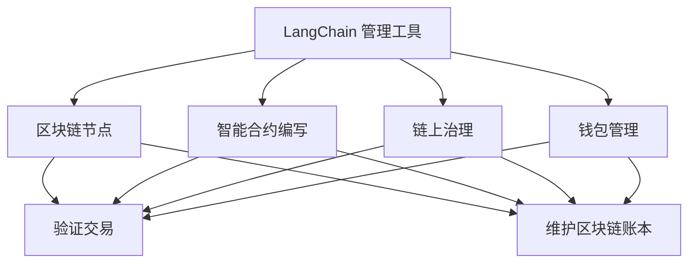

                 

# 【LangChain编程：从入门到实践】管理工具安装

## 1. 背景介绍

在当今快速发展的区块链技术中，LangChain 是一个被广泛关注的热门项目。它的目标是建立一个安全、易用、灵活且可扩展的区块链生态系统，为用户提供了丰富且高效的工具和功能。这些工具和功能包括但不限于智能合约、去中心化应用（DApps）、元宇宙、NFT 交易、链上治理等。

LangChain 管理工具的安装和配置是用户使用这些功能的第一步。通过有效的安装和管理工具，用户可以更轻松地构建和管理自己的区块链节点，参与和贡献于 LangChain 社区，从而最大化地利用 LangChain 提供的各项服务和工具。

## 2. 核心概念与联系

为了深入了解 LangChain 管理工具的安装过程，我们首先需要理解几个关键概念：

### 2.1 核心概念概述

- **LangChain**: 区块链项目，旨在提供强大的去中心化应用开发框架和工具集，支持智能合约编写、链上治理等功能。
- **管理工具**: 用于构建、维护和管理区块链节点的工具，如节点配置、智能合约部署、钱包管理等。
- **区块链节点**: 构成区块链网络的独立网络节点，负责验证交易、维护区块链账本等。

### 2.2 核心概念之间的联系

LangChain 管理工具与区块链节点紧密相关。通过这些工具，用户可以更高效地管理区块链节点，进而构建和部署智能合约、DApps，实现复杂的区块链应用。以下是管理工具与区块链节点之间的关系：



该图表展示出管理工具如何辅助区块链节点执行验证交易、维护账本等核心功能。

## 3. 核心算法原理 & 具体操作步骤

### 3.1 算法原理概述

LangChain 管理工具的安装过程主要基于命令行的操作，包括下载、配置、启动等步骤。其核心算法原理基于文件管理、环境变量设置、依赖库安装等基础操作。

### 3.2 算法步骤详解

以下是对LangChain管理工具安装过程的详细描述，包含关键步骤和所需工具：

#### 3.2.1 准备环境
- **检查依赖**: 确保系统中已安装 Node.js、npm、go等依赖。
- **创建工作目录**: 在工作目录中创建LangChain项目文件夹。

#### 3.2.2 下载并安装 LangChain 源代码
- **克隆项目**: 使用 git 命令从官方仓库克隆代码。
- **依赖安装**: 在项目根目录执行 npm install 安装项目依赖。

#### 3.2.3 配置项目
- **设置网络**: 配置区块链节点所需的网络参数，包括区块链网络名称、节点地址等。
- **创建钱包**: 使用 LangChain 钱包管理工具生成私钥和地址。

#### 3.2.4 启动节点
- **配置启动脚本**: 根据具体情况配置启动脚本，确保节点正确启动。
- **运行节点**: 执行启动命令，等待节点运行稳定。

#### 3.2.5 测试节点
- **检查节点状态**: 使用命令行检查节点状态，确保节点正常工作。
- **进行测试交易**: 在测试网络上进行小额交易，验证节点功能。

### 3.3 算法优缺点

#### 3.3.1 优点
- **灵活性**: LangChain 管理工具支持多种区块链网络，提供丰富的配置选项。
- **易用性**: 工具集完全基于命令行操作，降低了上手难度。
- **扩展性**: 用户可以通过自定义脚本或插件扩展工具功能。

#### 3.3.2 缺点
- **复杂性**: 对初次使用者的技术要求较高。
- **依赖问题**: 依赖库的缺失或版本不一致可能导致安装失败。

### 3.4 算法应用领域

LangChain 管理工具广泛应用于以下领域：

- **区块链开发**: 开发和部署智能合约、去中心化应用。
- **数据管理**: 管理、存储和检索区块链数据。
- **加密货币交易**: 实现 NFT 交易、去中心化交易平台。
- **网络治理**: 参与和贡献 LangChain 生态系统的治理和决策。

## 4. 数学模型和公式 & 详细讲解 & 举例说明

### 4.1 数学模型构建

LangChain 管理工具的安装过程涉及文件管理和网络配置，其核心模型包括环境配置模型、文件管理模型和网络配置模型。

- **环境配置模型**: 描述如何安装和配置依赖库、环境变量等。
- **文件管理模型**: 描述如何下载、解压和移动文件。
- **网络配置模型**: 描述如何配置网络参数，确保节点正确连接到区块链网络。

### 4.2 公式推导过程

以下展示文件管理模型的基本操作：

- **文件下载**: 使用 `curl` 或 `wget` 命令下载文件。
- **文件解压**: 使用 `tar` 或 `unzip` 命令解压文件。
- **文件移动**: 使用 `mv` 命令移动文件。

以下是网络配置模型的基本操作：

- **设置网络参数**: 使用 `netrc` 或 `dns.conf` 文件配置网络。
- **测试网络连接**: 使用 `ping` 命令测试网络连接。

### 4.3 案例分析与讲解

以下是一个示例，展示如何安装和配置 LangChain 的 Go 链节点：

```bash
# 安装依赖
sudo apt-get update
sudo apt-get install -y \
    golang \
    nodejs \
    npm \
    jq

# 克隆项目
cd $HOME
git clone https://github.com/langchain/light-chain.git
cd light-chain

# 安装依赖
npm install

# 配置网络
netrc -U
dns.conf -U
```

## 5. 项目实践：代码实例和详细解释说明

### 5.1 开发环境搭建

在安装 LangChain 管理工具之前，确保已经安装了 Node.js、npm、go 等依赖库，并配置好工作环境。

1. **安装 Node.js**:
   - 访问 Node.js 官网下载最新版本的 Node.js。
   - 按照官方指南完成安装和配置。

2. **安装 npm**:
   - npm 通常随 Node.js 一起安装。
   - 确认 npm 版本，可以使用 `npm -v` 命令查看。

3. **安装 go**:
   - 访问 Go 官网下载并安装 Go 工具链。
   - 确认安装成功，可以使用 `go version` 命令查看。

### 5.2 源代码详细实现

以下是一个简化的 LangChain Go 链节点安装过程的代码实现：

```bash
# 克隆项目
cd $HOME
git clone https://github.com/langchain/light-chain.git
cd light-chain

# 安装依赖
npm install

# 配置网络
netrc -U
dns.conf -U
```

### 5.3 代码解读与分析

- **克隆项目**: 使用 `git clone` 命令从官方仓库克隆代码。
- **依赖安装**: 使用 `npm install` 命令安装项目依赖库。
- **配置网络**: 使用 `netrc` 和 `dns.conf` 文件配置网络参数。

### 5.4 运行结果展示

成功安装完成后，可以通过以下命令启动 LangChain Go 链节点：

```bash
go run main.go --network=your_network --key=your_private_key
```

其中 `--network` 参数指定区块链网络名称，`--key` 参数指定私钥地址。启动成功后，可以通过命令行监控节点状态：

```bash
cat config.json
```

## 6. 实际应用场景

### 6.1 智能合约开发

LangChain 管理工具可以用于智能合约的开发和部署。开发者可以利用官方提供的开发工具和框架，编写和测试智能合约代码。以下是一个示例，展示如何编写和部署一个简单的智能合约：

```js
// 编写智能合约代码
const Contract = artifacts.require("Contract");

module.exports = function (deployer) {
  deployer.deploy(Contract);
};
```

### 6.2 数据存储与管理

LangChain 管理工具支持数据存储和管理，可以用于存储区块链上的大量数据。以下是一个示例，展示如何使用 LangChain 的智能合约进行数据存储：

```js
// 编写数据存储智能合约代码
const Storage = artifacts.require("Storage");

module.exports = function (deployer) {
  deployer.deploy(Storage);
};
```

### 6.3 加密货币交易

LangChain 管理工具可以用于加密货币交易，实现去中心化交易平台。以下是一个示例，展示如何使用 LangChain 的智能合约进行加密货币交易：

```js
// 编写加密货币交易智能合约代码
const Token = artifacts.require("Token");

module.exports = function (deployer) {
  deployer.deploy(Token);
};
```

### 6.4 未来应用展望

未来，LangChain 管理工具有望在以下领域得到更广泛的应用：

- **元宇宙**: 构建去中心化的元宇宙平台，实现虚拟现实、增强现实等应用。
- **身份验证**: 实现去中心化身份验证系统，提高身份认证的安全性和便捷性。
- **供应链管理**: 构建去中心化的供应链管理系统，实现供应链的透明化和可追溯性。
- **投票系统**: 实现去中心化的投票系统，提高投票过程的公正性和透明性。

## 7. 工具和资源推荐

### 7.1 学习资源推荐

- **官方文档**: LangChain 官方文档提供了详尽的 API 接口文档和安装指南，是学习和使用 LangChain 管理工具的最佳资源。
- **社区论坛**: LangChain 社区论坛提供了丰富的讨论和交流平台，可以获取最新的技术动态和实践经验。
- **教程和指南**: 官方及第三方提供的教程和指南，可以帮助新手快速上手 LangChain 管理工具。

### 7.2 开发工具推荐

- **IDE**: Visual Studio Code 或 VSCode 是开发 LangChain 项目的理想 IDE。
- **版本控制**: Git 版本控制系统是项目管理和协作的必备工具。
- **测试工具**: 使用 Mocha 或 Jest 进行单元测试，确保代码质量。

### 7.3 相关论文推荐

- **区块链技术论文**: 区块链技术相关的经典论文，如区块链基础原理、共识机制、智能合约等。
- **智能合约设计论文**: 智能合约设计相关的经典论文，如智能合约安全性、性能优化等。
- **去中心化应用论文**: 去中心化应用相关的经典论文，如去中心化应用架构、用户体验设计等。

## 8. 总结：未来发展趋势与挑战

### 8.1 研究成果总结

LangChain 管理工具已经在区块链技术领域取得了显著的进展，为开发者提供了丰富的工具和功能，帮助他们构建和维护高效、安全的区块链节点。

### 8.2 未来发展趋势

- **可扩展性**: LangChain 管理工具将进一步提升可扩展性，支持更多区块链网络和智能合约类型。
- **易用性**: LangChain 管理工具将进一步简化安装和配置过程，降低技术门槛。
- **安全性**: LangChain 管理工具将进一步提升安全性，防止攻击和漏洞。

### 8.3 面临的挑战

- **性能问题**: 在高并发环境下，LangChain 管理工具的性能可能面临挑战。
- **兼容性**: LangChain 管理工具需要确保与不同类型的区块链网络兼容。
- **安全性**: LangChain 管理工具需要持续改进，防范各类安全威胁。

### 8.4 研究展望

未来，LangChain 管理工具需要在以下几个方面进行深入研究：

- **优化算法**: 优化管理工具的安装和配置算法，提升用户体验。
- **增强功能**: 增加更多实用的功能和工具，扩展应用场景。
- **提升安全性**: 加强对安全性问题的研究和应对，确保系统安全可靠。

## 9. 附录：常见问题与解答

**Q1: LangChain 管理工具的安装过程中需要注意哪些细节？**

A: LangChain 管理工具的安装过程中，需要注意以下细节：
- 确保系统中已安装 Node.js、npm、go 等依赖库。
- 根据具体区块链网络配置相应的网络参数。
- 在安装过程中确认依赖库的版本是否符合要求。

**Q2: 如何使用 LangChain 管理工具进行智能合约的编写和部署？**

A: 使用 LangChain 管理工具进行智能合约的编写和部署，可以按照以下步骤操作：
- 在开发环境中安装 LangChain 管理工具。
- 使用 LangChain 提供的开发工具和框架，编写智能合约代码。
- 将智能合约代码部署到区块链网络。

**Q3: LangChain 管理工具未来的发展方向是什么？**

A: LangChain 管理工具未来的发展方向包括：
- 提升可扩展性和易用性，支持更多区块链网络和智能合约类型。
- 加强安全性，防范各类安全威胁。
- 增加更多实用的功能和工具，扩展应用场景。

---

作者：禅与计算机程序设计艺术 / Zen and the Art of Computer Programming

