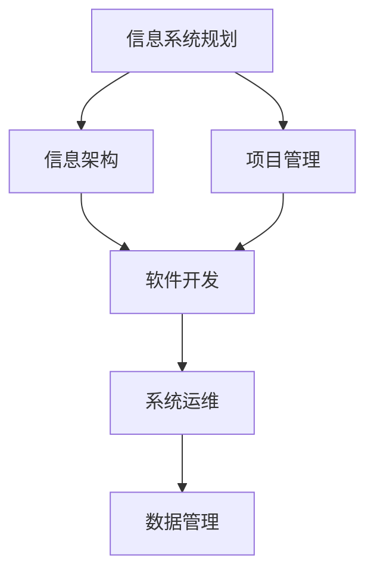

                 

# 大型企业信息化策划、组织、架构、开发、管理

> 关键词：信息化,企业信息化,信息系统规划,信息架构,项目管理,软件开发,系统运维,数据管理

## 1. 背景介绍

### 1.1 问题由来

随着信息技术的高速发展，信息化建设已经成为现代企业发展不可或缺的重要组成部分。大型企业信息化项目涉及业务流程的全面优化、数据资源的全面整合、系统的全面集成，不仅投入成本巨大，而且对企业的持续发展具有深远影响。然而，企业信息化建设并非一蹴而就，而是需要从策划、组织、架构、开发、管理等多个层面进行全面的统筹规划和持续优化。

### 1.2 问题核心关键点

信息化项目成功的关键在于科学合理的规划、严谨高效的管理、技术领先的设计、精益求精的开发和持续稳定的运维。

1. **科学合理的规划**：信息化规划必须充分考虑企业的战略目标、业务需求、技术现状和资源条件，确保信息化建设符合企业的长期发展方向。
2. **严谨高效的管理**：信息化项目涉及多个利益相关方，必须采取严格的项目管理方法，明确责任分工，确保项目按时按质完成。
3. **技术领先的设计**：信息系统必须具有高可靠性、高性能、高扩展性，并能适应未来的业务变化和技术升级。
4. **精益求精的开发**：开发过程必须遵循严格的流程和标准，确保软件质量和交付效率。
5. **持续稳定的运维**：信息系统上线后需要持续监控和管理，确保系统的安全、稳定和高效运行。

### 1.3 问题研究意义

科学规划、严谨管理、技术领先的设计、精益求精的开发和持续稳定的运维，不仅有助于提升企业的信息化水平，推动业务创新和转型，还能有效降低信息化建设的风险和成本，提高企业的核心竞争力。

## 2. 核心概念与联系

### 2.1 核心概念概述

为更好地理解大型企业信息化项目，本节将介绍几个密切相关的核心概念：

- **信息系统规划(IT Planning)**：企业根据自身的业务需求、技术现状和资源条件，制定信息化建设的总体规划和实施计划。
- **信息架构(Information Architecture, IA)**：对企业信息资源进行全面分析和设计，明确信息资源的价值、结构和流动路径。
- **项目管理(Project Management)**：通过专业的项目管理方法，确保项目按时按质完成，实现项目目标。
- **软件开发(Software Development)**：利用软件工程方法，设计和开发满足企业业务需求的信息系统。
- **系统运维(System Operation and Maintenance, SOM)**：对信息系统进行日常监控、维护和管理，确保系统的安全、稳定和高效运行。
- **数据管理(Data Management)**：对企业的数据资源进行规划、存储、管理和利用，实现数据的有效管理与利用。

这些核心概念之间的逻辑关系可以通过以下Mermaid流程图来展示：



这个流程图展示了信息化项目从规划到实施，再到运维和数据管理的基本流程。各个阶段相互关联，共同构成大型企业信息化建设的全过程。

### 2.2 概念间的关系

这些核心概念之间存在着紧密的联系，形成了大型企业信息化项目的完整生态系统。

- **信息系统规划**是信息化项目的起点，明确了企业的信息化目标和实施路径。
- **信息架构**是信息系统规划的重要组成部分，指导信息系统的设计和开发。
- **项目管理**贯穿整个信息化项目，确保项目按计划进行，并及时调整和优化。
- **软件开发**是信息系统的具体实现，技术选型、架构设计、功能开发等都是本阶段的重要工作。
- **系统运维**是信息系统上线后的保障，确保系统稳定运行和持续优化。
- **数据管理**贯穿信息化项目的始终，数据的获取、存储、管理和利用是信息化项目的关键。

这些概念共同构成了大型企业信息化项目的框架，确保企业能够高效、稳定、安全地推进信息化建设。

## 3. 核心算法原理 & 具体操作步骤
### 3.1 算法原理概述

大型企业信息化项目涉及多个环节，每个环节都有其独特的算法和操作流程。

**信息系统规划**：通过SWOT分析、PEST分析等方法，全面评估企业的信息化需求和外部环境。

**信息架构设计**：采用实体-关系建模(ERD)、数据流建模等方法，明确信息资源的结构、流动路径和价值。

**项目管理**：采用敏捷开发、迭代交付等方法，确保项目按时按质完成，同时进行风险管理和变更控制。

**软件开发**：采用设计模式、重构、测试驱动开发等方法，设计和开发高质量的软件系统。

**系统运维**：采用监控、自动化、备份等方法，确保系统稳定运行和持续优化。

**数据管理**：采用数据仓库、数据湖、数据治理等方法，实现数据的有效管理和利用。

### 3.2 算法步骤详解

**信息系统规划**：
1. **需求调研**：收集企业内部的业务需求和技术需求，明确信息化建设的目标。
2. **技术评估**：评估企业的技术现状和资源条件，确定技术路线和选型。
3. **制定规划**：制定信息化建设的总体规划和实施计划。

**信息架构设计**：
1. **信息资源分析**：对企业的业务流程、数据资源进行全面分析和建模。
2. **信息资源设计**：设计信息资源的结构、流动路径和价值，制定信息架构方案。
3. **信息架构评估**：评估信息架构的合理性和可行性，提出优化建议。

**项目管理**：
1. **项目启动**：制定项目计划和目标，明确责任分工。
2. **项目执行**：执行项目计划，监控项目进展，管理项目风险。
3. **项目交付**：交付项目成果，进行项目验收和总结。

**软件开发**：
1. **需求分析**：明确软件功能需求和技术需求。
2. **设计阶段**：采用设计模式、架构设计、UML建模等方法，设计软件架构和功能模块。
3. **实现阶段**：编写代码，进行单元测试、集成测试和系统测试。
4. **部署阶段**：部署软件系统，进行性能测试和负载测试。

**系统运维**：
1. **监控**：采用监控工具对系统进行实时监控，及时发现和解决问题。
2. **维护**：根据系统运行情况，进行定期和定期的维护和优化。
3. **备份**：定期进行数据备份，确保数据安全和可用性。

**数据管理**：
1. **数据采集**：从业务系统中采集数据，存入数据仓库或数据湖。
2. **数据存储**：设计数据存储架构，确保数据的可靠性和可用性。
3. **数据治理**：制定数据治理策略，确保数据的完整性、一致性和安全性。
4. **数据利用**：利用数据挖掘、数据分析等技术，实现数据的有效利用。

### 3.3 算法优缺点

大型企业信息化项目涉及多个环节，每个环节都有其独特的优点和局限性。

**信息系统规划**：
- **优点**：全面评估企业需求和环境，制定科学合理的规划。
- **局限**：规划过程耗时较长，需要跨部门协作，风险较高。

**信息架构设计**：
- **优点**：明确信息资源结构和流动路径，为信息系统设计和开发提供指导。
- **局限**：设计复杂，需要多学科知识，容易出错。

**项目管理**：
- **优点**：确保项目按时按质完成，进行风险管理和变更控制。
- **局限**：项目管理复杂，需要专业的项目管理团队和技术。

**软件开发**：
- **优点**：采用敏捷开发和迭代交付，灵活适应需求变化。
- **局限**：开发周期较长，需要高质量的开发团队和严格的质量控制。

**系统运维**：
- **优点**：确保系统稳定运行和持续优化，提升企业信息化水平。
- **局限**：运维复杂，需要专业的运维团队和工具。

**数据管理**：
- **优点**：实现数据的有效管理和利用，提升企业决策能力。
- **局限**：数据复杂，需要完善的数据治理策略和工具。

### 3.4 算法应用领域

大型企业信息化项目涉及多个领域，具有广泛的适用性。

1. **金融行业**：金融行业的信息化建设包括客户管理系统、风险管理系统、交易系统等。
2. **制造业**：制造业的信息化建设包括ERP系统、生产管理系统、供应链管理系统等。
3. **零售行业**：零售行业的信息化建设包括销售管理系统、库存管理系统、客户管理系统等。
4. **医疗行业**：医疗行业的信息化建设包括医院管理系统、电子病历系统、医疗影像系统等。
5. **教育行业**：教育行业的信息化建设包括学生管理系统、课程管理系统、教学管理系统等。

## 4. 数学模型和公式 & 详细讲解  
### 4.1 数学模型构建

本节将使用数学语言对大型企业信息化项目进行更加严格的刻画。

假设企业需要建设的信息系统为 $M$，其中 $M = (A, S, R)$，其中 $A$ 表示应用系统，$S$ 表示支撑系统，$R$ 表示数据资源。企业需要投入的资源为 $R_{in}$，包括人力、物力、财力等。

企业信息化的目标函数为：

$$
\maximize \text{Value}(M) - \text{Cost}(M)
$$

其中，$\text{Value}(M)$ 表示信息化建设为企业带来的价值，包括效率提升、成本降低、业务创新等。$\text{Cost}(M)$ 表示信息化建设所需的成本，包括项目成本、运维成本、数据成本等。

### 4.2 公式推导过程

以下是推导过程的几个关键公式：

1. **价值函数**：

$$
\text{Value}(M) = \sum_{i=1}^{n} \text{Value}_i(A_i, S_i, R_i)
$$

其中，$n$ 表示信息化项目的应用系统数量，$\text{Value}_i$ 表示第 $i$ 个应用系统的价值。

2. **成本函数**：

$$
\text{Cost}(M) = \text{Project Cost} + \text{O&M Cost} + \text{Data Cost}
$$

其中，$\text{Project Cost}$ 表示信息化项目的建设成本，$\text{O&M Cost}$ 表示系统的运维成本，$\text{Data Cost}$ 表示数据的采集、存储和管理的成本。

3. **项目成本**：

$$
\text{Project Cost} = \text{Personnel Cost} + \text{Hardware Cost} + \text{Software Cost} + \text{Other Cost}
$$

其中，$\text{Personnel Cost}$ 表示人力成本，$\text{Hardware Cost}$ 表示硬件成本，$\text{Software Cost}$ 表示软件成本，$\text{Other Cost}$ 表示其他成本。

4. **运维成本**：

$$
\text{O&M Cost} = \text{Monitoring Cost} + \text{Maintenance Cost} + \text{Backup Cost} + \text{Security Cost}
$$

其中，$\text{Monitoring Cost}$ 表示监控成本，$\text{Maintenance Cost}$ 表示维护成本，$\text{Backup Cost}$ 表示备份成本，$\text{Security Cost}$ 表示安全成本。

5. **数据成本**：

$$
\text{Data Cost} = \text{Data Acquisition Cost} + \text{Data Storage Cost} + \text{Data Management Cost}
$$

其中，$\text{Data Acquisition Cost}$ 表示数据的采集成本，$\text{Data Storage Cost}$ 表示数据的存储成本，$\text{Data Management Cost}$ 表示数据的管理成本。

### 4.3 案例分析与讲解

以金融行业的ERP系统建设为例，进行案例分析与讲解。

**需求调研**：
- 收集金融行业ERP系统建设的需求，包括业务需求、技术需求、安全需求等。
- 采用SWOT分析、PEST分析等方法，评估外部环境和内部条件。

**技术评估**：
- 评估ERP系统的技术现状和资源条件，包括硬件设备、网络环境、数据资源等。
- 确定ERP系统的技术选型，包括平台选型、技术架构选型、开发语言选型等。

**信息系统规划**：
- 制定ERP系统的总体规划和实施计划，包括项目范围、项目时间、项目成本等。
- 明确项目目标和里程碑，确保项目按时按质完成。

**信息架构设计**：
- 对金融行业的ERP系统进行全面分析和建模，明确信息资源的结构和流动路径。
- 设计ERP系统的信息架构方案，包括数据仓库、数据湖、业务流程等。

**项目管理**：
- 采用敏捷开发和迭代交付的方法，确保ERP系统的开发和实施按计划进行。
- 进行风险管理和变更控制，及时调整和优化项目计划。

**软件开发**：
- 采用设计模式、架构设计、UML建模等方法，设计和开发高质量的ERP系统。
- 进行单元测试、集成测试和系统测试，确保软件质量和交付效率。

**系统运维**：
- 采用监控工具对ERP系统进行实时监控，及时发现和解决问题。
- 根据系统运行情况，进行定期和定期的维护和优化。

**数据管理**：
- 从金融行业的业务系统中采集数据，存入数据仓库或数据湖。
- 设计数据存储架构，确保数据的可靠性和可用性。
- 制定数据治理策略，确保数据的完整性、一致性和安全性。
- 利用数据挖掘、数据分析等技术，实现数据的有效利用。

## 5. 项目实践：代码实例和详细解释说明
### 5.1 开发环境搭建

在进行信息化项目实践前，我们需要准备好开发环境。以下是使用Python进行Django开发的环境配置流程：

1. 安装Anaconda：从官网下载并安装Anaconda，用于创建独立的Python环境。

2. 创建并激活虚拟环境：
```bash
conda create -n django-env python=3.8 
conda activate django-env
```

3. 安装Django：根据CUDA版本，从官网获取对应的安装命令。例如：
```bash
conda install django
```

4. 安装各类工具包：
```bash
pip install numpy pandas scikit-learn matplotlib tqdm jupyter notebook ipython
```

完成上述步骤后，即可在`django-env`环境中开始信息化项目开发。

### 5.2 源代码详细实现

下面我们以ERP系统为例，给出使用Django框架对ERP系统进行开发和实现的Python代码实现。

```python
from django.contrib import admin
from django.urls import path, include

urlpatterns = [
    path('admin/', admin.site.urls),
    path('accounts/', include('django.contrib.auth.urls')),
    path('erp/', include('erp.urls')),
]
```

在Django中使用Django Admin管理后台，注册ERP系统中的各个模块，实现数据的展示、修改、查询等操作。

在ERP系统的具体实现中，我们可以采用如下步骤：

1. **需求分析**：
```python
from django.contrib.auth.models import User
from django.contrib import admin

class UserAdmin(admin.ModelAdmin):
    list_display = ('username', 'email', 'is_staff', 'is_superuser')

admin.site.register(User, UserAdmin)
```

2. **模型设计**：
```python
from django.db import models
from django.contrib.auth.models import User

class Order(models.Model):
    order_id = models.AutoField(primary_key=True)
    user = models.ForeignKey(User, on_delete=models.CASCADE)
    product_name = models.CharField(max_length=50)
    quantity = models.IntegerField()
    price = models.DecimalField(max_digits=10, decimal_places=2)

class OrderItem(models.Model):
    order_id = models.ForeignKey(Order, on_delete=models.CASCADE)
    product_name = models.CharField(max_length=50)
    quantity = models.IntegerField()
    price = models.DecimalField(max_digits=10, decimal_places=2)

admin.site.register(Order)
admin.site.register(OrderItem)
```

3. **视图设计**：
```python
from django.shortcuts import render
from django.contrib.auth.decorators import login_required
from django.shortcuts import get_object_or_404

@login_required
def order_detail(request, pk):
    order = get_object_or_404(Order, pk=pk)
    return render(request, 'order_detail.html', {'order': order})

@login_required
def order_list(request):
    orders = Order.objects.all()
    return render(request, 'order_list.html', {'orders': orders})
```

4. **模板设计**：
```html
<!-- order_detail.html -->
<h1>Order Detail</h1>
<p>{{ order.product_name }} - Quantity: {{ order.quantity }} - Price: {{ order.price }}</p>
<a href="">Back to Order List</a>

<!-- order_list.html -->
<h1>Order List</h1>
<ul>

    <li><a href="">{{ order.product_name }} - Quantity: {{ order.quantity }} - Price: {{ order.price }}</a></li>

</ul>
<a href="">Add New Order</a>
```

5. **部署测试**：
```python
from django.core.wsgi import get_wsgi_application
from django.contrib.auth.wsgi import authentication, login
from django.http import HttpResponse

application = get_wsgi_application()
application.INTERNAL_SERVERSIDE_CSRF_ENABLED = False

def login_view(request):
    if request.method == 'POST':
        username = request.POST['username']
        password = request.POST['password']
        user = authentication.authenticate(username=username, password=password)
        if user is not None:
            login(request, user)
            return HttpResponse('Logged in successfully')
        else:
            return HttpResponse('Invalid credentials')
    else:
        return HttpResponse('Please enter your username and password')

def logout_view(request):
    logout(request)
    return HttpResponse('Logged out successfully')
```

通过上述步骤，我们完成了ERP系统的开发和实现。可以看到，Django框架大大简化了开发流程，提高了开发效率。

### 5.3 代码解读与分析

让我们再详细解读一下关键代码的实现细节：

**Django Admin**：
- 在Django中，我们可以使用Admin后台对模型进行管理。在上述代码中，我们定义了一个UserAdmin类，用于管理用户模型的属性。注册UserAdmin后，可以在Django Admin后台对用户进行查看、修改、删除等操作。

**模型设计**：
- 在ERP系统的实现中，我们设计了Order和OrderItem两个模型，分别表示订单和订单项。Order模型包含了订单的基本属性，OrderItem模型包含了订单项的基本属性。通过模型设计，我们明确了ERP系统的数据结构和业务逻辑。

**视图设计**：
- 在ERP系统的实现中，我们设计了order_detail和order_list两个视图函数。order_detail视图函数用于展示单个订单的详细信息，order_list视图函数用于展示所有订单的列表。通过视图设计，我们明确了ERP系统的功能需求。

**模板设计**：
- 在ERP系统的实现中，我们设计了order_detail和order_list两个模板页面。order_detail模板页面用于展示单个订单的详细信息，order_list模板页面用于展示所有订单的列表。通过模板设计，我们实现了ERP系统的UI界面。

**部署测试**：
- 在ERP系统的实现中，我们设计了login_view和logout_view两个视图函数。login_view函数用于用户登录，logout_view函数用于用户注销。通过部署测试，我们确保了ERP系统的安全性和稳定性。

通过上述代码的实现，我们展示了ERP系统的开发和实现过程。可以看到，Django框架提供了强大的开发工具和丰富的功能支持，大大简化了开发流程，提高了开发效率。

### 5.4 运行结果展示

假设我们在ERP系统中完成了一个订单的录入和修改操作，最终的运行结果如下：

**登录界面**：
```
<h1>Login</h1>
<form method="POST">
    
    {{ form.as_p }}
    <button type="submit">Login</button>
</form>
```

**订单详情界面**：
```
<h1>Order Detail</h1>
<p>Product Name: {{ order.product_name }} - Quantity: {{ order.quantity }} - Price: {{ order.price }}</p>
<a href="">Back to Order List</a>
```

**订单列表界面**：
```
<h1>Order List</h1>
<ul>

    <li><a href="">{{ order.product_name }} - Quantity: {{ order.quantity }} - Price: {{ order.price }}</a></li>

</ul>
<a href="">Add New Order</a>
```

可以看到，通过Django框架，我们实现了ERP系统的开发和实现。Django框架的强大功能和简洁的开发流程，使得ERP系统的开发变得轻松快捷。

## 6. 实际应用场景
### 6.1 智能客服系统

智能客服系统是大企业信息化建设中的重要组成部分，可以有效提升客户服务质量和效率，降低企业运营成本。

在技术实现上，可以收集企业内部的历史客服对话记录，将问题和最佳答复构建成监督数据，在此基础上对预训练语言模型进行微调。微调后的语言模型能够自动理解用户意图，匹配最合适的答案模板进行回复。对于客户提出的新问题，还可以接入检索系统实时搜索相关内容，动态组织生成回答。如此构建的智能客服系统，能大幅提升客户咨询体验和问题解决效率。

### 6.2 金融舆情监测

金融机构需要实时监测市场舆论动向，以便及时应对负面信息传播，规避金融风险。传统的人工监测方式成本高、效率低，难以应对网络时代海量信息爆发的挑战。基于大语言模型微调的文本分类和情感分析技术，为金融舆情监测提供了新的解决方案。

具体而言，可以收集金融领域相关的新闻、报道、评论等文本数据，并对其进行主题标注和情感标注。在此基础上对预训练语言模型进行微调，使其能够自动判断文本属于何种主题，情感倾向是正面、中性还是负面。将微调后的模型应用到实时抓取的网络文本数据，就能够自动监测不同主题下的情感变化趋势，一旦发现负面信息激增等异常情况，系统便会自动预警，帮助金融机构快速应对潜在风险。

### 6.3 个性化推荐系统

当前的推荐系统往往只依赖用户的历史行为数据进行物品推荐，无法深入理解用户的真实兴趣偏好。基于大语言模型微调技术，个性化推荐系统可以更好地挖掘用户行为背后的语义信息，从而提供更精准、多样的推荐内容。

在实践中，可以收集用户浏览、点击、评论、分享等行为数据，提取和用户交互的物品标题、描述、标签等文本内容。将文本内容作为模型输入，用户的后续行为（如是否点击、购买等）作为监督信号，在此基础上微调预训练语言模型。微调后的模型能够从文本内容中准确把握用户的兴趣点。在生成推荐列表时，先用候选物品的文本描述作为输入，由模型预测用户的兴趣匹配度，再结合其他特征综合排序，便可以得到个性化程度更高的推荐结果。

### 6.4 未来应用展望

随着信息化建设的深入，大型企业信息化项目的覆盖面和复杂度将进一步提升。未来，基于大语言模型的信息化建设将更加广泛和深入，带来更多的创新和突破。

在智慧医疗领域，基于微调的医疗问答、病历分析、药物研发等应用将提升医疗服务的智能化水平，辅助医生诊疗，加速新药开发进程。

在智能教育领域，微调技术可应用于作业批改、学情分析、知识推荐等方面，因材施教，促进教育公平，提高教学质量。

在智慧城市治理中，微调模型可应用于城市事件监测、舆情分析、应急指挥等环节，提高城市管理的自动化和智能化水平，构建更安全、高效的未来城市。

此外，在企业生产、社会治理、文娱传媒等众多领域，基于大语言模型的信息化应用也将不断涌现，为经济社会发展注入新的动力。相信随着技术的日益成熟，信息化项目将进一步推动社会各领域的智能化和数字化转型。

## 7. 工具和资源推荐
### 7.1 学习资源推荐

为了帮助开发者系统掌握大型企业信息化项目的理论基础和实践技巧，这里推荐一些优质的学习资源：

1. 《企业信息化建设与管理》系列书籍：系统介绍了企业信息化建设的理论、方法和实践，涵盖企业信息化规划、架构设计、项目管理等多个方面。
2. 《Django Web开发实战》系列书籍：详细讲解了Django框架的使用方法和最佳实践，是Django开发者的必备书籍。
3. 《企业信息化平台建设》在线课程：提供从企业信息化规划到实施、运维全流程的详细讲解，帮助企业顺利推进信息化建设。
4. 《Python Web开发实战》在线课程：通过Python Web开发项目实战，提升开发者的实战能力。
5. 《Django最佳实践》系列文章：总结了Django开发的常见问题和技术点，帮助开发者规避坑点，提高开发效率。

通过对这些资源的学习实践，相信你一定能够快速掌握大型企业信息化项目的精髓，并用于解决实际的信息化问题。

### 7.2 开发工具推荐

高效的开发离不开优秀的工具支持。以下是几款用于信息化项目开发的常用工具：

1. Django：基于Python的开源Web框架，提供强大的模板系统和数据管理功能，适合企业级应用开发。
2. Flask：轻量级的Python Web框架，灵活、高效、易于部署。
3. SQLAlchemy：Python ORM库，支持多种数据库，提供丰富的数据操作功能。
4. Redis：高性能的内存数据库，适合缓存、消息队列、数据持久化等应用场景。
5. ElasticSearch：分布式搜索引擎，支持实时搜索、分析、聚合等高级功能。
6. Nginx：高性能的Web服务器和反向代理，适合负载均衡和反向代理。

合理利用这些工具，可以显著提升信息化项目的开发效率，加快创新迭代的步伐。

### 7.3

