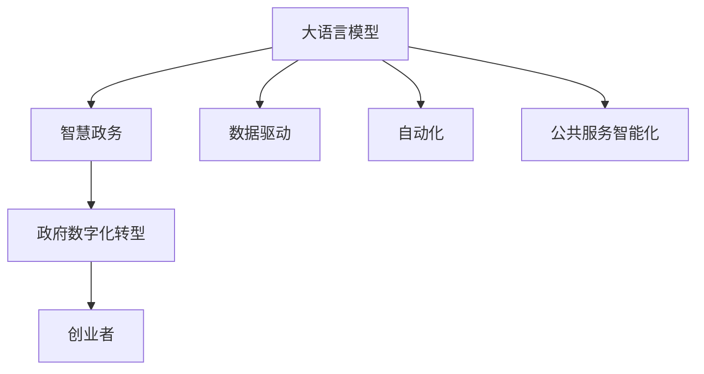

                 

# 大模型赋能智慧政务，创业者如何助力政府数字化转型？

> 关键词：
1. 大模型技术
2. 智慧政务
3. 政府数字化转型
4. 创业者的角色
5. 数据驱动
6. 自动化
7. 公共服务智能化

## 1. 背景介绍

### 1.1 问题由来
数字化转型已成为全球各国政府改革发展的共同趋势。随着信息技术的迅猛发展，政府治理模式逐渐从传统的以事务为中心转向以数据为中心，构建数字化、智能化、一体化的智慧政务系统。在智慧政务建设中，如何高效利用信息技术，提升政府治理能力，实现公共服务智能化，是当前亟需解决的关键问题。

大语言模型技术作为人工智能领域的前沿技术，凭借其强大的语言理解和生成能力，正在被广泛应用于公共服务领域。尤其是在处理海量文本数据、自然语言理解、情感分析、知识图谱构建等方面，大语言模型展示了其卓越的潜力。

### 1.2 问题核心关键点
大语言模型在智慧政务中的应用，主要体现在以下几个方面：

- **数据处理与分析**：通过大语言模型对海量公共数据进行自动化处理和分析，快速提取关键信息，辅助决策。
- **自然语言理解**：利用大语言模型的语言理解能力，实现智能问答、自动翻译、情感分析等功能，提升服务效率和质量。
- **知识图谱构建**：构建基于自然语言的大规模知识图谱，实现跨领域知识的整合和共享，推动知识服务的发展。
- **智能决策支持**：结合大语言模型的语言理解和推理能力，构建智能决策支持系统，辅助政府在公共管理、社会治理等方面的决策。

在智慧政务建设中，大语言模型技术的广泛应用，不仅能提高公共服务的智能化水平，还能减少人力成本，提升政府治理效率。

### 1.3 问题研究意义
研究大语言模型技术在智慧政务中的应用，对于推动政府数字化转型具有重要意义：

1. **提升政府治理能力**：通过大语言模型的数据处理和分析能力，提升政府决策的科学性和准确性。
2. **优化公共服务体验**：通过自然语言理解、智能问答等技术，提升政府服务的智能化和便捷性。
3. **促进数据共享与协作**：通过大语言模型构建的知识图谱，实现跨部门、跨领域的数据共享和协作。
4. **加速智慧城市建设**：大语言模型技术在城市治理、公共安全、环境监测等方面的应用，推动智慧城市建设。
5. **促进就业和经济增长**：智慧政务的建设和应用，带动相关技术产业的发展，创造更多就业机会，推动经济增长。

## 2. 核心概念与联系

### 2.1 核心概念概述

为了更好地理解大语言模型技术在智慧政务中的应用，本节将介绍几个关键概念：

- **大语言模型（Large Language Model, LLM）**：指使用大规模神经网络模型进行预训练的通用语言模型，具备强大的语言理解和生成能力。常见的模型包括BERT、GPT等。
- **智慧政务（Smart Governance）**：利用信息技术和大数据，推动政府治理模式向数字化、智能化方向转变，实现高效、透明、公正的公共服务。
- **政府数字化转型（Digital Transformation in Government）**：通过引入数字化技术，改造传统政府组织架构、业务流程和人员技能，提升政府治理效率和公众满意度。
- **创业者的角色（Role of Entrepreneurs）**：创业者通过开发和推广新技术、新平台，推动智慧政务的创新和发展。
- **数据驱动（Data-Driven）**：在智慧政务建设中，以数据为驱动，实现决策的科学化和服务的智能化。
- **自动化（Automation）**：通过引入人工智能技术，自动化处理和分析海量数据，提升政府工作效率。
- **公共服务智能化（Intelligent Public Services）**：利用人工智能技术，实现公共服务的智能化，提升服务效率和质量。

这些概念之间存在着紧密的联系，通过大语言模型的应用，可以提升政府数字化转型的效率和质量，推动智慧政务的发展，同时创业者在这一过程中扮演着重要的角色。

### 2.2 概念间的关系

这些核心概念之间可以通过以下Mermaid流程图来展示：



这个流程图展示了大语言模型在智慧政务中的应用过程，以及创业者在其中扮演的角色：

1. 大语言模型通过强大的数据处理和分析能力，支撑智慧政务的建设。
2. 智慧政务的建设推动政府数字化转型，提升政府治理效率。
3. 创业者的创新和应用，进一步加速智慧政务的发展。
4. 数据驱动和自动化技术，提升智慧政务的智能化水平。
5. 公共服务智能化，提升公众满意度和服务质量。

通过这些概念的整合，我们可以更全面地理解大语言模型技术在智慧政务中的应用价值和意义。

## 3. 核心算法原理 & 具体操作步骤

### 3.1 算法原理概述

大语言模型在智慧政务中的应用，主要基于监督学习和迁移学习的算法原理。其核心思想是：利用预训练语言模型作为基础特征提取器，通过监督学习和迁移学习，优化模型在特定任务上的性能，从而实现智慧政务的智能化。

具体来说，假设预训练模型为 $M_{\theta}$，其中 $\theta$ 为预训练得到的模型参数。给定智慧政务中的某一具体任务 $T$，通过微调使其适应该任务。微调的目标是：

$$
\theta^* = \mathop{\arg\min}_{\theta} \mathcal{L}(M_{\theta},D)
$$

其中 $\mathcal{L}$ 为针对任务 $T$ 设计的损失函数，用于衡量模型预测输出与真实标签之间的差异。常见的损失函数包括交叉熵损失、均方误差损失等。

### 3.2 算法步骤详解

大语言模型在智慧政务中的微调一般包括以下几个关键步骤：

**Step 1: 准备预训练模型和数据集**

1. 选择合适的预训练语言模型 $M_{\theta}$ 作为初始化参数，如 BERT、GPT 等。
2. 准备智慧政务中的具体任务 $T$ 的标注数据集 $D=\{(x_i,y_i)\}_{i=1}^N$，其中 $x_i$ 为输入，$y_i$ 为标签。
3. 将标注数据集划分为训练集、验证集和测试集。

**Step 2: 设计任务适配层**

1. 根据任务类型，设计合适的输出层和损失函数。
2. 对于分类任务，通常在顶层添加线性分类器和交叉熵损失函数。
3. 对于生成任务，通常使用语言模型的解码器输出概率分布，并以负对数似然为损失函数。

**Step 3: 设置微调超参数**

1. 选择合适的优化算法及其参数，如 AdamW、SGD 等，设置学习率、批大小、迭代轮数等。
2. 设置正则化技术及强度，包括权重衰减、Dropout、Early Stopping 等。
3. 确定冻结预训练参数的策略，如仅微调顶层，或全部参数都参与微调。

**Step 4: 执行梯度训练**

1. 将训练集数据分批次输入模型，前向传播计算损失函数。
2. 反向传播计算参数梯度，根据设定的优化算法和学习率更新模型参数。
3. 周期性在验证集上评估模型性能，根据性能指标决定是否触发 Early Stopping。
4. 重复上述步骤直到满足预设的迭代轮数或 Early Stopping 条件。

**Step 5: 测试和部署**

1. 在测试集上评估微调后模型 $M_{\hat{\theta}}$ 的性能，对比微调前后的精度提升。
2. 使用微调后的模型对新样本进行推理预测，集成到实际的应用系统中。
3. 持续收集新的数据，定期重新微调模型，以适应数据分布的变化。

### 3.3 算法优缺点

大语言模型在智慧政务中的应用，具有以下优点：

- **效率高**：利用大语言模型的预训练能力和迁移学习能力，可以快速适应新任务，提升决策和服务的效率。
- **准确性好**：大语言模型具备强大的语言理解和生成能力，能够更准确地处理和分析海量文本数据。
- **灵活性高**：通过任务适配层的设计，可以根据具体任务进行定制，适应不同的智慧政务场景。
- **可扩展性强**：大语言模型的参数量和计算资源需求较大，但其强大的数据处理能力，使其能够扩展到更复杂的场景中。

同时，也存在一些局限性：

- **对数据依赖强**：大语言模型的性能高度依赖于标注数据的质量和数量，数据不足时效果可能不佳。
- **泛化能力有限**：预训练模型往往在特定领域效果较好，跨领域迁移能力有限。
- **技术门槛高**：大语言模型的微调需要较高的技术水平，对开发者和应用者要求较高。
- **伦理和安全问题**：大语言模型可能学习到有害信息，应用于公共服务时需要注意伦理和安全问题。

### 3.4 算法应用领域

大语言模型在智慧政务中的应用，涵盖了多个领域，具体包括：

1. **智能问答系统**：通过微调大语言模型，实现智能客服、智能答疑等功能，提升公众服务的响应速度和质量。
2. **情感分析**：利用大语言模型的情感分析能力，对公众反馈进行情感分类，辅助政府了解公众情绪，改进服务。
3. **自然语言处理**：通过自然语言理解、翻译、摘要等技术，提升公共服务的语言处理能力。
4. **知识图谱构建**：利用大语言模型构建大规模知识图谱，实现跨领域知识的整合和共享。
5. **智能决策支持**：通过大语言模型的推理和生成能力，构建智能决策支持系统，辅助政府在公共管理、社会治理等方面的决策。
6. **城市治理**：在城市交通管理、环境监测、公共安全等领域，利用大语言模型技术进行数据分析和处理。

这些应用领域展示了大语言模型在智慧政务中的广泛应用前景。

## 4. 数学模型和公式 & 详细讲解  
### 4.1 数学模型构建

在本节中，我们将使用数学语言对大语言模型在智慧政务中的应用进行更加严格的刻画。

记预训练语言模型为 $M_{\theta}$，其中 $\theta$ 为预训练得到的模型参数。假设智慧政务中的某一具体任务 $T$ 的标注数据集 $D=\{(x_i,y_i)\}_{i=1}^N$，其中 $x_i$ 为输入，$y_i$ 为标签。

定义模型 $M_{\theta}$ 在输入 $x$ 上的输出为 $\hat{y}=M_{\theta}(x)$，则二分类任务下的交叉熵损失函数定义为：

$$
\ell(M_{\theta}(x),y) = -[y\log \hat{y} + (1-y)\log (1-\hat{y})]
$$

将上式代入经验风险公式，得：

$$
\mathcal{L}(\theta) = -\frac{1}{N}\sum_{i=1}^N [y_i\log M_{\theta}(x_i)+(1-y_i)\log(1-M_{\theta}(x_i))]
$$

在得到损失函数的梯度后，即可带入参数更新公式，完成模型的迭代优化。

### 4.2 公式推导过程

以下我们以情感分析任务为例，推导交叉熵损失函数及其梯度的计算公式。

假设模型 $M_{\theta}$ 在输入 $x$ 上的输出为 $\hat{y}=M_{\theta}(x) \in [0,1]$，表示样本属于正类的概率。真实标签 $y \in \{0,1\}$。则二分类交叉熵损失函数定义为：

$$
\ell(M_{\theta}(x),y) = -[y\log \hat{y} + (1-y)\log (1-\hat{y})]
$$

将其代入经验风险公式，得：

$$
\mathcal{L}(\theta) = -\frac{1}{N}\sum_{i=1}^N [y_i\log M_{\theta}(x_i)+(1-y_i)\log(1-M_{\theta}(x_i))]
$$

根据链式法则，损失函数对参数 $\theta_k$ 的梯度为：

$$
\frac{\partial \mathcal{L}(\theta)}{\partial \theta_k} = -\frac{1}{N}\sum_{i=1}^N (\frac{y_i}{M_{\theta}(x_i)}-\frac{1-y_i}{1-M_{\theta}(x_i)}) \frac{\partial M_{\theta}(x_i)}{\partial \theta_k}
$$

其中 $\frac{\partial M_{\theta}(x_i)}{\partial \theta_k}$ 可进一步递归展开，利用自动微分技术完成计算。

在得到损失函数的梯度后，即可带入参数更新公式，完成模型的迭代优化。

### 4.3 案例分析与讲解

以智能问答系统为例，演示大语言模型在智慧政务中的应用。假设在智慧政务中，构建一个智能客服系统，用于回答公众的咨询问题。

首先，定义问答系统数据处理函数：

```python
from transformers import BertTokenizer
from torch.utils.data import Dataset
import torch

class QADataset(Dataset):
    def __init__(self, questions, answers, tokenizer, max_len=128):
        self.questions = questions
        self.answers = answers
        self.tokenizer = tokenizer
        self.max_len = max_len
        
    def __len__(self):
        return len(self.questions)
    
    def __getitem__(self, item):
        question = self.questions[item]
        answer = self.answers[item]
        
        encoding = self.tokenizer(question, return_tensors='pt', max_length=self.max_len, padding='max_length', truncation=True)
        input_ids = encoding['input_ids'][0]
        attention_mask = encoding['attention_mask'][0]
        return {'input_ids': input_ids, 
                'attention_mask': attention_mask,
                'labels': answer}

# 标签与id的映射
tag2id = {'answer': 0, 'nonanswer': 1}
id2tag = {v: k for k, v in tag2id.items()}

# 创建dataset
tokenizer = BertTokenizer.from_pretrained('bert-base-cased')

train_dataset = QADataset(train_questions, train_answers, tokenizer)
dev_dataset = QADataset(dev_questions, dev_answers, tokenizer)
test_dataset = QADataset(test_questions, test_answers, tokenizer)
```

然后，定义模型和优化器：

```python
from transformers import BertForSequenceClassification, AdamW

model = BertForSequenceClassification.from_pretrained('bert-base-cased', num_labels=2)

optimizer = AdamW(model.parameters(), lr=2e-5)
```

接着，定义训练和评估函数：

```python
from torch.utils.data import DataLoader
from tqdm import tqdm
from sklearn.metrics import classification_report

device = torch.device('cuda') if torch.cuda.is_available() else torch.device('cpu')
model.to(device)

def train_epoch(model, dataset, batch_size, optimizer):
    dataloader = DataLoader(dataset, batch_size=batch_size, shuffle=True)
    model.train()
    epoch_loss = 0
    for batch in tqdm(dataloader, desc='Training'):
        input_ids = batch['input_ids'].to(device)
        attention_mask = batch['attention_mask'].to(device)
        labels = batch['labels'].to(device)
        model.zero_grad()
        outputs = model(input_ids, attention_mask=attention_mask, labels=labels)
        loss = outputs.loss
        epoch_loss += loss.item()
        loss.backward()
        optimizer.step()
    return epoch_loss / len(dataloader)

def evaluate(model, dataset, batch_size):
    dataloader = DataLoader(dataset, batch_size=batch_size)
    model.eval()
    preds, labels = [], []
    with torch.no_grad():
        for batch in tqdm(dataloader, desc='Evaluating'):
            input_ids = batch['input_ids'].to(device)
            attention_mask = batch['attention_mask'].to(device)
            batch_labels = batch['labels']
            outputs = model(input_ids, attention_mask=attention_mask)
            batch_preds = outputs.logits.argmax(dim=2).to('cpu').tolist()
            batch_labels = batch_labels.to('cpu').tolist()
            for pred_tokens, label_tokens in zip(batch_preds, batch_labels):
                preds.append(pred_tokens[:len(label_tokens)])
                labels.append(label_tokens)
                
    print(classification_report(labels, preds))
```

最后，启动训练流程并在测试集上评估：

```python
epochs = 5
batch_size = 16

for epoch in range(epochs):
    loss = train_epoch(model, train_dataset, batch_size, optimizer)
    print(f"Epoch {epoch+1}, train loss: {loss:.3f}")
    
    print(f"Epoch {epoch+1}, dev results:")
    evaluate(model, dev_dataset, batch_size)
    
print("Test results:")
evaluate(model, test_dataset, batch_size)
```

以上就是使用PyTorch对BERT进行智能问答系统微调的完整代码实现。可以看到，得益于Transformers库的强大封装，我们可以用相对简洁的代码完成BERT模型的加载和微调。

## 5. 项目实践：代码实例和详细解释说明
### 5.1 开发环境搭建

在进行微调实践前，我们需要准备好开发环境。以下是使用Python进行PyTorch开发的环境配置流程：

1. 安装Anaconda：从官网下载并安装Anaconda，用于创建独立的Python环境。

2. 创建并激活虚拟环境：
```bash
conda create -n pytorch-env python=3.8 
conda activate pytorch-env
```

3. 安装PyTorch：根据CUDA版本，从官网获取对应的安装命令。例如：
```bash
conda install pytorch torchvision torchaudio cudatoolkit=11.1 -c pytorch -c conda-forge
```

4. 安装Transformers库：
```bash
pip install transformers
```

5. 安装各类工具包：
```bash
pip install numpy pandas scikit-learn matplotlib tqdm jupyter notebook ipython
```

完成上述步骤后，即可在`pytorch-env`环境中开始微调实践。

### 5.2 源代码详细实现

下面我们以情感分析任务为例，给出使用Transformers库对BERT模型进行微调的PyTorch代码实现。

首先，定义情感分析任务的数据处理函数：

```python
from transformers import BertTokenizer
from torch.utils.data import Dataset
import torch

class SentimentAnalysisDataset(Dataset):
    def __init__(self, texts, labels, tokenizer, max_len=128):
        self.texts = texts
        self.labels = labels
        self.tokenizer = tokenizer
        self.max_len = max_len
        
    def __len__(self):
        return len(self.texts)
    
    def __getitem__(self, item):
        text = self.texts[item]
        label = self.labels[item]
        
        encoding = self.tokenizer(text, return_tensors='pt', max_length=self.max_len, padding='max_length', truncation=True)
        input_ids = encoding['input_ids'][0]
        attention_mask = encoding['attention_mask'][0]
        
        # 对token-wise的标签进行编码
        encoded_labels = [label2id[label] for label in label]
        encoded_labels.extend([label2id['O']] * (self.max_len - len(encoded_labels)))
        labels = torch.tensor(encoded_labels, dtype=torch.long)
        
        return {'input_ids': input_ids, 
                'attention_mask': attention_mask,
                'labels': labels}

# 标签与id的映射
label2id = {'positive': 1, 'negative': 0}
id2label = {v: k for k, v in label2id.items()}

# 创建dataset
tokenizer = BertTokenizer.from_pretrained('bert-base-cased')

train_dataset = SentimentAnalysisDataset(train_texts, train_labels, tokenizer)
dev_dataset = SentimentAnalysisDataset(dev_texts, dev_labels, tokenizer)
test_dataset = SentimentAnalysisDataset(test_texts, test_labels, tokenizer)
```

然后，定义模型和优化器：

```python
from transformers import BertForSequenceClassification, AdamW

model = BertForSequenceClassification.from_pretrained('bert-base-cased', num_labels=2)

optimizer = AdamW(model.parameters(), lr=2e-5)
```

接着，定义训练和评估函数：

```python
from torch.utils.data import DataLoader
from tqdm import tqdm
from sklearn.metrics import classification_report

device = torch.device('cuda') if torch.cuda.is_available() else torch.device('cpu')
model.to(device)

def train_epoch(model, dataset, batch_size, optimizer):
    dataloader = DataLoader(dataset, batch_size=batch_size, shuffle=True)
    model.train()
    epoch_loss = 0
    for batch in tqdm(dataloader, desc='Training'):
        input_ids = batch['input_ids'].to(device)
        attention_mask = batch['attention_mask'].to(device)
        labels = batch['labels'].to(device)
        model.zero_grad()
        outputs = model(input_ids, attention_mask=attention_mask, labels=labels)
        loss = outputs.loss
        epoch_loss += loss.item()
        loss.backward()
        optimizer.step()
    return epoch_loss / len(dataloader)

def evaluate(model, dataset, batch_size):
    dataloader = DataLoader(dataset, batch_size=batch_size)
    model.eval()
    preds, labels = [], []
    with torch.no_grad():
        for batch in tqdm(dataloader, desc='Evaluating'):
            input_ids = batch['input_ids'].to(device)
            attention_mask = batch['attention_mask'].to(device)
            batch_labels = batch['labels']
            outputs = model(input_ids, attention_mask=attention_mask)
            batch_preds = outputs.logits.argmax(dim=2).to('cpu').tolist()
            batch_labels = batch_labels.to('cpu').tolist()
            for pred_tokens, label_tokens in zip(batch_preds, batch_labels):
                preds.append(pred_tokens[:len(label_tokens)])
                labels.append(label_tokens)
                
    print(classification_report(labels, preds))
```

最后，启动训练流程并在测试集上评估：

```python
epochs = 5
batch_size = 16

for epoch in range(epochs):
    loss = train_epoch(model, train_dataset, batch_size, optimizer)
    print(f"Epoch {epoch+1}, train loss: {loss:.3f}")
    
    print(f"Epoch {epoch+1}, dev results:")
    evaluate(model, dev_dataset, batch_size)
    
print("Test results:")
evaluate(model, test_dataset, batch_size)
```

以上就是使用PyTorch对BERT进行情感分析任务微调的完整代码实现。可以看到，得益于Transformers库的强大封装，我们可以用相对简洁的代码完成BERT模型的加载和微调。

## 6. 实际应用场景
### 6.1 智能客服系统

智能客服系统是大语言模型在智慧政务中的典型应用之一。通过智能客服系统，政府可以提供24/7的公共服务，解答公众的各类咨询问题，提升服务效率和质量。

在技术实现上，可以收集政府内部的历史客服对话记录，将问题和最佳答复构建成监督数据，在此基础上对预训练语言模型进行微调。微调后的模型能够自动理解用户意图，匹配最合适的答案模板进行回复。对于用户提出的新问题，还可以接入检索系统实时搜索相关内容，动态组织生成回答。

### 6.2 舆情监测系统

舆情监测系统是大语言模型在智慧政务中的另一重要应用。通过舆情监测系统，政府能够实时监测网络舆情，及时发现和应对负面信息传播，保障社会稳定。

具体而言，可以收集政府公开的各类文本数据，如新闻报道、社交媒体评论、官方声明等，并对其进行情感分析、主题分析等处理。利用大语言模型的语言理解能力，识别出与政府相关的舆情信息，并通过可视化手段展示给政府工作人员，辅助决策。

### 6.3 公共政策分析

公共政策分析是大语言模型在智慧政务中的又一应用方向。通过公共政策分析，政府能够对政策效果进行客观评估，优化政策制定过程。

具体来说，可以收集与政策相关的文本数据，如政策文件、专家评论、媒体报道等，并利用大语言模型进行主题分析、情感分析等处理。通过量化分析，评估政策的社会影响和经济效益，为政府提供政策制定的科学依据。

### 6.4 未来应用展望

随着大语言模型的不断发展和应用，其在智慧政务中的应用前景将更加广阔。未来，大语言模型技术将更加深入地融入政府数字化转型进程中，带来更多的创新和变革。

1. **智慧城市建设**：大语言模型在城市治理、公共安全、环境监测等方面的应用，将推动智慧城市建设，提升城市管理的智能化水平。

2. **政府决策支持**：结合大语言模型的语言理解和推理能力，构建智能决策支持系统，辅助政府在公共管理、社会治理等方面的决策。

3. **社会治理智能化**：通过大语言模型的自然语言处理能力，实现智能舆情监测、智能预警、智能事件处理等功能，提升社会治理的智能化水平。

4. **个性化公共服务**：利用大语言模型，提供个性化公共服务，提升公众满意度和服务质量。

5. **公共数据治理**：通过大语言模型，实现公共数据的自动分类、标注、清洗等处理，提高数据治理效率。

## 7. 工具和资源推荐
### 7.1 学习资源推荐

为了帮助开发者系统掌握大语言模型在智慧政务中的应用，这里推荐一些优质的学习资源：

1. 《Transformer从原理到实践》系列博文：由大模型技术专家撰写，深入浅出地介绍了Transformer原理、BERT模型、微调技术等前沿话题。

2. CS224N《深度学习自然语言处理》课程：斯坦福大学开设的NLP明星课程，有Lecture视频和配套作业，带你

