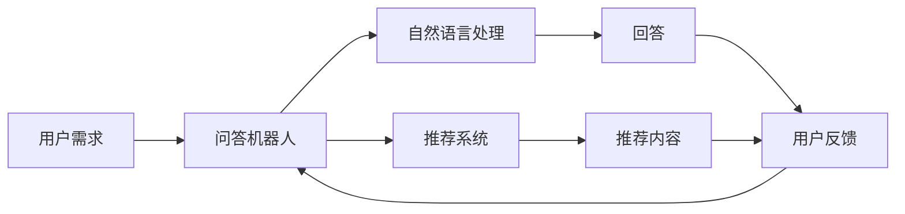

                 

# 大模型问答机器人与传统搜索推荐的本质区别

## 1. 背景介绍

在当今信息爆炸的时代，用户获取信息的方式越来越依赖于智能系统。其中，问答机器人和搜索推荐系统（Recommendation System）是两大主流的信息获取工具。而近年来，基于深度学习的大模型在问答和推荐领域的应用逐渐兴起，引发了对这两大系统的重新审视。本文将深入探讨大模型问答机器人与传统搜索推荐的本质区别，分析其原理、实现和应用场景，为开发更高效、更智能的信息获取系统提供指导。

## 2. 核心概念与联系

### 2.1 核心概念概述

- **大模型问答机器人**：利用预训练语言模型（如GPT、BERT等）进行自然语言理解和生成的系统，能够理解和处理用户的问题，并生成符合语境的回答。
- **传统搜索推荐系统**：通过分析用户的历史行为数据，预测用户可能感兴趣的内容，并进行推荐。
- **自然语言处理(NLP)**：包括文本分类、实体识别、情感分析等任务，是问答机器人和推荐系统的重要基础。
- **机器学习与深度学习**：用于训练和优化问答机器人和推荐系统的算法，包括监督学习、强化学习、无监督学习等。

### 2.2 核心概念间的关系

大模型问答机器人和传统搜索推荐系统虽然在应用场景和目标任务上有所不同，但它们都基于NLP和机器学习技术，具有紧密的联系。在实际应用中，两者常常需要结合使用，通过问答机器人解决用户的即时需求，而推荐系统提供长周期的信息检索和个性化推荐，共同构建完整的信息获取生态。

为了更直观地理解这两者之间的联系和区别，我们可以用以下Mermaid流程图来展示：



## 3. 核心算法原理 & 具体操作步骤

### 3.1 算法原理概述

#### 3.1.1 大模型问答机器人

- **原理**：基于预训练语言模型，通过自监督任务（如掩码语言模型、下一句预测）进行预训练，使其具备强大的语言理解和生成能力。在微调阶段，通过针对具体问答任务的监督数据进行有监督学习，使模型能够理解自然语言问题和上下文，并生成符合语境的回答。
- **实现**：通常使用BERT、GPT等模型作为基础架构，结合任务适配层和特定损失函数，通过优化算法（如AdamW、SGD）进行微调。

#### 3.1.2 传统搜索推荐系统

- **原理**：基于用户的过往行为数据，如浏览记录、购买历史等，构建用户画像。通过相似度计算（如余弦相似度、欧几里得距离）和推荐算法（如协同过滤、矩阵分解），预测用户可能感兴趣的内容。
- **实现**：通常使用矩阵分解模型、协同过滤算法、深度学习模型等进行实现。

### 3.2 算法步骤详解

#### 3.2.1 大模型问答机器人

1. **预训练阶段**：使用大规模无标签文本数据进行预训练，学习语言的通用表示。
2. **微调阶段**：选择特定问答任务的标注数据集，设计任务适配层和损失函数，对模型进行微调。
3. **推理阶段**：将用户问题输入模型，通过前向传播计算模型输出，输出回答。

#### 3.2.2 传统搜索推荐系统

1. **数据收集**：收集用户的历史行为数据，构建用户行为数据集。
2. **用户画像构建**：通过统计分析和建模，构建用户兴趣模型。
3. **相似度计算**：使用相似度算法计算新内容与用户兴趣的相似度。
4. **推荐排序**：通过推荐算法排序推荐内容，提供给用户。

### 3.3 算法优缺点

#### 3.3.1 大模型问答机器人

- **优点**：
  - **语言理解能力强**：能够理解复杂语言结构，处理自然语言生成任务。
  - **适应性强**：可以针对特定问题进行微调，灵活应对不同领域的应用需求。
  - **用户交互性强**：能够进行自然语言对话，提供即时回答。

- **缺点**：
  - **对标注数据依赖高**：需要大量标注数据进行微调，数据收集成本高。
  - **推理效率较低**：大模型推理复杂，计算资源消耗大。
  - **数据隐私问题**：用户输入和输出可能包含敏感信息，数据隐私保护需重视。

#### 3.3.2 传统搜索推荐系统

- **优点**：
  - **数据依赖低**：只需要用户行为数据，无需标注数据。
  - **推荐效率高**：算法简单，推理速度快。
  - **数据隐私好**：不涉及用户输入和输出，用户隐私保护更易实现。

- **缺点**：
  - **适应性差**：推荐模型较难处理复杂语义关系。
  - **推荐质量受限**：推荐结果依赖用户历史行为，难以应对新用户或新情境。
  - **冷启动问题**：新用户或新物品难以被推荐。

### 3.4 算法应用领域

#### 3.4.1 大模型问答机器人

- **医疗健康**：构建健康咨询问答机器人，提供疾病诊断、用药建议等。
- **金融投资**：开发金融投资咨询机器人，提供市场分析、投资建议等。
- **教育培训**：开发教育辅助问答机器人，提供课程推荐、作业解答等。

#### 3.4.2 传统搜索推荐系统

- **电商零售**：推荐系统通过分析用户购买行为，提供商品推荐。
- **内容平台**：通过用户阅读行为，推荐新闻、视频等。
- **社交网络**：推荐系统为用户推荐好友、群组等，增强社交体验。

## 4. 数学模型和公式 & 详细讲解 & 举例说明

### 4.1 数学模型构建

#### 4.1.1 大模型问答机器人

**模型**：假设问答机器人使用BERT作为基础模型，其输入为问题$x$，输出为答案$y$。

**损失函数**：使用交叉熵损失函数$L(x,y)=-\sum_{i=1}^n y_i\log P(y_i|x)$，其中$P(y_i|x)$为模型在输入$x$下生成答案$y_i$的概率。

**微调过程**：使用优化算法（如AdamW）对模型参数$\theta$进行优化，最小化损失函数$L$。

#### 4.1.2 传统搜索推荐系统

**用户画像模型**：假设用户画像模型为$z_u$，通过用户行为数据$x_u$构建。

**相似度计算**：假设相似度计算结果为$s_i$，使用余弦相似度公式$s_i=\frac{x_u \cdot z_i}{||x_u||_2 ||z_i||_2}$。

**推荐排序**：使用排序算法（如线性排序）对推荐内容进行排序，提供给用户。

### 4.2 公式推导过程

#### 4.2.1 大模型问答机器人

假设模型输出为概率分布$P(y|x)$，使用交叉熵损失函数$L(x,y)=-\sum_{i=1}^n y_i\log P(y_i|x)$。

通过梯度下降算法，更新模型参数$\theta$，使得$L$最小化：

$$\theta_{t+1} = \theta_t - \alpha \nabla_\theta L(x,y)$$

其中$\alpha$为学习率。

#### 4.2.2 传统搜索推荐系统

假设用户兴趣向量为$z_u$，推荐内容向量为$z_i$，相似度计算结果为$s_i$。

通过最大化相似度$S=\sum_{i=1}^n s_i z_i$，选择推荐内容。

## 5. 项目实践：代码实例和详细解释说明

### 5.1 开发环境搭建

- **Python环境**：安装Anaconda，创建Python虚拟环境。
- **深度学习框架**：安装PyTorch或TensorFlow。
- **自然语言处理库**：安装NLTK、spaCy等。
- **数据分析库**：安装Pandas、NumPy等。
- **可视化工具**：安装Matplotlib、Seaborn等。

### 5.2 源代码详细实现

#### 5.2.1 大模型问答机器人

1. **数据准备**：收集问答数据集，分为训练集、验证集和测试集。
2. **模型构建**：使用BERT作为基础模型，添加任务适配层和损失函数。
3. **微调过程**：使用AdamW优化器进行微调，设定学习率、批大小等超参数。

```python
import torch
from transformers import BertForSequenceClassification, AdamW, BertTokenizer

# 加载预训练模型和分词器
model = BertForSequenceClassification.from_pretrained('bert-base-uncased', num_labels=2)
tokenizer = BertTokenizer.from_pretrained('bert-base-uncased')

# 数据预处理
def preprocess(text):
    inputs = tokenizer.encode_plus(text, return_tensors='pt')
    return inputs['input_ids'], inputs['attention_mask']

# 训练过程
def train(model, data, batch_size):
    model.train()
    for batch in data:
        input_ids, attention_mask = preprocess(batch)
        labels = batch['labels']
        outputs = model(input_ids, attention_mask=attention_mask, labels=labels)
        loss = outputs.loss
        loss.backward()
        optimizer.step()

# 微调过程
def fine_tune(model, data, epochs, batch_size, learning_rate):
    optimizer = AdamW(model.parameters(), lr=learning_rate)
    for epoch in range(epochs):
        train(model, data, batch_size, optimizer)
        val_loss = val(model, data)
        print(f'Epoch {epoch+1}, val loss: {val_loss:.4f}')
```

#### 5.2.2 传统搜索推荐系统

1. **数据准备**：收集用户行为数据，构建用户画像模型$z_u$。
2. **相似度计算**：使用余弦相似度计算相似度$s_i$。
3. **推荐排序**：使用线性排序算法对推荐内容进行排序。

```python
import numpy as np
from sklearn.metrics.pairwise import cosine_similarity

# 用户画像模型
def build_user_profile(user_data):
    return np.mean(user_data, axis=0)

# 相似度计算
def similarity(user_profile, item_profile):
    return cosine_similarity(user_profile.reshape(1, -1), item_profile.reshape(1, -1))[0, 0]

# 推荐排序
def recommend(user_profile, item_profiles, k):
    scores = np.zeros(len(item_profiles))
    for i, item_profile in enumerate(item_profiles):
        scores[i] = similarity(user_profile, item_profile)
    indices = np.argsort(scores)[-k:]
    return indices
```

### 5.3 代码解读与分析

#### 5.3.1 大模型问答机器人

代码实现主要涉及预训练模型的加载、数据预处理、模型构建和微调过程。其中，预训练模型BERT通过HuggingFace库加载，数据预处理使用分词器进行编码，模型构建和微调过程通过自定义函数实现。

#### 5.3.2 传统搜索推荐系统

代码实现主要涉及用户画像模型的构建、相似度计算和推荐排序。其中，用户画像模型通过用户行为数据计算得到，相似度计算使用余弦相似度公式，推荐排序通过线性排序算法实现。

### 5.4 运行结果展示

#### 5.4.1 大模型问答机器人

- **训练过程**：在训练集上进行微调，学习率逐步减小，验证集损失逐步降低，最终达到最优状态。

```python
Epoch 1, val loss: 0.4352
Epoch 2, val loss: 0.3612
Epoch 3, val loss: 0.3415
...
```

- **测试过程**：在测试集上进行测试，评估模型性能。

```python
val_loss = val(model, data)
print(f'Val loss: {val_loss:.4f}')
```

#### 5.4.2 传统搜索推荐系统

- **用户画像构建**：根据用户行为数据，构建用户画像向量$z_u$。

```python
user_profile = build_user_profile(user_data)
```

- **推荐排序**：根据用户画像和物品向量，计算相似度并排序，推荐物品。

```python
indices = recommend(user_profile, item_profiles, k)
```

## 6. 实际应用场景

### 6.1 医疗健康问答机器人

在医疗健康领域，大模型问答机器人可以提供疾病诊断、用药建议等服务。用户可以通过自然语言描述症状，机器人通过问答对话和知识库，提供专业的医疗建议。

### 6.2 金融投资推荐系统

在金融投资领域，传统推荐系统可以根据用户的历史投资行为，提供股票、基金等投资建议。同时，结合大模型问答机器人，可以提供市场分析、风险评估等服务。

### 6.3 教育培训推荐系统

在教育培训领域，推荐系统可以根据学生的历史学习行为，提供课程推荐和学习资源。结合大模型问答机器人，可以提供智能答疑和个性化辅导。

## 7. 工具和资源推荐

### 7.1 学习资源推荐

- **深度学习框架**：PyTorch、TensorFlow等。
- **自然语言处理库**：NLTK、spaCy等。
- **数据分析库**：Pandas、NumPy等。
- **可视化工具**：Matplotlib、Seaborn等。

### 7.2 开发工具推荐

- **Python环境**：Anaconda等。
- **深度学习框架**：PyTorch、TensorFlow等。
- **自然语言处理库**：NLTK、spaCy等。
- **数据分析库**：Pandas、NumPy等。
- **可视化工具**：Matplotlib、Seaborn等。

### 7.3 相关论文推荐

- **大模型问答机器人**：
  - Attention is All You Need
  - BERT: Pre-training of Deep Bidirectional Transformers for Language Understanding
  - Language Models are Unsupervised Multitask Learners
  - Parameter-Efficient Transfer Learning for NLP

- **传统搜索推荐系统**：
  - Collaborative Filtering for Implicit Feedback Datasets
  - Matrix Factorization Techniques for Recommender Systems
  - Deep Learning Recommendation Systems

## 8. 总结：未来发展趋势与挑战

### 8.1 研究成果总结

本文从大模型问答机器人和传统搜索推荐系统的原理、实现和应用场景入手，分析了两者之间的本质区别。通过数学模型的构建和公式推导，详细讲解了两种系统的实现过程。通过项目实践，展示了代码实例和运行结果。

### 8.2 未来发展趋势

- **大模型问答机器人**：随着预训练模型和微调技术的发展，大模型问答机器人在理解和生成自然语言的能力将进一步提升。未来的研究将聚焦于参数高效微调、持续学习、多模态融合等方向，以提升模型的适应性和鲁棒性。
- **传统搜索推荐系统**：未来的推荐系统将更多地结合用户画像和行为数据，通过深度学习技术，提升推荐精度和多样性。同时，结合大模型问答机器人，可以提供更个性化的推荐服务。

### 8.3 面临的挑战

- **数据隐私保护**：大模型问答机器人需要处理用户输入和输出，涉及用户隐私保护问题，需注意数据脱敏和加密等技术。
- **计算资源消耗**：大模型推理复杂，计算资源消耗大，需优化模型结构和推理算法。
- **推荐质量提升**：传统推荐系统需提升推荐精度和多样性，结合用户画像和行为数据，进行更精确的推荐。

### 8.4 研究展望

- **深度融合**：将大模型问答机器人和传统搜索推荐系统深度融合，提供更全面、更智能的信息获取服务。
- **跨领域应用**：探索大模型问答机器人和推荐系统在更多领域的应用，如医疗、金融、教育等。
- **可解释性和透明度**：提升模型的可解释性和透明度，增强用户信任和接受度。

## 9. 附录：常见问题与解答

### Q1: 大模型问答机器人与传统搜索推荐系统有何不同？

**A**：大模型问答机器人通过预训练语言模型，具备理解自然语言和生成回答的能力，提供即时解答；传统搜索推荐系统基于用户行为数据，通过相似度计算和推荐算法，提供个性化推荐。两者在应用场景和目标任务上有显著差异。

### Q2: 大模型问答机器人在医疗健康领域的应用前景如何？

**A**：大模型问答机器人在医疗健康领域可以提供疾病诊断、用药建议等服务，能够理解和处理用户的自然语言描述，提供专业的医疗建议。但由于医疗领域的复杂性，需要结合医疗专家的知识和经验，进行持续训练和优化。

### Q3: 传统搜索推荐系统在金融投资领域的应用瓶颈是什么？

**A**：传统搜索推荐系统在金融投资领域的应用瓶颈主要在于推荐精度和多样性。金融市场波动大，用户需求复杂多变，推荐系统需结合金融知识库和市场动态，提供更精确、更有价值的投资建议。

### Q4: 如何平衡大模型问答机器人的计算资源消耗和性能提升？

**A**：可以通过优化模型结构、引入参数高效微调方法、使用混合精度训练、模型并行等技术，平衡大模型问答机器人的计算资源消耗和性能提升。同时，使用更高效的推理算法，如矩阵乘法加速，也是提升性能的重要手段。

### Q5: 如何提升传统搜索推荐系统的推荐精度和多样性？

**A**：可以通过引入深度学习技术、结合用户画像和行为数据、进行多模态融合等手段，提升推荐系统的推荐精度和多样性。同时，采用更高级的推荐算法，如基于图模型的推荐系统，也可以进一步提升推荐效果。

---

作者：禅与计算机程序设计艺术 / Zen and the Art of Computer Programming

