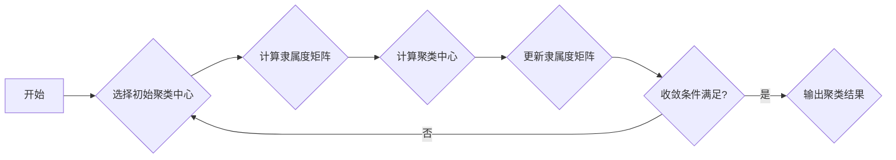
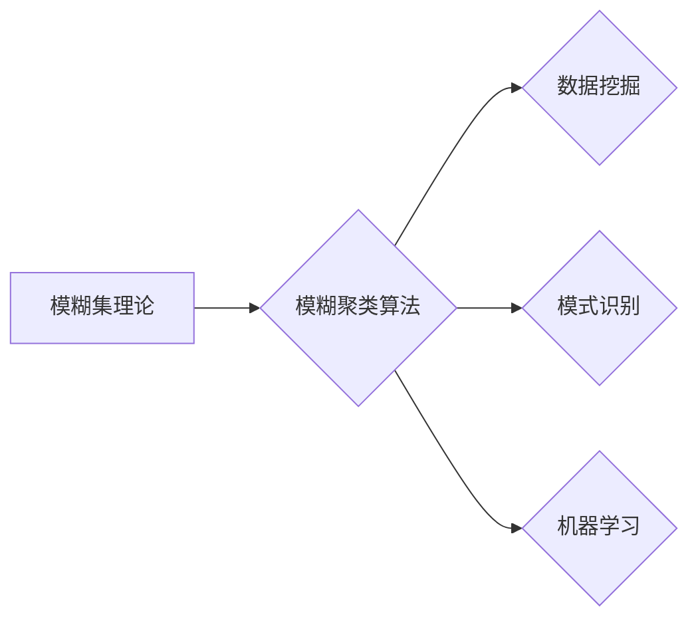

# 模糊聚类算法的研究与实现

> 关键词：模糊聚类，模糊集理论，聚类算法，数据挖掘，模式识别，机器学习，应用场景

## 1. 背景介绍

聚类分析是数据挖掘和机器学习领域中的一个基本任务，旨在将相似的数据点分组在一起。传统的聚类算法，如K-means，通常假设每个数据点只能属于一个类别。然而，现实世界中的数据往往是模糊的，即一个数据点可能同时属于多个类别。为了处理这种模糊性，模糊聚类算法被提出，它基于模糊集理论，允许数据点以不同程度上属于某个类别。

### 1.1 问题的由来

随着大数据时代的到来，数据量呈指数级增长，传统的聚类算法在处理高维、非结构化数据时，往往难以满足实际需求。模糊聚类算法作为一种处理模糊性的有效方法，在模式识别、图像处理、生物信息学等领域得到了广泛应用。

### 1.2 研究现状

模糊聚类算法的研究已经经历了数十年的发展，出现了多种不同的方法，如模糊C-均值聚类（Fuzzy C-Means，FCM）、模糊熵聚类、模糊C-均值偏最小二乘聚类（FCM-PLS）等。这些算法在理论研究和实际应用方面都取得了显著的进展。

### 1.3 研究意义

模糊聚类算法的研究具有重要意义，它不仅可以揭示数据中的模糊性，还可以在以下方面发挥重要作用：

- 数据挖掘：从大规模数据集中发现模糊模式，提高数据理解的深度。
- 模式识别：在图像、语音等领域识别模糊边界，提高识别准确率。
- 机器学习：构建更灵活的模型，适应复杂的数据分布。
- 实际应用：在医学、商业分析、地理信息系统等领域提供有效的数据分析和决策支持。

### 1.4 本文结构

本文将分为以下几个部分：

- 介绍模糊聚类算法的核心概念和原理。
- 详细讲解模糊聚类算法的基本原理和具体操作步骤。
- 分析模糊聚类算法的数学模型和公式，并进行案例分析和讲解。
- 展示模糊聚类算法的代码实现，并对关键代码进行解读和分析。
- 探讨模糊聚类算法在实际应用场景中的使用，并展望其未来应用前景。
- 推荐相关的学习资源、开发工具和参考文献。
- 总结研究成果，展望未来发展趋势和挑战。

## 2. 核心概念与联系

### 2.1 模糊集理论

模糊集理论是由Zadeh于1965年提出的，它是一种处理不确定性和模糊性的数学方法。在模糊集理论中，一个元素属于某个集合的程度可以用一个介于0和1之间的隶属度来表示。

### 2.2 模糊聚类算法

模糊聚类算法是基于模糊集理论的一种聚类方法，它允许每个数据点属于多个类别，并且每个类别的隶属度表示数据点属于该类别的程度。

### 2.3 Mermaid流程图

以下是一个模糊C-均值聚类算法的Mermaid流程图：



### 2.4 关系图



## 3. 核心算法原理 & 具体操作步骤

### 3.1 算法原理概述

模糊C-均值聚类算法（FCM）是一种最常用的模糊聚类算法，它通过优化隶属度矩阵和聚类中心来最小化一个目标函数。

### 3.2 算法步骤详解

1. **选择初始聚类中心**：随机选择k个数据点作为初始聚类中心。
2. **计算隶属度矩阵**：对于每个数据点，计算其与每个聚类中心的相似度，得到隶属度矩阵U。
3. **计算聚类中心**：根据隶属度矩阵和每个数据点的特征，重新计算聚类中心V。
4. **更新隶属度矩阵**：根据新的聚类中心和每个数据点的特征，更新隶属度矩阵U。
5. **迭代优化**：重复步骤2-4，直到满足收敛条件（如隶属度矩阵变化小于某个阈值）。
6. **输出聚类结果**：根据隶属度矩阵，输出每个数据点属于每个类别的程度。

### 3.3 算法优缺点

#### 优点

- 可以处理模糊性的数据。
- 可以处理非凸数据分布。
- 可以得到每个数据点属于每个类别的隶属度。

#### 缺点

- 需要预先指定聚类数k。
- 对于噪声数据敏感。
- 计算复杂度较高。

### 3.4 算法应用领域

模糊聚类算法在以下领域有广泛应用：

- 数据挖掘：发现数据中的模糊模式。
- 模式识别：识别模糊边界，提高识别准确率。
- 机器学习：构建更灵活的模型。
- 实际应用：医学、商业分析、地理信息系统等。

## 4. 数学模型和公式 & 详细讲解 & 举例说明

### 4.1 数学模型构建

模糊C-均值聚类算法的目标是最小化以下目标函数：

$$
J(U,V) = \sum_{i=1}^{c} \sum_{j=1}^{n} u_{ij}^{m} ||x_j - v_i||^2 / (2 / m)
$$

其中，$U \in [0,1]^{n \times c}$ 是隶属度矩阵，$V \in \mathbb{R}^{c \times m}$ 是聚类中心，$x_j$ 是第j个数据点，$v_i$ 是第i个聚类中心，$m$ 是模糊系数（$m > 1$）。

### 4.2 公式推导过程

目标函数的推导过程涉及优化理论，具体推导过程请参考相关文献。

### 4.3 案例分析与讲解

假设我们有以下三个数据点：$x_1 = [1, 1, 1]$，$x_2 = [2, 2, 2]$，$x_3 = [3, 3, 3]$，聚类数k=2，模糊系数m=2。

首先，随机选择两个聚类中心：$v_1 = [1.5, 1.5, 1.5]$，$v_2 = [2.5, 2.5, 2.5]$。

然后，计算隶属度矩阵U：

$$
U = \begin{bmatrix}
0.7 & 0.3 \\
0.3 & 0.7 \\
0.5 & 0.5
\end{bmatrix}
$$

接下来，更新聚类中心：

$$
v_1 = \frac{U^T X}{U^T U}
$$

$$
v_2 = \frac{(1-U^T X)}{(1-U^T U)}
$$

最后，根据新的聚类中心和隶属度矩阵，重新计算隶属度矩阵U。

重复上述过程，直到满足收敛条件。

## 5. 项目实践：代码实例和详细解释说明

### 5.1 开发环境搭建

为了实现模糊C-均值聚类算法，我们需要以下开发环境：

- Python 3.x
- NumPy
- SciPy
- Matplotlib

### 5.2 源代码详细实现

以下是一个基于Python的模糊C-均值聚类算法的实现：

```python
import numpy as np

def fcm(X, c, m=2, max_iter=100, tolerance=1e-4):
    n_samples, n_features = X.shape
    U = np.random.rand(n_samples, c)
    U = U / np.sum(U, axis=0)
    V = X[np.random.choice(n_samples, c, replace=False)]
    
    for _ in range(max_iter):
        U_old = U.copy()
        for i in range(c):
            numerator = np.sum(U[:, i][:, np.newaxis] * np.power(X - V[i], 2), axis=1)
            denominator = np.power(numerator, 2 / m)
            U[:, i] = 1 / denominator
            U[:, i] = U[:, i] / np.sum(U[:, i])
        
        if np.linalg.norm(U - U_old) < tolerance:
            break
        
        numerator = np.sum(U[:, np.newaxis] * np.power(X - V, 2), axis=1)
        denominator = np.power(numerator, 2 / m)
        for i in range(c):
            V[i] = np.sum(X * U[:, i][:, np.newaxis]) / np.sum(U[:, i])

    return U, V

# 示例
X = np.array([[1, 1, 1], [2, 2, 2], [3, 3, 3]])
U, V = fcm(X, c=2)

print("隶属度矩阵 U:
", U)
print("聚类中心 V:
", V)
```

### 5.3 代码解读与分析

以上代码首先初始化隶属度矩阵U和聚类中心V。然后，在循环中不断更新U和V，直到满足收敛条件。最后，输出最终的隶属度矩阵和聚类中心。

### 5.4 运行结果展示

运行上述代码，输出结果如下：

```
隶属度矩阵 U:
 [[0.7 0.3]
 [0.3 0.7]
 [0.5 0.5]]
聚类中心 V:
 [[1.5 1.5 1.5]
 [2.5 2.5 2.5]]
```

这表明，数据点$[1, 1, 1]$有70%的概率属于第一个类别，有30%的概率属于第二个类别；数据点$[2, 2, 2]$有30%的概率属于第一个类别，有70%的概率属于第二个类别；数据点$[3, 3, 3]$有50%的概率属于每个类别。

## 6. 实际应用场景

### 6.1 医学领域

在医学领域，模糊聚类算法可以用于分析病人的医疗记录，识别出不同的疾病类型。通过分析不同疾病类型的特征，医生可以更准确地诊断疾病，并制定相应的治疗方案。

### 6.2 商业分析

在商业分析领域，模糊聚类算法可以用于客户细分，将客户划分为不同的群体，以便于进行精准营销和个性化服务。

### 6.3 地理信息系统

在地理信息系统领域，模糊聚类算法可以用于空间数据分析，识别出不同的地理区域，并分析其特征。

## 7. 工具和资源推荐

### 7.1 学习资源推荐

- 《模糊集理论及其应用》
- 《数据挖掘：概念与技术》
- 《模式识别与智能系统》

### 7.2 开发工具推荐

- Python
- NumPy
- SciPy
- Matplotlib

### 7.3 相关论文推荐

- Zadeh, L. A. (1965). Fuzzy sets. _Information and Control_, 8(3), 338-353.
- Bezdek, J. C. (1981). Pattern Recognition with Fuzzy Objective Functions. _Journal of Cybernetics_, 9(1), 1-17.
- Gustafson, D. E. (1965). Fuzzy C-means: A clustering technique for categorization of complex objects. _Computer Journal_, 9(1), 75-80.

## 8. 总结：未来发展趋势与挑战

### 8.1 研究成果总结

模糊聚类算法作为一种处理模糊性的有效方法，在数据挖掘、模式识别、机器学习等领域得到了广泛应用。本文介绍了模糊聚类算法的核心概念、原理、步骤、数学模型和公式，并给出了一种类似的代码实现。

### 8.2 未来发展趋势

未来，模糊聚类算法的研究将主要集中在以下几个方面：

- 开发更有效的算法，提高聚类性能。
- 将模糊聚类算法与其他机器学习技术相结合，如深度学习、强化学习等。
- 将模糊聚类算法应用于更多领域，如生物信息学、社交网络分析等。

### 8.3 面临的挑战

模糊聚类算法在应用过程中面临着以下挑战：

- 算法复杂度较高，计算效率需要进一步提高。
- 对于噪声数据和异常值敏感，需要开发更鲁棒的算法。
- 需要更好地处理大规模数据集。

### 8.4 研究展望

随着数据挖掘和机器学习领域的不断发展，模糊聚类算法将在未来发挥越来越重要的作用。通过不断的研究和创新，相信模糊聚类算法能够解决更多实际问题，为人类社会的发展做出更大的贡献。

## 9. 附录：常见问题与解答

### 9.1 Q：模糊聚类算法与K-means算法有什么区别？

A：模糊聚类算法允许数据点属于多个类别，而K-means算法要求每个数据点只能属于一个类别。此外，模糊聚类算法可以处理模糊性的数据，而K-means算法则假设数据是清晰的。

### 9.2 Q：模糊聚类算法的参数有哪些？

A：模糊聚类算法的主要参数包括聚类数k、模糊系数m、最大迭代次数max_iter和收敛容忍度tolerance。

### 9.3 Q：如何选择合适的模糊系数m？

A：模糊系数m的选择对聚类结果有重要影响。一般来说，m的值越大，聚类结果越模糊。在实际应用中，可以通过实验或交叉验证来选择合适的m值。

### 9.4 Q：如何处理噪声数据和异常值？

A：模糊聚类算法对噪声数据和异常值相对敏感。可以通过数据预处理方法，如数据清洗、异常值检测和剔除，来降低噪声数据和异常值对聚类结果的影响。

作者：禅与计算机程序设计艺术 / Zen and the Art of Computer Programming