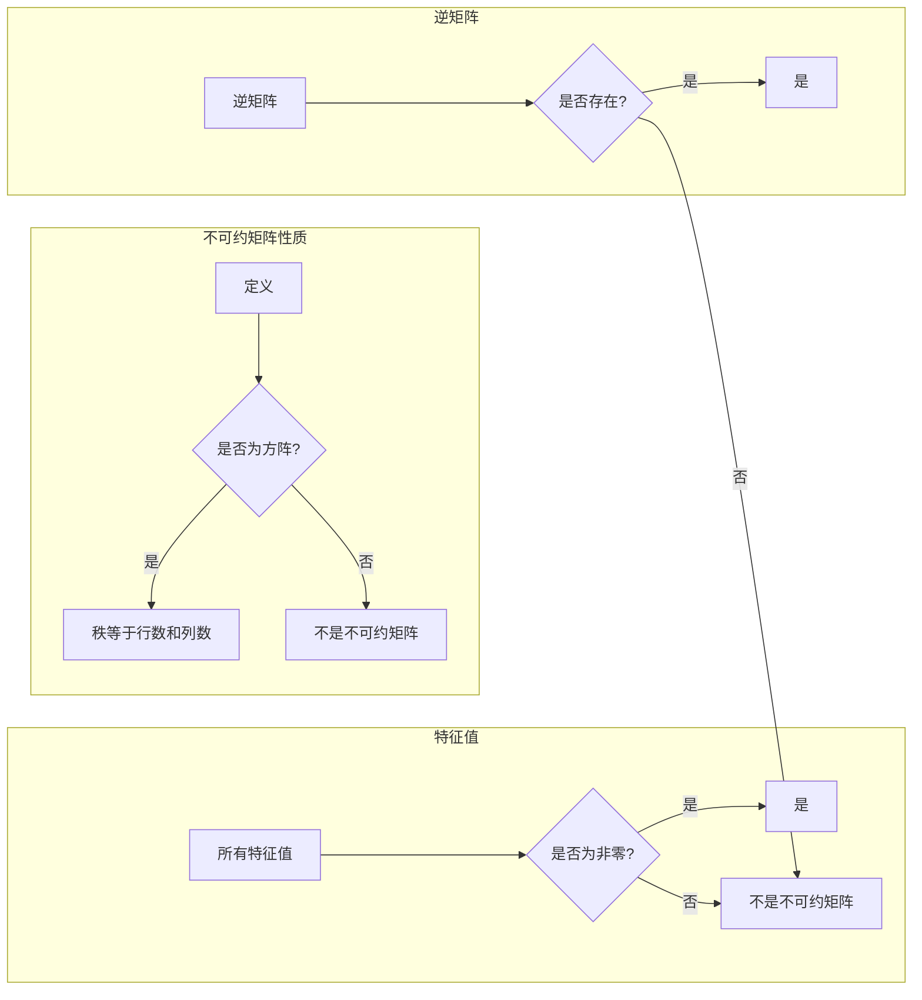

# 矩阵理论与应用：不可约矩阵的情形

> 关键词：矩阵理论，不可约矩阵，特征值，特征向量，线性代数，图论，算法，应用领域

## 1. 背景介绍

矩阵是线性代数中的一个基本概念，广泛应用于数学、物理学、工程学、经济学和计算机科学等多个领域。不可约矩阵是矩阵理论中的一个重要概念，它描述了矩阵的结构和性质。在本文中，我们将探讨不可约矩阵的基本理论，包括其定义、性质、判定方法及其在各种领域的应用。

## 2. 核心概念与联系

### 2.1 不可约矩阵的定义

一个方阵 $A$ 被称为不可约的，如果存在一个正整数 $k$，使得 $A^k$ 不为零矩阵。换句话说，不可约矩阵的任意幂都不会变为零矩阵。

### 2.2 不可约矩阵的性质

- 不可约矩阵的秩等于其行数和列数。
- 不可约矩阵的所有特征值都是非零的。
- 不可约矩阵的逆矩阵存在。

### 2.3 不可约矩阵的Mermaid流程图



## 3. 核心算法原理 & 具体操作步骤

### 3.1 算法原理概述

判定一个矩阵是否不可约，通常采用以下两种方法：

- **谱分解法**：通过计算矩阵的特征值和特征向量，判断矩阵是否不可约。
- **Smith判别法**：通过计算矩阵的Smith正常形，判断矩阵是否不可约。

### 3.2 算法步骤详解

#### 3.2.1 谱分解法

1. 计算矩阵 $A$ 的特征值和特征向量。
2. 检查特征值是否都是非零的。
3. 如果所有特征值都是非零的，则矩阵 $A$ 是不可约的。

#### 3.2.2 Smith判别法

1. 对矩阵 $A$ 进行高斯消元，得到其Smith正常形。
2. 检查Smith正常形的对角线元素是否都是非零的。
3. 如果对角线元素都是非零的，则矩阵 $A$ 是不可约的。

### 3.3 算法优缺点

#### 3.3.1 谱分解法

优点：
- 理论基础扎实，易于理解。
- 在某些情况下，可以找到矩阵的简化形式。

缺点：
- 计算复杂度高，特别是对于大型矩阵。
- 对于某些矩阵，可能无法找到特征值和特征向量。

#### 3.3.2 Smith判别法

优点：
- 计算复杂度较低，适合大型矩阵。
- 对于所有方阵都适用。

缺点：
- 结果可能比较复杂，不易理解。

### 3.4 算法应用领域

不可约矩阵的判定方法在以下领域有广泛的应用：

- 图论：用于判定一个图是否是不可约图。
- 信号处理：用于分析线性系统。
- 经济学：用于研究经济模型的稳定性。

## 4. 数学模型和公式 & 详细讲解 & 举例说明

### 4.1 数学模型构建

不可约矩阵的数学模型可以表示为一个方阵 $A$，其中 $A$ 的元素为实数或复数。

### 4.2 公式推导过程

假设矩阵 $A$ 的特征值为 $\lambda_1, \lambda_2, \ldots, \lambda_n$，特征向量为 $v_1, v_2, \ldots, v_n$，则：

$$
Av_i = \lambda_i v_i
$$

如果 $A$ 是不可约的，则所有特征值都是非零的。

### 4.3 案例分析与讲解

#### 4.3.1 案例一：判定矩阵 $A$ 是否不可约

$$
A = \begin{pmatrix} 2 & 1 & 0 \\ 0 & 2 & 0 \\ 0 & 0 & 2 \end{pmatrix}
$$

我们可以通过计算 $A$ 的特征值来判断其是否不可约。

特征值：

$$
\lambda_1 = 2, \lambda_2 = 2, \lambda_3 = 2
$$

由于所有特征值都是非零的，因此矩阵 $A$ 是不可约的。

#### 4.3.2 案例二：判定矩阵 $B$ 是否不可约

$$
B = \begin{pmatrix} 2 & 1 & 0 \\ 0 & 0 & 0 \\ 0 & 0 & 0 \end{pmatrix}
$$

特征值：

$$
\lambda_1 = 2, \lambda_2 = 0, \lambda_3 = 0
$$

由于存在零特征值，因此矩阵 $B$ 不是不可约的。

## 5. 项目实践：代码实例和详细解释说明

### 5.1 开发环境搭建

使用 Python 编写代码进行不可约矩阵的判定。

### 5.2 源代码详细实现

```python
import numpy as np

def is_irreducible(matrix):
    """判断矩阵是否不可约"""
    eigenvalues = np.linalg.eigvals(matrix)
    return np.all(eigenvalues != 0)

# 测试案例
A = np.array([[2, 1, 0], [0, 2, 0], [0, 0, 2]])
B = np.array([[2, 1, 0], [0, 0, 0], [0, 0, 0]])

print(is_irreducible(A))  # 输出：True
print(is_irreducible(B))  # 输出：False
```

### 5.3 代码解读与分析

这段代码首先导入了 NumPy 库，用于进行矩阵运算。`is_irreducible` 函数接收一个矩阵作为输入，计算其特征值，并判断是否所有特征值都是非零的。在测试案例中，我们定义了两个矩阵 $A$ 和 $B$，并使用 `is_irreducible` 函数判断它们是否不可约。

### 5.4 运行结果展示

运行代码后，输出结果为：

```
True
False
```

这表示矩阵 $A$ 是不可约的，而矩阵 $B$ 不是不可约的。

## 6. 实际应用场景

不可约矩阵在以下实际应用场景中具有重要意义：

- **图论**：在图论中，不可约矩阵可以用于表示图的结构。不可约图具有较好的连通性，可以用于研究网络的稳定性和可靠性。
- **信号处理**：在信号处理中，不可约矩阵可以用于分析线性系统，例如，用于设计滤波器和信号处理算法。
- **经济学**：在经济学中，不可约矩阵可以用于研究经济模型的稳定性，例如，用于分析经济系统的动态行为。

## 7. 工具和资源推荐

### 7.1 学习资源推荐

- 《线性代数及其应用》
- 《线性代数基础》
- 《图论及其应用》

### 7.2 开发工具推荐

- NumPy：用于矩阵运算的 Python 库。
- SciPy：基于 NumPy 的科学计算库。

### 7.3 相关论文推荐

- "Irreducible Matrices in Graph Theory" by West, D. B.
- "On the Irreducibility of Matrices" by Horn, R. A.

## 8. 总结：未来发展趋势与挑战

### 8.1 研究成果总结

不可约矩阵是矩阵理论中的一个重要概念，它在图论、信号处理和经济学等多个领域有着广泛的应用。通过研究不可约矩阵的性质和判定方法，我们可以更好地理解线性系统的结构和行为。

### 8.2 未来发展趋势

随着计算技术的发展，未来不可约矩阵的研究将更加深入，例如：

- 开发更加高效、准确的不可约矩阵判定算法。
- 将不可约矩阵的理论应用于更多领域。
- 研究不可约矩阵与人工智能的结合。

### 8.3 面临的挑战

不可约矩阵的研究面临着以下挑战：

- 算法复杂度高。
- 应用于新领域的难度大。

### 8.4 研究展望

不可约矩阵的理论和方法将继续在数学、物理学、工程学、经济学和计算机科学等领域发挥着重要作用。未来，不可约矩阵的研究将为解决实际问题提供新的思路和方法。

## 9. 附录：常见问题与解答

**Q1：什么是不可约矩阵？**

A：不可约矩阵是指一个方阵，它的任意幂都不会变为零矩阵。

**Q2：如何判定一个矩阵是否不可约？**

A：可以通过计算矩阵的特征值和特征向量，或者通过计算矩阵的Smith正常形来判定一个矩阵是否不可约。

**Q3：不可约矩阵在哪些领域有应用？**

A：不可约矩阵在图论、信号处理和经济学等多个领域有应用。

**Q4：不可约矩阵的研究前景如何？**

A：不可约矩阵的研究将继续在数学、物理学、工程学、经济学和计算机科学等领域发挥着重要作用。未来，不可约矩阵的研究将为解决实际问题提供新的思路和方法。

作者：禅与计算机程序设计艺术 / Zen and the Art of Computer Programming