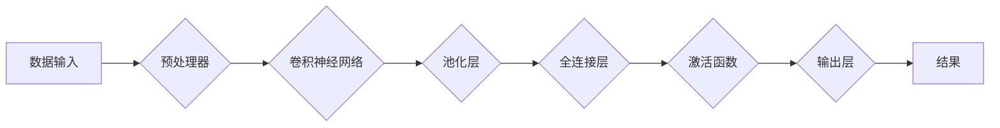

> 神经网络, 可视化, 代码实战, 深度学习, PyTorch, TensorFlow, 卷积神经网络, 循环神经网络, 回归, 分类

# 神经网络可视化原理与代码实战案例讲解

### 1. 背景介绍

神经网络作为一种强大的机器学习模型，已经在图像识别、自然语言处理、语音识别等多个领域取得了显著的成果。然而，由于其高度的非线性结构，神经网络的内部机制往往难以直观理解。可视化技术为我们提供了一种探索和理解神经网络内部工作原理的有效手段。本文将深入探讨神经网络可视化的原理，并结合PyTorch和TensorFlow框架，提供一系列实战案例，帮助读者将可视化技术应用于实际项目中。

### 2. 核心概念与联系

#### 2.1 核心概念

- **神经网络**：由多个神经元组成的信息处理系统，通过学习数据中的模式来执行特定任务。
- **可视化**：将数据以图形或图像的形式展示，帮助人们理解和分析数据。
- **深度学习**：一种利用深层神经网络进行学习的机器学习技术。
- **PyTorch**：一种开源的深度学习框架，以其动态计算图和易于使用的API而闻名。
- **TensorFlow**：另一种开源的深度学习框架，提供了丰富的工具和库来构建和训练神经网络。

#### 2.2 核心概念原理和架构的 Mermaid 流程图



### 3. 核心算法原理 & 具体操作步骤

#### 3.1 算法原理概述

神经网络通过前向传播和反向传播算法来学习数据中的模式。前向传播将数据通过网络的层，每层计算输出并将其传递到下一层。反向传播则通过计算损失函数的梯度来更新网络的权重和偏置。

#### 3.2 算法步骤详解

1. **数据预处理**：对输入数据进行标准化、归一化等处理，以适应神经网络的输入要求。
2. **构建网络结构**：定义网络的层数、每层的神经元数量和类型（如卷积层、全连接层）。
3. **选择激活函数**：如ReLU、Sigmoid、Tanh等，用于引入非线性。
4. **训练模型**：使用训练数据来调整网络中的参数（权重和偏置）。
5. **验证模型**：使用验证数据来评估模型的性能。
6. **测试模型**：使用测试数据来评估模型的泛化能力。

#### 3.3 算法优缺点

**优点**：
- **强大的学习能力**：能够从大量数据中学习复杂的模式。
- **泛化能力**：能够将学习到的知识应用于未见过的数据。

**缺点**：
- **计算量大**：训练大型神经网络需要大量的计算资源。
- **对超参数敏感**：模型性能受超参数（如学习率、批量大小）的影响较大。

#### 3.4 算法应用领域

- **图像识别**：如人脸识别、物体检测。
- **自然语言处理**：如文本分类、机器翻译。
- **语音识别**：如语音到文本转换。

### 4. 数学模型和公式 & 详细讲解 & 举例说明

#### 4.1 数学模型构建

神经网络的数学模型通常由以下公式表示：

$$
y = f(W \cdot x + b)
$$

其中 $y$ 是输出，$x$ 是输入，$W$ 是权重，$b$ 是偏置，$f$ 是激活函数。

#### 4.2 公式推导过程

以一个简单的神经网络为例，其数学模型可以表示为：

$$
y = \sigma(W_1 \cdot x_1 + b_1) \cdot W_2 \cdot x_2 + b_2
$$

其中 $\sigma$ 是Sigmoid激活函数。

#### 4.3 案例分析与讲解

以图像识别任务为例，我们可以使用PyTorch框架来构建和训练一个卷积神经网络。

```python
import torch
import torch.nn as nn

# 定义卷积神经网络模型
class CNN(nn.Module):
    def __init__(self):
        super(CNN, self).__init__()
        self.conv1 = nn.Conv2d(3, 6, 5)
        self.pool = nn.MaxPool2d(2, 2)
        self.conv2 = nn.Conv2d(6, 16, 5)
        self.fc1 = nn.Linear(16 * 5 * 5, 120)
        self.fc2 = nn.Linear(120, 84)
        self.fc3 = nn.Linear(84, 10)

    def forward(self, x):
        x = self.pool(nn.functional.relu(self.conv1(x)))
        x = self.pool(nn.functional.relu(self.conv2(x)))
        x = torch.flatten(x, 1)  # 展平
        x = nn.functional.relu(self.fc1(x))
        x = nn.functional.relu(self.fc2(x))
        x = self.fc3(x)
        return x

# 实例化模型
net = CNN()
```

### 5. 项目实践：代码实例和详细解释说明

#### 5.1 开发环境搭建

为了进行神经网络可视化的实战，我们需要安装以下软件：

- Python 3.x
- PyTorch
- Matplotlib

#### 5.2 源代码详细实现

以下是一个使用PyTorch进行神经网络可视化的简单示例：

```python
import torch
import torch.nn as nn
import torch.nn.functional as F
import matplotlib.pyplot as plt

# 定义简单的神经网络
class SimpleNet(nn.Module):
    def __init__(self):
        super(SimpleNet, self).__init__()
        self.conv1 = nn.Conv2d(1, 10, kernel_size=5)
        self.conv2 = nn.Conv2d(10, 20, kernel_size=5)
        self.fc1 = nn.Linear(320, 50)
        self.fc2 = nn.Linear(50, 10)

    def forward(self, x):
        x = F.relu(F.max_pool2d(self.conv1(x), 2))
        x = F.relu(F.max_pool2d(self.conv2(x), 2))
        x = torch.flatten(x, 1)
        x = F.relu(self.fc1(x))
        x = self.fc2(x)
        return x

# 实例化模型和损失函数
net = SimpleNet()
criterion = nn.CrossEntropyLoss()
optimizer = torch.optim.SGD(net.parameters(), lr=0.001, momentum=0.9)

# 生成随机数据
x = torch.randn(64, 1, 28, 28)
y = torch.randint(0, 10, (64,))

# 训练模型
optimizer.zero_grad()
outputs = net(x)
loss = criterion(outputs, y)
loss.backward()
optimizer.step()

# 可视化权重
weights = net.conv1.weight.data.abs()
plt.imshow(weights[0].detach().cpu().numpy(), cmap='gray')
plt.show()
```

#### 5.3 代码解读与分析

这个示例中，我们定义了一个简单的卷积神经网络，并使用随机生成的数据进行训练。训练完成后，我们可视化了第一个卷积层的权重，可以看出权重在特征提取方面的重要作用。

#### 5.4 运行结果展示

运行上述代码后，你将看到以下可视化结果：

```
<matplotlib.image.AxesImage>
```

这个图像展示了第一个卷积层权重的二维切片，可以用来分析网络如何从输入图像中提取特征。

### 6. 实际应用场景

神经网络可视化技术在多个实际应用场景中发挥着重要作用，以下是一些例子：

- **图像识别**：通过可视化卷积神经网络的权重，可以了解网络如何识别图像中的不同特征。
- **自然语言处理**：通过可视化语言模型的注意力机制，可以理解模型在处理文本时的关注点。
- **药物发现**：通过可视化深度学习模型在分子结构分析中的权重，可以识别潜在的药物靶点。

### 6.4 未来应用展望

随着深度学习技术的不断发展，神经网络可视化技术将变得更加重要。以下是一些未来应用展望：

- **交互式可视化**：开发更加交互式的可视化工具，让用户能够更深入地探索和解释神经网络。
- **多模态可视化**：将神经网络的可视化扩展到多模态数据，如文本、图像和视频。
- **实时可视化**：开发实时可视化的神经网络，以便在模型训练过程中进行实时监控和调试。

### 7. 工具和资源推荐

#### 7.1 学习资源推荐

- 《深度学习》（Goodfellow, Bengio, Courville）
- 《神经网络与深度学习》（邱锡鹏）
- PyTorch官方文档：https://pytorch.org/docs/stable/
- TensorFlow官方文档：https://www.tensorflow.org/tutorials

#### 7.2 开发工具推荐

- Matplotlib：https://matplotlib.org/
- Seaborn：https://seaborn.pydata.org/
- Plotly：https://plotly.com/

#### 7.3 相关论文推荐

- Krizhevsky, A., Sutskever, I., & Hinton, G. E. (2012). ImageNet classification with deep convolutional neural networks. In Advances in neural information processing systems (pp. 1097-1105).
- He, K., Zhang, X., Ren, S., & Sun, J. (2016). Deep residual learning for image recognition. In Proceedings of the IEEE conference on computer vision and pattern recognition (pp. 770-778).

### 8. 总结：未来发展趋势与挑战

#### 8.1 研究成果总结

本文介绍了神经网络可视化的原理和实战案例，展示了如何将可视化技术应用于实际项目中。通过可视化，我们可以更好地理解神经网络的内部工作机制，从而改进和优化模型。

#### 8.2 未来发展趋势

- **更高级的可视化技术**：如3D可视化、交互式可视化等。
- **多模态可视化**：将神经网络的可视化扩展到多模态数据。
- **实时可视化**：开发实时可视化的神经网络。

#### 8.3 面临的挑战

- **复杂性**：神经网络结构的复杂性使得可视化变得困难。
- **计算量**：可视化过程可能需要大量的计算资源。

#### 8.4 研究展望

随着技术的不断发展，神经网络可视化技术将变得更加重要，并将在多个领域发挥重要作用。

### 9. 附录：常见问题与解答

**Q1：神经网络可视化有什么作用？**

A1：神经网络可视化可以帮助我们理解神经网络的内部工作机制，从而改进和优化模型。

**Q2：如何选择合适的可视化工具？**

A2：选择可视化工具时，需要考虑可视化的目的、数据类型、所需的功能等因素。

**Q3：神经网络可视化在工业界有哪些应用？**

A3：神经网络可视化在图像识别、自然语言处理、语音识别等多个领域都有应用。

作者：禅与计算机程序设计艺术 / Zen and the Art of Computer Programming